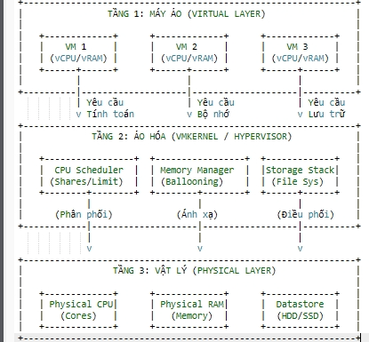
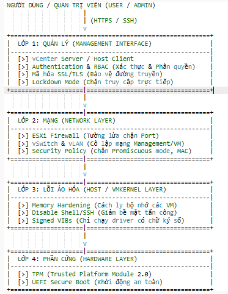
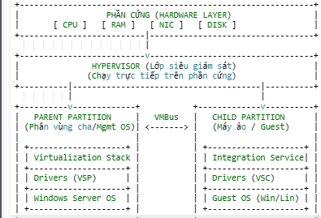
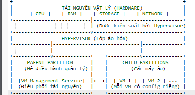

```

```

### Câu 1: So sánh VMware ESXi và VMware Workstation

| Tiêu chí             | VMware ESXi                                                                                                     | VMware Workstation                                                                                               |
| :------------------- | :-------------------------------------------------------------------------------------------------------------- | :--------------------------------------------------------------------------------------------------------------- |
| **Kiến trúc**        | **Bare-metal (Type 1 Hypervisor):** Cài đặt trực tiếp lên phần cứng máy chủ vật lý, không cần hệ điều hành nền. | **Hosted (Type 2 Hypervisor):** Cài đặt như một phần mềm ứng dụng trên nền hệ điều hành có sẵn (Windows, Linux). |
| **Hiệu suất**        | **Rất cao:** Do truy xuất trực tiếp phần cứng, không qua lớp trung gian OS.                                     | **Trung bình/Thấp:** Do phải đi qua lớp OS của máy trạm (Host OS) nên tốn tài nguyên và có độ trễ.               |
| **Quản lý**          | Quản lý tập trung qua vCenter Server hoặc giao diện Web (Host Client).                                          | Quản lý trực tiếp trên giao diện phần mềm tại máy cài đặt.                                                       |
| **Phạm vi ứng dụng** | Môi trường doanh nghiệp (Enterprise), trung tâm dữ liệu (Data Center), chạy các Server quan trọng 24/7.         | Môi trường cá nhân, thử nghiệm (Lab), phát triển phần mềm (Dev/Test), học tập.                                   |

---

### Câu 2: Kiến trúc tổng quát và thành phần chính của VMware ESXi

Kiến trúc của ESXi được thiết kế tối giản để đảm bảo hiệu năng và bảo mật.

**Các thành phần chính:**

1. **VMkernel:**
   - **Vai trò:** Là nhân (kernel) của hệ điều hành ảo hóa, thành phần quan trọng nhất.
   - **Chức năng:** Trực tiếp quản lý phần cứng (CPU, RAM, Disk, Network) và lập lịch (scheduling) tài nguyên cho các máy ảo. Nó đóng vai trò cầu nối giữa VM và phần cứng vật lý.
2. **Virtualization Layer (Lớp ảo hóa):**
   - **Vai trò:** Tạo ra môi trường ảo độc lập.
   - **Chức năng:** Cung cấp các thiết bị phần cứng ảo (vCPU, vRAM, vSwitch...) cho từng máy ảo, giúp máy ảo "nghĩ" rằng nó đang chạy trên máy thật.
3. **User World (Management Agents):**
   - **Vai trò:** Môi trường quản lý.
   - **Chức năng:** Chứa các tiến trình quản trị như `hostd` (quản lý máy chủ), `vpxa` (kết nối với vCenter), giúp quản trị viên cấu hình ESXi thông qua giao diện dòng lệnh hoặc giao diện web.
4. **Hardware Drivers:**
   - Các trình điều khiển thiết bị được tích hợp vào VMkernel để giao tiếp với phần cứng vật lý.

---

### Câu 3: Sơ đồ kiến trúc VMware ESXi Server


**Giải thích sơ đồ:**

- **Tầng dưới cùng (Hardware):** Là máy chủ vật lý (CPU, RAM, NIC, HBA).
- **Tầng giữa (Hypervisor - ESXi):** VMkernel chạy trực tiếp trên Hardware. Nó kiểm soát mọi yêu cầu từ trên xuống. Bên cạnh VMkernel là các Management Agents để người dùng điều khiển.
- **Tầng trên cùng (Virtual Machines):** Các máy ảo chạy trên nền tảng ảo hóa. Chúng không tương tác trực tiếp với phần cứng mà phải đi qua VMkernel.

---

### Câu 4: Cơ chế quản lý tài nguyên trên ESXi

**Các loại tài nguyên quản lý:** CPU, Memory (RAM), Storage (Disk I/O), và Network (Bandwidth).

**Các khái niệm quản lý tài nguyên:**

1. **Resource Pool (Bể tài nguyên):**
   - Là một phương pháp gom nhóm tài nguyên. Bạn có thể chia tổng tài nguyên của máy chủ thành các "bể" nhỏ (ví dụ: Bể cho Kế toán, Bể cho IT) và gán các VM vào đó để dễ quản lý phân cấp.
2. **Reservation (Đặt trước - Đảm bảo tối thiểu):**
   - Là lượng tài nguyên **tối thiểu** được đảm bảo dành riêng cho một VM hoặc Resource Pool.
   - _Ví dụ:_ Reservation 4GB RAM nghĩa là VM luôn luôn có sẵn 4GB để dùng, hệ thống không bao giờ lấy đi, ngay cả khi VM đang tắt (ở một số cấu hình) hoặc rảnh rỗi.
3. **Limit (Giới hạn - Mức trần):**
   - Là lượng tài nguyên **tối đa** mà VM được phép sử dụng.
   - _Ví dụ:_ Limit 2GHz CPU. Dù máy chủ vật lý còn dư rất nhiều CPU, VM này cũng không bao giờ được chạy quá 2GHz.
4. **Shares (Cổ phần - Độ ưu tiên):**
   - Chỉ có tác dụng khi hệ thống bị **tranh chấp tài nguyên** (quá tải).
   - VM nào có chỉ số Shares cao hơn (High) sẽ được ưu tiên cấp phát tài nguyên nhiều hơn so với VM có Shares thấp (Low) khi tài nguyên khan hiếm.

---

### Câu 5: Cơ chế phân phối CPU và RAM

**1. Cơ chế phân phối:**

- **CPU:** ESXi sử dụng bộ lập lịch (Scheduler) để chia nhỏ thời gian sử dụng CPU vật lý thành các lát cắt (time slices) và phân phối cho các vCPU của máy ảo.
- **RAM:** ESXi cấp phát RAM khi VM yêu cầu. Nếu RAM vật lý cạn kiệt, ESXi sử dụng các kỹ thuật thu hồi bộ nhớ như: _Transparent Page Sharing (TPS)_ (chia sẻ trang nhớ giống nhau), _Ballooning_ (vay mượn RAM từ VM rảnh), _Compression_ (nén RAM), hoặc _Swapping_ (chuyển RAM xuống ổ cứng).

**2. Vai trò của VMkernel:**

- VMkernel hoạt động như một "Cảnh sát giao thông". Nó nhận tất cả các yêu cầu tính toán từ hàng loạt máy ảo, sắp xếp hàng đợi và quyết định máy ảo nào được truy xuất vào CPU/RAM vật lý tại thời điểm nào dựa trên chính sách đã cấu hình (Shares, Reservation).

**3. Khi nhiều VM yêu cầu cùng một tài nguyên (Tranh chấp - Contention):**

- Nếu tổng yêu cầu < Tài nguyên vật lý: Mọi VM đều được đáp ứng đầy đủ.
- Nếu tổng yêu cầu > Tài nguyên vật lý (Nghẽn):
  - VMkernel sẽ kiểm tra **Reservation** trước để đảm bảo mức tối thiểu cho các VM quan trọng.
  - Phần tài nguyên còn lại sẽ được chia dựa trên tỷ lệ **Shares**. VM có Shares `High` sẽ nhận được tài nguyên gấp đôi `Normal` và gấp 4 lần `Low`.

Chào bạn, dưới đây là nội dung trả lời tiếp theo cho các câu hỏi từ 6 đến 10, tập trung vào kiến trúc và bảo mật của VMware ESXi và Hyper-V.

---

### Câu 6: Sơ đồ và Quản lý tài nguyên (CPU, RAM, Storage)



**Giải thích các thành phần trong sơ đồ:**

1. **Tài nguyên Vật lý (Physical Resources):** Đây là phần cứng thật (CPU Cores, RAM module, Ổ cứng HDD/SSD).
2. **Bộ lập lịch và quản lý (Resource Scheduler - VMkernel):** Nằm ở giữa.
   - **CPU Scheduler:** Chia nhỏ thời gian xử lý của CPU vật lý và gán cho các vCPU của máy ảo.
   - **Memory Manager:** Quản lý bảng trang nhớ (Page table), ánh xạ RAM ảo của VM sang RAM vật lý. Sử dụng kỹ thuật _Ballooning_ để thu hồi RAM khi thiếu.
   - **Storage Stack:** Quản lý hệ thống file VMFS, điều phối luồng dữ liệu đọc/ghi (I/O) xuống ổ cứng.
3. **Tài nguyên Ảo (Virtual Resources):** Là những gì hệ điều hành máy ảo nhìn thấy (ví dụ: VM thấy mình có 4GB RAM, nhưng thực tế là do VMkernel ánh xạ từ phần cứng lên).

---

### Câu 7: Các mối đe dọa bảo mật trong hệ thống ảo hóa

**1. Các mối đe dọa chính:**

- **VM Escape (Thoát khỏi máy ảo):** Đây là mối nguy hiểm nghiêm trọng nhất. Tin tặc chiếm quyền kiểm soát một máy ảo (Guest), sau đó lợi dụng lỗ hổng của lớp ảo hóa để "thoát" ra ngoài và tấn công trực tiếp vào máy chủ vật lý (Host) hoặc các VM khác.
- **VM Hopping:** Tin tặc tấn công một máy ảo yếu, sau đó dùng nó làm bàn đạp để nhảy sang tấn công các máy ảo khác nằm trên cùng một máy chủ vật lý (do dùng chung vSwitch hoặc cấu hình mạng lỏng lẻo).
- **Resource Exhaustion (Tấn công từ chối dịch vụ - DoS):** Một máy ảo bị nhiễm mã độc cố tình chiếm dụng 100% CPU/RAM/Disk I/O, khiến máy chủ vật lý bị treo và làm tê liệt toàn bộ các máy ảo khác.
- **Rogue VM (Máy ảo lạ):** Kẻ xấu tạo ra một máy ảo trái phép trong hệ thống để đánh cắp dữ liệu hoặc nghe lén luồng mạng.

**Ví dụ minh họa:**
Một Web Server (VM1) bị lộ lỗ hổng SQL Injection. Hacker xâm nhập VM1. Nếu ESXi chưa được vá lỗi bảo mật, hacker khai thác lỗi tràn bộ đệm của ESXi từ VM1 để chiếm quyền `root` của ESXi Host. Từ đó, hacker xóa sạch toàn bộ các VM khác (Database, Mail...) đang chạy trên Host đó.

---

### Câu 8: Cơ chế và phương pháp bảo mật chính trên ESXi

**1. Cơ chế bảo vệ:**

- **Bảo vệ Hệ thống (Host Level):**
  - **Lockdown Mode:** Chế độ này chặn mọi truy cập điều khiển từ xa trực tiếp vào Host, buộc quản trị viên phải đi qua vCenter Server (nơi có kiểm soát quyền chặt chẽ hơn).
  - **ESXi Firewall:** Tường lửa tích hợp sẵn chặn các cổng (port) không cần thiết, chỉ mở các port dịch vụ quản lý.
- **Bảo vệ Mạng (Network Level):**
  - **vLAN (Virtual LAN):** Phân tách các luồng dữ liệu (ví dụ: traffic quản lý tách biệt hoàn toàn với traffic của máy ảo).
  - **Security Policy trên vSwitch:** Chặn các chế độ nguy hiểm như _Promiscuous Mode_ (chặn nghe lén) và _MAC Address Changes_ (chặn giả mạo MAC).
- **Bảo vệ Máy ảo (VM Level):**
  - **VMware Tools:** Cập nhật driver và bản vá lỗi thường xuyên.
  - **UEFI Secure Boot:** Đảm bảo máy ảo chỉ khởi động các OS đã được xác thực, chống lại rootkit.

**2. Công cụ hỗ trợ:**

- **vCenter Server:** Quản lý tập trung, phân quyền (Role-based Access Control).
- **VMware NSX:** Giải pháp bảo mật mạng nâng cao (Micro-segmentation).

---

### Câu 9: Sơ đồ kiến trúc bảo mật trên ESXi Server



**Giải thích các lớp bảo vệ:**

1. **Management Interface Layer (Lớp quản lý):** Kiểm soát ai được login vào hệ thống. Sử dụng mã hóa (SSL/TLS) cho các kết nối vSphere Client/Web Client.
2. **Network Layer (Lớp mạng):** Sử dụng vSwitch và Firewall ảo để kiểm soát luồng gói tin ra/vào Host và giữa các VM.
3. **Host/Hypervisor Layer (Lớp lõi):** Nơi VMkernel hoạt động. Được bảo vệ bằng cách tắt SSH, tắt Shell khi không dùng, và chỉ chạy các service tối thiểu (giảm bề mặt tấn công).
4. **Hardware Layer (Lớp phần cứng):** Sử dụng TPM (Trusted Platform Module) để mã hóa và xác thực tính toàn vẹn của phần cứng khi khởi động.

---

### Câu 10: Kiến trúc tổng quan của Hyper-V

**1. Kiến trúc tổng quan:**
Hyper-V sử dụng kiến trúc **Microkernelized (Vi nhân)** loại 1 (Bare-metal). Điểm đặc biệt là Hyper-V dựa vào một phân vùng đặc biệt gọi là "Parent Partition" để quản lý driver thiết bị.

**2. Các thành phần chính và vai trò:**

- **Hypervisor Layer (Lớp siêu giám sát):** Chạy trực tiếp trên phần cứng (Ring -1). Nó quản lý việc phân chia CPU và bộ nhớ cho các phân vùng.
- **Root Partition (Parent Partition - Phân vùng cha):**
  - Đây là hệ điều hành Windows Server đầu tiên được cài đặt (chính là OS bạn dùng để bật Hyper-V).
  - **Vai trò:** Quản lý ngăn xếp ảo hóa (Virtualization Stack), chứa các trình điều khiển thiết bị thực (Drivers) và tạo/quản lý các phân vùng con.
- **Child Partitions (Guest Partitions - Phân vùng con):**
  - Đây chính là các Máy ảo (VM).
  - **Vai trò:** Chạy hệ điều hành khách (Guest OS). Các VM này không truy cập trực tiếp phần cứng mà giao tiếp qua VMBus.
- **VMBus:**
  - **Vai trò:** Kênh liên lạc tốc độ cao giữa Phân vùng cha và Phân vùng con để truyền tải các yêu cầu phần cứng (như ghi đĩa, gửi gói tin mạng).

### Câu 11: So sánh Kiến trúc ảo hóa Hyper-V và VMware ESXi

**1. Bảng so sánh chi tiết:**

| **Tiêu chí**               | **VMware ESXi**                                                                                              | **Microsoft Hyper-V**                                                                                                               |
| -------------------------- | ------------------------------------------------------------------------------------------------------------ | ----------------------------------------------------------------------------------------------------------------------------------- |
| **Kiến trúc Lõi (Kernel)** | **Monolithic (Nguyên khối):**Các driver thiết bị được tích hợp trực tiếp vào trong VMkernel.                 | **Microkernelized (Vi nhân):**Driver thiết bị nằm ở phân vùng cha (Parent Partition/Management OS), không nằm trong lớp Hypervisor. |
| **Quản lý VM**             | Quản lý qua**vCenter Server**(tập trung) hoặc Host Client (đơn lẻ). Giao diện web là chủ đạo.                | Quản lý qua**System Center (SCVMM)**hoặc**Hyper-V Manager** . Giao diện Windows native là chủ đạo.                                  |
| **Tính năng bảo mật**      | Sử dụng VM Encryption, Secure Boot, TPM 2.0. Mô hình phân quyền RBAC rất chặt chẽ.                           | Nổi bật với**Shielded VMs**(mã hóa VM để Admin Host không xem được dữ liệu bên trong), Guarded Fabric.                              |
| **Khả năng mở rộng**       | Rất cao, thường dẫn đầu về hỗ trợ số lượng vCPU/RAM khổng lồ cho 1 VM. Chuẩn công nghiệp cho Enterprise lớn. | Đã tiệm cận ESXi, hỗ trợ tốt cho hầu hết nhu cầu doanh nghiệp vừa và lớn.                                                           |

**2. Đánh giá ưu/nhược điểm của Hyper-V so với ESXi:**

- **Ưu điểm của Hyper-V:**
  - **Chi phí:** Đi kèm miễn phí với bản quyền Windows Server. Tiết kiệm chi phí đáng kể nếu doanh nghiệp đã dùng hệ sinh thái Microsoft.
  - **Dễ sử dụng:** Giao diện quen thuộc với quản trị viên Windows.
  - **Tương thích:** Hỗ trợ driver phần cứng cực tốt vì chạy trên nền Windows.
- **Nhược điểm:**
  - **Hiệu suất:** Do kiến trúc Microkernelized, các lệnh I/O phải đi qua phân vùng cha (Parent Partition) nên độ trễ có thể cao hơn ESXi (truy cập trực tiếp) một chút.
  - **Bảo trì:** Cần vá lỗi (patch) cả hệ điều hành Windows ở phân vùng cha, gây gián đoạn nhiều hơn (trừ khi có Cluster).

---

### Câu 12: Sơ đồ kiến trúc Hyper-V và giải thích

**Sơ đồ kiến trúc Hyper-V**



**Giải thích cách hoạt động:**

1. **Hypervisor:** Là lớp phần mềm mỏng chạy trực tiếp trên phần cứng, chia cắt tài nguyên vật lý thành các phân vùng (Partition).
2. **Parent Partition (Phân vùng cha):** Đây là hệ điều hành quản lý (Windows Server). Nó chứa các trình điều khiển thiết bị thực và **VSP (Virtualization Service Provider)** .
3. **Child Partition (Phân vùng con - Máy ảo):** Chứa **VSC (Virtualization Service Client)** . Khi máy ảo cần ghi dữ liệu xuống đĩa cứng, nó không làm trực tiếp mà gửi yêu cầu qua đường ống tốc độ cao gọi là **VMBus** .
4. **VMBus:** Nhận yêu cầu từ VSC (ở máy con), chuyển sang VSP (ở máy cha). Máy cha sẽ dùng driver thực để ghi xuống ổ cứng vật lý rồi trả kết quả lại.

---

### Câu 13: Tổng quan về Ảo hóa

1. Ảo hóa là gì?
   Là công nghệ cho phép tạo ra các phiên bản ảo (virtual) của tài nguyên máy tính (như phần cứng, hệ điều hành, thiết bị lưu trữ) trên một nền tảng vật lý duy nhất. Nó giúp một máy chủ vật lý chạy được nhiều máy chủ ảo độc lập cùng lúc.
2. **Các loại ảo hóa:**
   - **Ảo hóa Máy chủ (Server Virtualization):** Phổ biến nhất (Hyper-V, ESXi).
   - **Ảo hóa Mạng (Network Virtualization):** VLAN, SDN.
   - **Ảo hóa Lưu trữ (Storage Virtualization):** SAN, vSAN.
   - **Ảo hóa Ứng dụng (Application Virtualization):** Docker, App-V.
   - **Ảo hóa Máy trạm (Desktop Virtualization - VDI).**
3. **Ưu điểm:**
   - **Tiết kiệm chi phí:** Giảm số lượng máy chủ vật lý cần mua, giảm tiền điện, điều hòa.
   - **Linh hoạt:** Triển khai máy chủ mới trong vài phút thay vì vài ngày.
   - **An toàn & Khôi phục:** Dễ dàng sao lưu (Backup), chụp nhanh (Snapshot) và khôi phục thảm họa.

---

### Câu 14: Các loại tài nguyên quản lý trên Hyper-V

**Các loại tài nguyên chính:**

1. **CPU (Bộ vi xử lý):** Quản lý dưới dạng vCPU. Có thể giới hạn số lượng core và tỷ lệ sử dụng cho mỗi VM.
2. **RAM (Bộ nhớ):** Quản lý dung lượng bộ nhớ cấp cho VM. Có thể là tĩnh (Static) hoặc động (Dynamic).
3. **Disk (Lưu trữ):** Sử dụng các file định dạng `.vhdx` hoặc `.vhd` để làm ổ cứng ảo. Quản lý dung lượng và tốc độ đọc ghi (IOPS).
4. **Network (Mạng):** Sử dụng **vSwitch** (Virtual Switch) để kết nối VM ra mạng ngoài hoặc kết nối các VM với nhau.

**Vai trò của việc quản lý tài nguyên:**

- **Đảm bảo hiệu suất:** Ngăn chặn một VM chiếm dụng hết tài nguyên làm treo các VM khác.
- **Tối ưu chi phí:** Tận dụng tối đa phần cứng, không để lãng phí tài nguyên nhàn rỗi.
- **Cam kết chất lượng dịch vụ (QoS):** Đảm bảo các VM quan trọng (như Database) luôn có đủ tài nguyên để chạy mượt mà.

---

### Câu 15: Phân bổ và Tối ưu hóa tài nguyên trong Hyper-V

**1. Cách phân bổ (Allocation):**

- **CPU:** Vào Settings của VM -> Processor -> Chọn số lượng vCPU (Number of virtual processors).
  - _Lưu ý:_ Không nên gán tổng vCPU của các VM vượt quá số luồng (Threads) của CPU vật lý quá nhiều (tỷ lệ an toàn 2:1 hoặc 4:1).
- **RAM:** Vào Settings -> Memory -> Điền số RAM khởi động (Startup RAM).

**2. Các tính năng Tối ưu hóa (Optimization):**

- **Dynamic Memory (Bộ nhớ động):** Đây là tính năng quan trọng nhất để tiết kiệm RAM.
  - _Startup RAM:_ RAM khi bật máy.
  - _Minimum RAM:_ Mức thấp nhất VM có thể co lại khi hệ thống thiếu RAM.
  - _Maximum RAM:_ Mức tối đa VM được phép dùng (để tránh tràn bộ nhớ Host).
  - _Memory Buffer:_ Phần trăm bộ nhớ đệm dự phòng để cấp ngay khi VM cần gấp (mặc định 20%).
- **Resource Control (Kiểm soát tài nguyên - CPU):**
  - _Virtual Machine Reserve (Dự trữ):_ % CPU tối thiểu luôn dành riêng cho VM này.
  - _Virtual Machine Limit (Giới hạn):_ % CPU tối đa VM được dùng (ví dụ: set 50% để VM không bao giờ làm nóng máy quá mức).
  - _Relative Weight (Trọng số):_ Độ ưu tiên (mặc định 100). VM nào có Weight cao hơn sẽ được ưu tiên dùng CPU khi hệ thống quá tải.

### Câu 16: Sơ đồ và Quản lý tài nguyên trên Hyper-V

**1. Sơ đồ minh họa (Text Diagram):**



**2. Cách quản lý tài nguyên cho nhiều VM:**

- **Cơ chế chia sẻ:** Hyper-V không để các VM tranh giành tự do. Nó sử dụng **Parent Partition** để làm "trọng tài".
- **Dynamic Memory (Bộ nhớ động):** Khi nhiều VM chạy cùng lúc, Hyper-V tự động lấy bớt RAM của VM đang rảnh (Idle) để đắp sang cho VM đang tải nặng (Heavy Load), dựa trên thông số _Startup RAM_ và _Maximum RAM_ .
- **Weight/Shares (Trọng số):** Nếu CPU vật lý bị quá tải (100%), VM nào được cấu hình "Relative Weight" cao hơn sẽ được ưu tiên xử lý trước.
- **Resource Metering:** Tính năng giúp Admin theo dõi xem mỗi VM đã dùng bao nhiêu tài nguyên để điều chỉnh cho phù hợp.

---

### Câu 17: So sánh VMware ESX (Cũ) và VMware ESXi (Mới)

| **Tiêu chí**  | **VMware ESX (Legacy)**                                                                                   | **VMware ESXi (Modern)**                                                                                                                 |
| ------------- | --------------------------------------------------------------------------------------------------------- | ---------------------------------------------------------------------------------------------------------------------------------------- |
| **Kiến trúc** | Có**Service Console**(một hệ điều hành Linux đầy đủ) chạy song song với VMkernel để quản lý. Khá nặng nề. | Kiến trúc**Thin Hypervisor** . Loại bỏ Service Console, tích hợp thẳng chức năng quản lý vào VMkernel. Rất nhẹ (chỉ khoảng vài trăm MB). |
| **Bảo mật**   | Thấp hơn. Do Service Console là Linux nên có nhiều lỗ hổng bảo mật, cần vá lỗi thường xuyên.              | Cao hơn. Do kích thước nhỏ (Small footprint), bề mặt tấn công (Attack surface) ít hơn hẳn.                                               |
| **Quản lý**   | Dùng dòng lệnh Linux hoặc vSphere Client cũ.                                                              | Dùng**DCUI**(giao diện menu text trên server), vSphere Web Client, hoặc PowerCLI.                                                        |
| **Ưu/Nhược**  | **Ưu:**Dễ dùng script Linux cũ.**Nhược:**Nặng, kém an toàn.                                               | **Ưu:**Nhanh, nhẹ, an toàn, chuẩn công nghiệp hiện nay.**Nhược:**Khó dùng script Linux cũ trực tiếp, phải dùng API.                      |

---

### Câu 18: Case Study - Công ty ABC (5 Server vật lý)

**1. Lợi ích triển khai ảo hóa:**

- **Tiết kiệm:** Giảm tiền điện, tiền làm mát (cho 5 máy xuống còn 2), giảm không gian đặt máy.
- **Quản lý:** Backup/Restore toàn bộ máy chủ (Web, Mail...) thành các file ảnh (Image) rất nhanh.
- **Tận dụng tài nguyên:** Máy vật lý cũ thường chỉ dùng 10-20% hiệu năng, ảo hóa giúp đẩy hiệu năng sử dụng lên 70-80%.

**2. Đề xuất phương án:**

- **Phần cứng:** Mua **02 Máy chủ vật lý mới** cấu hình mạnh + **01 thiết bị lưu trữ chung (SAN/NAS)** .
- **Tại sao 02 máy?** Để chạy cơ chế **High Availability (HA)** . Nếu 1 máy chủ vật lý hỏng, toàn bộ 5 máy ảo (Email, Web, DB...) tự động chạy sang máy còn lại. Không bị gián đoạn dịch vụ.

**3. Các bước triển khai:**

1. **Khảo sát:** Đo đạc CPU/RAM hiện tại của 5 máy cũ.
2. **Chuẩn bị:** Mua 2 máy chủ mới, cài VMware ESXi hoặc Hyper-V.
3. **P2V (Physical to Virtual):** Dùng công cụ (như VMware Converter) để chuyển đổi 5 máy vật lý thành 5 file máy ảo.
4. **Kiểm thử (Test):** Chạy thử máy ảo, tắt máy vật lý cũ.
5. **Go-live:** Chuyển đổi chính thức.

---

### Câu 19: Khắc phục sự cố mạng (VMware vSphere)

**1. Nguyên nhân phổ biến:**

- **Sai VLAN:** VM được gán vào Port Group sai VLAN ID.
- **Ngắt kết nối ảo:** Trong phần cài đặt VM, mục Network Adapter bị bỏ tick ô "Connected".
- **Lỗi vSwitch:** Card mạng vật lý (Uplink) nối vào vSwitch bị lỏng dây hoặc hỏng.
- **Xung đột IP:** Hai VM trùng IP.

**2. Quy trình khắc phục:**

1. **Kiểm tra Guest OS:** Ping thử ra gateway từ bên trong VM. Kiểm tra IP/Subnet Mask.
2. **Kiểm tra VM Settings:** Vào Edit Settings -> Xem Network Adapter đã chọn đúng Port Group chưa? Ô "Connect at power on" có tick không?
3. **Kiểm tra Host:** Vào ESXi/vCenter -> Xem vSwitch có báo mất kết nối Physical NIC (dấu chéo đỏ) không.
4. **Kiểm tra VLAN:** Đảm bảo Switch vật lý bên ngoài đã cấu hình Trunking/VLAN khớp với cấu hình vSwitch.

---

### Câu 20: Case Study - Bảo mật cho Ngân hàng

**1. Phân tích rủi ro:**

- **VM Escape:** Hacker từ máy ảo Web Server nhảy ra chiếm quyền máy chủ vật lý, từ đó đánh cắp dữ liệu DB.
- **Sniffing:** Các máy ảo chung vSwitch có thể nghe lén gói tin của nhau nếu cấu hình sai.
- **Admin Rogue:** Người quản trị hệ thống ảo hóa có quyền copy file ổ cứng máy ảo (chứa dữ liệu ngân hàng) mang về nhà.

**2. Giải pháp bảo mật chi tiết:**

- **Network Segmentation:** Tách riêng VLAN cho Giao dịch, DB, và Quản lý. Cấu hình Firewall giữa các VLAN.
- **Mã hóa VM (VM Encryption):** Mã hóa toàn bộ file ổ cứng máy ảo. Dù admin copy file về cũng không mở được nếu không có khóa (KMS).
- **Phân quyền (Least Privilege):** Admin chỉ được quản lý tài nguyên, không được xem dữ liệu bên trong Guest OS.
- **Cập nhật:** Vá lỗi ESXi/Hyper-V định kỳ để chống lỗ hổng Zero-day.

---

### Câu 21: Hiệu năng hệ thống chậm (Ứng dụng nặng dữ liệu)

**1. Phân tích nguyên nhân:**

- **Nghẽn ổ cứng (Disk Latency):** Ứng dụng Data nặng (Database) yêu cầu IOPS cao, nhưng ổ cứng vật lý (HDD) không đáp ứng kịp.
- **CPU Co-stop:** Gán quá nhiều vCPU cho 1 VM (Over-provisioning) khiến VM phải chờ CPU vật lý rảnh đủ số core mới chạy được, gây giật lag.
- **Thiếu RAM:** VM bị swap bộ nhớ xuống ổ cứng.

**2. Giải pháp cải thiện:**

- **Nâng cấp Storage:** Chuyển sang dùng SSD hoặc NVMe cho các Database Server.
- **Tinh chỉnh vCPU:** Giảm số vCPU về mức vừa đủ dùng (Right-sizing). "Nhiều vCPU hơn không phải lúc nào cũng nhanh hơn".
- **Traffic Shaping:** Dùng riêng card mạng vật lý cho luồng dữ liệu Storage (iSCSI/NFS) để không bị tranh chấp với mạng người dùng.

---

### Câu 22: Kế hoạch khôi phục sau thảm họa (DR)

**1. Các yếu tố cần xem xét:**

- **RPO (Recovery Point Objective):** Chấp nhận mất dữ liệu tối đa bao lâu? (Ví dụ: 15 phút).
- **RTO (Recovery Time Objective):** Thời gian tối đa để hệ thống chạy lại? (Ví dụ: 4 giờ).
- **Vị trí:** Site dự phòng (DR Site) phải cách xa Site chính để tránh cùng bị thiên tai (lũ lụt, động đất).

**2. Đề xuất kế hoạch DR:**

- **Giải pháp:** Sử dụng **VMware Site Recovery Manager (SRM)** hoặc **Veeam Replication** .
- **Cơ chế:**
  - Tại Site chính (Hồ Chí Minh): Chạy hệ thống bình thường.
  - Tại Site phụ (Hà Nội): Có sẵn máy chủ chờ. Dữ liệu được replicate (đồng bộ) liên tục từ HCM ra HN.
- **Quy trình:** Khi HCM bị sập -> Kích hoạt nút "Failover" -> Máy ảo tại HN tự động bật lên -> Chuyển hướng IP/DNS về HN -> Hoạt động tiếp tục.

---

### Câu 23: Kiến trúc ESXi (Chi tiết cho Ban lãnh đạo)

1. **Kiến trúc:** ESXi là **Bare-metal Hypervisor** (Kiến trúc lõi siêu nhỏ). Nó cài trực tiếp lên sắt (phần cứng), không cần Windows/Linux làm nền.
2. **Vai trò thành phần:**
   - _VMkernel:_ Bộ não trung tâm, phân chia CPU/RAM công bằng cho các máy ảo.
   - _Direct Drivers:_ Giúp hệ thống chạy cực nhanh vì không qua lớp trung gian.
3. **Tại sao nên dùng (Đề xuất):**
   - **Ổn định cao:** Ít thành phần thừa nên rất khó bị lỗi màn hình xanh hay treo máy.
   - **Tiêu chuẩn toàn cầu:** Dễ tuyển dụng nhân sự và tìm kiếm hỗ trợ.
   - **Tiết kiệm:** Tối ưu hóa phần cứng tốt hơn các giải pháp khác, giúp công ty chạy được nhiều VM hơn trên cùng 1 server.

---

### Câu 24: Cài đặt VMware ESXi

**1. Yêu cầu phần cứng:**

- CPU: x86_64 (Intel/AMD) có hỗ trợ ảo hóa (Intel-VT/AMD-V).
- RAM: Tối thiểu 4GB (Khuyên dùng 8GB+).
- NIC (Card mạng): Cần loại card mạng server (Intel/Broadcom) mà VMware hỗ trợ.

**2. Các bước cài đặt:**

- **Bước 1:** Tải file ISO ESXi từ trang chủ VMware -> Ghi ra USB (dùng Rufus).
- **Bước 2:** Cắm USB vào server, boot vào USB.
- **Bước 3:** Màn hình cài đặt hiện ra -> Nhấn Enter -> F11 (Đồng ý điều khoản).
- **Bước 4:** Chọn ổ đĩa cài đặt -> Chọn ngôn ngữ -> Đặt mật khẩu root (Quan trọng).
- **Bước 5:** F11 để Install -> Rút USB và Reboot.

**3. Truy cập:**

- Sau khi khởi động, màn hình server hiện IP (ví dụ: `192.168.1.10`).
- Dùng máy tính khác, mở trình duyệt web, gõ `https://192.168.1.10`. Đăng nhập bằng user `root` và mật khẩu vừa tạo.

---

### Câu 25: Quản lý tài nguyên cho 10 VM bị chậm

1. Phân tích vấn đề:

Đây là hiện tượng "Noisy Neighbor" (Hàng xóm ồn ào). Có thể 1-2 máy ảo (ví dụ Database lúc chạy báo cáo) chiếm hết tài nguyên, làm 8 máy còn lại bị nghẽn.

**2. Giải pháp đề xuất:**

- **Resource Pools (Bể tài nguyên):** Tạo 2 bể.
  - _Bể "Gold" (Ưu tiên cao):_ Chứa Database, Web Server bán hàng. Set `Shares = High`.
  - _Bể "Silver" (Ưu tiên thấp):_ Chứa File Server nội bộ. Set `Shares = Low`.
- **Reservation (Đặt chỗ):** Cấu hình Reservation RAM cho Database Server để đảm bảo nó luôn có đủ RAM chạy, không bao giờ bị máy khác tranh chấp.
- **Limit (Giới hạn):** Đặt Limit cho các máy Test/Dev để chúng không bao giờ được dùng quá 50% CPU, dành tài nguyên cho máy thật.

### Câu 25: Phân tích và Quản lý tài nguyên ESXi (Case Study 10 VM)

**1. Phân tích vấn đề:**

- **Tranh chấp tài nguyên (Resource Contention):** Nguyên nhân chính là hiện tượng "Noisy Neighbor" (Hàng xóm ồn ào). Khi Database Server xử lý nặng, nó chiếm dụng CPU/RAM vật lý, khiến Web Server và File Server bị "đói" tài nguyên.
- **Cấp phát chưa hợp lý:** Có thể các máy ảo quan trọng (Database) không được đặt mức ưu tiên cao hơn các máy ít quan trọng (File Server).

**2. Giải pháp quản lý tài nguyên:**

- **Sử dụng Shares (Cổ phần):** Thiết lập CPU/Memory Shares cho Database ở mức `High`, Web Server ở mức `Normal`, và File Server ở mức `Low`. Khi nghẽn, Database sẽ được ưu tiên xử lý trước.
- **Sử dụng Reservation (Đặt trước):** Cấu hình Reservation cho RAM của Database Server (ví dụ: cam kết 16GB). Điều này đảm bảo Database luôn có đủ RAM để chạy mượt mà bất kể hệ thống có tải nặng thế nào.
- **Resource Pools (Bể tài nguyên):** Gom nhóm các máy ảo theo phòng ban hoặc mức độ quan trọng để quản lý cấp phát tổng thể dễ dàng hơn.

---

### Câu 26: Nguyên nhân hiệu năng kém và Tối ưu hóa (Tổng quát)

**1. Các nguyên nhân phổ biến:**

- **CPU:** Gán quá nhiều vCPU cho 1 VM (Oversubscription) gây ra tình trạng _CPU Ready Time_ cao (VM phải chờ CPU vật lý rảnh mới được chạy).
- **Storage:** Ổ cứng vật lý tốc độ thấp (HDD) không đáp ứng nổi IOPS của 10 máy ảo cùng lúc.
- **Snapshot:** Để quên Snapshot quá lâu (file snapshot phình to) làm giảm tốc độ đọc/ghi đĩa nghiêm trọng.
- **Network:** Nghẽn băng thông do dùng chung 1 card mạng vật lý cho quá nhiều dịch vụ.

**2. Biện pháp tối ưu hóa:**

- **Gỡ bỏ Snapshot:** Xóa các Snapshot cũ không còn cần thiết (Consolidate).
- **Cài đặt VMware Tools:** Bắt buộc cài VMware Tools trên tất cả Guest OS để tối ưu driver màn hình, chuột và quản lý bộ nhớ.
- **Nâng cấp Storage:** Chuyển các VM quan trọng sang Datastore chạy ổ SSD/NVMe.
- **Traffic Shaping:** Phân tách lưu lượng mạng (VLAN) và sử dụng nhiều card mạng vật lý (NIC Teaming) để cân bằng tải.

---

### Câu 27: Bảo mật toàn diện cho ESXi Server

**1. Các rủi ro bảo mật phổ biến:**

- **Truy cập trái phép:** Hacker brute-force mật khẩu root hoặc khai thác các port quản lý mở rộng.
- **Nghe lén (Sniffing):** Dữ liệu quản lý không được mã hóa bị chặn bắt trên mạng nội bộ.
- **Lỗ hổng chưa vá:** ESXi phiên bản cũ dính lỗi bảo mật (CVE) cho phép hacker chiếm quyền điều khiển (Remote Code Execution).

**2. Đề xuất biện pháp bảo mật:**

- **Kích hoạt Lockdown Mode:** Ngăn chặn người dùng đăng nhập trực tiếp vào máy chủ ESXi, bắt buộc quản lý tập trung qua vCenter.
- **Phân đoạn mạng (Network Segmentation):** Tách mạng Management (quản lý) ra khỏi mạng VM Traffic bằng VLAN riêng biệt.
- **Cập nhật thường xuyên:** Cài đặt các bản vá lỗi (Security Patches) mới nhất từ VMware.
- **Tắt dịch vụ không cần thiết:** Vô hiệu hóa SSH Shell và ESXi Shell nếu không dùng để giảm bề mặt tấn công.

---

### Câu 28: So sánh HTTP và HTTPS

**1. Sự khác biệt:**

| **Tiêu chí**    | **HTTP (Hypertext Transfer Protocol)**                      | **HTTPS (Secure)**                                                                                 |
| --------------- | ----------------------------------------------------------- | -------------------------------------------------------------------------------------------------- |
| **Bảo mật**     | Không. Dữ liệu truyền đi dưới dạng văn bản rõ (Clear Text). | Có. Dữ liệu được mã hóa bằng SSL/TLS.                                                              |
| **Cổng (Port)** | Port 80.                                                    | Port 443.                                                                                          |
| **Hiệu năng**   | Nhanh hơn (do không mất công mã hóa).                       | Chậm hơn một chút (do quá trình bắt tay SSL Handshake) nhưng không đáng kể với phần cứng hiện nay. |

**2. Yếu tố bảo mật HTTPS bổ sung:**

- **Mã hóa (Encryption):** Chỉ người gửi và người nhận mới đọc được nội dung.
- **Toàn vẹn dữ liệu (Data Integrity):** Đảm bảo dữ liệu không bị sửa đổi trên đường truyền.
- **Xác thực (Authentication):** Chứng minh website là chính chủ (thông qua Chứng chỉ số - SSL Certificate), tránh giả mạo (Phishing).

**3. Tác động khi chuyển đổi:**

- **Người dùng:** An tâm hơn khi thấy biểu tượng "ổ khóa", bảo vệ thông tin cá nhân.
- **Quản trị viên:** Phải mua/cài đặt chứng chỉ SSL, quản lý hạn chứng chỉ, và cấu hình Redirect từ HTTP sang HTTPS.

---

### Câu 29: Rủi ro của HTTP và Biện pháp nâng cấp

**1. Phân tích rủi ro khi dùng HTTP:**

- **Man-in-the-Middle (MITM):** Hacker đứng giữa có thể đọc trộm toàn bộ username, password, số thẻ tín dụng của người dùng.
- **Tiêm nhiễm mã độc:** Hacker có thể chèn quảng cáo hoặc mã độc vào nội dung web mà người dùng đang xem (do không có tính năng kiểm tra toàn vẹn dữ liệu).

**2. Biện pháp nâng cấp và bảo vệ:**

- **Cài đặt SSL/TLS Certificate:** Mua chứng chỉ từ CA uy tín hoặc dùng Let's Encrypt (miễn phí).
- **Cấu hình 301 Redirect:** Tự động chuyển hướng mọi truy cập HTTP sang HTTPS.
- **Bật HSTS (HTTP Strict Transport Security):** Ép buộc trình duyệt chỉ được phép kết nối bằng HTTPS, ngăn chặn các cuộc tấn công hạ cấp giao thức (Protocol Downgrade).
- **Secure Cookies:** Đặt cờ `Secure` và `HttpOnly` cho Cookies để tránh bị đánh cắp phiên đăng nhập.

---

### Câu 30: SSL VPN vs IPsec VPN

1. Khái niệm SSL VPN:

Là giải pháp mạng riêng ảo sử dụng giao thức SSL/TLS (giống HTTPS) để cung cấp quyền truy cập từ xa an toàn thông qua trình duyệt web tiêu chuẩn.

**2. Phân biệt với IPsec VPN:**

| **Tiêu chí**           | **SSL VPN**                                                                                               | **IPsec VPN**                                                                                                                      |
| ---------------------- | --------------------------------------------------------------------------------------------------------- | ---------------------------------------------------------------------------------------------------------------------------------- |
| **Mô hình hoạt động**  | Hoạt động ở**Tầng Ứng dụng (Layer 7)** . Thường dùng cho người dùng di động truy cập vào ứng dụng cụ thể. | Hoạt động ở**Tầng Mạng (Layer 3)** . Thường dùng để kết nối 2 văn phòng (Site-to-Site) hoặc kết nối toàn bộ máy tính vào mạng cty. |
| **Cài đặt Client**     | Không cần (Clientless - dùng Browser) hoặc cài App nhẹ.                                                   | Bắt buộc phải cài phần mềm Client chuyên dụng và cấu hình phức tạp.                                                                |
| **Vượt Tường lửa**     | Rất dễ (Sử dụng Port 443 như lướt web thông thường).                                                      | Khó hơn (Dễ bị chặn bởi tường lửa hoặc gặp lỗi khi qua NAT).                                                                       |
| **Kiểm soát truy cập** | Chi tiết (Granular): Cho phép user A chỉ vào Web, user B chỉ vào Mail.                                    | Rộng (Broad): Khi kết nối xong, máy tính user coi như nằm trong mạng nội bộ, rủi ro cao hơn nếu máy user nhiễm virus.              |

### Câu 31: Lợi ích và Hạn chế của SSL VPN cho doanh nghiệp

**1. Lợi ích (Ưu điểm):**

- **Dễ sử dụng & Không cần cài đặt phức tạp (Clientless):** Người dùng chỉ cần trình duyệt web để truy cập. Với chế độ Tunnel, phần mềm client cũng rất nhẹ và tự động cài đặt.
- **Vượt tường lửa dễ dàng:** Sử dụng cổng **TCP 443** (như HTTPS thông thường), nên hiếm khi bị chặn bởi các tường lửa tại quán cafe, sân bay hay khách sạn (khác với IPsec VPN thường bị chặn).
- **Kiểm soát truy cập chi tiết (Granular Control):** Cho phép quản trị viên giới hạn người dùng chỉ được truy cập vào _đúng ứng dụng_ họ cần (ví dụ: chỉ cho Web Sales, chặn File Server), thay vì cho phép vào toàn bộ mạng như IPsec.
- **Tương thích cao:** Hoạt động trên hầu hết các thiết bị (Laptop, Mobile, Tablet) và hệ điều hành.

**2. Hạn chế (Nhược điểm):**

- **Rủi ro từ máy trạm (Endpoint Security):** Vì người dùng có thể truy cập từ máy tính công cộng/cá nhân không an toàn, nguy cơ malware từ máy đó lây lan vào mạng công ty là có thể xảy ra.
- **Hiệu năng:** Trong môi trường mạng chập chờn, việc đóng gói TCP trong TCP (TCP-over-TCP) có thể gây trễ (latency) cao hơn so với IPsec.
- **Giới hạn ứng dụng:** Chế độ "Clientless" (chỉ dùng trình duyệt) thường chỉ hỗ trợ tốt các ứng dụng Web. Với các ứng dụng Client-Server (như game, phần mềm kế toán riêng), bắt buộc phải cài plugin hoặc agent.

---

### Câu 32: Các thành phần chính trong cấu trúc SSL VPN

**Các thành phần và vai trò:**

1. **SSL VPN Gateway (Thiết bị đầu cuối VPN):**
   - _Vai trò:_ Là thành phần quan trọng nhất. Nó tiếp nhận kết nối từ Internet, thực hiện bắt tay SSL (SSL Handshake), giải mã dữ liệu và điều phối luồng truy cập vào mạng nội bộ.
2. **Remote Client (Người dùng từ xa):**
   - _Vai trò:_ Thiết bị của người dùng (Laptop/Phone) chạy trình duyệt Web hoặc ứng dụng VPN Client (như FortiClient, Cisco AnyConnect) để khởi tạo kết nối an toàn.
3. **Authentication Server (Máy chủ xác thực):**
   - _Vai trò:_ Xác minh danh tính người dùng (thường kết nối với Active Directory, LDAP hoặc Radius). Đảm bảo "đúng người, đúng quyền".
4. **Certificate Authority (CA - Nhà cung cấp chứng thực):**
   - _Vai trò:_ Cấp phát chứng chỉ số (SSL Certificate) cho VPN Gateway để người dùng tin tưởng rằng họ đang kết nối vào đúng server của công ty chứ không phải web giả mạo.
5. **Backend Resources (Tài nguyên nội bộ):**
   - _Vai trò:_ Các ứng dụng, File Server, Database mà người dùng cần truy cập sau khi kết nối thành công.

---

### Câu 33: Quy trình triển khai SSL VPN trong doanh nghiệp

**1. Các bước cấu hình cơ bản:**

- **Bước 1: Chuẩn bị hạ tầng & Chứng chỉ:**
  - Đăng ký tên miền (ví dụ: `vpn.congty.com`).
  - Mua và cài đặt chứng chỉ SSL (Certificate) lên thiết bị VPN Gateway để đảm bảo mã hóa.
- **Bước 2: Cấu hình User & Group (Xác thực):**
  - Tạo các nhóm người dùng (Sales, IT, HR...).
  - Liên kết (Integrate) thiết bị VPN với AD/LDAP server để đồng bộ tài khoản.
- **Bước 3: Định nghĩa tài nguyên (Resources):**
  - Khai báo các mạng con (Subnet) hoặc ứng dụng cụ thể (URL/IP) mà VPN được phép truy cập.
- **Bước 4: Thiết lập Portal (Giao diện):**
  - Cấu hình giao diện web mà người dùng sẽ thấy khi đăng nhập (Web Portal).
  - Chọn chế độ: **Web Mode** (chỉ dùng trình duyệt) hoặc **Tunnel Mode** (cấp IP ảo, truy cập toàn diện).
- **Bước 5: Tạo chính sách truy cập (Firewall Policy):**
  - Tạo luật (Rule): Nhóm Sales -> được vào Web CRM. Nhóm IT -> được vào toàn bộ Server.

**2. Các vấn đề cần lưu ý:**

- **Bảo mật đa lớp (MFA):** **Bắt buộc** nên triển khai xác thực 2 yếu tố (OTP/Token) để tránh việc lộ mật khẩu nhân viên dẫn đến hacker xâm nhập.
- **Host Check (Kiểm tra máy trạm):** Cấu hình tính năng yêu cầu máy tính người dùng phải có Antivirus mới nhất và bật Firewall mới được phép kết nối.
- **Split Tunneling:** Cân nhắc bật tính năng này để chỉ định: Traffic công việc thì đi qua VPN, còn lướt YouTube/Facebook thì đi bằng mạng nhà người dùng (để giảm tải cho đường truyền công ty).
- **Timeout:** Đặt thời gian tự động ngắt kết nối (Session Timeout) nếu người dùng quên đăng xuất.
