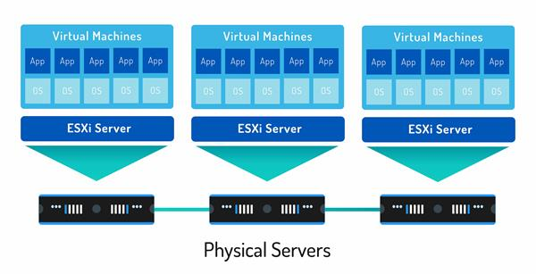

### Câu 1: So sánh VMware ESXi và VMware Workstation

| Tiêu chí             | VMware ESXi                                                                                                     | VMware Workstation                                                                                               |
| :------------------- | :-------------------------------------------------------------------------------------------------------------- | :--------------------------------------------------------------------------------------------------------------- |
| **Kiến trúc**        | **Bare-metal (Type 1 Hypervisor):** Cài đặt trực tiếp lên phần cứng máy chủ vật lý, không cần hệ điều hành nền. | **Hosted (Type 2 Hypervisor):** Cài đặt như một phần mềm ứng dụng trên nền hệ điều hành có sẵn (Windows, Linux). |
| **Hiệu suất**        | **Rất cao:** Do truy xuất trực tiếp phần cứng, không qua lớp trung gian OS.                                     | **Trung bình/Thấp:** Do phải đi qua lớp OS của máy trạm (Host OS) nên tốn tài nguyên và có độ trễ.               |
| **Quản lý**          | Quản lý tập trung qua vCenter Server hoặc giao diện Web (Host Client).                                          | Quản lý trực tiếp trên giao diện phần mềm tại máy cài đặt.                                                       |
| **Phạm vi ứng dụng** | Môi trường doanh nghiệp (Enterprise), trung tâm dữ liệu (Data Center), chạy các Server quan trọng 24/7.         | Môi trường cá nhân, thử nghiệm (Lab), phát triển phần mềm (Dev/Test), học tập.                                   |

---

### Câu 2: Kiến trúc tổng quát và thành phần chính của VMware ESXi

Kiến trúc của ESXi được thiết kế tối giản để đảm bảo hiệu năng và bảo mật.

**Các thành phần chính:**

1. **VMkernel:**
   - **Vai trò:** Là nhân (kernel) của hệ điều hành ảo hóa, thành phần quan trọng nhất.
   - **Chức năng:** Trực tiếp quản lý phần cứng (CPU, RAM, Disk, Network) và lập lịch (scheduling) tài nguyên cho các máy ảo. Nó đóng vai trò cầu nối giữa VM và phần cứng vật lý.
2. **Virtualization Layer (Lớp ảo hóa):**
   - **Vai trò:** Tạo ra môi trường ảo độc lập.
   - **Chức năng:** Cung cấp các thiết bị phần cứng ảo (vCPU, vRAM, vSwitch...) cho từng máy ảo, giúp máy ảo "nghĩ" rằng nó đang chạy trên máy thật.
3. **User World (Management Agents):**
   - **Vai trò:** Môi trường quản lý.
   - **Chức năng:** Chứa các tiến trình quản trị như `hostd` (quản lý máy chủ), `vpxa` (kết nối với vCenter), giúp quản trị viên cấu hình ESXi thông qua giao diện dòng lệnh hoặc giao diện web.
4. **Hardware Drivers:**
   - Các trình điều khiển thiết bị được tích hợp vào VMkernel để giao tiếp với phần cứng vật lý.

---

### Câu 3: Sơ đồ kiến trúc VMware ESXi Server

**Giải thích sơ đồ:**

- **Tầng dưới cùng (Hardware):** Là máy chủ vật lý (CPU, RAM, NIC, HBA).
- **Tầng giữa (Hypervisor - ESXi):** VMkernel chạy trực tiếp trên Hardware. Nó kiểm soát mọi yêu cầu từ trên xuống. Bên cạnh VMkernel là các Management Agents để người dùng điều khiển.
- **Tầng trên cùng (Virtual Machines):** Các máy ảo chạy trên nền tảng ảo hóa. Chúng không tương tác trực tiếp với phần cứng mà phải đi qua VMkernel.

---

### Câu 4: Cơ chế quản lý tài nguyên trên ESXi

**Các loại tài nguyên quản lý:** CPU, Memory (RAM), Storage (Disk I/O), và Network (Bandwidth).

**Các khái niệm quản lý tài nguyên:**

1. **Resource Pool (Bể tài nguyên):**
   - Là một phương pháp gom nhóm tài nguyên. Bạn có thể chia tổng tài nguyên của máy chủ thành các "bể" nhỏ (ví dụ: Bể cho Kế toán, Bể cho IT) và gán các VM vào đó để dễ quản lý phân cấp.
2. **Reservation (Đặt trước - Đảm bảo tối thiểu):**
   - Là lượng tài nguyên **tối thiểu** được đảm bảo dành riêng cho một VM hoặc Resource Pool.
   - _Ví dụ:_ Reservation 4GB RAM nghĩa là VM luôn luôn có sẵn 4GB để dùng, hệ thống không bao giờ lấy đi, ngay cả khi VM đang tắt (ở một số cấu hình) hoặc rảnh rỗi.
3. **Limit (Giới hạn - Mức trần):**
   - Là lượng tài nguyên **tối đa** mà VM được phép sử dụng.
   - _Ví dụ:_ Limit 2GHz CPU. Dù máy chủ vật lý còn dư rất nhiều CPU, VM này cũng không bao giờ được chạy quá 2GHz.
4. **Shares (Cổ phần - Độ ưu tiên):**
   - Chỉ có tác dụng khi hệ thống bị **tranh chấp tài nguyên** (quá tải).
   - VM nào có chỉ số Shares cao hơn (High) sẽ được ưu tiên cấp phát tài nguyên nhiều hơn so với VM có Shares thấp (Low) khi tài nguyên khan hiếm.

---

### Câu 5: Cơ chế phân phối CPU và RAM

**1. Cơ chế phân phối:**

- **CPU:** ESXi sử dụng bộ lập lịch (Scheduler) để chia nhỏ thời gian sử dụng CPU vật lý thành các lát cắt (time slices) và phân phối cho các vCPU của máy ảo.
- **RAM:** ESXi cấp phát RAM khi VM yêu cầu. Nếu RAM vật lý cạn kiệt, ESXi sử dụng các kỹ thuật thu hồi bộ nhớ như: _Transparent Page Sharing (TPS)_ (chia sẻ trang nhớ giống nhau), _Ballooning_ (vay mượn RAM từ VM rảnh), _Compression_ (nén RAM), hoặc _Swapping_ (chuyển RAM xuống ổ cứng).

**2. Vai trò của VMkernel:**

- VMkernel hoạt động như một "Cảnh sát giao thông". Nó nhận tất cả các yêu cầu tính toán từ hàng loạt máy ảo, sắp xếp hàng đợi và quyết định máy ảo nào được truy xuất vào CPU/RAM vật lý tại thời điểm nào dựa trên chính sách đã cấu hình (Shares, Reservation).

**3. Khi nhiều VM yêu cầu cùng một tài nguyên (Tranh chấp - Contention):**

- Nếu tổng yêu cầu < Tài nguyên vật lý: Mọi VM đều được đáp ứng đầy đủ.
- Nếu tổng yêu cầu > Tài nguyên vật lý (Nghẽn):
  - VMkernel sẽ kiểm tra **Reservation** trước để đảm bảo mức tối thiểu cho các VM quan trọng.
  - Phần tài nguyên còn lại sẽ được chia dựa trên tỷ lệ **Shares**. VM có Shares `High` sẽ nhận được tài nguyên gấp đôi `Normal` và gấp 4 lần `Low`.
