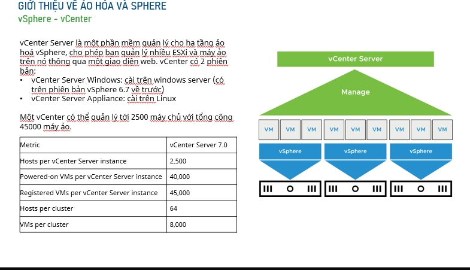
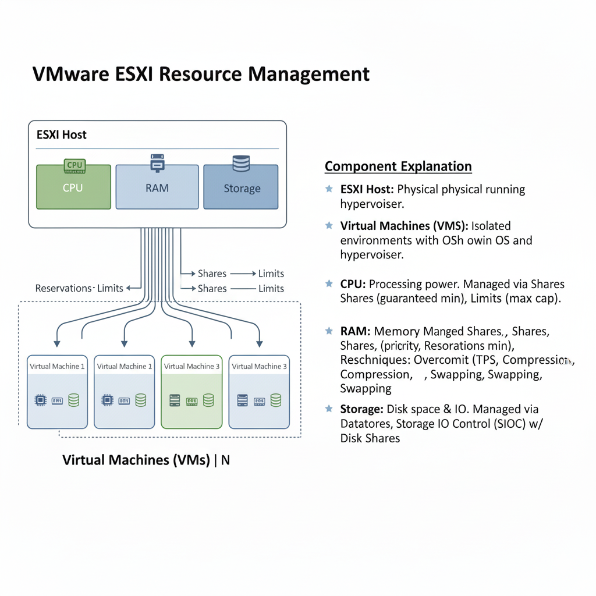
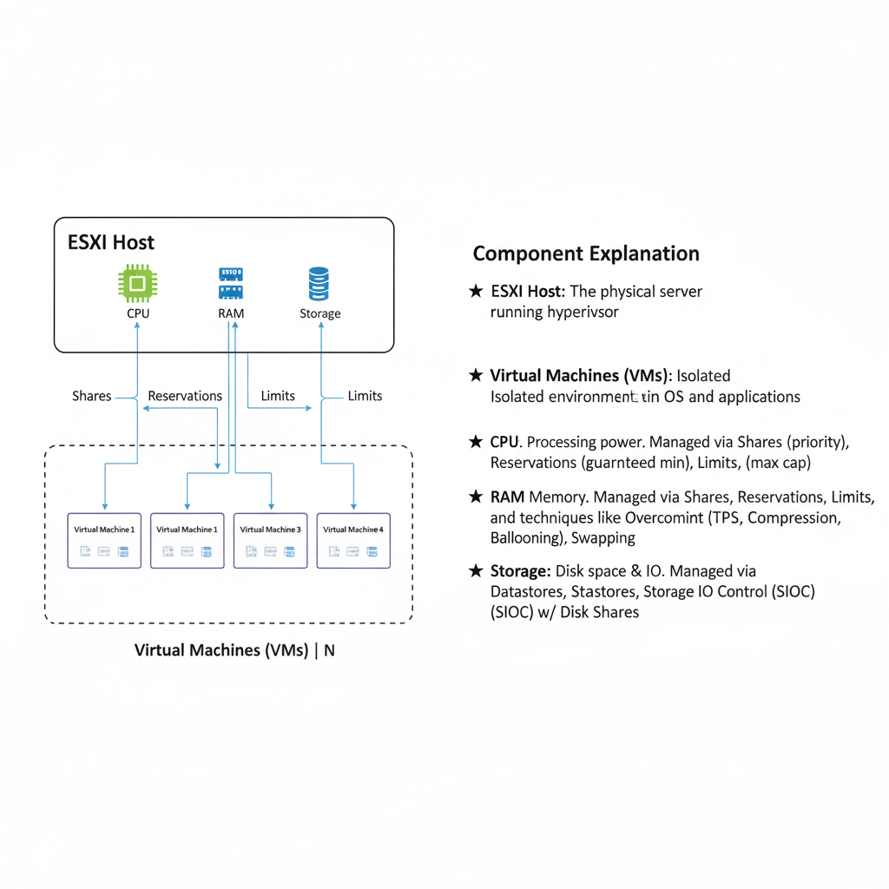
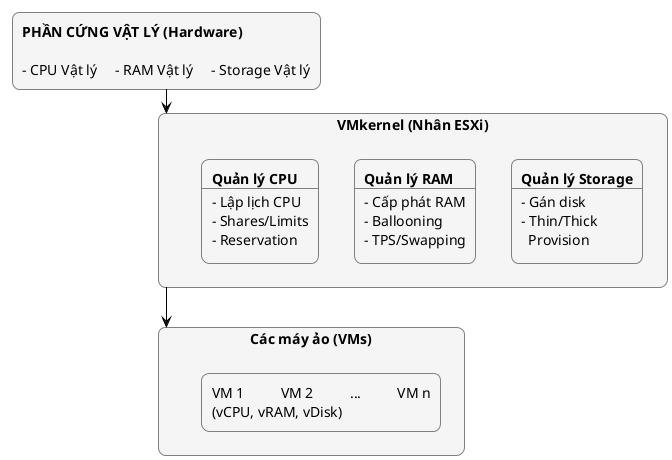
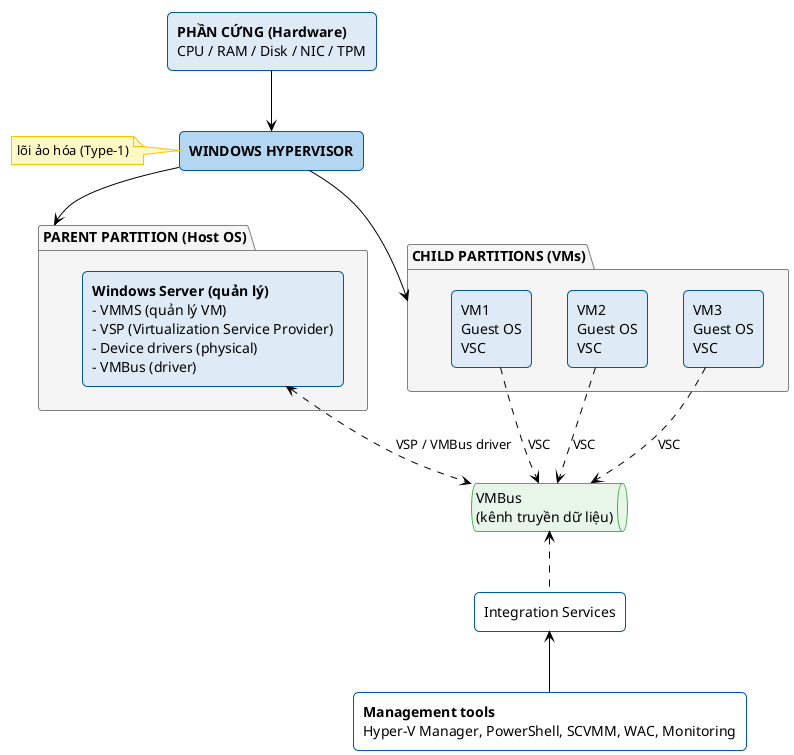
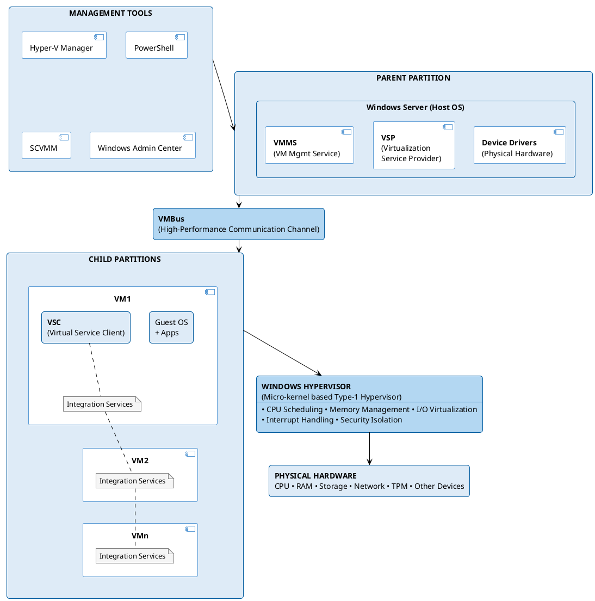

## **Câu 1: So sánh sự khác nhau giữa VMware ESXi và VMware Workstation về kiến trúc ảo hóa và phạm vi ứng dụng**

| **Tiêu chí**               | **VMware ESXi**                                                                                                                                                                    | **VMware Workstation**                                                                                                                                                                      |
| -------------------------- | ---------------------------------------------------------------------------------------------------------------------------------------------------------------------------------- | ------------------------------------------------------------------------------------------------------------------------------------------------------------------------------------------- |
| **Loại Hypervisor**        | Type 1 (Bare-metal)                                                                                                                                                                | Type 2 (Hosted)                                                                                                                                                                             |
| **Kiến trúc cài đặt**      | Cài trực tiếp lên phần cứng, không cần OS host                                                                                                                                     | Cài trên hệ điều hành có sẵn (Windows/Linux)                                                                                                                                                |
| **Nhân hệ thống**          | VMkernel - nhân tối ưu cho ảo hóa                                                                                                                                                  | Chạy như ứng dụng trên OS host                                                                                                                                                              |
| **Hiệu suất**              | Hiệu suất cao, overhead thấp                                                                                                                                                       | Hiệu suất thấp hơn do phụ thuộc OS host                                                                                                                                                     |
| **Quản lý tài nguyên**     | Truy cập trực tiếp phần cứng vật lý                                                                                                                                                | Phải thông qua OS host                                                                                                                                                                      |
| **Khả năng mở rộng**       | - Hỗ trợ 1024 VM/host `<br>`- 24TB RAM/host `<br>`- 768 vCPU/host                                                                                                                  | - Giới hạn khoảng 10-20 VM `<br>`- Phụ thuộc tài nguyên OS host                                                                                                                             |
| **Giao diện quản lý**      | - vSphere Client (Web)`<br>`- vCenter Server `<br>`- CLI/API                                                                                                                       | - GUI desktop `<br>`- VMware Workstation Pro interface                                                                                                                                      |
| **Tính năng enterprise**   | - vMotion (Live Migration)`<br>`- DRS (Distributed Resource Scheduler)`<br>`- HA (High Availability)`<br>`- Storage vMotion `<br>`- Fault Tolerance                                | - Snapshot cơ bản `<br>`- Clone VM `<br>`- Shared VMs (hạn chế)                                                                                                                             |
| **Clustering**             | Hỗ trợ cluster với vCenter                                                                                                                                                         | Không hỗ trợ clustering                                                                                                                                                                     |
| **Live Migration**         | Có (vMotion)                                                                                                                                                                       | Không                                                                                                                                                                                       |
| **High Availability**      | Có (vSphere HA)                                                                                                                                                                    | Không                                                                                                                                                                                       |
| **Bảo mật**                | - VM Encryption `<br>`- Secure Boot `<br>`- TPM 2.0 `<br>`- Role-based Access Control                                                                                              | - Encryption cơ bản `<br>`- Shared folders `<br>`- Restricted VMs                                                                                                                           |
| **Phạm vi ứng dụng**       | **Production Environment:**`<br>`- Data centers `<br>`- Cloud infrastructure `<br>`- Enterprise servers `<br>`- Mission-critical applications `<br>`- Virtualization consolidation | **Development & Testing:**`<br>`- Software development `<br>`- Testing environments `<br>`- Training & education `<br>`- Personal/desktop virtualization `<br>`- Legacy application support |
| **Môi trường triển khai**  | - Server rooms `<br>`- Data centers `<br>`- Cloud providers `<br>`- Enterprise infrastructure                                                                                      | - Developer workstations `<br>`- Personal computers `<br>`- Labs & testing environments `<br>`- Educational institutions                                                                    |
| **Độ phức tạp**            | Cao, cần kiến thức chuyên môn                                                                                                                                                      | Thấp, dễ sử dụng                                                                                                                                                                            |
| **Chi phí**                | - Free version (hạn chế)`<br>`- Standard: ~$500/CPU `<br>`- Enterprise Plus: ~$4,000/CPU                                                                                           | - Workstation Pro: ~$250 `<br>`- Workstation Player: Free (non-commercial)                                                                                                                  |
| **Hỗ trợ OS guest**        | - Windows Server/Desktop `<br>`- Linux distributions `<br>`- FreeBSD, Solaris `<br>`- Nested virtualization                                                                        | - Windows (all versions)`<br>`- Linux distributions `<br>`- macOS (trên Mac hardware)`<br>`- Legacy OS support                                                                              |
| **Network virtualization** | - Distributed switches `<br>`- VLAN support `<br>`- NSX integration `<br>`- Advanced networking                                                                                    | - NAT, Bridged, Host-only `<br>`- Virtual network editor `<br>`- Basic networking                                                                                                           |
| **Storage support**        | - SAN (FC, iSCSI)`<br>`- NAS (NFS)`<br>`- vSAN `<br>`- Local storage `<br>`- Storage clustering                                                                                    | - Local disks `<br>`- USB drives `<br>`- Network shares `<br>`- Basic storage                                                                                                               |
| **Backup & Recovery**      | - vSphere Data Protection `<br>`- 3rd party integration `<br>`- Enterprise backup solutions                                                                                        | - VM snapshots `<br>`- Manual backup `<br>`- Basic restore                                                                                                                                  |
| **Monitoring & Logging**   | - vCenter monitoring `<br>`- Performance charts `<br>`- Enterprise monitoring tools `<br>`- SNMP support                                                                           | - Basic performance monitoring `<br>`- Simple logging `<br>`- Resource usage display                                                                                                        |
| **API & Automation**       | - REST API `<br>`- PowerCLI `<br>`- vSphere SDK `<br>`- Terraform support                                                                                                          | - VIX API `<br>`- Limited automation `<br>`- Basic scripting                                                                                                                                |
| **Update management**      | - vSphere Update Manager `<br>`- Centralized patching `<br>`- Rolling updates                                                                                                      | - Manual updates `<br>`- Individual VM updates                                                                                                                                              |

### **Tóm tắt phạm vi ứng dụng:**

**VMware ESXi phù hợp cho:**

- Doanh nghiệp lớn cần consolidation server
- Môi trường production quan trọng
- Data centers và cloud infrastructure
- Hệ thống cần high availability và disaster recovery
- Môi trường cần quản lý tập trung hàng trăm/nghìn VM

**VMware Workstation phù hợp cho:**

- Developers và QA testers
- Môi trường học tập và training
- Testing software trên nhiều OS
- Chạy legacy applications
- Personal virtualization và labs

### **Kết luận:**

VMware ESXi là giải pháp ảo hóa cấp enterprise với kiến trúc Type-1 mang lại hiệu suất cao và tính năng đầy đủ cho môi trường production. VMware Workstation là giải pháp Type-2 phù hợp cho development, testing và sử dụng cá nhân với tính năng cơ bản và dễ sử dụng.

---

## Câu 2: Trình bày kiến trúc tổng quát của VMware ESXi Server. Mô tả các thành phần chính trong VMware ESXi Server. Giải thích rõ vai trò và chức năng của từng thành phần.

**Kiến trúc tổng quát của VMware ESXi Server**

VMware ESXi Server là một hypervisor loại 1 (bare-metal hypervisor), nghĩa là nó được cài đặt trực tiếp lên phần cứng vật lý của máy chủ, không cần hệ điều hành trung gian. Kiến trúc tổng quát của ESXi gồm các lớp chính sau:

---

### 1. Hardware (Phần cứng vật lý)

- **Bao gồm:** CPU, RAM, ổ cứng, card mạng, card RAID, v.v.
- **Vai trò:** Cung cấp tài nguyên vật lý để cài đặt và vận hành ESXi cũng như các máy ảo.

---

### 2. VMkernel (Nhân ESXi)

- **Mô tả:** Là nhân (core) của ESXi, là một hệ điều hành tối giản do VMware phát triển, chạy trực tiếp trên phần cứng vật lý.
- **Chức năng:**
  - Quản lý, cấp phát tài nguyên phần cứng cho các máy ảo (VM).
  - Điều phối các tiến trình, quản lý bộ nhớ, CPU, lưu trữ, mạng.
  - Thực hiện các tính năng ảo hóa, bảo mật, giám sát và điều khiển thiết bị.

---

### 3. Device Drivers (Trình điều khiển thiết bị)

- **Mô tả:** Là các phần mềm trung gian cho phép ESXi giao tiếp với phần cứng vật lý như card mạng, ổ cứng, v.v.
- **Chức năng:** Đảm bảo rằng VMkernel có thể truy cập và sử dụng các thiết bị phần cứng trên máy chủ vật lý.

---

### 4. Virtual Machine Monitor (VMM)

- **Mô tả:** Lớp phần mềm nằm giữa VMkernel và các máy ảo.
- **Chức năng:**
  - Tạo môi trường ảo hóa cho từng VM.
  - Giả lập phần cứng ảo cho các máy ảo.
  - Đảm bảo cách ly, bảo mật và phân chia tài nguyên hợp lý giữa các VM.

---

### 5. Virtual Machines (Máy ảo)

- **Mô tả:** Là các máy tính ảo hóa chạy trên nền tảng ESXi, mỗi VM có hệ điều hành (Guest OS) và ứng dụng riêng.
- **Chức năng:** Cung cấp môi trường độc lập để chạy các dịch vụ, ứng dụng như một máy tính vật lý thực sự.

---

### 6. Management Layer (Lớp quản lý)

- **Mô tả:** Bao gồm các giao diện quản lý như vSphere Client (Web Client), vCenter Server hoặc giao diện dòng lệnh.
- **Chức năng:**
  - Quản trị, cấu hình, giám sát ESXi host và các máy ảo.
  - Thực hiện các tác vụ như tạo/xóa VM, quản lý tài nguyên, cập nhật phần mềm, v.v.

---

### 7. Datastore (Kho lưu trữ)

- **Mô tả:** Là các vùng lưu trữ logic (NFS, iSCSI, SAN, Local Disk) mà ESXi sử dụng để lưu trữ file VM, ISO, snapshot, v.v.
- **Chức năng:** Cung cấp không gian lưu trữ cho các máy ảo và file cấu hình liên quan.

---

**Tóm tắt vai trò & chức năng các thành phần:**

| Thành phần              | Vai trò/Chức năng chính                                          |
| ----------------------- | ---------------------------------------------------------------- |
| Hardware                | Cung cấp tài nguyên vật lý                                       |
| VMkernel                | Nhân điều hành, quản lý tài nguyên, thực hiện ảo hóa             |
| Device Drivers          | Giao tiếp giữa VMkernel và phần cứng vật lý                      |
| Virtual Machine Monitor | Tạo môi trường ảo hóa, cách ly và quản lý tài nguyên cho từng VM |
| Virtual Machines        | Chạy hệ điều hành và ứng dụng độc lập                            |
| Management Layer        | Quản trị, giám sát, cấu hình hệ thống                            |
| Datastore               | Lưu trữ dữ liệu máy ảo, file cấu hình, snapshot…                 |

---

**Tóm lại:**
VMware ESXi Server cung cấp một nền tảng ảo hóa mạnh mẽ, hiệu suất cao và bảo mật, giúp tối ưu hóa việc sử dụng tài nguyên phần cứng, đồng thời dễ dàng quản trị và mở rộng hệ thống máy ảo.

## Câu 3: Vẽ sơ đồ kiến trúc VMware ESXi Server và giải thích các thành phần thông qua sơ đồ.

Dưới đây là sơ đồ kiến trúc cơ bản của VMware ESXi Server và giải thích các thành phần chính:

---

**Sơ đồ kiến trúc VMware ESXi Server:**



```
+-------------------------------------------------------+
|                PHẦN CỨNG VẬT LÝ (Hardware)           |
|  - CPU  - RAM  - Ổ đĩa cứng  - Card mạng (NIC)        |
+-------------------------------------------------------+
                           |
+-------------------------------------------------------+
|         VMkernel (Nhân ESXi)                          |
|  - Quản lý tài nguyên (CPU, RAM, Storage, Network)    |
|  - Quản lý máy ảo (VM)                                |
|  - Điều khiển truy cập phần cứng                      |
+-------------------------------------------------------+
                           |
+-------------------+-------------------+-----------------+
|                   |                   |                 |
|  +------------+   |  +------------+   |   +----------+  |
|  | Máy ảo VM1 |   |  | Máy ảo VM2 |   |   | Máy ảo VMn|  |
|  +------------+   |  +------------+   |   +----------+  |
|  | Guest OS   |   |  | Guest OS   |   |   | Guest OS |   |
|  +------------+   |  +------------+   |   +----------+   |
|  | Ứng dụng   |   |  | Ứng dụng   |   |   | Ứng dụng |   |
|  +------------+   |  +------------+   |   +----------+   |
+-------------------+-------------------+-----------------+
                           |
+-------------------------------------------------------+
|            vSphere Client/ESXi Management             |
|  - Giao diện quản trị (Web/Client)                    |
|  - Giao tiếp với quản trị viên                        |
+-------------------------------------------------------+
```

---

### Giải thích các thành phần trong sơ đồ

1. **Phần cứng vật lý (Hardware):**Bao gồm tài nguyên vật lý thực tế như CPU, bộ nhớ RAM, ổ cứng, card mạng, v.v. Đây là nền tảng để cài đặt ESXi.
2. **VMkernel (Nhân ESXi):**Đây là lớp phần mềm trung gian (hypervisor Type 1) trực tiếp quản lý phần cứng và tài nguyên vật lý. Các chức năng chính:

   - **Quản lý tài nguyên:** Phân chia và cấp phát CPU, RAM, lưu trữ, và mạng cho các máy ảo.
   - **Quản lý máy ảo:** Tạo, chạy, dừng, giám sát các máy ảo.
   - **Điều khiển truy cập phần cứng:** Đảm bảo các máy ảo chỉ truy cập tài nguyên được phân bổ.

3. **Máy ảo (Virtual Machines - VM):**Mỗi máy ảo là một môi trường độc lập, có hệ điều hành riêng (Guest OS) và các ứng dụng như một máy tính thật. Các máy ảo này sử dụng tài nguyên vật lý thông qua VMkernel.
4. **Guest OS (Hệ điều hành khách):**Hệ điều hành cài trên từng máy ảo, có thể là Windows, Linux, v.v.
5. **Ứng dụng (Applications):**Ứng dụng chạy trên từng máy ảo, phục vụ nhu cầu của người dùng hoặc doanh nghiệp.
6. **vSphere Client/ESXi Management:**
   Là giao diện quản trị (trình duyệt web hoặc ứng dụng client) để quản lý, cấu hình, giám sát ESXi Server và các máy ảo. Quản trị viên giao tiếp với ESXi qua thành phần này.

---

**Tóm lại:**

- **VMware ESXi** là một hypervisor dạng "bare-metal" (cài trực tiếp lên phần cứng), quản lý tài nguyên vật lý và cung cấp môi trường cho nhiều máy ảo hoạt động độc lập trên cùng một máy chủ vật lý.
- Cấu trúc này đảm bảo hiệu năng tốt, tối ưu hóa tài nguyên, dễ quản lý và bảo mật cao.

Nếu bạn cần hình ảnh sơ đồ trực quan, hãy cho biết để mình hướng dẫn vẽ bằng phần mềm sơ đồ (như draw.io, Lucidchart, v.v.).

---

## Câu 4: Trình bày các cơ chế quản lý tài nguyên trên VMware ESXi Server. Giải thích các loại tài nguyên mà ESXi Server quản lý. Trình bày các khái niệm: Resource Pool, Reservation, Limit, Shares



Giải thích các thành phần và cách quản lý tài nguyên trong VMware ESXi:

**1. ESXi Host (Máy chủ ESXi):**

- Đây là máy chủ vật lý mà trên đó hypervisor ESXi được cài đặt.
- ESXi host chịu trách nhiệm ảo hóa các tài nguyên vật lý của nó (CPU, RAM, Storage, Network) và phân bổ chúng cho các máy ảo (Virtual Machines - VMs).
- ESXi quản lý tài nguyên thông qua các cơ chế như Shares, Reservations và Limits để đảm bảo các máy ảo nhận được lượng tài nguyên cần thiết.

**2. Tài nguyên vật lý của ESXi Host:**

- **CPU:** Là bộ xử lý trung tâm vật lý của máy chủ. ESXi sử dụng các lõi và luồng của CPU để cung cấp sức mạnh tính toán cho các máy ảo. ESXi hỗ trợ tính năng vNUMA để tối ưu hóa hiệu suất CPU trên các hệ thống có nhiều bộ xử lý.
- **RAM (Memory):** Là bộ nhớ vật lý của máy chủ. ESXi quản lý bộ nhớ rất hiệu quả bằng cách sử dụng nhiều kỹ thuật để tối ưu hóa việc sử dụng bộ nhớ cho các máy ảo, cho phép "overcommit" bộ nhớ.
- **Storage (Lưu trữ):** Là không gian lưu trữ vật lý được kết nối với ESXi host, có thể là Local Storage (ổ cứng cục bộ), SAN (Storage Area Network) hoặc NAS (Network Attached Storage). ESXi tạo ra các Datastore trên không gian lưu trữ này để lưu trữ các tệp của máy ảo (như tệp VMDK, tệp cấu hình VM).

**3. Virtual Machines (Máy ảo - VMs):**

- Mỗi máy ảo là một môi trường hoạt động độc lập với hệ điều hành và ứng dụng riêng của nó.
- Các máy ảo không trực tiếp truy cập vào tài nguyên vật lý mà thay vào đó sử dụng tài nguyên ảo được cấp phát từ ESXi host.
- ESXi cung cấp các tài nguyên ảo cho mỗi VM:
  - **vCPU:** CPU ảo, được ánh xạ tới CPU vật lý.
  - **vRAM:** RAM ảo, được ánh xạ tới RAM vật lý.
  - **Virtual Disk:** Ổ đĩa ảo, được lưu trữ trên Datastore vật lý.

**4. Cơ chế quản lý tài nguyên của ESXi:**

- **Shares (Cổ phần/Ưu tiên):**
  - Shares xác định mức độ ưu tiên tương đối của một máy ảo để truy cập vào tài nguyên (CPU, RAM) khi có sự tranh chấp tài nguyên.
  - Ví dụ: Nếu VM A có 2000 shares CPU và VM B có 1000 shares CPU, khi cả hai đều yêu cầu CPU tối đa và CPU vật lý bị bão hòa, VM A sẽ nhận được gấp đôi lượng CPU so với VM B.
  - Shares có các mức độ mặc định như High, Normal, Low.
- **Reservations (Đặt trước):**
  - Reservations đảm bảo một lượng tài nguyên tối thiểu nhất định (CPU, RAM) luôn có sẵn cho một máy ảo, ngay cả khi host bị quá tải.
  - Tài nguyên đã được đặt trước sẽ không thể được sử dụng bởi các máy ảo khác.
  - Ví dụ: Nếu VM A có 1 GB RAM Reservation, thì 1 GB RAM vật lý sẽ luôn được dành riêng cho VM A, bất kể các VM khác cần bao nhiêu RAM.
- **Limits (Giới hạn):**
  - Limits đặt ra mức tài nguyên tối đa (CPU, RAM) mà một máy ảo có thể sử dụng, ngay cả khi có nhiều tài nguyên vật lý sẵn có.
  - Điều này giúp ngăn chặn một máy ảo chiếm dụng quá nhiều tài nguyên và ảnh hưởng đến các máy ảo khác.
  - Ví dụ: Nếu VM B có CPU Limit là 2 GHz, thì VM B sẽ không bao giờ sử dụng quá 2 GHz CPU, ngay cả khi CPU vật lý của host vẫn còn dư thừa.

**5. Quản lý bộ nhớ nâng cao trong ESXi:**

- **Memory Overcommitment:** ESXi có thể cấp phát tổng lượng RAM ảo cho các máy ảo lớn hơn tổng lượng RAM vật lý của host. Điều này khả thi nhờ các kỹ thuật tối ưu hóa bộ nhớ.
- **Transparent Page Sharing (TPS):** Tìm kiếm và loại bỏ các trang bộ nhớ trùng lặp giữa các máy ảo hoặc bên trong một máy ảo, chỉ giữ một bản sao và tham chiếu đến nó.
- **Memory Compression:** Nén các trang bộ nhớ ít được sử dụng để giải phóng không gian RAM vật lý.
- **Ballooning (vmmemctl driver):** Một driver được cài đặt trong hệ điều hành khách của máy ảo, nó "yêu cầu" bộ nhớ từ hệ điều hành khách khi ESXi host cần thêm RAM. Khi driver này yêu cầu bộ nhớ, HĐH khách sẽ giải phóng bộ nhớ không sử dụng, trả lại cho ESXi.
- **Swapping (Host Cache & Swap File):** Khi tất cả các kỹ thuật trên không đủ, ESXi có thể sử dụng không gian đĩa làm bộ nhớ ảo (swap to disk). Đây là lựa chọn cuối cùng vì nó có hiệu suất chậm hơn nhiều so với RAM vật lý.

**6. Quản lý lưu trữ trong ESXi:**

- **Datastores:** Là các "vùng" lưu trữ logic được ESXi tạo ra trên không gian lưu trữ vật lý. Các Datastore có thể được format bằng VMFS (Virtual Machine File System) hoặc NFS (Network File System).
- **Storage I/O Control (SIOC):** Một tính năng của vSphere cho phép quản lý ưu tiên I/O đĩa giữa các máy ảo khi có sự tranh chấp tài nguyên I/O trên một Datastore dùng chung. Tương tự như Shares cho CPU/RAM, SIOC sử dụng Shares để phân bổ băng thông I/O.
- **Disk Shares:** Trong SIOC, bạn có thể đặt "Disk Shares" cho từng máy ảo để xác định mức độ ưu tiên của nó trong việc truy cập I/O đĩa.

Tóm lại, VMware ESXi cung cấp một khung quản lý tài nguyên mạnh mẽ và linh hoạt, cho phép bạn tối ưu hóa việc sử dụng tài nguyên vật lý đồng thời đảm bảo hiệu suất và tính khả dụng cho các máy ảo của bạn thông qua các cơ chế Shares, Reservations, Limits và các kỹ thuật quản lý bộ nhớ và lưu trữ tiên tiến.

---

## Câu 5: Giải thích cơ chế phân phối CPU và RAM cho các máy ảo (VM) trên ESXi Server. Làm rõ vai trò của VMkernel trong việc phân phối tài nguyên. Mô tả quá trình khi nhiều VM yêu cầu cùng một tài nguyên.

### **Cơ chế phân phối CPU và RAM cho các máy ảo (VM) trên ESXi Server**

#### **1. Phân phối CPU cho các máy ảo**

- **Cấp phát vCPU:**Khi tạo một VM trên ESXi, bạn cấu hình số lượng vCPU (CPU ảo) cho mỗi máy ảo. Mỗi vCPU sẽ được ESXi ánh xạ (map) tới các logical CPU vật lý (có thể là core hoặc thread trên CPU vật lý).
- **Lập lịch CPU:**VMkernel sử dụng một bộ lập lịch (CPU Scheduler) để quyết định VM nào sẽ được sử dụng CPU vật lý tại mỗi thời điểm. Việc này tương tự như lập lịch tiến trình trong hệ điều hành, nhưng ở cấp ảo hóa.
- **Cơ chế ưu tiên:**
  Khi nhiều VM cùng yêu cầu CPU, VMkernel dựa vào các thông số như Shares (độ ưu tiên), Reservation (bảo đảm tối thiểu), Limit (giới hạn tối đa) để phân phối CPU hợp lý.

#### **2. Phân phối RAM cho các máy ảo**

- **Cấp phát RAM:**Khi tạo VM, bạn thiết lập lượng RAM ảo cho từng máy ảo. VMkernel sẽ quản lý bộ nhớ vật lý và ánh xạ đến các VM.
- **Kỹ thuật tối ưu hóa bộ nhớ:**ESXi sử dụng nhiều kỹ thuật như:

  - **Transparent Page Sharing (TPS):** Chia sẻ các page bộ nhớ giống nhau giữa các VM để tiết kiệm RAM.
  - **Ballooning:** Khi thiếu RAM, ESXi yêu cầu Guest OS trả lại một phần RAM không dùng tới.
  - **Swapping:** Nếu thực sự thiếu RAM vật lý, ESXi sẽ chuyển một phần bộ nhớ của VM xuống đĩa (swap) để tiếp tục hoạt động, dù hiệu năng sẽ giảm.

- **Cơ chế ưu tiên:**
  Tương tự CPU, RAM cũng được cấp phát dựa trên Shares, Reservation, Limit.

---

### **Vai trò của VMkernel trong việc phân phối tài nguyên**

- **Quản lý tài nguyên trung tâm:**VMkernel là nhân của ESXi, chịu trách nhiệm quản lý và phân phối mọi tài nguyên vật lý (CPU, RAM, mạng, lưu trữ) cho các VM.
- **Lập lịch và điều phối:**VMkernel thực hiện các thuật toán lập lịch phân phối CPU, quản lý bộ nhớ, đảm bảo các VM hoạt động ổn định, cách ly và tuân thủ đúng chính sách tài nguyên đã cấu hình.
- **Bảo vệ và cách ly:**
  Đảm bảo các VM không thể chiếm dụng tài nguyên vượt quá giới hạn và không ảnh hưởng tiêu cực tới nhau.

---

### **Quá trình khi nhiều VM cùng yêu cầu một tài nguyên**

1. **Tiếp nhận yêu cầu:**Khi nhiều VM cùng lúc yêu cầu sử dụng thêm CPU hoặc RAM, VMkernel ghi nhận tất cả các yêu cầu này.
2. **Áp dụng chính sách:**VMkernel xét các giá trị Shares, Reservation, Limit của từng VM hoặc Resource Pool để xác định mức độ ưu tiên.
3. **Lập lịch và phân phối:**

   - **CPU:** VMkernel chia sẻ thời gian CPU vật lý cho các vCPU theo mức ưu tiên, đảm bảo VM có Reservation sẽ luôn được cấp phát tối thiểu, các VM có Shares cao sẽ được ưu tiên hơn khi thiếu tài nguyên.
   - **RAM:** Nếu tổng RAM VM yêu cầu vượt RAM vật lý, VMkernel sẽ áp dụng các kỹ thuật như Ballooning, TPS, Swapping để cân bằng và duy trì hoạt động của các VM quan trọng.

4. **Giám sát & điều chỉnh:**
   VMkernel liên tục giám sát tình trạng sử dụng tài nguyên và điều chỉnh lập lịch sao cho tối ưu hiệu năng, tuân thủ các giới hạn đã thiết lập.

---

**Tóm lại:**

- **VMkernel** đóng vai trò trung tâm trong việc phân phối tài nguyên CPU và RAM, sử dụng các chính sách ưu tiên và kỹ thuật tối ưu hóa để đảm bảo hiệu quả, công bằng và ổn định cho toàn bộ hệ thống máy ảo trên ESXi.

## Câu 6: Vẽ sơ đồ mô tả quản lý tài nguyên (CPU, RAM, Storage) và giải thích từng thành phần.

Dưới đây là sơ đồ mô tả quản lý tài nguyên (CPU, RAM, Storage) trong môi trường VMware ESXi, kèm giải thích từng thành phần:



---



### **Giải thích từng thành phần**

#### 1. **Phần cứng vật lý (Hardware)**

- **CPU vật lý:** Bộ xử lý thực tế của máy chủ, cung cấp năng lực xử lý cho các VM qua VMkernel.
- **RAM vật lý:** Bộ nhớ hệ thống, được VMkernel chia nhỏ và phân phối cho các VM.
- **Ổ cứng/Storage vật lý:** Ổ đĩa vật lý hoặc hệ thống lưu trữ (local/SAN/NAS), lưu toàn bộ dữ liệu VM và hệ thống.

#### 2. **VMkernel (Nhân ESXi)**

Đây là lớp trung gian quản lý, đóng vai trò "bộ não" phân phối tài nguyên:

- **Quản lý CPU:**
  - **Lập lịch CPU:** Phân bổ thời gian CPU cho các vCPU của VM.
  - **Shares/Limits/Reservation:** Quản lý ưu tiên, giới hạn, và bảo đảm CPU cho VM.
- **Quản lý RAM:**
  - **Cấp phát RAM:** Phân bổ bộ nhớ ảo (vRAM) cho các VM.
  - **Ballooning:** "Bơm" trả bộ nhớ từ VM về host khi thiếu RAM.
  - **TPS (Transparent Page Sharing):** Chia sẻ page RAM giống nhau giữa các VM để tiết kiệm bộ nhớ.
  - **Swapping:** Sử dụng swap file trên disk nếu RAM vật lý bị thiếu.
- **Quản lý Storage:**
  - **Gán disk:** Phân bổ vDisk (ổ cứng ảo) cho VM từ storage vật lý.
  - **Thin/Thick Provision:** Kiểm soát cách phân bổ dung lượng lưu trữ (thin: cấp phát dần, thick: cấp phát to

#### 3. **Các máy ảo (VMs)**

- **VM1, VM2, ..., VMn:** Mỗi máy ảo có vCPU, vRAM, vDisk được phân bổ bởi VMkernel.
- **vCPU:** CPU ảo do VMkernel cung cấp.
- **vRAM:** RAM ảo, ánh xạ từ RAM vật lý.
- **vDisk:** Ổ cứng ảo, ánh xạ từ storage vật lý.

---

### **Tóm tắt**

- **Phần cứng vật lý:** Nền tảng tài nguyên thực tế.
- **VMkernel:** Bộ quản lý, phân phối và tối ưu tài nguyên cho các máy ảo.
- **VMs:** Đối tượng sử dụng tài nguyên được phân bổ, chạy các hệ điều hành và ứng dụng riêng biệt.

Nếu cần sơ đồ hình ảnh trực quan, bạn có thể vẽ trên các công cụ như draw.io, Lucidchart dựa theo mô tả trên.

---

## câu 7. Các mối đe dọa bảo mật thường gặp trong hệ thống ảo hóa VMware ESXi

### a. VM Escape (Thoát khỏi máy ảo)

- **Mô tả:** Kẻ tấn công khai thác lỗ hổng để thoát khỏi môi trường máy ảo, truy cập vào hypervisor hoặc các VM khác.
- **Nguy hiểm:** Toàn bộ hệ thống máy ảo và máy chủ ESXi có thể bị kiểm soát.
- **Ví dụ:** Lỗ hổng CVE-2017-4901 cho phép kẻ tấn công thực hiện VM Escape thông qua giao diện SVGA của VMware.

### b. Khai thác lỗ hổng trong hypervisor (VMkernel)

- **Mô tả:** Lỗi phần mềm hoặc cấu hình sai trong VMkernel bị khai thác.
- **Nguy hiểm:** Mất quyền kiểm soát máy chủ, truy cập hoặc phá hoại tất cả VM.
- **Ví dụ:** Lỗ hổng bảo mật được vá định kỳ trong các bản cập nhật ESXi, nếu không cập nhật kịp thời dễ bị tấn công.

### c. Tấn công qua mạng/quản trị (Management Interface Attack)

- **Mô tả:** Kẻ tấn công nhắm vào cổng quản trị ESXi (SSH, vSphere Client, API).
- **Nguy hiểm:** Đánh cắp thông tin đăng nhập, kiểm soát hoặc phá hoại máy chủ.
- **Ví dụ:** Tấn công brute-force mật khẩu quản trị vSphere Client.

### d. Tấn công DoS (Denial of Service)

- **Mô tả:** Lạm dụng tài nguyên (CPU, RAM, Storage, Network) khiến hệ thống hoặc VM bị treo, ngừng hoạt động.
- **Nguy hiểm:** Mất dịch vụ, gián đoạn hoạt động sản xuất.
- **Ví dụ:** Một VM bị nhiễm mã độc tiêu thụ hết tài nguyên gây treo toàn bộ host.

### e. Lây lan mã độc giữa các VM (VM-to-VM Attack)

- **Mô tả:** Tấn công từ một VM (bị nhiễm mã độc) lan sang các VM khác trên cùng host qua mạng ảo hoặc lỗ hổng cấu hình.
- **Nguy hiểm:** Lây nhiễm, phá hoại hoặc đánh cắp thông tin ở nhiều VM.
- **Ví dụ:** Ransomware lây từ VM này sang VM khác qua mạng ảo nội bộ.

### f. Tấn công vào Storage/NFS/iSCSI/SAN

- **Mô tả:** Tấn công vào hệ thống lưu trữ, truy cập/xóa dữ liệu VM.
- **Nguy hiểm:** Mất dữ liệu, gián đoạn dịch vụ, tống tiền.
- **Ví dụ:** Tấn công ransomware mã hóa datastore của ESXi.

### g. Rủi ro từ snapshot và backup

- **Mô tả:** Lưu snapshot/backup không đúng quy trình, bị đánh cắp/phục hồi trái phép.
- **Nguy hiểm:** Rò rỉ dữ liệu, khôi phục hệ thống về trạng thái có mã độc.
- **Ví dụ:** Đánh cắp file snapshot chứa thông tin nhạy cảm.

### h. Cấu hình sai/sơ hở (Misconfiguration)

- **Mô tả:** Mở cổng quản trị không cần thiết, dùng mật khẩu yếu, phân quyền sai.
- **Nguy hiểm:** Tạo lỗ hổng cho attacker dễ xâm nhập.
- **Ví dụ:** Quản trị viên để mật khẩu root mặc định cho ESXi.

---

### 2. Phân tích nguy hiểm đối với máy chủ ESXi và máy ảo

### Đối với máy chủ ESXi

- Mất quyền kiểm soát toàn bộ hệ thống (nếu attacker chiếm hypervisor).
- Mọi VM, dữ liệu, cấu hình có thể bị xem, sửa, xóa.
- Tấn công có thể lan sang các server khác trong cùng hệ thống.

### Đối với máy ảo (VM)

- VM bị kiểm soát, cài mã độc, đánh cắp dữ liệu.
- VM bị lạm dụng tài nguyên (mining, spam, DDoS).
- Dữ liệu nhạy cảm bị truy cập hoặc rò rỉ.
- VM bị xóa hoặc mã hóa (ransomware).

---

### 3. Ví dụ minh họa cụ thể

- **Ví dụ 1:** Kẻ tấn công truy cập trái phép vào giao diện quản trị ESXi, tạo snapshot và tải file ổ đĩa ảo (VMDK) về máy cá nhân để phân tích hoặc đánh cắp dữ liệu.
- **Ví dụ 2:** Một VM bị nhiễm ransomware, mã độc lợi dụng mạng ảo nội bộ để lây lan, mã hóa dữ liệu các máy ảo khác trong cùng datastore.
- **Ví dụ 3:** Lỗ hổng hypervisor chưa vá cho phép attacker từ một VM thực hiện VM Escape, chiếm toàn bộ quyền kiểm soát máy chủ ESXi và tất cả VM.

---

**Tóm lại:**
Ảo hóa trên ESXi giúp tối ưu tài nguyên nhưng nếu không bảo mật tốt, nguy cơ mất kiểm soát, rò rỉ dữ liệu, lây lan mã độc hoặc gián đoạn dịch vụ là rất lớn. Quản trị viên cần thường xuyên cập nhật bản vá, cấu hình đúng, phân quyền chặt chẽ, và giám sát hệ thống liên tục.
Câu 8: Mô tả các cơ chế và phương pháp bảo mật chính trên VMware ESXi Server. Trình bày các cơ chế bảo vệ hệ thống, mạng, và máy ảo.Nêu các công cụ hoặc dịch vụ hỗ trợ bảo mật trên ESXi.
Dưới đây là tổng hợp các cơ chế và phương pháp bảo mật chính trên VMware ESXi Server, gồm bảo vệ hệ thống, mạng, máy ảo và các công cụ hỗ trợ:

---

## câu 8 . **Cơ chế và phương pháp bảo mật hệ thống trên VMware ESXi**

### a. **Xác thực và phân quyền (Authentication & Authorization)**

- **Xác thực người dùng:** Hỗ trợ xác thực qua tài khoản local, Active Directory, LDAP.
- **RBAC (Role-Based Access Control):** Phân quyền chi tiết theo vai trò; chỉ cấp quyền cần thiết cho từng tài khoản.
- **Lockdown Mode:** Giới hạn truy cập quản trị, chỉ cho phép quản trị qua vCenter, ngăn truy cập trực tiếp host ESXi.

### b. **Quản lý bản vá và cập nhật (Patching)**

- **VMware Update Manager:** Tự động kiểm tra, tải và triển khai bản cập nhật vá lỗ hổng bảo mật cho ESXi host.

### c. **Bảo vệ giao diện quản trị (Management Interface Security)**

- **Giới hạn truy cập cổng quản trị:** Giới hạn IP, dùng VPN hoặc firewall để bảo vệ cổng SSH, vSphere Client, API.
- **Tắt/bật dịch vụ không cần thiết:** Vô hiệu hóa các dịch vụ không sử dụng như SSH, Shell.
- **Audit log:** Ghi lại toàn bộ hoạt động truy cập và thay đổi cấu hình để kiểm soát và điều tra khi cần.

---

### 2. **Cơ chế bảo vệ mạng trên ESXi**

### a. **vSphere Standard Switch/Distributed Switch Security**

- **Port Security:** Chặn MAC address spoofing, bảo vệ chống giả mạo địa chỉ MAC.
- **Promiscuous Mode:** Tắt chế độ promiscuous để VM không thể nghe lén dữ liệu của VM khác.
- **VLAN Tagging:** Sử dụng VLAN để cô lập lưu lượng mạng giữa các nhóm VM.

### b. **Firewall tích hợp**

- **ESXi Firewall:** Tường lửa tích hợp trên ESXi kiểm soát truy cập đến các dịch vụ quản trị, chỉ cho phép lưu lượng từ địa chỉ IP tin cậy.

### c. **Network Segmentation**

- **Tách mạng quản trị, storage và VM:** Dùng nhiều card mạng vật lý, VLAN, hoặc vSwitch riêng biệt để phân tách lưu lượng quản trị, VM, backup.

---

### 3. **Cơ chế bảo vệ máy ảo (VM Security)**

### a. **Isolation (Cách ly máy ảo)**

- **Cách ly VM:** VM kernel đảm bảo mỗi VM hoạt động độc lập, không truy cập trực tiếp bộ nhớ hoặc tài nguyên của VM khác.
- **VM Encryption:** Mã hóa ổ đĩa ảo (vmdk), file snapshot và memory dump của VM.

### b. **Secure Boot & UEFI**

- **Secure Boot cho ESXi và VM:** Chỉ cho phép tải các thành phần đã ký số, ngăn phần mềm độc hại khởi động cùng hệ thống.

### c. **Bảo vệ snapshot, backup**

- **Bảo mật file snapshot/backup:** Giới hạn quyền truy cập, mã hóa file backup để tránh rò rỉ dữ liệu.

### d. **Antivirus/Antimalware cho VM**

- **Cài đặt phần mềm bảo mật cho hệ điều hành bên trong VM** giống như trên máy vật lý.

---

### 4. **Công cụ/Dịch vụ hỗ trợ bảo mật trên ESXi**

- **VMware vSphere Security Configuration Guide:** Tài liệu khuyến nghị cấu hình bảo mật chuẩn của VMware.
- **VMware vSphere Trust Authority:** Xác thực và kiểm tra phần cứng, giúp bảo vệ các máy chủ ESXi khỏi tấn công vật lý/lợi dụng phần cứng.
- **VMware vSphere VM Encryption:** Mã hóa VM dễ dàng ngay trong vSphere.
- **vSphere Update Manager (VUM):** Quản lý cập nhật, vá lỗ hổng bảo mật.
- **VMware NSX:** Ảo hóa và bảo mật mạng, hỗ trợ micro-segmentation, tường lửa phân tán cho từng VM.
- **vCenter Server Alerts & Audit Logs:** Giám sát, cảnh báo và ghi log mọi hoạt động quản trị.
- **Third-party Security Solutions:** Tích hợp các giải pháp bảo mật từ bên thứ ba (antivirus, IDS/IPS).

---

### **Tóm tắt**

- **Bảo mật hệ thống:** Xác thực mạnh, phân quyền chi tiết, cập nhật bản vá, lockdown mode.
- **Bảo mật mạng:** VLAN, firewall, segmentation, tắt promiscuous mode.
- **Bảo mật máy ảo:** Isolation, encryption, secure boot, bảo vệ snapshot/backup.
- **Công cụ hỗ trợ:** vSphere Security Guide, vSphere Update Manager, NSX, Trust Authority, alert/log, giải pháp bảo mật bên ngoài.

Những biện pháp này giúp giảm thiểu nguy cơ bị tấn công, rò rỉ dữ liệu, đảm bảo an toàn cho cả ESXi host và các máy ảo trong môi trường ảo hóa.

## **Câu 9: Sơ đồ kiến trúc bảo mật trên ESXi Server và các lớp bảo vệ**

### **Sơ đồ kiến trúc bảo mật ESXi Server:**

```

```

---

### **Giải thích từng lớp bảo vệ:**

#### **1. Lớp Quản trị Bảo mật (Management Security Layer)**

- **Mục đích:** Bảo vệ giao diện quản trị và kiểm soát truy cập hệ thống
- **Thành phần:**
  - **RBAC (Role-Based Access Control):** Phân quyền chi tiết theo vai trò
  - **Lockdown Mode:** Giới hạn truy cập trực tiếp ESXi host
  - **Audit Logs:** Ghi lại mọi hoạt động quản trị để điều tra
  - **VUM (vSphere Update Manager):** Quản lý cập nhật bảo mật
  - **Trust Authority:** Xác thực phần cứng và môi trường tin cậy

#### **2. Lớp Bảo mật Mạng (Network Security Layer)**

- **Mục đích:** Bảo vệ lưu lượng mạng và cô lập các VM
- **Thành phần:**
  - **ESXi Firewall:** Kiểm soát truy cập đến các dịch vụ ESXi
  - **VLAN Segmentation:** Phân tách mạng logic giữa các nhóm VM
  - **vSwitch Security:** Port security, MAC filtering, promiscuous mode control
  - **Network Isolation:** Tách biệt mạng quản trị, storage và VM

#### **3. Lớp Bảo mật Hypervisor (VMkernel Security Layer)**

- **Mục đích:** Bảo vệ nhân hypervisor và đảm bảo cách ly VM
- **Thành phần:**
  - **Secure Boot:** Chỉ cho phép code đã ký số khởi động
  - **Code Integrity:** Kiểm tra tính toàn vẹn mã nguồn VMkernel
  - **VM Isolation:** Đảm bảo các VM hoàn toàn cách ly nhau
  - **Memory Protection:** Bảo vệ bộ nhớ, ngăn VM truy cập memory của VM khác
  - **Resource Control:** Kiểm soát phân bổ tài nguyên để tránh DoS

#### **4. Lớp Bảo mật Máy ảo (VM Security Layer)**

- **Mục đích:** Bảo vệ từng máy ảo riêng lẻ
- **Thành phần:**
  - **VM Encryption:** Mã hóa ổ đĩa ảo và memory
  - **Guest OS Security:** Antivirus, firewall, patch management trong VM
  - **VM Isolation:** Ngăn VM truy cập tài nguyên của VM khác
  - **Snapshot Protection:** Bảo mật file snapshot

#### **5. Lớp Bảo mật Storage (Data Security Layer)**

- **Mục đích:** Bảo vệ dữ liệu lưu trữ và backup
- **Thành phần:**
  - **Datastore Encryption:** Mã hóa dữ liệu trên datastore
  - **vSAN Encryption:** Mã hóa storage phân tán
  - **Backup Security:** Bảo mật file backup và snapshot
  - **Storage Access Control:** Kiểm soát truy cập đến hệ thống lưu trữ

#### **6. Lớp Bảo mật Vật lý (Hardware Security Layer)**

- **Mục đích:** Bảo vệ phần cứng và môi trường vật lý
- **Thành phần:**
  - **TPM (Trusted Platform Module):** Chip bảo mật phần cứng
  - **Physical Access Control:** Kiểm soát truy cập vật lý vào máy chủ
  - **BIOS/UEFI Security:** Bảo mật firmware và boot process
  - **IPMI/iLO Security:** Bảo mật giao diện quản lý từ xa phần cứng

---

### **Tóm tắt kiến trúc bảo mật nhiều lớp:**

**Kiến trúc bảo mật ESXi Server sử dụng mô hình "Defense in Depth" (bảo vệ theo chiều sâu) với 6 lớp bảo mật độc lập nhưng liên kết với nhau. Mỗi lớp có vai trò riêng trong việc bảo vệ hệ thống, từ phần cứng vật lý đến ứng dụng chạy trong máy ảo.**

**Ưu điểm của kiến trúc này:**

- Nếu một lớp bị xâm phạm, các lớp khác vẫn tiếp tục bảo vệ
- Cung cấp khả năng phát hiện và phản ứng sớm với các mối đe dọa
- Đảm bảo tính toàn vẹn và sẵn sàng của toàn bộ hệ thống ảo hóa

## Câu 10: Trình bày kiến trúc tổng quan của Hyper-V. Nêu các thành phần chính trong kiến trúc Hyper-V. Giải thích vai trò của từng thành phần

Sơ đồ (dễ hình dung)



Các thành phần chính và vai trò (gọn)

- Windows Hypervisor

  - Lõi ảo hóa chạy trực tiếp trên phần cứng; chịu trách nhiệm phân chia CPU, bộ nhớ, I/O và đảm bảo cách ly giữa các partition.

- Parent Partition (Host OS — thường Windows Server)

  - Chạy OS có đặc quyền quản trị; truy cập phần cứng, chứa các service quản lý, xuất tài nguyên cho VMs.

- VMMS (Virtual Machine Management Service)

  - Dịch vụ quản lý vòng đời VM: tạo, cấu hình, khởi động, dừng, snapshot, lưu/trả trạng thái.

- VSP (Virtualization Service Provider)

  - Thành phần trong Parent chịu quản lý thiết bị vật lý (mạng, lưu trữ, video...) và phục vụ yêu cầu I/O cho VMs qua VMBus.

- VMBus

  - Kênh giao tiếp hiệu năng cao (shared memory) giữa Parent ↔ Child để truyền I/O và control messages, giảm độ trễ so với emulation.

- VSC (Virtualization Service Client)

  - Driver trong Guest (Child) dùng VMBus để gọi VSP; thay thế thiết bị emulated bằng thiết bị synthetic nhanh hơn.

- Child Partition (VM)

  - Mỗi VM là một partition riêng: chạy Guest OS + ứng dụng; nhận thiết bị ảo (VSC) và dịch vụ tích hợp.

- Integration Services (Guest Services)

  - Gói driver + service giúp đồng bộ thời gian, shutdown hợp lý, copy/điều khiển file, hỗ trợ backup nhất quán, v.v.

- Công cụ quản trị (Hyper‑V Manager, PowerShell, SCVMM, WAC)

  - Giao diện/automation/giám sát để quản lý VM, resource, cluster, backup và báo cáo.

Luồng hoạt động ngắn gọn

- Hypervisor cấp/giữ tài nguyên vật lý và cung cấp nền tảng cách ly. Parent Partition (Host OS) điều phối thiết bị vật lý và chạy VSP; VMs (Child) dùng VSC qua VMBus để thực hiện I/O nhanh; VMMS và công cụ quản trị điều khiển lifecycle và cấu hình.

Bạn muốn mình:

- (A) Ghi nguyên đoạn này vào file b2.md trong repo bạn gửi? Nếu có, cho biết nhánh (ví dụ main) và commit message; hoặc
- (B) Xuất thành ảnh (PNG/SVG) để tải về? (nếu muốn ảnh tôi sẽ tạo nội dung SVG/ASCII để bạn chuyển sang ảnh).

## câu 11:So sánh Hyper-V và VMware ESXi

Dưới đây là **bảng so sánh đầy đủ giữa Hyper-V và VMware ESXi** về kiến trúc, tính năng, quản lý, bảo mật, ưu và nhược điểm:

---

| **Tiêu chí**             | **Hyper-V**                                                                | **VMware ESXi**                                                                |
| ------------------------ | -------------------------------------------------------------------------- | ------------------------------------------------------------------------------ |
| **Loại hypervisor**      | Type 1 (bare-metal), nhưng cài trên Windows Server (Parent Partition)      | Type 1 (bare-metal), cài trực tiếp lên phần cứng                               |
| **Nhân (Kernel)**        | Microkernel, tích hợp chặt với Windows                                     | Monolithic kernel chuyên biệt, tối ưu hóa cho ảo hóa                           |
| **Hệ điều hành host**    | Cần Windows Server (2012/2016/2019/2022) hoặc Windows 10/11 Pro/Enterprise | Không cần OS host, ESXi là OS riêng biệt                                       |
| **Yêu cầu phần cứng**    | Yêu cầu CPU hỗ trợ SLAT, RAM tối thiểu 4GB                                 | Cần CPU hỗ trợ ảo hóa, RAM tối thiểu 4GB                                       |
| **Quản lý**              | Hyper-V Manager, PowerShell, System Center VMM, Windows Admin Center       | vSphere Client/Web Client, vCenter Server, CLI, API                            |
| **Khởi tạo VM**          | Nhanh, tích hợp với Windows, tạo VM qua GUI/CLI                            | Rất nhanh, tối ưu cho môi trường enterprise                                    |
| **Tính năng nổi bật**    | Live Migration, Replica, Shielded VM, Integration Services                 | vMotion, DRS, HA, FT, Storage vMotion, vSAN, snapshot, VM Encryption           |
| **Khả năng mở rộng**     | 1024 VM/host, 48TB RAM/host, 512 vCPU/host (Windows Server 2022)           | 1024 VM/host, 24TB RAM/host, 768 vCPU/host (vSphere 7.x), cluster mạnh mẽ      |
| **Hệ sinh thái**         | Tích hợp sâu với AD, Azure, các dịch vụ Microsoft                          | Hệ sinh thái lớn, nhiều phần mềm quản lý, bảo mật, backup, monitoring hỗ trợ   |
| **Chi phí**              | Miễn phí với Windows bản Datacenter/Standard, bản Hyper-V Server miễn phí  | Trả phí theo cấp độ (Standard, Enterprise, Essentials, free bản hạn chế)       |
| **Cộng đồng & hỗ trợ**   | Rộng trong môi trường Windows, tài liệu Microsoft, PowerShell mạnh         | Rất lớn toàn cầu, nhiều vendor tích hợp, hỗ trợ chuyên nghiệp, phổ biến hơn    |
| **Bảo mật**              | Shielded VM, Host Guardian Service, BitLocker, tích hợp Windows Security   | vSphere Trust Authority, VM Encryption, Secure Boot, Role-based Access Control |
| **Snapshot VM**          | Có, nhưng ít tính năng nâng cao hơn ESXi                                   | Snapshot mạnh, hỗ trợ nhiều lớp, tích hợp backup, clone                        |
| **Tích hợp cloud**       | Hybrid tốt với Azure, Azure Stack, backup lên cloud dễ                     | vSphere Cloud, VMware Cloud on AWS, vCloud Director, hybrid với cloud lớn      |
| **Khả năng tự động hóa** | PowerShell, SCVMM, API, Windows Admin Center                               | vCenter Orchestrator, PowerCLI, REST API, nhiều công cụ automation             |
| **Tài liệu & học tập**   | Nhiều, dễ tìm, nhất là với dân Windows                                     | Rất nhiều, phổ biến, có nhiều khóa học, chứng chỉ quốc tế                      |
| **Hiệu năng**            | Tốt, nhưng có thể bị ảnh hưởng bởi Windows host                            | Tối ưu hóa cao, overhead rất thấp                                              |
| **Cập nhật**             | Qua Windows Update, hoặc thủ công                                          | Qua vSphere Update Manager, tự động, ít downtime                               |
| **Bản quyền**            | Gắn với Windows license hoặc bản Hyper-V Server                            | Mua theo từng host, license riêng                                              |
| **Khả năng cluster**     | Failover Cluster, Live Migration, Replication                              | vSphere HA/DRS/FT, Storage Cluster, Distributed Switch                         |

---

### **Giải thích chi tiết các tiêu chí so sánh**

- **Kiến trúc:**
  - Hyper-V là hypervisor Type-1 nhưng cần Windows làm hệ điều hành cha (Parent Partition); ESXi là hypervisor Type-1 chạy độc lập, không cần OS host.
- **Quản lý:**
  - Hyper-V dùng Hyper-V Manager, PowerShell, Windows Admin Center, phù hợp môi trường Microsoft.
  - ESXi dùng vSphere Client/web, vCenter (có thể quản lý hàng nghìn host, VM tập trung).
- **Bảo mật:**
  - Hyper-V có Shielded VM (chống trộm VM), BitLocker, tích hợp sâu Windows Defender.
  - ESXi có VM Encryption, Secure Boot, phân quyền chi tiết (RBAC), Trust Authority.
- **Tính năng nổi bật:**
  - Hyper-V mạnh về tích hợp Windows, dễ kết nối Azure.
  - ESXi mạnh về vMotion, HA, DRS, khả năng cluster lớn.
- **Hiệu năng:**
  - ESXi thường nhẹ hơn vì không cần Windows chạy nền, overhead thấp hơn.
- **Chi phí:**
  - Hyper-V miễn phí với Windows Server; ESXi bản miễn phí hạn chế nhiều tính năng, bản Standard/Enterprise trả phí.

---

### **Ưu điểm & nhược điểm tổng quát**

|           | **Hyper-V**                                                                                                                                       | **VMware ESXi**                                                                                                                                                     |
| --------- | ------------------------------------------------------------------------------------------------------------------------------------------------- | ------------------------------------------------------------------------------------------------------------------------------------------------------------------- |
| **Ưu**    | - Tích hợp chặt với Windows, PowerShell mạnh `<br>`- Chi phí thấp `<br>`- Dễ triển khai với hệ thống Microsoft `<br>`- Shielded VM bảo mật tốt    | - Hiệu năng tối ưu cao `<br>`- Quản lý tập trung, nhiều tính năng doanh nghiệp `<br>`- Hệ sinh thái mạnh, hỗ trợ nhiều vendor `<br>`- Cluster lớn, ổn định, bảo mật |
| **Nhược** | - Phụ thuộc Windows, có thể bị ảnh hưởng bởi update hệ điều hành `<br>`- Một số tính năng cao cấp cần bản quyền lớn `<br>`- Overhead cao hơn ESXi | - Bản miễn phí hạn chế, bản trả phí đắt `<br>`- Quản lý khó hơn nếu không quen hệ sinh thái VMware `<br>`- Tích hợp với hệ Microsoft không mạnh bằng Hyper-V        |

---

**Tóm lại:**

- Môi trường Windows/Microsoft nên dùng Hyper-V để tận dụng tích hợp, chi phí thấp.
- Môi trường doanh nghiệp lớn, cần hiệu năng, tính năng cluster, quản lý tập trung → chọn ESXi.
- Hiện nay, ESXi là tiêu chuẩn vàng cho ảo hóa doanh nghiệp lớn toàn cầu. Hyper-V phù hợp SMB hoặc doanh nghiệp đã đầu tư hệ sinh thái Microsoft.

## Câu 12: Sơ đồ kiến trúc Hyper-V và cách hoạt động của máy ảo

### **Sơ đồ kiến trúc Hyper-V:**



### **Giải thích các thành phần và cách máy ảo hoạt động:**

#### **1. Windows Hypervisor (Lõi ảo hóa)**

- **Vai trò:** Lớp hypervisor Type-1 chạy trực tiếp trên phần cứng
- **Chức năng:**
  - Phân chia và quản lý tài nguyên vật lý (CPU, RAM, I/O)
  - Đảm bảo cách ly hoàn toàn giữa các partition
  - Xử lý interrupt và scheduling
  - Cung cấp nền tảng bảo mật cho các VM

#### **2. Parent Partition (Phân vùng cha)**

- **Vai trò:** Phân vùng đặc quyền chạy Windows Server Host OS
- **Chức năng:**
  - **VMMS (Virtual Machine Management Service):** Quản lý vòng đời VM (tạo, khởi động, dừng, snapshot)
  - **VSP (Virtualization Service Provider):** Cung cấp dịch vụ ảo hóa cho thiết bị (network, storage, display)
  - **Device Drivers:** Điều khiển phần cứng vật lý
  - Xuất tài nguyên và dịch vụ cho các Child Partition

#### **3. VMBus**

- **Vai trò:** Kênh giao tiếp hiệu suất cao
- **Chức năng:**
  - Kết nối Parent và Child Partition
  - Sử dụng shared memory để truyền dữ liệu
  - Giảm overhead so với emulated devices
  - Cho phép truyền I/O requests nhanh chóng

#### **4. Child Partitions (Máy ảo)**

- **Vai trò:** Các máy ảo độc lập
- **Thành phần:**
  - **Guest OS:** Hệ điều hành chạy trong VM (Windows, Linux, etc.)
  - **Applications:** Ứng dụng người dùng
  - **VSC (Virtualization Service Client):** Driver trong Guest OS giao tiếp với VSP
  - **Integration Services:** Gói dịch vụ tích hợp để tối ưu hiệu suất

#### **5. Management Tools**

- **Hyper-V Manager:** Giao diện đồ họa quản lý VM
- **PowerShell:** Automation và scripting
- **SCVMM:** System Center Virtual Machine Manager cho enterprise
- **Windows Admin Center:** Giao diện web hiện đại

### **Cách các máy ảo hoạt động:**

#### **Quá trình khởi động VM:**

1. **Management Tools** gửi lệnh tạo/khởi động VM
2. **VMMS** trong Parent Partition tạo Child Partition mới
3. **Windows Hypervisor** cấp phát tài nguyên (CPU, RAM) cho VM
4. **VMBus** thiết lập kênh giao tiếp
5. **VSP** chuẩn bị các dịch vụ ảo hóa (network, storage)
6. **Guest OS** boot up và load **Integration Services**
7. **VSC** trong Guest kết nối với **VSP** qua **VMBus**

#### **Hoạt động I/O của VM:**

1. **Guest OS** gửi I/O request qua **VSC**
2. **VSC** chuyển request qua **VMBus** đến **VSP**
3. **VSP** xử lý request và giao tiếp với **Device Drivers**
4. **Device Drivers** thực hiện I/O trên phần cứng vật lý
5. Kết quả được trả về theo đường ngược lại

#### **Cách ly và bảo mật:**

- **Windows Hypervisor** đảm bảo mỗi VM chỉ truy cập tài nguyên được cấp phát
- Các VM không thể truy cập trực tiếp vào nhau
- **Parent Partition** có quyền đặc biệt để quản lý tất cả Child Partition
- **Integration Services** cung cấp các tính năng tối ưu như:
  - Time synchronization
  - Graceful shutdown
  - File copy
  - Enhanced session mode

### **Ưu điểm của kiến trúc Hyper-V:**

- **Hiệu suất cao:** VMBus giảm overhead I/O
- **Cách ly tốt:** Hypervisor đảm bảo security boundary
- **Tích hợp Windows:** Seamless với hệ sinh thái Microsoft
- **Quản lý linh hoạt:** PowerShell automation mạnh mẽ
- **Bảo mật nâng cao:** Shielded VMs và Windows Security features

Kiến trúc này cho phép Hyper-V cung cấp một nền tảng ảo hóa mạnh mẽ, đặc biệt phù hợp với các môi trường doanh nghiệp sử dụng nhiều công nghệ Microsoft.

## câu 13 : **Ảo hóa là gì?**

**Ảo hóa (Virtualization)** là công nghệ cho phép tạo ra các phiên bản ảo (virtual) của các tài nguyên máy tính vật lý như máy chủ, hệ điều hành, thiết bị lưu trữ, hoặc tài nguyên mạng. Thay vì sử dụng một máy chủ vật lý cho một ứng dụng, ảo hóa cho phép chạy nhiều hệ điều hành và ứng dụng độc lập trên cùng một phần cứng vật lý.

**Nguyên lý hoạt động:**

- Sử dụng một lớp phần mềm gọi là **Hypervisor** (Virtual Machine Monitor)
- Hypervisor tạo và quản lý các máy ảo (Virtual Machines - VMs)
- Mỗi VM hoạt động như một máy tính độc lập với hệ điều hành và ứng dụng riêng

---

### **Các loại ảo hóa**

### **1. Ảo hóa máy chủ (Server Virtualization)**

- **Mô tả:** Chia một máy chủ vật lý thành nhiều máy ảo
- **Ví dụ:** VMware ESXi, Microsoft Hyper-V, Citrix XenServer
- **Ứng dụng:** Data center, cloud computing

### **2. Ảo hóa desktop (Desktop Virtualization)**

- **Mô tả:** Chạy desktop ảo trên máy chủ trung tâm
- **Loại:**
  - **VDI (Virtual Desktop Infrastructure):** VMware Horizon, Citrix Virtual Apps
  - **Application Virtualization:** Chạy ứng dụng ảo không cần cài đặt

### **3. Ảo hóa mạng (Network Virtualization)**

- **Mô tả:** Tạo mạng ảo độc lập với hạ tầng mạng vật lý
- **Thành phần:** Virtual switches, VLANs, SDN (Software-Defined Networking)
- **Ví dụ:** VMware NSX, Cisco ACI

### **4. Ảo hóa lưu trữ (Storage Virtualization)**

- **Mô tả:** Gộp nhiều thiết bị lưu trữ vật lý thành pool chung
- **Lợi ích:** Quản lý tập trung, tăng hiệu suất
- **Ví dụ:** VMware vSAN, IBM SAN Volume Controller

### **5. Ảo hóa ứng dụng (Application Virtualization)**

- **Mô tả:** Chạy ứng dụng mà không cài đặt trực tiếp trên OS
- **Ví dụ:** VMware ThinApp, Microsoft App-V
- **Lợi ích:** Giảm conflict, dễ deployment

### **6. Container Virtualization**

- **Mô tả:** Ảo hóa ở tầng hệ điều hành, chia sẻ kernel
- **Ví dụ:** Docker, Kubernetes, LXC
- **Đặc điểm:** Nhẹ hơn VM, khởi động nhanh

---

### **Phân loại theo kiến trúc Hypervisor**

### **Type 1 (Bare-metal Hypervisor)**

- **Đặc điểm:** Chạy trực tiếp trên phần cứng
- **Ví dụ:** VMware ESXi, Microsoft Hyper-V, Citrix XenServer
- **Ưu điểm:** Hiệu suất cao, độ trễ thấp
- **Sử dụng:** Môi trường production, data center

### **Type 2 (Hosted Hypervisor)**

- **Đặc điểm:** Chạy trên hệ điều hành host
- **Ví dụ:** VMware Workstation, Oracle VirtualBox, Parallels
- **Ưu điểm:** Dễ cài đặt, phù hợp desktop
- **Sử dụng:** Development, testing, personal use

---

### **Ưu điểm của việc sử dụng ảo hóa**

### **1. Tối ưu hóa tài nguyên**

- **Consolidation:** Gộp nhiều server vật lý thành ít server hơn
- **Utilization:** Tăng tỷ lệ sử dụng phần cứng từ 15% lên 80%+
- **Cost saving:** Giảm chi phí phần cứng, điện năng, cooling

### **2. Tính linh hoạt và khả năng mở rộng**

- **Provisioning:** Tạo VM mới trong vài phút
- **Scaling:** Dễ dàng tăng/giảm tài nguyên cho VM
- **Resource allocation:** Phân bổ CPU, RAM, storage động

### **3. Khả năng sẵn sàng cao (High Availability)**

- **Live Migration:** Di chuyển VM giữa các host không downtime
- **Failover:** Tự động chuyển VM khi host gặp sự cố
- **Backup/Recovery:** Snapshot, clone VM nhanh chóng
- **Disaster Recovery:** Backup VM sang site khác

### **4. Quản lý tập trung**

- **Centralized Management:** Quản lý hàng trăm VM từ một console
- **Automation:** Tự động hóa deployment, patching, monitoring
- **Policy Management:** Áp dụng chính sách bảo mật thống nhất

### **5. Cách ly và bảo mật**

- **Isolation:** Mỗi VM hoàn toàn độc lập
- **Security:** Lỗi trên VM không ảnh hưởng VM khác
- **Testing:** Test ứng dụng/patch trên VM sandbox
- **Multi-tenancy:** Chia sẻ tài nguyên an toàn cho nhiều khách hàng

### **6. Giảm chi phí vận hành**

- **Hardware costs:** Ít server vật lý hơn
- **Power & Cooling:** Giảm tiêu thụ điện, làm mát
- **Space:** Tiết kiệm không gian rack
- **Maintenance:** Ít phần cứng cần bảo trì

### **7. Tính di động và tương thích**

- **Portability:** Di chuyển VM giữa các platform
- **Legacy Support:** Chạy OS cũ trên phần cứng mới
- **Cross-platform:** Chạy nhiều OS khác nhau cùng lúc
- **Development:** Môi trường dev/test đa dạng

### **8. Business Continuity**

- **Backup:** Snapshot toàn bộ trạng thái VM
- **Replication:** Sao chép VM sang site backup
- **Quick Recovery:** Khôi phục nhanh chóng khi có sự cố
- **Testing:** Test disaster recovery không ảnh hưởng production

### **9. Green IT**

- **Energy Efficiency:** Giảm tiêu thụ điện năng
- **Carbon Footprint:** Giảm phát thải CO2
- **Sustainable:** Sử dụng tài nguyên hiệu quả hơn

### **10. Hỗ trợ Cloud Computing**

- **Infrastructure as a Service (IaaS):** Nền tảng cho cloud
- **Elastic Computing:** Scale up/down theo nhu cầu
- **Multi-cloud:** Hỗ trợ hybrid và multi-cloud strategy

---

### **Tóm tắt**

**Ảo hóa** là công nghệ cốt lõi của hạ tầng IT hiện đại, cho phép:

- **Tối ưu tài nguyên** và giảm chi phí
- **Tăng tính linh hoạt** và khả năng mở rộng
- **Cải thiện độ tin cậy** và khả năng phục hồi
- **Đơn giản hóa quản lý** IT infrastructure
- **Hỗ trợ chuyển đổi số** và cloud adoption

Ảo hóa đã trở thành tiêu chuẩn trong các data center, cloud computing, và là nền tảng cho các công nghệ hiện đại như containers, microservices, và DevOps.

## **Câu 14: Quản lý tài nguyên trên Hyper-V**

### **Các loại tài nguyên có thể quản lý trên Hyper-V**

Hyper-V cho phép quản lý và phân bổ các tài nguyên vật lý của máy chủ host cho các máy ảo (VM) thông qua các cơ chế điều khiển tinh vi.

---

### **1. Quản lý tài nguyên CPU**

### **Các thông số quản lý CPU:**

#### **a. Virtual Processor Count**

- **Mô tả:** Số lượng vCPU (virtual CPU) được cấp cho VM
- **Giới hạn:** Tối đa 240 vCPU per VM (Windows Server 2022)
- **Lưu ý:** Không nên cấp nhiều vCPU hơn số logical processor của host

#### **b. CPU Resource Controls**

- **Virtual machine reserve (percentage):**

  - Phần trăm CPU tối thiểu được đảm bảo cho VM
  - Ví dụ: 25% = VM luôn có ít nhất 25% CPU dù host bận

- **Virtual machine limit (percentage):**

  - Giới hạn tối đa CPU mà VM có thể sử dụng
  - Ví dụ: 50% = VM không bao giờ vượt quá 50% CPU

- **Relative weight:**

  - Độ ưu tiên tương đối khi có tranh chấp tài nguyên
  - Thang điểm: 1-10,000 (mặc định: 100)
  - VM có weight cao hơn sẽ được ưu tiên CPU

#### **c. Processor Compatibility**

- **Enable processor compatibility:** Che giấu một số CPU features để VM có thể migrate giữa các host khác nhau

### **Sơ đồ quản lý CPU:**

```
Physical CPUs (Host)
├── Hypervisor Scheduler
├── VM1: 2 vCPU (Reserve: 20%, Limit: 60%, Weight: 200)
├── VM2: 4 vCPU (Reserve: 10%, Limit: 80%, Weight: 100)
└── VM3: 1 vCPU (Reserve: 5%, Limit: 40%, Weight: 50)
```

---

### **2. Quản lý tài nguyên RAM (Memory)**

### **Các thông số quản lý Memory:**

#### **a. Startup RAM**

- **Mô tả:** Lượng RAM khởi tạo khi VM boot
- **Giới hạn:** 32MB - 12TB (tùy Guest OS)

#### **b. Dynamic Memory**

- **Enable Dynamic Memory:** Cho phép tự động điều chỉnh RAM
- **Minimum RAM:** RAM tối thiểu VM cần để hoạt động
- **Maximum RAM:** RAM tối đa VM có thể sử dụng
- **Memory buffer:** % RAM dự phòng (mặc định: 20%)
- **Memory weight:** Độ ưu tiên khi cấp phát RAM (1-10,000)

#### **c. Memory Management Features**

- **Smart Paging:** Sử dụng file paging khi thiếu RAM
- **Memory Overcommit:** Cấp phát RAM vượt quá vật lý thông qua Dynamic Memory

### **Ví dụ cấu hình Dynamic Memory:**

```
VM Database Server:
├── Startup RAM: 4GB
├── Minimum RAM: 2GB
├── Maximum RAM: 16GB
├── Buffer: 20%
└── Weight: 5000 (cao)

VM File Server:
├── Startup RAM: 2GB
├── Minimum RAM: 1GB
├── Maximum RAM: 8GB
├── Buffer: 20%
└── Weight: 2000 (thấp)
```

---

### **3. Quản lý tài nguyên Disk (Storage)**

### **Các loại Virtual Hard Disk:**

#### **a. VHD/VHDX Files**

- **Fixed size:** Dung lượng cố định, hiệu suất cao
- **Dynamically expanding:** Mở rộng theo nhu cầu, tiết kiệm space
- **Differencing disk:** Disk con lưu thay đổi từ disk cha

#### **b. Storage QoS (Quality of Service)**

- **Minimum IOPS:** IOPS tối thiểu đảm bảo cho VM
- **Maximum IOPS:** Giới hạn IOPS tối đa để tránh VM độc quyền storage

#### **c. Storage Spaces Direct**

- **Hyper-converged infrastructure:** Gộp local storage thành shared pool
- **Redundancy:** Mirror, parity để bảo vệ dữ liệu
- **Performance tiers:** SSD/NVMe cho hot data, HDD cho cold data

### **Cấu hình Storage QoS:**

```
VM SQL Server:
├── System Disk: 100GB (Fixed VHD)
├── Data Disk: 500GB (Fixed VHD)
│   ├── Minimum IOPS: 2000
│   └── Maximum IOPS: 5000
└── Log Disk: 200GB (Fixed VHD)
    ├── Minimum IOPS: 1000
    └── Maximum IOPS: 3000
```

---

### **4. Quản lý tài nguyên Network**

### **Các thành phần mạng ảo:**

#### **a. Virtual Switch**

- **External:** Kết nối VM với mạng vật lý
- **Internal:** Kết nối VM với host và VM khác
- **Private:** Chỉ kết nối VM với nhau

#### **b. Network QoS**

- **Minimum bandwidth weight:** Băng thông tối thiểu (tương đối)
- **Maximum bandwidth:** Giới hạn băng thông tối đa (Mbps)

#### **c. VLAN Configuration**

- **VLAN ID:** Gán VM vào VLAN cụ thể
- **Trunk mode:** Cho phép nhiều VLAN

#### **d. Network Virtualization**

- **Hyper-V Network Virtualization:** Tạo mạng overlay
- **NVGRE/VXLAN:** Tunneling protocols

### **Ví dụ cấu hình Network QoS:**

```
Virtual Switch "Production"
├── VM Web Server:
│   ├── Minimum bandwidth weight: 50
│   └── Maximum bandwidth: 1000 Mbps
├── VM Database:
│   ├── Minimum bandwidth weight: 100
│   └── Maximum bandwidth: 2000 Mbps
└── VM File Server:
    ├── Minimum bandwidth weight: 30
    └── Maximum bandwidth: 500 Mbps
```

---

### **Vai trò và ý nghĩa của việc quản lý tài nguyên**

### **1. Đảm bảo hiệu suất ứng dụng**

- **Performance isolation:** Ngăn VM này ảnh hưởng hiệu suất VM khác
- **SLA compliance:** Đảm bảo đáp ứng yêu cầu về hiệu suất
- **Predictable performance:** Hiệu suất ổn định, có thể dự đoán

### **2. Tối ưu hóa sử dụng tài nguyên**

- **Resource consolidation:** Chạy nhiều VM trên cùng host
- **Overcommitment:** Cấp phát tài nguyên vượt vật lý một cách an toàn
- **Right-sizing:** Cấp phát đúng mức tài nguyên cho từng workload

### **3. Kiểm soát chi phí**

- **Cost allocation:** Phân bổ chi phí theo mức sử dụng tài nguyên
- **Resource optimization:** Giảm lãng phí tài nguyên
- **Capacity planning:** Dự đoán nhu cầu tài nguyên tương lai

### **4. Cải thiện độ tin cậy**

- **Fault isolation:** Lỗi trên VM không lan sang VM khác
- **Resource availability:** Đảm bảo tài nguyên tối thiểu cho critical workload
- **Graceful degradation:** Hệ thống vẫn hoạt động khi quá tải

### **5. Hỗ trợ Multi-tenancy**

- **Tenant isolation:** Cách ly tài nguyên giữa các tenant
- **Fair sharing:** Chia sẻ tài nguyên công bằng
- **Security:** Ngăn tenant truy cập tài nguyên của nhau

### **6. Tự động hóa và orchestration**

- **Auto-scaling:** Tự động điều chỉnh tài nguyên theo nhu cầu
- **Load balancing:** Phân tải workload giữa các host
- **Policy-based management:** Quản lý theo chính sách tự động

---

### **Best Practices quản lý tài nguyên**

### **CPU Management:**

- Không over-allocate vCPU
- Sử dụng CPU reserve cho critical VM
- Monitor CPU ready time

### **Memory Management:**

- Enable Dynamic Memory cho hầu hết VM
- Set appropriate minimum/maximum memory
- Monitor memory pressure

### **Storage Management:**

- Sử dụng fixed VHD cho production database
- Implement Storage QoS cho shared storage
- Regular defragmentation

### **Network Management:**

- Implement Network QoS cho bandwidth-sensitive apps
- Use VLAN segmentation for security
- Monitor network utilization

---

### **Tóm tắt**

Quản lý tài nguyên trên Hyper-V là **yếu tố then chốt** để:

- **Đảm bảo hiệu suất** ổn định cho các ứng dụng
- **Tối ưu hóa ROI** từ đầu tư phần cứng
- **Cải thiện availability** và reliability
- **Hỗ trợ scaling** và growth của business
- **Đơn giản hóa quản lý** IT infrastructure

Việc quản lý tài nguyên hiệu quả giúp tổ chức tận dụng tối đa lợi ích của ảo hóa trong khi duy trì chất lượng dịch vụ cao.

## câu 15 . Phân bổ tài nguyên CPU cho máy ảo Hyper-V

### **a. Số lượng vCPU**

- Khi tạo máy ảo, bạn có thể chọn số lượng CPU ảo (vCPU) cấp cho VM (ví dụ 1, 2, 4 vCPU).
- Nên cấp phù hợp với ứng dụng trong VM: ứng dụng nặng tính toán nên cấp nhiều vCPU hơn.

### **b. Các tham số kiểm soát CPU**

- **Reserve (%)**: Xác định phần trăm tối thiểu CPU vật lý luôn dành cho VM đó. Ví dụ: Reserve 30% nghĩa là VM này luôn có ít nhất 30% CPU host khi cần.
- **Limit (%)**: Giới hạn mức tối đa CPU mà VM được phép dùng. Ví dụ: Limit 60% nghĩa là VM không bao giờ dùng quá 60% CPU host.
- **Relative Weight**: Đặt mức ưu tiên tranh chấp CPU. Nếu nhiều VM cùng cần CPU, VM có weight cao hơn sẽ được cấp trước.

**Ý nghĩa:**
Nhờ các tham số này, bạn ưu tiên tài nguyên cho VM quan trọng, hạn chế VM phụ “chiếm dụng” CPU và đảm bảo hiệu suất ổn định cho hệ thống.

---

### 2. Phân bổ tài nguyên RAM cho máy ảo Hyper-V

### **a. Static Memory (Bộ nhớ tĩnh)**

- Đặt một mức RAM cố định cho VM, ví dụ 4GB.
- VM luôn dùng đúng lượng RAM này dù có dùng hết hay không.
- Phù hợp cho VM chạy ứng dụng cần hiệu năng ổn định, không thay đổi nhiều.

### **b. Dynamic Memory (Bộ nhớ động)**

- Cho phép VM tăng/giảm RAM động tùy nhu cầu.
- Cấu hình các thông số:
  - **Startup RAM**: Lượng RAM khi VM khởi động.
  - **Minimum RAM**: RAM tối thiểu VM được phép giảm xuống.
  - **Maximum RAM**: RAM tối đa VM có thể tăng lên.
  - **Memory Buffer**: Tỉ lệ RAM được cấp thêm để dự phòng.
  - **Memory Weight**: Độ ưu tiên cấp phát RAM giữa các VM khi thiếu tài nguyên.

**Cơ chế hoạt động:**

- Khi VM tải cao (chạy nhiều ứng dụng), Hyper-V sẽ tự động cấp thêm RAM nếu host còn dư.
- Khi VM tải thấp, Hyper-V thu hồi RAM và cấp cho VM khác.

**Ưu điểm:**
Tối ưu hóa sử dụng RAM vật lý, giúp chạy được nhiều VM hơn, tránh lãng phí tài nguyên.

---

### 3. Các tính năng tối ưu hóa tài nguyên trên Hyper-V

### **a. Dynamic Memory**

- Tự động điều chỉnh RAM cho từng VM theo nhu cầu thực tế.
- Giảm lãng phí, tăng hiệu suất sử dụng tài nguyên, phù hợp với môi trường nhiều VM chạy đồng thời, tải động.

### **b. Resource Control**

- **CPU Controls**: Đảm bảo hoặc giới hạn tài nguyên CPU từng VM.
- **Memory Controls**: Ưu tiên RAM cho VM quan trọng, tránh tình trạng treo do thiếu bộ nhớ.
- **Storage QoS**: Đặt mức IOPS tối thiểu/tối đa cho ổ cứng của VM, tránh một VM “ăn hết” tốc độ ghi/đọc ổ cứng chung.

### **c. Smart Paging**

- Khi RAM vật lý thiếu tạm thời lúc VM boot, Hyper-V dùng ổ cứng làm bộ nhớ tạm paging để VM vẫn khởi động được. Sau khi dư RAM, sẽ trả lại như cũ.
- Lưu ý: Smart Paging chỉ dùng khi khởi động, không dùng khi VM đang chạy.

---

### 4. Quy trình phân bổ tài nguyên cho VM (thực tế)

**Bước 1:** Tạo VM mới → Chọn số vCPU và RAM phù hợp.

**Bước 2:**

- Nếu muốn tối ưu, bật Dynamic Memory. Cấu hình Startup RAM, Minimum RAM, Maximum RAM cho từng VM.
- Đặt Memory Weight cho VM quan trọng nếu cần.

**Bước 3:**

- Vào phần Processor, cấu hình số vCPU, Reserve, Limit, Weight tuỳ theo mức quan trọng của VM.

**Bước 4:**

- Nếu nhiều VM dùng chung storage, cấu hình Storage QoS cho từng ổ cứng ảo của VM.

**Bước 5:**

- Theo dõi hiệu suất qua Hyper-V Manager, hoặc PowerShell/Performance Monitor, điều chỉnh lại nếu thấy thiếu/thừa tài nguyên.

---

### 5. Lợi ích của tối ưu hóa tài nguyên

- **Tăng số lượng VM có thể chạy trên một host vật lý.**
- **Đảm bảo VM quan trọng luôn có đủ tài nguyên.**
- **Tránh lãng phí tài nguyên không dùng tới.**
- **Giảm nguy cơ treo hoặc chậm hệ thống khi nhiều VM chạy đồng thời.**
- **Tiết kiệm chi phí đầu tư phần cứng.**

---

### 6. Ví dụ thực tế

**VD1:** Bạn có 1 server vật lý 32GB RAM, 8 core CPU, muốn chạy 6 VM:

- VM1 (SQL Server, quan trọng): 4 vCPU, Dynamic Memory 4–16GB, Memory Weight cao, CPU Reserve 40%.
- VM2 (Web): 2 vCPU, Dynamic Memory 2–8GB, CPU Reserve 20%.
- VM3-6 (ứng dụng phụ): 1 vCPU, Dynamic Memory 1–4GB, CPU Reserve 5%, Memory Weight thấp.

**Kết quả:**
SQL luôn đủ tài nguyên, VM phụ không “ăn” hết RAM/CPU, tổng số VM chạy được nhiều hơn.

---

Nếu bạn cần hướng dẫn thao tác từng bước trên Hyper-V Manager hoặc bằng lệnh PowerShell, hãy nói rõ nhu cầu nhé!

## câu 16:

### **Sơ đồ minh họa quản lý tài nguyên trên Hyper-V**

```
+---------------------------------------------------+
|              PHẦN CỨNG (CPU, RAM, Disk, NIC)      |
+----------------------------+----------------------+
                             |
                +------------v-------------+
                |   WINDOWS HYPERVISOR     |
                +------------+-------------+
                             |
        +--------------------+--------------------+
        |                                         |
+-------v-------+                         +-------v-------+
|  VM1 (vCPU,   |      ...                |  VMn (vCPU,   |
|  vRAM, vDisk) |                         |  vRAM, vDisk) |
+---------------+                         +---------------+
        |                                         |
  Guest OS, App ...                        Guest OS, App ...
        |                                         |
        +--------------------+--------------------+
                             |
                +------------v-------------+
                |     QUẢN LÝ (Hyper-V     |
                | Manager, PowerShell...)  |
                +-------------------------+
```

---

### **Giải thích cách quản lý tài nguyên cho nhiều VM trên Hyper-V**

- **Hyper-V** là lớp trung gian giữa phần cứng và các máy ảo (VM).
- **Quản trị viên** dùng Hyper-V Manager hoặc PowerShell để cấu hình:
  - Số lượng CPU ảo (vCPU), RAM, dung lượng ổ đĩa cho từng VM.
  - Quy định ưu tiên, giới hạn (limit), đảm bảo tối thiểu (reserve) tài nguyên.
- **Hypervisor** sẽ:
  - Giám sát nhu cầu thực tế của từng VM.
  - Phân phối tài nguyên động: Nếu một VM cần thêm RAM/CPU và còn dư, Hyper-V sẽ cấp thêm.
  - Đảm bảo VM quan trọng luôn ưu tiên nhận tài nguyên khi thiếu hụt.
  - Ngăn VM phụ chiếm hết tài nguyên bằng cách đặt giới hạn.

**Tóm lại:**
Hyper-V quản lý tài nguyên bằng cách phân chia, ưu tiên, và kiểm soát tài nguyên cho từng VM tùy theo cấu hình, đảm bảo hoạt động hiệu quả và ổn định cho cả hệ thống nhiều VM.

---

## câu 17 **Điểm giống nhau giữa ESX và ESXi**

- **Đều là hypervisor Type-1 (bare-metal)**: Cài đặt trực tiếp lên phần cứng máy chủ vật lý.
- **Cùng mục tiêu:** Tạo và quản lý máy ảo (VM), phân bổ tài nguyên vật lý cho các VM.
- **Cùng môi trường quản lý:** Đều có thể quản lý qua VMware vCenter, vSphere Client, hỗ trợ các tính năng vMotion, HA, DRS...
- **Cùng hỗ trợ công nghệ**: Datastore, snapshot, networking ảo, resource pool…

---

## **2. Điểm khác nhau giữa ESX và ESXi**

| Tiêu chí                | **VMware ESX**                                                             | **VMware ESXi**                                                                         |
| ----------------------- | -------------------------------------------------------------------------- | --------------------------------------------------------------------------------------- |
| **Kiến trúc**           | Có Service Console (Linux-based OS), kích thước lớn hơn, cấu trúc phức tạp | Không có Service Console, chỉ lõi VMkernel, nhỏ gọn, đơn giản hóa                       |
| **Thành phần quản trị** | Có Service Console (Shell Linux) cho phép cấu hình trực tiếp trên host     | Không có Service Console; quản trị qua DCUI (Direct Console User Interface) hoặc remote |
| **Cập nhật & vá lỗi**   | Dễ bị lỗi do Service Console (cần vá lỗi OS Linux)                         | Ít lỗi, cập nhật nhanh, chỉ vá VMkernel                                                 |
| **Bảo mật**             | Nhiều lỗ hổng hơn do Service Console                                       | An toàn hơn, bề mặt tấn công nhỏ hơn                                                    |
| **Dung lượng cài đặt**  | Lớn hơn (hàng trăm MB tới vài GB)                                          | Nhỏ hơn (tầm 150MB)                                                                     |
| **Quản lý**             | Có thể SSH hoặc truy cập trực tiếp command-line                            | Chủ yếu quản lý qua giao diện web, vSphere Client hoặc DCUI, command-line hạn chế       |
| **Tính năng**           | Đầy đủ, nhưng nhiều thứ đã “thủ công”                                      | Tính năng tương đương, quản lý tự động/đơn giản hóa                                     |
| **Phát triển**          | Đã ngừng phát triển từ vSphere 5.0 (2011)                                  | Tiếp tục phát triển, là nền tảng chính của VMware hiện nay                              |

---

## **3. Đánh giá ưu và nhược điểm**

### **VMware ESX**

- **Ưu điểm:**
  - Có Service Console, dễ quản trị trực tiếp, thích hợp cho quản trị viên biết Linux.
  - Hỗ trợ đầy đủ tính năng enterprise.
- **Nhược điểm:**
  - Service Console là một OS Linux riêng, tiềm ẩn nhiều lỗ hổng bảo mật.
  - Dung lượng cài đặt lớn, ngốn tài nguyên hơn.
  - Cập nhật/vá lỗi phức tạp hơn.
  - Không còn được VMware phát triển và hỗ trợ.

### **VMware ESXi**

- **Ưu điểm:**
  - Nhỏ gọn, tối ưu hóa, tiêu tốn ít tài nguyên.
  - Không có Service Console, bề mặt tấn công bảo mật nhỏ, ít lỗ hổng hơn.
  - Cập nhật/vá lỗi nhanh chóng, đơn giản.
  - Quản lý tập trung qua vSphere, dễ tự động hóa.
  - Là nền tảng tiêu chuẩn hiện tại của VMware.
- **Nhược điểm:**
  - Không thể cấu hình sâu trực tiếp như trên Service Console (ESX), phải thao tác qua giao diện quản lý hoặc các tool (CLI).
  - Một số thao tác sửa lỗi trực tiếp phức tạp hơn (nhưng hiện tại đã có PowerCLI, vSphere CLI, API hỗ trợ).

---

## **4. Kết luận**

- **ESXi** là phiên bản thay thế hoàn toàn cho ESX, với ưu điểm vượt trội về bảo mật, hiệu suất, quản lý hiện đại, phù hợp với xu hướng ảo hóa hiện nay.
- **ESX** đã lỗi thời, không còn được hỗ trợ. Nếu doanh nghiệp còn dùng ESX nên chuyển đổi sang ESXi càng sớm càng tốt.
- **Tóm lại:**
  - **ESX:** Kiến trúc cũ, nhiều lỗ hổng, không còn phát triển.
  - **ESXi:** Nhỏ gọn, bảo mật, hiện đại, là tiêu chuẩn VMware hiện nay.

---

### **Bảng so sánh nhanh**

| Tiêu chí        | ESX                   | ESXi                   |
| --------------- | --------------------- | ---------------------- |
| Service Console | Có (Linux OS)         | Không có               |
| Kích thước      | Lớn                   | Nhỏ (~150MB)           |
| Bảo mật         | Dễ bị tấn công hơn    | An toàn hơn            |
| Quản lý         | Shell trực tiếp       | Chủ yếu remote/GUI     |
| Cập nhật        | Khó, nhiều thành phần | Dễ, chỉ lõi VMkernel   |
| Tương lai       | Ngừng phát triển      | Hướng phát triển chính |

---

## **Câu 18: Kế hoạch triển khai ảo hóa cho công ty ABC**

### **I. PHÂN TÍCH LỢI ÍCH CỦA VIỆC TRIỂN KHAI ẢO HÓA**

#### **1. Lợi ích về chi phí**

- **Giảm chi phí phần cứng:** Từ 5 máy chủ vật lý xuống còn 2-3 máy chủ
- **Tiết kiệm điện năng:** Giảm 40-60% tiêu thụ điện
- **Giảm chi phí bảo trì:** Ít phần cứng cần bảo trì hơn
- **Tiết kiệm không gian:** Giảm diện tích data center

#### **2. Lợi ích về quản lý**

- **Quản lý tập trung:** Một giao diện quản lý tất cả VM
- **Backup dễ dàng:** Snapshot, clone VM nhanh chóng
- **Khôi phục nhanh:** Restore VM trong vài phút
- **Monitoring tốt hơn:** Giám sát tài nguyên real-time

#### **3. Lợi ích về tính sẵn sàng**

- **High Availability:** VM tự động failover khi host lỗi
- **Live Migration:** Di chuyển VM không downtime
- **Disaster Recovery:** Sao lưu và khôi phục toàn hệ thống
- **Zero-downtime maintenance:** Bảo trì không gián đoạn dịch vụ

#### **4. Lợi ích về mở rộng**

- **Scalability:** Dễ dàng tăng/giảm tài nguyên cho VM
- **Rapid deployment:** Tạo server mới trong vài phút
- **Testing environment:** Tạo môi trường test nhanh chóng

---

### **II. ĐỀ XUẤT PHƯƠNG ÁN ẢO HÓA PHÙ HỢP**

#### **Phương án được đề xuất: VMware vSphere**

**Lý do lựa chọn VMware vSphere:**

1. **Độ tin cậy cao:** Là giải pháp ảo hóa hàng đầu thế giới
2. **Tính năng đầy đủ:** HA, DRS, vMotion, Storage vMotion
3. **Hỗ trợ tốt:** Cộng đồng lớn, tài liệu phong phú
4. **Tích hợp dễ dàng:** Hỗ trợ hầu hết phần cứng và storage
5. **Khả năng mở rộng:** Dễ dàng scale up khi cần thiết

#### **Kiến trúc đề xuất:**

```
┌─────────────────────────────────────────────────────────┐
│                    vCenter Server                       │
│            (Quản lý tập trung)                          │
└─────────────────────────────────────────────────────────┘
                           │
    ┌──────────────────────┼──────────────────────┐
    │                      │                      │
┌───▼───┐             ┌───▼───┐             ┌───▼───┐
│ESXi   │             │ESXi   │             │ESXi   │
│Host 1 │             │Host 2 │             │Host 3 │
│       │             │       │             │(Optional)│
└───────┘             └───────┘             └───────┘
    │                      │                      │
┌───▼───────────────────────▼──────────────────────▼───┐
│              Shared Storage (SAN/NAS)               │
│                   (Datastore)                       │
└─────────────────────────────────────────────────────┘
```

#### **Phân bổ VM được đề xuất:**

| **ESXi Host**         | **Virtual Machines**                                                 | **Tài nguyên**   |
| --------------------- | -------------------------------------------------------------------- | ---------------- |
| **Host 1**            | - Email Server VM `<br>`- Web Server VM                              | 16GB RAM, 4 vCPU |
| **Host 2**            | - Database Server VM `<br>`- File Server VM `<br>`- Backup System VM | 32GB RAM, 8 vCPU |
| **Host 3** (Optional) | - Development/Test VMs `<br>`- Failover VMs                          | 16GB RAM, 4 vCPU |

---

### **III. CÁC BƯỚC TRIỂN KHAI CHI TIẾT**

#### **Phase 1: Chuẩn bị và lập kế hoạch (2-3 tuần)**

**Bước 1: Đánh giá hạ tầng hiện tại**

- Kiểm tra cấu hình 5 server hiện tại
- Đo lường usage CPU, RAM, Storage, Network
- Xác định dependency giữa các service
- Inventory phần mềm và license

**Bước 2: Thiết kế kiến trúc mới**

- Tính toán tài nguyên cần thiết cho VM
- Thiết kế network (VLAN, switch configuration)
- Lên kế hoạch storage (SAN/NAS setup)
- Xác định backup strategy

**Bước 3: Mua sắm thiết bị**

- 2 server vật lý mạnh (Dell PowerEdge/HP ProLiant)
- Shared storage (SAN hoặc NAS)
- License VMware vSphere
- Network switches hỗ trợ VLAN

#### **Phase 2: Cài đặt hạ tầng ảo hóa (1-2 tuần)**

**Bước 4: Cài đặt ESXi hosts**

```bash
# Cài đặt ESXi trên 2 server vật lý
1. Boot từ USB ESXi installer
2. Cấu hình IP management network
3. Cấu hình datastore storage
4. Join vào vCenter domain
```

**Bước 5: Cài đặt vCenter Server**

```bash
# Deploy vCenter Server Appliance
1. Download vCSA ISO
2. Run vcsa-deploy.exe
3. Cấu hình SSO domain
4. Tạo datacenter và cluster
```

**Bước 6: Cấu hình cluster và network**

- Tạo vSphere cluster
- Cấu hình HA và DRS
- Setup distributed switch
- Cấu hình VLAN cho các service

#### **Phase 3: Migration và testing (3-4 tuần)**

**Bước 7: Chuẩn bị migration**

- Install VMware Converter trên các server nguồn
- Tạo snapshot backup cho tất cả server
- Lên schedule migration (off-hours)

**Bước 8: Migrate từng server**

**Migration thứ tự ưu tiên:**

1. **File Server** (ít critical nhất)
2. **Backup System**
3. **Web Server**
4. **Email Server**
5. **Database Server** (cuối cùng, critical nhất)

**Process migration từng server:**

```bash
# Sử dụng VMware Converter
1. Install Converter trên source server
2. Run P2V (Physical to Virtual) conversion
3. Configure destination VM settings
4. Start conversion process
5. Test VM functionality
6. Schedule cutover window
```

**Bước 9: Testing và validation**

- Kiểm tra functionality của từng VM
- Test performance so với physical
- Kiểm tra network connectivity
- Validate backup/restore procedures

#### **Phase 4: Cutover và tối ưu hóa (1 tuần)**

**Bước 10: Production cutover**

- Schedule maintenance window
- Update DNS records
- Redirect traffic to VMs
- Monitor system performance

**Bước 11: Tối ưu hóa**

- Fine-tune VM resource allocation
- Optimize storage performance
- Configure monitoring alerts
- Setup automated backup jobs

**Bước 12: Documentation và training**

- Tạo documentation vận hành
- Train IT staff về vSphere
- Setup support procedures
- Create runbooks

---

### **IV. TIMELINE VÀ RESOURCE PLAN**

#### **Timeline tổng thể: 8-10 tuần**

| **Phase**   | **Duration** | **Key Activities**            |
| ----------- | ------------ | ----------------------------- |
| **Phase 1** | 2-3 tuần     | Planning, Design, Procurement |
| **Phase 2** | 1-2 tuần     | Infrastructure Setup          |
| **Phase 3** | 3-4 tuần     | Migration & Testing           |
| **Phase 4** | 1 tuần       | Cutover & Optimization        |

#### **Resource requirements:**

**Hardware:**

- 2x Physical servers (16-32GB RAM, 8+ cores)
- 1x Shared storage (SAN/NAS, 5-10TB)
- Network switches với VLAN support

**Software:**

- VMware vSphere Standard/Enterprise
- Windows Server licenses cho VMs
- Backup software

**Nhân lực:**

- 1x VMware administrator
- 1x Network engineer
- 1x Systems administrator

---

### **V. RỦI RO VÀ GIẢM THIỂU**

#### **Rủi ro chính:**

1. **Downtime during migration**
   - Giảm thiểu: Migration ngoài giờ làm việc, có backup plan
2. **Performance degradation**
   - Giảm thiểu: Proper sizing, performance testing
3. **Data loss**
   - Giảm thiểu: Full backup trước migration, snapshot VMs
4. **Staff không quen với vSphere**
   - Giảm thiểu: Training trước, documentation đầy đủ

#### **Success metrics:**

- 99.9% uptime sau migration
- Giảm 50% chi phí điện năng
- Giảm 40% thời gian backup
- Zero data loss during migration

---

### **VI. KẾT LUẬN**

Việc triển khai ảo hóa VMware vSphere cho công ty ABC sẽ mang lại:

- **Tiết kiệm chi phí** đáng kể về phần cứng, điện năng, không gian
- **Tăng tính sẵn sàng** với HA, DRS, vMotion
- **Dễ dàng quản lý** với vCenter centralized management
- **Khả năng mở rộng** linh hoạt cho tương lai

## **Câu 19: Khắc phục sự cố mạng trong môi trường VMware vSphere**

### 1. **Các nguyên nhân có thể dẫn đến sự cố mạng**

| Nguyên nhân                                         | Giải thích                                                                                                                 |
| --------------------------------------------------- | -------------------------------------------------------------------------------------------------------------------------- |
| **Cấu hình sai vSwitch/Port Group**                 | VM kết nối vào port group có cấu hình VLAN hoặc thông số không đúng dẫn đến không truy cập được mạng                       |
| **Lỗi hoặc ngắt kết nối NIC vật lý**                | Card mạng vật lý (vmnic) trên host bị lỗi, rơi cáp hoặc tắt port trên switch vật lý                                        |
| **Cấu hình VLAN sai trên switch vật lý**            | VLAN chưa được gán đúng hoặc port chưa cấu hình trunk/access phù hợp                                                       |
| **Cấu hình IP sai trên VM**                         | VM cấu hình IP tĩnh sai, gateway, subnet mask hoặc DNS lỗi                                                                 |
| **Firewall hoặc Security Policy chặn**              | Firewall trên VM hoặc trên ESXi chặn lưu lượng, security policy trên switch hoặc ESXi cấm chuyển đổi MAC, forged transmits |
| **Lỗi driver hoặc VMware Tools trên VM**            | Driver card mạng hoặc VMware Tools bị lỗi, dẫn đến không nhận card hoặc không truy cập mạng                                |
| **Lỗi phần mềm, OS bị crash**                       | Hệ điều hành trong VM bị lỗi, dịch vụ mạng bị tắt hoặc crash                                                               |
| **Quá tải tài nguyên mạng hoặc network congestion** | Đường truyền mạng bị nghẽn do nhiều VM dùng chung hoặc giới hạn băng thông                                                 |
| **Lỗi cấu hình Distributed Switch hoặc vCenter**    | Distributed Switch bị lỗi hoặc cấu hình sai, vCenter không đồng bộ cấu hình mạng                                           |

---

### 2. **Quy trình khắc phục sự cố chi tiết**

**Bước 1: Xác định phạm vi sự cố**

- Xác định các VM bị ảnh hưởng và so sánh với VM hoạt động bình thường (cùng host, cùng port group, cùng VLAN?)
- Kiểm tra xem sự cố xuất hiện đồng loạt hay riêng lẻ.

**Bước 2: Kiểm tra cấu hình mạng của VM**

- Kiểm tra IP, gateway, subnet, DNS trên VM (dùng lệnh `ipconfig` trên Windows, `ifconfig`/`ip addr` trên Linux).
- Kiểm tra trạng thái card mạng ảo có đang kết nối không.

**Bước 3: Kiểm tra Port Group và vSwitch trên ESXi**

- Vào giao diện ESXi/vCenter, kiểm tra VM đang nằm trên port group nào, VLAN ID có đúng không.
- Kiểm tra vSwitch/distributed switch có lỗi gì không.

**Bước 4: Kiểm tra kết nối mạng vật lý**

- Kiểm tra trạng thái card mạng vật lý (vmnic) trên ESXi: có bị down, lỗi, mất link không.
- Kiểm tra dây mạng, port trên switch vật lý.

**Bước 5: Kiểm tra cấu hình trên switch vật lý**

- Đảm bảo VLAN được cấu hình đúng, port có trunk/access hợp lý.
- Kiểm tra các chính sách bảo mật trên switch.

**Bước 6: Kiểm tra firewall/security policy**

- Kiểm tra firewall trên VM, trên ESXi và trên mạng có chặn truy cập không.
- Kiểm tra các security policy (MAC changes, forged transmits).

**Bước 7: Kiểm tra driver và VMware Tools**

- Đảm bảo driver card mạng trong VM hoạt động tốt.
- Kiểm tra VMware Tools đã cài đặt và chạy ổn định.

**Bước 8: Kiểm tra log và thực hiện ping/traceroute**

- Kiểm tra log trên ESXi, vCenter, OS VM để tìm lỗi.
- Dùng lệnh `ping`, `tracert` để kiểm tra đường truyền mạng.

**Bước 9: Thực hiện các biện pháp khắc phục**

- Khởi động lại dịch vụ mạng trên VM.
- Ngắt kết nối và kết nối lại network adapter của VM.
- Di chuyển VM sang host khác để kiểm tra.
- Tạo lại port group hoặc vSwitch nếu cần.
- Sửa cấu hình IP hoặc VLAN nếu phát hiện sai.

**Bước 10: Giám sát và xác nhận sự cố đã được khắc phục**

- Sau khi sửa lỗi, kiểm tra lại kết nối mạng trên VM.
- Theo dõi log và giám sát VM để đảm bảo sự cố không lặp lại.

---

**Tóm lại:**
Sự cố mạng trong VMware vSphere thường do cấu hình sai ở các lớp mạng ảo, mạng vật lý, hoặc chính trong VM. Quy trình khắc phục cần kiểm tra lần lượt từ VM, vSwitch, port group, card mạng vật lý, switch vật lý cho đến các policy bảo mật và log hệ thống. Đảm bảo kiểm tra từng bước để nhanh chóng xác định và xử lý đúng nguyên nhân gốc.

## **Câu 20: Đề xuất giải pháp bảo mật toàn diện cho hệ thống ảo hóa của ngân hàng**

---

#### **1. Phân tích các rủi ro bảo mật trong môi trường ảo hóa**

- **Tấn công vào Hypervisor (ESXi):**

  - Nếu hacker kiểm soát được hypervisor, toàn bộ máy ảo và dữ liệu có thể bị chiếm dụng.
  - Lỗ hổng hoặc cấu hình sai ở hypervisor sẽ ảnh hưởng toàn hệ thống.

- **Tấn công vượt tường ảo (VM Escape):**

  - Hacker từ một máy ảo khai thác lỗ hổng để truy cập vào các máy ảo khác hoặc hypervisor.

- **Rủi ro phân quyền quản trị:**

  - Quản trị viên có quyền quá lớn, lạm dụng hoặc bị đánh cắp tài khoản có thể gây rò rỉ dữ liệu hoặc phá hoại.

- **Rủi ro mạng ảo (Virtual Networking):**

  - Cấu hình VLAN, Port Group, vSwitch sai có thể khiến dữ liệu bị lộ hoặc VM bị tấn công qua mạng.

- **Rủi ro lưu trữ & backup:**

  - Backup không mã hóa hoặc lưu cùng hệ thống sản xuất dễ bị truy cập trái phép.
  - Dữ liệu backup chưa được kiểm tra tính toàn vẹn.

- **Lỗ hổng trong hệ điều hành và ứng dụng trên VM:**

  - VM không được cập nhật bản vá, mã hóa kém, hoặc cấu hình sai trong OS/app.

- **Tấn công từ nội bộ:**

  - Nhân viên hoặc quản trị viên nội bộ lạm dụng quyền truy cập.

- **Rủi ro do thiếu giám sát và audit:**

  - Không phát hiện được truy cập bất thường, thất thoát dữ liệu.

---

#### **2. Đề xuất các giải pháp bảo mật chi tiết**

##### **A. Bảo mật hypervisor & quản trị**

1. **Cập nhật bản vá thường xuyên:** Đảm bảo ESXi và vCenter luôn ở bản mới nhất.
2. **Áp dụng Secure Boot & TPM:** Ngăn khởi động hypervisor từ nguồn không xác thực.
3. **Thiết lập phân quyền (RBAC):** Chỉ định rõ vai trò, giới hạn quyền của quản trị viên.
4. **Bật Multi-factor Authentication (MFA):** Tăng bảo mật đăng nhập cho tài khoản quản trị.
5. **Hạn chế truy cập remote:** Chỉ cho phép truy cập quản trị qua VPN bảo mật.

##### **B. Bảo mật mạng ảo hóa**

1. **Phân tách VLAN:** Tách riêng các nhóm VM: ứng dụng, giao dịch, quản trị, backup.
2. **Cấu hình firewall/IDS/IPS:** Áp dụng tường lửa cho các lớp mạng ảo, giám sát truy cập.
3. **Port Security:** Chặn MAC address giả, kiểm soát traffic giữa các port group.
4. **Kiểm tra định kỳ cấu hình vSwitch/Port Group:** Đảm bảo không có cấu hình sai hoặc lỗ hổng.

##### **C. Bảo mật máy ảo (VM)**

1. **Cập nhật OS và ứng dụng:** Luôn cài bản vá bảo mật mới nhất cho Windows/Linux và ứng dụng ngân hàng.
2. **Mã hóa ổ đĩa VM:** Sử dụng VM Encryption cho dữ liệu quan trọng.
3. **Cài phần mềm bảo vệ (antivirus/endpoint):** Chủ động phát hiện malware và mã độc.
4. **Giới hạn dịch vụ chạy trên VM:** Tắt các dịch vụ không cần thiết, giảm bề mặt tấn công.
5. **Thiết lập Application Firewall:** Bảo vệ các ứng dụng web/giao dịch trực tuyến.

##### **D. Bảo mật lưu trữ và backup**

1. **Mã hóa backup:** Đảm bảo dữ liệu backup luôn được mã hóa khi lưu trữ và truyền tải.
2. **Lưu backup ở vùng cách ly:** Không lưu backup cùng hệ thống sản xuất.
3. **Phân quyền truy cập backup:** Chỉ quản trị viên được phép restore và truy cập backup.
4. **Kiểm tra tính toàn vẹn backup định kỳ:** Thực hiện restore test thường xuyên.

##### **E. Bảo mật vận hành và giám sát**

1. **Bật Audit Log toàn hệ thống:** Ghi lại mọi thao tác, truy cập trên ESXi, vCenter, VM, network.
2. **Thiết lập cảnh báo tự động:** Phát hiện truy cập bất thường, cảnh báo khi có sự cố bảo mật.
3. **Định kỳ kiểm tra phân quyền:** Rà soát, thu hồi quyền không cần thiết.
4. **Thực hiện diễn tập ứng phó sự cố:** Đào tạo, kiểm tra phản ứng khi có sự cố bảo mật.

##### **F. Đào tạo & quy trình**

1. **Đào tạo nhân viên IT:** Nhận diện rủi ro và thao tác bảo mật trên hệ thống ảo hóa.
2. **Ban hành quy trình quản lý thay đổi:** Kiểm soát mọi thay đổi cấu hình, cập nhật hệ thống.
3. **Kiểm tra bảo mật định kỳ:** Scan lỗ hổng, rà soát security compliance.

---

**Tóm lại:**
Giải pháp bảo mật toàn diện cần phối hợp từ hạ tầng vật lý, hypervisor, mạng ảo, máy ảo, backup, giám sát và đào tạo nhân viên. Ưu tiên cập nhật phần mềm, phân quyền chặt chẽ, mã hóa dữ liệu, giám sát liên tục và đào tạo đội ngũ vận hành để đảm bảo an toàn cho hệ thống ảo hóa ngân hàng.

## **Câu 21: Phân tích và đề xuất giải pháp cải thiện hiệu năng hệ thống ảo hóa**

---

#### **1. Phân tích các nguyên nhân khiến hiệu năng hệ thống ảo hóa bị giảm**

**a. Quá tải tài nguyên phần cứng**

- CPU, RAM, Disk IO hoặc Network không đủ cho số lượng VM và workload đang chạy.
- Host vật lý bị quá tải do nhiều VM sử dụng cùng lúc.

**b. Phân bổ tài nguyên không hợp lý**

- VM được cấp quá ít CPU/RAM hoặc cấp quá nhiều dẫn đến overcommit.
- Overcommit tài nguyên (RAM/CPU) trên ESXi host làm các VM tranh chấp tài nguyên.

**c. Lỗi hoặc giới hạn về lưu trữ (Storage)**

- Hệ thống lưu trữ (SAN/NAS) quá tải, tốc độ đọc/ghi thấp.
- Datastore bị đầy hoặc hiệu suất thấp.

**d. Mạng ảo hoặc vật lý bị nghẽn**

- Card mạng vật lý (vmnic) quá tải hoặc cấu hình chưa tối ưu.
- Cấu hình mạng ảo (vSwitch, Port Group) chưa hợp lý, dẫn đến nghẽn băng thông.

**e. Cấu hình VM chưa tối ưu**

- Sử dụng snapshot lâu ngày làm giảm hiệu năng.
- VM cài đặt driver chưa đúng hoặc thiếu VMware Tools.

**f. Cài đặt phần mềm trên VM chưa tối ưu**

- Ứng dụng trong VM tiêu thụ nhiều tài nguyên, chạy quá nhiều dịch vụ nền.
- OS hoặc ứng dụng cũ, chưa được cập nhật, chứa lỗi hiệu năng.

**g. Lỗi cấu hình ESXi hoặc vSphere**

- Không bật các tính năng tối ưu hóa như DRS, Storage I/O Control.
- Host hoặc VM chưa được cập nhật bản vá mới nhất.

---

#### **2. Đề xuất các giải pháp cải thiện hiệu năng**

**a. Nâng cấp và tối ưu hóa hạ tầng phần cứng**

- Tăng thêm CPU, RAM cho host vật lý nếu có thể.
- Sử dụng ổ SSD hoặc nâng cấp hệ thống lưu trữ (SAN/NAS) có tốc độ cao hơn.
- Đảm bảo card mạng vật lý đủ tốc độ (1Gb, 10GbE).

**b. Kiểm tra và phân bổ lại tài nguyên cho VM**

- Điều chỉnh lại CPU/RAM cho từng VM phù hợp với nhu cầu thực tế.
- Hạn chế overcommit RAM/CPU trên host.
- Sử dụng tính năng Resource Pool để ưu tiên VM quan trọng.

**c. Tối ưu hóa lưu trữ**

- Dọn dẹp snapshot cũ, chỉ giữ lại snapshot cần thiết.
- Kiểm tra và tối ưu datastore, tránh để full disk.
- Sử dụng Storage vMotion để di chuyển VM qua datastore có hiệu năng cao hơn.

**d. Tối ưu hóa cấu hình mạng**

- Kiểm tra, nâng cấp card mạng vật lý, cấu hình NIC teaming để tăng băng thông và dự phòng.
- Tối ưu hóa cấu hình vSwitch/Distributed Switch, phân tách traffic qua VLAN hợp lý.

**e. Tối ưu hóa VM và OS**

- Cài đặt hoặc cập nhật VMware Tools cho tất cả VM.
- Gỡ bỏ dịch vụ, ứng dụng không cần thiết trong VM.
- Cập nhật hệ điều hành và ứng dụng lên bản mới nhất, vá lỗi hiệu năng.

**f. Tối ưu hóa ESXi/vSphere**

- Bật và cấu hình DRS, Storage I/O Control, Network I/O Control.
- Cập nhật firmware, patch cho ESXi host và vCenter.
- Theo dõi hiệu năng bằng vCenter, vRealize Operations, thiết lập cảnh báo.

**g. Giám sát và kiểm tra định kỳ**

- Thiết lập hệ thống monitoring, kiểm tra log hiệu năng.
- Định kỳ đánh giá lại nhu cầu tài nguyên, dự phòng nâng cấp khi tăng tải.

---

**Tóm lại:**
Hiệu năng hệ thống ảo hóa bị giảm có thể do phần cứng, cấu hình tài nguyên, lưu trữ, mạng hoặc phần mềm. Giải pháp là phải đồng bộ tối ưu từ phần cứng, cấu hình tài nguyên, nâng cấp thiết bị, tối ưu hóa mạng/lưu trữ, cập nhật phần mềm và tăng cường giám sát để đảm bảo hệ thống luôn đáp ứng yêu cầu sử dụng.

## **Câu 22: Kế hoạch khôi phục sau thảm họa (Disaster Recovery) cho hệ thống ảo hóa**

---

#### **1. Phân tích các yếu tố cần xem xét khi lập kế hoạch DR**

- **a. Xác định tài sản dữ liệu quan trọng**

  - Liệt kê các loại dữ liệu, ứng dụng, VM quan trọng cần bảo vệ.
  - Phân loại mức độ ưu tiên: dữ liệu sản xuất, backup, hệ thống quản trị...

- **b. Phân tích rủi ro**

  - Hỏng phần cứng (server, storage, network).
  - Thiên tai (cháy nổ, lũ lụt, động đất).
  - Lỗi con người, phần mềm độc hại, tấn công mạng.

- **c. Xác định mục tiêu khôi phục**

  - **RTO (Recovery Time Objective):** Thời gian tối đa chấp nhận hệ thống dừng trước khi phục hồi.
  - **RPO (Recovery Point Objective):** Lượng dữ liệu tối đa có thể mất (tính từ lần backup gần nhất).

- **d. Hạ tầng dự phòng**

  - Có site dự phòng ở vị trí địa lý khác (DR Site).
  - Đảm bảo đủ phần cứng, mạng, storage ở DR site.

- **e. Phương thức backup và replication**

  - Backup toàn bộ VM, dữ liệu – định kỳ, tự động, kiểm tra restore test.
  - Replication dữ liệu liên tục hoặc theo lịch.

- **f. Quy trình khôi phục**

  - Chi tiết từng bước phục hồi (ai làm, làm gì, trong bao lâu).
  - Đảm bảo tài liệu, phân công trách nhiệm rõ ràng.

- **g. Kiểm tra, diễn tập DR định kỳ**

  - Định kỳ test restore, chuyển đổi sang DR site.
  - Đánh giá lại hiệu quả, cập nhật kế hoạch DR khi hạ tầng thay đổi.

---

#### **2. Đề xuất một kế hoạch DR chi tiết**

**A. Chuẩn bị hạ tầng DR**

- Xây dựng một DR site (ở vị trí địa lý cách xa site chính, ưu tiên khác tỉnh/thành phố).
- Trang bị phần cứng, storage, mạng đủ để chạy các VM quan trọng.
- Cấu hình kết nối site chính với DR site (VPN/MPLS).

**B. Thiết lập backup và replication**

- Backup toàn bộ VM theo lịch (hàng ngày, hàng tuần).
- Sử dụng các giải pháp như Veeam, Nakivo, hoặc snapshot tích hợp VMware.
- Thiết lập replication dữ liệu realtime hoặc định kỳ giữa site chính và DR site.
- Mã hóa backup, lưu backup ở nhiều vị trí (local + cloud).

**C. Định nghĩa RTO/RPO**

- Ví dụ: RTO ≤ 4h, RPO ≤ 1h (nghĩa là phục hồi toàn bộ trong 4 giờ, mất tối đa 1 giờ dữ liệu).

**D. Quy trình khôi phục khi xảy ra thảm họa**

1. **Kích hoạt quy trình DR:** Xác nhận sự cố, thông báo cho các bên liên quan.
2. **Đánh giá thiệt hại:** Xác định phạm vi ảnh hưởng, tài sản bị mất.
3. **Chuyển đổi hoạt động sang DR site:**
   - Khởi động các VM từ backup/replica ở DR site.
   - Cấu hình lại mạng, DNS, truy cập cho người dùng.
   - Kiểm tra tính toàn vẹn dữ liệu, dịch vụ.
4. **Khôi phục hoạt động sản xuất:** Đảm bảo hệ thống hoạt động ổn định trên DR site.
5. **Báo cáo, rút kinh nghiệm:** Tổng kết quá trình, cập nhật lại kế hoạch DR.

**E. Đào tạo, kiểm tra và cải tiến**

- Đào tạo đội IT, các bộ phận liên quan về quy trình DR.
- Định kỳ diễn tập chuyển đổi sang DR site (DR drill).
- Kiểm tra tính toàn vẹn dữ liệu backup, khả năng restore thực tế.
- Cập nhật kế hoạch DR khi có thay đổi hạ tầng, ứng dụng.

---

**Tóm tắt:**
Kế hoạch DR cần xác định rõ tài sản, phân tích rủi ro, đặt mục tiêu RTO/RPO, xây dựng DR site, backup/replication, quy trình khôi phục, kiểm tra định kỳ và đào tạo nhân sự. DR giúp doanh nghiệp giảm thiểu tối đa thiệt hại khi xảy ra sự cố lớn, đảm bảo hoạt động liên tục và an toàn dữ liệu.

Dưới đây là phần trả lời cho Câu 23, giúp công ty ABC hiểu rõ về VMware ESXi:

---

## **Câu 23: Tìm hiểu về kiến trúc và lợi ích của VMware ESXi**

### **1. Giải thích kiến trúc của VMware ESXi Server**

**VMware ESXi** là một loại **hypervisor** (trình ảo hóa) dạng "bare-metal", nghĩa là được cài trực tiếp lên phần cứng máy chủ mà không cần hệ điều hành trung gian nào. Kiến trúc ESXi gồm các thành phần chính sau:

- **Phần cứng vật lý (Physical Hardware):** Máy chủ vật lý (server) chứa CPU, RAM, ổ cứng, card mạng, v.v.
- **VMkernel:** Là lõi của ESXi, chịu trách nhiệm quản lý tài nguyên phần cứng, phân phối tài nguyên cho các máy ảo, xử lý các tác vụ ảo hóa.
- **Trình quản lý máy ảo (Virtual Machine Monitor - VMM):** Chịu trách nhiệm tạo và quản lý các máy ảo, đảm bảo an toàn và tách biệt giữa các VM.
- **Modules & Drivers:** ESXi tích hợp sẵn các trình điều khiển phần cứng (driver) để giao tiếp trực tiếp với server vật lý.
- **Management Interface (Direct Console - DCUI, vSphere Client, vCenter):** Giao diện để quản trị và cấu hình ESXi, có thể truy cập trực tiếp hoặc từ xa.
- **Virtual Machines (VMs):** Các máy ảo chạy trên ESXi, mỗi máy ảo có hệ điều hành và ứng dụng riêng.

**Sơ đồ đơn giản kiến trúc ESXi:**

```
+-------------------------------------------------------+
| Physical Server Hardware                              |
| (CPU, RAM, Disk, NIC, etc.)                           |
+-------------------------------------------------------+
                |          |          |          |
+-----------------------------------------------+
|                 VMkernel                      |
|   (Quản lý tài nguyên, điều phối ảo hóa)      |
+-----------------------------------------------+
|     |              |             |            |
+-------------------------------------------------------+
| Virtual Machine Monitor | Modules/Drivers | Management |
+-------------------------------------------------------+
      |            |             |           |
+-----------------------------------------------+
|    VM1    |   VM2   |   VM3   |  ...        |
| (OS/App)  |        |         |              |
+-----------------------------------------------+
```

---

### **2. Phân tích vai trò của từng thành phần trong ESXi**

| Thành phần                  | Vai trò chính                                                               |
| --------------------------- | --------------------------------------------------------------------------- |
| **VMkernel**                | Quản lý tài nguyên, xử lý ảo hóa, đảm bảo tách biệt và bảo mật cho các VM   |
| **Virtual Machine Monitor** | Tạo, quản lý và giám sát hoạt động của các máy ảo                           |
| **Modules/Drivers**         | Giao tiếp trực tiếp với phần cứng vật lý, tối ưu hiệu năng                  |
| **Management Interface**    | Cho phép quản trị viên cấu hình, giám sát, vận hành hệ thống ESXi           |
| **Virtual Machines (VMs)**  | Chạy hệ điều hành và ứng dụng như máy chủ thực, nhưng được quản lý bởi ESXi |

---

### **3. Đề xuất tại sao công ty nên sử dụng ESXi để ảo hóa hệ thống**

**Lợi ích lớn khi sử dụng VMware ESXi:**

- **Hiệu suất cao, ổn định:** ESXi tối ưu tài nguyên phần cứng, giảm overhead so với các giải pháp chạy trên OS truyền thống.
- **Bảo mật tốt:** Kiến trúc tách biệt, hạn chế lỗ hổng, tích hợp nhiều tính năng bảo mật (Role-based Access Control, Secure Boot…).
- **Quản lý tập trung:** Dễ dàng giám sát, cấu hình, mở rộng thông qua vCenter hoặc các công cụ quản trị.
- **Khả năng mở rộng linh hoạt:** Tạo thêm VM, mở rộng tài nguyên nhanh chóng, dễ dàng nâng cấp phần cứng.
- **Tiết kiệm chi phí:** Giảm số lượng máy chủ vật lý, tối ưu sử dụng tài nguyên, giảm chi phí điện, bảo trì, vận hành.
- **Khả năng phục hồi và dự phòng cao:** Tích hợp các tính năng như snapshot, backup, vMotion, HA (High Availability).

**Kết luận:**
VMware ESXi là giải pháp ảo hóa hàng đầu dành cho doanh nghiệp, giúp tăng hiệu quả khai thác hạ tầng, đảm bảo an toàn dữ liệu, dễ dàng quản trị và mở rộng. Công ty ABC nên lựa chọn ESXi để hiện đại hóa và tối ưu hệ thống máy chủ.

---

## **Câu 24: Hướng dẫn cài đặt và quản lý VMware ESXi trên máy chủ mới**

---

#### **1. Yêu cầu phần cứng tối thiểu để cài đặt ESXi**

| Thành phần        | Yêu cầu tối thiểu                                          | Khuyến nghị thực tế                                                    |
| ----------------- | ---------------------------------------------------------- | ---------------------------------------------------------------------- |
| **CPU**           | 2 lõi (x86_64, hỗ trợ ảo hóa Intel VT-x/AMD-V)             | CPU 4+ lõi, hỗ trợ EPT/RVI                                             |
| **RAM**           | 4 GB                                                       | 8 GB trở lên                                                           |
| **Storage**       | 32 GB ổ cứng                                               | SSD/HDD 100 GB trở lên                                                 |
| **NIC**           | 1 card mạng Ethernet                                       | 2 card mạng (dự phòng, tốc độ)                                         |
| **Thiết bị khác** | USB/CD/DVD để boot cài đặt                                 | Có thể dùng iLO/DRAC/remote                                            |
| **Danh sách HCL** | Thiết bị phần cứng nằm trong danh sách hỗ trợ VMware (HCL) | Kiểm tra tại https://www.vmware.com/resources/compatibility/search.php |

---

#### **2. Các bước cài đặt và cấu hình VMware ESXi Server**

**A. Chuẩn bị**

- Tải file ISO cài đặt VMware ESXi từ trang chủ VMware.
- Chuẩn bị USB boot hoặc đĩa CD/DVD chứa ESXi ISO.
- Cắm USB/CD vào server và cấu hình BIOS boot từ thiết bị này.

**B. Cài đặt ESXi**

1. Khởi động máy chủ từ USB/CD có ESXi ISO.
2. Khi màn hình cài đặt xuất hiện, nhấn `Enter` để bắt đầu.
3. Chọn ổ đĩa để cài đặt ESXi (ví dụ: SSD/HDD vật lý).
4. Xác nhận xóa dữ liệu ổ đĩa.
5. Chọn bàn phím (keyboard layout).
6. Đặt mật khẩu cho tài khoản quản trị root.
7. Quá trình cài đặt diễn ra (~5-10 phút).
8. Cài đặt xong, rút USB/CD và khởi động lại máy chủ.

**C. Cấu hình ban đầu**

1. Sau khi khởi động, màn hình ESXi sẽ hiển thị địa chỉ IP quản lý.
2. Nhấn `F2` để đăng nhập (user: root, password vừa đặt).
3. Cấu hình địa chỉ IP tĩnh cho ESXi server (Network Configuration).
4. Kiểm tra hostname, DNS, gateway.
5. Lưu cấu hình, khởi động lại dịch vụ mạng nếu cần.

---

#### **3. Truy cập và quản lý ESXi Server sau khi cài đặt**

**A. Truy cập qua trình duyệt web**

- Mở trình duyệt trên máy tính cùng mạng với ESXi.
- Truy cập địa chỉ: `https://<IP-ESXi-Server>`
- Đăng nhập với tài khoản root.

**B. Giao diện quản lý (ESXi Host Client)**

- Quản lý VM, storage, network, cấu hình host ESXi trực tiếp trên giao diện web.

**C. Quản lý nâng cao qua VMware vCenter**

- Nếu công ty sử dụng nhiều ESXi, nên triển khai vCenter Server để quản lý tập trung (tạo cluster, vMotion, HA…).

**D. Quản lý từ xa**

- Sử dụng SSH (nếu đã kích hoạt) để kết nối và quản trị ESXi qua terminal.

---

**Tóm tắt quy trình:**

1. Đảm bảo máy chủ đáp ứng đủ phần cứng tối thiểu, kiểm tra HCL.
2. Tạo USB/CD cài đặt, boot vào ESXi và làm theo hướng dẫn.
3. Cấu hình địa chỉ quản lý, truy cập qua web để triển khai và quản lý các máy ảo.

Nếu cần hướng dẫn chi tiết từng bước thao tác hoặc hình ảnh minh họa, bạn có thể yêu cầu thêm!

## **Câu 25: Quản lý tài nguyên trên ESXi Server và giải pháp cải thiện hiệu suất**

---

#### **1. Phân tích vấn đề liên quan đến quản lý tài nguyên trên ESXi Server**

Các vấn đề thường gặp khi chạy nhiều máy ảo (VM) trên một ESXi Server, đặc biệt khi có tải lớn:

- **Quá tải CPU/RAM:** Nếu tổng tài nguyên CPU/RAM cấp cho VM vượt quá thực tế của host, sẽ xảy ra hiện tượng tranh chấp, VM phải chờ tài nguyên, dẫn đến chậm trễ.
- **Overcommit tài nguyên:** ESXi cho phép cấp phát tài nguyên vượt quá thực tế (overcommit), nhưng nếu không kiểm soát tốt sẽ làm giảm hiệu suất nghiêm trọng, nhất là với ứng dụng như Database.
- **Disk I/O bottleneck:** Khi nhiều VM truy cập dữ liệu cùng lúc, nếu ổ cứng hoặc datastore không đủ tốc độ (IOPS thấp), Web/File/DB Server sẽ bị treo hoặc phản hồi chậm.
- **Network congestion:** Card mạng vật lý bị quá tải khi nhiều VM truyền dữ liệu đồng thời, ảnh hưởng đến tốc độ truy cập từ người dùng.
- **Thiếu chính sách ưu tiên:** Không cấu hình Resource Pool, không giới hạn hoặc ưu tiên VM quan trọng sẽ khiến các ứng dụng thiết yếu bị ảnh hưởng khi có tải lớn.
- **VM cấu hình chưa tối ưu:** VM cấp quá nhiều hoặc quá ít tài nguyên, cài đặt chưa đúng, không bật các tính năng tối ưu hóa của ESXi.

---

#### **2. Đề xuất các giải pháp quản lý tài nguyên để cải thiện hiệu suất**

**A. Kiểm tra và tối ưu phân bổ CPU/RAM cho từng VM**

- Chỉ cấp phát CPU/RAM phù hợp với nhu cầu thực tế của từng máy ảo, tránh cấp thừa hoặc thiếu.
- Hạn chế overcommit (cấp phát vượt mức thực tế) đặc biệt với RAM và CPU cho các VM quan trọng như Database.

**B. Sử dụng Resource Pool và thiết lập ưu tiên**

- Tạo Resource Pool cho các nhóm VM (Web, DB, File Server) và phân bổ mức ưu tiên (Shares/Reservations/Limits) cho VM quan trọng.
- Thiết lập **Reservation** cho VM cần hiệu suất cao (ví dụ: Database) để đảm bảo luôn có đủ tài nguyên khi tải cao.
- Thiết lập **Limits** cho VM không quan trọng để tránh chiếm dụng quá nhiều tài nguyên.

**C. Tối ưu hóa lưu trữ (Storage)**

- Sử dụng ổ SSD hoặc datastore có tốc độ cao cho VM cần truy cập dữ liệu lớn (Database, File Server).
- Tách các VM truy cập dữ liệu lớn sang datastore riêng.
- Xóa snapshot lâu ngày, kiểm tra datastore không bị đầy.

**D. Tối ưu hóa mạng**

- Kiểm tra, nâng cấp card mạng vật lý nếu cần (dùng NIC 10GbE nếu có thể).
- Thiết lập NIC teaming hoặc phân tách traffic qua các VLAN riêng cho Web, DB, File Server.

**E. Theo dõi và giám sát tài nguyên**

- Sử dụng công cụ giám sát hiệu năng (vCenter Performance, vRealize Operations) để theo dõi CPU, RAM, Disk, Network.
- Thiết lập cảnh báo khi tài nguyên vượt ngưỡng.

**F. Cập nhật và tối ưu hóa VM**

- Cài đặt VMware Tools cho tất cả VM.
- Tắt các dịch vụ không cần thiết bên trong VM.
- Cập nhật hệ điều hành, ứng dụng lên phiên bản mới nhất.

**G. Sử dụng các tính năng của ESXi**

- Bật **DRS (Distributed Resource Scheduler)** nếu có vCenter để tự động cân bằng tải giữa các host (nếu có cluster).
- Áp dụng **Storage I/O Control** và **Network I/O Control** để kiểm soát và ưu tiên truy cập tài nguyên.

---

**Tóm lại:**
Hiệu suất khi chạy nhiều VM phụ thuộc vào cách quản lý, phân bổ và giám sát tài nguyên trên ESXi. Cần tối ưu phân bổ tài nguyên, sử dụng resource pool, ưu tiên cho VM quan trọng, nâng cấp hạ tầng nếu cần, và giám sát liên tục để phát hiện & xử lý các điểm nghẽn kịp thời.

## **Câu 26: Hiệu năng kém trên ESXi Server – Nguyên nhân và Biện pháp tối ưu**

---

#### **1. Các nguyên nhân có thể dẫn đến hiệu năng kém trên ESXi Server**

**a. Quá tải tài nguyên phần cứng**

- Host bị thiếu CPU, RAM, hoặc ổ cứng khi nhiều VM hoạt động đồng thời.
- Overcommit (cấp phát vượt mức) CPU/RAM cho VM, gây tranh chấp tài nguyên.

**b. Lưu trữ (Storage) hiệu năng thấp**

- Datastore sử dụng ổ cứng chậm, IOPS thấp.
- Nhiều VM dùng chung datastore dẫn đến nghẽn dữ liệu.
- Snapshot VM lâu ngày, backup hoặc replication đang chạy làm giảm hiệu suất.

**c. Mạng ảo hoặc vật lý bị nghẽn**

- Card mạng vật lý (vmnic) quá tải khi nhiều VM truyền nhận dữ liệu lớn.
- Cấu hình mạng ảo chưa hợp lý (vSwitch, VLAN, teaming chưa tối ưu).

**d. VM cấu hình chưa phù hợp**

- VM cấp quá ít hoặc quá nhiều tài nguyên so với nhu cầu thực tế.
- VM thiếu driver, chưa cài VMware Tools, OS/app cũ hoặc bị lỗi.

**e. Cài đặt ESXi hoặc ứng dụng chưa tối ưu**

- Không bật các tính năng tối ưu hóa (DRS, Storage I/O Control…).
- Host hoặc VM chưa cập nhật bản vá mới nhất, chứa lỗi hiệu năng.

**f. Ứng dụng trong VM tiêu thụ quá nhiều tài nguyên**

- Chạy nhiều dịch vụ không cần thiết, ứng dụng bị lỗi, chiếm CPU/RAM/IO.

---

#### **2. Các biện pháp tối ưu hiệu năng trên ESXi Server**

**a. Kiểm tra và nâng cấp phần cứng**

- Đảm bảo host có đủ CPU, RAM, sử dụng ổ SSD hoặc SAN tốc độ cao.
- Nâng cấp card mạng vật lý lên 10GbE nếu cần thiết.

**b. Phân bổ tài nguyên hợp lý cho VM**

- Điều chỉnh CPU/RAM cho từng VM phù hợp với nhu cầu thực tế.
- Hạn chế overcommit tài nguyên, đặc biệt với các VM quan trọng.
- Sử dụng Resource Pools, thiết lập Reservation cho VM cần hiệu suất cao.

**c. Tối ưu hóa lưu trữ**

- Di chuyển VM quan trọng sang datastore nhanh (SSD, NVMe).
- Xóa bớt snapshot lâu ngày, kiểm tra và dọn dẹp datastore định kỳ.
- Sử dụng Storage vMotion để cân bằng tải giữa các datastore.

**d. Tối ưu hóa mạng**

- Thiết lập NIC teaming, phân tách traffic qua các VLAN riêng cho từng nhóm VM.
- Kiểm tra và nâng cấp hạ tầng mạng vật lý nếu thường xuyên quá tải.

**e. Tối ưu hóa cấu hình VM và ESXi**

- Cài đặt và cập nhật VMware Tools cho tất cả VM.
- Tắt các dịch vụ, ứng dụng không cần thiết bên trong VM.
- Cập nhật hệ điều hành, ứng dụng và ESXi lên bản mới nhất.
- Bật các tính năng tối ưu hóa như DRS (cân bằng tài nguyên), Storage I/O Control, Network I/O Control.

**f. Giám sát và cảnh báo hiệu năng**

- Sử dụng vCenter, vRealize Operations hoặc các công cụ giám sát để theo dõi CPU, RAM, Disk, Network của host và VM.
- Thiết lập cảnh báo khi tài nguyên vượt ngưỡng, kiểm tra log thường xuyên.

**g. Kiểm tra và tối ưu ứng dụng trong VM**

- Đánh giá, tối ưu hóa ứng dụng, gỡ bỏ dịch vụ không cần thiết.
- Tối ưu hóa cấu hình database, web server, file server… bên trong VM.

---

**Tóm lại:**
Hiệu năng ESXi phụ thuộc vào nhiều yếu tố: phần cứng, cấu hình tài nguyên, lưu trữ, mạng và phần mềm. Để tối ưu cần đồng bộ giải pháp từ kiểm tra, nâng cấp hạ tầng, tối ưu phân bổ tài nguyên, tối ưu hóa cấu hình, giám sát chủ động và thường xuyên kiểm tra, đánh giá hiệu năng toàn hệ thống.

## **Câu 27: Bảo mật toàn diện cho hệ thống VMware ESXi Server**

---

#### **1. Các rủi ro bảo mật phổ biến trên VMware ESXi Server**

- **Tấn công vào Hypervisor (ESXi):**

  - Nếu hacker chiếm quyền kiểm soát hypervisor, toàn bộ VM và dữ liệu có nguy cơ bị chiếm đoạt.
  - Lỗ hổng phần mềm hoặc cấu hình sai có thể bị khai thác.

- **Tấn công VM Escape:**

  - Hacker từ máy ảo khai thác lỗ hổng để truy cập vào ESXi hoặc các VM khác.

- **Rủi ro từ quản trị viên nội bộ:**

  - Tài khoản quản trị bị lạm dụng hoặc đánh cắp, thao tác sai hoặc cố ý phá hoại.

- **Lỗ hổng phần mềm, chưa cập nhật bản vá:**

  - ESXi hoặc các dịch vụ liên quan chưa được cập nhật có thể bị hacker khai thác.

- **Rủi ro từ mạng:**

  - Cấu hình mạng ảo hoặc mạng vật lý chưa tốt, để lộ dữ liệu hoặc bị đánh cắp thông tin qua mạng.

- **Tấn công từ bên ngoài (Brute force, DDoS, …):**

  - Hacker tấn công dịch vụ quản trị qua internet, dò mật khẩu, tấn công từ chối dịch vụ.

- **Thiếu giám sát, nhật ký (audit):**

  - Không phát hiện kịp thời các truy cập bất thường, sự cố bảo mật.

---

#### **2. Đề xuất các biện pháp bảo mật chi tiết để bảo vệ ESXi Server**

##### **A. Bảo mật truy cập và quản trị**

- **Cập nhật thường xuyên:**Luôn cập nhật bản vá bảo mật mới nhất cho ESXi, vCenter, drivers, firmware.
- **Phân quyền chặt chẽ (RBAC):**Chỉ cấp quyền tối thiểu cần thiết, phân rõ vai trò quản trị viên.
- **Bật xác thực đa yếu tố (MFA):**Áp dụng MFA cho tài khoản quản trị.
- **Đổi mật khẩu mạnh và định kỳ:**Sử dụng mật khẩu phức tạp, thay đổi định kỳ cho tài khoản root/quản trị.
- **Hạn chế truy cập remote:**Chỉ cho phép truy cập quản trị qua VPN bảo mật, không mở port quản trị ra internet.
- **Tắt các dịch vụ không cần thiết:**
  Chỉ bật các dịch vụ ESXi thực sự cần cho vận hành.

##### **B. Bảo mật mạng**

- **Phân tách VLAN:**Tách riêng các nhóm máy ảo (ứng dụng, quản trị, backup) bằng VLAN.
- **Cấu hình firewall:**Sử dụng firewall ESXi, chỉ mở các port cần thiết, chặn truy cập không xác thực.
- **Giám sát traffic:**
  Áp dụng IDS/IPS, giám sát traffic bất thường giữa các VM và giữa ESXi với bên ngoài.

##### **C. Bảo mật VM và dữ liệu**

- **Mã hóa VM và backup:**Sử dụng VM Encryption, mã hóa dữ liệu backup.
- **Cập nhật bảo mật cho OS và ứng dụng trong VM:**Luôn cập nhật các bản vá cho hệ điều hành và ứng dụng.
- **Cài đặt phần mềm bảo vệ (antivirus, endpoint):**
  Chủ động phát hiện và ngăn chặn malware.

##### **D. Bảo mật vận hành, giám sát**

- **Bật Audit Log:**Ghi lại mọi thao tác, truy cập trên ESXi, vCenter, VM.
- **Thiết lập cảnh báo bảo mật:**Tự động cảnh báo khi phát hiện truy cập bất thường, sự cố bảo mật.
- **Kiểm tra, rà soát định kỳ:**
  Định kỳ kiểm tra, rà soát tài khoản, phân quyền, nhật ký hoạt động.

##### **E. Đào tạo và quy trình**

- **Đào tạo nhân viên IT:**Nhận diện rủi ro, xử lý sự cố bảo mật trên hệ thống ảo hóa.
- **Ban hành quy trình quản lý thay đổi:**Kiểm soát mọi thay đổi cấu hình, cập nhật hệ thống.
- **Diễn tập phản ứng sự cố:**
  Định kỳ kiểm tra khả năng phát hiện, xử lý sự cố bảo mật.

---

**Tóm lại:**
Bảo mật ESXi Server cần kết hợp nhiều lớp (truy cập, mạng, VM, dữ liệu, giám sát, quy trình, đào tạo), đảm bảo cập nhật thường xuyên, phân quyền chặt chẽ, mã hóa dữ liệu, giám sát chủ động và có quy trình phản ứng sự cố rõ ràng. Đây là nền tảng bảo vệ hiệu quả cho hệ thống máy chủ ảo hóa doanh nghiệp.
