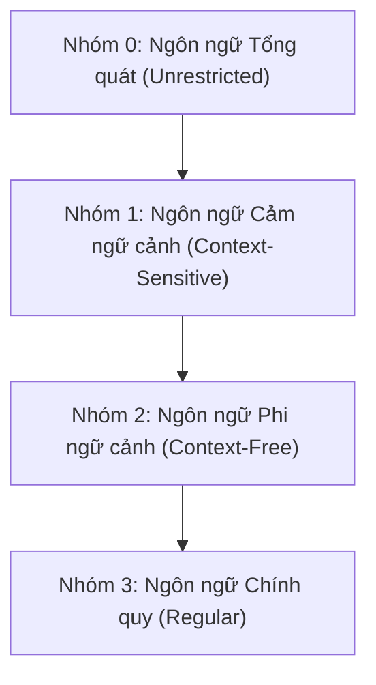

# LÝ THUYẾT TOÀN DIỆN CHƯƠNG 1: VĂN PHẠM VÀ NGÔN NGỮ HÌNH THỨC
*(Kèm ví dụ minh họa trực quan, chi tiết từng bước cho mọi khái niệm)*

---

## MỤC LỤC
1. [Các Khái Niệm Cơ Bản](#1-các-khái-niệm-cơ-bản)
2. [Các Phép Toán Trên Từ (Chuỗi)](#2-các-phép-toán-trên-từ-chuỗi)
3. [Các Phép Toán Trên Ngôn Ngữ](#3-các-phép-toán-trên-ngôn-ngữ)
4. [Văn Phạm và Ngôn Ngữ Sinh Bởi Văn Phạm](#4-văn-phạm-và-ngôn-ngữ-sinh-bởi-văn-phạm)
5. [Phân Loại Văn Phạm Theo Chomsky](#5-phân-loại-văn-phạm-theo-chomsky)
6. [Các Tính Chất Đóng Của Ngôn Ngữ](#6-các-tính-chất-đóng-của-ngôn-ngữ)
7. [Tổng Quan Về Máy Tự Động (Automat)](#7-tổng-quan-về-máy-tự-động-automat)
8. [Các Dạng Bài Tập Mẫu Có Lời Giải Chi Tiết](#8-các-dạng-bài-tập-mẫu-có-lời-giải-chi-tiết)

---

## 1. CÁC KHÁI NIỆM CƠ BẢN

### 1.1 Bảng chữ cái (Alphabet)
- **Định nghĩa:** Bảng chữ cái là một tập hợp hữu hạn, khác rỗng chứa các ký hiệu (hoặc chữ cái). Thường ký hiệu là $\Sigma$ (Sigma), $\Gamma$ (Gamma) hoặc $T$.
- **Ví dụ minh họa:**
  - Bảng chữ cái nhị phân: $\Gamma = \{0, 1\}$
  - Bảng chữ cái la-tinh thường: $\Sigma = \{a, b, c, \dots, z\}$
  - Bảng chữ cái ngôn ngữ lập trình rút gọn: $W = \{\text{if}, \text{then}, \text{else}, a, b, +, -, *, /, =, \neq\}$

---

### 1.2 Từ (Xâu / Chuỗi / Word / String)
- **Định nghĩa:** Một dãy hữu hạn các ký hiệu lấy từ bảng chữ cái $\Sigma$ được gọi là một **từ** (hay chuỗi) trên $\Sigma$.
  - Dạng tổng quát: $w = a_1 a_2 \dots a_n$ với $a_i \in \Sigma$.
- **Độ dài của từ ($|w|$):** Là số lượng ký hiệu xuất hiện trong từ $w$.
  - **Ví dụ:**
    - Cho $w = \text{abaaa} \Rightarrow |w| = 5$.
    - Cho $w = \text{01101} \Rightarrow |w| = 5$.
- **Từ rỗng (Chuỗi rỗng - Empty string):** Ký hiệu là $\lambda$ hoặc $\epsilon$. Là chuỗi không chứa ký hiệu nào.
  - Độ dài: $|\lambda| = |\epsilon| = 0$.
  - $\lambda$ có mặt trên mọi bảng chữ cái.
- **Bao đóng của bảng chữ cái:**
  - $\Sigma^0 = \{\lambda\}$: Tập các chuỗi có độ dài bằng 0 (chỉ chứa duy nhất chuỗi rỗng $\lambda$).
  - $\Sigma^1 = \Sigma$: Tập các chuỗi có độ dài 1.
  - $\Sigma^k$: Tập tất cả các chuỗi có độ dài đúng bằng $k$.
  - $\Sigma^*$ (**Bao đóng Sao - Kleene Star**): Tập hợp **tất cả các chuỗi** (kể cả chuỗi rỗng $\lambda$) tạo thành từ $\Sigma$.
    $$\Sigma^* = \Sigma^0 \cup \Sigma^1 \cup \Sigma^2 \cup \dots$$
  - $\Sigma^+$ (**Bao đóng Dương**): Tập hợp tất cả các chuỗi **khác rỗng** trên $\Sigma$.
    $$\Sigma^+ = \Sigma^* \setminus \{\lambda\} = \Sigma^1 \cup \Sigma^2 \cup \dots$$

> **Ví dụ nhỏ trực quan:**  
> Cho bảng chữ cái $\Sigma = \{0, 1\}$:
> - $\Sigma^0 = \{\lambda\}$
> - $\Sigma^1 = \{0, 1\}$
> - $\Sigma^2 = \{00, 01, 10, 11\}$
> - $\Sigma^3 = \{000, 001, 010, 011, 100, 101, 110, 111\}$
> - $\Sigma^* = \{\lambda, 0, 1, 00, 01, 10, 11, 000, 001, \dots\}$ (vô hạn chuỗi)
> - $\Sigma^+ = \{0, 1, 00, 01, 10, 11, 000, \dots\}$ (bỏ đi $\lambda$)

---

### 1.3 Ngôn ngữ hình thức (Formal Language)
- **Định nghĩa:** Một ngôn ngữ $L$ trên bảng chữ cái $\Sigma$ là một tập con bất kỳ của $\Sigma^*$ ($L \subseteq \Sigma^*$).
- **Ngôn ngữ rỗng ($\emptyset$):** Là ngôn ngữ không chứa bất kỳ từ nào ($|\emptyset| = 0$).
- **Phân biệt cực kỳ quan trọng:**
  - $L = \emptyset$: Ngôn ngữ rỗng (tập hợp rỗng, không có phần tử nào).
  - $L = \{\lambda\}$: Ngôn ngữ chứa 1 từ rỗng duy nhất ($|L| = 1$).
- **Ngôn ngữ hữu hạn vs Vô hạn:**
  - **Hữu hạn:** $L_1 = \{a, ab, aab\}$ (chỉ gồm 3 từ cố định).
  - **Vô hạn:** $L_2 = \{a^n b^n \mid n \ge 0\} = \{\lambda, ab, aabb, aaabbb, \dots\}$ (số lượng từ là vô hạn).

---

## 2. CÁC PHÉP TOÁN TRÊN TỪ (CHUỖI)

### 2.1 Phép nhân ghép (Ghép nối - Concatenation)
- Cho 2 từ $u = a_1 \dots a_m$ và $v = b_1 \dots b_n$, tích ghép là từ $uv = a_1 \dots a_m b_1 \dots b_n$.
- **Tính chất:**
  - $|uv| = |u| + |v|$
  - Không có tính giao hoán: $uv \neq vu$ (nói chung).
  - Phần tử đơn vị: $u\lambda = \lambda u = u$.
  - Lũy thừa của từ: $w^0 = \lambda, \ w^n = \underbrace{w w \dots w}_{n \text{ lần}}, \ |w^n| = n \cdot |w|$.

> **Ví dụ nhỏ:**  
> - Cho $u = 01$ và $v = 110$:
>   - $uv = 01110$ (độ dài: $2 + 3 = 5$).
>   - $vu = 11001 \neq uv$.
> - Cho $w = ab$:
>   - $w^0 = \lambda$
>   - $w^1 = ab$
>   - $w^2 = abab$
>   - $w^3 = ababab$

---

### 2.2 Tiền tố, Hậu tố, Từ con, Điểm
Cho từ $\omega$ trên bảng chữ cái $\Sigma$:
- **Từ con (Substring):** $\phi$ là từ con của $\omega$ nếu $\omega = t_1 \phi t_2$.
- **Tiền tố (Prefix):** Phần đầu của $\omega$ (khi $t_1 = \lambda \Rightarrow \omega = \phi t_2$).
- **Hậu tố (Suffix):** Phần cuối của $\omega$ (khi $t_2 = \lambda \Rightarrow \omega = t_1 \phi$).
- **Số lần xuất hiện của ký hiệu:** Ký hiệu là $I_a(w)$ hoặc $|w|_a$ (số lượng chữ cái $a$ có trong từ $w$).

> **Ví dụ nhỏ:**  
> Xét từ $\omega = \text{"0110"}$:
> - Các tiền tố: $\lambda, \ 0, \ 01, \ 011, \ 0110$.
> - Các hậu tố: $\lambda, \ 0, \ 10, \ 110, \ 0110$.
> - Các từ con: $\lambda, \ 0, \ 1, \ 01, \ 11, \ 10, \ 011, \ 110, \ 0110$.
> - Số lần xuất hiện ký hiệu: $|\omega|_0 = 2, \ |\omega|_1 = 2$.

---

### 2.3 Phép lấy từ ngược (Đảo ngược chuỗi - Reversal)
- Cho $\omega = a_1 a_2 \dots a_m$, từ ngược là $\omega^R$ (hoặc $\omega^{-1}$):
  $$\omega^R = a_m a_{m-1} \dots a_2 a_1$$
- **Tính chất:**
  - $(\omega^R)^R = \omega$
  - $|\omega^R| = |\omega|$
  - $(\alpha\beta)^R = \beta^R \alpha^R$ *(chú ý: đổi ngược thứ tự hai từ)*

> **Ví dụ nhỏ:**  
> - Cho $\omega = \text{"happy"} \Rightarrow \omega^R = \text{"yppah"}$.
> - Cho $u = 01, \ v = 00 \Rightarrow uv = 0100$.
>   - $(uv)^R = 0010$.
>   - $v^R u^R = (00)(10) = 0010 \Rightarrow (uv)^R = v^R u^R$.

---

### 2.4 Phép chia từ (String Quotient / Division)
- **Chia trái ($\beta \setminus \alpha$):** Cắt bỏ tiền tố $\beta$ ở đầu chuỗi $\alpha$ (yêu cầu $\beta$ phải là tiền tố của $\alpha$).
  $$\alpha = \beta\gamma \Rightarrow \beta \setminus \alpha = \gamma$$
- **Chia phải ($\alpha / \gamma$):** Cắt bỏ hậu tố $\gamma$ ở cuối chuỗi $\alpha$ (yêu cầu $\gamma$ phải là hậu tố của $\alpha$).
  $$\alpha = \beta\gamma \Rightarrow \alpha / \gamma = \beta$$

> **Ví dụ nhỏ:**  
> Cho $\alpha = \text{abcaabbcc}, \ \beta = \text{abc}, \ \gamma = \text{bcc}$:
> - **Chia trái:** $\beta \setminus \alpha = \text{abc} \setminus (\text{abc}\text{aabbcc}) = \text{aabbcc}$.
> - **Chia phải:** $\alpha / \gamma = (\text{abcaab}\text{bcc}) / \text{bcc} = \text{abcaab}$.
> - **Trường hợp không chia được:** Nếu $\delta = \text{ba}$ thì $\delta \setminus \alpha$ không xác định (do $\alpha$ không bắt đầu bằng $\text{ba}$).

---

## 3. CÁC PHÉP TOÁN TRÊN NGÔN NGỮ

### 3.1 Hợp, Giao, Hiệu, Phần bù
Cho 2 ngôn ngữ $L_1, L_2 \subseteq \Sigma^*$:
- **Hợp ($L_1 \cup L_2$):** Tập các từ thuộc $L_1$ hoặc thuộc $L_2$.
- **Giao ($L_1 \cap L_2$):** Tập các từ đồng thời thuộc cả $L_1$ và $L_2$.
- **Hiệu ($L_1 \setminus L_2$):** Tập các từ thuộc $L_1$ nhưng không thuộc $L_2$.
- **Phần bù ($C_\Sigma L$ hoặc $\overline{L}$):** $\overline{L} = \Sigma^* \setminus L = \{w \in \Sigma^* \mid w \notin L\}$.

> **Ví dụ nhỏ:**  
> Trên $\Sigma = \{0, 1\}$, cho $L_1 = \{\lambda, 0, 01\}$ và $L_2 = \{\lambda, 01, 10\}$:
> - $L_1 \cup L_2 = \{\lambda, 0, 01, 10\}$
> - $L_1 \cap L_2 = \{\lambda, 01\}$
> - $L_1 \setminus L_2 = \{0\}$
> - Cho $L = \{w \in \Sigma^* \mid |w| \text{ là số chẵn}\} \Rightarrow \overline{L} = \{w \in \Sigma^* \mid |w| \text{ là số lẻ}\}$.

---

### 3.2 Phép nhân ghép ngôn ngữ (Language Concatenation)
- Định nghĩa: $L_1 L_2 = \{xy \mid x \in L_1, y \in L_2\}$.
- **Tính chất cơ bản:**
  - $(L_1 L_2) L_3 = L_1 (L_2 L_3)$ (tính kết hợp).
  - $\{\lambda\} L = L \{\lambda\} = L$ (phần tử đơn vị).
  - $\emptyset L = L \emptyset = \emptyset$ (phần tử triệt tiêu).
  - Phân phối với phép hợp: $L_1 (L_2 \cup L_3) = L_1 L_2 \cup L_1 L_3$.

> **Ví dụ nhỏ 1:**  
> Cho $L_1 = \{a, ab\}$ và $L_2 = \{c, d\}$:
> $$L_1 L_2 = \{ac, ad, abc, abd\}$$

> **Ví dụ nhỏ 2 (Cực kỳ quan trọng - Phản ví dụ tính KHÔNG phân phối với phép giao):**  
> Cho $L_1 = \{0, 01\}, \ L_2 = \{01, 10\}, \ L_3 = \{0\}$ trên $\Sigma = \{0, 1\}$.
> - Ta có $L_2 \cap L_3 = \emptyset \Rightarrow L_1 (L_2 \cap L_3) = L_1 \emptyset = \mathbf{\emptyset}$.
> - Mặt khác:
>   - $L_1 L_2 = \{001, 010, 0101, 0110\}$
>   - $L_1 L_3 = \{00, 010\}$
>   - $\Rightarrow (L_1 L_2) \cap (L_1 L_3) = \mathbf{\{010\}}$.
> - Do $\emptyset \neq \{010\}$, suy ra:
>   $$\mathbf{L_1 (L_2 \cap L_3) \neq (L_1 L_2) \cap (L_1 L_3)}$$
>   *(Phép nhân ghép KHÔNG phân phối đối với phép giao!)*

---

### 3.3 Phép lặp ngôn ngữ ($L^*$ và $L^+$)
- $L^0 = \{\lambda\}$
- $L^1 = L$
- $L^2 = L \cdot L = \{xy \mid x \in L, y \in L\}$
- $L^k = L^{k-1} L$
- **Bao đóng Sao ($L^*$):** $L^* = L^0 \cup L^1 \cup L^2 \cup \dots = \bigcup_{n \ge 0} L^n$ (luôn chứa $\lambda$).
- **Bao đóng Dương ($L^+$):** $L^+ = L^1 \cup L^2 \cup \dots = \bigcup_{n \ge 1} L^n$.

> **Ví dụ nhỏ:**  
> Cho $L = \{ab\}$:
> - $L^0 = \{\lambda\}$
> - $L^1 = \{ab\}$
> - $L^2 = \{abab\}$
> - $L^3 = \{ababab\}$
> - $L^* = \{\lambda, ab, abab, ababab, \dots\} = \{(ab)^n \mid n \ge 0\}$
> - $L^+ = \{ab, abab, ababab, \dots\} = \{(ab)^n \mid n \ge 1\}$

---

### 3.4 Phép lấy ngôn ngữ ngược ($L^R$)
- Định nghĩa: $L^R = \{w^R \mid w \in L\}$.

> **Ví dụ nhỏ:**  
> Cho $L = \{\lambda, ab, 011, cbaa\} \Rightarrow L^R = \{\lambda, ba, 110, aabc\}$.

---

### 3.5 Phép chia ngôn ngữ (Language Quotient)
- **Thương bên trái ($Y \setminus X$):** Cắt bỏ các tiền tố thuộc $Y$ khỏi các từ thuộc $X$.
  $$Y \setminus X = \{z \in \Sigma^* \mid \exists x \in X, y \in Y \text{ sao cho } x = yz\}$$
- **Thương bên phải ($X / Y$):** Cắt bỏ các hậu tố thuộc $Y$ khỏi các từ thuộc $X$.
  $$X / Y = \{z \in \Sigma^* \mid \exists x \in X, y \in Y \text{ sao cho } x = zy\}$$

> **Ví dụ nhỏ từng bước:**  
> Cho $X = \{a, b, abc, cab, bcaa\}$ và $Y = \{\lambda, c, ab\}$:
> - **Tìm $Y \setminus X$ (cắt tiền tố thuộc $Y$):**
>   - Với $y = \lambda \in Y$: cắt $\lambda$ khỏi các từ trong $X \Rightarrow$ giữ nguyên $X$: $\{a, b, abc, cab, bcaa\}$.
>   - Với $y = c \in Y$: tìm từ trong $X$ có tiền tố là $c \to$ từ $cab = c(ab) \Rightarrow$ còn lại $ab$.
>   - Với $y = ab \in Y$: tìm từ trong $X$ có tiền tố là $ab \to$ từ $abc = ab(c) \Rightarrow$ còn lại $c$.
>   - **Kết quả:** $Y \setminus X = \{a, b, abc, cab, bcaa, ab, c\}$.
> - **Tìm $X / Y$ (cắt hậu tố thuộc $Y$):**
>   - Với $y = \lambda \in Y \Rightarrow$ giữ nguyên $X$: $\{a, b, abc, cab, bcaa\}$.
>   - Với $y = c \in Y$: từ $abc = (ab)c \Rightarrow$ còn lại $ab$.
>   - Với $y = ab \in Y$: từ $cab = (c)ab \Rightarrow$ còn lại $c$.
>   - **Kết quả:** $X / Y = \{a, b, abc, cab, bcaa, ab, c\}$.

---

## 4. VĂN PHẠM VÀ NGÔN NGỮ SINH BỞI VĂN PHẠM

### 4.1 Định nghĩa Văn phạm (Grammar)
Một văn phạm $G$ được xác định bởi bộ 4 thành phần:
$$G = (V, T, S, P) \quad \text{hoặc} \quad G = \langle \Sigma, \Delta, S, P \rangle$$
1. **$V$ (hoặc $\Delta$ - Variables / Non-terminals):** Tập các ký hiệu **không kết thúc** (biến). Viết bằng chữ hoa: $S, A, B, C, \dots$ hoặc trong dấu $\langle \text{câu} \rangle$.
2. **$T$ (hoặc $\Sigma$ - Terminals):** Tập các ký hiệu **kết thúc** (chữ cái cuối cùng của ngôn ngữ). Viết bằng chữ thường: $a, b, c, 0, 1, \dots$ ($V \cap T = \emptyset$).
3. **$S \in V$ (Start symbol):** Ký hiệu xuất phát (tiên đề).
4. **$P$ (Productions):** Tập hợp các quy tắc sinh (luật sinh) có dạng:
   $$\alpha \to \beta$$
   - $\alpha$: Vế trái (chứa ít nhất 1 biến $\in V$).
   - $\beta$: Vế phải.

---

### 4.2 Dẫn xuất (Derivation)
- **Dẫn xuất trực tiếp ($\Rightarrow$):** Áp dụng 1 luật sinh thay thế 1 lần: $\gamma \alpha \delta \Rightarrow \gamma \beta \delta$ nếu có luật $\alpha \to \beta$.
- **Dẫn xuất nhiều bước ($\Rightarrow^*$):** Áp dụng liên tiếp nhiều luật sinh: $S \Rightarrow \omega_1 \Rightarrow \omega_2 \Rightarrow \dots \Rightarrow w$.
- **Dạng câu (Sentential Form):** Chuỗi bất kỳ sinh ra từ $S$ mà **vẫn còn chứa biến** (ví dụ: $aaSbb$).
- **Câu (Sentence):** Chuỗi sinh ra từ $S$ mà **chỉ gồm các ký hiệu kết thúc** $\in T^*$ (ví dụ: $aabb$).
- **Ngôn ngữ sinh bởi văn phạm $G$:**
  $$L(G) = \{w \in T^* \mid S \Rightarrow^* w\}$$

> **Ví dụ nhỏ minh họa văn phạm & dẫn xuất:**  
> Cho văn phạm $G = (V, T, S, P)$ với:
> - $V = \{S\}$
> - $T = \{a, b\}$
> - $S$ là biến bắt đầu
> - $P = \{S \to aSb, \ S \to \lambda\}$
>
> **Dẫn xuất sinh chuỗi $w = aabb$:**
> 1. $S \Rightarrow aSb$ *(áp dụng $S \to aSb$ lần 1)*
> 2. $aSb \Rightarrow aaSbb$ *(áp dụng $S \to aSb$ lần 2 - lúc này $aaSbb$ là một dạng câu)*
> 3. $aaSbb \Rightarrow aa\lambda bb = aabb$ *(áp dụng $S \to \lambda$ - thu được câu $aabb$)*
>
> Khi lặp quy tắc 1 đúng $n$ lần rồi dùng quy tắc 2, ta được:
> $$S \Rightarrow^* a^n S b^n \Rightarrow a^n b^n$$
> Vậy ngôn ngữ sinh bởi $G$ là: $\mathbf{L(G) = \{a^n b^n \mid n \ge 0\}}$.

---

### 4.3 Cây dẫn xuất (Cây phân tích cú pháp - Parse Tree)
Biểu diễn trực quan quá trình sinh chuỗi từ nút gốc $S$ đến các lá là ký hiệu kết thúc:

```
        S
      / | \
     a  S  b
      / | \
     a  S  b
        |
    (λ / rỗng)
```
*(Đọc các nút lá từ trái sang phải: $a \cdot a \cdot \lambda \cdot b \cdot b = aabb$)*

---

## 5. PHÂN LOẠI VĂN PHẠM THEO CHOMSKY

Nhà ngôn ngữ học Noam Chomsky chia văn phạm thành 4 cấp bậc với cấu trúc ràng buộc tăng dần:



| Cấp | Tên gọi | Ràng buộc luật sinh $\alpha \to \beta$ | Máy nhận dạng | Ví dụ ngôn ngữ & Luật sinh |
| :---: | :--- | :--- | :--- | :--- |
| **0** | **Không hạn chế** *(Tổng quát / Unrestricted)* | $\alpha \to \beta$, $\alpha$ chứa ít nhất 1 biến, không có ràng buộc nào. | Máy Turing *(Turing Machine)* | Mọi bài toán tính toán được.<br>*Ví dụ:* $AB \to BA, \ aA \to bb$ |
| **1** | **Cảm ngữ cảnh** *(Context-Sensitive)* | $\alpha \to \beta$ thỏa mãn **$|\alpha| \le |\beta|$** (vế phải $\ge$ vế trái). Cho phép $S \to \lambda$ nếu $S$ không ở vế phải. | LBA *(Linear Bounded Automata)* | $L = \{a^n b^n c^n \mid n \ge 1\}$<br>*Ví dụ luật:* $bA \to bb, \ CA \to BA$ |
| **2** | **Phi ngữ cảnh** *(Context-Free)* | **$A \to \omega$** (Vế trái chỉ gồm **đúng 1 biến**, vế phải tùy ý). | PDA *(Pushdown Automata - có Stack)* | $L = \{a^n b^n \mid n \ge 0\}$, biểu thức ngoặc.<br>*Ví dụ luật:* $S \to aSb \mid \lambda$ |
| **3** | **Chính quy** *(Regular)* | Tuyến tính phải: $A \to aB \mid a$<br>Hoặc tuyến tính trái: $A \to Ba \mid a$<br>(Có thể có thêm $S \to \lambda$). | FA *(Finite Automata - DFA/NFA)* | $L = \{0^n 1^m \mid n,m \ge 1\}, \ L = (ab)^*$<br>*Ví dụ luật:* $S \to 0A, A \to 1$ |

### Mối quan hệ bao hàm giữa các lớp ngôn ngữ:
$$\mathbf{L_3 \subset L_2 \subset L_1 \subset L_0}$$
- **Chính quy ($L_3$)** $\subset$ **Phi ngữ cảnh ($L_2$)** $\subset$ **Cảm ngữ cảnh ($L_1$)** $\subset$ **Tổng quát ($L_0$)**.

---

## 6. CÁC TÍNH CHẤT ĐÓNG CỦA NGÔN NGỮ

Tính đóng có nghĩa là: Khi thực hiện phép toán trên các ngôn ngữ thuộc một lớp, kết quả thu được **vẫn thuộc về lớp đó**.

| Phép toán | Lớp Chính quy ($L_3$) | Lớp Phi ngữ cảnh ($L_2$) | Lớp Cảm ngữ cảnh ($L_1$) |
| :--- | :---: | :---: | :---: |
| **Hợp ($L_1 \cup L_2$)** | **Đóng** | **Đóng** | **Đóng** |
| **Nhân ghép ($L_1 L_2$)** | **Đóng** | **Đóng** | **Đóng** |
| **Bao đóng Sao ($L^*$)** | **Đóng** | **Đóng** | **Đóng** |
| **Giao ($L_1 \cap L_2$)** | **Đóng** | ❌ **Không đóng** | **Đóng** |
| **Phần bù ($\overline{L}$)** | **Đóng** | ❌ **Không đóng** | **Đóng** |

> **Định lý quan trọng:** **Mọi ngôn ngữ hữu hạn đều là ngôn ngữ chính quy ($L_3$).**  
> *Ví dụ:* $L = \{0, 01, 011\}$ là ngôn ngữ hữu hạn $\Rightarrow L$ chắc chắn là ngôn ngữ chính quy.

---

## 7. TỔNG QUAN VỀ MÁY TỰ ĐỘNG (AUTOMAT)

Automat là mô hình toán học dùng để **kiểm tra một chuỗi có hợp lệ (được chấp nhận) hay không**:
1. **Automat hữu hạn (Finite Automaton - FA):**
   - **Bộ nhớ:** Không có bộ nhớ phụ, chỉ có trạng thái hữu hạn.
   - **Nhận diện:** Ngôn ngữ chính quy (Nhóm 3).
   - **Gồm 2 loại:** DFA (Đơn định) và NFA (Không đơn định).
2. **Automat đẩy xuống (Pushdown Automaton - PDA):**
   - **Bộ nhớ:** Được gắn thêm 1 bộ nhớ **Ngăn xếp (Stack - LIFO)** để đếm/nhớ số lượng phần tử.
   - **Nhận diện:** Ngôn ngữ phi ngữ cảnh (Nhóm 2) như $a^n b^n$ (nhét $a$ vào stack, gặp $b$ thì pop $a$ ra).
3. **Máy Turing (Turing Machine):**
   - **Bộ nhớ:** Băng đọc-ghi vô hạn 2 chiều.
   - **Nhận diện:** Ngôn ngữ tổng quát (Nhóm 0).

---

## 8. CÁC DẠNG BÀI TẬP MẪU CÓ LỜI GIẢI CHI TIẾT

### Dạng 1: Liệt kê chuỗi ngắn nhất theo thứ tự từ điển
**Đề bài mẫu:** Cho bảng chữ cái $\Sigma = \{a, b\}$. Tìm 5 chuỗi ngắn nhất của ngôn ngữ $L = \{u b u^R \mid u \in \Sigma^*\}$.  
**Lời giải từng bước:**
1. Duyệt $u \in \Sigma^*$ theo độ dài tăng dần:
   - $|u| = 0: u = \lambda \Rightarrow u b u^R = \lambda \cdot b \cdot \lambda = \mathbf{b}$ (độ dài 1).
   - $|u| = 1:$
     - $u = a \Rightarrow a b a^R = \mathbf{aba}$ (độ dài 3).
     - $u = b \Rightarrow b b b^R = \mathbf{bbb}$ (độ dài 3).
   - $|u| = 2:$
     - $u = aa \Rightarrow aa b aa = \mathbf{aabaa}$ (độ dài 5).
     - $u = ab \Rightarrow ab b ba = \mathbf{abbba}$ (độ dài 5).
     - $u = ba \Rightarrow ba b ab = \mathbf{babab}$ (độ dài 5).
     - $u = bb \Rightarrow bb b bb = \mathbf{bbbbb}$ (độ dài 5).
2. Sắp xếp kết quả theo độ dài tăng dần rồi đến bảng chữ cái:
   - Độ dài 1: $b$
   - Độ dài 3: $aba < bbb$
   - Độ dài 5: $aabaa < abbba < \dots$
3. **Kết luận 5 chuỗi ngắn nhất:** $b; \ aba; \ bbb; \ aabaa; \ abbba$.

---

### Dạng 2: Nhận diện ngôn ngữ sinh bởi văn phạm
**Đề bài mẫu:** Xác định ngôn ngữ sinh bởi văn phạm $G = (\{S\}, \{a, b\}, S, \{S \to aSa \mid bSb \mid \lambda\})$.  
**Lời giải từng bước:**
- Thử một số dẫn xuất:
  - $S \Rightarrow \lambda$
  - $S \Rightarrow aSa \Rightarrow aa$
  - $S \Rightarrow bSb \Rightarrow bb$
  - $S \Rightarrow aSa \Rightarrow abSba \Rightarrow abba$
- **Nhận xét:** Mỗi bước thêm cùng 1 ký tự vào 2 đầu chuỗi $\Rightarrow$ chuỗi luôn đối xứng và có độ dài chẵn ($2n$).
- **Kết luận:** $L(G) = \{w w^R \mid w \in \{a, b\}^*\}$ (tập các chuỗi đối xứng độ dài chẵn).

---

### Dạng 3: Kiểm tra chuỗi được chấp nhận bởi văn phạm
**Đề bài mẫu:** Cho văn phạm $S \to 0A, \ A \to 1S \mid 1$. Chuỗi nào sau đây được chấp nhận: $w_1 = 0101, \ w_2 = 010$?  
**Lời giải từng bước:**
- **Kiểm tra $w_1 = 0101$:**
  $$S \Rightarrow 0A \Rightarrow 01S \Rightarrow 010A \Rightarrow 0101$$
  *(Dẫn xuất thành công $\Rightarrow$ **Được chấp nhận**)*
- **Kiểm tra $w_2 = 010$:**
  $$S \Rightarrow 0A \Rightarrow 01S \Rightarrow 010A$$
  Tại $A$ chỉ có thể đi tiếp $A \to 1S$ (thành $0101S$) hoặc $A \to 1$ (thành $0101$), không thể khử $A$ để thành $010$.
  *(Không dẫn xuất được $\Rightarrow$ **Không được chấp nhận**)*
