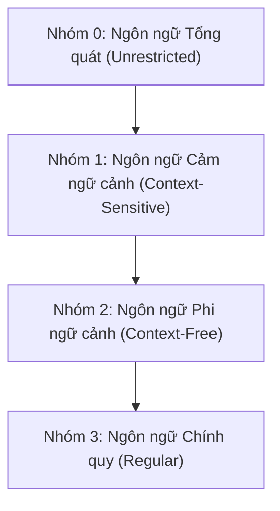

# LÝ THUYẾT ĐẦY ĐỦ CHƯƠNG 1: VĂN PHẠM VÀ NGÔN NGỮ HÌNH THỨC
*(Tổng hợp chi tiết từ Giáo trình và Bài giảng Ôtômát & Ngôn ngữ hình thức)*

---

## MỤC LỤC
1. [Các Khái Niệm Cơ Bản](#1-các-khái-niệm-cơ-bản)
2. [Các Phép Toán Trên Từ (Chuỗi)](#2-các-phép-toán-trên-từ-chuỗi)
3. [Các Phép Toán Trên Ngôn Ngữ](#3-các-phép-toán-trên-ngôn-ngữ)
4. [Văn Phạm và Ngôn Ngữ Sinh Bởi Văn Phạm](#4-văn-phạm-và-ngôn-ngữ-sinh-bởi-văn-phạm)
5. [Phân Loại Văn Phạm Theo Chomsky](#5-phân-loại-văn-phạm-theo-chomsky)
6. [Các Tính Chất & Định Lý Đóng Của Ngôn Ngữ](#6-các-tính-chất--định-lý-đóng-của-ngôn-ngữ)
7. [Tổng Quan Về Máy Tự Động (Automat)](#7-tổng-quan-về-máy-tự-động-automat)
8. [Phương Pháp & Mẹo Giải Các Dạng Bài Tập](#8-phương-pháp--mẹo-giải-các-dạng-bài-tập)

---

## 1. Các Khái Niệm Cơ Bản

### 1.1 Bảng chữ cái (Alphabet)
- **Định nghĩa:** Bảng chữ cái là một tập hợp hữu hạn, khác rỗng chứa các ký hiệu (hoặc chữ cái). Ký hiệu là $\Sigma$ (Sigma), $\Delta$ (Delta) hoặc $\Gamma$ (Gamma).
- **Ví dụ:**
  - $\Sigma = \{a, b, c\}$
  - $\Gamma = \{0, 1\}$
  - $W = \{\text{if}, \text{then}, \text{else}, a, b, +, -, *, /, =, \neq\}$

### 1.2 Từ (Xâu / Chuỗi / Word / String)
- **Định nghĩa:** Một dãy hữu hạn các ký hiệu lấy từ bảng chữ cái $\Sigma$ được gọi là một **từ** (hay xâu/chuỗi) trên $\Sigma$.
  - Dạng tổng quát: $w = a_1 a_2 \dots a_n$ với $a_i \in \Sigma$.
- **Độ dài của từ ($|w|$):** Là tổng số ký hiệu xuất hiện trong từ $w$.
  - Ví dụ: Với $w = abaaa \Rightarrow |w| = 5$.
- **Từ rỗng (Chuỗi rỗng - Empty word):** Ký hiệu là $\lambda$ hoặc $\epsilon$ (được coi là từ không chứa ký hiệu nào).
  - Độ dài: $|\lambda| = |\epsilon| = 0$.
  - Từ rỗng thuộc mọi bảng chữ cái.
- **Hai từ bằng nhau:** $u = a_1 \dots a_n$ và $v = b_1 \dots b_m$ bằng nhau ($u = v$) khi và chỉ khi $n = m$ và $a_i = b_i, \forall i$.
- **Bao đóng của bảng chữ cái:**
  - $\Sigma^*$ (**Bao đóng Sao - Star Closure / Kleene Star**): Tập hợp **tất cả các từ** (kể cả từ rỗng $\lambda$) trên $\Sigma$. $\Sigma^* = \Sigma^0 \cup \Sigma^1 \cup \Sigma^2 \cup \dots$ (vô hạn đếm được).
  - $\Sigma^+$ (**Bao đóng Dương - Positive Closure**): Tập hợp tất cả các từ **khác rỗng** trên $\Sigma$. $\Sigma^+ = \Sigma^* \setminus \{\lambda\}$.
  - $\Sigma^0 = \{\lambda\}$ (tập chuỗi có độ dài 0).
  - $\Sigma^k$: Tập tất cả các chuỗi có độ dài đúng bằng $k$.

### 1.3 Ngôn ngữ hình thức (Formal Language)
- **Định nghĩa:** Một ngôn ngữ $L$ trên bảng chữ cái $\Sigma$ là một tập con bất kỳ của $\Sigma^*$ ($L \subseteq \Sigma^*$).
- **Ngôn ngữ rỗng ($\emptyset$):** Không chứa từ nào ($|\emptyset| = 0$).
- **Phân biệt quan trọng:**
  - $L = \emptyset$: Ngôn ngữ rỗng (không có phần tử nào).
  - $L = \{\lambda\}$: Ngôn ngữ chứa 1 phần tử duy nhất là chuỗi rỗng ($|L| = 1$).
- **Ngôn ngữ hữu hạn vs Vô hạn:**
  - Hữu hạn: $L_1 = \{a, ab, aab\}$ (số phần tử đếm được và dừng lại).
  - Vô hạn: $L_2 = \{a^n b^n \mid n \ge 0\} = \{\lambda, ab, aabb, aaabbb, \dots\}$.

---

## 2. Các Phép Toán Trên Từ (Chuỗi)

### 2.1 Phép nhân ghép (Ghép nối - Concatenation)
- Tích ghép của từ $\alpha = a_1 \dots a_m$ và $\beta = b_1 \dots b_n$ là từ $\gamma = \alpha\beta = a_1 \dots a_m b_1 \dots b_n$.
- **Tính chất:**
  - Tính kết hợp: $(\alpha\beta)\gamma = \alpha(\beta\gamma)$.
  - Phần tử đơn vị: $w\lambda = \lambda w = w$.
  - Tính chất độ dài: $|\alpha\beta| = |\alpha| + |\beta|$.
  - Lũy thừa của từ: $w^0 = \lambda$, $w^n = \underbrace{w w \dots w}_{n \text{ lần}}$, $|w^n| = n \cdot |w|$.

### 2.2 Các khái niệm thành phần của từ
- **Từ con (Substring):** $\phi$ là từ con của $\omega$ nếu tồn tại $t_1, t_2$ sao cho $\omega = t_1 \phi t_2$.
- **Tiền tố (Prefix):** Phần đầu của từ (khi $t_1 = \lambda \Rightarrow \omega = \phi t_2$).
- **Hậu tố (Suffix):** Phần cuối của từ (khi $t_2 = \lambda \Rightarrow \omega = t_1 \phi$).
- *Nhận xét:* $\lambda$ vừa là tiền tố, vừa là hậu tố, vừa là từ con của mọi từ.
- **Số lần xuất hiện của ký hiệu:** Ký hiệu là $I_a(w)$ hoặc $|w|_a$ (số lượng ký hiệu $a$ có trong từ $w$).

### 2.3 Phép lấy từ ngược (Đảo ngược chuỗi - Reversal)
- Cho $\omega = a_1 a_2 \dots a_m$, từ ngược của $\omega$ là $\omega^R$ (hoặc ký hiệu $\omega^{-1}$, $\hat{\omega}$):
  $$\omega^R = a_m a_{m-1} \dots a_2 a_1$$
- Quy ước: $\lambda^R = \lambda$.
- **Tính chất:**
  - $(\omega^R)^R = \omega$
  - $(\alpha\beta)^R = \beta^R \alpha^R$ *(chú ý đổi thứ tự)*
  - $|\omega^R| = |\omega|$

### 2.4 Phép chia từ (String Quotient / Division)
- **Chia trái ($\beta \setminus \alpha$):** Cắt bỏ tiền tố $\beta$ khỏi $\alpha$ (với điều kiện $\beta$ là tiền tố của $\alpha$).
  $$\alpha = \beta\gamma \Rightarrow \beta \setminus \alpha = \gamma$$
- **Chia phải ($\alpha / \gamma$):** Cắt bỏ hậu tố $\gamma$ khỏi $\alpha$ (với điều kiện $\gamma$ là hậu tố của $\alpha$).
  $$\alpha = \beta\gamma \Rightarrow \alpha / \gamma = \beta$$
- **Tính chất:**
  - $\lambda \setminus \alpha = \alpha / \lambda = \alpha$
  - $\alpha \setminus \alpha = \alpha / \alpha = \lambda$
  - $(\beta \setminus \alpha)^R = \alpha^R / \beta^R$
  - $(\alpha / \gamma)^R = \gamma^R \setminus \alpha^R$

---

## 3. Các Phép Toán Trên Ngôn Ngữ

Cho $L_1, L_2, L \subseteq \Sigma^*$:

### 3.1 Phép toán tập hợp
- **Phép hợp:** $L_1 \cup L_2 = \{w \mid w \in L_1 \text{ hoặc } w \in L_2\}$.
- **Phép giao:** $L_1 \cap L_2 = \{w \mid w \in L_1 \text{ và } w \in L_2\}$.
- **Phép hiệu:** $L_1 \setminus L_2 = \{w \mid w \in L_1 \text{ và } w \notin L_2\}$.
- **Phép lấy phần bù:** $C_\Sigma L = \overline{L} = \Sigma^* \setminus L = \{w \in \Sigma^* \mid w \notin L\}$.

### 3.2 Phép nhân ghép ngôn ngữ (Concatenation of Languages)
- $L_1 L_2 = \{xy \mid x \in L_1, y \in L_2\}$.
- **Tính chất:**
  - Tính kết hợp: $(L_1 L_2) L_3 = L_1 (L_2 L_3)$.
  - Phần tử hấp thụ: $\emptyset L = L \emptyset = \emptyset$.
  - Phần tử đơn vị: $\{\lambda\} L = L \{\lambda\} = L$.
  - Phân phối với phép hợp: $L_1(L_2 \cup L_3) = L_1 L_2 \cup L_1 L_3$.
  - **LƯU Ý:** Phép nhân ghép **KHÔNG phân phối** đối với phép giao: $L_1(L_2 \cap L_3) \neq (L_1 L_2) \cap (L_1 L_3)$. Phép hợp/giao cũng không phân phối với phép nhân ghép.

### 3.3 Phép lặp ngôn ngữ (Bao đóng Sao và Bao đóng Dương)
- Lũy thừa ngôn ngữ: $L^0 = \{\lambda\}$, $L^1 = L$, $L^k = L^{k-1} L = \{x_1 x_2 \dots x_k \mid x_i \in L\}$.
- **Bao đóng Sao ($L^*$):** $L^* = \bigcup_{n=0}^{\infty} L^n = L^0 \cup L^1 \cup L^2 \cup \dots$ (luôn chứa $\lambda$).
- **Bao đóng Dương ($L^+$):** $L^+ = \bigcup_{n=1}^{\infty} L^n = L^1 \cup L^2 \cup \dots = L^* \setminus \{\lambda\}$ (nếu $\lambda \notin L$).

### 3.4 Phép lấy ngôn ngữ ngược (Language Reversal)
- $L^R = \{w^R \mid w \in L\}$.
- Tính chất: $(L^R)^R = L$, $\{\lambda\}^R = \{\lambda\}$, $\emptyset^R = \emptyset$, $(L_1 L_2)^R = L_2^R L_1^R$.

### 3.5 Phép chia ngôn ngữ (Language Quotient)
- **Thương trái ($Y \setminus X$):** $Y \setminus X = \{z \in \Sigma^* \mid \exists x \in X, y \in Y \text{ sao cho } x = yz\}$.
- **Thương phải ($X / Y$):** $X / Y = \{z \in \Sigma^* \mid \exists x \in X, y \in Y \text{ sao cho } x = zy\}$.
- Tính chất: $\{\lambda\} \setminus L = L / \{\lambda\} = L$; $\emptyset \setminus L = L / \emptyset = \emptyset$.

---

## 4. Văn Phạm và Ngôn Ngữ Sinh Bởi Văn Phạm

### 4.1 Định nghĩa Văn phạm (Grammar)
Một văn phạm $G$ được định nghĩa là một bộ 4 thành phần:
$$G = (V, T, S, P) \quad \text{hoặc} \quad G = \langle \Sigma, \Delta, S, P \rangle$$
Trong đó:
1. **$V$ (hoặc $\Delta$ - Variables / Non-terminals):** Tập hữu hạn các biến (ký hiệu phụ, ký hiệu chưa kết thúc). Thường viết bằng chữ cái in hoa: $S, A, B, C, \dots$ hoặc trong dấu $\langle \text{câu} \rangle, \langle \text{chủngữ} \rangle$.
2. **$T$ (hoặc $\Sigma$ - Terminals):** Tập hữu hạn các ký hiệu kết thúc (bảng chữ cái cơ sở của ngôn ngữ, $V \cap T = \emptyset$). Thường viết bằng chữ thường: $a, b, c, 0, 1, \dots$
3. **$S \in V$ (Start symbol):** Ký hiệu khởi đầu (tiên đề).
4. **$P$ (Productions / Rules):** Tập hữu hạn các quy tắc sinh (luật sinh) có dạng:
   $$\alpha \to \beta$$
   với $\alpha, \beta \in (V \cup T)^*$ và $\alpha$ phải chứa ít nhất một ký hiệu không kết thúc ($\alpha \notin T^*$).
   - $\alpha$: vế trái.
   - $\beta$: vế phải.
   - Viết tắt: $\alpha \to \beta_1 \mid \beta_2$ tương đương với $\alpha \to \beta_1$ và $\alpha \to \beta_2$.

### 4.2 Dẫn xuất (Derivation)
- **Dẫn xuất trực tiếp ($\Rightarrow$ hoặc $\vdash$):** 
  Nếu $\eta = \gamma \alpha \delta$ và có luật $\alpha \to \beta \in P$, thì ta có thể thay $\alpha$ bằng $\beta$ để được $\omega = \gamma \beta \delta$. Ký hiệu: $\eta \Rightarrow \omega$ (hay $\eta \vdash_G \omega$).
- **Dẫn xuất nhiều bước ($\Rightarrow^*$ hoặc $\models$):**
  Dãy dẫn xuất: $\omega_0 \Rightarrow \omega_1 \Rightarrow \dots \Rightarrow \omega_k$. Ký hiệu: $\omega_0 \Rightarrow^* \omega_k$ ($k$ là độ dài dẫn xuất).
- **Dạng câu (Sentential Form):** Chuỗi $\alpha \in (V \cup T)^*$ sao cho $S \Rightarrow^* \alpha$ (có thể còn chứa biến).
- **Câu (Sentence):** Chuỗi $w \in T^*$ sao cho $S \Rightarrow^* w$ (không còn biến nào).

### 4.3 Ngôn ngữ sinh bởi văn phạm ($L(G)$)
$$L(G) = \{w \in T^* \mid S \Rightarrow^* w\}$$
- Hai văn phạm $G_1$ và $G_2$ được gọi là **tương đương** nếu chúng cùng sinh ra một ngôn ngữ: $L(G_1) = L(G_2)$.

---

## 5. Phân Loại Văn Phạm Theo Chomsky

Noam Chomsky chia văn phạm thành 4 cấp bậc với cấu trúc ràng buộc tăng dần:

| Cấp (Type) | Tên gọi | Dạng luật sinh $\alpha \to \beta$ | Máy đoán nhận tương ứng | Ví dụ ngôn ngữ |
| :--- | :--- | :--- | :--- | :--- |
| **Nhóm 0** | Không hạn chế / Tổng quát *(Unrestricted)* | $\alpha \to \beta$, $\alpha$ chứa ít nhất 1 biến, không có ràng buộc gì thêm. | Máy Turing (Turing Machine) | Mọi ngôn ngữ tính toán được |
| **Nhóm 1** | Cảm ngữ cảnh *(Context-Sensitive)* | $\alpha \to \beta$ thỏa mãn **$|\alpha| \le |\beta|$** (vế phải dài hơn hoặc bằng vế trái). Cho phép $S \to \lambda$ nếu $S$ không ở vế phải. | Automat bị chặn tuyến tính (LBA) | $L = \{a^n b^n c^n \mid n \ge 1\}$ |
| **Nhóm 2** | Phi ngữ cảnh *(Context-Free)* | **$A \to \omega$** (Vế trái chỉ gồm **đúng 1 biến** $A \in V$, vế phải $\omega \in (V \cup T)^*$ tùy ý). | Automat đẩy xuống (PDA - Pushdown Automaton) | $L = \{a^n b^n \mid n \ge 0\}$, biểu thức ngoặc đúng |
| **Nhóm 3** | Chính quy *(Regular)* | Tuyến tính phải: $A \to aB \mid a$ Hoặc tuyến tính trái: $A \to Ba \mid a$ (Có thể thêm $S \to \lambda$). | Automat hữu hạn (FA - DFA/NFA) | $L = \{a^n b^m \mid n,m \ge 1\}$, $L = (ab)^*$ |

### Mối quan hệ bao hàm giữa các lớp ngôn ngữ:
$$L_3 \subset L_2 \subset L_1 \subset L_0$$
- Ngôn ngữ Chính quy ($L_3$) là tập con thực sự của Phi ngữ cảnh ($L_2$).
- Phi ngữ cảnh ($L_2$) là tập con thực sự của Cảm ngữ cảnh ($L_1$).
- Cảm ngữ cảnh ($L_1$) là tập con thực sự của Tổng quát ($L_0$).

---

## 6. Các Tính Chất & Định Lý Đóng Của Ngôn Ngữ

1. **Tính chất tương đương:** Luôn tồn tại văn phạm tương đương $G'$ với $G$ sao cho không chứa biến bắt đầu $S$ ở vế phải, hoặc không chứa ký hiệu kết thúc ở vế trái.
2. **Tính đóng của phép toán:**
   - **Lớp ngôn ngữ chính quy ($L_3$):** Đóng đối với phép **Hợp ($\cup$), Giao ($\cap$), Phần bù ($C$), Nhân ghép ($L_1 L_2$), và Phép lặp ($L^*, L^+$)**.
   - **Lớp ngôn ngữ phi ngữ cảnh ($L_2$):** Đóng đối với phép **Hợp ($\cup$), Nhân ghép ($L_1 L_2$), và Phép lặp ($L^*$)**; *KHÔNG đóng đối với phép Giao ($\cap$) và Phần bù*.
3. **Định lý quan trọng:** **Mọi ngôn ngữ hữu hạn đều là ngôn ngữ chính quy.**

---

## 7. Tổng Quan Về Máy Tự Động (Automat)

Automat là mô hình toán học dùng để **nhận diện (nhận dạng)** ngôn ngữ hình thức và phân tích cú pháp:
1. **Automat hữu hạn (Finite Automata - FA):**
   - Không có bộ nhớ ngoài (chỉ ghi nhớ trạng thái hiện tại).
   - Nhận diện: **Ngôn ngữ chính quy (Nhóm 3)**.
   - Gồm: DFA (đơn định) và NFA (không đơn định).
2. **Automat đẩy xuống (Pushdown Automata - PDA):**
   - Được trang bị thêm bộ nhớ **Ngăn xếp (Stack - LIFO)**.
   - Nhận diện: **Ngôn ngữ phi ngữ cảnh (Nhóm 2)**.
3. **Máy Turing (Turing Machine - TM):**
   - Bộ nhớ băng đọc-ghi vô hạn 2 chiều.
   - Nhận diện: **Ngôn ngữ tổng quát (Nhóm 0)**.

---

## 8. Phương Pháp & Mẹo Giải Các Dạng Bài Tập

### Dạng 1: Liệt kê các chuỗi ngắn nhất theo thứ tự từ điển
- **Quy tắc sắp xếp:**
  1. Độ dài tăng dần: Độ dài 0 ($\lambda$) $\to$ Độ dài 1 $\to$ Độ dài 2 $\dots$
  2. Cùng độ dài: Sắp xếp theo thứ tự bảng chữ cái ($a < b$, $0 < 1$).
- **Mẹo:** Duyệt $u \in \Sigma^*$ theo thứ tự chuẩn: $\lambda, a, b, aa, ab, ba, bb, aaa, \dots$ rồi tính công thức của chuỗi kết quả và sắp xếp lại theo độ dài.

### Dạng 2: Xác định ngôn ngữ/tính chất sinh bởi văn phạm
- **$S \to aSb \mid \lambda$:** Cân bằng 2 bên $\to L = \{a^n b^n \mid n \ge 0\}$.
- **$S \to aSa \mid bSb \mid a \mid b \mid \lambda$:** Kẹp giống nhau ở 2 đầu $\to$ Chuỗi đối xứng (Palindrome) $w = w^R$.
- **$S \to aS \mid bS \mid \lambda$ hoặc $S \to Sa \mid Sb \mid \lambda$:** Thêm $a, b$ tùy ý $\to \Sigma^* = \{a, b\}^*$.
- **$S \to aB; B \to bS; S \to \lambda$:** Chu kỳ chuyển trạng thái chẵn $\to (ab)^*$.

### Dạng 3: Kiểm tra chuỗi có được văn phạm chấp nhận hay không
- Thực hiện dẫn xuất từng bước từ $S$. Nếu từ $S$ biến đổi ra đúng chuỗi đó bằng các ký hiệu kết thúc thì **Được chấp nhận**. Nếu bị nghẽn (không có luật phù hợp) hoặc chu kỳ độ dài không khớp thì **Không được chấp nhận**.
