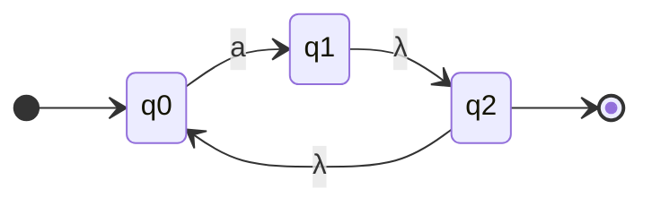
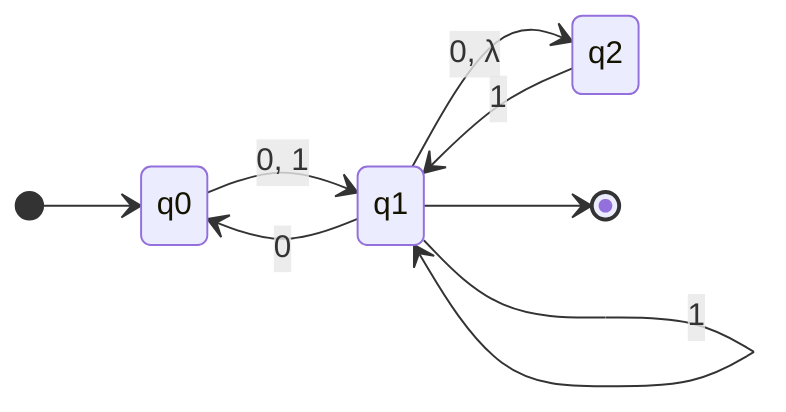
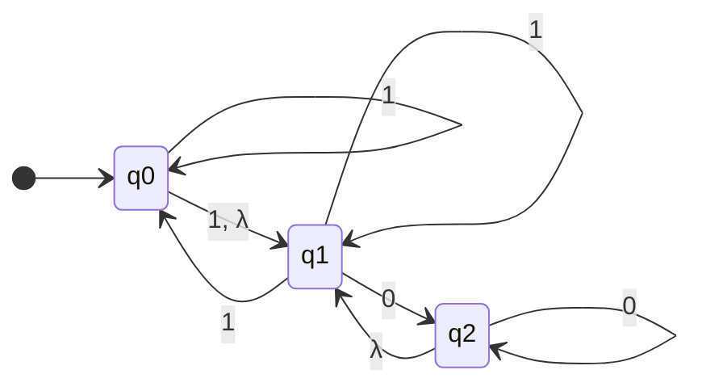
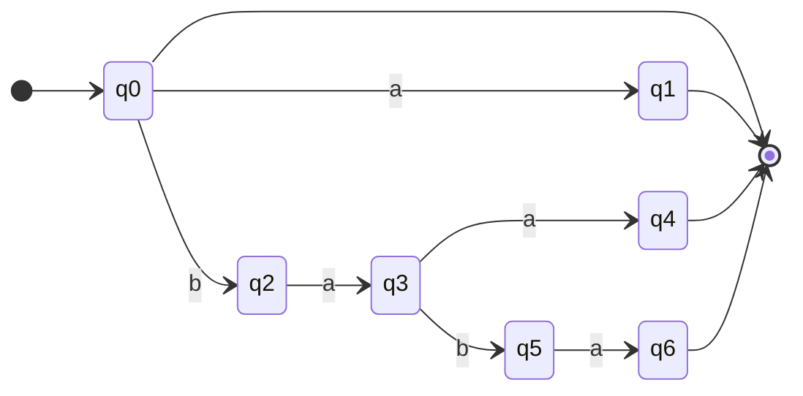
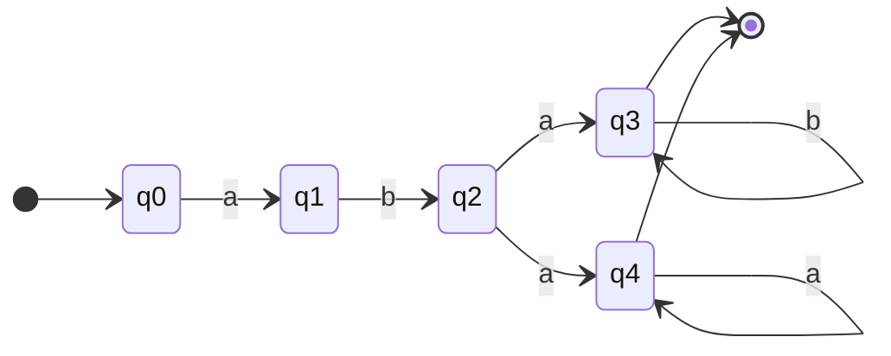
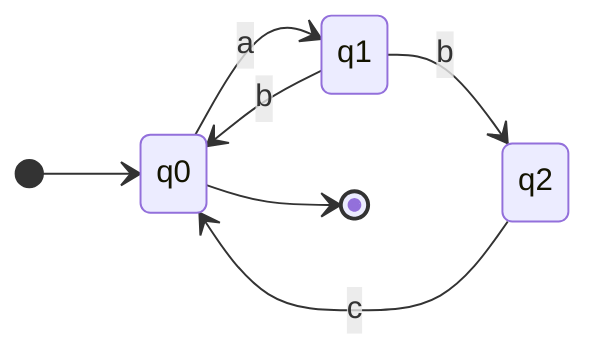
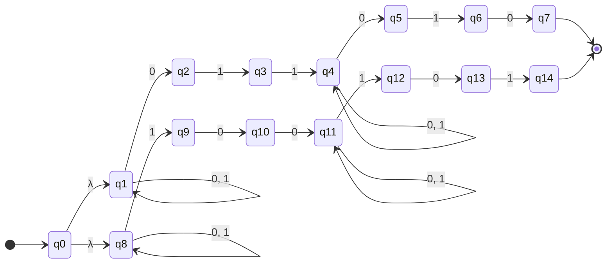
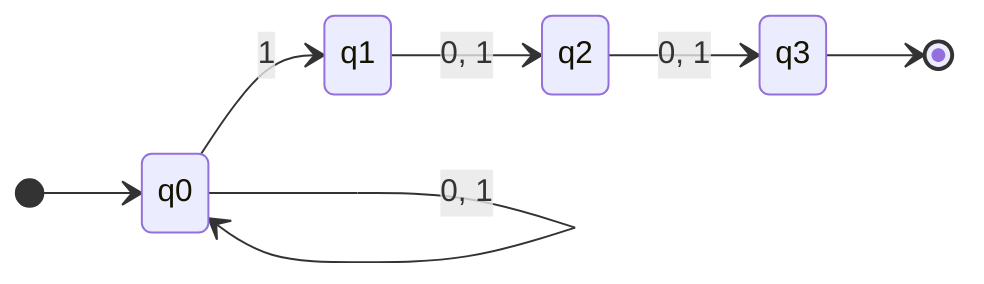
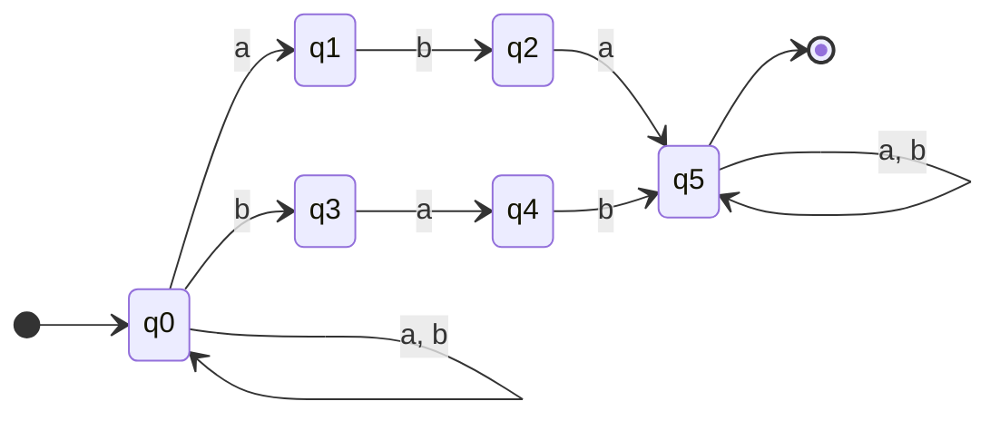
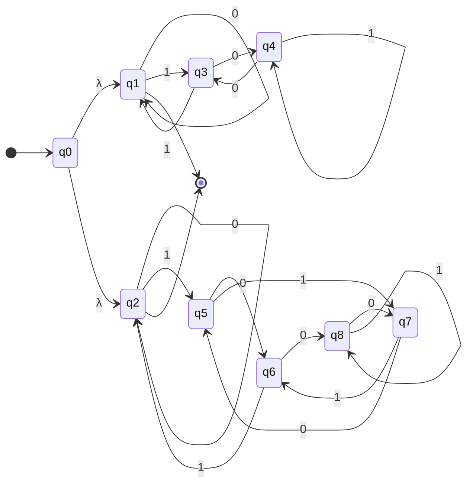

# GIẢI CHI TIẾT TOÀN BỘ BÀI TẬP NFA (CHUẨN THI 100%)
*(Lời giải chi tiết từng bước, kèm hình vẽ Mermaid, bảng chuyển dịch và giải thích thuật toán)*

---

## PHẦN 1: BÀI TẬP TỪ TÀI LIỆU LÝ THUYẾT NFA

### BÀI 1
**Đề bài:** Cho đồ thị chuyển dịch của NFA như hình dưới đây. Hãy tìm $\delta(q_0, a)$ và $\delta(q_1, \lambda)$.

**Lời giải:**
1. **Tìm $\delta(q_0, a)$:**
   - Quan sát từ trạng thái $q_0$, mũi tên có nhãn $a$ đi tới trạng thái $q_1$.
   - Do đó:
     $$\mathbf{\delta(q_0, a) = \{q_1\}}$$

2. **Tìm $\delta(q_1, \lambda)$:**
   - Quan sát từ trạng thái $q_1$, mũi tên có nhãn $\lambda$ (chuyển dịch rỗng) đi tới trạng thái $q_2$.
   - Do đó:
     $$\mathbf{\delta(q_1, \lambda) = \{q_2\}}$$

---

### BÀI 2
**Đề bài:** Cho NFA $M = (Q, \Sigma, \delta, q_0, F)$ với $Q = \{q_0, q_1, q_2\}$, $\Sigma = \{0, 1\}$, trạng thái ban đầu là $q_0$, tập trạng thái kết thúc $F = \{q_1\}$. Đồ thị chuyển dịch như sau:

**Yêu cầu:**
a) Hãy tìm $\delta^*(q_0, 1010)$ và $\delta^*(q_1, 00)$.  
b) Chuỗi nào trong các chuỗi sau được chấp nhận: $00, \ 01001, \ 10010, \ 000, \ 0000$?

---

**Lời giải:**

#### a) Tìm $\delta^*(q_0, 1010)$ và $\delta^*(q_1, 00)$

> 💡 **Quy tắc tính có chuyển dịch $\lambda$:**  
> Mỗi khi đến một trạng thái có cung $\lambda$, ta phải lấy ngay tập bao đóng $\lambda$ ($\lambda\text{-closure}$).  
> Tại $q_1$, vì có $q_1 \xrightarrow{\lambda} q_2$, nên bất cứ khi nào đến $q_1$ thì NFA đồng thời cũng đang ở $q_2$. Tập tương ứng là $\{q_1, q_2\}$.

* **Tính $\delta^*(q_0, 1010)$ từng ký tự:**
  1. Đọc ký tự **'1'** đầu tiên:
     - $\delta(q_0, 1) = \{q_1\} \xrightarrow{\lambda} \{q_1, q_2\}$.
  2. Đọc tiếp ký tự **'0'**:
     - Từ $q_1$: $\delta(q_1, 0) = \{q_0, q_2\}$.
     - Từ $q_2$: $\delta(q_2, 0) = \emptyset$ (ngõ cụt).
     - Hợp lại: $\{q_0, q_2\}$.
  3. Đọc tiếp ký tự **'1'**:
     - Từ $q_0$: $\delta(q_0, 1) = \{q_1\} \xrightarrow{\lambda} \{q_1, q_2\}$.
     - Từ $q_2$: $\delta(q_2, 1) = \{q_1\} \xrightarrow{\lambda} \{q_1, q_2\}$.
     - Hợp lại: $\{q_1, q_2\}$.
  4. Đọc tiếp ký tự **'0'** cuối cùng:
     - Từ $q_1$: $\delta(q_1, 0) = \{q_0, q_2\}$.
     - Từ $q_2$: $\delta(q_2, 0) = \emptyset$.
     - Hợp lại: $\{q_0, q_2\}$.
  - **Kết luận:**
    $$\mathbf{\delta^*(q_0, 1010) = \{q_0, q_2\}}$$

---

* **Tính $\delta^*(q_1, 00)$:**
  - Xuất phát từ $q_1$ (đồng thời ở $q_2$ do cung $\lambda$), tập ban đầu là $\{q_1, q_2\}$.
  1. Đọc ký tự **'0'** thứ nhất:
     - Từ $q_1$: $\delta(q_1, 0) = \{q_0, q_2\}$.
     - Từ $q_2$: $\delta(q_2, 0) = \emptyset$.
     - Thu được tập: $\{q_0, q_2\}$.
  2. Đọc ký tự **'0'** thứ hai:
     - Từ $q_0$: $\delta(q_0, 0) = \{q_1\} \xrightarrow{\lambda} \{q_1, q_2\}$.
     - Từ $q_2$: $\delta(q_2, 0) = \emptyset$.
     - Thu được tập: $\{q_1, q_2\}$.
  - **Kết luận:**
    $$\mathbf{\delta^*(q_1, 00) = \{q_1, q_2\}}$$

---

#### b) Kiểm tra các chuỗi được chấp nhận ($F = \{q_1\}$)

| Chuỗi $w$ | Các bước chuyển trạng thái từ $q_0$ | Tập trạng thái cuối cùng $\delta^*(q_0, w)$ | Chứa $q_1 \in F$? | Kết luận |
| :---: | :--- | :---: | :---: | :---: |
| **$00$** | $q_0 \xrightarrow{0} \{q_1, q_2\} \xrightarrow{0} \{q_0, q_2\}$ | $\{q_0, q_2\}$ | ❌ Không | **Không chấp nhận** |
| **$01001$** | $q_0 \xrightarrow{0} \{q_1, q_2\} \xrightarrow{1} \{q_1, q_2\} \xrightarrow{0} \{q_0, q_2\} \xrightarrow{0} \{q_1, q_2\} \xrightarrow{1} \{q_1, q_2\}$ | $\{q_1, q_2\}$ | ✅ Có ($q_1$) | **ĐƯỢC CHẤP NHẬN** |
| **$10010$** | $q_0 \xrightarrow{1} \{q_1, q_2\} \xrightarrow{0} \{q_0, q_2\} \xrightarrow{0} \{q_1, q_2\} \xrightarrow{1} \{q_1, q_2\} \xrightarrow{0} \{q_0, q_2\}$ | $\{q_0, q_2\}$ | ❌ Không | **Không chấp nhận** |
| **$000$** | $q_0 \xrightarrow{0} \{q_1, q_2\} \xrightarrow{0} \{q_0, q_2\} \xrightarrow{0} \{q_1, q_2\}$ | $\{q_1, q_2\}$ | ✅ Có ($q_1$) | **ĐƯỢC CHẤP NHẬN** |
| **$0000$** | $q_0 \xrightarrow{000} \{q_1, q_2\} \xrightarrow{0} \{q_0, q_2\}$ | $\{q_0, q_2\}$ | ❌ Không | **Không chấp nhận** |

👉 **Đáp án:** Các chuỗi được NFA chấp nhận là: **$01001$** và **$000$**.

---

### BÀI 3
**Đề bài:** Cho bảng chuyển dịch của một NFA với $Q = \{q_0, q_1, q_2\}, \Sigma = \{0, 1\}$, trạng thái ban đầu $q_0$. Vẽ đồ thị chuyển dịch của NFA.

| Trạng thái | $\mathbf{0}$ | $\mathbf{1}$ | $\mathbf{\lambda}$ |
| :---: | :---: | :---: | :---: |
| **$q_0$** | $\emptyset$ | $\{q_0, q_1\}$ | $\{q_1\}$ |
| **$q_1$** | $\{q_2\}$ | $\{q_0, q_1\}$ | $\emptyset$ |
| **$q_2$** | $\{q_2\}$ | $\emptyset$ | $\{q_1\}$ |

**Lời giải:**
- Từ $q_0$:
  - Đọc $1$: đi tới chính nó $q_0$ (vòng lặp) và đi tới $q_1$.
  - Đọc $\lambda$: đi tới $q_1$.
  - Đọc $0$: không có đường đi ($\emptyset$).
- Từ $q_1$:
  - Đọc $0$: đi tới $q_2$.
  - Đọc $1$: đi tới $q_0$ và đi tới chính nó $q_1$.
- Từ $q_2$:
  - Đọc $0$: đi tới chính nó $q_2$ (vòng lặp).
  - Đọc $\lambda$: đi tới $q_1$.

---

### BÀI 4
**Đề bài:** Thiết kế một NFA chấp nhận các chuỗi $\lambda, \ a, \ baba, \ baa$, nhưng **không chấp nhận** các chuỗi $b, \ bb, \ babba$.

**Phân tích & Thiết kế:**
1. Chấp nhận chuỗi rỗng $\lambda \Rightarrow$ Trạng thái khởi đầu $q_0$ phải là **trạng thái kết thúc** ($q_0 \in F$).
2. Chấp nhận chuỗi $a \Rightarrow$ Từ $q_0 \xrightarrow{a} q_1$ với $q_1 \in F$.
3. Chấp nhận chuỗi $baa$ và $baba$:
   - Từ $q_0 \xrightarrow{b} q_2 \xrightarrow{a} q_3$.
   - Tại $q_3$:
     - Nhánh 1: $q_3 \xrightarrow{a} q_4 \in F$ (nhận chuỗi $baa$).
     - Nhánh 2: $q_3 \xrightarrow{b} q_5 \xrightarrow{a} q_6 \in F$ (nhận chuỗi $baba$).
4. Kiểm tra các chuỗi bị loại:
   - Chuỗi $b \to$ dừng ở $q_2 \notin F \Rightarrow$ Loại.
   - Chuỗi $bb \to$ tại $q_2$ không có cung $b \Rightarrow$ Rơi vào $\emptyset \Rightarrow$ Loại.
   - Chuỗi $babba \to q_0 \xrightarrow{b} q_2 \xrightarrow{a} q_3 \xrightarrow{b} q_5 \xrightarrow{b}$ (tại $q_5$ chỉ có cung $a$, không có cung $b$) $\Rightarrow$ Rơi vào $\emptyset \Rightarrow$ Loại.

---

### BÀI 5
**Đề bài:** Thiết kế NFA không quá 5 trạng thái cho ngôn ngữ:
$$L = \{aba b^n \mid n \ge 0\} \cup \{aba a^n \mid n \ge 0\}$$

**Phân tích & Thiết kế:**
- Cả hai họ ngôn ngữ đều có tiền tố chung cố định là chuỗi **$aba$**.
- Thiết kế nhánh dẫn xuất chuỗi $aba$: $q_0 \xrightarrow{a} q_1 \xrightarrow{b} q_2 \xrightarrow{a}$.
- Sau khi đọc xong $aba$, ngôn ngữ rẽ làm 2 nhánh:
  - Nhánh 1 (nhận thêm $b^n$): dừng tại $q_3 \in F$ có vòng lặp $b$.
  - Nhánh 2 (nhận thêm $a^n$): dừng tại $q_4 \in F$ có vòng lặp $a$.
- Tổng số trạng thái: đúng **5 trạng thái** $\{q_0, q_1, q_2, q_3, q_4\}$.

---

### BÀI 6
**Đề bài:** Thiết kế một NFA có đúng 3 trạng thái chấp nhận ngôn ngữ $L = \{ab, abc\}^*$.

**Phân tích:**
- Ngôn ngữ $\{ab, abc\}^*$ cho phép lặp lại tùy ý các khối "gạch" $ab$ và $abc$ (kể cả 0 lần lặp là chuỗi $\lambda$).
- Do có $\lambda \in L$, trạng thái bắt đầu $q_0$ phải là **trạng thái chấp nhận** ($q_0 \in F$).
- Để tiết kiệm trạng thái (đúng 3 trạng thái $q_0, q_1, q_2$):
  - Khối $ab$: $q_0 \xrightarrow{a} q_1 \xrightarrow{b} q_0$ (quay về đích).
  - Khối $abc$: $q_0 \xrightarrow{a} q_1 \xrightarrow{b} q_2 \xrightarrow{c} q_0$ (dùng chung $a$ và $b$ đầu, chỉ thêm $q_2$ để đọc $c$).

- **Kiểm tra tính không đơn định:** Tại $q_1$, khi đọc ký tự $b$, NFA vừa có thể quay về $q_0$ (nếu là khối $ab$), vừa có thể rẽ sang $q_2$ (nếu là khối $abc$). Rất thông minh và đúng 3 trạng thái!

---

### BÀI 7
**Đề bài:** Thiết kế NFA chấp nhận tập các chuỗi nhị phân trên $\Sigma = \{0, 1\}$:
*"Kết thúc bằng $010$ và có chuỗi $011$ ở bất kỳ trước đó, HOẶC kết thúc bằng $101$ và có chuỗi $100$ ở bất kỳ trước đó."*

**Phân tích:**
NFA sẽ phân nhánh làm 2 luồng độc lập từ trạng thái bắt đầu $q_0$:
- **Nhánh trên (Nhánh 1):** 
  - Đợi chuỗi $011$: $q_1 \xrightarrow{0} q_2 \xrightarrow{1} q_3 \xrightarrow{1} q_4$. (Tại $q_1$ có vòng lặp $\{0, 1\}$).
  - Đợi chuỗi kết thúc $010$: $q_4 \xrightarrow{0} q_5 \xrightarrow{1} q_6 \xrightarrow{0} q_7 \in F$. (Tại $q_4$ có vòng lặp $\{0, 1\}$).
- **Nhánh dưới (Nhánh 2):** 
  - Đợi chuỗi $100$: $q_8 \xrightarrow{1} q_9 \xrightarrow{0} q_{10} \xrightarrow{0} q_{11}$. (Tại $q_8$ có vòng lặp $\{0, 1\}$).
  - Đợi chuỗi kết thúc $101$: $q_{11} \xrightarrow{1} q_{12} \xrightarrow{0} q_{13} \xrightarrow{1} q_{14} \in F$. (Tại $q_{11}$ có vòng lặp $\{0, 1\}$).

---

## PHẦN 2: BÀI TẬP TỪ TÀI LIỆU THIẾT KẾ NFA

### BÀI 1
**Đề bài:** Thiết kế NFA chấp nhận ngôn ngữ $L_1$ trên $\Sigma = \{0, 1\}$ sao cho các chuỗi có ký tự thứ 3 tính từ cuối lên là số 1.

**Lời giải:**
- **Dạng chuỗi:** $*** 1 **$ (sau ký tự 1 có đúng 2 ký tự bất kỳ $\in \{0, 1\}$ rồi kết thúc).
- **Thiết kế:**
  - $q_0$: Trạng thái bắt đầu với vòng lặp $\{0, 1\}$ để đọc phần đầu chuỗi.
  - $q_0 \xrightarrow{1} q_1$: Đoán bắt đầu vào vị trí thứ 3 từ cuối lên.
  - $q_1 \xrightarrow{0, 1} q_2$: Đọc ký tự thứ 2 từ cuối lên.
  - $q_2 \xrightarrow{0, 1} q_3$: Đọc ký tự cuối cùng $\to q_3 \in F$.

---

### BÀI 2
**Đề bài:** Thiết kế NFA chấp nhận ngôn ngữ $L_2$ trên $\Sigma = \{a, b\}$ chứa chuỗi con $aba$ HOẶC $bab$.

**Lời giải:**
- **Dạng chuỗi:** $*** aba ***$ hoặc $*** bab ***$.
- **Thiết kế:**
  - $q_0$: Trạng thái bắt đầu với vòng lặp $\{a, b\}$.
  - Nhánh 1 (nhận $aba$): $q_0 \xrightarrow{a} q_1 \xrightarrow{b} q_2 \xrightarrow{a} q_5 \in F$.
  - Nhánh 2 (nhận $bab$): $q_0 \xrightarrow{b} q_3 \xrightarrow{a} q_4 \xrightarrow{b} q_5 \in F$.
  - Tại $q_5$: Vòng lặp $\{a, b\}$ để đọc phần đuôi tùy ý.

---

### BÀI 3
**Đề bài:** Thiết kế NFA chấp nhận các chuỗi nhị phân đại diện cho số nguyên chia hết cho 3 HOẶC chia hết cho 5.

**Lời giải:**

#### 1. Nguyên lý số học chuyển trạng thái số nhị phân:
Khi đọc thêm một bit $b \in \{0, 1\}$ vào sau một số có giá trị hiện tại là $v$, giá trị mới là:
$$v_{\text{mới}} = 2v + b \pmod k$$

#### 2. Máy con A (Số chia hết cho 3 - các số dư 0, 1, 2):
- Các trạng thái: $q_1$ (dư 0 - kết thúc), $q_3$ (dư 1), $q_4$ (dư 2).
- Chuyển dịch:
  - Tại $q_1$: đọc $0 \to q_1$ (vòng lặp), đọc $1 \to q_3$.
  - Tại $q_3$: đọc $0 \to q_4$, đọc $1 \to q_1$.
  - Tại $q_4$: đọc $0 \to q_3$, đọc $1 \to q_4$ (vòng lặp).

#### 3. Máy con B (Số chia hết cho 5 - các số dư 0, 1, 2, 3, 4):
- Các trạng thái: $q_2$ (dư 0 - kết thúc), $q_5$ (dư 1), $q_6$ (dư 2), $q_7$ (dư 3), $q_8$ (dư 4).
- Chuyển dịch:
  - $q_2$: đọc $0 \to q_2$, đọc $1 \to q_5$.
  - $q_5$: đọc $0 \to q_6$, đọc $1 \to q_7$.
  - $q_6$: đọc $0 \to q_8$, đọc $1 \to q_2$.
  - $q_7$: đọc $0 \to q_5$, đọc $1 \to q_6$.
  - $q_8$: đọc $0 \to q_7$, đọc $1 \to q_8$.

#### 4. Kết hợp NFA bằng chuyển dịch $\lambda$:
Tạo trạng thái bắt đầu $q_0$, nối $\lambda$ sang $q_1$ (Máy A) và $\lambda$ sang $q_2$ (Máy B).

