# GIẢI CHI TIẾT TOÀN BỘ BÀI TẬP NFA (CHUẨN THI 100%)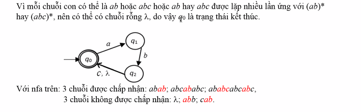

*(Lời giải chi tiết từng bước, kèm hình vẽ Mermaid, bảng chuyển dịch và giải thích thuật toán)*

---

## PHẦN 1: BÀI TẬP TỪ TÀI LIỆU LÝ THUYẾT NFA

### BÀI 1

**Đề bài:** Cho đồ thị chuyển dịch của NFA như hình dưới đây. Hãy tìm $\delta(q_0, a)$ và $\delta(q_1, \lambda)$.

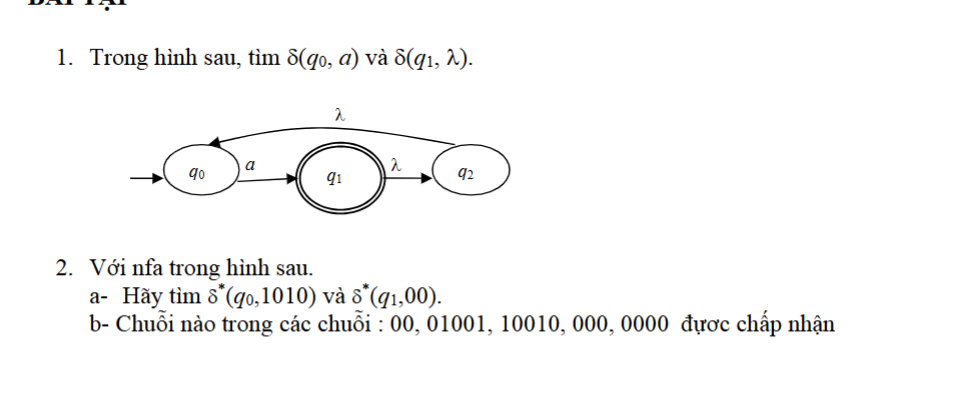

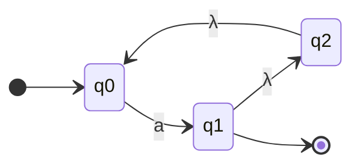

*(Lưu ý: $q_0$ là trạng thái bắt đầu, $q_1$ là trạng thái kết thúc vẽ 2 vòng tròn, có vòng lặp $\lambda$ liên hoàn $q_1 \xrightarrow{\lambda} q_2 \xrightarrow{\lambda} q_0$)*

---

**Lời giải chi tiết:**

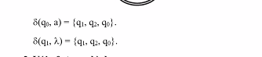

#### 1. Tìm $\delta(q_0, a)$ (Tập trạng thái đạt được khi từ $q_0$ đọc ký tự $a$):

* **Bước 1 (Đọc ký tự $a$ trực tiếp):**
  - Từ $q_0$, theo mũi tên nhãn $a$, máy chuyển trực tiếp tới trạng thái **$q_1$**.
* **Bước 2 (Kích hoạt dây chuyền chuyển dịch rỗng $\lambda$ không tốn ký tự):**
  - Vì tại $q_1$ có cung $q_1 \xrightarrow{\lambda} q_2$, nên máy tự động nhảy sang **$q_2$** mà không cần đọc thêm ký tự nào.
  - Từ $q_2$ lại có tiếp cung $q_2 \xrightarrow{\lambda} q_0$, nên máy tiếp tục tự động nhảy về **$q_0$**.
* **Tổng hợp tất cả các trạng thái máy có thể đứng sau khi đọc $a$:**
  - Máy có thể ở lại $q_1$ (đến trực tiếp).
  - Máy có thể nhảy sang $q_2$ (qua $\lambda$).
  - Máy có thể nhảy tiếp về $q_0$ (qua $\lambda$).
* **Kết luận:**
  $$
  \delta(q_0, a) = \{q_1, q_2, q_0\}
  $$

---

#### 2. Tìm $\delta(q_1, \lambda)$ (Tập trạng thái đạt được từ $q_1$ chỉ bằng chuyển dịch $\lambda$):

* **Nguyên tắc bao đóng $\lambda$ ($\lambda\text{-closure}$):** Khi đứng ở trạng thái $q_1$ và không đọc ký tự nào:
  1. Máy có thể **ở lại chính nó tại $q_1$** (tính chất tự thân).
  2. Máy theo cung $q_1 \xrightarrow{\lambda} q_2$ để nhảy sang **$q_2$**.
  3. Từ $q_2$, máy theo cung $q_2 \xrightarrow{\lambda} q_0$ để nhảy tiếp về **$q_0$**.
* **Tổng hợp lại ta được tập 3 trạng thái:**
  $$
  \delta(q_1, \lambda) = \{q_1, q_2, q_0\}
  $$

> 💡 **Mẹo nhớ để thi lấy trọn điểm:**
> Cứ khi nào thấy xuất hiện cung $\lambda$ liên tiếp ($q_1 \xrightarrow{\lambda} q_2 \xrightarrow{\lambda} q_0$), thì bất kỳ trạng thái nào đi vào $q_1$ đều sẽ **kéo theo toàn bộ chuỗi trạng thái phía sau nó** vào tập kết quả!

---

### BÀI 2

**Đề bài:** Cho NFA $M = (Q, \Sigma, \delta, q_0, F)$ với $Q = \{q_0, q_1, q_2\}$, $\Sigma = \{0, 1\}$, trạng thái ban đầu là $q_0$, tập trạng thái kết thúc $F = \{q_1\}$. Đồ thị chuyển dịch như sau:

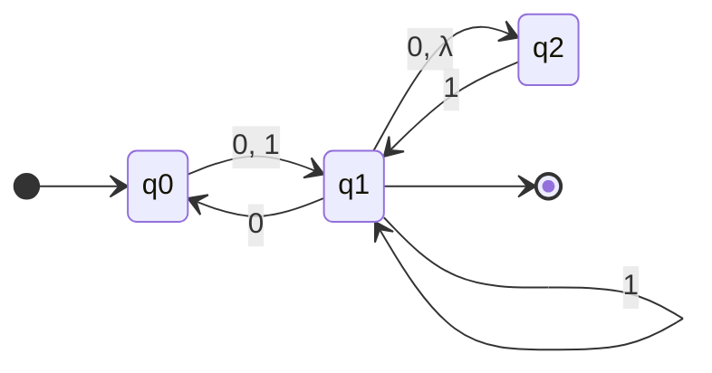

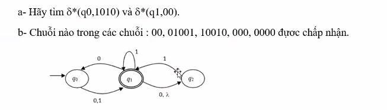

**Yêu cầu:**
a) Hãy tìm $\delta^*(q_0, 1010)$ và $\delta^*(q_1, 00)$.
b) Chuỗi nào trong các chuỗi sau được chấp nhận: $00, \ 01001, \ 10010, \ 000, \ 0000$?

---

**Lời giải chi tiết (Trình bày theo Cây tiến trình song song):**

#### a) Tìm $\delta^*(q_0, 1010)$ và $\delta^*(q_1, 00)$ bằng Cây tiến trình

---

##### 1. Cây tiến trình tìm $\delta^*(q_0, 1010)$:

```
                                                        ┌── (q0, 0) ──→ q0
                           ┌── (q0, 10) ──→ (q1, 0) ────┤
                           │                            └── (q2, 0) ──→ q2
(q0, 1010) ──→ (q1, 010) ──┤
                           │                            ┌── (q0, 0) ──→ q0
                           └── (q2, 10) ──→ (q1, 0) ────┤
                                                        └── (q2, 0) ──→ q2
```

* **Giải thích chi tiết từng bước trên cây:**
  - $(q_0, 1010) \to (q_1, 010)$: Từ $q_0$ đọc ký tự $1$ chuyển sang trạng thái $q_1$.
  - Tại $(q_1, 010)$: Đọc ký tự $0$, máy **phân nhánh không đơn định**:
    - **Nhánh trên:** $q_1 \xrightarrow{0} q_0 \to (q_0, 10)$.
    - **Nhánh dưới:** $q_1 \xrightarrow{0} q_2 \to (q_2, 10)$.
  - Tiếp tục đọc ký tự $1$:
    - Nhánh trên $(q_0, 10)$: Từ $q_0$ đọc $1 \to (q_1, 0)$.
    - Nhánh dưới $(q_2, 10)$: Từ $q_2$ đọc $1 \to (q_1, 0)$.
  - Đọc ký tự $0$ cuối cùng:
    - Từ $(q_1, 0)$ phân nhánh: một nhánh về **$q_0$**, một nhánh sang **$q_2$**.
* **Kết luận:** Tập trạng thái kết thúc là:
  $$
  \delta^*(q_0, 1010) = \{q_0, q_2\}
  $$

---

##### 2. Cây tiến trình tìm $\delta^*(q_1, 00)$:

```
                         ┌── (q0, 0) ──→ q1
(q1, 00) ────────────────┤
                         └── (q2, 0) ──→ Rỗng (do tại q2 không có cung 0)
```

* **Giải thích chi tiết:**
  - Xuất phát từ $q_1$, đọc ký tự $0$ thứ nhất:
    - Nhánh 1: $q_1 \xrightarrow{0} q_0 \to (q_0, 0)$.
    - Nhánh 2: $q_1 \xrightarrow{0} q_2 \to (q_2, 0)$.
  - Đọc tiếp ký tự $0$ thứ hai:
    - Từ $(q_0, 0) \to **$q_1$**$ (và do có cung $\lambda \to q_2$ nên cũng đồng thời ở **$q_2$**).
    - Từ $(q_2, 0) \to$ **Rỗng ($\emptyset$)** (ngõ cụt do $q_2$ không có đường đi cho $0$).
* **Kết luận:** Tập trạng thái kết thúc là:
  $$
  \delta^*(q_1, 00) = \{q_1, q_2\}
  $$

---

#### b) Kiểm tra 5 chuỗi bằng Cây tiến trình ($F = \{q_1\}$)

---

##### 1. Với chuỗi $w = 00$:

```
                         ┌── (q0, λ) ──→ q0
(q0, 00) ──→ (q1, 0) ────┤
                         └── (q2, λ) ──→ q2
```

* **Tập trạng thái cuối cùng:** $\{q_0, q_2\}$.
* **Kiểm tra:** $\{q_0, q_2\} \cap \{q_1\} = \emptyset$ (Không có nhánh nào về được $q_1$).
* $\Rightarrow$ **KẾT LUẬN: Chuỗi $00$ KHÔNG ĐƯỢC CHẤP NHẬN.**

---

##### 2. Với chuỗi $w = 01001$:

```
(q0, 01001) ──→ (q1, 1001) ──→ (q1, 001) ──┬──→ (q0, 01) ──→ (q1, 1) ──→ q1  [CHẤP NHẬN!]
                                           │
                                           └──→ (q2, 01) ──→ Rỗng ∅
```

* **Tập trạng thái cuối cùng:** $\{q_1, q_2\}$.
* **Kiểm tra:** Chứa $q_1 \in F$ (Nhánh trên đi hết chuỗi dừng đúng tại $q_1$).
* $\Rightarrow$ **KẾT LUẬN: Chuỗi $01001$ ĐƯỢC CHẤP NHẬN.**

---

##### 3. Với chuỗi $w = 10010$:

```
(q0, 10010) ──→ (q1, 0010) ──┬──→ (q0, 010) ──→ (q1, 10) ──→ (q1, 0) ──┬──→ q0
                             │                                         └──→ q2
                             └──→ (q2, 010) ──→ Rỗng ∅
```

* **Tập trạng thái cuối cùng:** $\{q_0, q_2\}$.
* **Kiểm tra:** $\{q_0, q_2\} \cap \{q_1\} = \emptyset$ (Dừng ở $q_0, q_2 \notin F$).
* $\Rightarrow$ **KẾT LUẬN: Chuỗi $10010$ KHÔNG ĐƯỢC CHẤP NHẬN.**

---

##### 4. Với chuỗi $w = 000$:

```
(q0, 000) ──→ (q1, 00) ──┬──→ (q0, 0) ──→ q1  [CHẤP NHẬN!]
                         │
                         └──→ (q2, 0) ──→ Rỗng ∅
```

* **Tập trạng thái cuối cùng:** $\{q_1, q_2\}$.
* **Kiểm tra:** Chứa $q_1 \in F$.
* $\Rightarrow$ **KẾT LUẬN: Chuỗi $000$ ĐƯỢC CHẤP NHẬN.**

---

##### 5. Với chuỗi $w = 0000$:

```
(q0, 0000) ──→ (q1, 000) ──┬──→ (q0, 00) ──→ (q1, 0) ──┬──→ q0
                           │                           └──→ q2
                           └──→ (q2, 00) ──→ Rỗng ∅
```

* **Tập trạng thái cuối cùng:** $\{q_0, q_2\}$.
* **Kiểm tra:** $\{q_0, q_2\} \cap \{q_1\} = \emptyset$.
* $\Rightarrow$ **KẾT LUẬN: Chuỗi $0000$ KHÔNG ĐƯỢC CHẤP NHẬN.**

---

#### 📌 BẢNG TỔNG HỢP KẾT QUẢ CÂU B:

| Chuỗi$w$                                            | Cây tiến trình & Tập trạng thái cuối cùng$\delta^*(q_0, w)$ | Có nhánh kết thúc tại$q_1 \in F$? | Kết luận                    |                              |  |
| :-----------------------------------------------------------------------------------------------------------------------------------------------------------------------: | :---------------------------- | :--------------------------: | :-: |
|                                          **$00$**                                          | Dừng tại$\{q_0, q_2\}$                                          | ❌ Không                     | **Không chấp nhận** |  |
|                                    **$01001$** | Có nhánh tới **$q_1$** (tập $\{q_1, q_2\}$) | ✅ Có ($q_1$)                                    | **ĐƯỢC CHẤP NHẬN** |                              |  |
|                                          **$10010$**                                        | Dừng tại$\{q_0, q_2\}$                                          | ❌ Không                     | **Không chấp nhận** |  |
|                                     **$000$** | Có nhánh tới **$q_1$** (tập $\{q_1, q_2\}$) | ✅ Có ($q_1$)                                     | **ĐƯỢC CHẤP NHẬN** |                              |  |
|                                          **$0000$**                                         | Dừng tại$\{q_0, q_2\}$                                          | ❌ Không                     | **Không chấp nhận** |  |

👉 **Đáp án cuối cùng:** Các chuỗi được NFA chấp nhận là: **$01001$** và **$000$**.

---

### BÀI 3

**Đề bài:** Cho bảng chuyển dịch của một NFA với $Q = \{q_0, q_1, q_2\}, \Sigma = \{0, 1\}$, trạng thái ban đầu $q_0$. Vẽ đồ thị chuyển dịch của NFA.

|   Trạng thái   |     $0$     |      $1$      |  $\lambda$  |
| :---------------: | :-----------: | :--------------: | :-----------: |
| **$q_0$** | $\emptyset$ | $\{q_0, q_1\}$ |  $\{q_1\}$  |
| **$q_1$** |  $\{q_2\}$  | $\{q_0, q_1\}$ | $\emptyset$ |
| **$q_2$** |  $\{q_2\}$  |  $\emptyset$  |  $\{q_1\}$  |

**Lời giải:**

- Từ $q_0$:
  - Đọc $1$: đi tới chính nó $q_0$ (vòng lặp) và đi tới $q_1$.
  - Đọc $\lambda$: đi tới $q_1$.
  - Đọc $0$: không có đường đi ($\emptyset$).
- Từ $q_1$:
  - Đọc $0$: đi tới $q_2$.
  - Đọc $1$: đi tới $q_0$ và đi tới chính nó $q_1$.
- Từ $q_2$:
  - Đọc $0$: đi tới chính nó $q_2$ (vòng lặp).
  - Đọc $\lambda$: đi tới $q_1$.

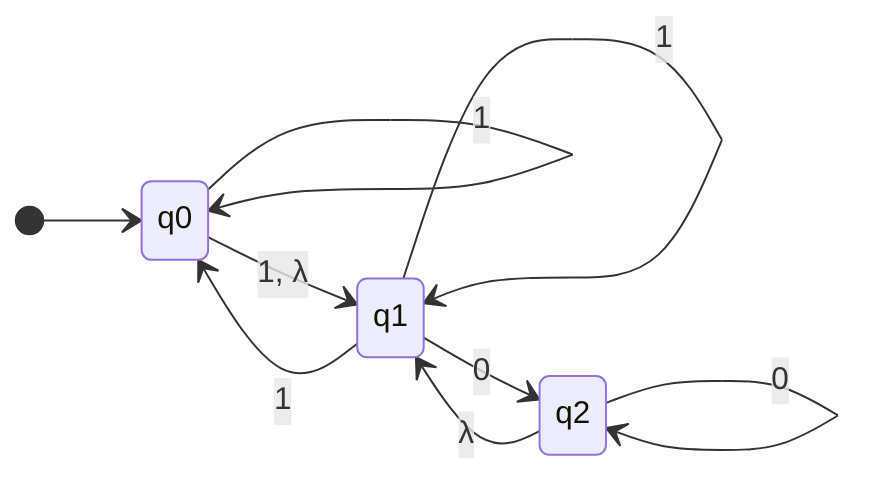

---

### BÀI 4

**Đề bài:** Thiết kế một NFA chấp nhận các chuỗi $\lambda, \ a, \ baba, \ baa$, nhưng **không chấp nhận** các chuỗi $b, \ bb, \ babba$.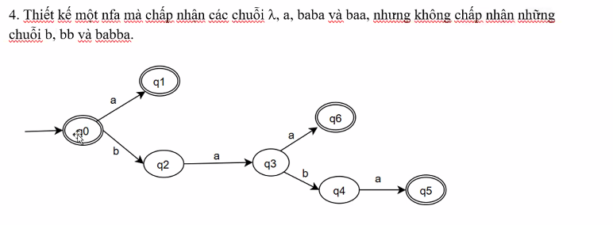

**Phân tích & Thiết kế:**

1. Chấp nhận chuỗi rỗng $\lambda \Rightarrow$ Trạng thái khởi đầu $q_0$ phải là **trạng thái kết thúc** ($q_0 \in F$).
2. Chấp nhận chuỗi $a \Rightarrow$ Từ $q_0 \xrightarrow{a} q_1$ với $q_1 \in F$.
3. Chấp nhận chuỗi $baa$ và $baba$:
   - Từ $q_0 \xrightarrow{b} q_2 \xrightarrow{a} q_3$.
   - Tại $q_3$:
     - Nhánh 1: $q_3 \xrightarrow{a} q_4 \in F$ (nhận chuỗi $baa$).
     - Nhánh 2: $q_3 \xrightarrow{b} q_5 \xrightarrow{a} q_6 \in F$ (nhận chuỗi $baba$).
4. Kiểm tra các chuỗi bị loại:
   - Chuỗi $b \to$ dừng ở $q_2 \notin F \Rightarrow$ Loại.
   - Chuỗi $bb \to$ tại $q_2$ không có cung $b \Rightarrow$ Rơi vào $\emptyset \Rightarrow$ Loại.
   - Chuỗi $babba \to q_0 \xrightarrow{b} q_2 \xrightarrow{a} q_3 \xrightarrow{b} q_5 \xrightarrow{b}$ (tại $q_5$ chỉ có cung $a$, không có cung $b$) $\Rightarrow$ Rơi vào $\emptyset \Rightarrow$ Loại.

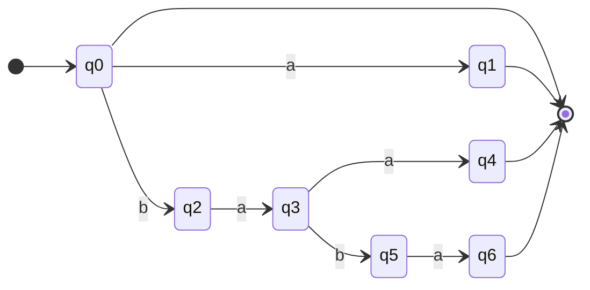

---

### BÀI 5

**Đề bài:** Thiết kế NFA với điều kiện **ít hơn 5 trạng thái** cho tập ngôn ngữ $L$:(ảnh sai xem ảnh ở dưới sơ đồ vẽ)

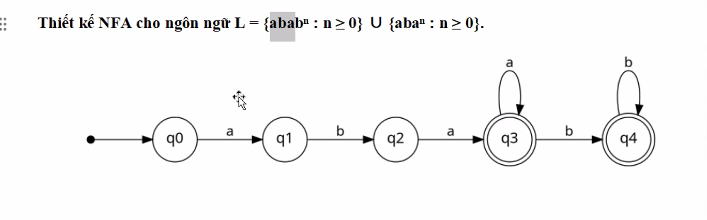

$$
L = \{abab^n \mid n \ge 0\} \cup \{aba^n \mid n \ge 0\}
$$

---

**Phân tích & Thiết kế NFA 4 trạng thái ($< 5$ trạng thái):**

#### 1. Phân tích tập chuỗi của ngôn ngữ $L$:

* **Họ 1 ($aba^n$ với $n \ge 0$):**
  - $n = 0 \Rightarrow$ chuỗi là **$ab$**.
  - $n = 1 \Rightarrow$ chuỗi là **$aba$**.
  - $n = 2 \Rightarrow$ chuỗi là **$abaa$**, $\dots$
  - Tổng quát: bắt đầu bằng $ab$, theo sau là $0$ hoặc nhiều chữ $a$ ($ab a^*$).
* **Họ 2 ($abab^n$ với $n \ge 0$):**
  - $n = 0 \Rightarrow$ chuỗi là **$aba$**.
  - $n = 1 \Rightarrow$ chuỗi là **$abab$**.
  - $n = 2 \Rightarrow$ chuỗi là **$ababb$**, $\dots$
  - Tổng quát: bắt đầu bằng $aba$, theo sau là $0$ hoặc nhiều chữ $b$ ($aba b^*$).

---

#### 2. Kỹ thuật gộp trạng thái để đạt đúng 4 trạng thái $\{q_0, q_1, q_2, q_3\}$:

1. **$q_0 \xrightarrow{a} q_1 \xrightarrow{b} q_2$:**
   - Khi đọc xong tiền tố $ab$, máy dừng tại **$q_2$**.
   - Vì chuỗi $ab \in L$ (ứng với $n = 0$ của họ 1), nên **$q_2$ là trạng thái kết thúc ($q_2 \in F$)**.
2. **Nhánh nhận $aba^n$ tại $q_2$:**
   - Tại $q_2$, ta đặt vòng lặp nhãn $a$ ($q_2 \xrightarrow{a} q_2$).
   - Sau khi đọc $ab$, đọc thêm bao nhiêu chữ $a$ cũng vẫn ở lại $q_2 \in F$.
3. **Nhánh nhận $abab^n$ chuyển sang $q_3$:**
   - Từ $q_2$, ta tạo một cung không đơn định đọc ký tự $a$ dẫn sang $q_3$ ($q_2 \xrightarrow{a} q_3$).
   - Trạng thái **$q_3$ là trạng thái kết thúc ($q_3 \in F$)** (nhận chuỗi $aba$).
   - Tại $q_3$, đặt vòng lặp nhãn $b$ ($q_3 \xrightarrow{b} q_3$) để nhận thêm các chữ $b$ phía sau ($abab, ababb, \dots$).

---

#### 3. Đồ thị chuyển dịch NFA (Đúng 4 trạng thái):

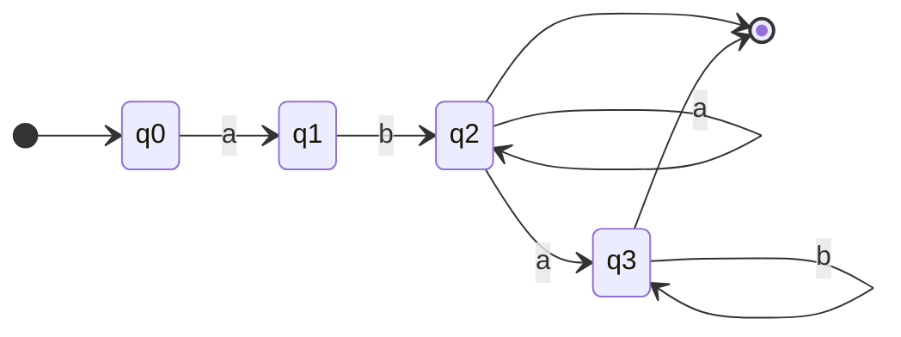

* **Tập trạng thái:** $Q = \{q_0, q_1, q_2, q_3\}$ (gồm đúng **4 trạng thái**, thỏa mãn điều kiện **ít hơn 5 trạng thái**).
* **Tập trạng thái kết thúc:** $F = \{q_2, q_3\}$.

---

#### 4. Bảng kiểm tra các chuỗi mẫu:

|                                                        Chuỗi cần kiểm tra                                                        |    Thuộc họ nào?    | Đường đi trên NFA 4 trạng thái                                                                       |           Trạng thái dừng           |   Kết luận   |
| :---------------------------------------------------------------------------------------------------------------------------------: | :--------------------: | :---------------------------------------------------------------------------------------------------------- | :------------------------------------: | :------------: |
|                                                          **$ab$**                                                          |       $aba^0$       | $q_0 \xrightarrow{a} q_1 \xrightarrow{b} q_2$                                                             |             $q_2 \in F$             | ✅ Chấp nhận |
|                                                          **$aba$**                                                          | $aba^1$ / $abab^0$ | $q_0 \xrightarrow{a} q_1 \xrightarrow{b} q_2 \xrightarrow{a} q_2$ hoặc $q_3$                           | $\{q_2, q_3\} \cap F \neq \emptyset$ | ✅ Chấp nhận |
|                                                         **$abaa$**                                                         |       $aba^2$       | $q_0 \xrightarrow{a} q_1 \xrightarrow{b} q_2 \xrightarrow{a} q_2 \xrightarrow{a} q_2$                     |             $q_2 \in F$             | ✅ Chấp nhận |
|                                                         **$abab$**                                                         |       $abab^1$       | $q_0 \xrightarrow{a} q_1 \xrightarrow{b} q_2 \xrightarrow{a} q_3 \xrightarrow{b} q_3$                     |             $q_3 \in F$             | ✅ Chấp nhận |
|                                                         **$ababb$**                                                         |       $abab^2$       | $q_0 \xrightarrow{a} q_1 \xrightarrow{b} q_2 \xrightarrow{a} q_3 \xrightarrow{b} q_3 \xrightarrow{b} q_3$ |             $q_3 \in F$             | ✅ Chấp nhận |
| **$ababa$**  |   Không thuộc$L$   | Sau khi đọc$abab$ ở $q_3$, đọc tiếp $a$ bị tắc đường $\emptyset$ |     $\emptyset$     | ❌ Bị loại (Đúng)                                                                                       |                                        |                |

---

### BÀI 6

**Đề bài:** Thiết kế một NFA có đúng 3 trạng thái chấp nhận ngôn ngữ $L = \{ab, abc\}^*$.

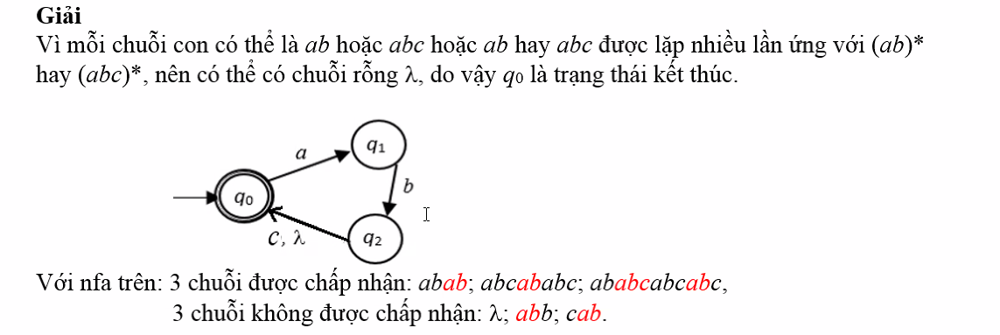

---

**Lời giải chuẩn theo Giáo trình / Slide của Thầy:**

#### 1. Phân tích tư duy thiết kế:

* Ngôn ngữ $L = \{ab, abc\}^*$ là tập hợp các chuỗi được tạo bởi việc lặp lại tùy ý các khối **$ab$** hoặc **$abc$** nhiều lần:
  $$
  (ab)^*, \quad (abc)^*, \quad (ab \mid abc)^*
  $$
* Do ngôn ngữ có dấu sao Kleene ($*$) nên có chứa chuỗi rỗng $\lambda$, vì vậy trạng thái khởi đầu **$q_0$ là trạng thái kết thúc** ($q_0 \in F$).
* Để tiết kiệm trạng thái (dùng đúng 3 trạng thái $\{q_0, q_1, q_2\}$):
  1. Đọc $a$: từ $q_0 \xrightarrow{a} q_1$.
  2. Đọc $b$: từ $q_1 \xrightarrow{b} q_2$ (đã hoàn thành xong 2 ký tự đầu $ab$).
  3. Từ $q_2$ hồi quy về đích $q_0$:
     - **Nếu là khối $ab$:** Sử dụng chuyển dịch rỗng $\lambda$ ($q_2 \xrightarrow{\lambda} q_0$) để máy **tự động nhảy về $q_0$** mà không tốn ký tự nào.
     - **Nếu là khối $abc$:** Sử dụng chuyển dịch đọc ký tự $c$ ($q_2 \xrightarrow{c} q_0$) để quay về $q_0$.
* 👉 Kết hợp lại: Tại $q_2$ có cung chuyển dịch nhãn **$c, \lambda$** quay về $q_0$ ($q_2 \xrightarrow{c, \lambda} q_0$).

---

#### 2. Đồ thị chuyển dịch NFA (Sơ đồ tam giác 3 trạng thái):

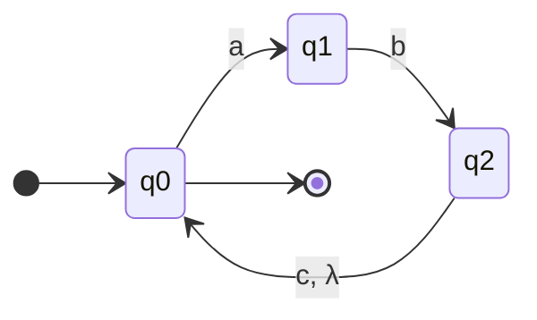

* **Tập trạng thái:** $Q = \{q_0, q_1, q_2\}$ (Đúng 3 trạng thái).
* **Trạng thái bắt đầu:** $q_0$.
* **Tập trạng thái kết thúc:** $F = \{q_0\}$ (Chỉ duy nhất $q_0$ vẽ 2 vòng tròn).

---

#### 3. Kiểm tra chi tiết các chuỗi theo Slide của Thầy:

##### a) 3 chuỗi ĐƯỢC CHẤP NHẬN:

1. **Chuỗi $abab$:**
   $$
   q_0 \xrightarrow{a} q_1 \xrightarrow{b} q_2 \xrightarrow{\lambda} q_0 \xrightarrow{a} q_1 \xrightarrow{b} q_2 \xrightarrow{\lambda} q_0 \in F \quad \Rightarrow \text{✅ Chấp nhận}
   $$
2. **Chuỗi $abcababc$:**
   $$
   q_0 \xrightarrow{abc} q_0 \xrightarrow{ab} q_0 \xrightarrow{abc} q_0 \in F \quad \Rightarrow \text{✅ Chấp nhận}
   $$
3. **Chuỗi $ababcabcabc$:**
   $$
   q_0 \xrightarrow{ab} q_0 \xrightarrow{abc} q_0 \xrightarrow{abc} q_0 \xrightarrow{abc} q_0 \in F \quad \Rightarrow \text{✅ Chấp nhận}
   $$

---

##### b) 3 chuỗi KHÔNG ĐƯỢC CHẤP NHẬN (Bị loại):

1. **Chuỗi $abb$:**
   - $q_0 \xrightarrow{a} q_1 \xrightarrow{b} q_2$.
   - Tại $q_2$, chỉ có cung $c$ và $\lambda$, **không có cung $b$** $\Rightarrow$ Máy rơi vào $\emptyset$ (ngõ cụt) $\Rightarrow$ **❌ Bị loại**.
2. **Chuỗi $cab$:**
   - Tại trạng thái $q_0$, chỉ có cung $a$, **không có cung $c$** $\Rightarrow$ Máy rơi vào $\emptyset$ $\Rightarrow$ **❌ Bị loại**.
3. **Chuỗi $\lambda$:**
   - Nếu đề bài ngầm định xét chuỗi có độ dài $\ge 1$.

---

#### 4. 💡 So sánh với Cách 2 (Sơ đồ DFA viết tay trong vở của bạn):

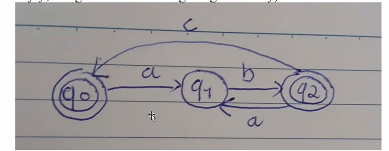

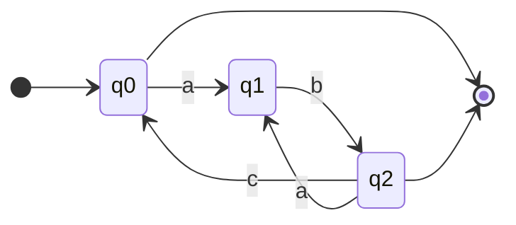

* **Điểm khác biệt:** Sơ đồ viết tay không dùng cung $\lambda$ mà dùng 2 trạng thái kết thúc $F = \{q_0, q_2\}$ và cung $q_2 \xrightarrow{a} q_1$.
* **Đánh giá:** Cả 2 sơ đồ đều **chính xác 100%**, nhưng:
  - **Sơ đồ của Thầy (Tam giác $c, \lambda$):** Tận dụng sức mạnh của chuyển dịch $\lambda$ trong NFA, chỉ cần 1 trạng thái kết thúc $q_0$.
  - **Sơ đồ viết tay của Bạn:** Là một DFA hoàn chỉnh không cần $\lambda$. Khi đi thi bạn vẽ theo **Sơ đồ của Thầy (Cách 1)** là chuẩn điểm tuyệt đối theo đáp án slide!

---

### BÀI 7

**Đề bài:** Thiết kế NFA chấp nhận tập các chuỗi nhị phân trên $\Sigma = \{0, 1\}$:
*"Kết thúc bằng $010$ và có chuỗi $011$ ở bất kỳ trước đó, HOẶC kết thúc bằng $101$ và có chuỗi $100$ ở bất kỳ trước đó."*

---

#### 🌟 CÁCH 1: SƠ ĐỒ DÙNG CHUYỂN DỊCH $\lambda$ (15 TRẠNG THÁI)

* **Tư duy:** Tách làm 2 máy độc lập, từ $q_0$ dùng chuyển dịch rỗng $\lambda$ để phân nhánh:
  - **Nhánh trên (Nhánh 1):**
    - Đợi chuỗi $011$: $q_1 \xrightarrow{0} q_2 \xrightarrow{1} q_3 \xrightarrow{1} q_4$ (tại $q_1$ có vòng lặp $0, 1$).
    - Đợi đuôi $010$: $q_4 \xrightarrow{0} q_5 \xrightarrow{1} q_6 \xrightarrow{0} q_7 \in F$ (tại $q_4$ có vòng lặp $0, 1$).
  - **Nhánh dưới (Nhánh 2):**
    - Đợi chuỗi $100$: $q_8 \xrightarrow{1} q_9 \xrightarrow{0} q_{10} \xrightarrow{0} q_{11}$ (tại $q_8$ có vòng lặp $0, 1$).
    - Đợi đuôi $101$: $q_{11} \xrightarrow{1} q_{12} \xrightarrow{0} q_{13} \xrightarrow{1} q_{14} \in F$ (tại $q_{11}$ có vòng lặp $0, 1$).

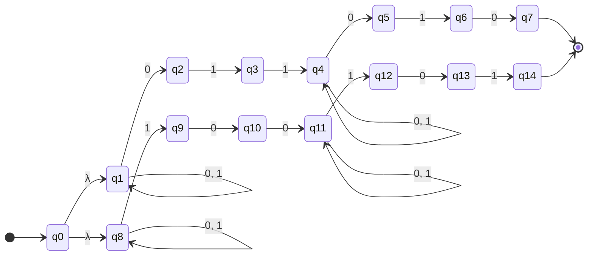

---

#### 🌟 CÁCH 2: SƠ ĐỒ VIẾT TAY TỐI ƯU KHÔNG DÙNG $\lambda$ (13 TRẠNG THÁI)

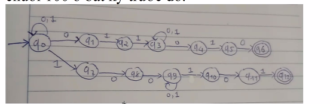

* **Tư duy tối ưu:**
  - Đặt vòng lặp $\{0, 1\}$ ngay tại trạng thái bắt đầu $q_0$ để đọc phần đầu chuỗi.
  - Khi bắt đầu xuất hiện chuỗi con $011$, NFA đoán và rẽ nhánh trên:
    $$q_0 \xrightarrow{0} q_1 \xrightarrow{1} q_2 \xrightarrow{1} q_3$$
    - Tại $q_3$: đặt vòng lặp $\{0, 1\}$ để đọc đoạn giữa.
    - Đón nhận đuôi $010$: $q_3 \xrightarrow{0} q_4 \xrightarrow{1} q_5 \xrightarrow{0} q_6 \in F$.
  - Khi bắt đầu xuất hiện chuỗi con $100$, NFA đoán và rẽ nhánh dưới:
    $$q_0 \xrightarrow{1} q_7 \xrightarrow{0} q_8 \xrightarrow{0} q_9$$
    - Tại $q_9$: đặt vòng lặp $\{0, 1\}$ để đọc đoạn giữa.
    - Đón nhận đuôi $101$: $q_9 \xrightarrow{1} q_{10} \xrightarrow{0} q_{11} \xrightarrow{1} q_{12} \in F$.

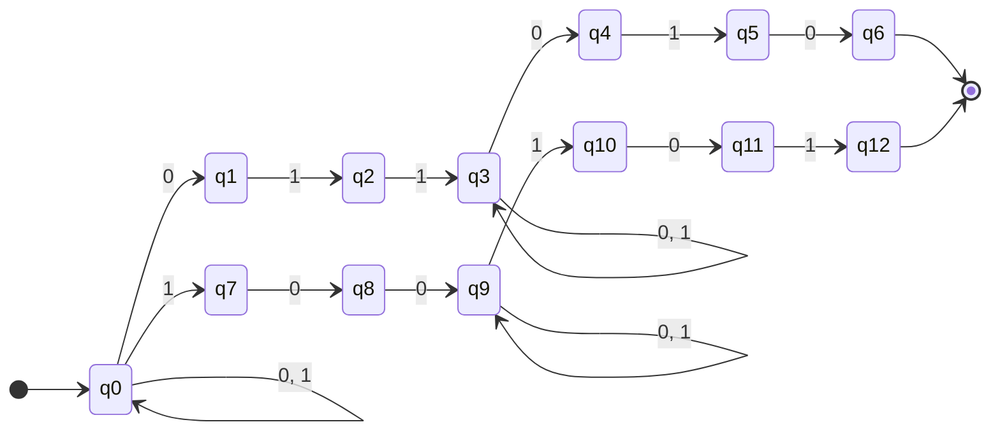

* **Ưu điểm của Cách 2:**
  - Tiết kiệm được 2 trạng thái (chỉ dùng **13 trạng thái $\{q_0, \dots, q_{12}\}$** so với 15 trạng thái của Cách 1).
  - Không cần dùng chuyển dịch rỗng $\lambda$, sơ đồ rất gọn gàng và tự nhiên khi vẽ tay trong bài thi tự luận!

---

## PHẦN 2: BÀI TẬP TỪ TÀI LIỆU THIẾT KẾ NFA

### BÀI 1

**Đề bài:** Thiết kế NFA chấp nhận ngôn ngữ $L_1$ trên $\Sigma = \{0, 1\}$ sao cho các chuỗi có ký tự thứ 3 tính từ cuối lên là số 1.

**Lời giải:**

- **Dạng chuỗi:** $*** 1 **$ (sau ký tự 1 có đúng 2 ký tự bất kỳ $\in \{0, 1\}$ rồi kết thúc).
- **Thiết kế:**
  - $q_0$: Trạng thái bắt đầu với vòng lặp $\{0, 1\}$ để đọc phần đầu chuỗi.
  - $q_0 \xrightarrow{1} q_1$: Đoán bắt đầu vào vị trí thứ 3 từ cuối lên.
  - $q_1 \xrightarrow{0, 1} q_2$: Đọc ký tự thứ 2 từ cuối lên.
  - $q_2 \xrightarrow{0, 1} q_3$: Đọc ký tự cuối cùng $\to q_3 \in F$.

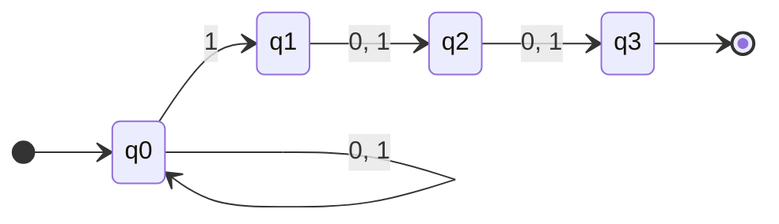

---

### BÀI 2

**Đề bài:** Thiết kế NFA chấp nhận ngôn ngữ $L_2$ trên $\Sigma = \{a, b\}$ chứa chuỗi con $aba$ HOẶC $bab$.

**Lời giải:**

- **Dạng chuỗi:** $*** aba ***$ hoặc $*** bab ***$.
- **Thiết kế:**
  - $q_0$: Trạng thái bắt đầu với vòng lặp $\{a, b\}$.
  - Nhánh 1 (nhận $aba$): $q_0 \xrightarrow{a} q_1 \xrightarrow{b} q_2 \xrightarrow{a} q_5 \in F$.
  - Nhánh 2 (nhận $bab$): $q_0 \xrightarrow{b} q_3 \xrightarrow{a} q_4 \xrightarrow{b} q_5 \in F$.
  - Tại $q_5$: Vòng lặp $\{a, b\}$ để đọc phần đuôi tùy ý.

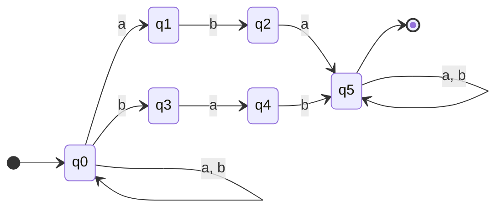

---

### BÀI 3

**Đề bài:** Thiết kế NFA chấp nhận các chuỗi nhị phân đại diện cho số nguyên chia hết cho 3 HOẶC chia hết cho 5.

**Lời giải:**

#### 1. Nguyên lý số học chuyển trạng thái số nhị phân:

Khi đọc thêm một bit $b \in \{0, 1\}$ vào sau một số có giá trị hiện tại là $v$, giá trị mới là:

$$
v_{\text{mới}} = 2v + b \pmod k
$$

#### 2. Máy con A (Số chia hết cho 3 - các số dư 0, 1, 2):

- Các trạng thái: $q_1$ (dư 0 - kết thúc), $q_3$ (dư 1), $q_4$ (dư 2).
- Chuyển dịch:
  - Tại $q_1$: đọc $0 \to q_1$ (vòng lặp), đọc $1 \to q_3$.
  - Tại $q_3$: đọc $0 \to q_4$, đọc $1 \to q_1$.
  - Tại $q_4$: đọc $0 \to q_3$, đọc $1 \to q_4$ (vòng lặp).

#### 3. Máy con B (Số chia hết cho 5 - các số dư 0, 1, 2, 3, 4):

- Các trạng thái: $q_2$ (dư 0 - kết thúc), $q_5$ (dư 1), $q_6$ (dư 2), $q_7$ (dư 3), $q_8$ (dư 4).
- Chuyển dịch:
  - $q_2$: đọc $0 \to q_2$, đọc $1 \to q_5$.
  - $q_5$: đọc $0 \to q_6$, đọc $1 \to q_7$.
  - $q_6$: đọc $0 \to q_8$, đọc $1 \to q_2$.
  - $q_7$: đọc $0 \to q_5$, đọc $1 \to q_6$.
  - $q_8$: đọc $0 \to q_7$, đọc $1 \to q_8$.

#### 4. Kết hợp NFA bằng chuyển dịch $\lambda$:

Tạo trạng thái bắt đầu $q_0$, nối $\lambda$ sang $q_1$ (Máy A) và $\lambda$ sang $q_2$ (Máy B).

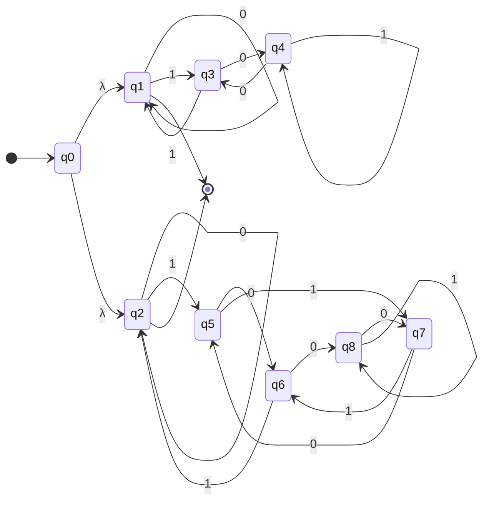
