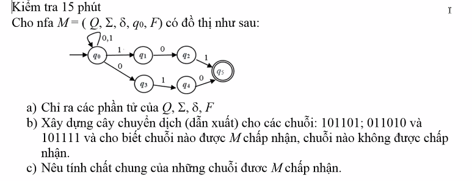
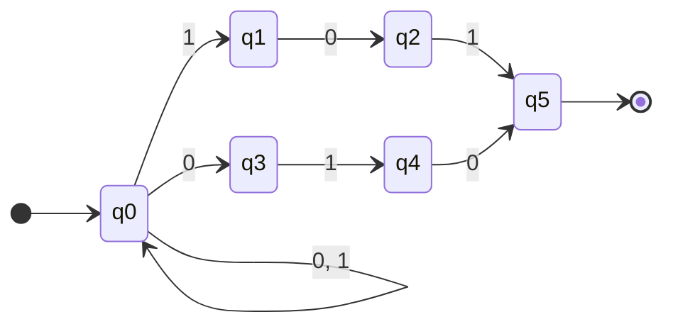

# BÀI LÀM: KIỂM TRA 15 PHÚT - MÔN LÝ THUYẾT ÔTÔMÁT

---

## ĐỀ BÀI

Cho NFA $M = (Q, \Sigma, \delta, q_0, F)$ có đồ thị chuyển dịch như hình dưới đây:



**Yêu cầu:**

* **a)** Chỉ ra các phần tử của $Q, \Sigma, \delta, F$.
* **b)** Xây dựng cây chuyển dịch (dẫn xuất) cho các chuỗi: $101101$; $011010$ và $101111$ và cho biết chuỗi nào được $M$ chấp nhận, chuỗi nào không được chấp nhận.
* **c)** Nêu tính chất chung của những chuỗi được $M$ chấp nhận.

---

## BÀI GIẢI CHI TIẾT

### a) Chỉ ra các phần tử của $Q, \Sigma, \delta, F$

Dựa vào đồ thị chuyển dịch của NFA $M$, ta có các thành phần trong bộ 5 hình thức:

1. **Tập trạng thái ($Q$):**

   $$
   Q = \{q_0, q_1, q_2, q_3, q_4, q_5\}
   $$

   *(Gồm 6 trạng thái)*
2. **Bảng chữ cái vào ($\Sigma$):**

   $$
   \Sigma = \{0, 1\}
   $$
3. **Trạng thái khởi đầu:**

   $$
   q_0 \in Q
   $$

   *(Được biểu diễn bằng mũi tên từ ngoài chỉ vào $q_0$)*
4. **Tập trạng thái kết thúc ($F$):**

   $$
   F = \{q_5\}
   $$

   *(Trạng thái duy nhất được vẽ bằng 2 vòng tròn đồng tâm)*
5. **Hàm chuyển dịch ($\delta: Q \times \Sigma \to 2^Q$):**

   * **Biểu diễn theo từng trạng thái:**

     - Tại $q_0$: $\delta(q_0, 0) = \{q_0, q_3\}; \quad \delta(q_0, 1) = \{q_0, q_1\}$
     - Tại $q_1$: $\delta(q_1, 0) = \{q_2\}; \quad \delta(q_1, 1) = \emptyset$
     - Tại $q_2$: $\delta(q_2, 0) = \emptyset; \quad \delta(q_2, 1) = \{q_5\}$
     - Tại $q_3$: $\delta(q_3, 0) = \emptyset; \quad \delta(q_3, 1) = \{q_4\}$
     - Tại $q_4$: $\delta(q_4, 0) = \{q_5\}; \quad \delta(q_4, 1) = \emptyset$
     - Tại $q_5$: $\delta(q_5, 0) = \emptyset; \quad \delta(q_5, 1) = \emptyset$
   * **Bảng chuyển dịch $\delta$:**

     |     Trạng thái     | Đọc**0** | Đọc**1** |
     | :-------------------: | :--------------: | :--------------: |
     | **$\to q_0$** | $\{q_0, q_3\}$ | $\{q_0, q_1\}$ |
     |   **$q_1$**   |   $\{q_2\}$   |  $\emptyset$  |
     |   **$q_2$**   |  $\emptyset$  |   $\{q_5\}$   |
     |   **$q_3$**   |  $\emptyset$  |   $\{q_4\}$   |
     |   **$q_4$**   |   $\{q_5\}$   |  $\emptyset$  |
     |  **$* q_5$**  |  $\emptyset$  |  $\emptyset$  |

---

### b) Xây dựng cây chuyển dịch và kiểm tra tính chấp nhận của 3 chuỗi

---

#### 1. Chuỗi $w_1 = 101101$:

* **Cây tiến trình chuyển dịch song song:**

```
                                                                                             ┌── (q0, 01) ──→ (q0, 1) ──┬──→ q0
                                                                ┌── (q0, 101) ──→ (q0, 01) ──┤                          └──→ q1
                                                                │                            └── (q1, 01) ──→ (q2, 1) ──→ q5  [CHẤP NHẬN!]
                                   ┌── (q0, 1101) ──→ (q0, 101) ┤
                                   │                            └── (q1, 101) ──→ ∅ (tắc đường)
      ┌── (q0, 01101) ──→ (q0, 1101) ┤
      │                            └── (q3, 1101) ──→ (q4, 101) ──→ ∅ (tắc đường)
(q0, 101101) ──┤
      │
      └── (q1, 01101) ──→ (q2, 1101) ──→ (q5, 101) ──→ ∅ (q5 không có đường đi tiếp)
```

* **Phân tích đường đi thành công:**
  - Nhánh thuận lợi: $(q_0, 101101) \xrightarrow{1} (q_0, 01101) \xrightarrow{0} (q_0, 1101) \xrightarrow{1} (q_0, 101) \xrightarrow{1} (q_1, 01) \xrightarrow{0} (q_2, 1) \xrightarrow{1} \mathbf{q_5}$.
  - Máy đọc xong toàn bộ chuỗi $w_1$ và dừng tại trạng thái kết thúc $q_5 \in F$.
* **Tập trạng thái cuối cùng:** $\delta^*(q_0, 101101) = \{q_0, q_1, q_5\}$.
* **Kết luận:** Vì $\delta^*(q_0, 101101) \cap F = \{q_5\} \neq \emptyset \Rightarrow$ **Chuỗi $101101$ ĐƯỢC CHẤP NHẬN.**

---

#### 2. Chuỗi $w_2 = 011010$:

* **Cây tiến trình chuyển dịch song song:**

```
                                                                                             ┌── (q0, 10) ──→ (q0, 0) ──┬──→ q0
                                                                ┌── (q0, 010) ──→ (q0, 10) ──┤                          └──→ q3
                                                                │                            └── (q1, 10) ──→ ∅
                                   ┌── (q0, 1010) ──→ (q0, 010) ┤
                                   │                            └── (q3, 010) ──→ (q4, 10) ──→ (q5, 0) ──→ ∅
      ┌── (q0, 11010) ──→ (q0, 1010) ┤
      │                            └── (q1, 1010) ──→ ∅
(q0, 011010) ──┤
      │                            ┌── (q0, 10) ──→ (q0, 0) ──→ ...
      └── (q3, 11010) ──→ (q4, 1010) ──→ (q5, 010) ──→ ∅ (q5 không có đường đi tiếp)
```

* **Phân tích đường đi thành công qua nhánh dưới (mẫu $010$):**
  - Nhánh thuận lợi: $(q_0, 011010) \xrightarrow{0} (q_0, 11010) \xrightarrow{1} (q_0, 1010) \xrightarrow{1} (q_0, 010) \xrightarrow{0} (q_3, 10) \xrightarrow{1} (q_4, 0) \xrightarrow{0} \mathbf{q_5}$.
  - Máy đọc xong toàn bộ chuỗi $w_2$ và dừng tại trạng thái kết thúc $q_5 \in F$.
* **Tập trạng thái cuối cùng:** $\delta^*(q_0, 011010) = \{q_0, q_3, q_5\}$.
* **Kết luận:** Vì $\delta^*(q_0, 011010) \cap F = \{q_5\} \neq \emptyset \Rightarrow$ **Chuỗi $011010$ ĐƯỢC CHẤP NHẬN.**

---

#### 3. Chuỗi $w_3 = 101111$:

* **Cây tiến trình chuyển dịch song song:**

```
                                                                                             ┌── (q0, 11) ──→ (q0, 1) ──┬──→ q0
                                                                ┌── (q0, 111) ──→ (q0, 11) ──┤                          └──→ q1
                                                                │                            └── (q1, 11) ──→ ∅ (q1 không có cung 1)
                                   ┌── (q0, 1111) ──→ (q0, 111) ┤
                                   │                            └── (q1, 111) ──→ ∅
      ┌── (q0, 01111) ──→ (q0, 1111) ┤
      │                            └── (q3, 1111) ──→ (q4, 111) ──→ ∅ (q4 không có cung 1)
(q0, 101111) ──┤
      │
      └── (q1, 01111) ──→ (q2, 1111) ──→ (q5, 111) ──→ ∅ (q5 không có đường đi tiếp)
```

* **Phân tích:**
  - Chuỗi $w_3$ có đuôi là `111`.
  - Nhánh trên chỉ đón nhận đuôi `101`, nhánh dưới chỉ đón nhận đuôi `010`.
  - Khi cố gắng rẽ vào $q_1$ ở 3 ký tự cuối `111`: $q_0 \xrightarrow{1} q_1 \xrightarrow{1} \emptyset$ (bị chết do $q_1$ chỉ có cung $0$).
  - Nhánh đi ở $q_0$ thì dừng lại tại $q_0 \notin F$.
* **Tập trạng thái cuối cùng:** $\delta^*(q_0, 101111) = \{q_0, q_1\}$.
* **Kết luận:** Vì $\delta^*(q_0, 101111) \cap F = \{q_0, q_1\} \cap \{q_5\} = \emptyset \Rightarrow$ **Chuỗi $101111$ KHÔNG ĐƯỢC CHẤP NHẬN.**

---

#### 📌 BẢNG TỔNG HỢP KẾT QUẢ CÂU B:

|     Chuỗi$w$     | Tập trạng thái cuối cùng$\delta^*(q_0, w)$ |    Có chứa$q_5 \in F$?    |              Kết luận              |
| :------------------: | :-----------------------------------------------: | :---------------------------: | :----------------------------------: |
| **$101101$** |     $\{q_0, q_1, q_5\}$ | ✅ Có ($q_5$)     | **ĐƯỢC CHẤP NHẬN** |                                      |
| **$011010$** |     $\{q_0, q_3, q_5\}$ | ✅ Có ($q_5$)     | **ĐƯỢC CHẤP NHẬN** |                                      |
| **$101111$** |                 $\{q_0, q_1\}$                 |           ❌ Không           | **KHÔNG ĐƯỢC CHẤP NHẬN** |

---

### c) Nêu tính chất chung của những chuỗi được $M$ chấp nhận

#### 1. Phân tích cấu trúc hoạt động của NFA $M$:

* **Phần đầu chuỗi:** Tại trạng thái khởi đầu $q_0$ có vòng lặp nhãn $\{0, 1\}$, cho phép máy đọc một chuỗi tiền tố bất kỳ $u \in \{0, 1\}^*$ với độ dài tùy ý $\ge 0$.
* **Phần cuối chuỗi (So khớp mẫu đuôi):** Từ $q_0$, NFA thực hiện "đoán" điểm bắt đầu của 3 ký tự cuối cùng để rẽ vào 1 trong 2 luồng:
  - **Luồng 1 (Nhánh trên):** $q_0 \xrightarrow{1} q_1 \xrightarrow{0} q_2 \xrightarrow{1} q_5$ $\Rightarrow$ Nhận diện đuôi kết thúc là chuỗi con **$101$**.
  - **Luồng 2 (Nhánh dưới):** $q_0 \xrightarrow{0} q_3 \xrightarrow{1} q_4 \xrightarrow{0} q_5$ $\Rightarrow$ Nhận diện đuôi kết thúc là chuỗi con **$010$**.
* **Điều kiện dừng:** Tại trạng thái chấp nhận $q_5$ **không có bất kỳ cung đi tiếp nào** ($\delta(q_5, 0) = \emptyset, \delta(q_5, 1) = \emptyset$). Do đó, chuỗi phải kết thúc ngay sau khi hoàn tất chuỗi $101$ hoặc $010$.

#### 2. Kết luận tính chất chung:

* **Bằng lời:**

  > **Tất cả các chuỗi được $M$ chấp nhận là các chuỗi nhị phân trên bảng chữ cái $\Sigma = \{0, 1\}$ có độ dài ít nhất là 3 và có KẾT THÚC (chuỗi đuôi) là chuỗi $101$ HOẶC kết thúc là chuỗi $010$.**
  >
* **Dưới dạng biểu thức chính quy (Regular Expression):**

  $$
  L(M) = (0 + 1)^* 101 + (0 + 1)^* 010
  $$
* **Dưới dạng tập hợp ngôn ngữ hình thức:**

  $$
  L(M) = \left\{ w \in \{0, 1\}^* \mid w = u \cdot 101 \text{ hoặc } w = u \cdot 010, \text{ với } u \in \{0, 1\}^* \right\}
  $$
