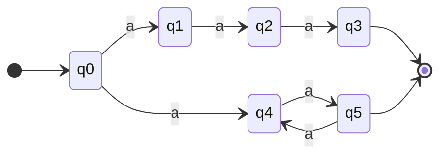
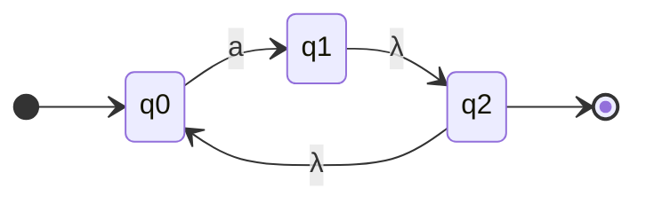
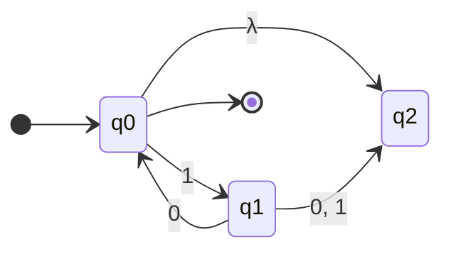
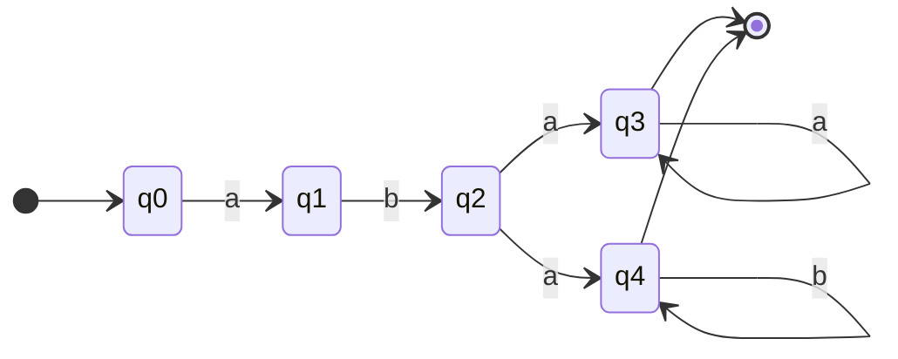
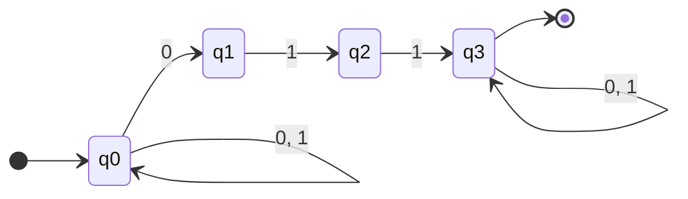
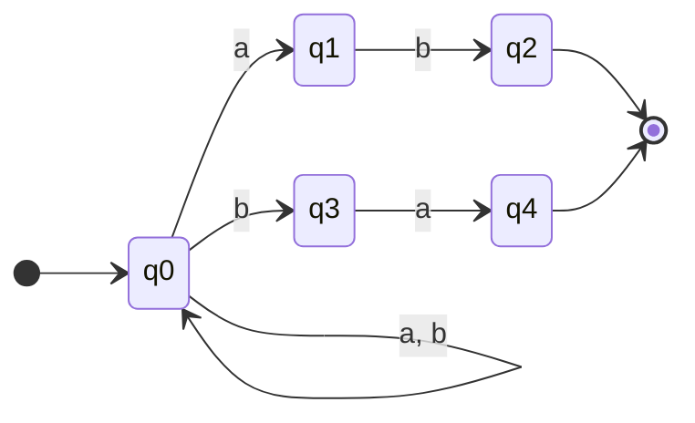
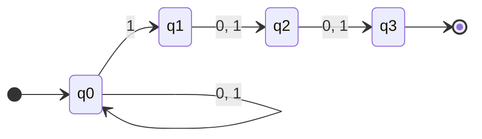
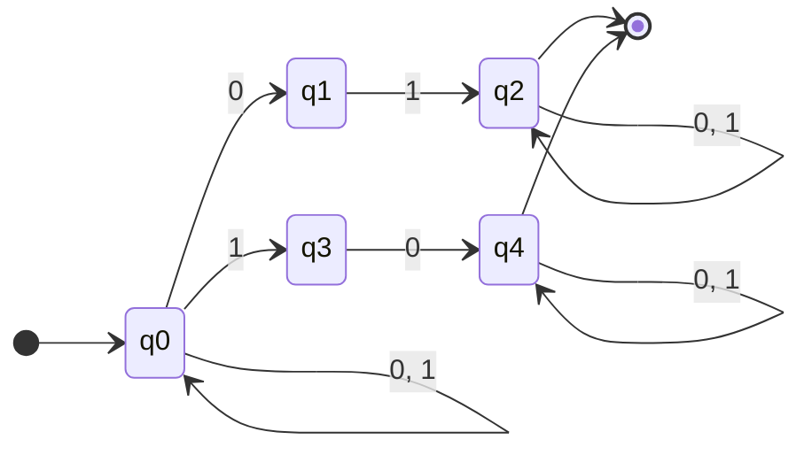
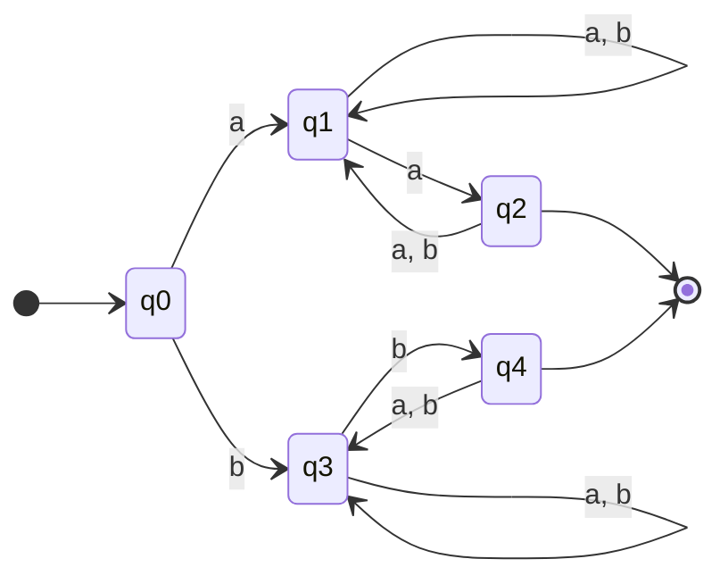
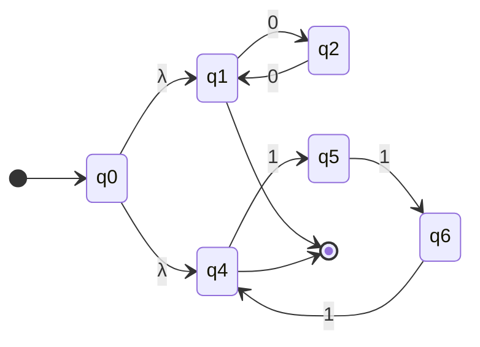

# LÝ THUYẾT TOÀN DIỆN MÁY TỰ ĐỘNG HỮU HẠN KHÔNG ĐƠN ĐỊNH (NFA)
## TỔNG HỢP & GIẢI THÍCH CHI TIẾT TỪNG VÍ DỤ TỪ GIÁO TRÌNH VÀ BÀI GIẢNG IUH

---

## 📌 MỤC LỤC BÀI HỌC
1. [Mở Đầu: Trò Chơi Tìm Kho Báu & Bản Chất Của NFA](#1-mở-đầu-trò-chơi-tìm-kho-báu--bản-chất-của-nfa)
2. [Tập Lũy Thừa $2^Q$ (Power Set) Là Gì? (Kèm Ví Dụ $A=\{1, 2, 3\}$ Trong Slide)](#2-tập-lũy-thừa-2q-power-set-là-gì-kèm-ví-dụ-a1-2-3-trong-slide)
3. [Định Nghĩa Toán Học Bộ 5 & Ví Dụ Mẫu Máy $N_1$ (Hình 2.14)](#3-định-nghĩa-toán-học-bộ-5--ví-dụ-mẫu-máy-n_1-hình-214)
4. [Hoạt Động Của NFA: Cây Tiến Trình Song Song (Hình 2.15 với chuỗi $w = 010110$)](#4-hoạt-động-của-nfa-cây-tiến-trình-song-song-hình-215-với-chuỗi-w--010110)
5. [Ví Dụ 2.1 (Hình 2.16): NFA Rẽ Nhánh $aaa$ và $a^{2k}$ & Hàm $\delta^*$ Mở Rộng](#5-ví-dụ-21-hình-216-nfa-rẽ-nhánh-aaa-và-a2k--hàm-delta-mở-rộng)
6. [Ví Dụ 2.2a (Hình 2.17a): Chuyển Dịch $\lambda$ & Tính $\delta^*(q_2, \lambda)$, $\delta^*(q_2, aa)$](#6-ví-dụ-22a-hình-217a-chuyển-dịch-lambda--tính-deltaq_2-lambda-deltaq_2-aa)
7. [Ví Dụ 2.2b (Hình 2.17b): Tìm Ngôn Ngữ $L = \{(10)^n \mid n \ge 0\}$ & Cấu Hình Chết](#7-ví-dụ-22b-hình-217b-tìm-ngôn-ngữ-l---10n-mid-n-ge-0--cấu-hình-chết)
8. [Ví Dụ 2.3: Tính $\delta^*(q_0, 1011)$ và $\delta^*(q_1, 01)$](#8-ví-dụ-23-tính-deltaq_0-1011-và-deltaq_1-01)
9. [Ví Dụ 2.4: Thiết Kế NFA 5 Trạng Thái Cho $L = \{aba b^n\} \cup \{aba a^n\}$](#9-ví-dụ-24-thiết-kế-nfa-5-trạng-thái-cho-l---aba-bn-cup-aba-an)
10. [6 Ví Dụ Mẫu Thiết Kế NFA Kinh Điển Trong Slide Thiết Kế](#10-6-ví-dụ-mẫu-thiết-kế-nfa-kinh-điển-trong-slide-thiết-kế)
11. [Bảng So Sánh NFA vs DFA & Bảng Tra Cứu Ký Hiệu Đọc Tiếng Việt](#11-bảng-so-sánh-nfa-vs-dfa--bảng-tra-cứu-ký-hiệu-đọc-tiếng-việt)

---

## 1. MỞ ĐẦU: TRÒ CHƠI TÌM KHO BÁU & BẢN CHẤT CỦA NFA

### 1.1 Ý nghĩa đời thường
Hãy tưởng tượng bạn đang chơi một **trò chơi nhập vai đi tìm kho báu**:
- Ở mỗi ngã rẽ, trước mặt bạn có nhiều lối đi. Bạn không biết lối đi nào sẽ dẫn đến đích (kho báu), lối đi nào dẫn đến ngõ cụt.
- **Nếu là máy đơn định (DFA):** Bạn bắt buộc phải biết trước 100% chỉ có đúng 1 con đường độc đạo duy nhất.
- **Nếu là máy không đơn định (NFA):** Bạn có phép thuật **tự nhân bản thành nhiều phân thân** để đi vào tất cả các con đường khả dĩ cùng một lúc:
  - Phân thân nào đi vào ngõ cụt (không có đường đi tiếp) $\to$ Tự biến mất (chết).
  - **Chỉ cần có ÍT NHẤT 1 phân thân chạm tay vào kho báu (Trạng thái kết thúc), toàn bộ chuỗi được tính là CHIẾN THẮNG (Được máy chấp nhận)!**

---

## 2. TẬP LŨY THỪA $2^Q$ (POWER SET) LÀ GÌ? (KÈM VÍ DỤ $A=\{1, 2, 3\}$ TRONG SLIDE)

### 2.1 Nhắc lại công thức toán học
- Nếu một tập hợp có $n$ phần tử, thì số lượng tập con của nó sẽ là: **$2^n$**.
- Ký hiệu $2^Q$ (hoặc $\mathcal{P}(Q)$) là **tập hợp chứa tất cả các tập con** có thể có của tập trạng thái $Q$.

---

### 2.2 Ví dụ minh họa trong slide (Trang 1)
Giả sử có tập hợp $A = \{1, 2, 3\}$ gồm 3 phần tử ($n = 3$), số tập con là $2^3 = 8$ tập con:
1. **Tập rỗng:** $\emptyset = \{ \}$ (luôn là tập con của mọi tập hợp).
2. **Tập có 1 phần tử:** $\{1\}, \ \{2\}, \ \{3\}$.
3. **Tập có 2 phần tử:** $\{1, 2\}, \ \{1, 3\}, \ \{2, 3\}$.
4. **Tập có 3 phần tử (chính nó):** $\{1, 2, 3\}$.

$$\Rightarrow 2^A = \big\{ \emptyset, \ \{1\}, \ \{2\}, \ \{3\}, \ \{1, 2\}, \ \{1, 3\}, \ \{2, 3\}, \ \{1, 2, 3\} \big\} \quad \text{(đúng 8 phần tử)}$$

---

### 2.3 Vì sao NFA phải dùng $2^Q$?
Trong NFA, từ một trạng thái $q$ khi đọc một ký tự, máy có thể:
- Không đi đâu cả (ngõ cụt) $\to$ Trả về **$\emptyset$**.
- Đi đến đúng 1 trạng thái $\to$ Trả về **$\{q_1\}$**.
- Đi đến nhiều trạng thái cùng lúc $\to$ Trả về **$\{q_0, q_1\}$**.

Tất cả các kết quả này đều là **tập con của $Q$**, thuộc vào $2^Q$. Do đó, kết quả của hàm chuyển dịch $\delta(q, a)$ luôn luôn được viết trong dấu ngoặc nhọn $\{\dots\}$.

---

## 3. ĐỊNH NGHĨA TOÁN HỌC BỘ 5 & VÍ DỤ MẪU MÁY $N_1$ (HÌNH 2.14)

### 3.1 Định nghĩa hình thức (Định nghĩa 2.4 trong slide)
Một máy tự động hữu hạn không đơn định (NFA) được xác định bởi bộ 5:
$$M = (Q, \Sigma, \delta, q_0, F)$$

Trong đó:
- **$Q$:** Tập hữu hạn các trạng thái nội.
- **$\Sigma$:** Tập hữu hạn các ký hiệu gọi là bảng chữ cái đầu nhập.
- **$\delta: Q \times (\Sigma \cup \{\lambda\}) \to 2^Q$:** Hàm chuyển dịch trạng thái.
- **$q_0 \in Q$:** Trạng thái ban đầu (có mũi tên chỉ vào từ bên ngoài).
- **$F \subseteq Q$:** Tập trạng thái kết thúc (được vẽ bằng **vòng tròn đôi**).

---

### 3.2 Ví dụ mẫu: Xem xét NFA $N_1$ (Hình 2.14 trong slide)


#### Phân tích các thành phần của máy $N_1$:
1. Bảng chữ cái: $\Sigma = \{0, 1\}$.
2. Tập trạng thái: $Q = \{q_0, q_1, q_2, q_3\}$.
3. Trạng thái ban đầu: $q_0$.
4. Tập trạng thái kết thúc: $F = \{q_3\}$.
5. **Hàm chuyển dịch $\delta$:**
   - $\delta(q_0, 0) = \{q_0\}$ (đọc 0 lặp lại tại $q_0$).
   - $\delta(q_0, 1) = \{q_0, q_1\}$ (**Tính không đơn định:** Tại $q_0$ khi đọc 1 có 2 mũi tên, vừa ở lại $q_0$ vừa nhảy sang $q_1$).
   - $\delta(q_1, 0) = \{q_2\}$.
   - $\delta(q_1, \lambda) = \{q_2\}$ (**Chuyển dịch rỗng:** Tại $q_1$ không cần đọc ký tự nào cũng có thể tự động nhảy sang $q_2$).
   - $\delta(q_2, 1) = \{q_3\}$.
   - $\delta(q_2, 0) = \emptyset$ (Tại $q_2$ không có mũi tên cho 0 $\to$ Ngõ cụt, trạng thái chết).
   - $\delta(q_3, 0) = \{q_3\}, \ \delta(q_3, 1) = \{q_3\}$ (Tại $q_3$ đọc 0 hay 1 đều lặp lại chính nó).

---

## 4. HOẠT ĐỘNG CỦA NFA: CÂY TIẾN TRÌNH SONG SONG (HÌNH 2.15 VỚI CHUỖI $w = 010110$)

### 4.1 Cơ chế hoạt động song song
Giả sử đưa chuỗi $w = 010110$ vào máy $N_1$. Quá trình đọc từng ký tự sẽ tạo thành một **Cây chuyển dịch (Hình 2.15 trong slide)**:

```
                            (q0, 010110)
                                 |  đọc ký tự '0' đầu tiên
                            (q0, 10110)
                           /           \  đọc ký tự '1' thứ hai (phân nhánh!)
                          /             \
                  (q0, 0110)           (q1, 0110)
                     /      \              |  đọc ký tự '0' thứ ba (tại q1 đọc 0 sang q2)
                    /        \             v
            (q0, 110)     (q1, 110)    (q2, 110)
             /     \          |            |  đọc ký tự '1' thứ tư (tại q2 đọc 1 sang q3)
            /       \         | (đọc 1     v
       (q0, 10)  (q1, 10)     v  bị RỖNG) (q3, 10)
          |          |     Rỗng ∅          |  đọc ký tự '1' thứ năm (tại q3 đọc 1 loop q3)
          v          v                     v
       (q0, 0)    Rỗng ∅               (q3, 0)
          |                                |  đọc ký tự '0' thứ sáu (tại q3 đọc 0 loop q3)
          v                                v
       (q0, λ)                         (q3, λ) -> ĐÃ ĐẾN q3 ∈ F!
     (Dừng ở q0 ∉ F)               [CHẤP NHẬN CHUỖI 010110]
```

### 4.2 Nhận xét quan trọng:
- Qua 4 đường chuyển dịch song song, có nhánh dừng ở $q_0 \notin F$, có nhánh bị chết rơi vào $\emptyset$ (Rỗng) tại $q_1$ khi đọc 1.
- **Nhưng có đúng 1 nhánh dẫn đến đích $q_3 \in F$**. Do đó, máy $N_1$ **chấp nhận chuỗi $w = 010110$**!

---

## 5. VÍ DỤ 2.1 (HÌNH 2.16): NFA RẼ NHÁNH $aaa$ VÀ $a^{2k}$ & HÀM $\delta^*$ MỞ RỘNG

### 5.1 Đồ thị chuyển dịch Hình 2.16 trong slide



* **Tập trạng thái:** $Q = \{q_0, q_1, q_2, q_3, q_4, q_5\}$.
* **Tập trạng thái kết thúc:** $F = \{q_3, q_5\}$.
* **Hàm chuyển dịch $\delta$:**
  - $\delta(q_0, a) = \{q_1, q_4\}$ (Từ $q_0$ đọc $a$ rẽ làm 2 hướng độc lập).
  - $\delta(q_1, a) = \{q_2\}; \ \delta(q_2, a) = \{q_3\}$ (Nhánh trên đón nhận chuỗi có đúng 3 chữ $a$).
  - $\delta(q_4, a) = \{q_5\}; \ \delta(q_5, a) = \{q_4\}$ (Nhánh dưới là vòng lặp chẵn lẻ, $q_5 \in F$ nhận chuỗi có độ dài chẵn $\ge 2$).

---

### 5.2 Tính toán hàm mở rộng $\delta^*$ cho 2 chuỗi mẫu

#### a) Với chuỗi $w = aaa$:
Ta theo dõi đường đi nhánh trên:
$$\delta(q_0, aaa) \to \delta(q_1, aa) \to \delta(q_2, a) \to \{q_3\}$$
$$\Rightarrow \mathbf{\delta^*(q_0, aaa) = \{q_3\}}$$
Vì $q_3 \in F \Rightarrow$ **Chuỗi $aaa$ được chấp nhận!**

#### b) Với chuỗi $v = aaaaaa$ (6 chữ $a$):
Ta theo dõi đường đi nhánh dưới:
$$\delta(q_0, aaaaaa) \to \delta(q_4, aaaaa) \to \delta(q_5, aaaa) \to \delta(q_4, aaa) \to \delta(q_5, aa) \to \delta(q_4, a) \to \{q_5\}$$
$$\Rightarrow \mathbf{\delta^*(q_0, aaaaaa) = \{q_5\}}$$
Vì $q_5 \in F \Rightarrow$ **Chuỗi $aaaaaa$ được chấp nhận!**

> 🎯 **Kết luận tính chất:** NFA này chấp nhận tập hợp các chuỗi gồm toàn chữ $a$ có đúng 3 ký tự ($aaa$) HOẶC có chiều dài là số chẵn $\ge 2$ ($aa, aaaa, aaaaaa, \dots$).

---

## 6. VÍ DỤ 2.2a (HÌNH 2.17a): CHUYỂN DỊCH $\lambda$ & TÍNH $\delta^*(q_2, \lambda)$, $\delta^*(q_2, aa)$

### 6.1 Đồ thị Hình 2.17a trong slide



* **Đặc điểm:** $q_1 \xrightarrow{\lambda} q_2$ và $q_2 \xrightarrow{\lambda} q_0$.

---

### 6.2 Tính toán chi tiết:

#### 1. Tính $\delta^*(q_2, \lambda)$ (Bao đóng $\lambda$ xuất phát từ $q_2$):
- Bắt đầu tại $q_2$.
- Từ $q_2$ có cung $\lambda$ nhảy sang $q_0$.
- Tại $q_0$ không có cung $\lambda$ nào đi tiếp.
- Do đó, khi đứng ở $q_2$ mà không đọc ký tự nào, máy có thể ở $q_2$ hoặc $q_0$:
  $$\mathbf{\delta^*(q_2, \lambda) = \{q_0, q_2\}}$$

#### 2. Tính $\delta^*(q_2, aa)$ (Chuỗi gồm 2 chữ $a$ xuất phát từ $q_2$):
- **Xuất phát từ $q_2$:** Như vừa tính ở trên, tập ban đầu là $\{q_0, q_2\}$.
- **Đọc chữ $a$ thứ nhất:**
  - Từ $q_0$ đọc $a \to$ đến $q_1$. Từ $q_1$ có cung $\lambda \to q_2$, và từ $q_2$ có cung $\lambda \to q_0$. Do đó, tập đạt được là $\{q_0, q_1, q_2\}$.
  - Từ $q_2$ đọc $a \to$ không có cung $a$ trực tiếp ($\emptyset$).
  - Tập trạng thái sau chữ $a$ thứ nhất là: $\{q_0, q_1, q_2\}$.
- **Đọc chữ $a$ thứ hai từ $\{q_0, q_1, q_2\}$:**
  - Từ $q_0$ đọc $a \to$ đến $\{q_0, q_1, q_2\}$.
  - Từ $q_1$ đọc $a \to \emptyset$.
  - Từ $q_2$ đọc $a \to \emptyset$.
  - Hợp lại ta được:
    $$\mathbf{\delta^*(q_2, aa) = \{q_0, q_1, q_2\}}$$

---

## 7. VÍ DỤ 2.2b (HÌNH 2.17b): TÌM NGÔN NGỮ $L = \{(10)^n \mid n \ge 0\}$ & CẤU HÌNH CHẾT

### 7.1 Đồ thị Hình 2.17b trong slide



* Trạng thái khởi đầu và kết thúc: $q_0 \in F$ (vòng tròn đôi).

---

### 7.2 Phân tích ngôn ngữ $L(M)$:
1. **Xét chuỗi rỗng $\lambda$ ($n = 0$):**
   - Từ $q_0$, không đọc ký tự nào: máy có thể đứng yên tại $q_0 \in F$, hoặc nhảy sang $q_2$.
   - Ta chọn nhánh đứng yên tại $q_0 \in F \Rightarrow$ **Chuỗi $\lambda$ được chấp nhận!**
2. **Xét các chuỗi lặp $(10)^n$:**
   - Đọc $1$: $q_0 \xrightarrow{1} q_1$.
   - Đọc $0$: $q_1 \xrightarrow{0} q_0 \in F$.
   - Lặp lại $n$ lần chuỗi $10$, máy luôn kết thúc tại $q_0 \in F \Rightarrow$ **Mọi chuỗi $(10)^n$ đều được chấp nhận.**
3. **Kết luận ngôn ngữ:**
   $$\mathbf{L = \{(10)^n \mid n \ge 0\} = \{\lambda, 10, 1010, 101010, \dots\}}$$

---

### 7.3 Hiện tượng Cấu hình chết với chuỗi $w = 110$
- Đọc ký tự đầu `1`: $q_0 \xrightarrow{1} q_1$.
- Đọc ký tự thứ hai `1`: tại $q_1$, cung đọc 1 dẫn sang $q_2$.
- Đọc ký tự thứ ba `0`: tại $q_2$, **không có bất kỳ chuyển dịch nào cho 0** ($\delta(q_2, 0) = \emptyset$).
- **Kết luận:** Máy rơi vào cấu hình chết, ngưng hoạt động $\Rightarrow \mathbf{\delta^*(q_0, 110) = \emptyset} \Rightarrow$ Chuỗi $110$ không được chấp nhận!

---

## 8. VÍ DỤ 2.3: TÍNH $\delta^*(q_0, 1011)$ VÀ $\delta^*(q_1, 01)$ (GIẢI THÍCH DỄ HIỂU VỀ CHỮ "HOẶC RỖNG")

Sử dụng máy NFA Hình 2.17b ở trên (Lưu ý: **Trạng thái kết thúc duy nhất là $q_0 \in F$** vì chỉ có $q_0$ vẽ 2 vòng tròn).

---

### 8.1 🌟 CÁCH HIỂU SIÊU ĐƠN GIẢN VÀ DỄ NHỚ NHẤT:
> 🎯 **QUY TẮC VÀNG:**
> Đích đến duy nhất của Ôtômát là **$q_0$** (vòng tròn đôi).
> - Nếu đi hết chuỗi mà **không về được $q_0$** (dừng ở $q_1$ hay $q_2$) $\to$ Coi như **CHƯA VỀ ĐÍCH $\to$ BỊ LOẠI / KẾT QUẢ LÀ RỖNG ($\emptyset$)!**
> - Do đó:
>   - Đọc xong chuỗi $1011$ máy dừng ở $q_2$ (không phải $q_0$) $\Rightarrow$ Kết quả là **$\{q_2\}$ (nếu chỉ tính trạng thái dừng) hoặc RỖNG $\emptyset$ (nếu xét đích đến của ôtômát)**.
>   - Đọc xong chuỗi $01$ máy dừng ở $q_1$ (không phải $q_0$) $\Rightarrow$ Kết quả là **$\{q_1\}$ (nếu chỉ tính trạng thái dừng) hoặc RỖNG $\emptyset$ (nếu xét đích đến của ôtômát)**.

---

### 8.2 Chi tiết các bước tính toán theo nhánh:

#### 1. Tính $\delta^*(q_0, 1011)$ (Chuỗi $w = 1011$ xuất phát từ $q_0$):

```
                            [ Xuất phát tại q0 ]
                                     |  Đọc '1'
                                 Đến (q1)
                                     |
                         [ Đến bước đọc số '0' ]
                        /                       \
             NGƯỜI CHƠI A                         NGƯỜI CHƠI B
          (Chọn rẽ về q0)                      (Chọn rẽ sang q2)
                 |                                    |
        Đọc tiếp '1' -> đến q1               Đọc tiếp '1': 
        Đọc tiếp '1' -> đến q2               Tại q2 KHÔNG CÓ ĐƯỜNG ĐI TIẾP!
                 |                                    |
                 v                                    v
       Dừng tại trạng thái q2                BỊ CHẾT TRONG NGÕ CỤT (∅)
  (Nhưng q2 ≠ q0 nên không được chấp nhận)
```

- **Nhánh A:** $q_0 \xrightarrow{1} q_1 \xrightarrow{0} q_0 \xrightarrow{1} q_1 \xrightarrow{1} q_2 \Rightarrow$ Dừng ở $q_2$. Vì $q_2 \notin F = \{q_0\}$ nên chuỗi bị từ chối.
- **Nhánh B:** Từ $q_1$ đọc 0 rẽ sang $q_2$ sớm $\to$ Kẹt đường khi đọc tiếp 1 $\to$ Bị rơi vào **$\emptyset$ (Rỗng)**.
- **Đáp án trong slide:** $\mathbf{\delta^*(q_0, 1011) = \{q_2\} \text{ hoặc rỗng}}$.

---

#### 2. Tính $\delta^*(q_1, 01)$ (Chuỗi $w = 01$ xuất phát từ $q_1$):
- **Xuất phát từ $q_1$ đọc ký tự '0':**
  - **Nhánh 1:** $q_1 \xrightarrow{0} q_0 \xrightarrow{1} q_1 \Rightarrow$ Dừng ở $q_1$. Vì $q_1 \notin F = \{q_0\}$ nên không về đích.
  - **Nhánh 2:** $q_1 \xrightarrow{0} q_2 \xrightarrow{1} \emptyset \Rightarrow$ Kẹt đường, rơi vào **$\emptyset$ (Rỗng)**.
- **Đáp án trong slide:** $\mathbf{\delta^*(q_1, 01) = \{q_1\} \text{ hoặc rỗng}}$.

---

### 8.3 🎤 KỊCH BẢN THUYẾT TRÌNH VỚI THẦY ĐƠN GIẢN & ĐẦY ĐỦ NHẤT:
> *"Thưa thầy, ở Ví dụ 2.3:*
> 1. *Đối với $\delta(q_0, 1011)$: Nhánh sống sót đi hết chuỗi thì dừng lại ở trạng thái **$q_2$**. Nhưng vì $q_2$ không phải là trạng thái kết thúc ($F = \{q_0\}$) và các nhánh rẽ khác đều bị tắc đường rơi vào ngõ cụt, nên chuỗi này không được chấp nhận (kết quả là **$\{q_2\}$ hoặc rỗng**).*
> 2. *Đối với $\delta(q_1, 01)$: Nhánh đi qua $q_0$ thì dừng lại ở trạng thái **$q_1$**, không phải đích $q_0$, còn nhánh rẽ sang $q_2$ bị tắc đường rơi vào Rỗng $\emptyset$. Do đó kết quả là **$\{q_1\}$ hoặc rỗng** ạ."*

---

## 9. VÍ DỤ 2.4: THIẾT KẾ NFA 5 TRẠNG THÁI CHO $L = \{aba b^n\} \cup \{aba a^n\}$

### 9.1 Yêu cầu đề bài (Trang 5 trong slide)
Thiết kế NFA với điều kiện không quá 5 trạng thái cho tập ngôn ngữ:
$$L = \{aba b^n \mid n \ge 0\} \cup \{aba a^n \mid n \ge 0\}$$

### 9.2 Phân tích tư duy thiết kế:
- Nhận xét: Cả hai họ chuỗi $aba b^n$ và $aba a^n$ đều có **chuỗi con chung cố định ở đầu là $aba$**.
- Thiết kế một nhánh chung đọc tiền tố $aba$: $q_0 \xrightarrow{a} q_1 \xrightarrow{b} q_2 \xrightarrow{a}$.
- Sau khi đọc xong $aba$, rẽ làm 2 nhánh hoàn tất:
  - Nhánh trên (cho $aba a^n$): dừng tại $q_3 \in F$ có vòng lặp $a$.
  - Nhánh dưới (cho $aba b^n$): dừng tại $q_4 \in F$ có vòng lặp $b$.
- Tổng cộng máy dùng đúng **5 trạng thái** $\{q_0, q_1, q_2, q_3, q_4\}$.



---

## 10. 6 VÍ DỤ MẪU THIẾT KẾ NFA KINH ĐIỂN TRONG SLIDE THIẾT KẾ

### 1. Mẫu chứa chuỗi con $011$ trên $\Sigma = \{0, 1\}$
- **Ý tưởng:** Loop $\{0, 1\}$ tại $q_0 \xrightarrow{0} q_1 \xrightarrow{1} q_2 \xrightarrow{1} q_3 \in F$ (tại $q_3$ loop $\{0, 1\}$).



---

### 2. Mẫu kết thúc bằng $ab$ HOẶC $ba$ trên $\Sigma = \{a, b\}$
- **Ý tưởng:** Loop $\{a, b\}$ tại $q_0$, rẽ 2 nhánh kết thúc:
  - Nhánh 1: $q_0 \xrightarrow{a} q_1 \xrightarrow{b} q_2 \in F$.
  - Nhánh 2: $q_0 \xrightarrow{b} q_3 \xrightarrow{a} q_4 \in F$.



---

### 3. Mẫu có ký tự thứ 3 tính từ cuối lên là '1' trên $\Sigma = \{0, 1\}$
- **Ý tưởng:** Loop $\{0, 1\}$ tại $q_0 \xrightarrow{1} q_1 \xrightarrow{0, 1} q_2 \xrightarrow{0, 1} q_3 \in F$.



---

### 4. Mẫu chứa chuỗi con $01$ HOẶC $10$ trên $\Sigma = \{0, 1\}$
- **Ý tưởng:** Rẽ 2 nhánh đoán từ $q_0$:
  - Nhánh 1: $q_0 \xrightarrow{0} q_1 \xrightarrow{1} q_2 \in F$ (loop $0, 1$).
  - Nhánh 2: $q_0 \xrightarrow{1} q_3 \xrightarrow{0} q_4 \in F$ (loop $0, 1$).



---

### 5. Mẫu có ít nhất 2 ký tự, đầu và cuối giống nhau trên $\Sigma = \{a, b\}$
- **Ý tưởng:**
  - Nhánh đầu $a$, cuối $a$: $q_0 \xrightarrow{a} q_1 \xrightarrow{a} q_2 \in F$ (tại $q_1$ loop $a, b$, từ $q_2$ quay lại $q_1$ bằng $a, b$).
  - Nhánh đầu $b$, cuối $b$: $q_0 \xrightarrow{b} q_3 \xrightarrow{b} q_4 \in F$ (tại $q_3$ loop $a, b$, từ $q_4$ quay lại $q_3$ bằng $a, b$).



---

### 6. Số lượng '0' chẵn HOẶC số lượng '1' chia hết cho 3 (Ghép máy bằng $\lambda$)
- **Ý tưởng:** Vẽ riêng máy A (đếm 0 chẵn) và máy B (đếm 1 chia hết cho 3), nối $q_0 \xrightarrow{\lambda}$ vào cả 2 máy.



---

## 11. BẢNG SO SÁNH NFA VS DFA & BẢNG TRA CỨU KÝ HIỆU ĐỌC TIẾNG VIỆT

### 11.1 Bảng so sánh NFA và DFA
| Đặc điểm so sánh | DFA (Đơn định) | NFA (Không đơn định) |
| :--- | :--- | :--- |
| **Số đường đi cho 1 ký tự** | Luôn luôn có **đúng 1** đường duy nhất | Có thể có **0, 1 hoặc nhiều** đường |
| **Cung rỗng $\lambda$** | ❌ Tuyệt đối không có | ✅ Được phép sử dụng tự do |
| **Kết quả hàm $\delta$** | Trả về 1 trạng thái: $q_x \in Q$ | Trả về 1 tập hợp: $\{q_x, q_y\} \in 2^Q$ |
| **Xử lý ngõ cụt** | Phải vẽ Trạng thái bẫy (Trap state) | Tự động rơi vào $\emptyset$ (nhánh tự chết) |
| **Thiết kế khi làm bài** | Phức tạp, nhiều trạng thái | Trực quan, ngắn gọn, rất ít trạng thái |

---

### 11.2 Bảng tra cứu ký hiệu & Cách đọc chuẩn Tiếng Việt
| Ký hiệu | Cách đọc tiếng Việt chuẩn | Diễn giải ý nghĩa |
| :--- | :--- | :--- |
| **$NFA$** | "En-Ép-Ây" hoặc "Máy không đơn định" | Máy tự động có khả năng rẽ nhiều nhánh |
| **$2^Q$** | "Hai mũ Quy" hoặc "Tập lũy thừa của Q" | Tập chứa tất cả các tập con của $Q$ |
| **$\delta(q_0, a)$** | "Đen-ta của q-không với a" | Tập các trạng thái đi tới khi đọc ký tự $a$ |
| **$\delta^*(q_0, w)$** | "Đen-ta sao của q-không với chuỗi w" | Tập các trạng thái đi tới khi đọc cả chuỗi $w$ |
| **$\lambda$ / $\epsilon$** | "Lam-đa" hoặc "Chuỗi rỗng" | Nhảy trạng thái mà không tốn ký tự |
| **$\emptyset$** | "Tập rỗng" hoặc "Nhánh chết" | Không có đường đi tiếp, tiến trình bị hủy |
| **$F$** | "Tập ép" hoặc "Tập trạng thái chấp nhận" | Vẽ bằng 2 vòng tròn đồng tâm (đích đến) |
