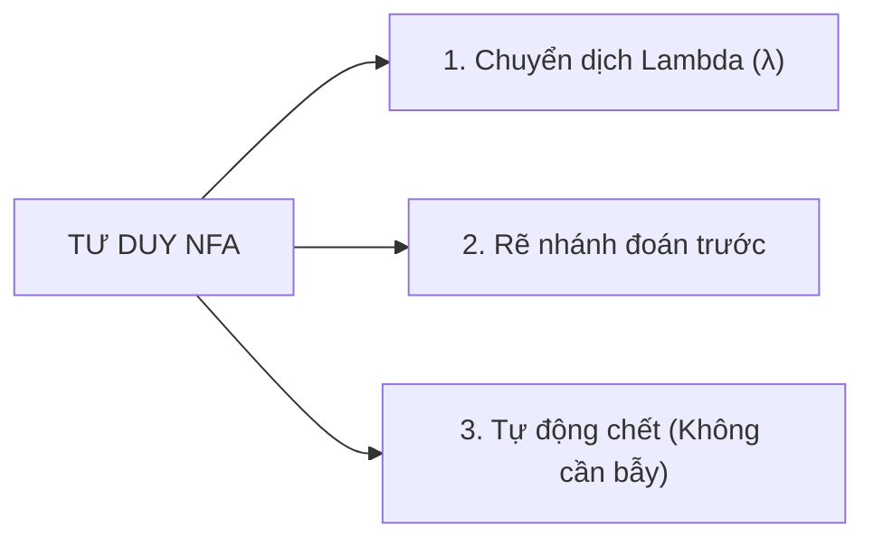
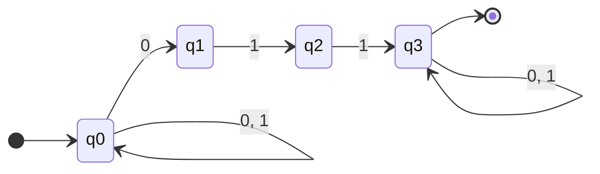
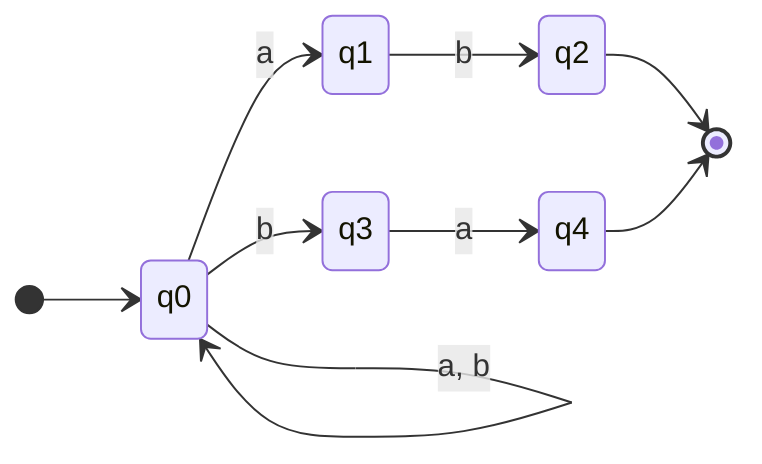
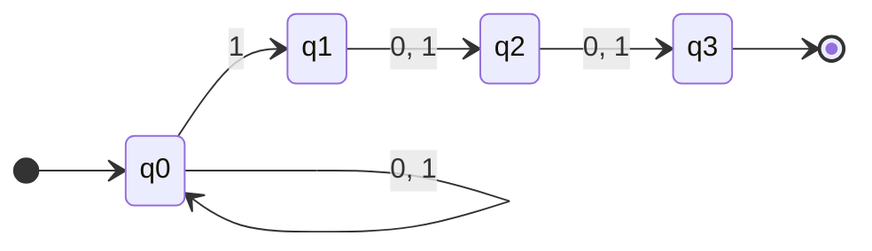
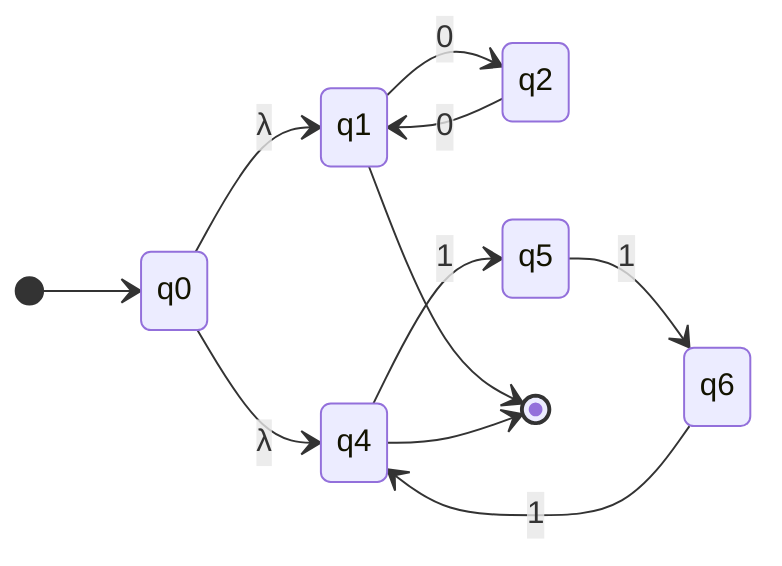

# LÝ THUYẾT ĐẦY ĐỦ VỀ MÁY TỰ ĐỘNG HỮU HẠN KHÔNG ĐƠN ĐỊNH (NFA)
*(Tổng hợp chi tiết từ Giáo trình & Bài giảng Ôtômát IUH - Dành cho người mới bắt đầu)*

---

## MỤC LỤC
1. [Mở Đầu & Bản Chất Của NFA](#1-mở-đầu--bản-chất-của-nfa)
2. [Định Nghĩa Toán Học Của NFA](#2-định-nghĩa-toán-học-của-nfa)
3. [Hàm Chuyển Dịch Mở Rộng $\delta^*$ & Điều Kiện Chấp Nhận Chuỗi](#3-hàm-chuyển-dịch-mở-rộng-delta--điều-kiện-chấp-nhận-chuỗi)
4. [Cây Tiến Trình Song Song & Trạng Thái Chết](#4-cây-tiến-trình-song-song--trạng-thái-chết)
5. [Tư Duy & 3 Vũ Khí Thiết Kế NFA](#5-tư-duy--3-vũ-khí-thiết-kế-nfa)
6. [Các Dạng Thiết Kế NFA Kinh Điển (Có Ví Dụ Mẫu)](#6-các-dạng-thiết-kế-nfa-kinh-điển-có-ví-dụ-mẫu)
7. [So Sánh NFA và DFA](#7-so-sánh-nfa-và-dfa)
8. [Bảng Tra Cứu Ký Hiệu & Cách Đọc Tiếng Việt Chuẩn](#8-bảng-tra-cứu-ký-hiệu--cách-đọc-tiếng-việt-chuẩn)

---

## 1. MỞ ĐẦU & BẢN CHẤT CỦA NFA

### 1.1 Trò chơi tìm kho báu & Khái niệm "Không đơn định"
- **Máy đơn định (DFA - Deterministic):** Giống như đi trên đường ray tàu hỏa. Tại mỗi ngã rẽ, ứng với một ký tự nhập vào, bạn **chỉ có duy nhất 1 lựa chọn** bắt buộc phải đi.
- **Máy không đơn định (NFA - Nondeterministic):** Giống như **trò chơi tìm kho báu**. Đứng trước một ngã ba:
  - Bạn có quyền **"đoán"** con đường dẫn đến kho báu.
  - Bạn có thể **tự nhân bản chính mình** để đi thử vào tất cả các con đường khả dĩ cùng một lúc (hoạt động song song).
  - Nếu có đường đi vào ngõ cụt (không có lối đi tiếp), nhánh đó sẽ tự động dừng lại (chết).
  - **Chỉ cần có ÍT NHẤT 1 nhánh tìm được đến đích (Trạng thái kết thúc), toàn bộ chuỗi sẽ ĐƯỢC CHẤP NHẬN!**

---

## 2. ĐỊNH NGHĨA TOÁN HỌC CỦA NFA

### 2.1 Nhắc lại kiến thức Tập lũy thừa ($2^Q$ hoặc $\mathcal{P}(Q)$)
- Nếu một tập hợp có $n$ phần tử, thì số tập con của nó là $2^n$.
- **Ví dụ:** Cho $A = \{1, 2, 3\}$ (gồm 3 phần tử), số tập con là $2^3 = 8$:
  $$2^A = \{\emptyset, \{1\}, \{2\}, \{3\}, \{1, 2\}, \{1, 3\}, \{2, 3\}, \{1, 2, 3\}\}$$
- **Ý nghĩa trong NFA:** Từ một trạng thái $q$, khi đọc một ký tự, NFA có thể chuyển sang **0 trạng thái (tập $\emptyset$)**, **1 trạng thái**, hoặc **nhiều trạng thái cùng lúc**. Do đó, kết quả của hàm chuyển dịch là một **tập hợp con của $Q$**, thuộc về $2^Q$.

---

### 2.2 Định nghĩa hình thức Bộ 5
Một máy tự động hữu hạn không đơn định (NFA) được xác định bởi bộ 5 thành phần:
$$M = (Q, \Sigma, \delta, q_0, F)$$

Trong đó:
1. **$Q$ (Finite set of states):** Tập hữu hạn các trạng thái nội (ví dụ: $Q = \{q_0, q_1, q_2\}$).
2. **$\Sigma$ (Alphabet):** Tập hữu hạn các ký hiệu đầu nhập (bảng chữ cái, ví dụ: $\Sigma = \{0, 1\}$ hoặc $\Sigma = \{a, b\}$).
3. **$\delta$ (Transition function):** Hàm chuyển dịch trạng thái:
   $$\delta: Q \times (\Sigma \cup \{\lambda\}) \to 2^Q$$
   - Nhận vào: 1 trạng thái hiện tại $\in Q$ và 1 ký tự đầu vào $\in \Sigma$ (hoặc ký tự rỗng $\lambda$).
   - Trả về: **Một tập hợp các trạng thái tiếp theo** $\in 2^Q$.
4. **$q_0 \in Q$ (Initial state):** Trạng thái bắt đầu (duy nhất 1 trạng thái khởi đầu, có mũi tên chỉ vào từ bên ngoài).
5. **$F \subseteq Q$ (Set of final / accepting states):** Tập các trạng thái kết thúc (chấp nhận), được vẽ bằng **vòng tròn đôi**.

> 📌 **Ký hiệu đặc biệt $\lambda$ (hoặc $\epsilon$):**  
> Chuyển dịch $\delta(q_1, \lambda) = \{q_2\}$ nghĩa là máy có thể tự động nhảy từ trạng thái $q_1$ sang $q_2$ mà **không cần đọc bất kỳ ký tự nào**.

---

## 3. HÀM CHUYỂN DỊCH MỞ RỘNG $\delta^*$ & ĐIỀU KIỆN CHẤP NHẬN CHUỖI

### 3.1 Hàm chuyển dịch mở rộng $\delta^*$
- Hàm $\delta$ chỉ nhận vào **1 ký tự đơn lẻ**.
- Hàm $\delta^*$ mở rộng để nhận vào **một chuỗi ký tự $w = a_1 a_2 \dots a_n$**:
  $$\delta^*(q_i, w) = Q_j \subseteq Q$$
  ($Q_j$ là tập hợp tất cả các trạng thái mà NFA có thể đạt tới sau khi đọc hết chuỗi $w$ xuất phát từ $q_i$).

### 3.2 Ngôn ngữ được chấp nhận bởi NFA ($L(M)$)
Một chuỗi $w$ được NFA $M$ chấp nhận khi và chỉ khi tập trạng thái kết thúc sau khi đọc hết $w$ có chứa **ít nhất một trạng thái chấp nhận $\in F$**:
$$L(M) = \{w \in \Sigma^* \mid \delta^*(q_0, w) \cap F \neq \emptyset\}$$

- **Nói một cách trực quan trên đồ thị:** Chuỗi $w$ được chấp nhận nếu tồn tại **ít nhất một đường đi** mang nhãn tạo thành chuỗi $w$, xuất phát từ đỉnh bắt đầu $q_0$ và kết thúc tại một đỉnh kết thúc $\in F$.

---

## 4. CÂY TIẾN TRÌNH SONG SONG & TRẠNG THÁI CHẾT

### 4.1 Cây tiến trình (Processing Tree)
Để kiểm tra một chuỗi $w$ có được NFA chấp nhận hay không, ta vẽ cây tiến trình:
- Gốc cây là trạng thái bắt đầu $q_0$ cùng toàn bộ chuỗi $w$.
- Mỗi bước đọc 1 ký tự, cây phân nhánh ra tất cả các trạng thái tiếp theo có thể đến được.
- Các nhánh có thể xảy ra:
  1. **Nhánh thành công (Accepted):** Đọc hết chuỗi $w$ và dừng lại tại một trạng thái $\in F$.
  2. **Nhánh thất bại (Rejected):** Đọc hết chuỗi $w$ nhưng dừng lại ở trạng thái **không** thuộc $F$.
  3. **Nhánh chết (Dead / Empty $\emptyset$):** Chưa đọc hết chuỗi nhưng tại trạng thái hiện tại không có mũi tên cho ký tự tiếp theo $\to$ Nhánh bị hủy ngay lập tức.

```
                      (q0, 010110)
                     /            \
             đọc 0 /                \ đọc 0
                 v                    v
           (q0, 10110)             (q0, ...)
          /           \
   đọc 1 /             \ đọc 1
        v               v
   (q0, 0110)       (q1, 0110)
        |                |
       ...        (q2, 110) -> (q3, 10) -> (q3, 0) -> q3 (CHẤP NHẬN!)
```

---

## 5. TƯ DUY & 3 VŨ KHÍ THIẾT KẾ NFA

Khi thiết kế NFA, ta có 3 "vũ khí tối thượng" mà DFA không có:



1. **Chuyển dịch $\lambda$ (Nhảy cóc):** Cho phép máy tự do chuyển trạng thái để kết nối các máy con lại với nhau (rất mạnh khi làm bài toán dạng $L_1 \cup L_2$).
2. **Rẽ nhánh đoán trước (Nhiều lựa chọn):** Từ $q_0$, máy vừa có thể quay vòng lặp tại chỗ để "chờ", vừa có thể "đoán" rằng mẫu mong muốn bắt đầu xuất hiện để rẽ nhánh sang $q_1$.
3. **Trạng thái chết tự nhiên:** Nếu chuỗi vi phạm quy tắc, ta chỉ cần **không vẽ đường đi tiếp** $\to$ Nhánh đó tự động biến mất, không cần phải vẽ thêm trạng thái "bẫy" (trap state) phức tạp như bên DFA.

---

## 6. CÁC DẠNG THIẾT KẾ NFA KINH ĐIỂN (CÓ VÍ DỤ MẪU)

### Dạng 1: Chứa chuỗi con cố định (Substring)
- **Yêu cầu:** Thiết kế NFA trên $\Sigma = \{0, 1\}$ chứa chuỗi con $011$.
- **Tư duy:** 
  - Tại $q_0$: Vòng lặp $\{0, 1\}$ để "chờ".
  - Khi gặp $0$: Đoán là đầu chuỗi $011 \to$ đi sang $q_1 \xrightarrow{1} q_2 \xrightarrow{1} q_3$.
  - Tại $q_3$ (đích): Vòng lặp $\{0, 1\}$ để ăn phần đuôi tùy ý.



---

### Dạng 2: Kết thúc bằng mẫu $X$ hoặc mẫu $Y$
- **Yêu cầu:** Thiết kế NFA trên $\Sigma = \{a, b\}$ kết thúc bằng $ab$ hoặc $ba$.
- **Tư duy:** Rẽ 2 nhánh ngay từ $q_0$:
  - Nhánh trên: $q_0 \xrightarrow{a} q_1 \xrightarrow{b} q_2$ (kết thúc bằng $ab$).
  - Nhánh dưới: $q_0 \xrightarrow{b} q_3 \xrightarrow{a} q_4$ (kết thúc bằng $ba$).
  - Tại $q_0$ có vòng lặp $\{a, b\}$ để đọc phần đầu bất kỳ. Tại $q_2, q_4$ **không có đường ra** để đảm bảo chuỗi phải dừng đúng lúc kết thúc.



---

### Dạng 3: Ký tự thứ $k$ tính từ cuối chuỗi
- **Yêu cầu:** Ký tự thứ 3 tính từ cuối chuỗi lên là '1' trên $\Sigma = \{0, 1\}$.
- **Tư duy:** Chuỗi có dạng $*** 1 **$ (sau số 1 có đúng 2 ký tự bất kỳ rồi hết).
  - $q_0$ (loop $0, 1$) $\xrightarrow{1} q_1 \xrightarrow{0, 1} q_2 \xrightarrow{0, 1} q_3$ (kết thúc).



---

### Dạng 4: Phép HOẶC (Hợp hai ngôn ngữ $L_1 \cup L_2$) dùng chuyển dịch $\lambda$
- **Yêu cầu:** Thiết kế NFA cho ngôn ngữ có số lượng chữ số '0' là số chẵn HOẶC số lượng chữ số '1' chia hết cho 3.
- **Tư duy:** 
  1. Vẽ máy A nhận số 0 chẵn (2 trạng thái $q_1, q_2$ lặp lại).
  2. Vẽ máy B nhận số 1 chia hết cho 3 (3 trạng thái $q_4, q_5, q_6$ lặp lại).
  3. Tạo trạng thái bắt đầu $q_0$, nối 2 mũi tên $\lambda$ sang máy A và máy B.



---

## 7. SO SÁNH NFA VÀ DFA

| Tiêu chí so sánh | DFA (Đơn định) | NFA (Không đơn định) |
| :--- | :--- | :--- |
| **Số chuyển dịch từ 1 trạng thái với 1 ký tự** | **Chính xác duy nhất 1** đường đi | **0, 1 hoặc nhiều** đường đi |
| **Chuyển dịch $\lambda$ (không đọc ký tự)** | ❌ **Không cho phép** | ✅ **Cho phép** ($\lambda$-transition) |
| **Kết quả hàm chuyển dịch** | $\delta(q, a) \in Q$ (1 trạng thái) | $\delta(q, a) \subseteq Q$ (tập trạng thái $\in 2^Q$) |
| **Xử lý chuỗi sai / ngõ cụt** | Phải vẽ trạng thái bẫy (Trap state) | Tự động rơi vào trạng thái chết $\emptyset$ |
| **Độ phức tạp khi thiết kế** | Phức tạp, nhiều trạng thái, khó vẽ | Rất trực quan, ngắn gọn, ít trạng thái |
| **Khả năng nhận diện ngôn ngữ** | Nhận diện Ngôn ngữ chính quy | **Tương đương 100% với DFA** |

> ⭐ **Định lý quan trọng:** Mọi NFA đều có thể chuyển đổi thành một DFA tương đương (sử dụng thuật toán xây dựng tập con Subset Construction).

---

## 8. BẢNG TRA CỨU KÝ HIỆU & CÁCH ĐỌC TIẾNG VIỆT CHUẨN

| Ký hiệu | Tên gọi | Cách đọc tiếng Việt chuẩn | Ví dụ & Ý nghĩa |
| :--- | :--- | :--- | :--- |
| **NFA** | Nondeterministic Finite Automaton | **"En-Ép-Ây"** hoặc **"Máy tự động hữu hạn không đơn định"** | Máy nhận diện chuỗi có phân nhánh |
| **$2^Q$** | Tập lũy thừa *(Power set)* | **"Hai mũ Quy"** hoặc **"Tập tất cả các tập con của Q"** | Nếu $|Q|=3 \Rightarrow |2^Q|=8$ |
| **$\delta(q, a)$** | Hàm chuyển dịch | **"Đen-ta của q với a"** | $\delta(q_0, 1) = \{q_0, q_1\}$ |
| **$\delta^*(q, w)$** | Hàm chuyển dịch mở rộng | **"Đen-ta sao của q với w"** | $\delta^*(q_0, 101) = \{q_2\}$ |
| **$\lambda$ / $\epsilon$** | Ký tự rỗng | **"Lam-đa"** hoặc **"Ký tự rỗng"** | $\delta(q_1, \lambda) = \{q_2\}$: nhảy không tốn ký tự |
| **$\emptyset$** | Tập rỗng / Nhánh chết | **"Tập rỗng"** hoặc **"Trạng thái chết"** | $\delta(q_2, 0) = \emptyset$: ngưng tiến trình |
| **$F$** | Tập trạng thái kết thúc | **"Tập ép"** hoặc **"Tập trạng thái chấp nhận"** | Vẽ bằng 2 vòng tròn đồng tâm |
