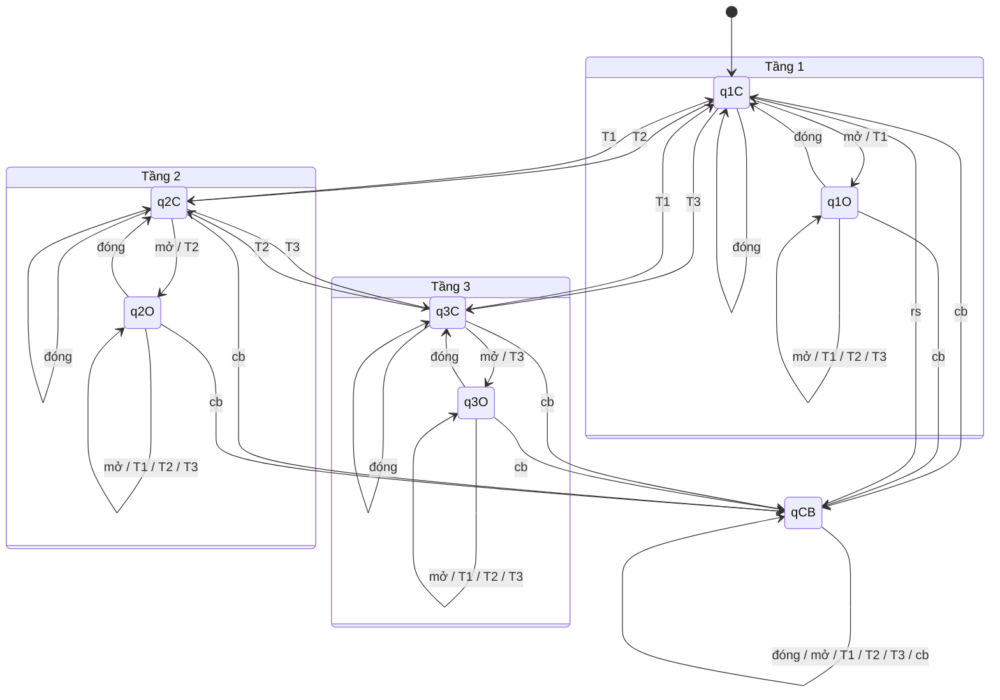
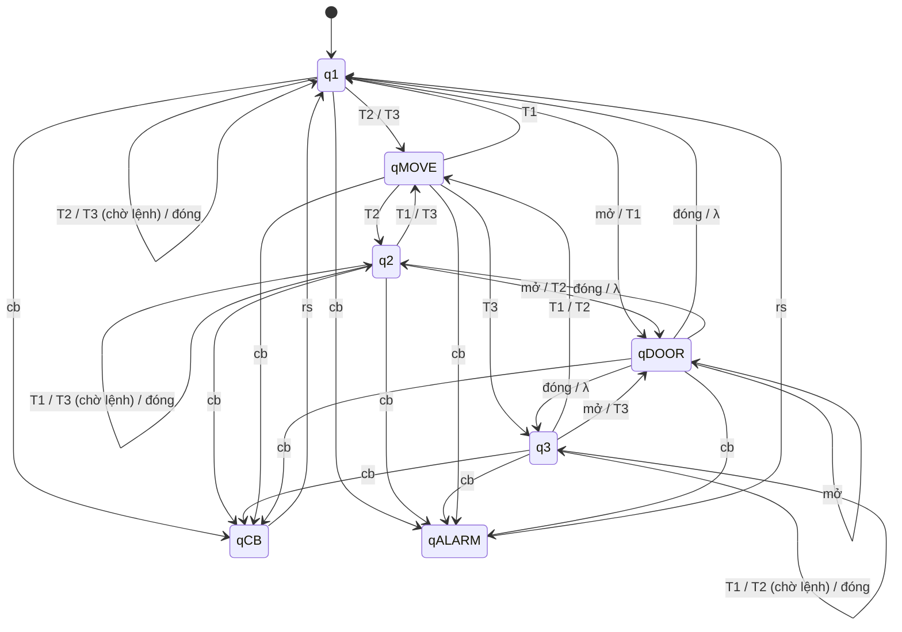

# BÀI TẬP: THIẾT KẾ OTOMAT CHO HỆ THỐNG THANG MÁY 3 TẦNG (DFA & NFA)

---

## I. ĐẶT BÀI TOÁN & PHÂN TÍCH HỆ THỐNG

### 1. Mô tả bài toán
Thiết kế hệ thống điều khiển thang máy phục vụ cho tòa nhà **3 tầng** (Tầng 1, Tầng 2, Tầng 3) sử dụng mô hình lý thuyết Otomat:
1. **Một Otomat Hữu hạn Đơn định (DFA - Deterministic Finite Automaton)**.
2. **Một Otomat Hữu hạn Không đơn định (NFA - Non-deterministic Finite Automaton)**.

### 2. Tập ký hiệu đầu vào / Bảng chữ cái ($\Sigma$)
Các sự kiện điều khiển và cảm biến của thang máy được mô hình hóa thành tập ký hiệu vào $\Sigma$:
$$\Sigma = \{\text{đóng}, \text{mở}, T_1, T_2, T_3, cb, rs\}$$

Trong đó:
- `đóng` ($đ$ hoặc $close$): Sự kiện nhấn nút đóng cửa / cảm biến xác nhận cửa đóng hoàn toàn.
- `mở` ($m$ hoặc $open$): Sự kiện nhấn nút mở cửa / cảm biến xác nhận cửa mở hoàn toàn.
- $T_1$ (`tầng 1`): Sự kiện bấm nút chọn hoặc gọi Tầng 1.
- $T_2$ (`tầng 2`): Sự kiện bấm nút chọn hoặc gọi Tầng 2.
- $T_3$ (`tầng 3`): Sự kiện bấm nút chọn hoặc gọi Tầng 3.
- $cb$ (`cảnh báo` / $alarm$): Tín hiệu cảnh báo khẩn cấp, quá tải hoặc sự cố an toàn.
- $rs$ (`reset` / $khôi\ phục$): Tín hiệu bảo trì / hoàn tất xử lý sự cố để đưa hệ thống về trạng thái bình thường.

---

## II. THIẾT KẾ 1: OTOMAT HỮU HẠN ĐƠN ĐỊNH (DFA)

### 1. Định nghĩa hình thức 5-thành phần
Otomat đơn định $M_{DFA}$ được xác định bởi bộ 5:
$$M_{DFA} = (Q, \Sigma, \delta, q_0, F)$$

#### a) Tập các trạng thái ($Q$)
Gồm 7 trạng thái biểu diễn vị trí tầng, trạng thái cửa và trạng thái sự cố:
- $q_{1O}$: Thang máy ở **Tầng 1**, Cửa đang **Mở** (Floor 1 - Open).
- $q_{1C}$: Thang máy ở **Tầng 1**, Cửa đang **Đóng** (Floor 1 - Closed).
- $q_{2O}$: Thang máy ở **Tầng 2**, Cửa đang **Mở** (Floor 2 - Open).
- $q_{2C}$: Thang máy ở **Tầng 2**, Cửa đang **Đóng** (Floor 2 - Closed).
- $q_{3O}$: Thang máy ở **Tầng 3**, Cửa đang **Mở** (Floor 3 - Open).
- $q_{3C}$: Thang máy ở **Tầng 3**, Cửa đang **Đóng** (Floor 3 - Closed).
- $q_{CB}$: Trạng thái **Cảnh báo sự cố / Dừng khẩn cấp** (Alarm/Emergency State).

$$Q = \{q_{1O}, q_{1C}, q_{2O}, q_{2C}, q_{3O}, q_{3C}, q_{CB}\}$$

#### b) Trạng thái bắt đầu ($q_0$)
- $q_0 = q_{1C}$ (Thang máy khởi tạo mặc định tại Tầng 1, cửa đóng sẵn sàng nhận lệnh).

#### c) Tập trạng thái kết thúc / chấp nhận ($F$)
- $F = \{q_{1O}, q_{2O}, q_{3O}\}$ (Các trạng thái thang máy đã đưa hành khách đến tầng mong muốn an toàn và mở cửa thành công).

---

### 2. Bảng chuyển trạng thái của DFA ($\delta$)

| Trạng thái hiện tại | `đóng` | `mở` | $T_1$ | $T_2$ | $T_3$ | $cb$ (Cảnh báo) | $rs$ (Reset) |
| :---: | :---: | :---: | :---: | :---: | :---: | :---: | :---: |
| $\to q_{1C}$ | $q_{1C}$ | $q_{1O}$ | $q_{1O}$ | $q_{2C}$ | $q_{3C}$ | $q_{CB}$ | $q_{1C}$ |
| $* q_{1O}$ | $q_{1C}$ | $q_{1O}$ | $q_{1O}$ | $q_{1O}$ | $q_{1O}$ | $q_{CB}$ | $q_{1O}$ |
| $q_{2C}$ | $q_{2C}$ | $q_{2O}$ | $q_{1C}$ | $q_{2O}$ | $q_{3C}$ | $q_{CB}$ | $q_{2C}$ |
| $* q_{2O}$ | $q_{2C}$ | $q_{2O}$ | $q_{2O}$ | $q_{2O}$ | $q_{2O}$ | $q_{CB}$ | $q_{2O}$ |
| $q_{3C}$ | $q_{3C}$ | $q_{3O}$ | $q_{1C}$ | $q_{2C}$ | $q_{3O}$ | $q_{CB}$ | $q_{3C}$ |
| $* q_{3O}$ | $q_{3C}$ | $q_{3O}$ | $q_{3O}$ | $q_{3O}$ | $q_{3O}$ | $q_{CB}$ | $q_{3O}$ |
| $q_{CB}$ | $q_{CB}$ | $q_{CB}$ | $q_{CB}$ | $q_{CB}$ | $q_{CB}$ | $q_{CB}$ | $q_{1C}$ |

#### Nguyên lý vận hành an toàn trong DFA:
1. **Khi cửa đang mở ($q_{iO}$)**: Thang máy **không được phép di chuyển** giữa các tầng dù có bấm $T_j$. Thang máy chỉ chuyển sang cửa đóng khi nhận tín hiệu `đóng`.
2. **Khi cửa đã đóng ($q_{iC}$)**: Nhận lệnh $T_j$ ($j \neq i$), thang máy di chuyển đến tầng $j$ ($q_{jC}$). Nếu bấm đúng tầng hiện tại ($T_i$), thang máy mở cửa ($q_{iO}$).
3. **Khi xảy ra sự cố ($cb$)**: Từ bất kỳ trạng thái nào, hệ thống chuyển ngay lập tức sang $q_{CB}$ (khóa hành trình).
4. **Khôi phục ($rs$)**: Chỉ khi kỹ thuật viên phát tín hiệu `rs`, hệ thống mới thoát khỏi $q_{CB}$ và quay về trạng thái an toàn $q_{1C}$.

---

### 3. Đồ thị chuyển trạng thái của DFA



---

### 4. Ví dụ kiểm thử chuỗi nhập trên DFA

- **Chuỗi 1: Đi từ Tầng 1 lên Tầng 3 và mở cửa**
  $$w_1 = T_3 \rightarrow \text{mở}$$
  Vết thực thi:
  $$q_{1C} \xrightarrow{T_3} q_{3C} \xrightarrow{\text{mở}} q_{3O} \in F \quad \Rightarrow \text{HỢP LỆ (Chấp nhận)}$$

- **Chuỗi 2: Đang ở Tầng 2 thì gặp sự cố cảnh báo**
  $$w_2 = T_2 \rightarrow \text{mở} \rightarrow cb \rightarrow T_3$$
  Vết thực thi:
  $$q_{1C} \xrightarrow{T_2} q_{2C} \xrightarrow{\text{mở}} q_{2O} \xrightarrow{cb} q_{CB} \xrightarrow{T_3} q_{CB} \notin F \quad \Rightarrow \text{BÁO ĐỘNG (Từ chối phục vụ)}$$

---

## III. THIẾT KẾ 2: OTOMAT HỮU HẠN KHÔNG ĐƠN ĐỊNH (NFA)

### 1. Tại sao dùng NFA cho Thang máy?
Trong thực tế, mô hình NFA cho phép:
1. **Lập lịch song song & Tiên đoán (Concurrency / Speculative Scheduling)**: Khi ở Tầng 1 nhận lệnh $T_2$, thang máy có thể vừa duy trì trạng thái chờ khách ở Tầng 1, vừa kích hoạt tiến trình chuẩn bị động cơ chuyển động lên Tầng 2.
2. **Cảm biến cảnh báo đa luồng ($cb$)**: Khi có cảnh báo `cb`, hệ thống không đơn định chuyển đồng thời sang:
   - Dừng khẩn cấp ($q_{CB}$).
   - Kích hoạt chuông còi báo động / gửi tín hiệu về trung tâm cứu hộ ($q_{ALARM}$).
3. **Chuyển dịch tự phát ($\lambda$-transition)**: Thang máy tự động đóng cửa sau thời gian chờ (timeout) $\lambda$ mà không cần người dùng bấm `đóng`.

---

### 2. Định nghĩa hình thức 5-thành phần của NFA
$$M_{NFA} = (Q_{NFA}, \Sigma, \delta_{NFA}, q_0, F_{NFA})$$

#### a) Tập trạng thái ($Q_{NFA}$)
- $q_1$: Thang máy tại **Tầng 1**.
- $q_2$: Thang máy tại **Tầng 2**.
- $q_3$: Thang máy tại **Tầng 3**.
- $q_{DOOR}$: Trạng thái điều khiển **Cửa mở** (phục vụ khách ra vào).
- $q_{MOVE}$: Trạng thái **Đang di chuyển** (động cơ hoạt động kéo cáp).
- $q_{CB}$: Trạng thái **Cảnh báo / Dừng khẩn cấp**.
- $q_{ALARM}$: Trạng thái **Kích hoạt cứu hộ / Phát còi hú**.

$$Q_{NFA} = \{q_1, q_2, q_3, q_{DOOR}, q_{MOVE}, q_{CB}, q_{ALARM}\}$$

#### b) Trạng thái bắt đầu ($q_0$)
- $q_0 = q_1$ (Thang máy bắt đầu tại Tầng 1).

#### c) Tập trạng thái kết thúc ($F_{NFA}$)
- $F_{NFA} = \{q_{DOOR}\}$ (Thang máy hoàn thành chu trình di chuyển và mở cửa an toàn cho khách).

---

### 3. Bảng chuyển trạng thái của NFA ($\delta_{NFA}$)

| Trạng thái | `đóng` | `mở` | $T_1$ | $T_2$ | $T_3$ | $cb$ | $rs$ | $\lambda$ (Tự động) |
| :---: | :---: | :---: | :---: | :---: | :---: | :---: | :---: | :---: |
| $\to q_1$ | $\{q_1\}$ | $\{q_{DOOR}\}$ | $\{q_{DOOR}\}$ | $\{q_1, q_{MOVE}\}$ | $\{q_1, q_{MOVE}\}$ | $\{q_{CB}, q_{ALARM}\}$ | $\emptyset$ | $\emptyset$ |
| $q_2$ | $\{q_2\}$ | $\{q_{DOOR}\}$ | $\{q_2, q_{MOVE}\}$ | $\{q_{DOOR}\}$ | $\{q_2, q_{MOVE}\}$ | $\{q_{CB}, q_{ALARM}\}$ | $\emptyset$ | $\emptyset$ |
| $q_3$ | $\{q_3\}$ | $\{q_{DOOR}\}$ | $\{q_3, q_{MOVE}\}$ | $\{q_3, q_{MOVE}\}$ | $\{q_{DOOR}\}$ | $\{q_{CB}, q_{ALARM}\}$ | $\emptyset$ | $\emptyset$ |
| $q_{MOVE}$ | $\{q_{MOVE}\}$ | $\emptyset$ | $\{q_1\}$ | $\{q_2\}$ | $\{q_3\}$ | $\{q_{CB}, q_{ALARM}\}$ | $\emptyset$ | $\emptyset$ |
| $* q_{DOOR}$ | $\{q_1, q_2, q_3\}$ | $\{q_{DOOR}\}$ | $\emptyset$ | $\emptyset$ | $\emptyset$ | $\{q_{CB}, q_{ALARM}\}$ | $\emptyset$ | $\{q_1, q_2, q_3\}$ *(Tự đóng)* |
| $q_{CB}$ | $\emptyset$ | $\emptyset$ | $\emptyset$ | $\emptyset$ | $\emptyset$ | $\{q_{CB}\}$ | $\{q_1\}$ | $\emptyset$ |
| $q_{ALARM}$ | $\emptyset$ | $\emptyset$ | $\emptyset$ | $\emptyset$ | $\emptyset$ | $\{q_{ALARM}\}$ | $\{q_1\}$ | $\emptyset$ |

---

### 4. Đồ thị chuyển trạng thái của NFA



---

### 5. Cây phân nhánh xử lý chuỗi nhập trên NFA

- **Kiểm tra chuỗi tiếp nhận:** $w = T_2 \rightarrow T_2 \rightarrow \text{mở}$ (Từ Tầng 1 gọi Tầng 2, di chuyển và mở cửa)

```text
(q1, T2 T2 mở)
├── (q1, T2 mở) ── (qDOOR, mở) ── (qDOOR, λ)  [CHẤP NHẬN]
└── (qMOVE, T2 mở)
      └── (q2, mở)
            └── (qDOOR, λ)  [CHẤP NHẬN]
```
> Nhờ tính chất không đơn định, hệ thống tìm được ít nhất 1 nhánh dẫn đến trạng thái chấp nhận $q_{DOOR} \in F$, do đó chuỗi $w$ được **chấp nhận**.

- **Kiểm tra sự cố cảnh báo:** $w_{cb} = cb$

```text
(q1, cb)
├── (qCB, λ)      [Trạng thái phanh dừng khẩn cấp]
└── (qALARM, λ)   [Trạng thái kích hoạt còi báo động]
```
> Hệ thống xử lý song song 2 nhiệm vụ bảo vệ an toàn cùng lúc.

---

## IV. BẢNG SO SÁNH TỔNG HỢP DFA VÀ NFA THANG MÁY

| Tiêu chí | Mô hình DFA (Đơn định) | Mô hình NFA (Không đơn định) |
| :--- | :--- | :--- |
| **Số lượng trạng thái** | 7 trạng thái ($q_{1O}, q_{1C}, q_{2O}, q_{2C}, q_{3O}, q_{3C}, q_{CB}$) | 7 trạng thái ($q_1, q_2, q_3, q_{DOOR}, q_{MOVE}, q_{CB}, q_{ALARM}$) |
| **Tính xác định $\delta(q, a)$** | Duy nhất 1 trạng thái tiếp theo cho mỗi đầu vào. | Trả về một **tập hợp** trạng thái (có thể rỗng hoặc nhiều trạng thái). |
| **Chuyển dịch $\lambda$ (Tự phát)** | **Không cho phép**. Cửa chỉ đóng khi có sự kiện `đóng`. | **Cho phép**. Mô tả được cảm biến tự động đóng cửa sau timeout. |
| **Xử lý sự cố $cb$** | Chuyển tuần tự vào 1 trạng thái khóa $q_{CB}$. | Phân nhánh song song vừa dừng thang ($q_{CB}$), vừa báo động ($q_{ALARM}$). |
| **Ứng dụng thực tế** | Dễ dàng nạp trực tiếp vào lập trình vi điều khiển, PLC, mạch số cứng. | Dùng để thiết kế đặc tả yêu cầu mức cao, kiểm thử luồng đồng thời (Concurrency). |

---

## V. KẾT LUẬN & ĐÁNH GIÁ
1. Cả hai mô hình **DFA** và **NFA** đều mô tả chính xác hoạt động logic của hệ thống thang máy 3 tầng đáp ứng trọn vẹn tập ký hiệu $\Sigma = \{\text{đóng}, \text{mở}, T_1, T_2, T_3, cb, rs\}$.
2. Bản thiết kế đảm bảo đầy đủ bộ 5 thành phần hình thức $A = (Q, \Sigma, \delta, q_0, F)$, bảng chuyển trạng thái, đồ thị chuyển trạng thái và các kịch bản vận hành thực tế.
