# CẨM NANG TOÀN DIỆN & MẪU TRÌNH BÀY THI CHUẨN 10/10
## CHUYÊN ĐỀ: CHUYỂN ĐỔI NFA SANG DFA (THỦ TỤC NFA-TO-DFA)

> **Tài liệu học tập & Ôn thi chuẩn theo giáo trình và bộ bài làm mẫu bài thi:**
> - Giáo trình chính: `chuyển đổi NFA _DFA_SV.pdf`
> - Mẫu bài làm trên giấy thi thực tế: `kk_1.jpg` đến `kk_5.jpg`  
> - Môn học: Lý thuyết Otomat và Ngôn ngữ hình thức (IUH)

---

# MỤC LỤC
- [0. HƯỚNG DẪN QUY ƯỚC & CÁCH VẼ TRẠNG THÁI KẾT THÚC (FINAL STATE - F)](#0-hướng-dẫn-quy-ước--cách-vẽ-trạng-thái-kết-thúc-final-state---f)
- [1. QUY TẮC SỐNG CÒN KHI LÀM BÀI THI (XỬ LÝ ĐỀ MẤT CHỈ SỐ q)](#1-quy-tắc-sống-còn-khi-làm-bài-thi-xử-lý-đề-mất-chỉ-số-q)
- [2. MẪU TRÌNH BÀY BÀI LÀM ĐI THI CHUẨN (THỦ TỤC NFA-TO-DFA)](#2-mẫu-trình-bày-bài-làm-đi-thi-chuẩn-thủ-tục-nfa-to-dfa)
- [3. CHI TIẾT 3 VÍ DỤ SLIDE GIÁO TRÌNH](#3-chi-tiết-3-ví-dụ-slide-giáo-trình)
  - [Ví dụ 1: NFA có λ-transition → DFA có trạng thái bẫy ∅](#ví-dụ-1-nfa-có-λ-transition-→-dfa-có-trạng-thái-bẫy-∅)
  - [Ví dụ 2: NFA sang DFA đầy đủ trên Σ = {0, 1}](#ví-dụ-2-nfa-sang-dfa-đầy-đủ-trên-Σ--0-1)
  - [Ví dụ 3: NFA có λ-closure bắt đầu phức tạp {q0, q3, q4}](#ví-dụ-3-nfa-có-λ-closure-bắt-đầu-phức-tạp-q0-q3-q4)
- [4. LỜI GIẢI CHI TIẾT 5 BÀI TẬP SLIDE (TRANG 5 - ĐỐI CHIẾU BÀI THI `kk_1` ĐẾN `kk_5`)](#4-lời-giải-chi-tiết-5-bài-tập-slide-trang-5---đối-chiếu-bài-thi-kk_1-đến-kk_5)
  - [Bài tập 1: NFA 3 trạng thái có vòng lặp ngược (Đối chiếu `kk_5.jpg`)](#bài-tập-1-nfa-3-trạng-thái-có-vòng-lặp-ngược-đối-chiếu-kk_5jpg)
  - [Bài tập 2: NFA 2 trạng thái có chuyển dịch 0, 1 (Đối chiếu `kk_4.jpg`)](#bài-tập-2-nfa-2-trạng-thái-có-chuyển-dịch-0-1-đối-chiếu-kk_4jpg)
  - [Bài tập 3: NFA đoán nhận chuỗi kết thúc bằng bb (Đối chiếu `kk_3.jpg`)](#bài-tập-3-nfa-đoán-nhận-chuỗi-kết-thúc-bằng-bb-đối-chiếu-kk_3jpg)
  - [Bài tập 4: NFA 3 trạng thái mạng chuyển dịch chéo (Đối chiếu `kk_2.jpg`)](#bài-tập-4-nfa-3-trạng-thái-mạng-chuyển-dịch-chéo-đối-chiếu-kk_2jpg)
  - [Bài tập 5: NFA 3 trạng thái trên bảng chữ cái {a, b} (Đối chiếu `kk_1.jpg`)](#bài-tập-5-nfa-3-trạng-thái-trên-bảng-chữ-cái-a-b-đối-chiếu-kk_1jpg)
- [5. CHECKLIST ĐIỂM 10 CHO DẠNG BÀI NFA → DFA](#5-checklist-điểm-10-cho-dạng-bài-nfa-→-dfa)

---

# 0. HƯỚNG DẪN QUY ƯỚC & CÁCH VẼ TRẠNG THÁI KẾT THÚC (FINAL STATE - F)

> [!IMPORTANT]
> **TẠI SAO TRẠNG THÁI KẾT THÚC PHẢI TUYỆT ĐỐI CHÍNH XÁC?**  
> Trong NFA, trạng thái kết thúc (FN) được đề bài vẽ bằng **vòng tròn đôi**.  
> Khi chuyển sang DFA, quy tắc vàng là: **Bất kỳ tập hợp con nào của DFA có chứa ít nhất 1 phần tử thuộc FN đều trở thành trạng thái kết thúc của DFA (ký hiệu ★ hoặc FD)**.  
> Nếu xác định sai FN ban đầu (nhìn nhầm nút thường thành kết thúc, hoặc bỏ sót), toàn bộ đồ thị DFA kết quả sẽ bị sai trạng thái chấp nhận và mất điểm!

### BẢNG ĐỐI CHIẾU QUY ƯỚC TRẠNG THÁI KẾT THÚC (F) TRÊN MỌI ĐỊNH DẠNG:

| Phương tiện thể hiện | Trạng thái thường (Non-final) | Trạng thái khởi đầu | **Trạng thái kết thúc (Final State - F)** |
| :--- | :--- | :--- | :--- |
| **Giấy thi / Viết tay (`kk_1` đến `kk_9`)** | 1 vòng tròn đơn (qi) | Mũi tên → trỏ vào nút | **2 VÒNG TRÒN ĐỒNG TÂM (VÒNG TRÒN ĐÔI)** |
| **Văn bản / Công thức** | q0, q1, {q1, q2} | q0 hoặc S0 | **★ qf ∈ F hoặc ★ {q1, q2} ∈ FD (luôn có dấu ★)** |
| **Bảng hàm chuyển dịch (δ)** | Ghi tên tập bình thường | Thêm mũi tên → | **In đậm, thêm dấu ★, cột "Thuộc F?" ghi "CÓ (TRẠNG THÁI KẾT THÚC - F)"** |
| **Sơ đồ Mermaid (Trong file này)** | Khung chữ nhật bo góc đơn | Có `[*] --> q0` | **Tô nền XANH LÁ TƯƠI NHẠT, VIỀN XANH ĐẬM DÀY 3PX, nhãn chứa `★ ... (KẾT THÚC - F)`** |

---

# 1. QUY TẮC SỐNG CÒN KHI LÀM BÀI THI (XỬ LÝ ĐỀ MẤT CHỈ SỐ q)

> [!IMPORTANT]
> **TẠI SAO ĐỀ THI HAY CÓ NÚT CHỈ GHI MỖI CHỮ q TRƠN VÀ KHÔNG RÕ TRẠNG THÁI KẾT THÚC?**  
> Khi đề bài in từ PowerPoint/Word xuất sang PDF, các chỉ số subscript (q0, q1, q2...) rất hay bị lỗi font chữ nên bị biến thành chữ q trơn; đồng thời một số hình vẽ bị mất nét vòng tròn đôi (trạng thái kết thúc F).
>
> **QUY TRÌNH 3 BƯỚC BẮT BUỘC KHI VÀO PHÒNG THI:**
> 1. **Vẽ lại hình vào bài thi:** Tuyệt đối không được làm bài trên chữ q trơn.
> 2. **Gán nhãn số q0, q1, q2... & Xác định rõ tập F:**
>    - Trạng thái có mũi tên từ ngoài trỏ vào luôn là **trạng thái khởi đầu q0**.
>    - Đặt tên các trạng thái tiếp theo từ trái sang phải, từ trên xuống dưới.
>    - Trạng thái có vòng tròn đôi (hoặc nút đích) là **trạng thái kết thúc (F)**, trong bài viết này luôn được ký hiệu rõ bằng dấu **★ (F)**.
> 3. **Khai báo bộ 5 thành phần M = (Q, Σ, δ, q0, F)** và lập bảng hàm chuyển dịch δ ban đầu trước khi thực hiện các bước thuật toán.

---

# 2. MẪU TRÌNH BÀY BÀI LÀM ĐI THI CHUẨN (THỦ TỤC NFA-TO-DFA)
*(Trích chuẩn theo bài thi thực tế `kk_1.jpg` đến `kk_5.jpg`)*

Khi làm bài thi chuyển đổi NFA sang DFA, bạn trình bày đúng 3 bước:

```text
BÀI LÀM:

Bước 1: Đỉnh khởi đầu của DFA là {q0}  
(Nếu NFA có bước nhảy λ: S0 = λ-closure(q0) = {q0, ...})

Bước 2: Xây dựng các hàm chuyển dịch δ*:
  δ*({q0}, a) = {...};    δ*({q0}, b) = {...}
  δ*({q1, q2}, a) = {...}; δ*({q1, q2}, b) = {...}
  ...
  δ*(∅, a) = ∅;          δ*(∅, b) = ∅  (Nếu có trạng thái bẫy)

Bước 3: Những trạng thái nào có chứa <trạng thái kết thúc FN của NFA> 
đều là trạng thái kết thúc của DFA (Ký hiệu ★ (F)).
Ta có đồ thị chuyển trạng thái của DFA như hình sau:

  [Vẽ hình đồ thị DFA hoàn chỉnh với nhãn tập con trên các nút, các nút thuộc FD đánh dấu rõ ★ (F)]
```

---

# 3. CHI TIẾT 3 VÍ DỤ SLIDE GIÁO TRÌNH

### Ví dụ 1: NFA có λ-transition → DFA có trạng thái bẫy ∅
*(Slide trang 1 - 2)*

#### 1. Khai báo Otomat ban đầu:
- Tập trạng thái NFA: `Q = {q0, q1, q2}`, `Σ = {a, b}`.
- Trạng thái khởi đầu: `q0`.
- **Tập trạng thái kết thúc NFA: FN = {★ q1}** (chỉ có q1 có vòng tròn đôi).
- Các bước chuyển dịch của NFA:
  - `q0 ─(a)→ q1`
  - `q1 ─(λ)→ q2`; `q1 ─(a)→ q1`; `q1 ─(b)→ q0`
  - `q2 ─(b)→ q0`

#### 2. Bài làm chuẩn đi thi:

```text
Bước 1: Đỉnh khởi đầu của DFA là {q0}.

Bước 2: Các bước chuyển dịch δ*:
  δ*({q0}, a) = {q1, q2}   (vì q0 đọc a ra q1, q1 đi λ sang q2)
  δ*({q0}, b) = ∅          (không có chuyển dịch b từ q0)

  δ*({q1, q2}, a) = δ*(q1, a) ∪ δ*(q2, a) = {q1, q2} ∪ ∅ = {q1, q2}
  δ*({q1, q2}, b) = δ*(q1, b) ∪ δ*(q2, b) = {q0} ∪ {q0} = {q0}

  δ*(∅, a) = ∅; δ*(∅, b) = ∅  (trạng thái bẫy)

Bước 3: Vì q1 ∈ FN nên những đỉnh có chứa q1 là trạng thái kết thúc của DFA. 
Do vậy đỉnh ★ {q1, q2} là trạng thái kết thúc duy nhất của DFA (FD = {{q1, q2}}).
```

#### 3. Bảng hàm chuyển dịch DFA:

| Trạng thái DFA | Ký hiệu tập con | Đọc a | Đọc b | Thuộc FD? (Trạng thái kết thúc) |
| :---: | :---: | :---: | :---: | :---: |
| → {q0} | {q0} | {q1, q2} | ∅ | Không |
| **★ {q1, q2}** | {q1, q2} | {q1, q2} | {q0} | **CÓ (TRẠNG THÁI KẾT THÚC DUY NHẤT - F)** |
| ∅ | Trap | ∅ | ∅ | Không |

#### 4. Đồ thị DFA tương đương:

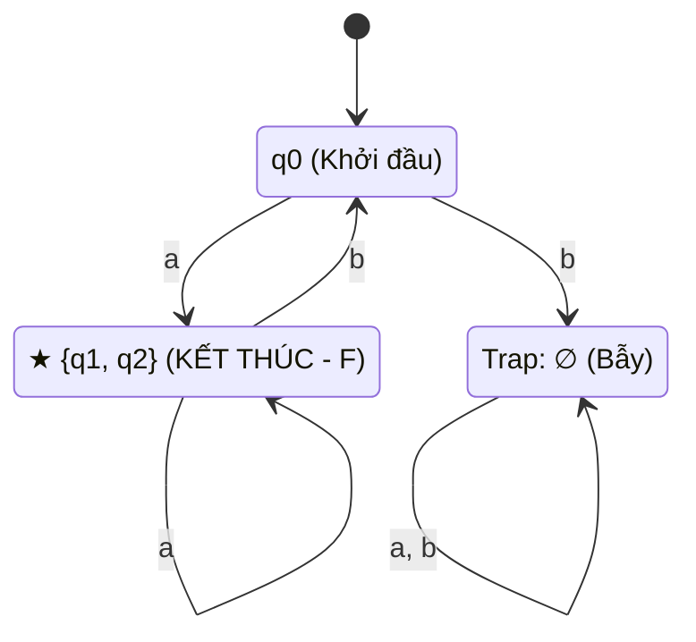

---

### Ví dụ 2: NFA sang DFA đầy đủ trên Σ = {0, 1}
*(Slide trang 2 - 4)*

#### 1. Khai báo Otomat ban đầu:
- NFA có `Q = {q0, q1, q2}`, `Σ = {0, 1}`.
- Trạng thái khởi đầu: `q0`.
- **Tập trạng thái kết thúc NFA: FN = {★ q1}** (chỉ có q1 có vòng tròn đôi).
- Các bước chuyển của NFA:
  - `q0 ─(0)→ q0, q1`; `q0 ─(1)→ q1`
  - `q1 ─(0)→ q2`; `q1 ─(1)→ q2`
  - `q2 ─(0)→ ∅`; `q2 ─(1)→ q2`

#### 2. Bài làm chuẩn đi thi:

```text
Bước 1: Đỉnh khởi đầu của DFA là {q0}.

Bước 2: Tính các bước chuyển dịch δ*:
  δ*({q0}, 0) = {q0, q1};  δ*({q0}, 1) = {q1}

  δ*({q0, q1}, 0) = δ*(q0, 0) ∪ δ*(q1, 0) = {q0, q1} ∪ {q2} = {q0, q1, q2}
  δ*({q0, q1}, 1) = δ*(q0, 1) ∪ δ*(q1, 1) = {q1} ∪ {q2} = {q1, q2}

  δ*({q1}, 0) = {q2};      δ*({q1}, 1) = {q2}

  δ*({q0, q1, q2}, 0) = {q0, q1, q2}; δ*({q0, q1, q2}, 1) = {q1, q2}
  δ*({q1, q2}, 0) = {q2};           δ*({q1, q2}, 1) = {q2}
  δ*({q2}, 0) = ∅;                  δ*({q2}, 1) = {q2}

  δ*(∅, 0) = ∅; δ*(∅, 1) = ∅  (trạng thái bẫy)

Bước 3: Những trạng thái nào chứa q1 ∈ FN đều là trạng thái kết thúc của DFA.
Tập trạng thái kết thúc FD gồm 4 trạng thái:
  FD = { ★ {q1}, ★ {q0, q1}, ★ {q1, q2}, ★ {q0, q1, q2} }
```

#### 3. Bảng hàm chuyển của DFA:

| Trạng thái DFA | Ký hiệu tập con | Đọc 0 | Đọc 1 | Thuộc FD? (Trạng thái kết thúc) |
| :---: | :---: | :---: | :---: | :---: |
| → {q0} | {q0} | {q0, q1} | {q1} | Không |
| **★ {q0, q1}** | {q0, q1} | {q0, q1, q2} | {q1, q2} | **CÓ (TRẠNG THÁI KẾT THÚC - F)** |
| **★ {q1}** | {q1} | {q2} | {q2} | **CÓ (TRẠNG THÁI KẾT THÚC - F)** |
| **★ {q0, q1, q2}** | {q0, q1, q2} | {q0, q1, q2} | {q1, q2} | **CÓ (TRẠNG THÁI KẾT THÚC - F)** |
| **★ {q1, q2}** | {q1, q2} | {q2} | {q2} | **CÓ (TRẠNG THÁI KẾT THÚC - F)** |
| {q2} | {q2} | ∅ | {q2} | Không |
| ∅ | Trap | ∅ | ∅ | Không |

#### 4. Đồ thị DFA tương đương:

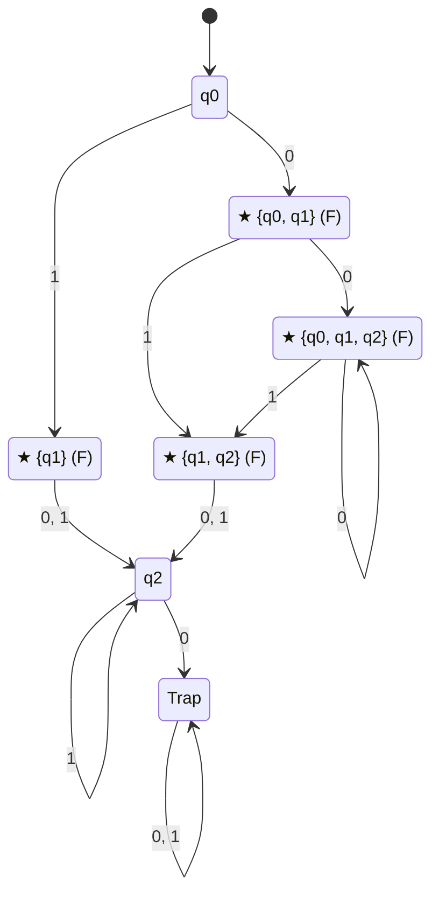

---

### Ví dụ 3: NFA có λ-closure bắt đầu phức tạp {q0, q3, q4}
*(Slide trang 4 - 5)*

#### 1. Khai báo Otomat ban đầu:
- NFA có `Q = {q0, q1, q2, q3, q4}`, `Σ = {a, b}`.
- Trạng thái khởi đầu: `q0`.
- **Tập trạng thái kết thúc NFA: FN = {★ q1, ★ q2}**.

#### 2. Bài làm chuẩn đi thi:

```text
Bước 1: Đỉnh khởi đầu của DFA là {q0, q3, q4} (vì δ*(q0, λ) = {q0, q3, q4}).

Bước 2: Tính các chuyển dịch δ*:
  δ*({q0, q3, q4}, a) = {q1, q2, q4}
  δ*({q0, q3, q4}, b) = {q1, q2, q3, q4}

  δ*({q1, q2, q4}, a) = {q0, q1, q2, q3, q4}
  δ*({q1, q2, q4}, b) = {q3, q4}

  δ*({q1, q2, q3, q4}, a) = {q0, q1, q2, q3, q4}
  δ*({q1, q2, q3, q4}, b) = {q3, q4}

  δ*({q0, q1, q2, q3, q4}, a) = {q0, q1, q2, q3, q4}
  δ*({q0, q1, q2, q3, q4}, b) = {q1, q2, q3, q4}

  δ*({q3, q4}, a) = {q4};    δ*({q3, q4}, b) = {q3, q4}
  δ*({q4}, a) = ∅;          δ*({q4}, b) = {q3, q4}
  δ*(∅, a) = ∅;             δ*(∅, b) = ∅

Bước 3: Chọn những đỉnh có chứa q1 hoặc q2 ∈ FN làm trạng thái kết thúc.
Tập trạng thái kết thúc FD = { ★ {q1, q2, q4}, ★ {q1, q2, q3, q4}, ★ {q0, q1, q2, q3, q4} }.
```

#### 3. Bảng hàm chuyển của DFA:

| Trạng thái DFA | Ký hiệu nút | Đọc a | Đọc b | Thuộc FD? (Trạng thái kết thúc) |
| :---: | :---: | :---: | :---: | :---: |
| → {q0, q3, q4} | A | B | C | Không |
| **★ {q1, q2, q4}** | B | D | E | **CÓ (TRẠNG THÁI KẾT THÚC - F)** |
| **★ {q1, q2, q3, q4}** | C | D | E | **CÓ (TRẠNG THÁI KẾT THÚC - F)** |
| **★ {q0, q1, q2, q3, q4}** | D | D | C | **CÓ (TRẠNG THÁI KẾT THÚC - F)** |
| {q3, q4} | E | G | E | Không |
| {q4} | G | Trap | E | Không |
| ∅ | Trap | Trap | Trap | Không |

#### 4. Đồ thị DFA tương đương:

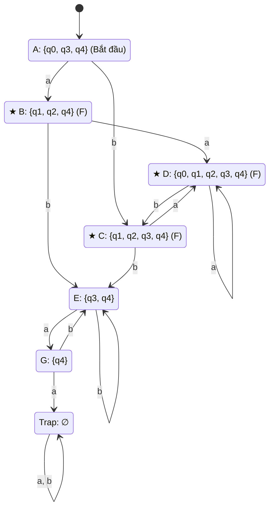

---

# 4. LỜI GIẢI CHI TIẾT 5 BÀI TẬP SLIDE (TRANG 5 - ĐỐI CHIẾU BÀI THI `kk_1` ĐẾN `kk_5`)

---

### Bài tập 1: NFA 3 trạng thái có vòng lặp ngược (Đối chiếu `kk_5.jpg`)

#### A. Đề bài gốc từ Slide:
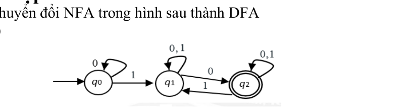

- Tập trạng thái: `Q = {q0, q1, q2}`, bảng chữ cái `Σ = {0, 1}`.
- Trạng thái bắt đầu: `q0`.
- **Trạng thái kết thúc NFA:** Nhìn vào hình, chỉ có **q2 có vòng tròn đôi**! `q0` và `q1` đều là vòng tròn đơn.
  ⇒ **FN = {★ q2}**.
  *(Lưu ý sửa sai: Một số bài làm nháp chép nhầm q1 có vòng tròn đôi dẫn đến dư trạng thái kết thúc. Hình gốc giáo trình chuẩn xác 100% chỉ có q2 ∈ FN).*
- Các bước chuyển dịch NFA gốc:
  - `q0 ─(0)→ q0`; `q0 ─(1)→ q1`
  - `q1 ─(0, 1)→ q1`; `q1 ─(0)→ q2` ⇒ `δ(q1, 0) = {q1, q2}`; `δ(q1, 1) = {q1}`
  - `q2 ─(0, 1)→ q2`; `q2 ─(1)→ q1` ⇒ `δ(q2, 0) = {q2}`; `δ(q2, 1) = {q1, q2}`

#### B. Bài làm chuẩn đi thi:

```text
Bước 1: Đỉnh khởi đầu của DFA là {q0}

Bước 2: Xây dựng các hàm chuyển dịch δ*:
  δ*({q0}, 0) = {q0};           δ*({q0}, 1) = {q1}

  δ*({q1}, 0) = {q1, q2};       δ*({q1}, 1) = {q1}

  δ*({q1, q2}, 0) = δ*(q1, 0) ∪ δ*(q2, 0) = {q1, q2} ∪ {q2} = {q1, q2}
  δ*({q1, q2}, 1) = δ*(q1, 1) ∪ δ*(q2, 1) = {q1} ∪ {q1, q2} = {q1, q2}

  δ*(∅, 0) = ∅;                 δ*(∅, 1) = ∅  (nếu có)

Bước 3: Ta chọn những đỉnh có chứa q2 ∈ FN làm trạng thái kết thúc.
Vì chỉ có đỉnh {q1, q2} chứa q2 nên tập trạng thái kết thúc của DFA là:
  FD = { ★ {q1, q2} }  (Trạng thái kết thúc duy nhất).
```

#### C. Bảng chuyển dịch DFA:

| Trạng thái DFA | Đọc 0 | Đọc 1 | Thuộc FD? (Trạng thái kết thúc) |
| :---: | :---: | :---: | :---: |
| → {q0} | {q0} | {q1} | Không |
| {q1} | {q1, q2} | {q1} | Không |
| **★ {q1, q2}** | {q1, q2} | {q1, q2} | **CÓ (TRẠNG THÁI KẾT THÚC DUY NHẤT - F)** |

#### D. Đồ thị DFA tương đương:

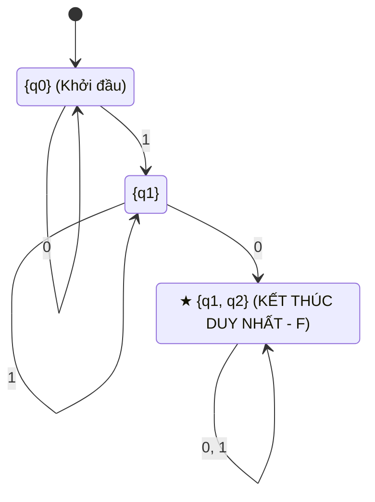

---

### Bài tập 2: NFA 2 trạng thái có chuyển dịch 0, 1 (Đối chiếu `kk_4.jpg`)

#### A. Đề bài gốc từ Slide:
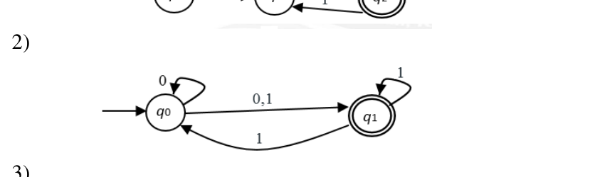

- Tập trạng thái: `Q = {q0, q1}`, bảng chữ cái `Σ = {0, 1}`.
- Trạng thái bắt đầu: `q0`.
- **Trạng thái kết thúc NFA: FN = {★ q1}** (q1 có vòng tròn đôi).
- Các bước chuyển dịch NFA:
  - `q0 ─(0)→ q0`; `q0 ─(0, 1)→ q1` ⇒ `δ(q0, 0) = {q0, q1}`; `δ(q0, 1) = {q1}`
  - `q1 ─(1)→ q1`; `q1 ─(1)→ q0` ⇒ `δ(q1, 0) = ∅`; `δ(q1, 1) = {q0, q1}`

#### B. Bài làm chuẩn đi thi:

```text
Bước 1: Đỉnh khởi đầu là {q0}

Bước 2: Xây dựng các hàm chuyển dịch δ*:
  δ*({q0}, 0) = {q0, q1};       δ*({q0}, 1) = {q1}

  δ*({q1}, 0) = ∅;             δ*({q1}, 1) = {q0, q1}

  δ*({q0, q1}, 0) = δ*(q0, 0) ∪ δ*(q1, 0) = {q0, q1} ∪ ∅ = {q0, q1}
  δ*({q0, q1}, 1) = δ*(q0, 1) ∪ δ*(q1, 1) = {q1} ∪ {q0, q1} = {q0, q1}

  δ*(∅, 0) = ∅;                 δ*(∅, 1) = ∅  (trạng thái bẫy)

Bước 3: Những trạng thái nào chứa q1 ∈ FN là trạng thái kết thúc.
Tập trạng thái kết thúc FD = { ★ {q1}, ★ {q0, q1} }.
```

#### C. Bảng chuyển dịch DFA:

| Trạng thái DFA | Đọc 0 | Đọc 1 | Thuộc FD? (Trạng thái kết thúc) |
| :---: | :---: | :---: | :---: |
| → {q0} | {q0, q1} | {q1} | Không |
| **★ {q1}** | ∅ | {q0, q1} | **CÓ (TRẠNG THÁI KẾT THÚC - F)** |
| **★ {q0, q1}** | {q0, q1} | {q0, q1} | **CÓ (TRẠNG THÁI KẾT THÚC - F)** |
| ∅ | ∅ | ∅ | Không |

#### D. Đồ thị DFA tương đương:

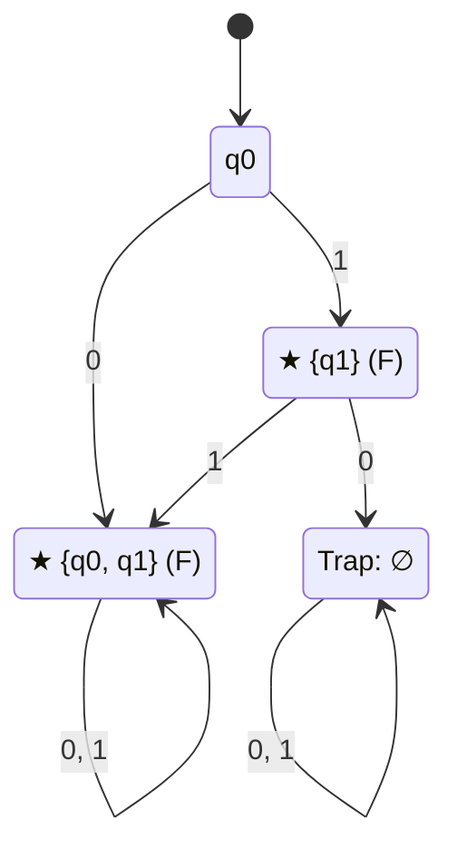

---

### Bài tập 3: NFA đoán nhận chuỗi kết thúc bằng bb (Đối chiếu `kk_3.jpg`)

#### A. Đề bài gốc từ Slide:
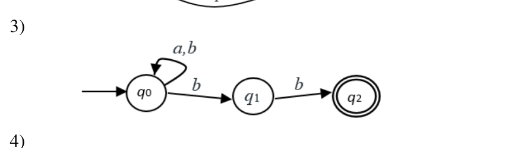

- Tập trạng thái: `Q = {q0, q1, q2}`, `Σ = {a, b}`.
- Trạng thái bắt đầu: `q0`.
- **Trạng thái kết thúc NFA: FN = {★ q2}** (chỉ có q2 có vòng tròn đôi).
- Các bước chuyển dịch NFA:
  - `q0 ─(a, b)→ q0`; `q0 ─(b)→ q1` ⇒ `δ(q0, a) = {q0}`; `δ(q0, b) = {q0, q1}`
  - `q1 ─(b)→ q2` ⇒ `δ(q1, a) = ∅`; `δ(q1, b) = {q2}`
  - `q2`: không có cạnh đi ra ⇒ `δ(q2, a) = ∅`; `δ(q2, b) = ∅`

#### B. Bài làm chuẩn đi thi:

```text
Bước 1: Đỉnh khởi đầu của DFA là {q0}

Bước 2: Xây dựng các hàm chuyển dịch δ*:
  δ*({q0}, a) = {q0};           δ*({q0}, b) = {q0, q1}

  δ*({q0, q1}, a) = δ*(q0, a) ∪ δ*(q1, a) = {q0} ∪ ∅ = {q0}
  δ*({q0, q1}, b) = δ*(q0, b) ∪ δ*(q1, b) = {q0, q1} ∪ {q2} = {q0, q1, q2}

  δ*({q0, q1, q2}, a) = {q0} ∪ ∅ ∪ ∅ = {q0}
  δ*({q0, q1, q2}, b) = {q0, q1} ∪ {q2} ∪ ∅ = {q0, q1, q2}

Bước 3: Ta chọn đỉnh có chứa q2 ∈ FN làm trạng thái kết thúc.
Tập trạng thái kết thúc duy nhất: FD = { ★ {q0, q1, q2} }.
```

#### C. Bảng chuyển dịch DFA:

| Trạng thái DFA | Đọc a | Đọc b | Thuộc FD? (Trạng thái kết thúc) |
| :---: | :---: | :---: | :---: |
| → {q0} | {q0} | {q0, q1} | Không |
| {q0, q1} | {q0} | {q0, q1, q2} | Không |
| **★ {q0, q1, q2}** | {q0} | {q0, q1, q2} | **CÓ (TRẠNG THÁI KẾT THÚC DUY NHẤT - F)** |

#### D. Đồ thị DFA tương đương:

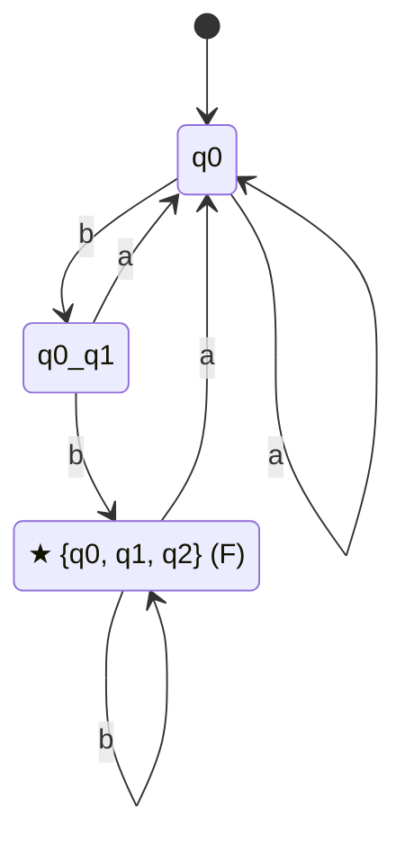

---

### Bài tập 4: NFA 3 trạng thái mạng chuyển dịch chéo (Đối chiếu `kk_2.jpg`)

#### A. Đề bài gốc từ Slide:
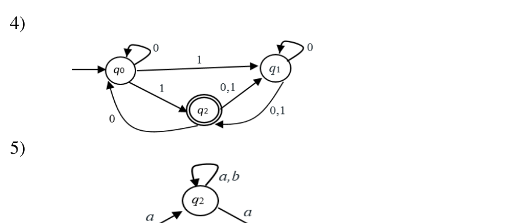

- Tập trạng thái: `Q = {q0, q1, q2}`, `Σ = {0, 1}`.
- Trạng thái bắt đầu: `q0`.
- **Trạng thái kết thúc NFA: FN = {★ q2}** (chỉ có q2 có vòng tròn đôi).
- Các bước chuyển dịch NFA gốc:
  - `q0 ─(0)→ q0`; `q0 ─(1)→ q1`; `q0 ─(1)→ q2` ⇒ `δ(q0, 0) = {q0}`; `δ(q0, 1) = {q1, q2}`
  - `q1 ─(0)→ q1`; `q1 ─(0, 1)→ q2` ⇒ `δ(q1, 0) = {q1, q2}`; `δ(q1, 1) = {q2}`
  - `q2 ─(0)→ q0`; `q2 ─(0, 1)→ q1` ⇒ `δ(q2, 0) = {q0, q1}`; `δ(q2, 1) = {q1}`

#### B. Bài làm chuẩn đi thi:

```text
Bước 1: Đỉnh khởi đầu của DFA là {q0}

Bước 2: Xây dựng các hàm chuyển dịch δ*:
  δ*({q0}, 0) = {q0};           δ*({q0}, 1) = {q1, q2}

  δ*({q1, q2}, 0) = δ*(q1, 0) ∪ δ*(q2, 0) = {q1, q2} ∪ {q0, q1} = {q0, q1, q2}
  δ*({q1, q2}, 1) = δ*(q1, 1) ∪ δ*(q2, 1) = {q2} ∪ {q1} = {q1, q2}

  δ*({q0, q1, q2}, 0) = δ*(q0, 0) ∪ δ*(q1, 0) ∪ δ*(q2, 0) = {q0} ∪ {q1, q2} ∪ {q0, q1} = {q0, q1, q2}
  δ*({q0, q1, q2}, 1) = δ*(q0, 1) ∪ δ*(q1, 1) ∪ δ*(q2, 1) = {q1, q2} ∪ {q2} ∪ {q1} = {q1, q2}

Bước 3: Ta chọn đỉnh có chứa q2 ∈ FN làm trạng thái kết thúc.
Tập trạng thái kết thúc FD = { ★ {q1, q2}, ★ {q0, q1, q2} }.
```

#### C. Bảng chuyển dịch DFA:

| Trạng thái DFA | Đọc 0 | Đọc 1 | Thuộc FD? (Trạng thái kết thúc) |
| :---: | :---: | :---: | :---: |
| → {q0} | {q0} | {q1, q2} | Không |
| **★ {q1, q2}** | {q0, q1, q2} | {q1, q2} | **CÓ (TRẠNG THÁI KẾT THÚC - F)** |
| **★ {q0, q1, q2}** | {q0, q1, q2} | {q1, q2} | **CÓ (TRẠNG THÁI KẾT THÚC - F)** |

#### D. Đồ thị DFA tương đương:

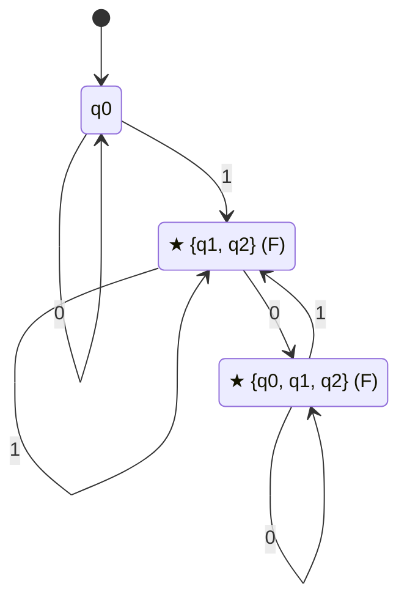

---

### Bài tập 5: NFA 3 trạng thái trên bảng chữ cái {a, b} (Đối chiếu `kk_1.jpg`)

#### A. Đề bài gốc từ Slide:
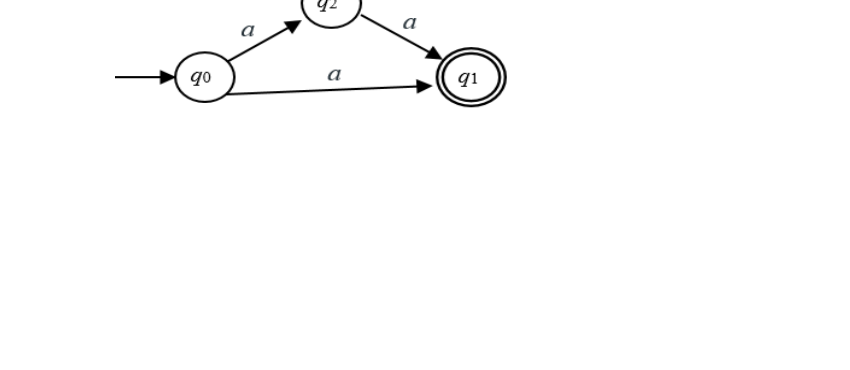

- Tập trạng thái: `Q = {q0, q1, q2}`, `Σ = {a, b}`.
- Trạng thái bắt đầu: `q0`.
- **Trạng thái kết thúc NFA: FN = {★ q1}** (Nhìn hình: q1 bên phải có vòng tròn đôi; q2 ở trên và q0 là vòng tròn đơn!).
  *(Lưu ý sửa sai quan trọng: Trong một số bài chép nhầm q2 là kết thúc; nhưng hình gốc giáo trình và bài giải mẫu `kk_1.jpg` ghi rõ: "Ta chọn đỉnh chứa q1 làm trạng thái kết thúc"!).*
- Các bước chuyển dịch NFA:
  - `q0 ─(a)→ q1`; `q0 ─(a)→ q2` ⇒ `δ(q0, a) = {q1, q2}`; `δ(q0, b) = ∅`
  - `q2 ─(a, b)→ q2`; `q2 ─(a)→ q1` ⇒ `δ(q2, a) = {q1, q2}`; `δ(q2, b) = {q2}`
  - `q1`: không có cạnh đi ra ⇒ `δ(q1, a) = ∅`; `δ(q1, b) = ∅`

#### B. Bài làm chuẩn đi thi:

```text
Bước 1: Đỉnh khởi đầu là {q0}

Bước 2: Xây dựng các hàm chuyển dịch δ*:
  δ*({q0}, a) = {q1, q2};       δ*({q0}, b) = ∅

  δ*({q1, q2}, a) = δ*(q1, a) ∪ δ*(q2, a) = ∅ ∪ {q1, q2} = {q1, q2}
  δ*({q1, q2}, b) = δ*(q1, b) ∪ δ*(q2, b) = ∅ ∪ {q2} = {q2}

  δ*({q2}, a) = {q1, q2};       δ*({q2}, b) = {q2}

  δ*(∅, a) = ∅;                 δ*(∅, b) = ∅  (trạng thái bẫy)

Bước 3: Ta chọn những đỉnh có chứa q1 ∈ FN làm trạng thái kết thúc.
Vì q1 ∈ FN, nên đỉnh duy nhất chứa q1 là {q1, q2}.
Tập trạng thái kết thúc DFA là: FD = { ★ {q1, q2} }.
(Đỉnh {q2} không chứa q1 nên {q2} là trạng thái thường).
```

#### C. Bảng chuyển dịch DFA:

| Trạng thái DFA | Đọc a | Đọc b | Thuộc FD? (Trạng thái kết thúc) |
| :---: | :---: | :---: | :---: |
| → {q0} | {q1, q2} | ∅ | Không |
| **★ {q1, q2}** | {q1, q2} | {q2} | **CÓ (TRẠNG THÁI KẾT THÚC DUY NHẤT - F)** |
| {q2} | {q1, q2} | {q2} | Không |
| ∅ | ∅ | ∅ | Không |

#### D. Đồ thị DFA tương đương:

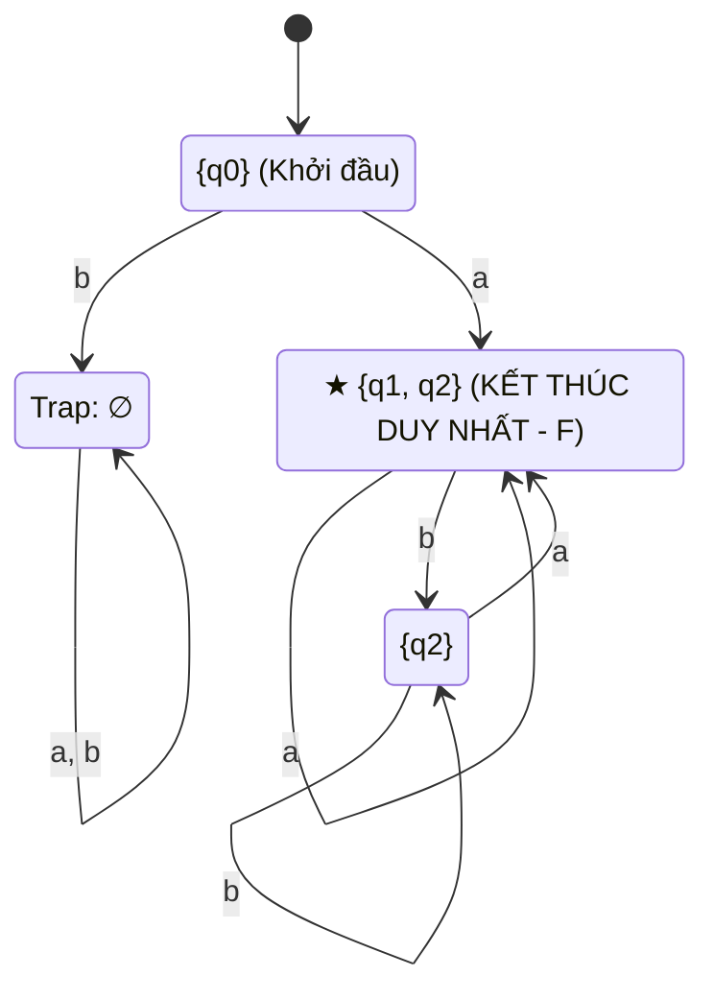

---

# 5. CHECKLIST ĐIỂM 10 CHO DẠNG BÀI NFA → DFA

```text
┌────────────────────────────────────────────────────────────────────────┐
│ BẢNG CHECKLIST BÀI THI CHUYỂN NFA SANG DFA                             │
├────────────────────────────────────────────────────────────────────────┤
│ [ ] 1. Quan sát kĩ hình đề bài: Nút nào có 2 vòng tròn mới là FN.     │
│ [ ] 2. Khai báo rõ ràng bộ 5 thành phần ban đầu M = (Q, Σ, δ, q0, FN). │
│ [ ] 3. Xác định đỉnh khởi đầu DFA: S0 = {q0} (hoặc λ-closure(q0)).     │
│ [ ] 4. Tính toán δ* từng bước cẩn thận bằng phép hợp (∪).              │
│ [ ] 5. Đưa trạng thái bẫy ∅ vào DFA nếu NFA có đường chuyển rỗng.      │
│ [ ] 6. Kết luận bước 3: Đỉnh nào của DFA CHỨA PHẦN TỬ THUỘC FN mới là  │
│        trạng thái kết thúc FD.                                         │
│ [ ] 7. Vẽ đồ thị DFA hoàn chỉnh: Nút kết thúc vẽ 2 VÒNG TRÒN ĐÔI.     │
└────────────────────────────────────────────────────────────────────────┘
```
