# CẨM NANG TOÀN DIỆN & MẪU TRÌNH BÀY THI CHUẨN 10/10
## CHUYÊN ĐỀ: TỐI THIỂU HÓA TRẠNG THÁI DFA (OPTIMIZE STATES)

> **Tài liệu học tập & Ôn thi chuẩn theo giáo trình và bộ bài làm mẫu bài thi:**
> - Giáo trình chính: `TỐI THIỂU CÁC TRẠNG THÁI CỦA DFA SV.pdf`
> - Mẫu bài làm trên giấy thi thực tế: `kk_6.jpg` đến `kk_9.jpg`  
> - Môn học: Lý thuyết Otomat và Ngôn ngữ hình thức (IUH)

---

# MỤC LỤC
- [0. HƯỚNG DẪN QUY ƯỚC & CÁCH VẼ TRẠNG THÁI KẾT THÚC (FINAL STATE - F)](#0-hướng-dẫn-quy-ước--cách-vẽ-trạng-thái-kết-thúc-final-state---f)
- [1. QUY TẮC SỐNG CÒN KHI LÀM BÀI THI (XỬ LÝ ĐỀ MẤT CHỈ SỐ q)](#1-quy-tắc-sống-còn-khi-làm-bài-thi-xử-lý-đề-mất-chỉ-số-q)
- [2. PHẦN A: BẢN CHẤT BẢNG TAM GIÁC & CÁC Ô (qi, qj) Ở ĐÂU RA?](#2-phần-a-bản-chất-bảng-tam-giác--các-ô-qi-qj-ở-đâu-ra)
- [3. PHẦN B: MẪU TRÌNH BÀY BÀI LÀM ĐI THI CHUẨN DẠNG DFA MINIMIZATION](#3-phần-b-mẫu-trình-bày-bài-làm-đi-thi-chuẩn-dạng-dfa-minimization)
- [4. PHẦN C: CHI TIẾT 4 VÍ DỤ SLIDE GIÁO TRÌNH](#4-phần-c-chi-tiết-4-ví-dụ-slide-giáo-trình)
  - [Ví dụ 2.2: Loại bỏ trạng thái cô lập q5 & gộp nhánh đối xứng](#ví-dụ-22-loại-bỏ-trạng-thái-cô-lập-q5--gộp-nhánh-đối-xứng)
  - [Ví dụ 2.3a: Lần vết giải thuật Optimize states trên DFA 5 trạng thái](#ví-dụ-23a-lần-vết-giải-thuật-optimize-states-trên-dfa-5-trạng-thái)
  - [Ví dụ 2.3b: Rút gọn DFA 6 trạng thái về 3 trạng thái](#ví-dụ-23b-rút-gọn-dfa-6-trạng-thái-về-3-trạng-thái)
  - [Ví dụ 2.4: Mẫu trả lời câu hỏi "DFA đã tối thiểu chưa? Tại sao?"](#ví-dụ-24-mẫu-trả-lời-câu-hỏi-dfa-đã-tối-thiểu-chưa-tại-sao)
- [5. PHẦN D: LỜI GIẢI CHI TIẾT 3 BÀI TẬP LỚN (TRANG 7 SLIDE - CHUẨN BÀI THI `kk_6` ĐẾN `kk_9`)](#5-phần-d-lời-giải-chi-tiết-3-bài-tập-lớn-trang-7-slide---chuẩn-bài-thi-kk_6-đến-kk_9)
  - [Bài tập 1 - Hình a: Tối thiểu hóa DFA 8 trạng thái (Đối chiếu `kk_6.jpg`)](#bài-tập-1---hình-a-tối-thiểu-hóa-dfa-8-trạng-thái-đối-chiếu-kk_6jpg)
  - [Bài tập 1 - Hình b: Tối thiểu hóa DFA 7 trạng thái (Đối chiếu `kk_6.jpg`)](#bài-tập-1---hình-b-tối-thiểu-hóa-dfa-7-trạng-thái-đối-chiếu-kk_6jpg)
  - [Bài tập 2: NFA → DFA → Tối thiểu hóa (Ngôn ngữ L = a* b* c* - Đối chiếu `kk_9.jpg`)](#bài-tập-2-nfa-→-dfa-→-tối-thiểu-hóa-ngôn-ngữ-l--a-b-c---đối-chiếu-kk_9jpg)
  - [Bài tập 3: Thiết kế DFA tối thiểu cho các ngôn ngữ hình thức](#bài-tập-3-thiết-kế-dfa-tối-thiểu-cho-các-ngôn-ngữ-hình-thức)
- [6. PHẦN E: CHECKLIST ĐIỂM 10 CHO DẠNG BÀI DFA MINIMIZATION](#6-phần-e-checklist-điểm-10-cho-dạng-bài-dfa-minimization)

---

# 0. HƯỚNG DẪN QUY ƯỚC & CÁCH VẼ TRẠNG THÁI KẾT THÚC (FINAL STATE - F)

> [!IMPORTANT]
> **TẠI SAO TRẠNG THÁI KẾT THÚC CẦN ĐƯỢC THỂ HIỆN RÕ RÀNG TRÊN TẤT CẢ PHƯƠNG TIỆN?**  
> Trong lý thuyết Otomat, trạng thái kết thúc (Final State / Accept State - F) quyết định xem chuỗi đầu vào có được chấp nhận hay không. Khi làm bài thi hoặc vẽ đồ thị, nếu không làm rõ trạng thái kết thúc sẽ bị **trừ 50% đến 100% số điểm** của câu đó.

### BẢNG ĐỐI CHIẾU QUY ƯỚC TRẠNG THÁI KẾT THÚC (F) TRÊN MỌI ĐỊNH DẠNG:

| Phương tiện thể hiện | Trạng thái thường (Non-final) | Trạng thái khởi đầu | **Trạng thái kết thúc (Final State - F)** |
| :--- | :--- | :--- | :--- |
| **Giấy thi / Viết tay (`kk_6` đến `kk_9`)** | 1 vòng tròn đơn (qi) | Mũi tên → trỏ vào nút | **2 VÒNG TRÒN ĐỒNG TÂM (VÒNG TRÒN ĐÔI)** |
| **Văn bản / Công thức** | q0, q1, {q1, q2} | q0 hoặc S0 | **★ qf ∈ F hoặc ★ [q3, q4] ∈ F (luôn có dấu ★)** |
| **Bảng hàm chuyển dịch (δ)** | Ghi tên tập bình thường | Thêm mũi tên → | **In đậm, thêm dấu ★, cột "Thuộc F?" ghi "CÓ (TRẠNG THÁI KẾT THÚC - F)"** |
| **Sơ đồ Mermaid (Trong file này)** | Khung chữ nhật bo góc đơn | Có `[*] --> q0` | **Tô nền XANH LÁ TƯƠI NHẠT, VIỀN XANH ĐẬM DÀY 3PX, nhãn chứa `★ ... (KẾT THÚC - F)`** |

---

# 1. QUY TẮC SỐNG CÒN KHI LÀM BÀI THI (XỬ LÝ ĐỀ MẤT CHỈ SỐ q)

> [!IMPORTANT]
> **TẠI SAO ĐỀ THI HAY CÓ NÚT CHỈ GHI MỖI CHỮ q TRƠN VÀ KHÔNG RÕ TRẠNG THÁI KẾT THÚC?**  
> Khi đề bài in từ PowerPoint/Word xuất sang PDF, các chỉ số subscript (q0, q1, q2...) rất hay bị lỗi font chữ nên bị biến thành chữ q trơn; đồng thời một số hình vẽ bị mất nét vòng tròn đôi (trạng thái kết thúc F).
>
> **QUY TRÌNH 3 BƯỚC BẮT BUỘC KHI VÀO PHÒNG THI:**
> 1. **Vẽ lại hình vào bài thi:** Tuyệt đối không được làm bài trên chữ q trơn.
> 2. **Gán nhãn số q0, q1, q2... & Xác định rõ tập F:**
>    - Trạng thái có mũi tên từ ngoài trỏ vào luôn là **trạng thái khởi đầu q0**.
>    - Đặt tên các trạng thái tiếp theo từ trái sang phải, từ trên xuống dưới.
>    - Trạng thái có vòng tròn đôi (hoặc nút đích) là **trạng thái kết thúc (F)**, trong bài viết này luôn được ký hiệu rõ bằng dấu **★ (F)**.
> 3. **Khai báo bộ 5 thành phần M = (Q, Σ, δ, q0, F)** và lập bảng hàm chuyển dịch δ ban đầu trước khi thực hiện các bước thuật toán.

---

# 2. PHẦN A: BẢN CHẤT BẢNG TAM GIÁC & CÁC Ô (qi, qj) Ở ĐÂU RA?

Rất nhiều bạn sinh viên khi học đến thuật toán Optimizing DFA đều thắc mắc:  
*"Tại sao Bước 1 lại liệt kê danh sách các ô (q1, q0), (q2, q0), (q2, q1)...? Các ô này từ đâu ra?"*

### 1. Bản chất toán học: So sánh từng cặp trạng thái
- Mục tiêu của tối thiểu hóa DFA là tìm xem trong các trạng thái của máy, có cặp nào giống hệt nhau về hành vi (tương đương nhau) để gộp lại hay không.
- Muốn biết có gộp được hay không, ta bắt buộc phải **lấy từng cặp 2 trạng thái bất kỳ (p, q) ra để so sánh**.
- Với một DFA có n = 5 trạng thái Q = {q0, q1, q2, q3, q4}, số cặp 2 phần tử khác nhau chính là tổ hợp chập 2 của n:
  - Công thức: `C(n, 2) = n × (n - 1) / 2`
  - Với n = 5: `C(5, 2) = (5 × 4) / 2 = 10 cặp so sánh`

---

### 2. Từ Ma Trận Vuông 5 × 5 đến Bảng Tam Giác

Xem ma trận vuông 25 ô khi so sánh 5 trạng thái:

| | q0 | q1 | q2 | q3 | q4 |
| :---: | :---: | :---: | :---: | :---: | :---: |
| **q0** | (q0, q0) | (q0, q1) | (q0, q2) | (q0, q3) | (q0, q4) |
| **q1** | **(q1, q0)** | (q1, q1) | (q1, q2) | (q1, q3) | (q1, q4) |
| **q2** | **(q2, q0)** | **(q2, q1)** | (q2, q2) | (q2, q3) | (q2, q4) |
| **q3** | **(q3, q0)** | **(q3, q1)** | **(q3, q2)** | (q3, q3) | (q3, q4) |
| **q4** | **(q4, q0)** | **(q4, q1)** | **(q4, q2)** | **(q4, q3)** | (q4, q4) |

- **Loại đường chéo chính (qi, qi):** Vì 1 trạng thái luôn bằng chính nó.
- **Loại nửa tam giác phía trên (qi, qj) với i < j:** Vì quan hệ tương đương có tính đối xứng (so sánh (q1, q0) cũng như (q0, q1)).

**KẾT QUẢ:** Chỉ giữ lại **NỬA DƯỚI ĐƯỜNG CHÉO CHÍNH** (bảng tam giác 10 ô):

```text
       q0      q1      q2      q3
    ┌───────┬───────┬───────┬───────┐
q1  │(q1,q0)│       │       │       │  <-- Hàng q1: 1 ô
    ├───────┼───────┤       │       │
q2  │(q2,q0)│(q2,q1)│       │       │  <-- Hàng q2: 2 ô
    ├───────┼───────┼───────┤       │
q3  │(q3,q0)│(q3,q1)│(q3,q2)│       │  <-- Hàng q3: 3 ô
    ├───────┼───────┼───────┼───────┤
q4  │(q4,q0)│(q4,q1)│(q4,q2)│(q4,q3)│  <-- Hàng q4: 4 ô
    └───────┴───────┴───────┴───────┘
    Tổng cộng: 1 + 2 + 3 + 4 = 10 ô
```

---

# 3. PHẦN B: MẪU TRÌNH BÀY BÀI LÀM ĐI THI CHUẨN DẠNG DFA MINIMIZATION
*(Trích chuẩn theo bài thi thực tế `kk_6.jpg` đến `kk_9.jpg`)*

Khi làm bài thi tối thiểu hóa DFA, bạn trình bày đầy đủ 4 bước:

```text
BÀI LÀM:

Bước 0: Loại bỏ các trạng thái không đến được từ trạng thái khởi đầu q0.
  (VD: Loại bỏ q4 vì từ q0 không bao giờ đến được q4. q4 là trạng thái thừa).

Bước 1: Lập bảng tam giác cho tất cả các cặp trạng thái (qi, qj) với i > j:
  [Vẽ bảng tam giác gồm các ô (q1, q0), (q2, q0), (q2, q1)...]

Bước 2: Xét mọi cặp trạng thái (qi, qj) trong đó qi ∈ F và qj ∉ F (hoặc ngược lại) 
và đánh dấu X vào bảng vì chúng phân biệt được.
  (Liệt kê: (q2, q0) phân biệt vì q2 ∈ F và q0 ∉ F => Đánh dấu X vào các ô này).

Bước 3: Lặp lại việc xét các cặp chưa được đánh dấu X:
  Đối với từng cặp (p, q) chưa đánh dấu, tính chuyển dịch qua các ký hiệu a, b ∈ Σ:
    * (qi, qj): δ(qi, a) = ...;  δ(qj, a) = ...
                δ(qi, b) = ...;  δ(qj, b) = ...
    - Nếu kết quả chuyển dịch rơi vào cặp đã bị đánh dấu X => Đánh dấu X vào ô (qi, qj).
    - Nếu không bị đánh dấu => Giữ nguyên ô trống.

Bước 4: Do đó ta gộp các cặp ô trống thành 1 trạng thái duy nhất.
Tổ hợp lại các trạng thái của DFA tối thiểu: {q0, q3}, {q1}, ★ {q2} (F)...
Vẽ đồ thị DFA tối thiểu mới (đánh dấu rõ ★ (F) cho các trạng thái kết thúc).
```

---

# 4. PHẦN C: CHI TIẾT 4 VÍ DỤ SLIDE GIÁO TRÌNH

### Ví dụ 2.2: Loại bỏ trạng thái cô lập q5 & gộp nhánh đối xứng
*(Slide trang 1 - 2)*

#### 1. Khai báo Otomat ban đầu:
- DFA ban đầu có 6 trạng thái `Q = {q0, q1, q2, q3, q4, q5}`, `Σ = {0, 1}`.
- Trạng thái khởi đầu: `q0`.
- **Tập trạng thái kết thúc: F = {★ q3, ★ q4}**.

#### 2. Bài làm mẫu chuẩn:
- **Bước 0:** Loại bỏ trạng thái `q5` vì `q5` không thể đến được từ `q0` (trạng thái cô lập / thừa).
- **Phân tích gộp:**
  - `q1` và `q2` có hành vi giống hệt nhau ⇒ Gộp thành trạng thái mới `q1'`.
  - `q3` và `q4` đều thuộc `F` và có hành vi giống hệt nhau ⇒ Gộp thành trạng thái kết thúc mới **★ q2' = [q3, q4] ∈ F**.
- **Kết quả:** DFA 6 trạng thái ban đầu giảm xuống còn đúng **3 trạng thái**:
  - `q0` (Khởi đầu)
  - `q1' = [q1, q2]`
  - **★ q2' = [q3, q4] ∈ F (Trạng thái kết thúc duy nhất)**.

#### 3. Bảng chuyển dịch DFA tối thiểu:

| Trạng thái | Đọc 0 | Đọc 1 | Thuộc F? (Trạng thái kết thúc) |
| :---: | :---: | :---: | :---: |
| → q0 | q1' | q1' | Không |
| q1' = [q1, q2] | q1' | q2' | Không |
| **★ q2' = [q3, q4]** | q2' | q2' | **CÓ (TRẠNG THÁI KẾT THÚC DUY NHẤT - F)** |

#### 4. Đồ thị DFA tối thiểu:

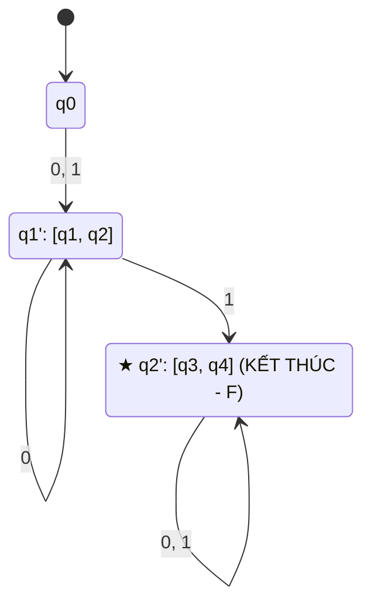

---

### Ví dụ 2.3a: Lần vết giải thuật Optimize states trên DFA 5 trạng thái
*(Slide trang 3 - 5, đối chiếu `kk_8.jpg`)*

#### 1. Khai báo Otomat ban đầu:
- DFA có `Q = {q0, q1, q2, q3, q4}`, `Σ = {a, b}`, khởi đầu `q0`.
- **Tập trạng thái kết thúc: F = {★ q4}**.

#### 2. Bài làm mẫu chuẩn:

```text
Bước 1: Lập bảng tam giác gồm 10 ô cho các cặp (qi, qj).

Bước 2: Xét các cặp chứa q4 ∈ F và qi ∉ F:
  (q4, q0), (q4, q1), (q4, q2), (q4, q3) đều phân biệt được vì chứa q4 ∈ F.
  Đánh dấu X vào 4 ô này trên bảng.

Bước 3: Xét các cặp chưa được đánh dấu X:
  * (q3, q0): δ(q3, b) = q4 ∈ F, δ(q0, b) = q2 ∉ F => (q3, q0) phân biệt được.
  * (q3, q1): δ(q3, b) = q4 ∈ F, δ(q1, b) = q3 ∉ F => (q3, q1) phân biệt được.
  * (q3, q2): δ(q3, b) = q4 ∈ F, δ(q2, b) = q2 ∉ F => (q3, q2) phân biệt được.
  Đánh dấu X vào 3 ô này.

  Lặp lại cho các cặp còn lại:
  * (q1, q0): δ(q1, b) = q3, δ(q0, b) = q2 mà cặp (q3, q2) đã bị đánh dấu X 
              => (q1, q0) phân biệt được (đánh dấu X).
  * (q2, q1): δ(q2, b) = q2, δ(q1, b) = q3 mà cặp (q3, q2) đã bị đánh dấu X 
              => (q2, q1) phân biệt được (đánh dấu X).
  * (q2, q0): δ(q2, a) = q1, δ(q0, a) = q1; δ(q2, b) = q2, δ(q0, b) = q2
              => Cặp (q2, q0) không bao giờ bị đánh dấu X.

Bước 4: Tổ hợp lại: gộp (q2, q0) thành 1 trạng thái {q0, q2}.
DFA tối thiểu gồm 4 trạng thái: {q0, q2}, {q1}, {q3}, ★ {q4} (F).
```

#### 3. Bảng chuyển dịch DFA tối thiểu:

| Trạng thái | Đọc a | Đọc b | Thuộc F? (Trạng thái kết thúc) |
| :---: | :---: | :---: | :---: |
| → {q0, q2} | {q1} | {q0, q2} | Không |
| {q1} | {q1} | {q3} | Không |
| {q3} | {q1} | {q4} | Không |
| **★ {q4}** | {q4} | {q4} | **CÓ (TRẠNG THÁI KẾT THÚC DUY NHẤT - F)** |

#### 4. Đồ thị DFA tối thiểu:

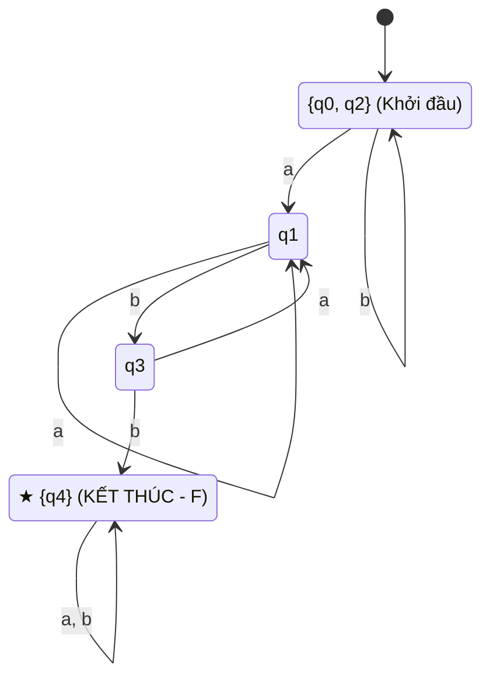

---

### Ví dụ 2.3b: Rút gọn DFA 6 trạng thái về 3 trạng thái
*(Slide trang 5 - 6, đối chiếu `kk_7.jpg`)*

#### 1. Khai báo Otomat ban đầu:
- DFA có 6 trạng thái `Q = {q1, q2, q3, q4, q5, q6}`, khởi đầu `q6`.
- **Tập trạng thái kết thúc: F = {★ q3, ★ q4, ★ q5}**.

#### 2. Bài làm mẫu chuẩn:

```text
Bước 1 & 2: Lập bảng tam giác 15 ô. 
  Đánh dấu X vào các ô chứa 1 trạng thái thuộc F = {q3, q4, q5} 
  và 1 trạng thái không thuộc F = {q1, q2, q6}.

Bước 3: Lần vết các ô trống:
  * δ(q6, 1) = q6, δ(q1, 1) = q3 mà ô (q6, q3) đã có X => Đánh dấu X vào ô (q6, q1).
  * δ(q6, 0) = q6, δ(q2, 0) = q1 mà ô (q6, q1) vừa có X => Đánh dấu X vào ô (q6, q2).

Bước 4: Sau khi dừng, các ô trống không bị đánh dấu là:
  {q1, q2}, {q3, q4}, {q3, q5}, {q4, q5}.
  Tổ hợp {q3, q4, q5} thành 1 trạng thái kết thúc ★ [q3, q4, q5] ∈ F, {q1, q2} thành 1 trạng thái.
  DFA tối thiểu chỉ có 3 trạng thái: {q6} (khởi đầu), {q1, q2}, ★ [q3, q4, q5] (F).
```

#### 3. Bảng chuyển dịch DFA tối thiểu:

| Trạng thái | Đọc 0 | Đọc 1 | Thuộc F? (Trạng thái kết thúc) |
| :---: | :---: | :---: | :---: |
| → {q6} | {q1, q2} | {q1, q2} | Không |
| {q1, q2} | {q1, q2} | [q3, q4, q5] | Không |
| **★ [q3, q4, q5]** | [q3, q4, q5] | [q3, q4, q5] | **CÓ (TRẠNG THÁI KẾT THÚC - F)** |

#### 4. Đồ thị DFA tối thiểu:

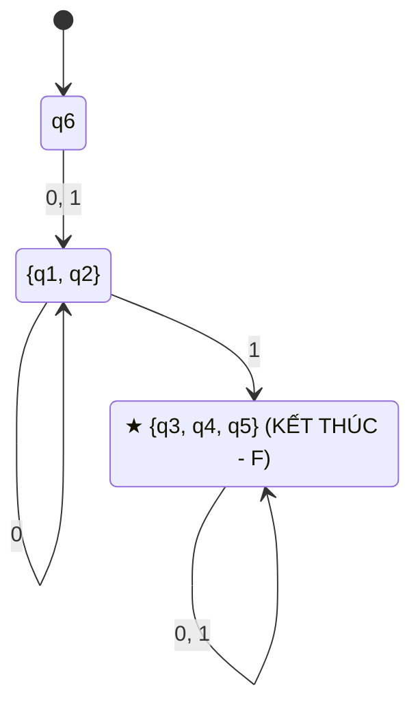

---

### Ví dụ 2.4: Mẫu trả lời câu hỏi "DFA đã tối thiểu chưa? Tại sao?"
*(Slide trang 6 - 7)*

#### 1. Khai báo Otomat ban đầu:
- DFA có 3 trạng thái `Q = {q1, q2, q3}`, khởi đầu `q1`.
- **Tập trạng thái kết thúc: F = {★ q2}**.

#### 2. Bài làm mẫu chuẩn đi thi:

```text
BÀI LÀM:

Xét tính phân biệt của từng cặp trạng thái:
- Xét cặp (q1, q2): δ(q1, 0) = q1 ∉ F, trong khi δ(q2, 0) = q2 ∈ F 
  => q1 và q2 phân biệt được bởi chuỗi 0.
- Xét cặp (q1, q3): δ(q1, 1) = q2 ∈ F, trong khi δ(q3, 1) = q3 ∉ F 
  => q1 và q3 phân biệt được bởi chuỗi 1.
- Xét cặp (q2, q3): δ(q2, 0) = q2 ∈ F, trong khi δ(q3, 0) = q3 ∉ F 
  => q2 và q3 phân biệt được bởi chuỗi 0.

KẾT LUẬN: Vì tất cả các cặp trạng thái của DFA đều phân biệt được, do đó DFA này ĐÃ TỐI THIỂU TRẠNG THÁI.
```

#### 3. Bảng chuyển dịch DFA tối thiểu:

| Trạng thái | Đọc 0 | Đọc 1 | Thuộc F? (Trạng thái kết thúc) |
| :---: | :---: | :---: | :---: |
| → q1 | q1 | q2 | Không |
| **★ q2** | q2 | q3 | **CÓ (TRẠNG THÁI KẾT THÚC DUY NHẤT - F)** |
| q3 | q3 | q3 | Không |

#### 4. Đồ thị DFA tối thiểu:

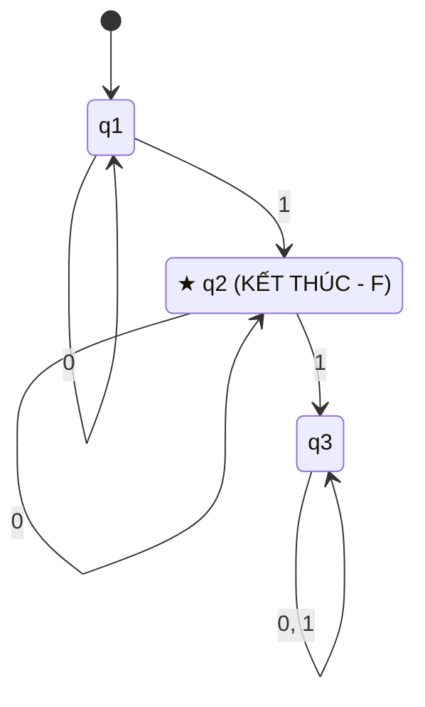

---

# 5. PHẦN D: LỜI GIẢI CHI TIẾT 3 BÀI TẬP LỚN (TRANG 7 SLIDE - CHUẨN BÀI THI `kk_6` ĐẾN `kk_9`)

---

### Bài tập 1 - Hình a: Tối thiểu hóa DFA 8 trạng thái (Đối chiếu `kk_6.jpg`)

#### A. Ảnh đề bài đã gán nhãn q0 → q7:
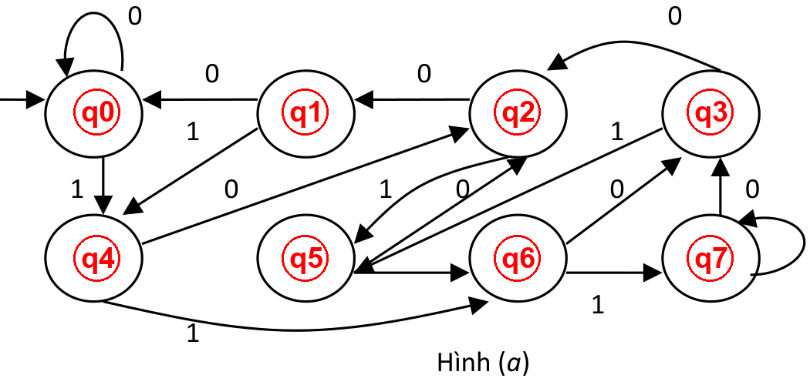

#### B. Bài làm chuẩn đi thi:

```text
BÀI LÀM:

Ta gán nhãn các trạng thái của DFA trong Hình (a) như hình vẽ:
- Tập trạng thái: Q = {q0, q1, q2, q3, q4, q5, q6, q7}.
- Bảng chữ cái: Σ = {0, 1}.
- Trạng thái bắt đầu: q0.
- Tập trạng thái kết thúc: F = {★ q7} (Chỉ có q7 là trạng thái kết thúc duy nhất ★).

Bảng chuyển trạng thái ban đầu của DFA:
  δ(q0, 0) = q0, δ(q0, 1) = q4
  δ(q1, 0) = q0, δ(q1, 1) = q4
  δ(q2, 0) = q1, δ(q2, 1) = q5
  δ(q3, 0) = q2, δ(q3, 1) = q5
  δ(q4, 0) = q2, δ(q4, 1) = q6
  δ(q5, 0) = q2, δ(q5, 1) = q6
  δ(q6, 0) = q3, δ(q6, 1) = q7
  * δ(q7, 0) = q7, δ(q7, 1) = q3   (★ F)

Bước 0: Từ q0 có thể đi đến tất cả 8 trạng thái. Không có trạng thái cô lập.

Bước 1 & 2: Lập bảng tam giác C(8,2) = 28 ô.
Đánh dấu X vào tất cả các ô chứa q7 ∈ F với các trạng thái non-final.

Bước 3: Xét các cặp chưa đánh dấu:
  * Xét (q1, q0): δ(q1, 0) = q0, δ(q0, 0) = q0 (trùng); δ(q1, 1) = q4, δ(q0, 1) = q4 (trùng).
    => Cặp (q1, q0) không bao giờ bị đánh dấu X => q0 ≡ q1.
  * Xét (q5, q4): δ(q5, 0) = q2, δ(q4, 0) = q2 (trùng); δ(q5, 1) = q6, δ(q4, 1) = q6 (trùng).
    => Cặp (q5, q4) không bao giờ bị đánh dấu X => q4 ≡ q5.
  * Tất cả các cặp khác đều bị đánh dấu X qua các bước lan truyền.

Bước 4: Ta gộp (q1, q0) thành [q0, q1] và (q5, q4) thành [q4, q5].
Tổ hợp lại các trạng thái của DFA tối thiểu (gồm 6 trạng thái):
  [q0, q1] (Khởi đầu), [q4, q5], [q2], [q3], [q6], ★ [q7] (F).
```

#### C. Bảng hàm chuyển DFA tối thiểu:

| Trạng thái | Đọc 0 | Đọc 1 | Thuộc F? (Trạng thái kết thúc) |
| :---: | :---: | :---: | :---: |
| → [q0, q1] | [q0, q1] | [q4, q5] | Không |
| [q4, q5] | [q2] | [q6] | Không |
| [q2] | [q0, q1] | [q4, q5] | Không |
| [q3] | [q2] | [q4, q5] | Không |
| [q6] | [q3] | [q7] | Không |
| **★ [q7]** | [q7] | [q3] | **CÓ (TRẠNG THÁI KẾT THÚC DUY NHẤT - F)** |

#### D. Đồ thị DFA tối thiểu hoàn chỉnh:

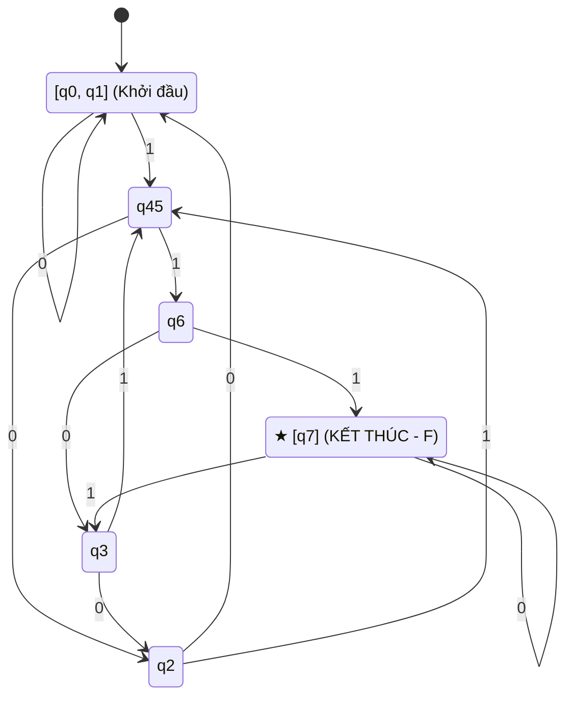

---

### Bài tập 1 - Hình b: Tối thiểu hóa DFA 7 trạng thái (Đối chiếu `kk_6.jpg`)

#### A. Ảnh đề bài đã gán nhãn q0 → q6:
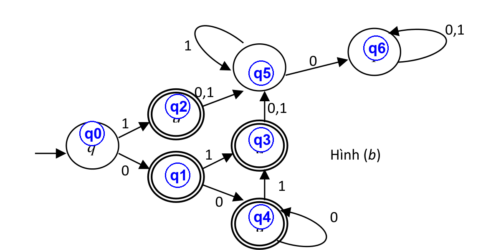

#### B. Bài làm chuẩn đi thi:

```text
BÀI LÀM:

Ta gán nhãn các trạng thái cho DFA trong Hình (b):
- Q = {q0, q1, q2, q3, q4, q5, q6}.
- Bảng chữ cái: Σ = {0, 1}.
- Trạng thái bắt đầu: q0.
- Tập trạng thái kết thúc F có 4 trạng thái: F = {★ q1, ★ q2, ★ q3, ★ q4} (đều có vòng tròn đôi ★).

Bước 0: Tất cả trạng thái đều đến được từ q0.

Bước 1 & 2: Lập bảng tam giác C(7,2) = 21 ô.
Đánh dấu X vào mọi ô ghép giữa 1 trạng thái ∈ F và 1 trạng thái ∉ F = {q0, q5, q6}.

Bước 3: Lần vết các ô trống:
  * Cặp (q3, q2): δ(q3, 0) = q5, δ(q2, 0) = q5; δ(q3, 1) = q5, δ(q2, 1) = q5.
    => (q3, q2) không bị đánh dấu X => q2 ≡ q3.
  * Cặp (q4, q1): δ(q4, 0) = q4, δ(q1, 0) = q4; δ(q4, 1) = q3, δ(q1, 1) = q3.
    => (q4, q1) không bị đánh dấu X => q1 ≡ q4.
  * Cặp (q6, q5): Mọi chuỗi vào q5, q6 đều không bao giờ dẫn tới F.
    => (q6, q5) không bị đánh dấu X => q5 ≡ q6 = [qtrap].

Bước 4: Ta thu được 4 trạng thái sau khi gộp:
  [q0] (Khởi đầu), ★ [q1, q4] ∈ F, ★ [q2, q3] ∈ F, [qtrap] (Bẫy bẫy chết)
```

#### C. Bảng hàm chuyển DFA tối thiểu:

| Trạng thái | Đọc 0 | Đọc 1 | Thuộc F? (Trạng thái kết thúc) |
| :---: | :---: | :---: | :---: |
| → [q0] | [q1, q4] | [q2, q3] | Không |
| **★ [q1, q4]** | [q1, q4] | [q2, q3] | **CÓ (TRẠNG THÁI KẾT THÚC - F)** |
| **★ [q2, q3]** | [qtrap] | [qtrap] | **CÓ (TRẠNG THÁI KẾT THÚC - F)** |
| [qtrap] | [qtrap] | [qtrap] | Không |

#### D. Đồ thị DFA tối thiểu hoàn chỉnh:

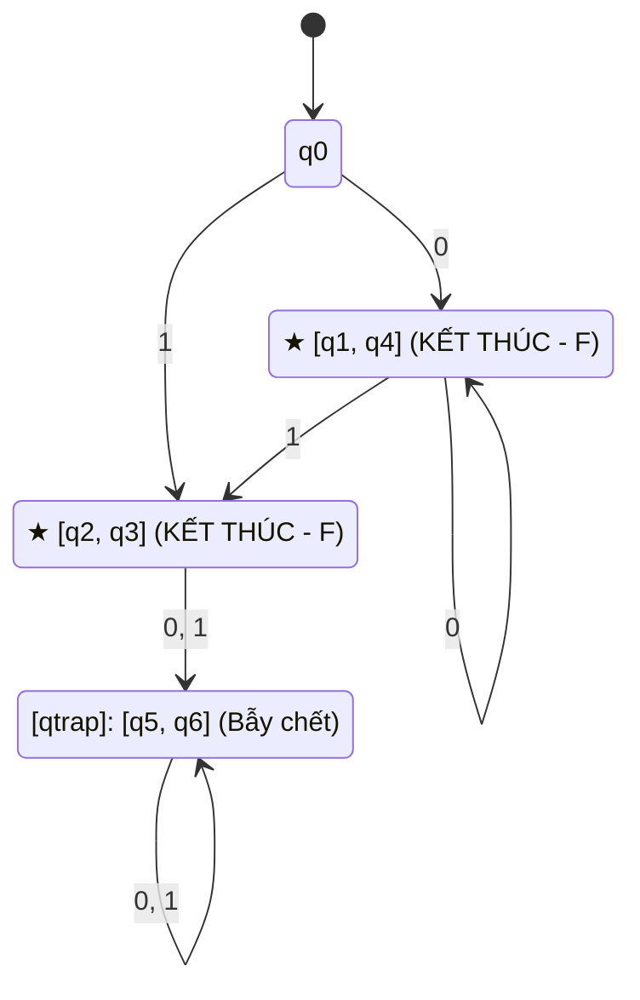

---

### Bài tập 2: NFA → DFA → Tối thiểu hóa (Ngôn ngữ L = a* b* c* - Đối chiếu `kk_9.jpg`)

#### A. Ảnh đề bài đã gán nhãn q0, q1, q2:
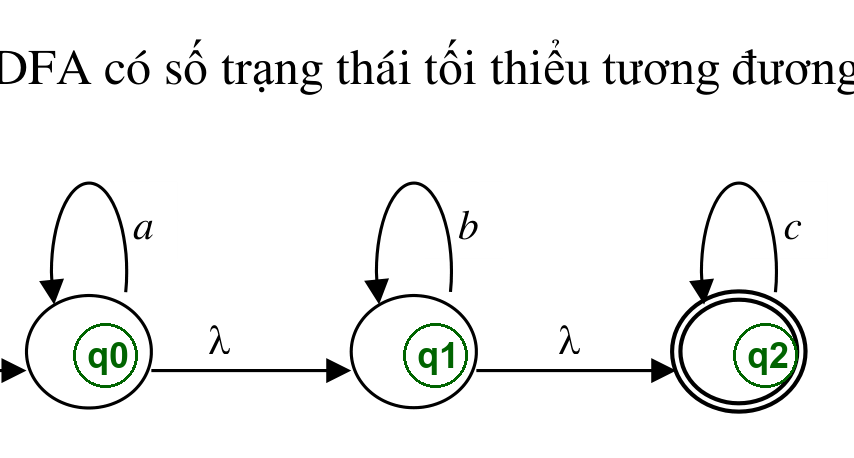

#### B. Bài làm chuẩn đi thi:

```text
BÀI LÀM:

GIAI ĐOẠN 1: CHUYỂN NFA SANG DFA

NFA ban đầu có trạng thái kết thúc duy nhất FN = {★ q2}.

Bước 1: Đỉnh khởi đầu của DFA là S0 = λ-closure(q0) = {q0, q1, q2}.
Vì S0 chứa q2 ∈ FN nên S0 là trạng thái kết thúc (★ S0 ∈ FD).

Bước 2: Các bước chuyển dịch δ*:
  Từ S0 = {q0, q1, q2}:
    δ*(S0, a) = λ-closure({q0}) = {q0, q1, q2} = S0
    δ*(S0, b) = λ-closure({q1}) = {q1, q2} = S1 (chứa q2 => ★ S1 ∈ FD)
    δ*(S0, c) = λ-closure({q2}) = {q2} = S2 (chứa q2 => ★ S2 ∈ FD)

  Từ S1 = {q1, q2}:
    δ*(S1, a) = ∅ = Strap
    δ*(S1, b) = {q1, q2} = S1
    δ*(S1, c) = {q2} = S2

  Từ S2 = {q2}:
    δ*(S2, a) = ∅ = Strap; δ*(S2, b) = ∅ = Strap; δ*(S2, c) = {q2} = S2

  Từ Strap = ∅:
    δ*(Strap, a) = Strap; δ*(Strap, b) = Strap; δ*(Strap, c) = Strap

GIAI ĐOẠN 2: TỐI THIỂU HÓA DFA VỪA TÌM ĐƯỢC

- Strap ∉ FD phân biệt với S0, S1, S2 ∈ FD bởi chuỗi λ.
- Cặp (S0, S1): δ*(S0, a) = S0 ∈ FD, δ*(S1, a) = Strap ∉ FD => S0, S1 phân biệt bởi chuỗi a.
- Cặp (S1, S2): δ*(S1, b) = S1 ∈ FD, δ*(S2, b) = Strap ∉ FD => S1, S2 phân biệt bởi chuỗi b.
- Cặp (S0, S2): δ*(S0, a) = S0 ∈ FD, δ*(S2, a) = Strap ∉ FD => S0, S2 phân biệt bởi chuỗi a.

KẾT LUẬN: DFA thu được đã tối thiểu với đúng 4 trạng thái: ★ S0, ★ S1, ★ S2, Strap.
```

#### C. Bảng hàm chuyển DFA tối thiểu:

| Trạng thái DFA | Đọc a | Đọc b | Đọc c | Thuộc FD? (Trạng thái kết thúc) |
| :---: | :---: | :---: | :---: | :---: |
| **→ ★ S0 = {q0, q1, q2}** | S0 | S1 | S2 | **CÓ (TRẠNG THÁI KẾT THÚC - F)** |
| **★ S1 = {q1, q2}** | Strap | S1 | S2 | **CÓ (TRẠNG THÁI KẾT THÚC - F)** |
| **★ S2 = {q2}** | Strap | Strap | S2 | **CÓ (TRẠNG THÁI KẾT THÚC - F)** |
| Strap = ∅ | Strap | Strap | Strap | Không |

#### D. Đồ thị DFA tối thiểu:

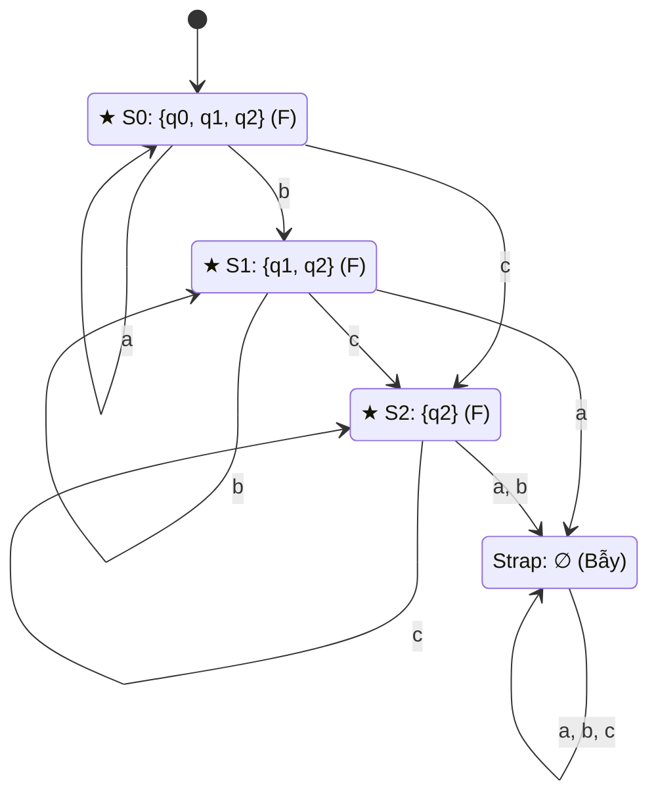

---

### Bài tập 3: Thiết kế DFA tối thiểu cho các ngôn ngữ hình thức

#### 1. Câu a: L = { a^n b^m | n ≥ 2, m ≥ 1 } trên Σ = {a, b}

**Bài làm chuẩn đi thi:**

```text
BÀI LÀM:

Xây dựng DFA M = (Q, Σ, δ, q0, F) gồm 5 trạng thái:
- q0: Bắt đầu (chưa đọc ký tự nào).
- q1: Đã đọc được 1 chữ a.
- q2: Đã đọc được ≥ 2 chữ a.
- ★ q3 ∈ F: Đã đọc được ≥ 2 chữ a và ≥ 1 chữ b (Trạng thái kết thúc duy nhất).
- qtrap: Trạng thái bẫy chết khi vi phạm quy tắc.

Bảng chuyển trạng thái:
  δ(q0, a) = q1;     δ(q0, b) = qtrap
  δ(q1, a) = q2;     δ(q1, b) = qtrap
  δ(q2, a) = q2;     δ(q2, b) = q3
* δ(q3, a) = qtrap;  δ(q3, b) = q3   (★ F)
  δ(qtrap, a) = qtrap; δ(qtrap, b) = qtrap

Chứng minh DFA này tối thiểu:
- q3 ∈ F phân biệt với {q0, q1, q2, qtrap} ∉ F bởi chuỗi λ.
- (q0, qtrap) phân biệt bởi chuỗi aab.
- (q1, qtrap) phân biệt bởi chuỗi ab.
- (q2, qtrap) phân biệt bởi chuỗi b.
- (q0, q1) phân biệt bởi chuỗi ab (δ*(q0, ab) = qtrap, δ*(q1, ab) = q3 ∈ F).
- (q0, q2) phân biệt bởi chuỗi b (δ*(q0, b) = qtrap, δ*(q2, b) = q3 ∈ F).
- (q1, q2) phân biệt bởi chuỗi b (δ*(q1, b) = qtrap, δ*(q2, b) = q3 ∈ F).
=> DFA tối thiểu có đúng 5 trạng thái.
```

**Bảng hàm chuyển DFA:**

| Trạng thái | Đọc a | Đọc b | Thuộc F? (Trạng thái kết thúc) |
| :---: | :---: | :---: | :---: |
| → q0 | q1 | qtrap | Không |
| q1 | q2 | qtrap | Không |
| q2 | q2 | q3 | Không |
| **★ q3** | qtrap | q3 | **CÓ (TRẠNG THÁI KẾT THÚC DUY NHẤT - F)** |
| qtrap | qtrap | qtrap | Không |

**Đồ thị DFA tối thiểu:**

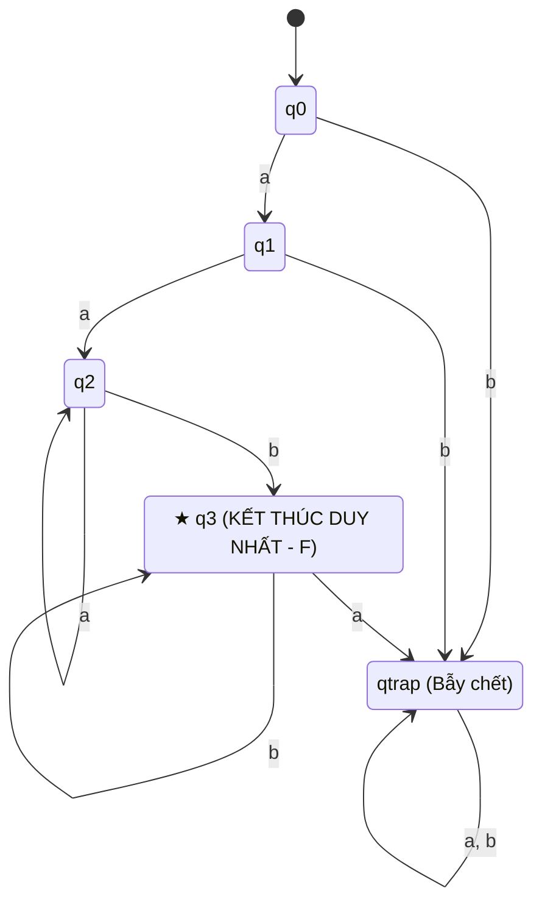

---

#### 2. Câu b: L = { a^n b | n ≥ 0 } ∪ { b^n a | n ≥ 1 } trên Σ = {a, b}

**Bài làm chuẩn đi thi:**

```text
BÀI LÀM:

Xây dựng DFA M = (Q, Σ, δ, q0, F) gồm 6 trạng thái:
- q0: Bắt đầu (chuỗi rỗng λ).
- q1: Nhánh a+ (đã đọc ≥ 1 chữ a).
- ★ q2 ∈ F: Đã đọc đúng 1 chữ b từ đầu (chấp nhận chuỗi "b").
- ★ q3 ∈ F: Đã hoàn tất chuỗi hợp lệ (kết thúc bởi b ở nhánh a+ hoặc kết thúc bởi a ở nhánh b+).
- q4: Nhánh b≥2 (chờ chữ a kết thúc).
- qtrap: Trạng thái bẫy khi thừa ký tự.

Bảng chuyển trạng thái:
  δ(q0, a) = q1;     δ(q0, b) = q2
  δ(q1, a) = q1;     δ(q1, b) = q3
* δ(q2, a) = q3;     δ(q2, b) = q4    (★ F)
* δ(q3, a) = qtrap;  δ(q3, b) = qtrap (★ F)
  δ(q4, a) = q3;     δ(q4, b) = q4
  δ(qtrap, a) = qtrap; δ(qtrap, b) = qtrap

Chứng minh DFA tối thiểu:
- Xét 2 trạng thái kết thúc {q2, q3}: δ(q2, a) = q3 ∈ F, δ(q3, a) = qtrap ∉ F 
  => q2 và q3 phân biệt được bởi chuỗi a.
- Các cặp không kết thúc {q0, q1, q4, qtrap} đều phân biệt được qua các chuỗi thử.
=> DFA tối thiểu có đúng 6 trạng thái.
```

**Bảng hàm chuyển DFA:**

| Trạng thái | Đọc a | Đọc b | Thuộc F? (Trạng thái kết thúc) |
| :---: | :---: | :---: | :---: |
| → q0 | q1 | q2 | Không |
| q1 | q1 | q3 | Không |
| **★ q2** | q3 | q4 | **CÓ (TRẠNG THÁI KẾT THÚC - F)** |
| **★ q3** | qtrap | qtrap | **CÓ (TRẠNG THÁI KẾT THÚC - F)** |
| q4 | q3 | q4 | Không |
| qtrap | qtrap | qtrap | Không |

**Đồ thị DFA tối thiểu:**

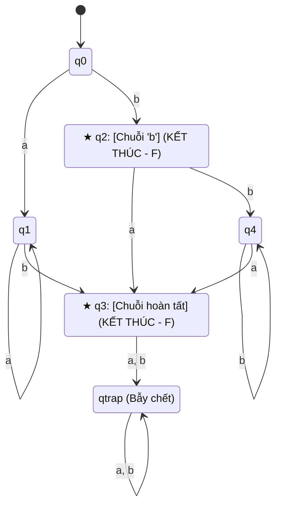

---

# 6. PHẦN E: CHECKLIST ĐIỂM 10 CHO DẠNG BÀI DFA MINIMIZATION

```text
┌────────────────────────────────────────────────────────────────────────┐
│ BẢNG CHECKLIST BÀI THI TỐI THIỂU HÓA DFA                               │
├────────────────────────────────────────────────────────────────────────┤
│ [ ] 1. Bước 0: Kiểm tra và loại bỏ ngay các trạng thái không đến được. │
│ [ ] 2. Bước 1: Tính số ô bảng tam giác C(n, 2) = n(n-1)/2.             │
│ [ ] 3. Bước 2: Đánh dấu X vào tất cả cặp phân biệt rõ rệt (qi∈F, qj∉F).│
│ [ ] 4. Bước 3: Lần vết chuyển dịch δ(qi, a) và δ(qj, a) cho ô trống.   │
│ [ ] 5. Bước 4: Gộp các cặp ô trống thành 1 trạng thái mới tương đương. │
│ [ ] 6. Vẽ lại đồ thị DFA tối thiểu: Trạng thái kết thúc vẽ 2 VÒNG TRÒN.│
└────────────────────────────────────────────────────────────────────────┘
```
