# CẨM NANG TOÀN DIỆN CHƯƠNG 5-6: CHUYỂN ĐỔI NFA SANG DFA & TỐI THIỂU HÓA TRẠNG THÁI DFA
> **Tài liệu học tập & ôn thi chuẩn theo 2 giáo trình:**
> 1. `chuyển đổi NFA _DFA_SV.pdf`
> 2. `TỐI THIỂU CÁC TRẠNG THÁI CỦA DFA SV.pdf`  
> **Môn học:** Lý thuyết Otomat và Ngôn ngữ hình thức (IUH)

---

# MỤC LỤC
- [A. GIẢI THÍCH TRỌNG TÂM: NGUỒN GỐC CỦA BẢNG TAM GIÁC (CÁC Ô $(q_i, q_j)$ Ở ĐÂU RA?)](#a-giải-thích-trọng-tâm-nguồn-gốc-của-bảng-tam-giác-các-ô-qi-qj-ở-đâu-ra)
- [B. CHUYÊN ĐỀ 1: CHUYỂN ĐỔI NFA SANG DFA (THỦ TỤC NFA-TO-DFA)](#b-chuyên-đề-1-chuyển-đổi-nfa-sang-dfa-thủ-tục-nfa-to-dfa)
  - [1. Lý thuyết cốt lõi & Thủ tục NFA-to-DFA chuẩn 4 bước](#1-lý-thuyết-cốt-lõi--thủ-tục-nfa-to-dfa-chuẩn-4-bước)
  - [2. Chi tiết 3 Ví dụ kinh điển trong Slide](#2-chi-tiết-3-ví-dụ-kinh-điển-trong-slide)
    - [Ví dụ 1: NFA có $\lambda$-transition $\to$ DFA có trạng thái bẫy $\emptyset$](#ví-dụ-1-nfa-có-lambda-transition-to-dfa-có-trạng-thái-bẫy-emptyset)
    - [Ví dụ 2: NFA sang DFA đầy đủ trên $\Sigma = \{0, 1\}$](#ví-dụ-2-nfa-sang-dfa-đầy-đủ-trên-sigma--0-1)
    - [Ví dụ 3: NFA có $\lambda$-closure bắt đầu phức tạp $\{q_0, q_3, q_4\}$](#ví-dụ-3-nfa-có-lambda-closure-bắt-đầu-phức-tạp-q_0-q_3-q_4)
  - [3. Lời giải chi tiết 5 Bài tập chuyển đổi NFA $\to$ DFA (Trang 5)](#3-lời-giải-chi-tiết-5-bài-tập-chuyển-đổi-nfa-to-dfa-trang-5)
    - [Bài tập 1](#bài-tập-1-nfa-3-trạng-thái-với-chu trình-0-1)
    - [Bài tập 2](#bài-tập-2-nfa-2-trạng-thái)
    - [Bài tập 3](#bài-tập-3-nfa-đoán-nhận-chuỗi-kết-thúc-bởi-bb)
    - [Bài tập 4](#bài-tập-4-nfa-3-trạng-thái-nhiều-nhánh)
    - [Bài tập 5](#bài-tập-5-nfa-chọn-lựa-nhánh)
- [C. CHUYÊN ĐỀ 2: TỐI THIỂU HÓA TRẠNG THÁI DFA (OPTIMIZE STATES)](#c-chuyên-đề-2-tối-thiểu-hóa-trạng-thái-dfa-optimize-states)
  - [1. Bản chất phân biệt được vs không phân biệt được](#1-bản-chất-phân-biệt-được-vs-không-phân-biệt-được)
  - [2. Quy trình thuật toán Điền bảng chuẩn](#2-quy-trình-thuật-toán-điền-bảng-chuẩn)
  - [3. Chi tiết 4 Ví dụ trong Slide](#3-chi-tiết-4-ví-dụ-trong-slide)
    - [Ví dụ 2.2: Loại bỏ trạng thái cô lập $q_5$ & gộp nhánh đối xứng](#ví-dụ-22-loại-bỏ-trạng-thái-cô-lập-q_5--gộp-nhánh-đối-xứng)
    - [Ví dụ 2.3a: Lần vết từng ô trên bảng tam giác 5 trạng thái](#ví-dụ-23a-lần-vết-từng-ô-trên-bảng-tam-giác-5-trạng-thái)
    - [Ví dụ 2.3b: Rút gọn DFA 6 trạng thái về 3 trạng thái](#ví-dụ-23b-rút-gọn-dfa-6-trạng-thái-về-3-trạng-thái)
    - [Ví dụ 2.4: Mẫu trả lời câu hỏi "DFA đã tối thiểu chưa? Tại sao?"](#ví-dụ-24-mẫu-trả-lời-câu-hỏi-dfa-đã-tối-thiểu-chưa-tại-sao)
  - [4. Lời giải chi tiết 3 Bài tập lớn (Trang 7)](#4-lời-giải-chi-tiết-3-bài-tập-lớn-trang-7)
    - [Bài tập 1: Tối thiểu hóa DFA Hình (a) và Hình (b)](#bài-tập-1-tối-thiểu-hóa-dfa-hình-a-và-hình-b)
    - [Bài tập 2: NFA $\to$ DFA $\to$ Tối thiểu hóa ($L = a^* b^* c^*$)](#bài-tập-2-nfa-to-dfa-to-tối-thiểu-hóa-l--a-b-c)
    - [Bài tập 3: Thiết kế DFA tối thiểu cho 2 ngôn ngữ hình thức](#bài-tập-3-thiết-kế-dfa-tối-thiểu-cho-2-ngôn-ngữ-hình-thức)
- [D. CHECKLIST & BÍ QUYẾT ĐẠT ĐIỂM 10 KHI ĐI THI](#d-checklist--bí-quyết-đạt-điểm-10-khi-đi-thi)

---

# A. GIẢI THÍCH TRỌNG TÂM: NGUỒN GỐC CỦA BẢNG TAM GIÁC (CÁC Ô $(q_i, q_j)$ Ở ĐÂU RA?)

Rất nhiều bạn sinh viên khi đọc tài liệu thường thắc mắc:
> *"Tại sao Bước 1 lại liệt kê danh sách các ô: $(q_1, q_0), (q_2, q_0), (q_2, q_1), (q_3, q_0), (q_3, q_1), (q_3, q_2), (q_4, q_0), (q_4, q_1), (q_4, q_2), (q_4, q_3)$? Các ô này từ đâu sinh ra? Tại sao lại có hình tam giác?"*

Dưới đây là lời giải thích cặn kẽ và trực quan nhất:

### 1. Bản chất toán học: So sánh từng cặp trạng thái
- Mục tiêu của tối thiểu hóa DFA là tìm xem **trong các trạng thái của máy, có cặp nào giống hệt nhau về hành vi (tương đương nhau) để gộp lại hay không**.
- Muốn biết có gộp được hay không, ta bắt buộc phải **lấy từng cặp 2 trạng thái bất kỳ $(p, q)$ ra để so sánh**.
- Nếu một DFA có $n = 5$ trạng thái là $Q = \{q_0, q_1, q_2, q_3, q_4\}$, thì số cặp trạng thái khác nhau cần so sánh chính là **tổ hợp chập 2 của 5 phần tử**:
  $$C_5^2 = \frac{5 \times (5 - 1)}{2} = \frac{20}{2} = 10 \text{ cặp}$$

---

### 2. Từ Ma Trận Vuông $5 \times 5$ đến Bảng Tam Giác

Hãy xem ma trận vuông đầy đủ gồm 25 ô khi so sánh 5 trạng thái:

| | $q_0$ | $q_1$ | $q_2$ | $q_3$ | $q_4$ |
| :---: | :---: | :---: | :---: | :---: | :---: |
| **$q_0$** | $(q_0, q_0)$ | $(q_0, q_1)$ | $(q_0, q_2)$ | $(q_0, q_3)$ | $(q_0, q_4)$ |
| **$q_1$** | **$(q_1, q_0)$** | $(q_1, q_1)$ | $(q_1, q_2)$ | $(q_1, q_3)$ | $(q_1, q_4)$ |
| **$q_2$** | **$(q_2, q_0)$** | **$(q_2, q_1)$** | $(q_2, q_2)$ | $(q_2, q_3)$ | $(q_2, q_4)$ |
| **$q_3$** | **$(q_3, q_0)$** | **$(q_3, q_1)$** | **$(q_3, q_2)$** | $(q_3, q_3)$ | $(q_3, q_4)$ |
| **$q_4$** | **$(q_4, q_0)$** | **$(q_4, q_1)$** | **$(q_4, q_2)$** | **$(q_4, q_3)$** | $(q_4, q_4)$ |

Nhìn vào ma trận 25 ô trên, ta loại bỏ những ô thừa:
1. **Đường chéo chính $(q_i, q_i)$:** Gồm $(q_0, q_0), (q_1, q_1), (q_2, q_2), (q_3, q_3), (q_4, q_4)$.  
   👉 *Lý do loại:* Một trạng thái hiển nhiên luôn tương đương với chính nó, so sánh nó với chính mình là vô nghĩa!
2. **Nửa tam giác phía trên:** Gồm $(q_0, q_1), (q_0, q_2), \dots$  
   👉 *Lý do loại:* Vì quan hệ tương đương có tính đối xứng. So sánh cặp $(q_1, q_0)$ cũng chính là so sánh cặp $(q_0, q_1)$. Nếu giữ cả hai ta sẽ bị làm việc trùng lặp gấp đôi!

**KẾT QUẢ:** Ta chỉ cần giữ lại **NỬA DƯỚI ĐƯỜNG CHÉO CHÍNH** (các ô in đậm ở trên). Đó chính là **BẢNG TAM GIÁC** gồm đúng 10 ô:

```text
       q0      q1      q2      q3
    ┌───────┬───────┬───────┬───────┐
q1  │(q1,q0)│       │       │       │  <-- Hàng q1: có 1 ô
    ├───────┼───────┤       │       │
q2  │(q2,q0)│(q2,q1)│       │       │  <-- Hàng q2: có 2 ô
    ├───────┼───────┼───────┤       │
q3  │(q3,q0)│(q3,q1)│(q3,q2)│       │  <-- Hàng q3: có 3 ô
    ├───────┼───────┼───────┼───────┤
q4  │(q4,q0)│(q4,q1)│(q4,q2)│(q4,q3)│  <-- Hàng q4: có 4 ô
    └───────┴───────┴───────┴───────┘
    Tổng cộng: 1 + 2 + 3 + 4 = 10 ô cần xét!
```

---

### 3. Mẹo vẽ bảng tam giác trên giấy thi trong 5 giây
Khi đề bài cho một DFA có $n$ trạng thái:
1. **Cột dọc bên trái:** Viết từ $q_1$ đến $q_{n-1}$ (bỏ $q_0$).
2. **Hàng ngang bên dưới (hoặc trên):** Viết từ $q_0$ đến $q_{n-2}$ (bỏ trạng thái cuối cùng).
3. Giao điểm của mỗi hàng $q_i$ và cột $q_j$ với $i > j$ chính là cặp $(q_i, q_j)$ cần điền!

---

# B. CHUYÊN ĐỀ 1: CHUYỂN ĐỔI NFA SANG DFA (THỦ TỤC NFA-TO-DFA)

---

## 1. Lý thuyết cốt lõi & Thủ tục NFA-to-DFA chuẩn 4 bước

### Vì sao phải chuyển NFA sang DFA?
- **NFA (Không đơn định):** Rất dễ thiết kế bằng tay vì cho phép nhiều ngã rẽ và bước nhảy $\lambda$. Tuy nhiên, máy tính/vi điều khiển không thể chạy trực tiếp NFA vì không biết chọn nhánh nào.
- **DFA (Đơn định):** Tại mỗi trạng thái chỉ có duy nhất 1 chuyển dịch xác định cho mỗi ký hiệu đầu vào $\implies$ Cực kỳ dễ lập trình thành code (mảng bảng tra `table[state][char]` hoặc câu lệnh `switch-case`).
- **Định lý tương đương:** Mọi NFA đều có thể chuyển thành một DFA tương đương cùng đoán nhận một ngôn ngữ.

---

### BỐN BƯỚC CỦA THỦ TỤC NFA-TO-DFA (CHUẨN GIÁO TRÌNH)
*(Gọi $G_N$ là đồ thị của NFA, $G_D$ là đồ thị của DFA, $F_N$ là tập trạng thái kết thúc của NFA)*

```text
┌────────────────────────────────────────────────────────────────────────┐
│ BƯỚC 1: XÁC ĐỊNH ĐỈNH KHỞI ĐẦU CHO DFA                                 │
│ - Đỉnh khởi đầu của GD là tập các trạng thái mà NFA có thể đứng tại đó │
│   khi chưa đọc bất kỳ ký tự nào:                                       │
│   S0 = λ-closure(q0) = {q0, ...}                                       │
├────────────────────────────────────────────────────────────────────────┤
│ BƯỚC 2: XÂY DỰNG CÁC CHUYỂN DỊCH & THÊM ĐỈNH MỚI (LẶP ĐẾN KHI ĐỦ CẠNH) │
│ - Lấy một đỉnh bất kỳ {qi, qj, ..., qk} của GD chưa có đủ cạnh đi ra:  │
│   Với mỗi ký hiệu a ∈ Σ, tính:                                         │
│   δ*({qi, qj, ..., qk}, a) = δ*(qi, a) ∪ δ*(qj, a) ∪ ... ∪ δ*(qk, a)  │
│                            = {ql, qm, ..., qn}                         │
│ - Nếu tập {ql, qm, ..., qn} là tập mới -> Tạo đỉnh mới cho GD.         │
│ - Nối mũi tên có nhãn 'a' từ đỉnh cũ đến đỉnh mới.                     │
│ - ĐẶC BIỆT: Nếu tập kết quả là RỖNG (∅) -> Đây là TRẠNG THÁI BẪY (TRAP)│
│   Trong DFA: δ*(∅, a) = ∅ với mọi a ∈ Σ.                               │
│ - Lặp lại cho đến khi TẤT CẢ các đỉnh của GD đều có đủ cạnh đi ra.     │
├────────────────────────────────────────────────────────────────────────┤
│ BƯỚC 3: XÁC ĐỊNH TẬP TRẠNG THÁI KẾT THÚC CỦA DFA (FD)                 │
│ - Bất kỳ đỉnh nào trong GD mà nhãn của nó chứa ÍT NHẤT MỘT trạng thái  │
│   kết thúc của NFA (chứa qf ∈ FN) thì đỉnh đó là ĐỈNH KẾT THÚC của DFA.│
├────────────────────────────────────────────────────────────────────────┤
│ BƯỚC 4: KIỂM TRA ĐIỀU KIỆN CHUỖI RỖNG (λ)                              │
│ - Nếu NFA ban đầu chấp nhận chuỗi rỗng λ (tức q0 có thể tới FN bằng λ) │
│   thì đỉnh khởi đầu S0 của DFA cũng được coi là đỉnh kết thúc.         │
│ - Nếu không, S0 là đỉnh thường.                                        │
└────────────────────────────────────────────────────────────────────────┘
```

---

## 2. Chi tiết 3 Ví dụ kinh điển trong Slide

---

### VÍ DỤ 1: NFA có $\lambda$-transition $\to$ DFA có trạng thái bẫy $\emptyset$
*(Slide trang 1 - 2)*

#### 1. Đề bài:
NFA $G_N$ có 3 trạng thái $\{q_0, q_1, q_2\}$, bảng chữ cái $\Sigma = \{a, b\}$, trạng thái đầu $q_0$, kết thúc $F_N = \{q_1\}$.
- $q_0 \xrightarrow{a} q_1$
- $q_1 \xrightarrow{\lambda} q_2$
- $q_1 \xrightarrow{a} q_1$
- $q_1 \xrightarrow{b} q_0$
- $q_2 \xrightarrow{b} q_0$

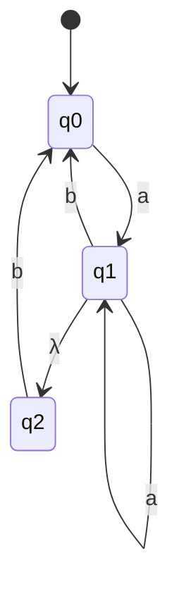

#### 2. Lời giải từng bước:
- **Bước 1:** Đỉnh khởi đầu của DFA là $\{q_0\}$ (vì từ $q_0$ chưa đọc gì và không có $\lambda$ đi ra).
- **Bước 2:** Lần lượt tìm chuyển dịch:
  1. Từ $\{q_0\}$:
     - Đọc $a$: $q_0 \xrightarrow{a} q_1$, từ $q_1$ nhảy $\lambda \to q_2 \implies \delta^*(q_0, a) = \{q_1, q_2\}$ (Đỉnh mới).
     - Đọc $b$: không có mũi tên $b$ từ $q_0 \implies \delta^*(q_0, b) = \emptyset$ (Trạng thái bẫy).
  2. Từ trạng thái bẫy $\emptyset$:
     - $\delta^*(\emptyset, a) = \emptyset, \quad \delta^*(\emptyset, b) = \emptyset$.
  3. Từ $\{q_1, q_2\}$:
     - Đọc $a$: $\delta^*(q_1, a) \cup \delta^*(q_2, a) = \{q_1, q_2\} \cup \emptyset = \{q_1, q_2\}$ (Tự lặp lại chính nó).
     - Đọc $b$: $\delta^*(q_1, b) \cup \delta^*(q_2, b) = \{q_0\} \cup \{q_0\} = \{q_0\}$.
- **Bước 3:** Vì trong NFA, $q_1 \in F_N$, nên đỉnh nào trong DFA chứa $q_1$ sẽ là trạng thái kết thúc $\implies$ Đỉnh $\{q_1, q_2\}$ là trạng thái kết thúc.
- **Bước 4:** NFA không chấp nhận chuỗi rỗng $\lambda \implies \{q_0\}$ không thuộc $F$.

#### Đồ thị DFA thu được:

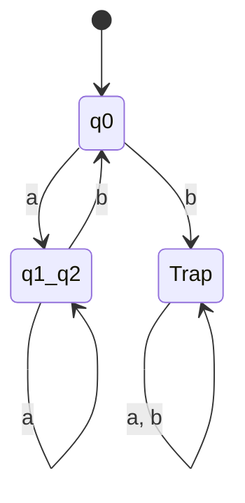

---

### VÍ DỤ 2: NFA sang DFA đầy đủ trên $\Sigma = \{0, 1\}$
*(Slide trang 2 - 4)*

#### 1. Đề bài:
NFA $G_N$ có 3 trạng thái $\{q_0, q_1, q_2\}$, $\Sigma = \{0, 1\}$, trạng thái đầu $q_0$, trạng thái kết thúc $F_N = \{q_1\}$.
- $q_0 \xrightarrow{0} q_0$, $q_0 \xrightarrow{0, 1} q_1$
- $q_1 \xrightarrow{0, 1} q_2$
- $q_2 \xrightarrow{1} q_2$

#### 2. Lời giải chi tiết:
- **Bước 1:** Đỉnh khởi đầu là $\{q_0\}$.
- **Bước 2:** Lập bảng tính toán $\delta^*$:
  1. $\delta^*(q_0, 0) = \{q_0, q_1\}$; $\quad \delta^*(q_0, 1) = \{q_1\}$.
  2. Xét đỉnh $\{q_0, q_1\}$:
     - Đọc 0: $\delta^*(q_0, 0) \cup \delta^*(q_1, 0) = \{q_0, q_1\} \cup \{q_2\} = \{q_0, q_1, q_2\}$.
     - Đọc 1: $\delta^*(q_0, 1) \cup \delta^*(q_1, 1) = \{q_1\} \cup \{q_2\} = \{q_1, q_2\}$.
  3. Xét đỉnh $\{q_1\}$:
     - Đọc 0: $\delta^*(q_1, 0) = \{q_2\}$.
     - Đọc 1: $\delta^*(q_1, 1) = \{q_2\}$.
  4. Xét đỉnh $\{q_0, q_1, q_2\}$:
     - Đọc 0: $\{q_0, q_1\} \cup \{q_2\} \cup \emptyset = \{q_0, q_1, q_2\}$.
     - Đọc 1: $\{q_1\} \cup \{q_2\} \cup \{q_2\} = \{q_1, q_2\}$.
  5. Xét đỉnh $\{q_1, q_2\}$:
     - Đọc 0: $\{q_2\} \cup \emptyset = \{q_2\}$.
     - Đọc 1: $\{q_2\} \cup \{q_2\} = \{q_2\}$.
  6. Xét đỉnh $\{q_2\}$:
     - Đọc 0: $\emptyset$ (vào bẫy $\emptyset$).
     - Đọc 1: $\{q_2\}$.
  7. Trạng thái bẫy $\emptyset$: đọc 0, 1 đều ở lại $\emptyset$.
- **Bước 3:** Tất cả các đỉnh chứa $q_1$ đều là trạng thái kết thúc:
  $$F_D = \{\{q_1\}, \{q_0, q_1\}, \{q_1, q_2\}, \{q_0, q_1, q_2\}\}$$

#### Bảng chuyển trạng thái của DFA:

| Trạng thái DFA | Nhãn ngắn | Đọc 0 | Đọc 1 | Thuộc $F_D$? |
| :---: | :---: | :---: | :---: | :---: |
| $\{q_0\}$ | $A$ | $\{q_0, q_1\}$ | $\{q_1\}$ | Không |
| $* \{q_0, q_1\}$ | $B$ | $\{q_0, q_1, q_2\}$ | $\{q_1, q_2\}$ | **CÓ** |
| $* \{q_1\}$ | $C$ | $\{q_2\}$ | $\{q_2\}$ | **CÓ** |
| $* \{q_0, q_1, q_2\}$ | $D$ | $\{q_0, q_1, q_2\}$ | $\{q_1, q_2\}$ | **CÓ** |
| $* \{q_1, q_2\}$ | $E$ | $\{q_2\}$ | $\{q_2\}$ | **CÓ** |
| $\{q_2\}$ | $G$ | $\emptyset$ | $\{q_2\}$ | Không |
| $\emptyset$ | $Trap$ | $\emptyset$ | $\emptyset$ | Không |

---

### VÍ DỤ 3: NFA có $\lambda$-closure bắt đầu phức tạp $\{q_0, q_3, q_4\}$
*(Slide trang 4 - 5)*

#### 1. Đề bài:
NFA có các trạng thái $\{q_0, q_1, q_2, q_3, q_4\}$, với các bước nhảy $\lambda$:
- $q_0 \xrightarrow{\lambda} q_3 \xrightarrow{\lambda} q_4$.
- Trạng thái kết thúc của NFA: $F_N = \{q_1, q_2\}$.

#### 2. Lời giải:
- **Bước 1:** Khi NFA chưa đọc ký hiệu nào, nó có thể đứng tại $q_0$, hoặc tự do đi $\lambda$ sang $q_3$, rồi từ $q_3$ sang $q_4$.
  $$\implies S_0 = \lambda\text{-closure}(q_0) = \{q_0, q_3, q_4\}$$
  Do đó đỉnh khởi đầu của DFA có nhãn là $\{q_0, q_3, q_4\}$.
- **Bước 2:** Lần vết các tập trạng thái:
  - $\delta^*(\{q_0, q_3, q_4\}, a) = \{q_1, q_2, q_4\}$
  - $\delta^*(\{q_0, q_3, q_4\}, b) = \{q_1, q_2, q_3, q_4\}$
  - $\delta^*(\{q_1, q_2, q_4\}, a) = \{q_0, q_1, q_2, q_3, q_4\}$
  - $\delta^*(\{q_1, q_2, q_4\}, b) = \{q_3, q_4\}$
  - $\delta^*(\{q_3, q_4\}, a) = \{q_4\}$
  - $\delta^*(\{q_3, q_4\}, b) = \{q_3, q_4\}$
  - $\delta^*(\{q_4\}, a) = \emptyset$ (Trạng thái bẫy)
  - $\delta^*(\{q_4\}, b) = \{q_3, q_4\}$
- **Bước 3 & Đổi tên nhãn:**
  Để sơ đồ dễ đọc, ta đặt lại tên các tập hợp:
  - $A = \{q_0, q_3, q_4\}$ (Khởi đầu)
  - $B = \{q_1, q_2, q_4\} \in F_D$
  - $C = \{q_1, q_2, q_3, q_4\} \in F_D$
  - $D = \{q_0, q_1, q_2, q_3, q_4\} \in F_D$
  - $E = \{q_3, q_4\}$
  - $G = \{q_4\}$
  - $\emptyset = Trap$

---

## 3. Lời giải chi tiết 5 Bài tập chuyển đổi NFA $\to$ DFA (Trang 5)

---

### BÀI TẬP 1: NFA 3 TRẠNG THÁI VỚI CHU TRÌNH 0, 1
- **Đồ thị NFA:**
  - $q_0$: Tự lặp 0; đọc 1 sang $q_1$.
  - $q_1$: Tự lặp 0, 1; đọc 0 sang $q_2$.
  - $q_2 \in F$: Tự lặp 0, 1; đọc 1 về $q_1$.
- **Bảng chữ cái:** $\Sigma = \{0, 1\}$. Trạng thái đầu: $q_0$. Trạng thái kết thúc: $F_N = \{q_2\}$.

#### Các bước chuyển đổi:
1. **Bước 1:** Đỉnh khởi đầu DFA: $S_0 = \{q_0\}$.
2. **Bước 2:** Tính các bước chuyển:
   - Từ $\{q_0\}$:
     - Đọc 0: $\{q_0\} = S_0$.
     - Đọc 1: $\{q_1\} = S_1$ (Đỉnh mới).
   - Từ $S_1 = \{q_1\}$:
     - Đọc 0: $\{q_1, q_2\} = S_2$ (Đỉnh mới, chứa $q_2 \in F_N \implies S_2 \in F_D$).
     - Đọc 1: $\{q_1\} = S_1$.
   - Từ $S_2 = \{q_1, q_2\}$:
     - Đọc 0: $\delta(q_1, 0) \cup \delta(q_2, 0) = \{q_1, q_2\} \cup \{q_2\} = \{q_1, q_2\} = S_2$.
     - Đọc 1: $\delta(q_1, 1) \cup \delta(q_2, 1) = \{q_1\} \cup \{q_1, q_2\} = \{q_1, q_2\} = S_2$.
3. **Bảng chuyển trạng thái DFA:**

| Trạng thái DFA | Tập con | Đọc 0 | Đọc 1 | Kết thúc? |
| :---: | :---: | :---: | :---: | :---: |
| $\to S_0$ | $\{q_0\}$ | $S_0$ | $S_1$ | Không |
| $S_1$ | $\{q_1\}$ | $S_2$ | $S_1$ | Không |
| $* S_2$ | $\{q_1, q_2\}$ | $S_2$ | $S_2$ | **CÓ** |

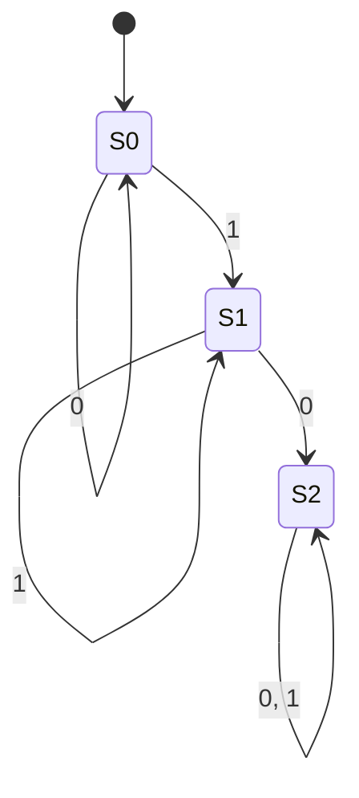

---

### BÀI TẬP 2: NFA 2 TRẠNG THÁI
- **Đồ thị NFA:**
  - $q_0$: Tự lặp 0; đọc 0, 1 sang $q_1$.
  - $q_1 \in F$: Tự lặp 1; đọc 1 về $q_0$.
- **Các bước chuyển đổi:**
  1. $S_0 = \{q_0\}$.
  2. Từ $S_0$:
     - Đọc 0: $\{q_0, q_1\} = S_1 \in F_D$ (vì chứa $q_1$).
     - Đọc 1: $\{q_1\} = S_2 \in F_D$.
  3. Từ $S_1 = \{q_0, q_1\}$:
     - Đọc 0: $\delta(q_0, 0) \cup \delta(q_1, 0) = \{q_0, q_1\} \cup \emptyset = S_1$.
     - Đọc 1: $\delta(q_0, 1) \cup \delta(q_1, 1) = \{q_1\} \cup \{q_0, q_1\} = S_1$.
  4. Từ $S_2 = \{q_1\}$:
     - Đọc 0: $\emptyset = Trap$.
     - Đọc 1: $\{q_0, q_1\} = S_1$.
  5. $Trap$: đọc 0, 1 ở lại $Trap$.

#### Bảng chuyển trạng thái DFA:

| Trạng thái DFA | Tập con | Đọc 0 | Đọc 1 | Kết thúc? |
| :---: | :---: | :---: | :---: | :---: |
| $\to S_0$ | $\{q_0\}$ | $S_1$ | $S_2$ | Không |
| $* S_1$ | $\{q_0, q_1\}$ | $S_1$ | $S_1$ | **CÓ** |
| $* S_2$ | $\{q_1\}$ | $Trap$ | $S_1$ | **CÓ** |
| $Trap$ | $\emptyset$ | $Trap$ | $Trap$ | Không |

---

### BÀI TẬP 3: NFA ĐOÁN NHẬN CHUỖI KẾT THÚC BỞI $bb$
- **Đồ thị NFA:**
  - $q_0$: Tự lặp $a, b$; đọc $b$ sang $q_1$.
  - $q_1$: Đọc $b$ sang $q_2 \in F$.
- **Các bước chuyển đổi:**
  1. $S_0 = \{q_0\}$.
  2. Từ $S_0$:
     - Đọc $a$: $\{q_0\} = S_0$.
     - Đọc $b$: $\{q_0, q_1\} = S_1$.
  3. Từ $S_1 = \{q_0, q_1\}$:
     - Đọc $a$: $\{q_0\} = S_0$.
     - Đọc $b$: $\{q_0, q_1\} \cup \{q_2\} = \{q_0, q_1, q_2\} = S_2 \in F_D$.
  4. Từ $S_2 = \{q_0, q_1, q_2\}$:
     - Đọc $a$: $\{q_0\} = S_0$.
     - Đọc $b$: $\{q_0, q_1\} \cup \{q_2\} = S_2$.

#### Đồ thị DFA thu được:

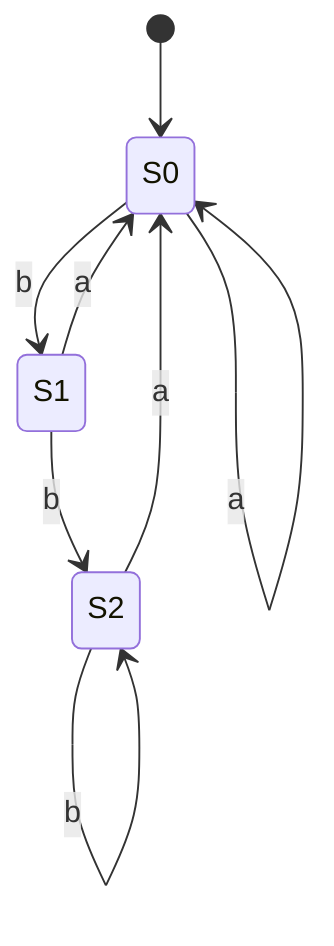

---

### BÀI TẬP 4: NFA 3 TRẠNG THÁI NHIỀU NHÁNH
- **Đồ thị NFA:**
  - $q_0$: Tự lặp 0; đọc 1 sang $q_1$; đọc 1 sang $q_2 \in F$.
  - $q_1$: Tự lặp 0; đọc 0, 1 sang $q_2$.
  - $q_2 \in F$: Đọc 0, 1 sang $q_1$; đọc 0 về $q_0$.
- **Các bước chuyển đổi:**
  1. $S_0 = \{q_0\}$.
  2. Từ $S_0$:
     - Đọc 0: $\{q_0\} = S_0$.
     - Đọc 1: $\{q_1, q_2\} = S_1 \in F_D$.
  3. Từ $S_1 = \{q_1, q_2\}$:
     - Đọc 0: $\delta(q_1, 0) \cup \delta(q_2, 0) = \{q_1, q_2\} \cup \{q_0, q_1\} = \{q_0, q_1, q_2\} = S_2 \in F_D$.
     - Đọc 1: $\delta(q_1, 1) \cup \delta(q_2, 1) = \{q_2\} \cup \{q_1\} = \{q_1, q_2\} = S_1$.
  4. Từ $S_2 = \{q_0, q_1, q_2\}$:
     - Đọc 0: $\delta(q_0, 0) \cup \delta(q_1, 0) \cup \delta(q_2, 0) = \{q_0\} \cup \{q_1, q_2\} \cup \{q_0, q_1\} = \{q_0, q_1, q_2\} = S_2$.
     - Đọc 1: $\delta(q_0, 1) \cup \delta(q_1, 1) \cup \delta(q_2, 1) = \{q_1, q_2\} \cup \{q_2\} \cup \{q_1\} = \{q_1, q_2\} = S_1$.

#### DFA thu được chỉ gồm đúng 3 trạng thái:
- $S_0 = \{q_0\}$ (Bắt đầu)
- $S_1 = \{q_1, q_2\} \in F_D$
- $S_2 = \{q_0, q_1, q_2\} \in F_D$

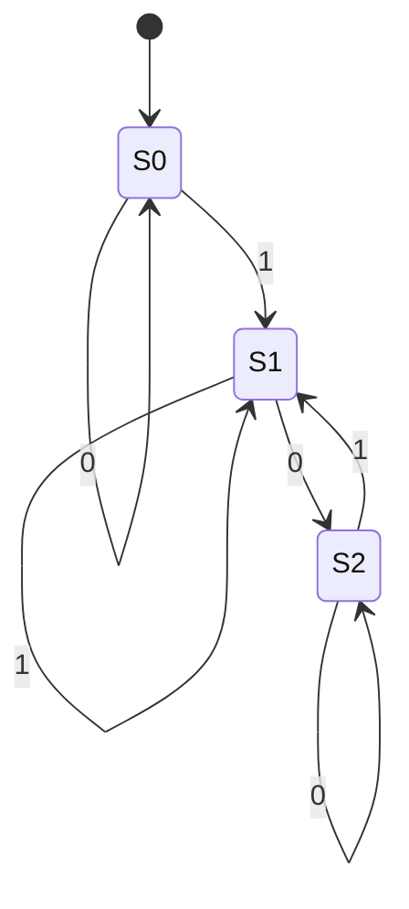

---

### BÀI TẬP 5: NFA CHỌN LỰA NHÁNH
- **Đồ thị NFA:**
  - $q_0$: Đọc $a$ sang $q_2$; đọc $a$ sang $q_1 \in F$.
  - $q_2$: Tự lặp $a, b$; đọc $a$ sang $q_1 \in F$.
  - Bảng chữ cái $\Sigma = \{a, b\}$.
- **Các bước chuyển đổi:**
  1. $S_0 = \{q_0\}$.
  2. Từ $S_0$:
     - Đọc $a$: $\delta(q_0, a) = \{q_1, q_2\} = S_1 \in F_D$.
     - Đọc $b$: $\emptyset = Trap$.
  3. Từ $S_1 = \{q_1, q_2\}$:
     - Đọc $a$: $\delta(q_1, a) \cup \delta(q_2, a) = \emptyset \cup \{q_1, q_2\} = S_1$.
     - Đọc $b$: $\delta(q_1, b) \cup \delta(q_2, b) = \emptyset \cup \{q_2\} = \{q_2\} = S_2$.
  4. Từ $S_2 = \{q_2\}$:
     - Đọc $a$: $\delta(q_2, a) = \{q_1, q_2\} = S_1$.
     - Đọc $b$: $\delta(q_2, b) = \{q_2\} = S_2$.
  5. $Trap$: đọc $a, b$ ở lại $Trap$.

#### Bảng chuyển trạng thái DFA:

| Trạng thái DFA | Tập con | Đọc $a$ | Đọc $b$ | Kết thúc? |
| :---: | :---: | :---: | :---: | :---: |
| $\to S_0$ | $\{q_0\}$ | $S_1$ | $Trap$ | Không |
| $* S_1$ | $\{q_1, q_2\}$ | $S_1$ | $S_2$ | **CÓ** |
| $S_2$ | $\{q_2\}$ | $S_1$ | $S_2$ | Không |
| $Trap$ | $\emptyset$ | $Trap$ | $Trap$ | Không |

---

# C. CHUYÊN ĐỀ 2: TỐI THIỂU HÓA TRẠNG THÁI DFA (OPTIMIZE STATES)

---

## 1. Bản chất phân biệt được vs không phân biệt được

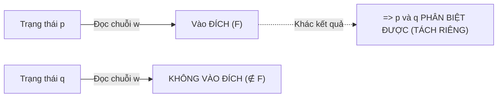

- **Phân biệt được (Distinguishable):** Tồn tại chuỗi $w$ sao cho 1 bên vào $F$, 1 bên không vào $F$.
- **Không phân biệt được (Indistinguishable):** Với mọi chuỗi $w$, cả 2 đều cùng vào $F$ hoặc cùng không vào $F$ $\implies$ **Gộp làm một**.

---

## 2. Quy trình thuật toán Điền bảng chuẩn

1. **Bước 0:** Loại bỏ trạng thái cô lập (không có đường đi từ $q_0$).
2. **Bước 1:** Vẽ bảng tam giác cho tất cả các cặp $(q_i, q_j)$ với $i > j$.
3. **Bước 2:** Đánh dấu **X** vào các cặp có 1 trạng thái $\in F$ và 1 trạng thái $\notin F$.
4. **Bước 3:** Lặp lại việc xét các ô trống: Nếu đọc ký hiệu $a$ đưa cặp $(p, q)$ về cặp $(p_a, q_a)$ đã bị đánh dấu **X**, thì đánh dấu **X** vào ô $(p, q)$. Lặp đến khi bảng không đổi.
5. **Bước 4:** Gộp các ô trống thành trạng thái mới, vẽ lại $DFA_{min}$.

---

## 3. Chi tiết 4 Ví dụ trong Slide

---

### VÍ DỤ 2.2: Loại bỏ trạng thái cô lập $q_5$ & gộp nhánh đối xứng
- Bỏ $q_5$ vì từ $q_0$ không bao giờ tới được.
- Gộp $\{q_1, q_2\}$ vì cả hai đều tự lặp khi đọc 0 và cùng sang $F$ khi đọc 1.
- Gộp $\{q_3, q_4\}$ vì cả hai đều là trạng thái kết thúc và tự lặp khi đọc 0, 1.
- DFA giảm từ 6 trạng thái xuống còn **3 trạng thái**.

---

### VÍ DỤ 2.3a: Lần vết từng ô trên bảng tam giác 5 trạng thái
- Tập trạng thái: $Q = \{q_0, q_1, q_2, q_3, q_4\}$, $F = \{q_4\}$.
- Bảng tam giác gồm 10 ô:
  - $(q_4, q_0), (q_4, q_1), (q_4, q_2), (q_4, q_3)$ bị đánh dấu **X** ngay ở Bước 2.
  - Vòng lặp 1: $(q_3, q_0), (q_3, q_1), (q_3, q_2)$ đọc $b$ ra cặp chứa $q_4 \implies$ Đánh dấu **X**.
  - Vòng lặp 2: $(q_1, q_0), (q_2, q_1)$ đọc $b$ ra $(q_3, q_2)$ đã có **X** $\implies$ Đánh dấu **X**.
  - Ô duy nhất **trống** là $(q_2, q_0)$.
- **Kết luận:** Gộp $\{q_0, q_2\}$, DFA tối thiểu có **4 trạng thái**: $\{q_0, q_2\}, \{q_1\}, \{q_3\}, \{q_4\}$.

---

### VÍ DỤ 2.3b: Rút gọn DFA 6 trạng thái về 3 trạng thái
- Các tập tương đương không bị đánh dấu: $\{q_1, q_2\}$ và $\{q_3, q_4, q_5\}$.
- $DFA_{min}$ gồm **3 trạng thái**: $\{q_6\}, \{q_1, q_2\}, \{q_3, q_4, q_5\}$.

---

### VÍ DỤ 2.4: Mẫu trả lời câu hỏi "DFA đã tối thiểu chưa? Tại sao?"
- Chứng minh từng cặp trạng thái $(q_1, q_2), (q_2, q_3), (q_1, q_3)$ đều phân biệt được.
- Vì mọi cặp trạng thái đều phân biệt được nên DFA **đã tối thiểu**.

---

## 4. Lời giải chi tiết 3 Bài tập lớn (Trang 7) - CẨM NANG THI CỬ CHUẨN

> [!IMPORTANT]
> **QUY TẮC SỐNG CÒN KHI LÀM BÀI THI CÓ HÌNH VẼ KHÔNG ĐÁNH SỐ TRẠNG THÁI:**
> Trong đề thi hoặc bài tập in từ slide, rất nhiều hình vẽ **chỉ có vòng tròn trống hoặc chỉ có chữ $q$ trơn** (không có chỉ số $q_0, q_1, q_2 \dots$).  
> Khi làm bài thi, sinh viên **BẮT BUỘC PHẢI THỰC HIỆN CÁC BƯỚC SAU ĐẦU TIÊN**:
> 1. Vẽ lại hình vào bài làm và **tự đặt tên các trạng thái** $q_0, q_1, q_2 \dots$ (hoặc $A, B, C \dots$).
> 2. Quy ước đặt tên chuẩn:
>    - Trạng thái có mũi tên từ ngoài trỏ vào luôn là **trạng thái khởi đầu $q_0$**.
>    - Đặt tên các trạng thái tiếp theo từ trái sang phải, từ trên xuống dưới.
> 3. Khai báo rõ bộ 5 thành phần: $Q, \Sigma, q_0, F$ (các vòng tròn đôi là thuộc $F$).
> 4. Lập bảng hàm chuyển $\delta$ của đề bài trước khi bắt đầu giải thuật!

---

### BÀI TẬP 1: TỐI THIỂU HÓA DFA HÌNH (a) VÀ HÌNH (b)

---

#### ══════════════════════════════════════════════════════════
#### 1.1 GIẢI BÀI 1 - HÌNH (a): DFA 8 TRẠNG THÁI
#### ══════════════════════════════════════════════════════════

##### A. Hình ảnh đề bài đã được gán nhãn rõ ràng:


##### B. Bản chất trực quan (Để dễ hình dung):
- Đồ thị gồm **8 trạng thái** chia thành 2 hàng song song:
  - Hàng trên: $q_0, q_1, q_2, q_3$
  - Hàng dưới: $q_4, q_5, q_6, q_7$
- Nhận xét đặc biệt về tính đối xứng:
  - **Cặp $(q_0, q_1)$:** Cả hai trạng thái khi đọc 0 đều đi về $q_0$; khi đọc 1 đều đi về $q_4$. Chúng có hành vi chuyển dịch **giống hệt nhau 100%**! $\implies$ Chắc chắn sẽ gộp thành $\{q_0, q_1\}$.
  - **Cặp $(q_4, q_5)$:** Cả hai khi đọc 0 đều đi về $q_2$; khi đọc 1 đều đi về $q_6$. Chúng có hành vi **giống hệt nhau 100%**! $\implies$ Chắc chắn sẽ gộp thành $\{q_4, q_5\}$.
- Do đó, từ 8 trạng thái ban đầu, máy sẽ được thu gọn về đúng **6 trạng thái**.

---

##### C. Bài giải mẫu chuẩn trình bày trong bài thi:

**Lời giải:**

Ta gán nhãn cho các trạng thái của DFA trong Hình (a) như sau:
- Tập trạng thái: $Q = \{q_0, q_1, q_2, q_3, q_4, q_5, q_6, q_7\}$.
- Bảng chữ cái: $\Sigma = \{0, 1\}$.
- Trạng thái bắt đầu: $q_0$.
- Tập trạng thái kết thúc: $F = \{q_7\}$.

**Bảng chuyển trạng thái ban đầu của DFA:**

| Trạng thái | Đọc 0 | Đọc 1 |
| :---: | :---: | :---: |
| $\to q_0$ | $q_0$ | $q_4$ |
| $q_1$ | $q_0$ | $q_4$ |
| $q_2$ | $q_1$ | $q_5$ |
| $q_3$ | $q_2$ | $q_5$ |
| $q_4$ | $q_2$ | $q_6$ |
| $q_5$ | $q_2$ | $q_6$ |
| $q_6$ | $q_3$ | $q_7$ |
| $* q_7$ | $q_7$ | $q_3$ |

**Thực hiện giải thuật Optimize States:**

- **Bước 0 (Loại bỏ trạng thái cô lập):**
  - Từ $q_0 \xrightarrow{1} q_4 \xrightarrow{0} q_2 \xrightarrow{0} q_1$.
  - Từ $q_4 \xrightarrow{1} q_6 \xrightarrow{0} q_3 \xrightarrow{1} q_5$.
  - Từ $q_6 \xrightarrow{1} q_7$.
  - $\implies$ Tất cả 8 trạng thái đều đến được từ $q_0$. Không có trạng thái nào bị loại bỏ.

- **Bước 1 & 2 (Lập bảng tam giác & đánh dấu cơ bản):**
  - Ta lập bảng tam giác gồm $C_8^2 = \frac{8 \times 7}{2} = 28$ ô.
  - Vì $F = \{q_7\}$ và non-final $= \{q_0, q_1, q_2, q_3, q_4, q_5, q_6\}$, ta đánh dấu **X** vào tất cả các ô chứa $q_7$:
    $(q_7, q_0), (q_7, q_1), (q_7, q_2), (q_7, q_3), (q_7, q_4), (q_7, q_5), (q_7, q_6)$.

- **Bước 3 (Lần vết lan truyền):**
  1. **Xét cặp $(q_1, q_0)$:**
     - Đọc 0: $\delta(q_1, 0) = q_0, \delta(q_0, 0) = q_0 \implies$ Cặp $(q_0, q_0)$ (trùng nhau).
     - Đọc 1: $\delta(q_1, 1) = q_4, \delta(q_0, 1) = q_4 \implies$ Cặp $(q_4, q_4)$ (trùng nhau).
     - $\implies (q_1, q_0)$ **không bao giờ bị đánh dấu $\implies q_0$ và $q_1$ tương đương nhau ($q_0 \equiv q_1$)**.
  2. **Xét cặp $(q_5, q_4)$:**
     - Đọc 0: $\delta(q_5, 0) = q_2, \delta(q_4, 0) = q_2 \implies$ Cặp $(q_2, q_2)$ (trùng nhau).
     - Đọc 1: $\delta(q_5, 1) = q_6, \delta(q_4, 1) = q_6 \implies$ Cặp $(q_6, q_6)$ (trùng nhau).
     - $\implies (q_5, q_4)$ **không bao giờ bị đánh dấu $\implies q_4$ và $q_5$ tương đương nhau ($q_4 \equiv q_5$)**.
  3. **Xét các cặp còn lại:**
     - Cặp $(q_6, q_i)$ (với $i \ne 6$): Khi đọc 1, $\delta(q_6, 1) = q_7 \in F$, trong khi các trạng thái khác đọc 1 không dẫn vào $q_7 \implies$ Đều bị đánh dấu **X**.
     - Cặp $(q_2, q_3)$: $\delta(q_2, 0) = q_1, \delta(q_3, 0) = q_2$. Cặp $(q_1, q_2)$ phân biệt được bởi chuỗi $11$ (vì $q_1 \xrightarrow{11} q_7 \in F$ còn $q_2 \xrightarrow{11} q_6 \notin F$) $\implies (q_2, q_3)$ bị đánh dấu **X**.
     - Tương tự, tất cả các cặp khác đều bị đánh dấu **X**.

- **Bước 4 (Kết luận & gộp trạng thái):**
  - Chỉ có 2 cặp không bị đánh dấu là: $(q_1, q_0)$ và $(q_5, q_4)$.
  - Ta có các lớp tương đương:
    $$[q_0, q_1], [q_4, q_5], [q_2], [q_3], [q_6], [q_7]$$
  - Trạng thái bắt đầu mới: $[q_0, q_1]$.
  - Trạng thái kết thúc mới: $[q_7]$.

**Bảng chuyển trạng thái của $DFA_{min}$ (6 trạng thái):**

| Trạng thái | Đọc 0 | Đọc 1 |
| :---: | :---: | :---: |
| $\to [q_0, q_1]$ | $[q_0, q_1]$ | $[q_4, q_5]$ |
| $[q_4, q_5]$ | $[q_2]$ | $[q_6]$ |
| $[q_2]$ | $[q_0, q_1]$ | $[q_4, q_5]$ |
| $[q_3]$ | $[q_2]$ | $[q_4, q_5]$ |
| $[q_6]$ | $[q_3]$ | $[q_7]$ |
| $* [q_7]$ | $[q_7]$ | $[q_3]$ |

**Đồ thị chuyển trạng thái $DFA_{min}$:**

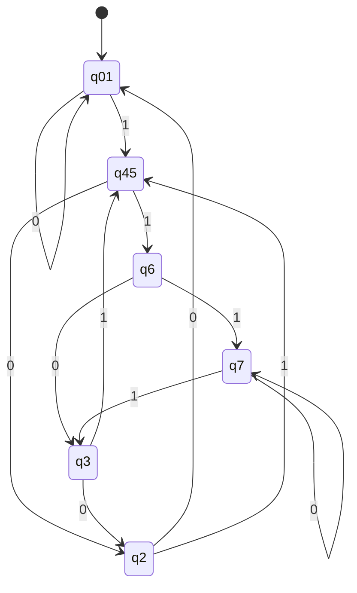

---

#### ══════════════════════════════════════════════════════════
#### 1.2 GIẢI BÀI 1 - HÌNH (b): DFA 7 TRẠNG THÁI
#### ══════════════════════════════════════════════════════════

##### A. Hình ảnh đề bài đã được gán nhãn rõ ràng:


##### B. Bản chất trực quan (Để dễ hình dung):
- DFA này có **7 trạng thái**:
  - $q_0$: Trạng thái bắt đầu (vòng đơn ngoài cùng bên trái).
  - Có tới **4 trạng thái kết thúc** (có vòng tròn đôi): $q_1, q_2, q_3, q_4$.
  - 2 trạng thái không kết thúc ở phía trên: $q_5, q_6$.
- Quan sát hành vi:
  - **Cặp $(q_2, q_3)$:** Cả hai đều đọc 0 sang $q_5$, đọc 1 sang $q_5$ $\implies$ **Hành vi y hệt nhau 100%** $\implies$ Gộp $\{q_2, q_3\}$.
  - **Cặp $(q_1, q_4)$:** Cả hai đều đọc 0 ở lại $q_4$, đọc 1 sang $q_3$ $\implies$ **Hành vi y hệt nhau 100%** $\implies$ Gộp $\{q_1, q_4\}$.
  - **Cặp $(q_5, q_6)$:** Khi máy đã rơi vào $q_5$ hoặc $q_6$, không có bất kỳ ngã rẽ nào để quay trở về tập kết thúc $F$. Chúng chỉ có thể đi luẩn quẩn giữa $q_5$ và $q_6$ $\implies$ Cả hai đều là **trạng thái bẫy chết (Dead/Trap States)** $\implies$ Gộp $\{q_5, q_6\} = q_{trap}$.
- Kết quả: DFA 7 trạng thái được rút gọn về đúng **4 trạng thái**:
  $$[q_0], [q_1, q_4] \in F, [q_2, q_3] \in F, [q_{trap}]$$

---

##### C. Bài giải mẫu chuẩn trình bày trong bài thi:

**Lời giải:**

Ta gán nhãn cho các trạng thái của DFA trong Hình (b) như sau:
- Tập trạng thái: $Q = \{q_0, q_1, q_2, q_3, q_4, q_5, q_6\}$.
- Bảng chữ cái: $\Sigma = \{0, 1\}$.
- Trạng thái bắt đầu: $q_0$.
- Tập trạng thái kết thúc: $F = \{q_1, q_2, q_3, q_4\}$.
- Trạng thái không kết thúc: $\{q_0, q_5, q_6\}$.

**Bảng chuyển trạng thái ban đầu của DFA:**

| Trạng thái | Đọc 0 | Đọc 1 | Thuộc $F$? |
| :---: | :---: | :---: | :---: |
| $\to q_0$ | $q_1$ | $q_2$ | Không |
| $* q_1$ | $q_4$ | $q_3$ | **CÓ** |
| $* q_2$ | $q_5$ | $q_5$ | **CÓ** |
| $* q_3$ | $q_5$ | $q_5$ | **CÓ** |
| $* q_4$ | $q_4$ | $q_3$ | **CÓ** |
| $q_5$ | $q_6$ | $q_5$ | Không |
| $q_6$ | $q_6$ | $q_6$ | Không |

**Thực hiện giải thuật Optimize States:**

- **Bước 0:** Tất cả 7 trạng thái đều đến được từ $q_0$.
- **Bước 1 & 2:**
  - Lập bảng tam giác gồm $C_7^2 = \frac{7 \times 6}{2} = 21$ ô.
  - Đánh dấu **X** vào tất cả các cặp giữa 1 trạng thái thuộc $F = \{q_1, q_2, q_3, q_4\}$ và 1 trạng thái không thuộc $F = \{q_0, q_5, q_6\}$.
- **Bước 3 (Lan truyền):**
  1. **Xét cặp $(q_3, q_2)$:**
     - Đọc 0: $\delta(q_3, 0) = q_5, \delta(q_2, 0) = q_5 \implies (q_5, q_5)$ (trùng).
     - Đọc 1: $\delta(q_3, 1) = q_5, \delta(q_2, 1) = q_5 \implies (q_5, q_5)$ (trùng).
     - $\implies (q_3, q_2)$ **không bị đánh dấu $\implies q_2 \equiv q_3$**.
  2. **Xét cặp $(q_4, q_1)$:**
     - Đọc 0: $\delta(q_4, 0) = q_4, \delta(q_1, 0) = q_4 \implies (q_4, q_4)$ (trùng).
     - Đọc 1: $\delta(q_4, 1) = q_3, \delta(q_1, 1) = q_3 \implies (q_3, q_3)$ (trùng).
     - $\implies (q_4, q_1)$ **không bị đánh dấu $\implies q_1 \equiv q_4$**.
  3. **Xét cặp $(q_6, q_5)$:**
     - Cả hai trạng thái này không có đường đi tới bất kỳ trạng thái kết thúc nào trong $F$, mọi chuỗi $w$ đều giữ máy ở ngoài $F \implies (q_6, q_5)$ **không bị đánh dấu $\implies q_5 \equiv q_6$**.
  4. Các cặp khác như $(q_2, q_1)$ đều đọc 0 dẫn tới $(q_5, q_4)$ (trong đó $q_4 \in F, q_5 \notin F$ đã có dấu X) $\implies$ Đánh dấu **X**.
- **Bước 4 (Kết luận):**
  - Ta thu được 4 trạng thái sau khi gộp:
    $$[q_0], \quad [q_1, q_4] \in F, \quad [q_2, q_3] \in F, \quad [q_5, q_6] = [q_{trap}]$$

**Bảng chuyển trạng thái của $DFA_{min}$ (4 trạng thái):**

| Trạng thái tối thiểu | Đọc 0 | Đọc 1 | Thuộc $F$? |
| :---: | :---: | :---: | :---: |
| $\to [q_0]$ | $[q_1, q_4]$ | $[q_2, q_3]$ | Không |
| $* [q_1, q_4]$ | $[q_1, q_4]$ | $[q_2, q_3]$ | **CÓ** |
| $* [q_2, q_3]$ | $[q_{trap}]$ | $[q_{trap}]$ | **CÓ** |
| $[q_{trap}]$ | $[q_{trap}]$ | $[q_{trap}]$ | Không |

**Đồ thị chuyển trạng thái $DFA_{min}$:**

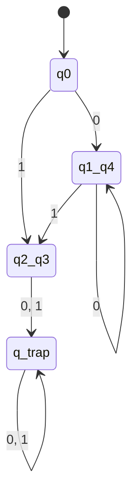

---

### BÀI TẬP 2: TÌM DFA CÓ SỐ TRẠNG THÁI TỐI THIỂU TƯƠNG ĐƯƠNG VỚI NFA ĐÃ CHO

##### A. Hình ảnh đề bài đã được gán nhãn:


##### B. Bản chất trực quan (Để dễ hình dung):
- **Bản chất đề bài:** Đây là dạng bài toán tổng hợp **2 trong 1**:
  - *Giai đoạn 1:* Chuyển đổi NFA $\to$ DFA theo phương pháp tập con (Subset Construction).
  - *Giai đoạn 2:* Tối thiểu hóa DFA vừa tìm được.
- **Ngôn ngữ của NFA:** Nhận dạng các chuỗi có các chữ $a$, rồi đến các chữ $b$, rồi đến các chữ $c$:
  $$L = a^* b^* c^*$$
  (Ví dụ: chuỗi rỗng $\lambda$, $a, b, c, aa, bb, cc, ab, bc, abc, aabbbccc \dots$).

---

##### C. Bài giải mẫu chuẩn trình bày trong bài thi:

**Lời giải:**

Ta gán nhãn các trạng thái của NFA từ trái qua phải là $q_0, q_1, q_2$:
- Tập trạng thái: $Q_N = \{q_0, q_1, q_2\}$.
- Bảng chữ cái: $\Sigma = \{a, b, c\}$.
- Trạng thái bắt đầu: $q_0$.
- Tập trạng thái kết thúc: $F_N = \{q_2\}$.

---

#### GIAI ĐOẠN 1: CHUYỂN ĐỔI NFA SANG DFA (THỦ TỤC NFA-TO-DFA)

**Bước 1: Tìm đỉnh khởi đầu của DFA**
- Tính $\lambda$-closure của $q_0$:
  $$\lambda\text{-closure}(q_0) = \{q_0, q_1, q_2\}$$
  (vì $q_0 \xrightarrow{\lambda} q_1 \xrightarrow{\lambda} q_2$).
- Do đó đỉnh khởi đầu của DFA là:
  $$S_0 = \{q_0, q_1, q_2\}$$
  Vì $S_0$ chứa $q_2 \in F_N$ nên **$S_0$ là trạng thái kết thúc của DFA ($S_0 \in F_D$)**.

**Bước 2: Xây dựng các chuyển dịch và tìm đỉnh mới**
1. **Từ $S_0 = \{q_0, q_1, q_2\}$:**
   - Đọc $a$: $\delta(q_0, a) = \{q_0\} \implies \lambda\text{-closure}(\{q_0\}) = \{q_0, q_1, q_2\} = S_0$.
   - Đọc $b$: $\delta(q_1, b) = \{q_1\} \implies \lambda\text{-closure}(\{q_1\}) = \{q_1, q_2\} = S_1$ (Đỉnh mới, chứa $q_2 \implies S_1 \in F_D$).
   - Đọc $c$: $\delta(q_2, c) = \{q_2\} \implies \lambda\text{-closure}(\{q_2\}) = \{q_2\} = S_2$ (Đỉnh mới, chứa $q_2 \implies S_2 \in F_D$).
2. **Từ $S_1 = \{q_1, q_2\}$:**
   - Đọc $a$: Không có chuyển dịch $\implies \emptyset = S_{trap}$ (Trạng thái bẫy).
   - Đọc $b$: $\delta(q_1, b) = \{q_1\} \implies \lambda\text{-closure}(\{q_1\}) = \{q_1, q_2\} = S_1$.
   - Đọc $c$: $\delta(q_2, c) = \{q_2\} \implies \lambda\text{-closure}(\{q_2\}) = \{q_2\} = S_2$.
3. **Từ $S_2 = \{q_2\}$:**
   - Đọc $a$: Không có chuyển dịch $\implies S_{trap}$.
   - Đọc $b$: Không có chuyển dịch $\implies S_{trap}$.
   - Đọc $c$: $\delta(q_2, c) = \{q_2\} \implies S_2$.
4. **Từ trạng thái bẫy $S_{trap} = \emptyset$:**
   - Đọc $a, b, c$ đều tự lặp ở lại $S_{trap}$.

**Bảng chuyển trạng thái của DFA thu được:**

| Trạng thái DFA | Ký hiệu tập con | Đọc $a$ | Đọc $b$ | Đọc $c$ | Thuộc $F_D$? |
| :---: | :---: | :---: | :---: | :---: | :---: |
| $\to * S_0$ | $\{q_0, q_1, q_2\}$ | $S_0$ | $S_1$ | $S_2$ | **CÓ** |
| $* S_1$ | $\{q_1, q_2\}$ | $S_{trap}$ | $S_1$ | $S_2$ | **CÓ** |
| $* S_2$ | $\{q_2\}$ | $S_{trap}$ | $S_{trap}$ | $S_2$ | **CÓ** |
| $S_{trap}$ | $\emptyset$ | $S_{trap}$ | $S_{trap}$ | $S_{trap}$ | Không |

---

#### GIAI ĐOẠN 2: TỐI THIỂU HÓA DFA VỪA TÌM ĐƯỢC

Ta kiểm tra xem DFA 4 trạng thái $\{S_0, S_1, S_2, S_{trap}\}$ có thể rút gọn được không:
1. $S_{trap} \notin F_D$ hiển nhiên phân biệt với cả 3 trạng thái $\{S_0, S_1, S_2\} \in F_D$ bởi chuỗi rỗng $\lambda$.
2. **Xét cặp $(S_0, S_1)$:**
   - Khi đọc ký tự $a$: $\delta(S_0, a) = S_0 \in F_D$, nhưng $\delta(S_1, a) = S_{trap} \notin F_D$.
   - $\implies S_0$ và $S_1$ **phân biệt được bởi chuỗi $w = a$**.
3. **Xét cặp $(S_1, S_2)$:**
   - Khi đọc ký tự $b$: $\delta(S_1, b) = S_1 \in F_D$, nhưng $\delta(S_2, b) = S_{trap} \notin F_D$.
   - $\implies S_1$ và $S_2$ **phân biệt được bởi chuỗi $w = b$**.
4. **Xét cặp $(S_0, S_2)$:**
   - Khi đọc ký tự $a$: $\delta(S_0, a) = S_0 \in F_D$, nhưng $\delta(S_2, a) = S_{trap} \notin F_D$.
   - $\implies S_0$ và $S_2$ **phân biệt được bởi chuỗi $w = a$**.

**KẾT LUẬN:** Mọi cặp trạng thái đều phân biệt được, do đó **DFA thu được đã tối thiểu với đúng 4 trạng thái**.

**Đồ thị DFA tối thiểu:**

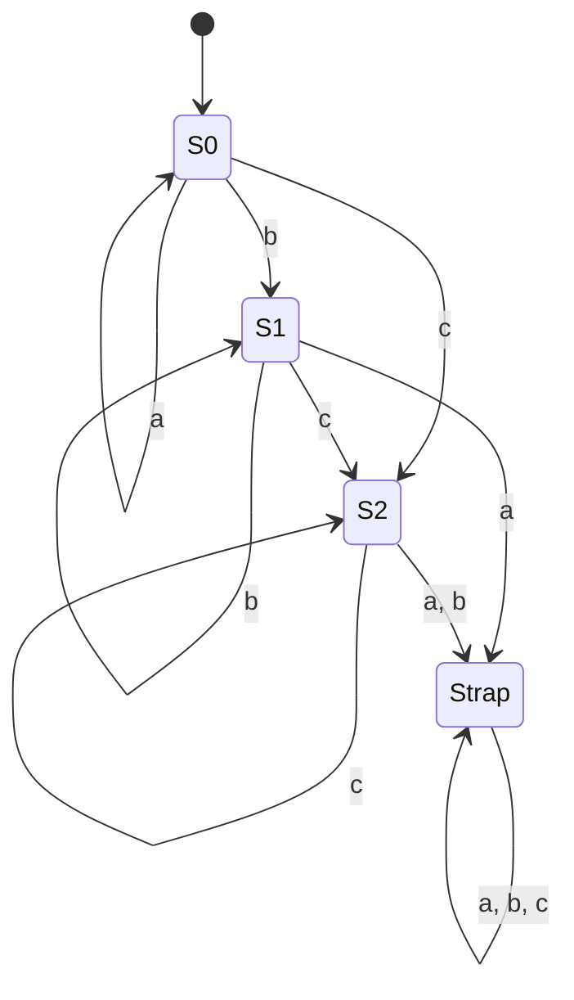

---

### BÀI TẬP 3: THIẾT KẾ DFA TỐI THIỂU CHO CÁC NGÔN NGỮ

---

#### ══════════════════════════════════════════════════════════
#### 3.1 CÂU a: $L = \{a^n b^m : n \ge 2, m \ge 1\}$ trên $\Sigma = \{a, b\}$
#### ══════════════════════════════════════════════════════════

##### A. Bản chất trực quan (Để dễ hình dung):
- Đề bài yêu cầu:
  1. Phải có ít nhất 2 chữ $a$ ở đầu: $a^2, a^3, a^4 \dots$
  2. Tiếp theo phải có ít nhất 1 chữ $b$: $b^1, b^2, b^3 \dots$
  3. Sau khi đã đọc $b$, **không bao giờ được xuất hiện chữ $a$ nữa**.
  4. Nếu chuỗi bắt đầu bằng $b$ hoặc chỉ có 1 chữ $a$ rồi sang $b$ $\implies$ Sai định dạng, đi vào bẫy chết.
- Chuỗi hợp lệ ngắn nhất: $w = aab$.
- Như vậy ta cần một chiếc máy đếm:
  - Chưa có $a$ nào $\to$ Có 1 $a$ $\to$ Có $\ge 2$ $a$ $\to$ Có thêm $b$ (Đạt!).

##### B. Bài giải mẫu chuẩn trình bày trong bài thi:

**Lời giải:**

Ta xây dựng DFA $M = (Q, \Sigma, \delta, q_0, F)$ với:
- $\Sigma = \{a, b\}$.
- Tập trạng thái gồm 5 trạng thái:
  - $q_0$: Trạng thái bắt đầu (chưa đọc ký tự nào).
  - $q_1$: Đã đọc được đúng 1 chữ $a$.
  - $q_2$: Đã đọc được $\ge 2$ chữ $a$.
  - $q_3$: Đã đọc $\ge 2$ chữ $a$ và $\ge 1$ chữ $b$ $\implies$ **Trạng thái kết thúc duy nhất ($F = \{q_3\}$)**.
  - $q_{trap}$: Trạng thái bẫy khi chuỗi sai quy tắc.

**Bảng chuyển trạng thái của DFA:**

| Trạng thái | Đọc $a$ | Đọc $b$ | Thuộc $F$? | Ý nghĩa |
| :---: | :---: | :---: | :---: | :--- |
| $\to q_0$ | $q_1$ | $q_{trap}$ | Không | Bắt đầu. Đọc 'a' sang $q_1$, đọc 'b' sai vào bẫy. |
| $q_1$ | $q_2$ | $q_{trap}$ | Không | Đã có 1 'a'. Thêm 'a' sang $q_2$, đọc 'b' sớm vào bẫy. |
| $q_2$ | $q_2$ | $q_3$ | Không | Đã có $\ge 2$ 'a'. Đọc tiếp 'a' ở lại $q_2$, đọc 'b' đầu tiên sang $q_3 \in F$. |
| $* q_3$ | $q_{trap}$ | $q_3$ | **CÓ** | Hợp lệ. Đọc tiếp 'b' ở lại $q_3 \in F$, nếu gặp lại 'a' vào bẫy. |
| $q_{trap}$ | $q_{trap}$ | $q_{trap}$ | Không | Bẫy chết (nuốt mọi ký tự còn lại). |

**Chứng minh DFA này là tối thiểu (gồm đúng 5 trạng thái):**
Ta chứng minh tất cả các cặp trạng thái đều phân biệt được:
1. $q_3 \in F$ phân biệt với $\{q_0, q_1, q_2, q_{trap}\} \notin F$ bởi chuỗi rỗng $\lambda$.
2. $(q_0, q_{trap})$ phân biệt bởi chuỗi $aab$ ($\delta^*(q_0, aab) = q_3 \in F$ còn $\delta^*(q_{trap}, aab) = q_{trap} \notin F$).
3. $(q_1, q_{trap})$ phân biệt bởi chuỗi $ab$ ($\delta^*(q_1, ab) = q_3 \in F$).
4. $(q_2, q_{trap})$ phân biệt bởi chuỗi $b$ ($\delta^*(q_2, b) = q_3 \in F$).
5. $(q_0, q_1)$ phân biệt bởi chuỗi $ab$ ($\delta^*(q_0, ab) = q_{trap} \notin F$ còn $\delta^*(q_1, ab) = q_3 \in F$).
6. $(q_0, q_2)$ phân biệt bởi chuỗi $b$ ($\delta^*(q_0, b) = q_{trap} \notin F$ còn $\delta^*(q_2, b) = q_3 \in F$).
7. $(q_1, q_2)$ phân biệt bởi chuỗi $b$ ($\delta^*(q_1, b) = q_{trap} \notin F$ còn $\delta^*(q_2, b) = q_3 \in F$).

$\implies$ Không có 2 trạng thái nào gộp được $\implies$ **DFA tối thiểu có đúng 5 trạng thái**.

**Đồ thị DFA tối thiểu:**

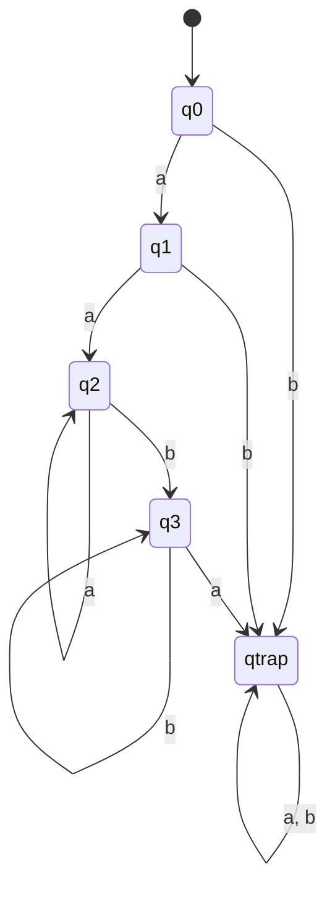

---

#### ══════════════════════════════════════════════════════════
#### 3.2 CÂU b: $L = \{a^n b : n \ge 0\} \cup \{b^n a : n \ge 1\}$ trên $\Sigma = \{a, b\}$
#### ══════════════════════════════════════════════════════════

##### A. Bản chất trực quan (Để dễ hình dung):
- Ngôn ngữ gồm 2 nhánh:
  - **Nhánh 1 ($a^n b$ với $n \ge 0$):** $b, ab, aab, aaab \dots$ (Các chuỗi kết thúc bằng đúng 1 chữ $b$).
  - **Nhánh 2 ($b^n a$ với $n \ge 1$):** $ba, bba, bbba \dots$ (Các chuỗi có ít nhất 1 chữ $b$ và kết thúc bằng đúng 1 chữ $a$).
- **Điểm bẫy tư duy cực hay của bài này:**
  - Chuỗi "$b$": Ứng với $n=0$ của nhánh 1 $\implies$ **Phải được chấp nhận ngay** (Trạng thái $q_2 \in F$).
  - Đang ở chuỗi "$b$", nếu người dùng gõ thêm chữ $a$ thành "$ba$": Lại trúng vào $n=1$ của nhánh 2 $\implies$ **Vẫn phải được chấp nhận** (Trạng thái $q_3 \in F$).
  - Đang ở chuỗi "$b$", nếu gõ thêm chữ $b$ thành "$bb$": Chưa hợp lệ, phải chuyển sang trạng thái chờ $q_4$ để đợi chữ $a$ kết thúc.

##### B. Bài giải mẫu chuẩn trình bày trong bài thi:

**Lời giải:**

Ta xây dựng DFA $M = (Q, \Sigma, \delta, q_0, F)$ gồm 6 trạng thái:
- $q_0$: Bắt đầu (chuỗi rỗng $\lambda$).
- $q_1$: Đã đọc $\ge 1$ chữ $a$ (nhánh $a^+$).
- $q_2 \in F$: Đã đọc đúng 1 chữ $b$ từ đầu (chấp nhận chuỗi "$b$").
- $q_3 \in F$: Trạng thái kết thúc chuẩn khi hoàn tất chuỗi ($a^n b$ với $n \ge 1$ hoặc $b^n a$ với $n \ge 1$).
- $q_4$: Đã đọc $\ge 2$ chữ $b$ (nhánh $b^{\ge 2}$).
- $q_{trap}$: Trạng thái bẫy khi chuỗi thừa ký tự.

**Bảng chuyển trạng thái của DFA:**

| Trạng thái | Đọc $a$ | Đọc $b$ | Thuộc $F$? | Giải thích |
| :---: | :---: | :---: | :---: | :--- |
| $\to q_0$ | $q_1$ | $q_2$ | Không | Bắt đầu. Đọc 'a' rẽ nhánh $a^*$, đọc 'b' được chuỗi "$b$". |
| $q_1$ | $q_1$ | $q_3$ | Không | Nhánh $a^+$. Đọc tiếp 'a' ở lại $q_1$, đọc 'b' hoàn thành $a^n b$ sang $q_3 \in F$. |
| $* q_2$ | $q_3$ | $q_4$ | **CÓ** | Đã đọc "$b$". Đọc 'a' thành "$ba$" sang $q_3 \in F$, đọc 'b' thành "$bb$" sang $q_4$. |
| $* q_3$ | $q_{trap}$ | $q_{trap}$ | **CÓ** | Đã hoàn thành chuỗi hợp lệ. Nếu đọc thêm bất kỳ ký tự nào sẽ vi phạm. |
| $q_4$ | $q_3$ | $q_4$ | Không | Nhánh $b^{\ge 2}$. Đọc tiếp 'b' ở lại $q_4$, đọc 'a' hoàn tất $b^n a$ sang $q_3 \in F$. |
| $q_{trap}$ | $q_{trap}$ | $q_{trap}$ | Không | Bẫy chết. |

**Chứng minh DFA này là tối thiểu (gồm đúng 6 trạng thái):**
1. **Xét 2 trạng thái kết thúc $\{q_2, q_3\}$:**
   - $\delta(q_2, a) = q_3 \in F$, nhưng $\delta(q_3, a) = q_{trap} \notin F$.
   - $\implies q_2$ và $q_3$ **phân biệt được bởi chuỗi $w = a$**.
2. **Xét các trạng thái không kết thúc $\{q_0, q_1, q_4, q_{trap}\}$:**
   - $(q_0, q_1)$ phân biệt bởi chuỗi $ba$ ($\delta^*(q_0, ba) = q_3 \in F$ còn $\delta^*(q_1, ba) = q_{trap} \notin F$).
   - $(q_1, q_4)$ phân biệt bởi chuỗi $b$ ($\delta(q_1, b) = q_3 \in F$ còn $\delta(q_4, b) = q_4 \notin F$).
   - $(q_0, q_4)$ phân biệt bởi chuỗi $a$ ($\delta(q_0, a) = q_1 \notin F$ còn $\delta(q_4, a) = q_3 \in F$).
   - $q_{trap}$ phân biệt với tất cả các trạng thái còn lại vì không có bất kỳ chuỗi nào dẫn từ $q_{trap}$ tới $F$.

$\implies$ Tất cả các cặp trạng thái đều phân biệt được $\implies$ **DFA tối thiểu có đúng 6 trạng thái**.

**Đồ thị DFA tối thiểu:**

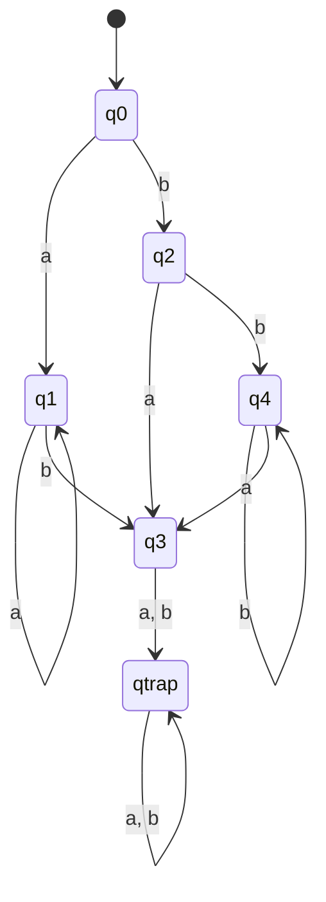


---

# D. CHECKLIST & BÍ QUYẾT ĐẠT ĐIỂM 10 KHI ĐI THI

```text
╔══════════════════════════════════════════════════════════════════════════╗
║                    BÍ QUYẾT ĐẠT ĐIỂM TỐI ĐA CHƯƠNG 5-6                    ║
╠══════════════════════════════════════════════════════════════════════════╣
║ 1. DẠNG BÀI CHUYỂN ĐỔI NFA SANG DFA:                                     ║
║    - Luôn tính λ-closure(q0) trước tiên để làm đỉnh xuất phát S0.        ║
║    - Nếu NFA không có chuyển dịch nào tại ký hiệu đó, LUÔN ĐƯA VÀO        ║
║      TRẠNG THÁI BẪY ∅ (TRAP). Không được bỏ trống!                      ║
║    - Nhớ Bước 3: Đỉnh nào chứa bất kỳ trạng thái kết thúc cũ -> Kết thúc║
║    - Nhớ đổi tên nhãn về dạng đơn giản (A, B, C... hoặc S0, S1, S2...)   ║
║                                                                          ║
║ 2. DẠNG BÀI TỐI THIỂU HÓA DFA:                                           ║
║    - BƯỚC 0: Kiểm tra đỉnh cô lập (không có đường đi từ q0 -> XÓA NGAY). ║
║    - BƯỚC 1: Lập bảng tam giác (Cột dọc: q1 -> qn; Hàng ngang: q0 -> qn-1)║
║      -> Nhớ công thức số ô = n*(n-1)/2.                                  ║
║    - BƯỚC 2: Đánh dấu X vào các ô có 1 đỉnh thuộc F, 1 đỉnh không thuộc F║
║    - BƯỚC 3: Lan truyền cẩn thận từng vòng lặp. Trình bày rõ ràng:       ║
║      "Xét cặp (p, q), đọc 'x' dẫn tới (pa, qa) đã có X -> Đánh dấu X".    ║
║    - BƯỚC 4: Các ô TRỐNG chính là cặp tương đương để gộp.                ║
║    - Vẽ lại bảng chuyển và đồ thị DFA tối thiểu hoàn chỉnh.             ║
╚══════════════════════════════════════════════════════════════════════════╝
```
