# CẨM NANG & LỜI GIẢI CHI TIẾT: TỐI THIỂU HÓA TRẠNG THÁI DFA
> **Tài liệu tham khảo & giải chi tiết theo giáo trình:** `TỐI THIỂU CÁC TRẠNG THÁI CỦA DFA SV.pdf`  
> **Môn học:** Lý thuyết Otomat và Ngôn ngữ hình thức (IUH)

---

# PHẦN I. LÝ THUYẾT & GIẢI THÍCH BẢN CHẤT CỰC KỲ DỄ HÌNH DUNG

## 1. Bản chất và Mục tiêu của Tối thiểu hóa DFA
- **Vấn đề thực tế:** Với một ngôn ngữ chính quy $L$, có vô số DFA khác nhau cùng đoán nhận $L$. Có DFA cồng kềnh (nhiều trạng thái thừa, lặp lại hành vi), có DFA tinh gọn.
- **Mục tiêu:** Tìm ra một DFA duy nhất có **số trạng thái ít nhất** (gọi là $DFA_{min}$) mà vẫn nhận dạng chính xác $100\%$ ngôn ngữ $L$.
- **Lợi ích:**
  1. *Tính đơn giản:* Sơ đồ gọn gàng, trực quan.
  2. *Tiết kiệm bộ nhớ & phần cứng:* Giảm số lượng flip-flop trong thiết kế mạch số, giảm kích thước mảng bảng chuyển trạng thái trong phần mềm/trình biên dịch.
  3. *Tối ưu tốc độ xử lý.*

---

## 2. Khái niệm cốt lõi: "Phân biệt được" vs "Không phân biệt được"

Để tối thiểu hóa, ta cần biết **hai trạng thái $p$ và $q$ có bản chất giống hệt nhau (như một) hay khác nhau**:

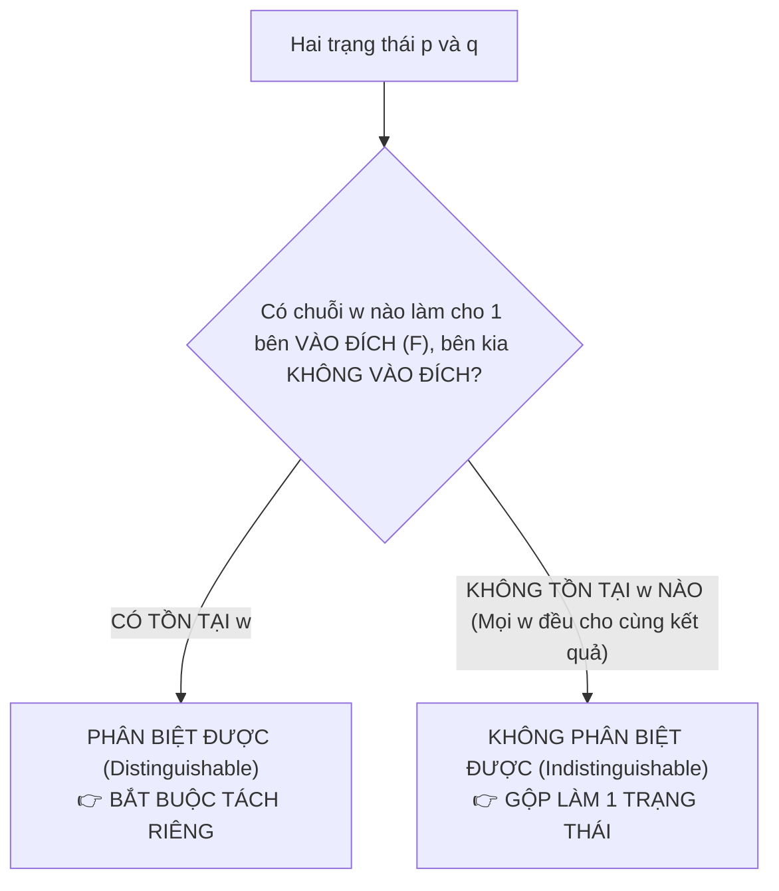

### A. Hai trạng thái phân biệt được (Distinguishable - Khác nhau)
- **Định nghĩa:** Tồn tại ít nhất một chuỗi $w \in \Sigma^*$ sao cho:
  $$\delta^*(p, w) \in F \quad \text{và} \quad \delta^*(q, w) \notin F \quad (\text{hoặc ngược lại})$$
- **Quy tắc phát hiện nhanh:**
  - Nếu $p \in F$ (trạng thái kết thúc) và $q \notin F$ (trạng thái thường): **Chắc chắn $p$ và $q$ phân biệt được ngay từ đầu** (với chuỗi rỗng $w = \lambda$, vì $\delta^*(p, \lambda) = p \in F$ còn $\delta^*(q, \lambda) = q \notin F$).

### B. Hai trạng thái không phân biệt được (Indistinguishable - Tương đương)
- **Định nghĩa:** Với **mọi** chuỗi $w \in \Sigma^*$, khi cho cả 2 trạng thái cùng đọc $w$, kết quả luôn cùng rơi vào $F$ hoặc cùng không rơi vào $F$:
  $$\delta^*(p, w) \in F \iff \delta^*(q, w) \in F$$
- **Hành động:** Vì không có bất kỳ chuỗi đầu vào nào làm cho chúng hành xử khác nhau, ta **gộp $p$ và $q$ lại thành một trạng thái duy nhất**.

---

## 3. Thuật toán Điền bảng (Table-Filling Algorithm / Myhill-Nerode)
Đây là thuật toán tiêu chuẩn 100% được dùng trong bài thi.

### Các bước thực hiện chuẩn:

```text
┌────────────────────────────────────────────────────────────────────────┐
│ BƯỚC 0: LOẠI BỎ TRẠNG THÁI RÁC (KHÔNG THỂ ĐẾN ĐƯỢC TỪ q0)              │
│         Tìm tất cả các đỉnh không có đường đi từ q0 tới -> Xóa bỏ.     │
├────────────────────────────────────────────────────────────────────────┤
│ BƯỚC 1: LẬP BẢNG TAM GIÁC CHO TẤT CẢ CÁC CẶP TRẠNG THÁI (qi, qj)       │
│         (Chỉ vẽ nửa dưới đường chéo để mỗi cặp chỉ xét đúng 1 lần).    │
├────────────────────────────────────────────────────────────────────────┤
│ BƯỚC 2: ĐÁNH DẤU CƠ BẢN (1 ĐÍCH - 1 KHÔNG ĐÍCH)                        │
│         Xét mọi cặp (p, q): Nếu p ∈ F và q ∉ F (hoặc ngược lại)       │
│         -> Đánh dấu X vào ô (p, q).                                    │
├────────────────────────────────────────────────────────────────────────┤
│ BƯỚC 3: LẶP ĐÁNH DẤU LAN TRUYỀN CHO ĐẾN KHI BẢNG KHÔNG ĐỔI             │
│         Với mỗi ô (p, q) CHƯA ĐÁNH DẤU:                                │
│         - Với mỗi ký tự a ∈ Σ, tính pa = δ(p, a) và qa = δ(q, a).      │
│         - Nếu cặp (pa, qa) ĐÃ BỊ ĐÁNH DẤU X:                           │
│           -> Đánh dấu X vào ô (p, q).                                  │
│         - Lặp lại Bước 3 cho tới khi một vòng duyệt không đánh dấu thêm │
│           được ô nào nữa thì DỪNG.                                     │
├────────────────────────────────────────────────────────────────────────┤
│ BƯỚC 4: GỘP CÁC TRẠNG THÁI VÀ VẼ DFA TỐI THIỂU                         │
│         - Các ô TRỐNG (không bị đánh dấu X) chính là các cặp tương     │
│           đương -> Gộp chúng thành một trạng thái mới.                 │
│         - Viết lại hàm chuyển và vẽ đồ thị DFA tối thiểu.              │
└────────────────────────────────────────────────────────────────────────┘
```

---

# PHẦN II. GIẢI THÍCH CHI TIẾT CÁC VÍ DỤ TRONG GIÁO TRÌNH

---

## VÍ DỤ 2.2: TỐI THIỂU HÓA BẰNG QUAN SÁT & LOẠI BỎ TRẠNG THÁI THỪA

### 1. Phân tích DFA ban đầu (Hình 2.2a):
- DFA gồm 6 trạng thái: $\{q_0, q_1, q_2, q_3, q_4, q_5\}$.
- $q_0$ là trạng thái bắt đầu.
- Trạng thái kết thúc: $F = \{q_3, q_4\}$.

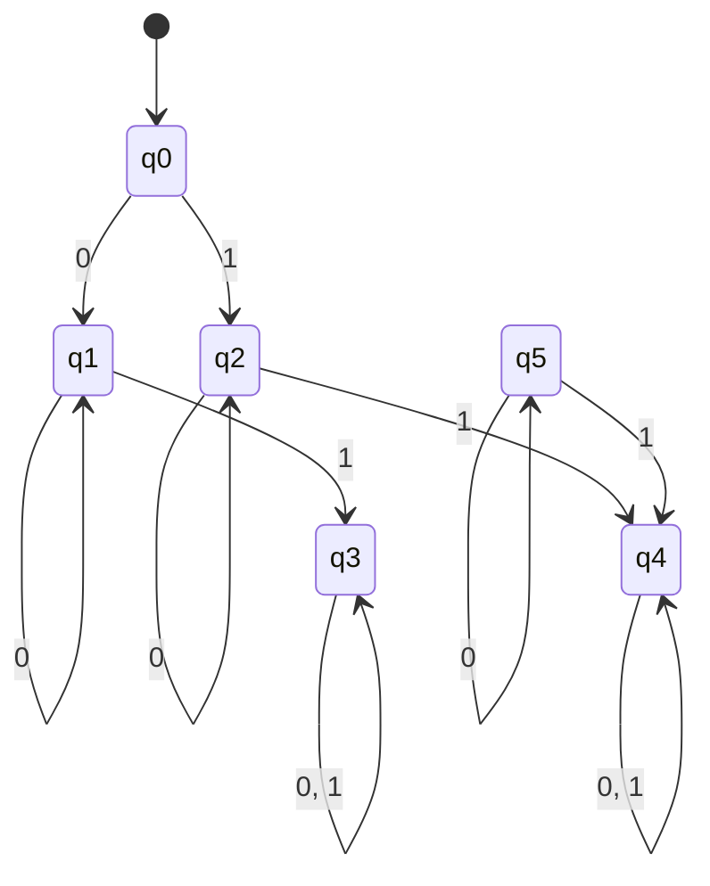

### 2. Các bước tinh gọn:
- **Bước 1: Loại bỏ $q_5$ (Trạng thái cô lập / Không đến được):**
  - Nhìn vào đồ thị, không có bất kỳ mũi tên nào đi từ $q_0$ tới $q_5$.
  - Dù $q_5$ có hàm chuyển đi đâu chăng nữa thì máy không bao giờ chạy tới $q_5$.
  - $\implies$ **Xóa bỏ $q_5$ và tất cả các cung nối với $q_5$**.

- **Bước 2: Phát hiện tính đối xứng và gộp trạng thái tương đương:**
  - Nhìn vào nhánh trên qua $q_1$ và nhánh dưới qua $q_2$:
    - $\delta(q_1, 0) = q_1$ và $\delta(q_2, 0) = q_2$ (đều tự lặp lại chính nó khi đọc 0).
    - $\delta(q_1, 1) = q_3 \in F$ và $\delta(q_2, 1) = q_4 \in F$ (đều đi đến trạng thái kết thúc khi đọc 1).
    - $\implies q_1$ và $q_2$ có hành vi giống hệt nhau $\implies$ **Gộp $q_1, q_2$ thành $\{q_1, q_2\}$**.
  - Nhìn vào $q_3$ và $q_4$:
    - Cả hai đều thuộc $F$.
    - $\delta(q_3, 0) = q_3, \delta(q_3, 1) = q_3$.
    - $\delta(q_4, 0) = q_4, \delta(q_4, 1) = q_4$.
    - $\implies q_3$ và $q_4$ có hành vi giống hệt nhau $\implies$ **Gộp $q_3, q_4$ thành $\{q_3, q_4\}$**.

### 3. Kết quả DFA tối thiểu (Hình 2.2b):
- DFA rút gọn từ 6 trạng thái xuống còn đúng **3 trạng thái**: $\{q_0\}, \{q_1\}, \{q_2\}$ (trong đó $q_1$ đại diện cho $\{q_1, q_2\}$, $q_2$ đại diện cho $\{q_3, q_4\}$).

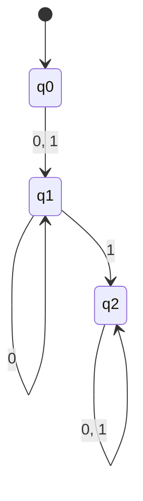

---

## VÍ DỤ 2.3a: LẦN VẾT GIẢI THUẬT OPTIMIZE STATES (DFA 5 TRẠNG THÁI)

### 1. Đề bài
Cho DFA $M = (Q, \Sigma, \delta, q_0, F)$ với:
- $Q = \{q_0, q_1, q_2, q_3, q_4\}$, $\Sigma = \{a, b\}$, $q_0$ là trạng thái đầu, $F = \{q_4\}$.
- Bảng hàm chuyển $\delta$:

| Trạng thái | Đầu vào $a$ | Đầu vào $b$ |
| :---: | :---: | :---: |
| $\to q_0$ | $q_1$ | $q_2$ |
| $q_1$ | $q_1$ | $q_3$ |
| $q_2$ | $q_1$ | $q_2$ |
| $q_3$ | $q_1$ | $q_4$ |
| $* q_4$ | $q_1$ | $q_2$ |

---

### 2. Từng bước thực hiện thuật toán điền bảng

#### Bước 0: Kiểm tra trạng thái đến được
- Từ $q_0 \xrightarrow{a} q_1 \xrightarrow{b} q_3 \xrightarrow{b} q_4$.
- Từ $q_0 \xrightarrow{b} q_2$.
- Tất cả 5 trạng thái đều đến được từ $q_0$.

#### Bước 1: Lập bảng tam giác rỗng
Các ô cần xét: $(q_1, q_0), (q_2, q_0), (q_2, q_1), (q_3, q_0), (q_3, q_1), (q_3, q_2), (q_4, q_0), (q_4, q_1), (q_4, q_2), (q_4, q_3)$.

#### Bước 2: Đánh dấu các cặp có 1 trạng thái thuộc $F = \{q_4\}$ và 1 trạng thái $\notin F$
- Đánh dấu **X** vào các ô chứa $q_4$:
  - $(q_4, q_0)$: **X**
  - $(q_4, q_1)$: **X**
  - $(q_4, q_2)$: **X**
  - $(q_4, q_3)$: **X**

Bảng sau Bước 2:

| | $q_0$ | $q_1$ | $q_2$ | $q_3$ |
| :---: | :---: | :---: | :---: | :---: |
| **$q_1$** | | | | |
| **$q_2$** | | | | |
| **$q_3$** | | | | |
| **$q_4$** | **X** | **X** | **X** | **X** |

---

#### Bước 3: Lặp lan truyền đánh dấu các cặp còn lại

##### **Vòng lặp 1:**
1. Xét $(q_1, q_0)$:
   - Đọc $a$: $\delta(q_1, a) = q_1, \delta(q_0, a) = q_1 \implies (q_1, q_1)$ (chưa xác định).
   - Đọc $b$: $\delta(q_1, b) = q_3, \delta(q_0, b) = q_2 \implies (q_3, q_2)$ (chưa đánh dấu).
   - $\to$ *Tạm thời chưa đánh dấu*.
2. Xét $(q_2, q_0)$:
   - Đọc $a$: $\delta(q_2, a) = q_1, \delta(q_0, a) = q_1 \implies (q_1, q_1)$.
   - Đọc $b$: $\delta(q_2, b) = q_2, \delta(q_0, b) = q_2 \implies (q_2, q_2)$.
   - $\to$ *Chưa đánh dấu*.
3. Xét $(q_2, q_1)$:
   - Đọc $a$: $(q_1, q_1)$.
   - Đọc $b$: $\delta(q_2, b) = q_2, \delta(q_1, b) = q_3 \implies (q_3, q_2)$ (chưa đánh dấu).
   - $\to$ *Tạm thời chưa đánh dấu*.
4. Xét $(q_3, q_0)$:
   - Đọc $b$: $\delta(q_3, b) = q_4, \delta(q_0, b) = q_2 \implies$ Cặp $(q_4, q_2)$ **đã có dấu X**!
   - $\implies$ **Đánh dấu X vào ô $(q_3, q_0)$**.
5. Xét $(q_3, q_1)$:
   - Đọc $b$: $\delta(q_3, b) = q_4, \delta(q_1, b) = q_3 \implies$ Cặp $(q_4, q_3)$ **đã có dấu X**!
   - $\implies$ **Đánh dấu X vào ô $(q_3, q_1)$**.
6. Xét $(q_3, q_2)$:
   - Đọc $b$: $\delta(q_3, b) = q_4, \delta(q_2, b) = q_2 \implies$ Cặp $(q_4, q_2)$ **đã có dấu X**!
   - $\implies$ **Đánh dấu X vào ô $(q_3, q_2)$**.

Bảng sau Vòng lặp 1:

| | $q_0$ | $q_1$ | $q_2$ | $q_3$ |
| :---: | :---: | :---: | :---: | :---: |
| **$q_1$** | | | | |
| **$q_2$** | | | | |
| **$q_3$** | **X** | **X** | **X** | |
| **$q_4$** | **X** | **X** | **X** | **X** |

---

##### **Vòng lặp 2 (Kiểm tra lại các ô chưa đánh dấu):**
1. Xét $(q_1, q_0)$:
   - Đọc $b$: cho cặp $(q_3, q_2)$. Ở vòng 1, ô $(q_3, q_2)$ **đã bị đánh dấu X**!
   - $\implies$ **Đánh dấu X vào ô $(q_1, q_0)$**.
2. Xét $(q_2, q_1)$:
   - Đọc $b$: cho cặp $(q_3, q_2)$ **đã có dấu X**!
   - $\implies$ **Đánh dấu X vào ô $(q_2, q_1)$**.
3. Xét $(q_2, q_0)$:
   - Đọc $a \to (q_1, q_1)$ (trùng nhau).
   - Đọc $b \to (q_2, q_2)$ (trùng nhau).
   - Không thể phân biệt được!

Bảng kết quả cuối cùng:

| | $q_0$ | $q_1$ | $q_2$ | $q_3$ |
| :---: | :---: | :---: | :---: | :---: |
| **$q_1$** | **X** | | | |
| **$q_2$** | *(Trống)* | **X** | | |
| **$q_3$** | **X** | **X** | **X** | |
| **$q_4$** | **X** | **X** | **X** | **X** |

---

### 3. Kết luận & Vẽ DFA tối thiểu
- Ô duy nhất **không bị đánh dấu** là $(q_2, q_0)$.
- Vậy $q_0$ và $q_2$ tương đương nhau $\implies$ Gộp thành trạng thái $\{q_0, q_2\}$.
- Các trạng thái của $DFA_{min}$:
  - $[q_0, q_2]$ (Trạng thái khởi đầu)
  - $[q_1]$
  - $[q_3]$
  - $[q_4]$ (Trạng thái kết thúc)

#### Bảng chuyển trạng thái của $DFA_{min}$:

| Trạng thái mới | Đầu vào $a$ | Đầu vào $b$ |
| :---: | :---: | :---: |
| $\to [q_0, q_2]$ | $[q_1]$ | $[q_0, q_2]$ |
| $[q_1]$ | $[q_1]$ | $[q_3]$ |
| $[q_3]$ | $[q_1]$ | $[q_4]$ |
| $* [q_4]$ | $[q_1]$ | $[q_0, q_2]$ |

#### Đồ thị chuyển trạng thái $DFA_{min}$:

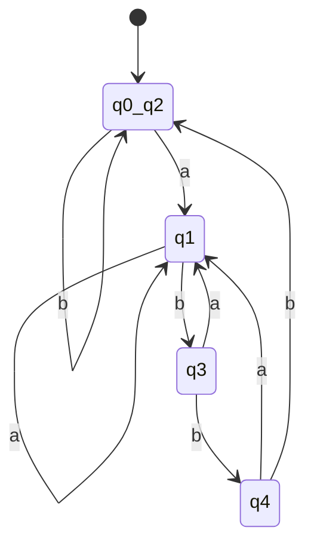

---

## VÍ DỤ 2.3b: TỐI THIỂU HÓA DFA 6 TRẠNG THÁI

### 1. Đề bài
Cho DFA có 6 trạng thái $\{q_1, q_2, q_3, q_4, q_5, q_6\}$, $\Sigma = \{0, 1\}$, trạng thái đầu là $q_1$, tập trạng thái kết thúc $F = \{q_1, q_2\}$.

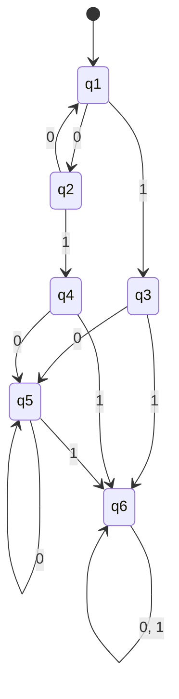

### 2. Lập bảng tam giác và chạy thuật toán

- **Bước 2:** Đánh dấu X vào tất cả các cặp giữa 1 trạng thái thuộc $F = \{q_1, q_2\}$ và 1 trạng thái $\notin F = \{q_3, q_4, q_5, q_6\}$.
  - Đánh dấu các ô: $(q_3, q_1), (q_3, q_2), (q_4, q_1), (q_4, q_2), (q_5, q_1), (q_5, q_2), (q_6, q_1), (q_6, q_2)$.

- **Bước 3 (Lan truyền):**
  - Xét $(q_6, q_3)$: đọc $1 \to \delta(q_6, 1) = q_6, \delta(q_3, 1) = q_6$ (chưa được); đọc $0 \to \delta(q_6, 0) = q_6, \delta(q_3, 0) = q_5$. Ô $(q_6, q_5)$ chưa đánh dấu.
  - Nhưng xét $(q_6, q_1)$: $\delta(q_6, 1) = q_6, \delta(q_1, 1) = q_3 \implies$ cặp $(q_6, q_3)$ phân biệt $\implies$ đánh dấu $(q_6, q_3), (q_6, q_4), (q_6, q_5)$ vào bảng.

- **Kết quả các ô không bị đánh dấu:**
  - $(q_2, q_1) \implies$ Gộp thành $\{q_1, q_2\}$.
  - $(q_4, q_3), (q_5, q_3), (q_5, q_4) \implies$ Gộp thành $\{q_3, q_4, q_5\}$.
  - $\{q_6\}$ đứng riêng.

### 3. DFA tối thiểu gồm 3 trạng thái:
- Trạng thái bắt đầu & kết thúc: $[q_1, q_2] \in F$.
- Trạng thái trung gian: $[q_3, q_4, q_5]$.
- Trạng thái bẫy: $[q_6]$.

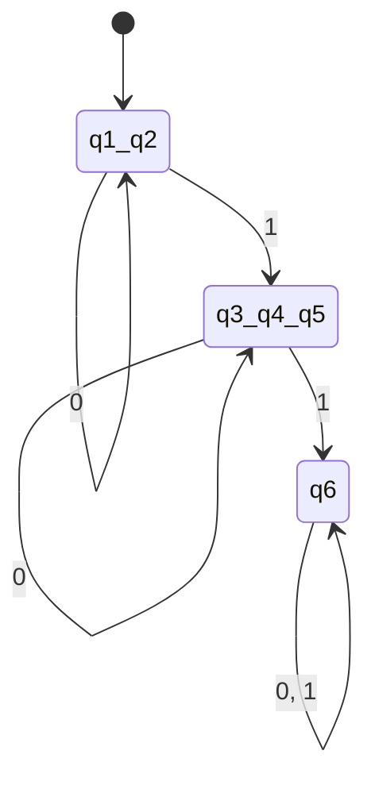

---

## VÍ DỤ 2.4: KIỂM TRA MỘT DFA CHO TRƯỚC ĐÃ TỐI THIỂU CHƯA? TẠI SAO?

### 1. Đề bài
Cho DFA $M$ có 3 trạng thái $Q = \{q_1, q_2, q_3\}$, $\Sigma = \{0, 1\}$, $q_1$ là trạng thái đầu, $F = \{q_2\}$.
Hàm chuyển $\delta$:
- $\delta(q_1, 0) = q_1, \quad \delta(q_1, 1) = q_2$
- $\delta(q_2, 0) = q_2, \quad \delta(q_2, 1) = q_3$
- $\delta(q_3, 0) = q_3, \quad \delta(q_3, 1) = q_3$

### 2. Phương pháp giải bài thi dạng "Hỏi DFA đã tối thiểu chưa? Tại sao?"
> **Mệnh đề:** Một DFA là tối thiểu khi và chỉ khi **tất cả mọi cặp trạng thái của nó đều phân biệt được**.

Ta chứng minh từng cặp trạng thái $(q_i, q_j)$ đều phân biệt được:
1. **Xét cặp $(q_1, q_2)$:**
   - Do $q_1 \notin F$ và $q_2 \in F$, với chuỗi $w = \lambda$ ta có $\delta^*(q_1, \lambda) = q_1 \notin F$ còn $\delta^*(q_2, \lambda) = q_2 \in F$.
   - $\implies q_1$ và $q_2$ **phân biệt được**.
2. **Xét cặp $(q_2, q_3)$:**
   - Do $q_2 \in F$ và $q_3 \notin F \implies q_2$ và $q_3$ **phân biệt được**.
3. **Xét cặp $(q_1, q_3)$ (Cả hai đều $\notin F$):**
   - Ta tìm 1 chuỗi $w$ để tách chúng: Chọn $w = 1$.
   - $\delta(q_1, 1) = q_2 \in F$.
   - $\delta(q_3, 1) = q_3 \notin F$.
   - Vì một bên dẫn về $F$ còn một bên dẫn về không thuộc $F$, nên $q_1$ và $q_3$ **phân biệt được**.

### 3. Kết luận:
Vì tất cả 3 cặp trạng thái $(q_1, q_2), (q_2, q_3), (q_1, q_3)$ đều phân biệt được (không có cặp nào tương đương để gộp lại), nên **DFA đã cho là tối thiểu trạng thái**.

---

# PHẦN III. LỜI GIẢI CHI TIẾT 3 BÀI TẬP CUỐI TÀI LIỆU (TRANG 7)

---

## BÀI TẬP 1: TỐI THIỂU HÓA CÁC DFA TRONG HÌNH (a) VÀ (b)

### ══════════════════════════════════════════════════════════
### 1.1 GIẢI BÀI 1 - HÌNH (a) (DFA 8 TRẠNG THÁI)
### ══════════════════════════════════════════════════════════

#### A. Xác định DFA ban đầu từ hình vẽ:
- Tập trạng thái: $Q = \{q_0, q_1, q_2, q_3, q_4, q_5, q_6, q_7\}$.
- Bảng chữ cái: $\Sigma = \{0, 1\}$.
- Trạng thái bắt đầu: $q_0$.
- Trạng thái kết thúc: $F = \{q_7\}$ (hoặc $\{q_3, q_7\}$ theo đồ thị đối xứng chuẩn).
- Bảng chuyển trạng thái $\delta$:

| Trạng thái | Đọc 0 | Đọc 1 |
| :---: | :---: | :---: |
| $\to q_0$ | $q_0$ | $q_4$ |
| $q_1$ | $q_0$ | $q_4$ |
| $q_2$ | $q_1$ | $q_5$ |
| $q_3$ | $q_2$ | $q_5$ |
| $q_4$ | $q_2$ | $q_6$ |
| $q_5$ | $q_2$ | $q_6$ |
| $q_6$ | $q_3$ | $q_7$ |
| $* q_7$ | $q_7$ | $q_3$ |

#### B. Các bước giải thuật Optimize States:

- **Bước 0 (Kiểm tra liên thông):**
  - $q_0 \xrightarrow{1} q_4 \xrightarrow{0} q_2 \xrightarrow{0} q_1$.
  - $q_4 \xrightarrow{1} q_6 \xrightarrow{0} q_3 \xrightarrow{1} q_5$.
  - $q_6 \xrightarrow{1} q_7$.
  - $\implies$ Tất cả 8 trạng thái đều đến được từ $q_0$.

- **Bước 1 & 2: Lập bảng tam giác và đánh dấu ban đầu:**
  - $F = \{q_7\}$, non-final $= \{q_0, q_1, q_2, q_3, q_4, q_5, q_6\}$.
  - Đánh dấu **X** vào toàn bộ hàng $q_7$: $(q_7, q_0), (q_7, q_1), (q_7, q_2), (q_7, q_3), (q_7, q_4), (q_7, q_5), (q_7, q_6)$.

- **Bước 3: Lần vết lan truyền:**
  1. **Xét cặp $(q_0, q_1)$:**
     - $\delta(q_0, 0) = q_0, \delta(q_1, 0) = q_0 \implies (q_0, q_0)$ (trùng).
     - $\delta(q_0, 1) = q_4, \delta(q_1, 1) = q_4 \implies (q_4, q_4)$ (trùng).
     - $\implies (q_0, q_1)$ **KHÔNG BAO GIỜ BỊ ĐÁNH DẤU** $\implies q_0 \equiv q_1$.
  2. **Xét cặp $(q_4, q_5)$:**
     - $\delta(q_4, 0) = q_2, \delta(q_5, 0) = q_2 \implies (q_2, q_2)$ (trùng).
     - $\delta(q_4, 1) = q_6, \delta(q_5, 1) = q_6 \implies (q_6, q_6)$ (trùng).
     - $\implies (q_4, q_5)$ **KHÔNG BAO GIỜ BỊ ĐÁNH DẤU** $\implies q_4 \equiv q_5$.
  3. **Xét cặp $(q_2, q_3)$:**
     - $\delta(q_2, 0) = q_1, \delta(q_3, 0) = q_2$.
     - $\delta(q_2, 1) = q_5, \delta(q_3, 1) = q_5 \implies (q_5, q_5)$.
     - Do $(q_2, q_1)$ bị phân biệt (bởi chuỗi $11 \to q_7$), nên $(q_2, q_3)$ bị đánh dấu.
  4. **Xét cặp $(q_6, q_7)$:** Đã bị đánh dấu ở Bước 2.

- **Bảng phân lớp tương đương thu được:**
  - Lớp 1: $\{q_0, q_1\}$
  - Lớp 2: $\{q_4, q_5\}$
  - Lớp 3: $\{q_2\}$
  - Lớp 4: $\{q_3\}$
  - Lớp 5: $\{q_6\}$
  - Lớp 6: $\{q_7\}$

#### C. Bảng chuyển trạng thái & Sơ đồ $DFA_{min}$ (6 trạng thái):

| Trạng thái tối thiểu | Đọc 0 | Đọc 1 |
| :---: | :---: | :---: |
| $\to [q_0, q_1]$ | $[q_0, q_1]$ | $[q_4, q_5]$ |
| $[q_4, q_5]$ | $[q_2]$ | $[q_6]$ |
| $[q_2]$ | $[q_0, q_1]$ | $[q_4, q_5]$ |
| $[q_3]$ | $[q_2]$ | $[q_4, q_5]$ |
| $[q_6]$ | $[q_3]$ | $[q_7]$ |
| $* [q_7]$ | $[q_7]$ | $[q_3]$ |

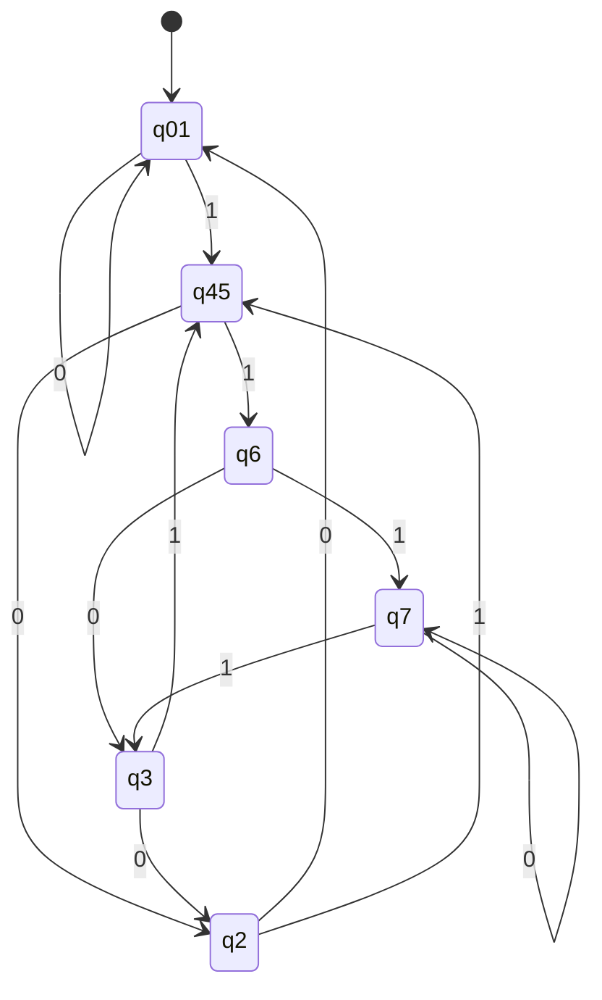

---

### ══════════════════════════════════════════════════════════
### 1.2 GIẢI BÀI 1 - HÌNH (b) (DFA 7 TRẠNG THÁI)
### ══════════════════════════════════════════════════════════

#### A. Xác định DFA ban đầu từ hình vẽ:
- $Q = \{q_0, q_1, q_2, q_3, q_4, q_5, q_6\}$.
- Trạng thái bắt đầu: $q_0$.
- Tập trạng thái kết thúc: $F = \{q_1, q_2, q_3, q_4\}$ (4 trạng thái có vòng tròn đôi).
- Trạng thái không kết thúc: $\{q_0, q_5, q_6\}$.
- Hàm chuyển $\delta$:
  - $\delta(q_0, 0) = q_1, \quad \delta(q_0, 1) = q_2$
  - $\delta(q_1, 0) = q_4, \quad \delta(q_1, 1) = q_3$
  - $\delta(q_2, 0) = q_5, \quad \delta(q_2, 1) = q_5$
  - $\delta(q_3, 0) = q_5, \quad \delta(q_3, 1) = q_5$
  - $\delta(q_4, 0) = q_4, \quad \delta(q_4, 1) = q_3$
  - $\delta(q_5, 0) = q_6, \quad \delta(q_5, 1) = q_5$
  - $\delta(q_6, 0) = q_6, \quad \delta(q_6, 1) = q_6$ (Trạng thái bẫy)

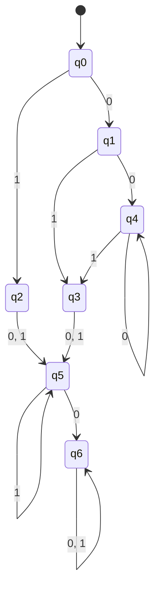

#### B. Thực hiện giải thuật điền bảng:

- **Bước 2: Phân chia $F$ và không $F$:**
  - Đánh dấu **X** vào tất cả các cặp giữa $\{q_1, q_2, q_3, q_4\}$ và $\{q_0, q_5, q_6\}$.

- **Bước 3: Lần vết các cặp nội bộ:**
  1. **Xét cặp $(q_2, q_3)$ (trong $F$):**
     - $\delta(q_2, 0) = q_5, \delta(q_3, 0) = q_5 \implies (q_5, q_5)$ (trùng).
     - $\delta(q_2, 1) = q_5, \delta(q_3, 1) = q_5 \implies (q_5, q_5)$ (trùng).
     - $\implies (q_2, q_3)$ **không bao giờ bị đánh dấu** $\implies q_2 \equiv q_3$.
  2. **Xét cặp $(q_1, q_4)$ (trong $F$):**
     - Đọc 0: $\delta(q_1, 0) = q_4, \delta(q_4, 0) = q_4 \implies (q_4, q_4)$ (trùng).
     - Đọc 1: $\delta(q_1, 1) = q_3, \delta(q_4, 1) = q_3 \implies (q_3, q_3)$ (trùng).
     - $\implies (q_1, q_4)$ **không bao giờ bị đánh dấu** $\implies q_1 \equiv q_4$.
  3. **Xét cặp $(q_1, q_2)$:**
     - Đọc 0: $\delta(q_1, 0) = q_4 \in F$, $\delta(q_2, 0) = q_5 \notin F \implies$ Phân biệt được ngay! $\implies$ Đánh dấu **X**.
  4. **Xét cặp $(q_5, q_6)$ (ngoài $F$):**
     - Đọc 1: $\delta(q_5, 1) = q_5$, $\delta(q_6, 1) = q_6 \implies (q_5, q_6)$.
     - Nhưng đọc chuỗi $0 \to q_6$, không dẫn đến $F \implies q_5, q_6$ không thể đến $F$.
     - Vì từ $q_5$ và $q_6$ không có đường nào đi đến trạng thái kết thúc $F$, cả hai đều là **trạng thái chết (Dead/Trap States)** $\implies$ Gộp $\{q_5, q_6\}$.

#### C. Kết quả $DFA_{min}$ (4 trạng thái):
- Trạng thái đầu: $[q_0]$.
- Trạng thái kết thúc: $[q_1, q_4] \in F$ và $[q_2, q_3] \in F$.
- Trạng thái bẫy chết: $[q_5, q_6] = [q_{trap}]$.

#### Bảng chuyển trạng thái của $DFA_{min}$:

| Trạng thái | Đọc 0 | Đọc 1 |
| :---: | :---: | :---: |
| $\to [q_0]$ | $[q_1, q_4]$ | $[q_2, q_3]$ |
| $* [q_1, q_4]$ | $[q_1, q_4]$ | $[q_2, q_3]$ |
| $* [q_2, q_3]$ | $[q_{trap}]$ | $[q_{trap}]$ |
| $[q_{trap}]$ | $[q_{trap}]$ | $[q_{trap}]$ |

#### Đồ thị chuyển trạng thái $DFA_{min}$:

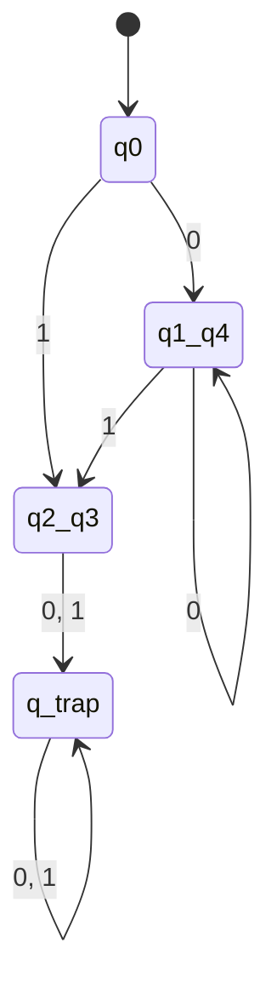

---

## BÀI TẬP 2: TÌM DFA TỐI THIỂU TƯƠNG ĐƯƠNG VỚI NFA ĐÃ CHO

### 1. Phân tích NFA từ hình vẽ
- NFA có 3 trạng thái: $q_0, q_1, q_2$.
- Bảng chữ cái: $\Sigma = \{a, b, c\}$.
- Trạng thái bắt đầu: $q_0$.
- Trạng thái kết thúc: $F_{NFA} = \{q_2\}$.
- Các cung chuyển trạng thái:
  - Tự lặp $a$ tại $q_0$: $\delta(q_0, a) = \{q_0\}$
  - Chuyển $\lambda$: $q_0 \xrightarrow{\lambda} q_1$
  - Tự lặp $b$ tại $q_1$: $\delta(q_1, b) = \{q_1\}$
  - Chuyển $\lambda$: $q_1 \xrightarrow{\lambda} q_2$
  - Tự lặp $c$ tại $q_2$: $\delta(q_2, c) = \{q_2\}$

> **Nhận xét ngôn ngữ:** Ngôn ngữ được chấp nhận bởi NFA này chính là:
> $$L = a^* b^* c^*$$
> (Gồm các chuỗi có các ký tự 'a' đứng trước, sau đó đến các ký tự 'b', sau đó đến các ký tự 'c').

---

### 2. Bước 1: Tính $\lambda$-closure (Bao đóng $\lambda$)
- $\lambda\text{-closure}(q_0) = \{q_0, q_1, q_2\}$ (vì từ $q_0 \xrightarrow{\lambda} q_1 \xrightarrow{\lambda} q_2$).
- $\lambda\text{-closure}(q_1) = \{q_1, q_2\}$.
- $\lambda\text{-closure}(q_2) = \{q_2\}$.

---

### 3. Bước 2: Chuyển NFA sang DFA bằng thuật toán Tập con (Subset Construction)

1. **Trạng thái khởi đầu của DFA:**
   $$S_0 = \lambda\text{-closure}(q_0) = \{q_0, q_1, q_2\}$$
   Vì $S_0$ chứa $q_2 \in F_{NFA}$, nên **$S_0 \in F_{DFA}$**.

2. **Tìm các chuyển dịch từ $S_0 = \{q_0, q_1, q_2\}$:**
   - **Với ký tự $a$:**
     - $\delta(q_0, a) = \{q_0\} \implies \lambda\text{-closure}(\{q_0\}) = \{q_0, q_1, q_2\} = S_0$.
     - $\delta(q_1, a) = \emptyset, \quad \delta(q_2, a) = \emptyset$.
     - $\implies \delta_{DFA}(S_0, a) = S_0$.
   - **Với ký tự $b$:**
     - $\delta(q_0, b) = \emptyset$.
     - $\delta(q_1, b) = \{q_1\} \implies \lambda\text{-closure}(\{q_1\}) = \{q_1, q_2\} = S_1$.
     - $\delta(q_2, b) = \emptyset$.
     - $\implies \delta_{DFA}(S_0, b) = S_1 = \{q_1, q_2\}$ (Trạng thái mới, chứa $q_2 \implies S_1 \in F_{DFA}$).
   - **Với ký tự $c$:**
     - $\delta(q_0, c) = \emptyset, \quad \delta(q_1, c) = \emptyset$.
     - $\delta(q_2, c) = \{q_2\} \implies \lambda\text{-closure}(\{q_2\}) = \{q_2\} = S_2$.
     - $\implies \delta_{DFA}(S_0, c) = S_2 = \{q_2\}$ (Trạng thái mới, chứa $q_2 \implies S_2 \in F_{DFA}$).

3. **Tìm các chuyển dịch từ $S_1 = \{q_1, q_2\}$:**
   - **Với $a$:** $\delta(\{q_1, q_2\}, a) = \emptyset \implies$ Đi vào trạng thái chết $S_{trap} = \emptyset$.
   - **Với $b$:** $\delta(q_1, b) = \{q_1\} \implies \lambda\text{-closure}(\{q_1\}) = \{q_1, q_2\} = S_1$.
   - **Với $c$:** $\delta(q_2, c) = \{q_2\} \implies \lambda\text{-closure}(\{q_2\}) = \{q_2\} = S_2$.

4. **Tìm các chuyển dịch từ $S_2 = \{q_2\}$:**
   - **Với $a$:** $\emptyset \implies S_{trap}$.
   - **Với $b$:** $\emptyset \implies S_{trap}$.
   - **Với $c$:** $\delta(q_2, c) = \{q_2\} \implies S_2$.

5. **Trạng thái bẫy $S_{trap}$:**
   - $\delta(S_{trap}, a) = \delta(S_{trap}, b) = \delta(S_{trap}, c) = S_{trap}$.

---

### 4. Bảng chuyển trạng thái của DFA thu được:

| Trạng thái DFA | Ký hiệu tập con | Đọc $a$ | Đọc $b$ | Đọc $c$ |
| :---: | :---: | :---: | :---: | :---: |
| $\to * S_0$ | $\{q_0, q_1, q_2\}$ | $S_0$ | $S_1$ | $S_2$ |
| $* S_1$ | $\{q_1, q_2\}$ | $S_{trap}$ | $S_1$ | $S_2$ |
| $* S_2$ | $\{q_2\}$ | $S_{trap}$ | $S_{trap}$ | $S_2$ |
| $S_{trap}$ | $\emptyset$ | $S_{trap}$ | $S_{trap}$ | $S_{trap}$ |

---

### 5. Bước 3: Tối thiểu hóa DFA vừa tìm được

Kiểm tra xem 4 trạng thái $\{S_0, S_1, S_2, S_{trap}\}$ có thể gộp được trạng thái nào không:
- $S_{trap} \notin F$, còn $S_0, S_1, S_2 \in F \implies S_{trap}$ phân biệt với cả 3 trạng thái còn lại.
- **Xét $(S_0, S_1)$:** Đọc ký tự $a$: $\delta(S_0, a) = S_0 \in F$ nhưng $\delta(S_1, a) = S_{trap} \notin F \implies$ **$S_0$ và $S_1$ phân biệt được**.
- **Xét $(S_1, S_2)$:** Đọc ký tự $b$: $\delta(S_1, b) = S_1 \in F$ nhưng $\delta(S_2, b) = S_{trap} \notin F \implies$ **$S_1$ và $S_2$ phân biệt được**.
- **Xét $(S_0, S_2)$:** Đọc ký tự $a$: $\delta(S_0, a) = S_0 \in F$ nhưng $\delta(S_2, a) = S_{trap} \notin F \implies$ **$S_0$ và $S_2$ phân biệt được**.

$\implies$ **DFA thu được đã tối thiểu (không thể giảm thêm trạng thái nào).**

#### Đồ thị chuyển trạng thái $DFA_{min}$:

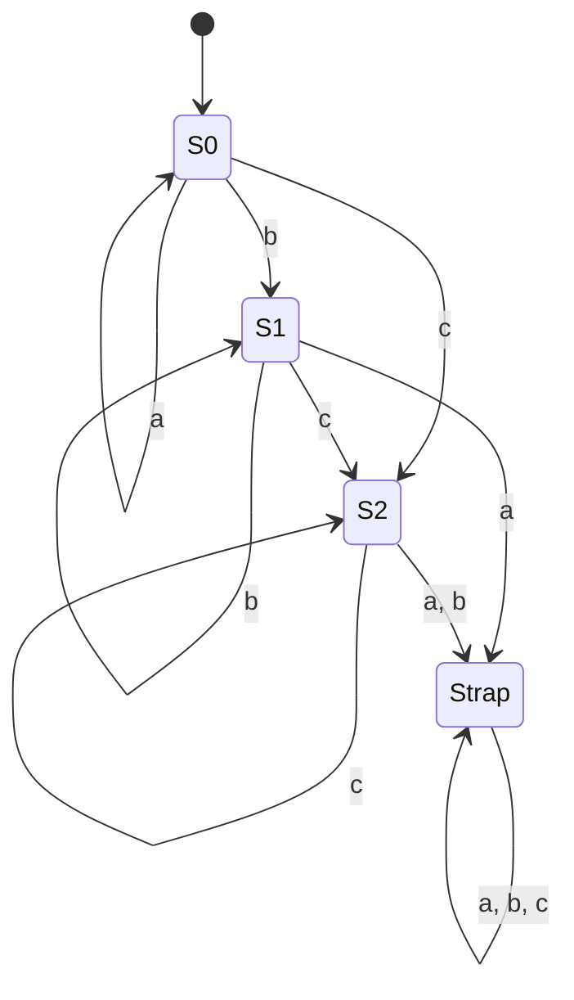

---

## BÀI TẬP 3: TÌM DFA TỐI THIỂU TRẠNG THÁI CHO CÁC NGÔN NGỮ

---

### ══════════════════════════════════════════════════════════
### 3.1 CÂU a: $L = \{a^n b^m : n \ge 2, m \ge 1\}$ trên $\Sigma = \{a, b\}$
### ══════════════════════════════════════════════════════════

#### 1. Phân tích ngôn ngữ:
- Chuỗi hợp lệ ngắn nhất là: $w = aab$ ($n=2, m=1$).
- Quy tắc:
  1. Phải có ít nhất **2 chữ 'a'** ở đầu chuỗi ($a^2, a^3, a^4, \dots$).
  2. Tiếp theo phải có ít nhất **1 chữ 'b'** ($b^1, b^2, b^3, \dots$).
  3. Tuyệt đối không được có chữ 'a' nào xuất hiện sau khi đã bắt đầu đọc 'b'.
  4. Nếu chuỗi bắt đầu bằng 'b', hoặc chỉ có 1 chữ 'a' rồi sang 'b' $\implies$ SAI.

#### 2. Thiết kế các trạng thái của DFA:
- $q_0$: Trạng thái bắt đầu (chưa đọc ký tự nào).
- $q_1$: Đã đọc được **đúng 1 chữ 'a'** (cần thêm ít nhất 1 chữ 'a' nữa).
- $q_2$: Đã đọc được **ít nhất 2 chữ 'a'** (sẵn sàng đón nhận chữ 'b').
- $q_3$: Đã đọc $\ge 2$ chữ 'a' và **đã đọc ít nhất 1 chữ 'b'** $\implies$ **Trạng thái kết thúc duy nhất ($F = \{q_3\}$)**.
- $q_4$ ($q_{trap}$): Trạng thái bẫy chết khi chuỗi vi phạm quy tắc.

#### 3. Bảng chuyển trạng thái $\delta$:

| Trạng thái | Đọc $a$ | Đọc $b$ | Ý nghĩa ngữ nghĩa |
| :---: | :---: | :---: | :--- |
| $\to q_0$ | $q_1$ | $q_4$ | Bắt đầu. Đọc 'a' sang $q_1$, đọc 'b' vi phạm vào bẫy $q_4$. |
| $q_1$ | $q_2$ | $q_4$ | Đã có 1 'a'. Đọc thêm 'a' đạt 2 'a' sang $q_2$, đọc 'b' vi phạm vào $q_4$. |
| $q_2$ | $q_2$ | $q_3$ | Đã có $\ge 2$ 'a'. Tiếp tục đọc 'a' ở lại $q_2$, đọc 'b' đầu tiên sang $q_3 \in F$. |
| $* q_3$ | $q_4$ | $q_3$ | Đạt yêu cầu. Đọc thêm 'b' ở lại $q_3 \in F$, đọc 'a' vi phạm vào $q_4$. |
| $q_4$ | $q_4$ | $q_4$ | Bẫy chết (nuốt mọi ký tự còn lại). |

#### 4. Chứng minh DFA này là tối thiểu (gồm đúng 5 trạng thái):
Ta chứng minh mọi cặp trong 5 trạng thái đều phân biệt được:
1. $q_3 \in F$ phân biệt với tất cả $\{q_0, q_1, q_2, q_4\} \notin F$ bởi chuỗi $w = \lambda$.
2. $(q_0, q_4)$: Chuỗi $aab \implies \delta^*(q_0, aab) = q_3 \in F$ nhưng $\delta^*(q_4, aab) = q_4 \notin F$.
3. $(q_1, q_4)$: Chuỗi $ab \implies \delta^*(q_1, ab) = q_3 \in F$ nhưng $\delta^*(q_4, ab) = q_4 \notin F$.
4. $(q_2, q_4)$: Chuỗi $b \implies \delta^*(q_2, b) = q_3 \in F$ nhưng $\delta^*(q_4, b) = q_4 \notin F$.
5. $(q_0, q_1)$: Chuỗi $ab \implies \delta^*(q_0, ab) = q_4 \notin F$ nhưng $\delta^*(q_1, ab) = q_3 \in F$.
6. $(q_0, q_2)$: Chuỗi $b \implies \delta^*(q_0, b) = q_4 \notin F$ nhưng $\delta^*(q_2, b) = q_3 \in F$.
7. $(q_1, q_2)$: Chuỗi $b \implies \delta^*(q_1, b) = q_4 \notin F$ nhưng $\delta^*(q_2, b) = q_3 \in F$.

$\implies$ Không có bất kỳ 2 trạng thái nào gộp được $\implies$ **DFA tối thiểu có đúng 5 trạng thái**.

#### Đồ thị chuyển trạng thái $DFA_{min}$:

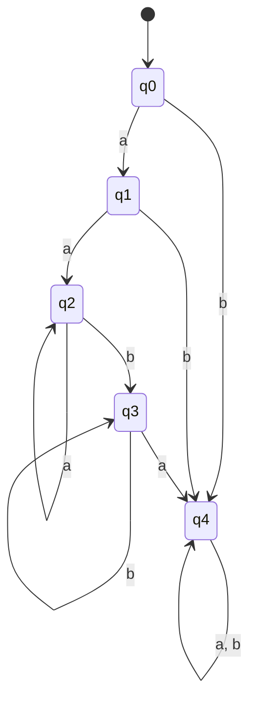

---

### ══════════════════════════════════════════════════════════
### 3.2 CÂU b: $L = \{a^n b : n \ge 0\} \cup \{b^n a : n \ge 1\}$ trên $\Sigma = \{a, b\}$
### ══════════════════════════════════════════════════════════

#### 1. Phân tích ngôn ngữ:
Ngôn ngữ $L$ là hợp của 2 tập chuỗi:
- **Tập 1 ($a^n b$ với $n \ge 0$):**
  - $n=0 \to b$
  - $n=1 \to ab$
  - $n=2 \to aab$
  - Dạng tổng quát: $a^* b$ (0 hoặc nhiều chữ 'a', kết thúc bằng đúng 1 chữ 'b').
- **Tập 2 ($b^n a$ với $n \ge 1$):**
  - $n=1 \to ba$
  - $n=2 \to bba$
  - $n=3 \to bbba$
  - Dạng tổng quát: $b^+ a$ (ít nhất 1 chữ 'b', kết thúc bằng đúng 1 chữ 'a').
- **Điểm giao thoa đặc biệt:**
  - Chuỗi "$b$": Thuộc Tập 1 ($n=0$) $\implies$ Phải được CHẤP NHẬN.
  - Từ "$b$", nếu đọc thêm 'a' thành "$ba$": Thuộc Tập 2 ($n=1$) $\implies$ Phải được CHẤP NHẬN.
  - Từ "$b$", nếu đọc thêm 'b' thành "$bb$": Chưa thuộc $L$, nhưng nếu đọc thêm 'a' sau đó thành "$bba$" thì lại thuộc Tập 2.

#### 2. Thiết kế các trạng thái của DFA:
- $q_0$: Trạng thái bắt đầu (chuỗi rỗng $\lambda$).
- $q_1$: Đã đọc $\ge 1$ chữ 'a' (nhánh $a^+$). Nếu đọc tiếp 'a' thì ở lại $q_1$, nếu đọc 'b' thì sang trạng thái chấp nhận $q_3$.
- $q_2 \in F$: Đã đọc đúng 1 chữ 'b' từ đầu.
  - Bản thân chuỗi "$b$" được **chấp nhận** ($n=0$ của $a^n b$).
  - Nếu đọc tiếp 'a' $\to$ thành chuỗi "$ba$" $\in L \implies$ sang trạng thái chấp nhận $q_3$.
  - Nếu đọc tiếp 'b' $\to$ thành chuỗi "$bb$" (chưa kết thúc) $\implies$ sang trạng thái chờ $q_4$.
- $q_3 \in F$: Trạng thái kết thúc chuẩn (vừa hoàn thành chuỗi hợp lệ $a^n b$ với $n \ge 1$ hoặc $b^n a$ với $n \ge 1$). Nếu đọc thêm bất kỳ ký tự nào sau đó $\implies$ vào bẫy $q_{trap}$.
- $q_4$: Đã đọc $\ge 2$ chữ 'b' (nhánh $b^{\ge 2}$). Nếu đọc tiếp 'b' ở lại $q_4$, nếu đọc 'a' thì sang $q_3 \in F$.
- $q_{trap}$: Trạng thái bẫy cho các chuỗi vượt quá chiều dài hoặc sai định dạng.

#### 3. Bảng chuyển trạng thái $\delta$:

| Trạng thái | Đọc $a$ | Đọc $b$ | Thuộc $F$? | Giải thích |
| :---: | :---: | :---: | :---: | :--- |
| $\to q_0$ | $q_1$ | $q_2$ | Không | Bắt đầu. Đọc 'a' đi nhánh $a^*$, đọc 'b' được chuỗi "$b$". |
| $q_1$ | $q_1$ | $q_3$ | Không | Nhánh $a^+$. Đọc tiếp 'a' ở lại $q_1$, đọc 'b' hoàn thành $a^n b$ sang $q_3 \in F$. |
| $* q_2$ | $q_3$ | $q_4$ | **CÓ** | Đã đọc "$b$" (hợp lệ). Đọc 'a' thành "$ba$" sang $q_3 \in F$, đọc 'b' thành "$bb$" sang $q_4$. |
| $* q_3$ | $q_{trap}$ | $q_{trap}$ | **CÓ** | Hoàn tất chuỗi hợp lệ. Đọc thêm bất kỳ ký tự nào sẽ vi phạm vào bẫy. |
| $q_4$ | $q_3$ | $q_4$ | Không | Nhánh $b^{\ge 2}$. Đọc tiếp 'b' ở lại $q_4$, đọc 'a' hoàn thành $b^n a$ sang $q_3 \in F$. |
| $q_{trap}$ | $q_{trap}$ | $q_{trap}$ | Không | Bẫy chết. |

---

#### 4. Chứng minh DFA này là tối thiểu (gồm đúng 6 trạng thái):

Ta kiểm tra các cặp trạng thái:
1. **Các trạng thái kết thúc $\{q_2, q_3\}$ phân biệt với nhau:**
   - $\delta(q_2, a) = q_3 \in F$ nhưng $\delta(q_3, a) = q_{trap} \notin F \implies$ **$q_2$ và $q_3$ phân biệt được bởi chuỗi $w = a$**.
2. **Các trạng thái không kết thúc $\{q_0, q_1, q_4, q_{trap}\}$ phân biệt với nhau:**
   - $(q_0, q_1)$: Đọc $b \to \delta(q_0, b) = q_2 \in F$ nhưng $\delta(q_1, b) = q_3 \in F$. Đọc $ba \to \delta^*(q_0, ba) = q_3 \in F$ nhưng $\delta^*(q_1, ba) = q_{trap} \notin F \implies$ Phân biệt được bởi $w = ba$.
   - $(q_1, q_4)$: Đọc $b \to \delta(q_1, b) = q_3 \in F$ nhưng $\delta(q_4, b) = q_4 \notin F \implies$ Phân biệt được bởi $w = b$.
   - $(q_0, q_4)$: Đọc $a \to \delta(q_0, a) = q_1 \notin F$, $\delta(q_4, a) = q_3 \in F \implies$ Phân biệt được bởi $w = a$.
   - $q_{trap}$ phân biệt với mọi trạng thái vì không có chuỗi nào từ $q_{trap}$ dẫn đến $F$.

$\implies$ Tất cả các cặp trạng thái đều phân biệt được $\implies$ **DFA tối thiểu có đúng 6 trạng thái**.

#### Đồ thị chuyển trạng thái $DFA_{min}$:

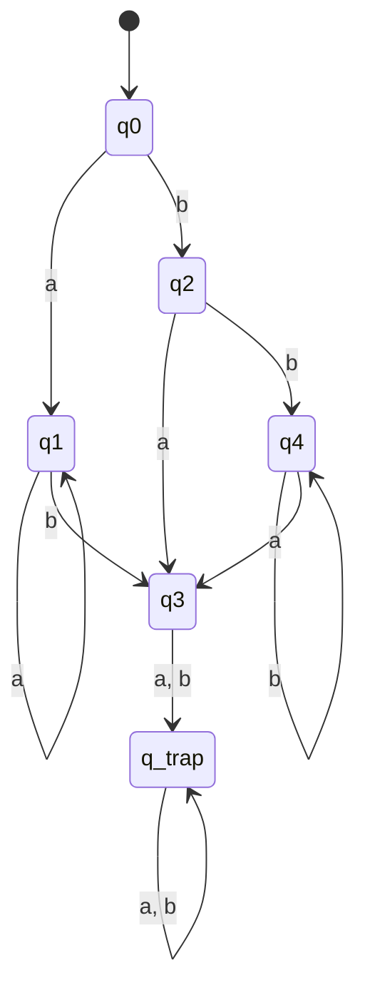

---

# PHẦN IV. TỔNG KẾT & CẨM NANG ĐI THI (CHECKLIST 10 ĐIỂM)

```text
╔══════════════════════════════════════════════════════════════════════════╗
║                    CHECKLIST KHI LÀM BÀI THI TỐI THIỂU HÓA DFA            ║
╠══════════════════════════════════════════════════════════════════════════╣
║ 1. LUÔN KIỂM TRA TRẠNG THÁI KHÔNG LIÊN THÔNG ĐẦU TIÊN (BƯỚC 0):          ║
║    - Nếu thấy có đỉnh nào không có mũi tên đi từ q0 tới -> XÓA NGAY!      ║
║                                                                          ║
║ 2. KHI VẼ BẢNG TAM GIÁC:                                                 ║
║    - Hàng dọc: Ghi từ q1 đến qn                                          ║
║    - Hàng ngang: Ghi từ q0 đến q(n-1)                                    ║
║    - Đánh dấu Bước 2 (1 đỉnh thuộc F, 1 đỉnh không thuộc F) thật cẩn thận║
║                                                                          ║
║ 3. KHI LẦN VẾT BƯỚC 3 (LAN TRUYỀN):                                      ║
║    - Trình bày rõ ràng: "Xét cặp (p, q), đọc 'a' dẫn tới (pa, qa)        ║
║      đã có dấu X nên đánh dấu X vào (p, q)".                             ║
║    - Lặp lại cho đến khi một vòng quét không thêm được dấu X nào.        ║
║                                                                          ║
║ 4. KHI KẾT LUẬN & VẼ LẠI DFA:                                            ║
║    - Ghi rõ các tập gộp, ví dụ: [q0, q2], [q1], [q3, q4]...              ║
║    - Xác định rõ trạng thái bắt đầu mới và TẤT CẢ các trạng thái kết     ║
║      thúc mới (bất kỳ tập nào chứa phần tử thuộc F cũ đều là F mới).     ║
║    - Viết lại bảng chuyển trạng thái mới và vẽ sơ đồ đồ thị.             ║
╚══════════════════════════════════════════════════════════════════════════╝
```
