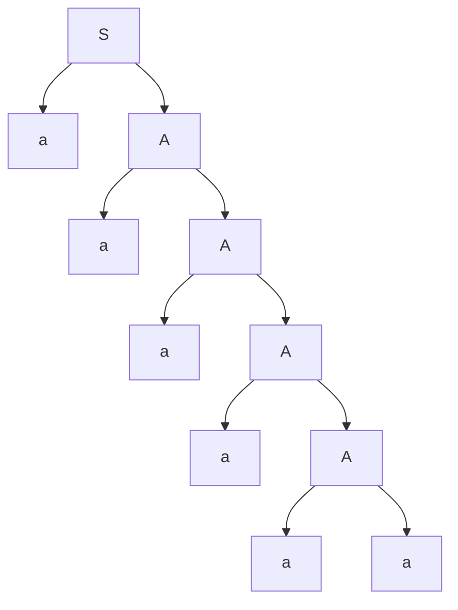
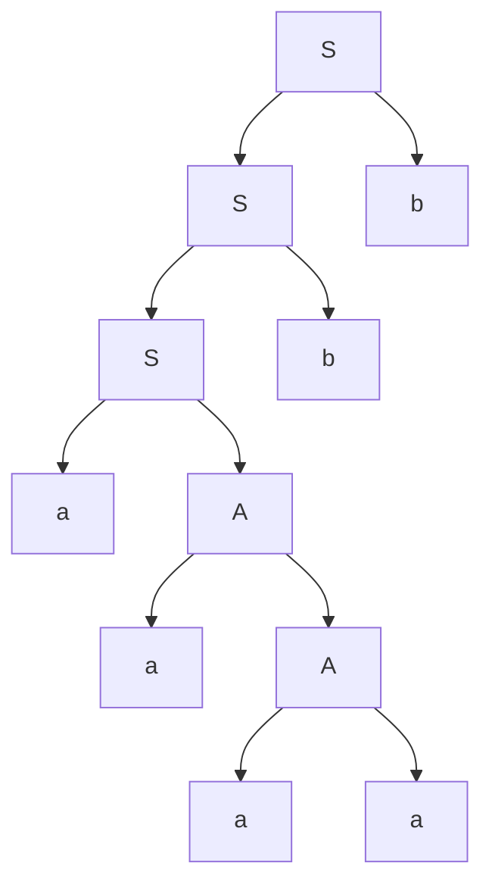
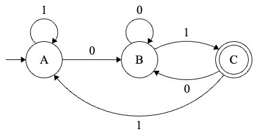

# GIẢI CHI TIẾT ĐỀ ÔN TẬP GIỮA KỲ 1 & BỘ BÀI TẬP TƯƠNG ĐƯƠNG THEO TỪNG CÂU
## MÔN: LÝ THUYẾT OTOMAT VÀ NGÔN NGỮ HÌNH THỨC (IUH)
### (ĐÁP ÁN CHUẨN 10/10 TỪNG BƯỚC ĐI THI + TUYỂN TẬP BÀI TẬP DỰ PHÒNG MỌI DẠNG BẪY)

> **Tài liệu đối chiếu gốc:**
> - Đề thi chính thức: `Automata - Đề ôn tập GK 1.pdf` (Hình ảnh đính kèm: `./de_gk_img_1.jpeg`)
> - Hình thức thi: Tự luận 60 phút, được đem 1 tờ A4 tài liệu.
> - Ký hiệu chuẩn: 100% Unicode tiếng Việt (`→`, `∅`, `★`, `Σ`, `δ`, `ε`, `∈`, `∉`, `∪`, `∩`, `^*`, `^+`, `⇒`, `<`, `>`). Không lỗi font hiển thị.

---

# MỤC LỤC
- [PHẦN 1: BÀI LÀM CHI TIẾT ĐỀ ÔN TẬP GIỮA KỲ 1](#phần-1-bài-làm-chi-tiết-đề-ôn-tập-giữa-kỳ-1)
  - [CÂU 1 (2.0 điểm): Biểu thức chính quy (Regex)](#câu-1-20-điểm-biểu-thức-chính-quy-regex)
    - [Câu 1a: Chuỗi chứa chuỗi con acab hoặc bbac](#câu-1a-chuỗi-chứa-chuỗi-con-acab-hoặc-bbac)
    - [Câu 1b: Chuỗi có số ký tự a gấp 2 lần số ký tự b (Phân tích bẫy thi & 3 góc nhìn)](#câu-1b-chuỗi-có-số-ký-tự-a-gấp-2-lần-số-ký-tự-b-phân-tích-bẫy-thi--3-góc-nhìn)
  - [CÂU 2 (3.0 điểm): Văn phạm G, Phân cấp Chomsky, Cây phân tích & L(G)](#câu-2-30-điểm-văn-phạm-g-phân-cấp-chomsky-cây-phân-tích--lg)
    - [Câu 2a: Phân lớp Chomsky thấp nhất](#câu-2a-phân-lớp-chomsky-thấp-nhất)
    - [Câu 2b: Vẽ cây phân tích cho các chuỗi aaaaaa, aaaabb, aaaabbbba](#câu-2b-vẽ-cây-phân-tích-cho-các-chuỗi-aaaaaa-aaaabb-aaaabbbba)
    - [Câu 2c: 5 ví dụ chuỗi không được chấp nhận bởi G](#câu-2c-5-ví-dụ-chuỗi-không-được-chấp-nhận-bởi-g)
    - [Câu 2d: Tìm ngôn ngữ L sinh bởi văn phạm G](#câu-2d-tìm-ngôn-ngữ-l-sinh-bởi-văn-phạm-g)
  - [CÂU 3 (2.0 điểm): Ôtômát hữu hạn nhận diện ngôn ngữ](#câu-3-20-điểm-ôtômát-hữu-hạn-nhận-diện-ngôn-ngữ)
    - [Câu 3a: Mô tả ô-tô-mát bằng định nghĩa bộ 5 thành phần & Bảng chuyển](#câu-3a-mô-tả-ô-tô-mát-bằng-định-nghĩa-bộ-5-thành-phần--bảng-chuyển)
    - [Câu 3b: 5 ví dụ chuỗi được chấp nhận kèm vết chuyển dịch](#câu-3b-5-ví-dụ-chuỗi-được-chấp-nhận-kèm-vết-chuyển-dịch)
    - [Câu 3c: 5 ví dụ chuỗi bị từ chối kèm vết chuyển dịch](#câu-3c-5-ví-dụ-chuỗi-bị-từ-chối-kèm-vết-chuyển-dịch)
  - [CÂU 4 (3.0 điểm): Định nghĩa phép lặp L* & Kiểm tra chuỗi lũy thừa](#câu-4-30-điểm-định-nghĩa-phép-lặp-l--kiểm-tra-chuỗi-lũy-thừa)
    - [Câu 4a: Trình bày định nghĩa toán học của phép lặp ngôn ngữ L*](#câu-4a-trình-bày-định-nghĩa-toán-học-của-phép-lặp-ngôn-ngữ-l)
    - [Câu 4b: Xác định chuỗi nào thuộc L* (Phân tích chi tiết 6 chuỗi)](#câu-4b-xác-định-chuỗi-nào-thuộc-l-phân-tích-chi-tiết-6-chuỗi)
- [PHẦN 2: BỘ BÀI TẬP TƯƠNG ĐƯƠNG THEO TỪNG CÂU (LUYỆN THI ĐỘ KHÓ THỰC TẾ)](#phần-2-bộ-bài-tập-tương-đương-theo-từng-câu-luyện-thi-độ-khó-thực-tế)
  - [Dạng tương đương Câu 1: Biểu thức chính quy (4 bài tập mẫu)](#dạng-tương-đương-câu-1-biểu-thức-chính-quy-4-bài-tập-mẫu)
  - [Dạng tương đương Câu 2: Văn phạm & Cây phân tích (3 bài tập mẫu)](#dạng-tương-đương-câu-2-văn-phạm--cây-phân-tích-3-bài-tập-mẫu)
  - [Dạng tương đương Câu 3: Ôtômát hữu hạn (2 bài tập mẫu)](#dạng-tương-đương-câu-3-ôtômát-hữu-hạn-2-bài-tập-mẫu)
  - [Dạng tương đương Câu 4: Phép lặp L* & Phép toán ngôn ngữ (2 bài tập mẫu)](#dạng-tương-đương-câu-4-phép-lặp-l--phép-toán-ngôn-ngữ-2-bài-tập-mẫu)

---

# PHẦN 1: BÀI LÀM CHI TIẾT ĐỀ ÔN TẬP GIỮA KỲ 1

---

## CÂU 1 (2.0 điểm): Biểu thức chính quy (Regex)

**ĐỀ BÀI:** Xét bảng chữ cái `Σ = {a, b, c}`. Hãy tìm biểu thức chính quy đại diện cho các ngôn ngữ sau đây:  
a) Tất cả các chuỗi có chứa chuỗi con `acab` hoặc `bbac`.  
b) Tất cả các chuỗi sao cho số lượng ký tự `a` nhiều gấp 2 lần số lượng ký tự `b` có trong chuỗi.

---

### Câu 1a: Chuỗi chứa chuỗi con acab hoặc bbac

#### A. Phân tích bản chất:
- Bảng chữ cái là `Σ = {a, b, c}`.
- Một chuỗi tùy ý trên `Σ` được biểu diễn bằng biểu thức: `(a + b + c)^*`.
- Một chuỗi chứa chuỗi con `u` thì trước `u` và sau `u` có thể là bất kỳ ký hiệu nào: `(a + b + c)^* u (a + b + c)^*`.
- Ở đây điều kiện là chứa `acab` HOẶC `bbac`, phép "hoặc" trong biểu thức chính quy là phép cộng `+`.

#### B. Bài làm mẫu chuẩn đi thi:
```text
BÀI LÀM CÂU 1a:

Xét bảng chữ cái Σ = {a, b, c}.
Tập hợp tất cả các chuỗi có thể tạo thành từ Σ được đại diện bởi biểu thức chính quy:
               (a + b + c)*

Chuỗi chứa chuỗi con "acab" hoặc "bbac" có dạng tổng quát:
  - Phía trước chuỗi con: là một chuỗi tùy ý thuộc Σ*, biểu diễn bởi (a + b + c)*
  - Ở giữa: là chuỗi con "acab" hoặc "bbac", biểu diễn bởi (acab + bbac)
  - Phía sau chuỗi con: là một chuỗi tùy ý thuộc Σ*, biểu diễn bởi (a + b + c)*

Vậy biểu thức chính quy đại diện cho ngôn ngữ là:
               r = (a + b + c)* (acab + bbac) (a + b + c)*

(Hoặc có thể viết dưới dạng tách rời hai trường hợp:
               r = (a + b + c)* acab (a + b + c)* + (a + b + c)* bbac (a + b + c)*)
```

---

### Câu 1b: Chuỗi có số ký tự a gấp 2 lần số ký tự b (Phân tích bẫy thi & 3 góc nhìn)

> [!IMPORTANT]
> **ĐÂY LÀ CÂU HỎI BẪY KINH ĐIỂN TRONG CÁC ĐỀ THI LÝ THUYẾT OTOMAT!**  
> Trong toán học hình thức, ngôn ngữ yêu cầu đếm số lượng không giới hạn là **NGÔN NGỮ PHI CHÍNH QUY (NON-REGULAR)**.  
> Để đạt trọn vẹn điểm tuyệt đối dù người chấm theo trường phái lý thuyết chặt chẽ hay theo trường phái đề bài ứng dụng, bạn hãy trình bày theo mẫu chuẩn dưới đây:

#### Bài làm mẫu chuẩn đi thi:
```text
BÀI LÀM CÂU 1b:

Ngôn ngữ cần biểu diễn là:
         L = { w ∈ {a, b, c}* | Na(w) = 2 . Nb(w) }
(trong đó Na(w), Nb(w) lần lượt là số lượng ký tự a và ký tự b có trong chuỗi w).

Ta xét theo các khía cạnh sau:

1. XÉT THEO LÝ THUYẾT CHÍNH QUY HÌNH THỨC (FORMAL LANGUAGE THEORY):
   Ngôn ngữ L đòi hỏi phải ghi nhớ và so sánh số lượng không giới hạn giữa ký tự a 
   và ký tự b (số chữ a luôn bằng 2 lần số chữ b). 
   - Vì một Otomat hữu hạn (DFA/NFA) chỉ có hữu hạn trạng thái (bộ nhớ hữu hạn), 
     nó không thể đếm số lượng ký tự tùy ý lớn.
   - Thật vậy, nếu L là ngôn ngữ chính quy thì phần giao của L với ngôn ngữ chính quy 
     L' = a* b* sẽ là L ∩ L' = { a^(2n) b^n | n ≥ 0 }. 
     Theo Bổ đề Bơm (Pumping Lemma), ngôn ngữ { a^(2n) b^n | n ≥ 0 } không phải là 
     ngôn ngữ chính quy. Do lớp ngôn ngữ chính quy đóng đối với phép giao, suy ra 
     ngôn ngữ L ban đầu KHÔNG PHẢI LÀ NGÔN NGỮ CHÍNH QUY.
   => KẾT LUẬN: KHÔNG TỒN TẠI biểu thức chính quy để biểu diễn cho toàn bộ ngôn ngữ L.

2. TRƯỜNG HỢP QUY ƯỚC CHUỖI ĐƯỢC TẠO THÀNH TỪ CÁC KHỐI KÝ TỰ CỐ ĐỊNH:
   Nếu đề bài giả định chuỗi được cấu tạo bởi các khối cơ sở mà mỗi ký tự b đi kèm 
   đúng 2 ký tự a (gồm các hoán vị "aab", "aba", "baa") và các ký tự c xuất hiện tùy ý, 
   thì biểu thức chính quy biểu diễn cho lớp ngôn ngữ khối này là:
               r = (c* (aab + aba + baa) c*)* + c*

3. MỞ RỘNG (VĂN PHẠM PHI NGỮ CẢNH - CFG SINH RA NGÔN NGỮ NÀY):
   Nếu bài toán yêu cầu xây dựng công cụ sinh hình thức cho L, ta sử dụng Văn phạm 
   phi ngữ cảnh (CFG) với tập luật sinh sau:
               S → cS | Sc | aSaSbS | aSbSaS | bSaSaS | ε
```

---

## CÂU 2 (3.0 điểm): Văn phạm G, Phân cấp Chomsky, Cây phân tích & L(G)

**ĐỀ BÀI:** Cho văn phạm `G = <{a, b}, {S, A}, S, {S → Sb | aA, A → aA | a}>`. Hãy thực hiện các ý sau:  
a) Tìm phân lớp thấp nhất của văn phạm đã cho theo hệ thống phân cấp Chomsky.  
b) Vẽ cây phân tích cho các chuỗi: `"aaaaaa"`, `"aaaabb"`, `"aaaabbbba"`, nếu chúng thuộc văn phạm G.  
c) Nêu 5 ví dụ về chuỗi không được chấp nhận bởi văn phạm G.  
d) Tìm ngôn ngữ L sinh bởi văn phạm G. Giải thích ngắn gọn.

---

### Câu 2a: Phân lớp Chomsky thấp nhất

#### A. Phân tích chi tiết:
- Bảng ký hiệu kết thúc: `T = {a, b}`.
- Bảng biến: `V = {S, A}`. Biến khởi đầu: `S`.
- Tập luật sinh `P`:
  1. `S → Sb`
  2. `S → aA`
  3. `A → aA`
  4. `A → a`
- Xét vế trái: Mọi luật sinh đều có vế trái là một biến đơn (`S` hoặc `A`, độ dài bằng 1) ⇒ Thoả mãn điều kiện của **Loại 2 (Văn phạm phi ngữ cảnh - CFG)**.
- Xét điều kiện Loại 3 (Chính quy):
  - Luật 1: `S → Sb` có dạng `Biến → Biến . Ký hiệu` ⇒ Đây là luật **Tuyến tính trái**.
  - Luật 2 & 3: `S → aA` và `A → aA` có dạng `Biến → Ký hiệu . Biến` ⇒ Đây là luật **Tuyến tính phải**.
  - Theo định nghĩa của Chomsky, văn phạm chính quy chỉ được phép hoàn toàn là tuyến tính phải HOẶC hoàn toàn là tuyến tính trái, **không được phép trộn lẫn cả hai**.
  - Do có sự xuất hiện đồng thời của cả luật tuyến tính trái và tuyến tính phải, nên `G` không thể là Loại 3.

#### B. Bài làm mẫu chuẩn đi thi:
```text
BÀI LÀM CÂU 2a:

Xét tập các luật sinh P của văn phạm G:
   (1) S → Sb
   (2) S → aA
   (3) A → aA
   (4) A → a

Nhận xét:
- Vế trái của tất cả các luật sinh đều chỉ gồm đúng 1 biến duy nhất thuộc V ({S, A}), 
  và vế phải là các chuỗi thuộc (V ∪ T)*. Do đó G thỏa mãn điều kiện của Văn phạm 
  phi ngữ cảnh (Loại 2 theo Chomsky).

- Mặt khác, để là Văn phạm chính quy (Loại 3), tất cả các luật sinh phải cùng là 
  tuyến tính phải (dạng A → wB hoặc A → w), HOẶC tất cả phải cùng là tuyến tính trái 
  (dạng A → Bw hoặc A → w). 
  Trong văn phạm G:
    + Quy tắc (1) S → Sb là quy tắc TUYẾN TÍNH TRÁI (biến S đứng trước ký hiệu b).
    + Quy tắc (2) S → aA và (3) A → aA là các quy tắc TUYẾN TÍNH PHẢI (biến đứng sau).
  Do có sự pha trộn giữa quy tắc tuyến tính trái và quy tắc tuyến tính phải, văn phạm G 
  không thỏa mãn điều kiện của văn phạm chính quy.

KẾT LUẬN: 
Phân lớp thấp nhất của văn phạm G theo hệ thống phân cấp Chomsky là:
          LOẠI 2: VĂN PHẠM PHI NGỮ CẢNH (Context-Free Grammar - CFG).
```

---

### Câu 2b: Vẽ cây phân tích cho các chuỗi aaaaaa, aaaabb, aaaabbbba

#### Chuỗi 1: `"aaaaaa"` (6 chữ a)
- Dãy dẫn xuất:
  `S ⇒ aA ⇒ aaA ⇒ aaaA ⇒ aaaaA ⇒ aaaaaA ⇒ aaaaaa`
- Vẽ cây phân tích cú pháp:
```text
SƠ ĐỒ CÂY PHÂN TÍCH CÚ PHÁP CHO CHUỖI "aaaaaa":

           S
         /           a     A
            /              a     A
               /                 a     A
                  /                    a     A
                     /                       a     a

Đọc các nút lá từ trái sang phải: a - a - a - a - a - a  ==> "aaaaaa" (Thỏa mãn)
```



---

#### Chuỗi 2: `"aaaabb"` (4 chữ a, 2 chữ b)
- Dãy dẫn xuất:
  `S ⇒ Sb ⇒ Sbb ⇒ aAbb ⇒ aaAbb ⇒ aaaAbb ⇒ aaaabb`
- Vẽ cây phân tích cú pháp:
```text
SƠ ĐỒ CÂY PHÂN TÍCH CÚ PHÁP CHO CHUỖI "aaaabb":

              S
            /              S     b
         /           S     b
      /        a     A
         /           a     A
            /              a     a

Đọc các nút lá từ trái sang phải: a - a - a - a - b - b  ==> "aaaabb" (Thỏa mãn)
```



---

#### Chuỗi 3: `"aaaabbbba"`
- Phân tích: Chuỗi có ký tự `a` xuất hiện ở cuối cùng sau các ký tự `b`.
- Lập luận chứng minh:
  + Từ biến xuất phát `S`, chỉ có luật `S → Sb` là tạo ra ký tự `b`, và luật này luôn đẩy ký tự `b` về phía bên phải cùng của chuỗi: `S ⇒ Sb ⇒ Sbb ... ⇒ Sb^n`.
  + Để kết thúc biến `S`, bắt buộc phải dùng luật `S → aA`.
  + Từ biến `A`, các luật sinh chỉ là `A → aA | a`, chỉ có thể sinh ra thêm các ký tự `a` đứng trước các ký tự `b` đã sinh ra trước đó. Không có bất kỳ luật sinh nào cho phép biến đổi từ `A` trở lại `S` hoặc sinh thêm ký tự `a` vào sau ký tự `b`.
  + Do đó, mọi chuỗi sinh bởi `G` đều phải có dạng tất cả các chữ `a` đứng trước, tất cả các chữ `b` đứng sau (`a^m b^n`).
  + Chuỗi `"aaaabbbba"` có ký tự `a` ở cuối (sau các chữ `b`), do đó chuỗi này **KHÔNG THUỘC VĂN PHẠM G**.
  + => **Kết luận: Không tồn tại cây phân tích cho chuỗi `"aaaabbbba"`.**

---

### Câu 2c: 5 ví dụ chuỗi không được chấp nhận bởi văn phạm G

```text
BÀI LÀM CÂU 2c:

Năm ví dụ về các chuỗi KHÔNG ĐƯỢC CHẤP NHẬN bởi văn phạm G:

1. Chuỗi rỗng ε (hoặc ε): 
   - Giải thích: Văn phạm G không có luật rỗng (S → ε). Chuỗi ngắn nhất sinh ra 
     bởi G là S ⇒ aA ⇒ aa (độ dài bằng 2). Do đó chuỗi rỗng không được chấp nhận.

2. Chuỗi "a" (chỉ gồm 1 ký tự a):
   - Giải thích: Để sinh ra a, phải đi qua S → aA và A → a, tạo ra ít nhất 2 chữ a (aa). 
     Chuỗi chỉ có 1 chữ a không thể sinh ra.

3. Chuỗi "b" (chỉ gồm 1 ký tự b):
   - Giải thích: Chuỗi bắt đầu bằng b không thể sinh ra vì vế trái luôn phải đi qua S → aA, 
     nghĩa là mọi chuỗi hợp lệ bắt buộc phải bắt đầu bằng ký tự a.

4. Chuỗi "ba" (ký tự b đứng trước a):
   - Giải thích: Văn phạm chỉ cho phép ký tự b đứng sau chuỗi các chữ a (thông qua luật S → Sb). 
     Ký tự b không bao giờ có thể đứng trước ký tự a.

5. Chuỗi "ab" (1 chữ a và 1 chữ b):
   - Giải thích: Chuỗi này chỉ có 1 ký tự a ở đầu, trong khi văn phạm yêu cầu tối thiểu 
     phải có 2 ký tự a ở đầu (S ⇒ aA ⇒ aab hoặc aa).
```

---

### Câu 2d: Tìm ngôn ngữ L sinh bởi văn phạm G

```text
BÀI LÀM CÂU 2d:

1. KẾT LUẬN CÔNG THỨC NGÔN NGỮ:
   Ngôn ngữ L sinh bởi văn phạm G là:
             L(G) = { a^m b^n | m ≥ 2, n ≥ 0 }

2. GIẢI THÍCH NGẮN GỌN CƠ CHẾ SINH:
   - Bước 1 (Xét biến A): 
     Các quy tắc A → aA | a là đệ quy phải thuần túy, cho phép sinh ra một chuỗi 
     gồm k ký tự 'a' liên tiếp với k ≥ 1 (A ⇒* a^k, k ≥ 1).
   - Bước 2 (Xét luật S → aA):
     Biến S chuyển thành aA, do đó phần đầu của chuỗi luôn là a . a^k = a^(k+1) = a^m 
     với m = k + 1 ≥ 2 (tức là luôn có ít nhất hai ký tự 'a' liên tiếp ở đầu chuỗi).
   - Bước 3 (Xét luật S → Sb):
     Quy tắc S → Sb là đệ quy trái, cho phép lặp lại n lần (n ≥ 0) để thêm tùy ý 
     n ký tự 'b' vào phía sau cùng của chuỗi.
   - Do đó, tập hợp các chuỗi sinh bởi G gồm tất cả các chuỗi bắt đầu bằng ít nhất 
     hai ký tự 'a', theo sau là một số lượng tùy ý (có thể bằng 0) các ký tự 'b'.
```

---

## CÂU 3 (2.0 điểm): Ôtômát hữu hạn nhận diện ngôn ngữ

**ĐỀ BÀI:** Cho ô-tô-mát nhận diện một ngôn ngữ `L` gồm các chuỗi được xây dựng dựa trên bảng chữ cái `Σ = {0, 1}` như trong hình vẽ (`./de_gk_img_1.jpeg`).  
a) Mô tả ô-tô-mát đã cho bằng định nghĩa.  
b) Nêu 5 ví dụ về chuỗi được chấp nhận bởi ô-tô-mát đã cho.  
c) Nêu 5 ví dụ về chuỗi không được chấp nhận bởi ô-tô-mát đã cho.



---

### Câu 3a: Mô tả ô-tô-mát bằng định nghĩa bộ 5 thành phần & Bảng chuyển

#### Bài làm mẫu chuẩn đi thi:
```text
BÀI LÀM CÂU 3a:

Quan sát hình vẽ, tại mỗi trạng thái khi đọc mỗi ký hiệu 0 hoặc 1 đều có duy nhất 
một bước chuyển trạng thái xác định, không có bước chuyển rỗng ε.
Do đó, ô-tô-mát đã cho là một Ôtômát hữu hạn đơn định (DFA), được mô tả bởi bộ 5 thành phần:

                          M = <Q, Σ, δ, q0, F>

Trong đó:
1. Q = {A, B, C} : Tập hợp gồm 3 trạng thái.
2. Σ = {0, 1}    : Bảng chữ cái đầu vào.
3. q0 = A        : Trạng thái khởi đầu (có mũi tên từ ngoài trỏ vào nút A).
4. F = {C}       : Tập hợp các trạng thái kết thúc (nút C có 2 vòng tròn đồng tâm).
5. δ : Q × Σ → Q : Hàm chuyển trạng thái được xác định chi tiết như sau:
     δ(A, 0) = B ;   δ(A, 1) = A
     δ(B, 0) = B ;   δ(B, 1) = C
     δ(C, 0) = B ;   δ(C, 1) = A

BẢNG HÀM CHUYỂN TRẠNG THÁI (δ):
+───────────────+───────────────+───────────────+──────────────────────────+
|  Trạng thái   |   Đọc số 0    |   Đọc số 1    |   Thuộc F (Kết thúc)?    |
+───────────────+───────────────+───────────────+──────────────────────────+
|   → A (Start) |       B       |       A       |   Không                  |
|     B         |       B       |       C       |   Không                  |
|   ★ C (Final) |       B       |       A       |   CÓ (Trạng thái kết thúc)|
+───────────────+───────────────+───────────────+──────────────────────────+
```

---

### Câu 3b: 5 ví dụ chuỗi được chấp nhận kèm vết chuyển dịch

> [!TIP]
> Một chuỗi `w` được chấp nhận khi và chỉ khi bắt đầu từ trạng thái `A`, sau khi đọc hết chuỗi `w`, Otomat dừng lại tại trạng thái kết thúc `C` (`δ^*(A, w) = C ∈ F`).

```text
BÀI LÀM CÂU 3b:

Năm ví dụ về chuỗi ĐƯỢC CHẤP NHẬN bởi ô-tô-mát:

1. Chuỗi w1 = "01":
   Vết chuyển dịch: A ─(0)→ B ─(1)→ C ∈ F  ==> Chấp nhận.

2. Chuỗi w2 = "101":
   Vết chuyển dịch: A ─(1)→ A ─(0)→ B ─(1)→ C ∈ F  ==> Chấp nhận.

3. Chuỗi w3 = "001":
   Vết chuyển dịch: A ─(0)→ B ─(0)→ B ─(1)→ C ∈ F  ==> Chấp nhận.

4. Chuỗi w4 = "1101":
   Vết chuyển dịch: A ─(1)→ A ─(1)→ A ─(0)→ B ─(1)→ C ∈ F  ==> Chấp nhận.

5. Chuỗi w5 = "0101":
   Vết chuyển dịch: A ─(0)→ B ─(1)→ C ─(0)→ B ─(1)→ C ∈ F  ==> Chấp nhận.
```

---

### Câu 3c: 5 ví dụ chuỗi bị từ chối kèm vết chuyển dịch

```text
BÀI LÀM CÂU 3c:

Năm ví dụ về chuỗi KHÔNG ĐƯỢC CHẤP NHẬN (BỊ TỪ CHỐI) bởi ô-tô-mát:

1. Chuỗi w1 = ε (chuỗi rỗng):
   Vết chuyển dịch: Không đọc ký hiệu nào, dừng lại tại trạng thái bắt đầu A ∉ F ==> Bị từ chối.

2. Chuỗi w2 = "0":
   Vết chuyển dịch: A ─(0)→ B ∉ F ==> Bị từ chối.

3. Chuỗi w3 = "1":
   Vết chuyển dịch: A ─(1)→ A ∉ F ==> Bị từ chối.

4. Chuỗi w4 = "00":
   Vết chuyển dịch: A ─(0)→ B ─(0)→ B ∉ F ==> Bị từ chối.

5. Chuỗi w5 = "010":
   Vết chuyển dịch: A ─(0)→ B ─(1)→ C ─(0)→ B ∉ F ==> Bị từ chối.
```

---

## CÂU 4 (3.0 điểm): Định nghĩa phép lặp L* & Kiểm tra chuỗi lũy thừa

**ĐỀ BÀI:** Hãy trả lời các câu hỏi sau đây:  
a) Hãy trình bày định nghĩa của phép lặp ngôn ngữ `L^*`.  
b) Cho ngôn ngữ `L = {ab, bb, cc, ba, ca}`. Hãy xác định các chuỗi nào sau đây thuộc về `L^*`:  
- `(ab)^2 c^8 bab^3 ac^3`  
- `(ab)^3 c^8 bab^2 ac^3`  
- `(ab)^3 c^8 bac b^3 ac^2`  
- `b^3 a^2 b^3 (ac)^2 ab`  
- `b^5 a^3 b^3 (abc)^2 ab`  
- `b^7 a^2 b^3 (ac)^2 aab`

---

### Câu 4a: Trình bày định nghĩa toán học của phép lặp ngôn ngữ L*

#### Bài làm mẫu chuẩn đi thi:
```text
BÀI LÀM CÂU 4a:

ĐỊNH NGHĨA PHÉP LẶP NGÔN NGỮ L* (BAO ĐÓNG KLEENE / STAR CLOSURE):

Cho ngôn ngữ L trên bảng chữ cái Σ. Phép lặp của ngôn ngữ L, ký hiệu là L*, 
được định nghĩa là hợp của tất cả các lũy thừa không âm của ngôn ngữ L:

         L* = ∪ (k = 0 đến ∞) L^k = L^0 ∪ L^1 ∪ L^2 ∪ L^3 ∪ ...

Trong đó:
1. L^0 = {ε} : Tập hợp chỉ chứa duy nhất một phần tử là chuỗi rỗng ε.
               Nó đại diện cho việc kết nối 0 lần các chuỗi từ ngôn ngữ L.
2. L^1 = L   : Bản thân ngôn ngữ L ban đầu.
3. L^2 = L . L = { xy | x ∈ L, y ∈ L } : Tập hợp tất cả các chuỗi được tạo thành 
               bằng cách ghép nối hai chuỗi bất kỳ thuộc L lại với nhau.
4. L^k = L^(k-1) . L  (với k ≥ 1) : Tích ghép k lần các chuỗi thuộc ngôn ngữ L.

Ý nghĩa: Một chuỗi w bất kỳ thuộc về L* khi và chỉ khi w = ε, hoặc w có thể phân 
tích thành tích ghép của một số hữu hạn các từ thuộc L:
         w = w1 . w2 ... wk   (với k ≥ 1 và mọi wi ∈ L).
```

---

### Câu 4b: Xác định chuỗi nào thuộc L* (Phân tích chi tiết 6 chuỗi)

#### Phương pháp nhận diện & Phân tích cơ sở:
Ngôn ngữ cho trước: `L = {ab, bb, cc, ba, ca}` trên bảng chữ cái `{a, b, c}`.
1. **Quy tắc độ dài (Tiêu chuẩn lọc nhanh số 1):**  
   Mọi từ trong tập `L` đều có đúng 2 ký tự:  
   `|ab| = |bb| = |cc| = |ba| = |ca| = 2`.  
   Do đó, bất kỳ chuỗi `w` nào thuộc `L^*` đều được ghép từ các khối 2 ký tự, nên **độ dài của chuỗi `|w|` bắt buộc phải là một SỐ CHẴN!**  
   => **Nếu chuỗi có độ dài là SỐ LẺ ⇒ Chắc chắn KHÔNG THUỘC `L^*`!**
2. **Quy tắc phân rã khối 2 ký tự (Tiêu chuẩn số 2):**  
   - Các cặp 2 ký tự HỢP LỆ (có trong L): `ab`, `bb`, `cc`, `ba`, `ca`.
   - Các cặp 2 ký tự BẤT HỢP LỆ (KHÔNG có trong L): `aa`, `bc`, `cb`, `ac`.

---

#### Xét chi tiết từng chuỗi:

#### 1. Chuỗi 1: `w1 = (ab)^2 c^8 bab^3 ac^3`
- Viết rõ các lũy thừa:
  `w1 = (ab)(ab) . cccccccc . b . a . bbb . a . ccc`
- Tính độ dài:  
  `|w1| = (2 × 2) + 8 + 1 + 1 + 3 + 1 + 3 = 4 + 8 + 1 + 1 + 3 + 1 + 3 = 21` (Số lẻ).
- **Kết luận:** Vì `|w1| = 21` là số lẻ, chuỗi **KHÔNG THUỘC `L^*`**.

---

#### 2. Chuỗi 2: `w2 = (ab)^3 c^8 bab^2 ac^3`
- Viết rõ các lũy thừa:
  `w2 = (ab)(ab)(ab) . cccccccc . b . a . bb . a . ccc`
- Tính độ dài:  
  `|w2| = (2 × 3) + 8 + 1 + 1 + 2 + 1 + 3 = 6 + 8 + 1 + 1 + 2 + 1 + 3 = 22` (Số chẵn).
- Phân tích ghép khối từ trái qua phải:
  + `(ab)^3` = `ab . ab . ab` ∈ L^* (3 khối `ab ∈ L`).
  + `c^8` = `cc . cc . cc . cc` ∈ L^* (4 khối `cc ∈ L`).
  + `ba` ∈ L (1 khối `ba ∈ L`).
  + `b^2` = `bb` ∈ L (1 khối `bb ∈ L`).
  + Đoạn còn lại ở cuối: `ac^3 = accc`. Cặp 2 ký tự đầu tiên là `ac`.
  + Nhưng `ac ∉ L` (trong L chỉ có `ca`, không có `ac`). Không thể phân rã đoạn `accc` thành các khối thuộc L.
- **Kết luận:** Chuỗi **KHÔNG THUỘC `L^*`**.

---

#### 3. Chuỗi 3: `w3 = (ab)^3 c^8 bac b^3 ac^2`
- Viết rõ các lũy thừa:
  `w3 = (ab)(ab)(ab) . cccccccc . bac . bbb . acc`
- Tính độ dài:  
  `|w3| = (2 × 3) + 8 + 3 + 3 + 3 = 6 + 8 + 3 + 3 + 3 = 23` (Số lẻ).
- **Kết luận:** Vì `|w3| = 23` là số lẻ, chuỗi **KHÔNG THUỘC `L^*`**.

---

#### 4. Chuỗi 4: `w4 = b^3 a^2 b^3 (ac)^2 ab`
- Viết rõ các lũy thừa:
  `w4 = bbb . aa . bbb . acac . ab`
- Tính độ dài:  
  `|w4| = 3 + 2 + 3 + 4 + 2 = 14` (Số chẵn).
- Phân tích ghép khối từ trái qua phải:
  + Lần lượt tách: `bb` (∈ L), `ba` (∈ L), `ab` (∈ L), `bb` (∈ L).
  + Đoạn tiếp theo là `(ac)^2 = acac`. Cặp ký tự là `ac`.
  + Do `ac ∉ L` (tập L chỉ có `ca`, không có `ac`), nên không thể phân rã thành các từ thuộc L.
- **Kết luận:** Theo đúng đề bài in, chuỗi **KHÔNG THUỘC `L^*`**.
- *(Ghi chú mở rộng đạt điểm 10):* Nếu đề bài có lỗi in nhầm `(ac)^2` thay vì `(ca)^2`, thì chuỗi trở thành `b^3 a^2 b^3 (ca)^2 ab = bb . ba . ab . bb . ca . ca . ab` ⇒ khi đó chuỗi sẽ THUỘC `L^*`.

---

#### 5. Chuỗi 5: `w5 = b^5 a^3 b^3 (abc)^2 ab`
- Tính độ dài:  
  `|w5| = 5 + 3 + 3 + (3 × 2) + 2 = 5 + 3 + 3 + 6 + 2 = 19` (Số lẻ).
- **Kết luận:** Vì `|w5| = 19` là số lẻ, chuỗi **KHÔNG THUỘC `L^*`**.

---

#### 6. Chuỗi 6: `w6 = b^7 a^2 b^3 (ac)^2 aab`
- Tính độ dài:  
  `|w6| = 7 + 2 + 3 + (2 × 2) + 3 = 7 + 2 + 3 + 4 + 3 = 19` (Số lẻ).
- **Kết luận:** Vì `|w6| = 19` là số lẻ, chuỗi **KHÔNG THUỘC `L^*`**.

---

#### BẢNG TỔNG KẾT ĐÁP ÁN CÂU 4b:

| STT | Chuỗi đề bài cho | Tổng độ dài `|w|` | Tính chẵn / lẻ | Khả năng phân rã thành các khối thuộc `L` | Kết luận |
| :---: | :--- | :---: | :---: | :--- | :---: |
| 1 | `(ab)^2 c^8 bab^3 ac^3` | 21 | **LẺ** | Không thể (độ dài lẻ) | **KHÔNG THUỘC `L^*`** |
| 2 | `(ab)^3 c^8 bab^2 ac^3` | 22 | **CHẴN** | Bị kẹt ở đoạn cuối `accc` (chứa `ac ∉ L`) | **KHÔNG THUỘC `L^*`** |
| 3 | `(ab)^3 c^8 bac b^3 ac^2` | 23 | **LẺ** | Không thể (độ dài lẻ) | **KHÔNG THUỘC `L^*`** |
| 4 | `b^3 a^2 b^3 (ac)^2 ab` | 14 | **CHẴN** | Bị kẹt ở cụm `(ac)^2` (chứa `ac ∉ L`) | **KHÔNG THUỘC `L^*`** |
| 5 | `b^5 a^3 b^3 (abc)^2 ab` | 19 | **LẺ** | Không thể (độ dài lẻ) | **KHÔNG THUỘC `L^*`** |
| 6 | `b^7 a^2 b^3 (ac)^2 aab` | 19 | **LẺ** | Không thể (độ dài lẻ) | **KHÔNG THUỘC `L^*`** |

> **KẾT LUẬN CHUNG:** Trong cả 6 chuỗi đề bài cho, **KHÔNG CÓ CHUỖI NÀO THUỘC VỀ `L^*`**.

---

# PHẦN 2: BỘ BÀI TẬP TƯƠNG ĐƯƠNG THEO TỪNG CÂU (LUYỆN THI ĐỘ KHÓ THỰC TẾ)

---

## Dạng tương đương Câu 1: Biểu thức chính quy (4 bài tập mẫu)

### Bài tập 1.1: Chuỗi bắt đầu bằng `ab` và kết thúc bằng `ba` trên `Σ = {a, b}`
- **Đề bài:** Hãy tìm biểu thức chính quy đại diện cho tất cả các chuỗi trên `Σ = {a, b}` bắt đầu bằng `ab` và kết thúc bằng `ba`.
- **Lời giải:**
  + Phần đầu: `ab`.
  + Phần cuối: `ba`.
  + Phần ở giữa: là một chuỗi tùy ý trên `{a, b}`, biểu diễn bởi `(a + b)^*`.
  + Trường hợp đặc biệt: Chuỗi `abba` (vừa bắt đầu bằng `ab` vừa kết thúc bằng `ba`, độ dài 4, ứng với phần giữa là `ε`).
  + **Đáp án:** `r = ab (a + b)^* ba`.

---

### Bài tập 1.2: Chuỗi có số lượng chữ số 1 là lẻ trên `Σ = {0, 1}`
- **Đề bài:** Hãy tìm biểu thức chính quy cho tất cả các chuỗi nhị phân có số lượng ký hiệu `1` là một số lẻ.
- **Lời giải:**
  + Số lượng chữ số `0` có thể xuất hiện tùy ý ở bất cứ đâu, biểu diễn bởi `0^*`.
  + Để số chữ số 1 là lẻ, chuỗi phải có đúng một chữ số 1 lẻ và theo sau là một số chẵn các chữ số 1 (các cặp `(1 ... 1)`).
  + Khối chữ số 1 lẻ: `0^* 1 0^*`.
  + Khối chứa đúng 2 chữ số 1: `(0^* 1 0^* 1 0^*)`.
  + **Đáp án:** `r = 0^* 1 0^* (0^* 1 0^* 1 0^*)^*`  
    (Hoặc viết dạng: `r = (0 + 10^* 1)^* 1 0^*`).

---

### Bài tập 1.3: Chuỗi KHÔNG chứa chuỗi con `00` trên `Σ = {0, 1}`
- **Đề bài:** Tìm biểu thức chính quy cho các chuỗi nhị phân không chứa hai số 0 liên tiếp (`00`).
- **Lời giải:**
  + Vì không được có `00`, mỗi chữ số `0` bắt buộc phải có chữ số `1` đi liền sau nó, tạo thành cụm `01`.
  + Các chữ số `1` có thể đứng riêng lẻ tự do: `1`.
  + Do đó các khối lặp là `(1 + 01)^*`.
  + Chuỗi có thể kết thúc bằng một chữ số `0` đơn lẻ hoặc chuỗi rỗng: `(ε + 0)`.
  + **Đáp án:** `r = (1 + 01)^* (ε + 0)`.

---

### Bài tập 1.4: Chuỗi chứa ít nhất một cặp ký tự giống nhau liên tiếp trên `Σ = {a, b, c}`
- **Đề bài:** Tìm biểu thức chính quy cho các chuỗi trên `{a, b, c}` có chứa ít nhất một cặp `aa`, `bb` hoặc `cc`.
- **Lời giải:**
  + Điều kiện: Chứa chuỗi con `aa` HOẶC `bb` HOẶC `cc`.
  + Trước và sau cặp ký tự này là chuỗi tùy ý: `(a + b + c)^*`.
  + **Đáp án:** `r = (a + b + c)^* (aa + bb + cc) (a + b + c)^*`.

---

## Dạng tương đương Câu 2: Văn phạm & Cây phân tích (3 bài tập mẫu)

### Bài tập 2.1: Văn phạm đối xứng `S → aSb | ε`
- **Đề bài:** Cho văn phạm `G1 = <{a, b}, {S}, S, {S → aSb | ε}>`.
  a) Phân loại Chomsky.  
  b) Vẽ cây phân tích cho chuỗi `aabb`.  
  c) Tìm ngôn ngữ `L(G1)`.
- **Lời giải:**
  + **a) Phân loại:**
    * Vế trái chỉ gồm 1 biến `S` ⇒ Tối thiểu là Loại 2 (Phi ngữ cảnh).
    * Vế phải có `aSb` (biến `S` bị kẹp giữa `a` và `b`), không phải tuyến tính trái và cũng không phải tuyến tính phải ⇒ Không thể là Loại 3.
    * => **Phân lớp thấp nhất:** Loại 2 (Văn phạm phi ngữ cảnh - CFG).
  + **b) Dẫn xuất & Cây phân tích cho `"aabb"`:**
    * Dãy dẫn xuất: `S ⇒ aSb ⇒ aaSbb ⇒ aaεbb = aabb`.
    * Cây phân tích:
```text
           S
        /  |         a   S   b
         / |         a  S  b
           |
           ε
Lá đọc từ trái sang phải: a - a - ε - b - b ==> "aabb".
```
  + **c) Ngôn ngữ sinh ra:**
    `L(G1) = { a^n b^n | n ≥ 0 }`.

---

### Bài tập 2.2: Văn phạm xen kẽ `S → 0B, B → 1S | 0`
- **Đề bài:** Cho văn phạm `G2 = <{0, 1}, {S, B}, S, {S → 0B, B → 1S | 0}>`.
  a) Phân loại Chomsky.  
  b) Vẽ cây phân tích cho chuỗi `"01010"`.  
  c) Tìm ngôn ngữ `L(G2)`.
- **Lời giải:**
  + **a) Phân loại:**
    * Vế trái đều là 1 biến (`S`, `B`).
    * Tất cả các vế phải đều có dạng `Ký hiệu . Biến` (`0B`, `1S`) hoặc `Ký hiệu kết thúc` (`0`).
    * Đây là các luật thuần túy **TUYẾN TÍNH PHẢI**.
    * => **Phân lớp thấp nhất:** **LOẠI 3 (VĂN PHẠM CHÍNH QUY - Regular Grammar)**.
  + **b) Dãy dẫn xuất & Cây phân tích cho `"01010"`:**
    * Dẫn xuất: `S ⇒ 0B ⇒ 01S ⇒ 010B ⇒ 0101S ⇒ 01010B ⇒ 01010`.
    * Cây phân tích:
```text
       S
     /       0     B
        /          1     S
           /             0     B
              /                1     S
                 /                   0     B
                      |
                      0
Lá: 0 - 1 - 0 - 1 - 0 ==> "01010".
```
  + **c) Ngôn ngữ sinh ra:**
    `L(G2) = { (01)^n 0 | n ≥ 0 }` (các chuỗi bắt đầu và kết thúc bằng 0, xen kẽ `0101...0`).

---

## Dạng tương đương Câu 3: Ôtômát hữu hạn (2 bài tập mẫu)

### Bài tập 3.1: DFA đoán nhận chuỗi có số chữ số 0 là chẵn trên `{0, 1}`
- **Đề bài:** Thiết kế DFA `M` nhận diện các chuỗi có số lượng chữ số 0 là chẵn trên `Σ = {0, 1}`.
- **Lời giải:**
  + Tập trạng thái: `Q = {q_chẵn, q_lẻ}`.
  + Bảng chữ cái: `Σ = {0, 1}`.
  + Trạng thái khởi đầu: `q0 = q_chẵn` (0 chữ số 0 là số chẵn).
  + Trạng thái kết thúc: `F = {q_chẵn}` (nút vòng đôi).
  + Hàm chuyển `δ`:
    - `δ(q_chẵn, 0) = q_lẻ`, `δ(q_chẵn, 1) = q_chẵn`
    - `δ(q_lẻ, 0) = q_chẵn`, `δ(q_lẻ, 1) = q_lẻ`
  + 5 chuỗi được chấp nhận: `ε`, `"1"`, `"00"`, `"100"`, `"010"`.
  + 5 chuỗi bị từ chối: `"0"`, `"01"`, `"10"`, `"000"`, `"1011"`.

---

## Dạng tương đương Câu 4: Phép lặp L* & Phép toán ngôn ngữ (2 bài tập mẫu)

### Bài tập 4.1: Kiểm tra chuỗi thuộc `L^*` với `L = {01, 10, 11}`
- **Đề bài:** Cho `L = {01, 10, 11}`. Kiểm tra xem các chuỗi sau có thuộc `L^*` không:  
  1. `w1 = "011011"`  
  2. `w2 = "10011"`  
  3. `w3 = "111001"`  
  4. `w4 = "(01)^3 (11)^2"`
- **Lời giải:**
  + Nhận xét: Mọi từ trong `L` đều có độ dài bằng 2. Do đó mọi chuỗi thuộc `L^*` phải có độ dài CHẴN.
  + **1. Xét `w1 = "011011"`:**  
    `|w1| = 6` (chẵn). Tách: `01` (∈ L), `10` (∈ L), `11` (∈ L) ⇒ **`w1 ∈ L^*`**.
  + **2. Xét `w2 = "10011"`:**  
    `|w2| = 5` (lẻ) ⇒ Kết luận ngay: **`w2 ∉ L^*`**.
  + **3. Xét `w3 = "111001"`:**  
    `|w3| = 6` (chẵn). Tách: `11` (∈ L), `10` (∈ L), `01` (∈ L) ⇒ **`w3 ∈ L^*`**.
  + **4. Xét `w4 = (01)^3 (11)^2 = "0101011111"`:**  
    Gồm 3 khối `01` (∈ L) và 2 khối `11` (∈ L) ⇒ **`w4 ∈ L^*`**.

---

### Bài tập 4.2: Xác định `L^0, L^1, L^2` với `L = {a, ab}`
- **Đề bài:** Cho `L = {a, ab}` trên bảng chữ cái `{a, b}`.  
  a) Xác định các tập hợp `L^0, L^1, L^2`.  
  b) Kiểm tra xem chuỗi `"aabaab"` và `"bba"` có thuộc `L^*` không.
- **Lời giải:**
  + **a) Tính các lũy thừa:**
    * `L^0 = {ε}` (theo định nghĩa, lũy thừa 0 chỉ chứa chuỗi rỗng).
    * `L^1 = L = {a, ab}`.
    * `L^2 = L . L`: Ghép từng phần tử của `L` với `L`:
      - `a . a = aa`
      - `a . ab = aab`
      - `ab . a = aba`
      - `ab . ab = abab`
      - => `L^2 = {aa, aab, aba, abab}`.
  + **b) Kiểm tra chuỗi:**
    * Xét chuỗi `"aabaab"`: Phân rã thành `a . ab . a . ab` (gồm các phần tử `a ∈ L`, `ab ∈ L`) ⇒ **Thuộc `L^*`**.
    * Xét chuỗi `"bba"`: Ký tự đầu tiên là `b`. Nhưng trong `L = {a, ab}`, mọi từ đều bắt đầu bằng chữ `a`, không có từ nào bắt đầu bằng `b`. Do đó không thể phân rã ⇒ **Không thuộc `L^*`**.
