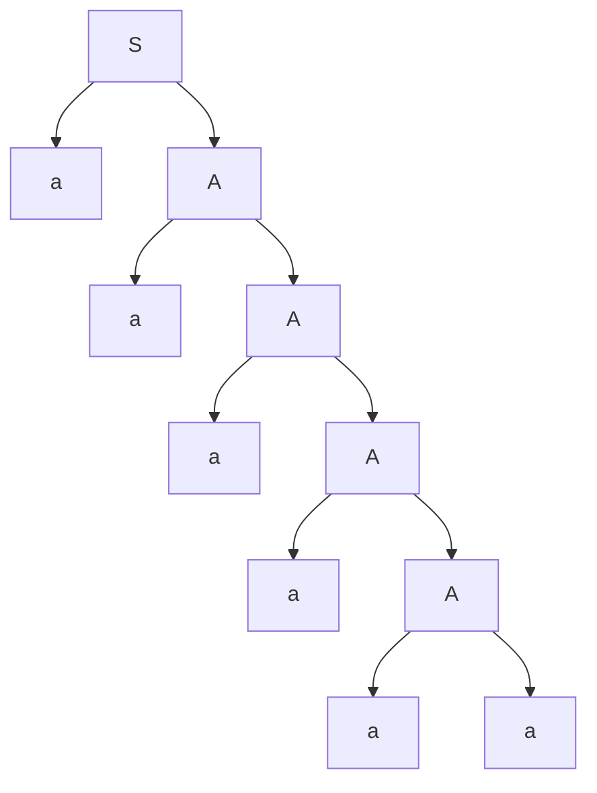
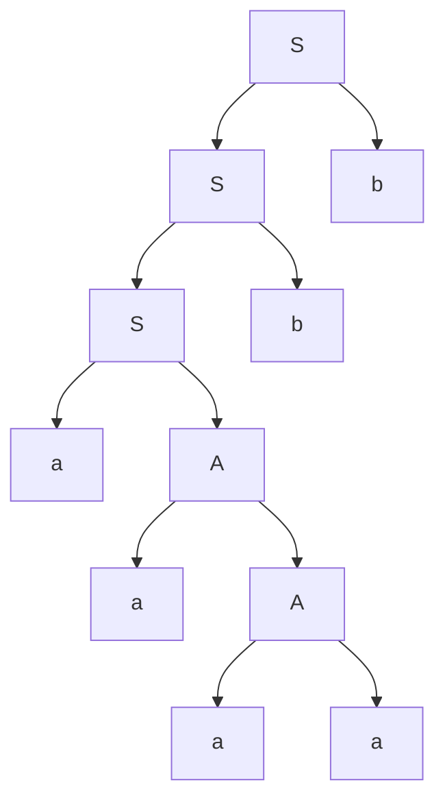
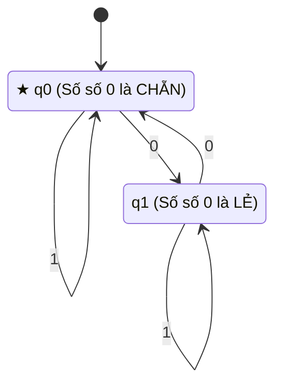

# CẨM NANG TOÀN DIỆN LÝ THUYẾT & VÍ DỤ MINH HỌA ÔN THI GIỮA KỲ
## MÔN: LÝ THUYẾT OTOMAT VÀ NGÔN NGỮ HÌNH THỨC (IUH)
### (HỌC BẰNG HÌNH DUNG TRỰC QUAN & TUYỂN TẬP VÍ DỤ ĐIỂN HÌNH - KHÔNG HỌC VẸT LÝ THUYẾT SUÔNG)

> **Tài liệu học tập & Ôn thi độc quyền chuẩn cấu trúc đề thi giữa kỳ:**
> - Tuyển chọn ví dụ từ toàn bộ hệ thống tài liệu: Thư mục `1-2` (Bài tập Chương 1), `3-4` (NFA), `5-6` (DFA & Tối thiểu hóa) và Slide bài giảng `GK` (Tuần 1 đến Tuần 8).
> - Mỗi khái niệm lý thuyết đều đi kèm **Hình dung đời sống** + **Ví dụ mẫu giải chi tiết từng bước** + **Mẹo phòng thi**.
> - Chuẩn hóa ký hiệu 100% tiếng Việt & Unicode trực quan (`→`, `∅`, `★`, `Σ`, `δ`, `ε`, `∈`, `∉`, `∪`, `∩`, `^*`, `^+`, `⇒`, `<`, `>`). Không bị lỗi font.

---

# MỤC LỤC
- [1. CHUYÊN ĐỀ 1: BẢNG CHỮ CÁI, CHUỖI VÀ PHÉP LẶP NGÔN NGỮ L* (TRỌNG TÂM CÂU 4)](#1-chuyên-đề-1-bảng-chữ-cái-chuỗi-và-phép-lặp-ngôn-ngữ-l-trọng-tâm-câu-4)
  - [1.1. Bảng chữ cái, Từ, Độ dài và Chuỗi rỗng ε](#11-bảng-chữ-cái-từ-độ-dài-và-chuỗi-rỗng-ε)
    - [Ví dụ 1.1: Tính độ dài chuỗi có lũy thừa phức tạp](#ví-dụ-11-tính-độ-dài-chuỗi-có-lũy-thừa-phức-tạp)
    - [Ví dụ 1.2: Liệt kê 5 chuỗi ngắn nhất theo thứ tự từ điển (Dạng Bài 1 Chương 1)](#ví-dụ-12-liệt-kê-5-chuỗi-ngắn-nhất-theo-thứ-tự-từ-điển-dạng-bài-1-chương-1)
  - [1.2. Phép đảo ngược chuỗi w^R và Chuỗi đối xứng (Palindrome)](#12-phép-đảo-ngược-chuỗi-wr-và-chuỗi-đối-xứng-palindrome)
  - [1.3. Phép nhân ghép hai ngôn ngữ L1 . L2](#13-phép-nhân-ghép-hai-ngôn-ngữ-l1--l2)
  - [1.4. ĐỊNH NGHĨA CHUẨN ĐI THI CỦA PHÉP LẶP NGÔN NGỮ L* (BAO ĐÓNG KLEENE)](#14-định-nghĩa-chuẩn-đi-thi-của-phép-lặp-ngôn-ngữ-l-bao-đóng-kleene)
    - [Ví dụ 1.3: Tính các lũy thừa L^0, L^1, L^2, L^3 của ngôn ngữ](#ví-dụ-13-tính-các-lũy-thừa-l0-l1-l2-l3-của-ngôn-ngữ)
  - [1.5. BÍ KÍP "BẺ KHÓA" CÂU HỎI: CHUỖI NÀO THUỘC L*?](#15-bí-kíp-bẻ-khóa-câu-hỏi-chuỗi-nào-thuộc-l)
    - [Ví dụ 1.4: Bài toán kiểm tra 6 chuỗi lũy thừa (Đề thi giữa kỳ thật)](#ví-dụ-14-bài-toán-kiểm-tra-6-chuỗi-lũy-thừa-đề-thi-giữa-kỳ-thật)
    - [Ví dụ 1.5: Kiểm tra chuỗi thuộc L* với L = {01, 10, 11}](#ví-dụ-15-kiểm-tra-chuỗi-thuộc-l-với-l--01-10-11)
- [2. CHUYÊN ĐỀ 2: BIỂU THỨC CHÍNH QUY (REGEX) (TRỌNG TÂM CÂU 1)](#2-chuyên-đề-2-biểu-thức-chính-quy-regex-trọng-tâm-câu-1)
  - [2.1. Bản chất của Biểu thức chính quy qua các khối hình học](#21-bản-chất-của-biểu-thức-chính-quy-qua-các-khối-hình-học)
  - [2.2. Bảng 8 mẫu Regex kinh điển hay ra thi kèm ví dụ cụ thể](#22-bảng-8-mẫu-regex-kinh-điển-hay-ra-thi-kèm-ví-dụ-cụ-thể)
    - [Ví dụ 2.1: Chuỗi chứa chuỗi con cố định (Dạng Câu 1a đề thi GK)](#ví-dụ-21-chuỗi-chứa-chuỗi-con-cố-định-dạng-câu-1a-đề-thi-gk)
    - [Ví dụ 2.2: Chuỗi bắt đầu bằng ab và kết thúc bằng ba](#ví-dụ-22-chuỗi-bắt-đầu-bằng-ab-và-kết-thúc-bằng-ba)
    - [Ví dụ 2.3: Chuỗi có số lượng chữ số 1 là số lẻ](#ví-dụ-23-chuỗi-có-số-lượng-chữ-số-1-là-số-lẻ)
    - [Ví dụ 2.4: Chuỗi KHÔNG chứa chuỗi con 00](#ví-dụ-24-chuỗi-không-chứa-chuỗi-con-00)
  - [2.3. Giới hạn của Regex: Khi nào một ngôn ngữ KHÔNG CHÍNH QUY? (BẪY THI CÂU 1b)](#23-giới-hạn-của-regex-khi-nào-một-ngôn-ngữ-không-chính-quy-bẫy-thi-câu-1b)
    - [Ví dụ 2.5: Phân tích toàn diện câu hỏi "Số ký tự a gấp 2 lần ký tự b"](#ví-dụ-25-phân-tích-toàn-diện-câu-hỏi-số-ký-tự-a-gấp-2-lần-ký-tự-b)
- [3. CHUYÊN ĐỀ 3: VĂN PHẠM HÌNH THỨC, PHÂN CẤP CHOMSKY & CÂY PHÂN TÍCH (TRỌNG TÂM CÂU 2)](#3-chuyên-đề-3-văn-phạm-hình-thức-phân-cấp-chomsky--cây-phân-tích-trọng-tâm-câu-2)
  - [3.1. Bản chất văn phạm qua ví dụ đời thường](#31-bản-chất-văn-phạm-qua-ví-dụ-đời-thường)
  - [3.2. BẢNG PHÂN CẤP CHOMSKY 10 GIÂY ĂN TRỌN ĐIỂM CÂU 2a](#32-bảng-phân-cấp-chomsky-10-giây-ăn-trọn-điểm-câu-2a)
    - [Ví dụ 3.1: Minh họa phân loại 4 cấp Chomsky từ 4 văn phạm cụ thể](#ví-dụ-31-minh-họa-phân-loại-4-cấp-chomsky-từ-4-văn-phạm-cụ-thể)
    - [Ví dụ 3.2: BẪY THI TRỘN LẪN TUYẾN TÍNH TRÁI VÀ PHẢI (Đề thi GK thật)](#ví-dụ-32-bẫy-thi-trộn-lẫn-tuyến-tính-trái-và-phải-đề-thi-gk-thật)
  - [3.3. Dãy dẫn xuất & Cây phân tích cú pháp (Parse Tree)](#33-dãy-dẫn-xuất--cây-phân-tích-cú-pháp-parse-tree)
    - [Ví dụ 3.3: Dẫn xuất & Cây phân tích cho chuỗi aaaaaa và aaaabb](#ví-dụ-33-dẫn-xuất--cây-phân-tích-cho-chuỗi-aaaaaa-và-aaaabb)
    - [Ví dụ 3.4: Cách chứng minh chuỗi aaaabbbba KHÔNG THUỘC văn phạm](#ví-dụ-34-cách-chứng-minh-chuỗi-aaaabbbba-không-thuộc-văn-phạm)
  - [3.4. Phương pháp tìm ngôn ngữ L(G) sinh bởi văn phạm](#34-phương-pháp-tìm-ngôn-ngữ-lg-sinh-bởi-văn-phạm)
    - [Ví dụ 3.5: Tìm ngôn ngữ của văn phạm S → Sb | aA, A → aA | a](#ví-dụ-35-tìm-ngôn-ngữ-của-văn-phạm-s--sb--aa-a--aa--a)
    - [Ví dụ 3.6: Văn phạm Palindrome S → aSa | bSb | a | b | ε (Bài 2 Chương 1)](#ví-dụ-36-văn-phạm-palindrome-s--asa--bsb--a--b--ε-bài-2-chương-1)
- [4. CHUYÊN ĐỀ 4: ÔTÔMÁT HỮU HẠN DFA & NFA (TRỌNG TÂM CÂU 3)](#4-chuyên-đề-4-ôtômát-hữu-hạn-dfa--nfa-trọng-tâm-câu-3)
  - [4.1. Bản chất Otomat: Cỗ máy nhận dạng chuỗi qua trò chơi nhảy ô](#41-bản-chất-otomat-cỗ-máy-nhận-dạng-chuỗi-qua-trò-chơi-nhảy-ô)
  - [4.2. Định nghĩa hình thức bộ 5 thành phần & Bảng hàm chuyển](#42-định-nghĩa-hình-thức-bộ-5-thành-phần--bảng-hàm-chuyển)
    - [Ví dụ 4.1: Otomat 3 trạng thái trong Đề thi giữa kỳ thật](#ví-dụ-41-otomat-3-trạng-thái-trong-đề-thi-giữa-kỳ-thật)
  - [4.3. Cách viết chuỗi được chấp nhận và chuỗi bị từ chối kèm vết đường đi](#43-cách-viết-chuỗi-được-chấp-nhận-và-chuỗi-bị-từ-chối-kèm-vết-đường-đi)
  - [4.4. Ví dụ DFA đếm số lượng chữ số 0 là chẵn](#44-ví-dụ-dfa-đếm-số-lượng-chữ-số-0-là-chẵn)
  - [4.5. Ví dụ NFA đoán nhận chuỗi chứa 01 & Kỹ thuật lần vết tập trạng thái](#45-ví-dụ-nfa-đoán-nhận-chuỗi-chứa-01--kỹ-thuật-lần-vết-tập-trạng-thái)
- [5. BẢNG CHECKLIST 10 ĐIỂM TRƯỚC KHI NỘP BÀI THI](#5-bảng-checklist-10-điểm-trước-khi-nộp-bài-thi)

---

# 1. CHUYÊN ĐỀ 1: BẢNG CHỮ CÁI, CHUỖI VÀ PHÉP LẶP NGÔN NGỮ L* (TRỌNG TÂM CÂU 4)

### 1.1. Bảng chữ cái, Từ, Độ dài và Chuỗi rỗng ε

#### [TRỰC QUAN] Hình dung trực quan:
- **Bảng chữ cái (Σ):** Hãy tưởng tượng như một **hộp xếp hình Lego** chỉ có vài loại mảnh ghép cơ bản. Ví dụ hộp `Σ = {0, 1}` chỉ có 2 loại mảnh: mảnh số `0` và mảnh số `1`.
- **Từ / Chuỗi (w):** Là một **mô hình Lego hoàn chỉnh** được lắp ráp từ các mảnh ghép trong hộp. Ví dụ: `010`, `11001`.
- **Độ dài chuỗi (|w|):** Đơn giản là **đếm xem mô hình có bao nhiêu mảnh ghép**.
- **Chuỗi rỗng ε:** Là chiếc **bàn trống trơn, chưa gắn mảnh Lego nào cả**. Số mảnh ghép là 0 (`|ε| = 0`). Ghép bàn trống vào trước hay sau mô hình nào thì mô hình đó vẫn giữ nguyên (`εw = wε = w`).

---

#### [VÍ DỤ] Ví dụ 1.1: Tính độ dài chuỗi có lũy thừa phức tạp
*(Dạng bài tập cơ bản hay gặp trong đề thi trắc nghiệm và câu kiểm tra độ dài)*

**Đề bài:** Cho bảng chữ cái `Σ = {a, b, c}`. Tính độ dài của các chuỗi sau:
1. `w1 = (ab)^3 c^4 ba^2`
2. `w2 = b^5 a^3 b^3 (abc)^2 ab`

**Lời giải chi tiết từng bước:**
- Với `w1 = (ab)^3 c^4 ba^2`:
  + `(ab)^3` gồm 3 cặp `ab` ⇒ có `3 × 2 = 6` ký tự.
  + `c^4` gồm 4 chữ `c` ⇒ có `4` ký tự.
  + `b` có `1` ký tự.
  + `a^2` gồm 2 chữ `a` ⇒ có `2` ký tự.
  + Tổng độ dài: `|w1| = 6 + 4 + 1 + 2 = 13` (Số lẻ).
- Với `w2 = b^5 a^3 b^3 (abc)^2 ab`:
  + `b^5` có 5 ký tự.
  + `a^3` có 3 ký tự.
  + `b^3` có 3 ký tự.
  + `(abc)^2` gồm 2 cụm `abc` ⇒ có `2 × 3 = 6` ký tự.
  + `ab` có 2 ký tự.
  + Tổng độ dài: `|w2| = 5 + 3 + 3 + 6 + 2 = 19` (Số lẻ).

---

#### [VÍ DỤ] Ví dụ 1.2: Liệt kê 5 chuỗi ngắn nhất theo thứ tự từ điển (Dạng Bài 1 Chương 1)
*(Trích từ file bài tập `1-2/giai_bai_tap_chuong_1.md` - Đề thi rất hay ra câu này để kiếm 1 điểm)*

**Đề bài:** Cho bảng chữ cái `Σ = {a, b}`. Hãy đưa ra 5 chuỗi có độ dài ngắn nhất (theo thứ tự từ điển với quy ước chuỗi rỗng `ε` đứng trước, chiều dài tăng dần) của các ngôn ngữ sau:
a) `L1 = { u u u^R | u ∈ Σ^* }` (với `u^R` là chuỗi đảo ngược của `u`).
b) `L2 = { u a u^R | u ∈ Σ^* }`.

**Lời giải chi tiết từng bước:**

**Câu a: Xét `L1 = { u u u^R | u ∈ Σ^* }`:**
Ta duyệt các chuỗi `u` theo độ dài tăng dần và thứ tự từ điển:
- Với `|u| = 0`: `u = ε` ⇒ u u u^R = ε . ε . ε = ε (độ dài 0).
- Với `|u| = 1`:
  + `u = a` ⇒ u u u^R = a . a . a^R = aaa (độ dài 3).
  + `u = b` ⇒ u u u^R = b . b . b^R = bbb (độ dài 3).
- Với `|u| = 2`:
  + `u = aa` ⇒ u u u^R = (aa)(aa)(aa)^R = aaaaaa (độ dài 6).
  + `u = ab` ⇒ u u u^R = (ab)(ab)(ab)^R = ababba (độ dài 6).
- => **Kết luận 5 chuỗi ngắn nhất:** `ε`, `aaa`, `bbb`, `aaaaaa`, `ababba`.

**Câu b: Xét `L2 = { u a u^R | u ∈ Σ^* }`:**
- Với `|u| = 0`: `u = ε` ⇒ u a u^R = ε . a . ε = a (độ dài 1).
- Với `|u| = 1`:
  + `u = a` ⇒ u a u^R = a . a . a^R = aaa (độ dài 3).
  + `u = b` ⇒ u a u^R = b . a . b^R = bab (độ dài 3).
- Với `|u| = 2`:
  + `u = aa` ⇒ u a u^R = aa . a . aa = aaaaa (độ dài 5).
  + `u = ab` ⇒ u a u^R = ab . a . ba = ababa (độ dài 5).
- => **Kết luận 5 chuỗi ngắn nhất:** `a`, `aaa`, `bab`, `aaaaa`, `ababa`.

---

### 1.2. Phép đảo ngược chuỗi w^R và Chuỗi đối xứng (Palindrome)
- **Chuỗi đảo ngược (`w^R`):** Đọc chuỗi từ phải sang trái.  
  *Ví dụ:* `(01101)^R = 10110`; `(ab)^R = ba`.
- **Tính chất quan trọng:** Đảo ngược của một tích ghép hai chuỗi sẽ bằng tích ghép hai chuỗi đảo ngược theo thứ tự NGƯỢC LẠI:
  ```text
                      (u . v)^R = v^R . u^R
  ```
- **Chuỗi đối xứng (Palindrome):** Là chuỗi đọc xuôi hay đọc ngược đều hoàn toàn như nhau (`w = w^R`).  
  *Ví dụ:* `abba`, `radar`, `10101`.

---

### 1.3. Phép nhân ghép hai ngôn ngữ L1 . L2

#### [TRỰC QUAN] Hình dung trực quan:
Phép nhân ghép ngôn ngữ giống như việc **phối trang phục**:
- Tủ áo có tập `L1 = {áo đỏ, áo trắng}`.
- Tủ quần có tập `L2 = {quần jean, quần tây}`.
- Tích `L1 . L2` là tất cả các cách bạn lấy 1 chiếc áo từ `L1` mặc cùng 1 chiếc quần từ `L2`:
  `L1 . L2 = { (áo đỏ, quần jean), (áo đỏ, quần tây), (áo trắng, quần jean), (áo trắng, quần tây) }`.

**Ví dụ cụ thể:**  
Cho `L1 = {a, ab}` và `L2 = {0, 1}`.  
Khi đó: `L1 . L2 = { a0, a1, ab0, ab1 }`.

---

### 1.4. ĐỊNH NGHĨA CHUẨN ĐI THI CỦA PHÉP LẶP NGÔN NGỮ L* (BAO ĐÓNG KLEENE)

> [!IMPORTANT]
> **ĐÂY LÀ ĐÁP ÁN CHUẨN 100% ĐỂ CHÉP VÀO CÂU 4a TRONG ĐỀ THI:**

```text
ĐỊNH NGHĨA TOÁN HỌC CỦA PHÉP LẶP NGÔN NGỮ L* (KLEENE STAR):

Cho ngôn ngữ L trên bảng chữ cái Σ. Phép lặp của ngôn ngữ L, ký hiệu là L*, 
được định nghĩa là hợp của tất cả các lũy thừa không âm của ngôn ngữ L:

         L* = ∪ (k = 0 đến ∞) L^k = L^0 ∪ L^1 ∪ L^2 ∪ L^3 ∪ ...

Trong đó các lũy thừa L^k được xác định như sau:
  1. L^0 = {ε} : Tập hợp chỉ chứa duy nhất phần tử là chuỗi rỗng ε.
                 Đại diện cho việc kết nối 0 lần các chuỗi từ ngôn ngữ L.
  2. L^1 = L   : Bản thân ngôn ngữ L ban đầu (chọn ra 1 chuỗi bất kỳ từ L).
  3. L^2 = L . L = { xy | x ∈ L, y ∈ L } : Tập hợp tất cả các chuỗi được tạo 
                 thành bằng cách ghép nối hai chuỗi bất kỳ thuộc L lại với nhau.
  4. L^k = L^(k-1) . L  (với k ≥ 1) : Tích ghép k lần các chuỗi thuộc L.

Ý NGHĨA: 
Một chuỗi w bất kỳ thuộc về L* khi và chỉ khi:
  - w = ε (chuỗi rỗng), HOẶC
  - w có thể phân tích thành tích ghép của một số hữu hạn các từ thuộc L:
         w = w1 . w2 ... wk  (với k ≥ 1 và mọi wi ∈ L).
```

---

#### [VÍ DỤ] Ví dụ 1.3: Tính các lũy thừa L^0, L^1, L^2, L^3 của ngôn ngữ
*(Trích từ Slide Chương 1 & Bài tập IUH)*

**Đề bài:** Cho bảng chữ cái `Σ = {a, b}` và ngôn ngữ `L = {a, ab}`.  
Hãy xác định các tập hợp `L^0`, `L^1`, `L^2` và `L^3`.

**Lời giải chi tiết từng bước:**
1. `L^0 = {ε}` (theo định nghĩa, lũy thừa 0 chỉ chứa duy nhất chuỗi rỗng `ε`).
2. `L^1 = L = {a, ab}`.
3. `L^2 = L . L`: Ta lấy mỗi phần tử trong `L` ghép với từng phần tử trong `L`:
   - Ghép với `a`: `a . a = aa`; `a . ab = aab`.
   - Ghép với `ab`: `ab . a = aba`; `ab . ab = abab`.
   - => **Kết quả:** `L^2 = {aa, aab, aba, abab}` (gồm 4 chuỗi).
4. `L^3 = L^2 . L`: Lấy mỗi chuỗi trong `L^2` ghép với `{a, ab}`:
   - `aa` ghép: `aaa`, `aaab`.
   - `aab` ghép: `aaba`, `aabab`.
   - `aba` ghép: `abaa`, `abaab`.
   - `abab` ghép: `ababa`, `ababab`.
   - => **Kết quả:** `L^3 = {aaa, aaab, aaba, aabab, abaa, abaab, ababa, ababab}` (gồm 8 chuỗi).

---

### 1.5. BÍ KÍP "BẺ KHÓA" CÂU HỎI: CHUỖI NÀO THUỘC L*?

Khi gặp dạng bài: *Cho ngôn ngữ `L = {w1, w2, ..., wm}`. Hãy xác định chuỗi nào sau đây thuộc về `L^*`*, hãy thực hiện **2 BƯỚC THẦN TỐC**:

```text
┌────────────────────────────────────────────────────────────────────────┐
│ QUY TRÌNH 2 BƯỚC XÁC ĐỊNH CHUỖI THUỘC L*                              │
├────────────────────────────────────────────────────────────────────────┤
│ BƯỚC 1: KIỂM TRA ĐỘ DÀI (LỌC BỎ 80% CHUỖI SAI TRONG 5 GIÂY)            │
│  - Nếu mọi từ trong L đều có độ dài là k (ví dụ k = 2):                │
│    Mọi chuỗi thuộc L* bắt buộc độ dài |w| phải chia hết cho k!         │
│    => Nếu |w| là số LẺ (không chia hết cho 2) => KẾT LUẬN NGAY: w ∉ L* │
│                                                                        │
│ BƯỚC 2: PHÂN RÃ CHUỖI THÀNH CÁC KHỐI THUỘC L (CHO CÁC CHUỖI CHẴN)     │
│  - Tách chuỗi từ trái sang phải thành các khối 2 ký tự.                │
│  - Đối chiếu với tập L: nếu gặp khối không có trong L => w ∉ L*.       │
│  - Nếu phân rã trọn vẹn từ đầu đến cuối thành các từ thuộc L => w ∈ L*.│
└────────────────────────────────────────────────────────────────────────┘
```

---

#### [VÍ DỤ] Ví dụ 1.4: Bài toán kiểm tra 6 chuỗi lũy thừa (Đề thi giữa kỳ thật)
*(Trích từ Câu 4b trong `Automata - Đề ôn tập GK 1.pdf`)*

**Đề bài:** Cho ngôn ngữ `L = {ab, bb, cc, ba, ca}`. Hãy xác định các chuỗi sau có thuộc `L^*` không:
1. `(ab)^2 c^8 bab^3 ac^3`
2. `(ab)^3 c^8 bab^2 ac^3`
3. `(ab)^3 c^8 bac b^3 ac^2`
4. `b^3 a^2 b^3 (ac)^2 ab`
5. `b^5 a^3 b^3 (abc)^2 ab`
6. `b^7 a^2 b^3 (ac)^2 aab`

**Lời giải mẫu từng bước chuẩn thi:**
- **Nhận xét đặc trưng của tập `L`:**  
  Mọi phần tử trong `L` đều có độ dài bằng 2 (`|w| = 2`).  
  Do đó, mọi chuỗi thuộc `L^*` **bắt buộc phải có độ dài là một SỐ CHẴN!**
- **Các khối 2 ký tự hợp lệ (thuộc L):** `ab`, `bb`, `cc`, `ba`, `ca`.
- **Các khối 2 ký tự bất hợp lệ (không có trong L):** `aa`, `bc`, `cb`, `ac`.

**Phân tích từng chuỗi:**
1. `(ab)^2 c^8 bab^3 ac^3`:  
   Độ dài: `|w1| = (2 × 2) + 8 + 1 + 1 + 3 + 1 + 3 = 21` (Số lẻ).  
   => **Kết luận:** Độ dài lẻ ⇒ **KHÔNG THUỘC `L^*`**.
2. `(ab)^3 c^8 bab^2 ac^3`:  
   Độ dài: `|w2| = (2 × 3) + 8 + 1 + 1 + 2 + 1 + 3 = 22` (Số chẵn).  
   Phân rã khối: `(ab)^3 = ab . ab . ab` (∈ L^*), `c^8 = cc . cc . cc . cc` (∈ L^*), `ba` (∈ L), `bb` (∈ L).  
   Đoạn cuối còn lại: `ac^3 = accc`. Cặp 2 ký tự đầu tiên là `ac`. Nhưng `ac ∉ L`!  
   => **Kết luận:** Bị kẹt ở `accc` ⇒ **KHÔNG THUỘC `L^*`**.
3. `(ab)^3 c^8 bac b^3 ac^2`:  
   Độ dài: `|w3| = 6 + 8 + 3 + 3 + 3 = 23` (Số lẻ) ⇒ **KHÔNG THUỘC `L^*`**.
4. `b^3 a^2 b^3 (ac)^2 ab`:  
   Độ dài: `|w4| = 3 + 2 + 3 + 4 + 2 = 14` (Số chẵn).  
   Tách: `bb` (∈ L), `ba` (∈ L), `ab` (∈ L), `bb` (∈ L).  
   Phần tiếp theo là `(ac)^2 = acac` chứa cặp `ac ∉ L`.  
   => **Kết luận:** **KHÔNG THUỘC `L^*`** *(nếu đề in nhầm `(ac)^2` thay vì `(ca)^2` thì chuỗi mới thuộc `L^*`)*.
5. `b^5 a^3 b^3 (abc)^2 ab`:  
   Độ dài: `|w5| = 5 + 3 + 3 + 6 + 2 = 19` (Số lẻ) ⇒ **KHÔNG THUỘC `L^*`**.
6. `b^7 a^2 b^3 (ac)^2 aab`:  
   Độ dài: `|w6| = 7 + 2 + 3 + 4 + 3 = 19` (Số lẻ) ⇒ **KHÔNG THUỘC `L^*`**.

=> **KẾT LUẬN TỔNG QUÁT:** Cả 6 chuỗi trên đều **KHÔNG THUỘC `L^*`**.

---

#### [VÍ DỤ] Ví dụ 1.5: Kiểm tra chuỗi thuộc L* với L = {01, 10, 11}
*(Dạng bài tập luyện tập trong Slide Tuần 1)*

**Đề bài:** Cho `L = {01, 10, 11}`. Kiểm tra xem các chuỗi sau có thuộc `L^*` không:  
a) `w1 = 011011`  
b) `w2 = 10011`  
c) `w3 = 111001`

**Lời giải:**
- Mọi từ trong `L` đều dài 2 ⇒ chuỗi thuộc `L^*` phải có độ dài chẵn.
- a) `|w1| = 6` (chẵn). Tách: `01` (∈ L), `10` (∈ L), `11` (∈ L) ⇒ **`w1 ∈ L^*`** (Thỏa mãn).
- b) `|w2| = 5` (lẻ) ⇒ **`w2 ∉ L^*`** ngay lập tức!
- c) `|w3| = 6` (chẵn). Tách: `11` (∈ L), `10` (∈ L), `01` (∈ L) ⇒ **`w3 ∈ L^*`** (Thỏa mãn).

---

# 2. CHUYÊN ĐỀ 2: BIỂU THỨC CHÍNH QUY (REGEX) (TRỌNG TÂM CÂU 1)

### 2.1. Bản chất của Biểu thức chính quy qua các khối hình học

```text
Ba phép toán cơ bản của Regex tương đương với sơ đồ đường đi:
1. Phép HỢP (dấu + hoặc |)    : NGÃ RẼ (Hoặc đi đường trên, hoặc đi đường dưới).
   (a + b)                    : Bạn có thể chọn chữ 'a' HOẶC chữ 'b'.

2. Phép GHÉP NỐI (viết liền)  : ĐI THẲNG (Đi qua chặng 1 rồi đi tiếp chặng 2).
   ab                         : Phải qua chữ 'a', rồi NGAY LẬP TỨC qua chữ 'b'.

3. Phép LẶP SAO (dấu *)       : VÒNG XOAY LẶP LẠI (Tùy ý từ 0 đến vô hạn lần).
   a*                         : Không đi vòng nào (chuỗi rỗng ε), hoặc đi 1 vòng (a),
                                hoặc đi 2 vòng (aa), 3 vòng (aaa)...
   (a + b)*                   : Tập hợp TẤT CẢ CÁC CHUỖI có thể tạo ra từ {a, b}.
```

---

### 2.2. Bảng 8 mẫu Regex kinh điển hay ra thi kèm ví dụ cụ thể

| Dạng yêu cầu đề bài | Bảng chữ cái | Biểu thức chính quy (Regex) | Ví dụ chuỗi thỏa mãn |
| :--- | :---: | :--- | :--- |
| **1. Mọi chuỗi bất kỳ** | `{a, b}` | `(a + b)^*` | `ε`, `a`, `b`, `ab`, `bba` |
| | `{a, b, c}` | `(a + b + c)^*` | `ε`, `c`, `abc`, `ccba` |
| **2. Bắt đầu bằng chuỗi u** | `{a, b}` | `u(a + b)^*` | Ví dụ bắt đầu bằng `ab`: `ab`, `aba`, `abbb` |
| **3. Kết thúc bằng chuỗi v** | `{a, b}` | `(a + b)^* v` | Ví dụ kết thúc bằng `ba`: `ba`, `aba`, `baba` |
| **4. Bắt đầu bằng u và kết thúc bằng v** | `{a, b}` | `u(a + b)^* v` *(nếu u, v không đè nhau)* | Bắt đầu `ab` kết thúc `ba`: `abba`, `ababa` |
| **5. Chứa chuỗi con cố định u** | `{0, 1}` | `(0 + 1)^* u (0 + 1)^*` | Chứa `010`: `010`, `1010`, `01011` |
| **6. Chứa chuỗi con u HOẶC v** | `{a, b, c}` | `(a + b + c)^* (u + v) (a + b + c)^*` | Chứa `acab` hoặc `bbac` **(Câu 1a đề thi GK!)** |
| **7. Số lượng ký tự cố định là LẺ** | `{0, 1}` | `0^* 1 0^* (0^* 1 0^* 1 0^*)^*` | Có số chữ số 1 là lẻ: `1`, `010`, `111`, `01011` |
| **8. Không chứa chuỗi con `00`** | `{0, 1}` | `(1 + 01)^* (ε + 0)` | `ε`, `0`, `1`, `01`, `101`, `1010` (không có `00`) |

---

#### [VÍ DỤ] Ví dụ 2.1: Chuỗi chứa chuỗi con cố định (Dạng Câu 1a đề thi GK)
**Đề bài:** Xét bảng chữ cái `Σ = {a, b, c}`. Hãy tìm biểu thức chính quy đại diện cho tất cả các chuỗi có chứa chuỗi con `acab` hoặc `bbac`.

**Cách tư duy hình dung:**
- Chuỗi chứa `acab` thì phía trước nó có thể là bất kỳ ký tự nào trên `{a, b, c}`, biểu diễn bởi `(a + b + c)^*`.
- Phía sau `acab` cũng có thể là bất kỳ ký tự nào, biểu diễn bởi `(a + b + c)^*`.
- Vậy chuỗi chứa `acab` là: `(a + b + c)^* acab (a + b + c)^*`.
- Tương tự, chuỗi chứa `bbac` là: `(a + b + c)^* bbac (a + b + c)^*`.
- Gộp hai trường hợp bằng phép "hoặc" `+`:
  => **Đáp án:** `r = (a + b + c)^* (acab + bbac) (a + b + c)^*`.

---

#### [VÍ DỤ] Ví dụ 2.2: Chuỗi bắt đầu bằng ab và kết thúc bằng ba
*(Trích từ Slide Tuần 7 - Chương 3)*

**Đề bài:** Tìm biểu thức chính quy trên `Σ = {a, b}` đại diện cho tất cả các chuỗi bắt đầu bằng `ab` và kết thúc bằng `ba`.

**Cách tư duy hình dung:**
- Phía trước bắt buộc là `ab`.
- Phía sau bắt buộc là `ba`.
- Phần ở giữa là chuỗi tùy ý: `(a + b)^*`.
- Trường hợp ngắn nhất: `abba` (vừa bắt đầu bằng `ab`, vừa kết thúc bằng `ba`, phần giữa là `ε`).
- => **Đáp án:** `r = ab (a + b)^* ba`.

---

#### [VÍ DỤ] Ví dụ 2.3: Chuỗi có số lượng chữ số 1 là số lẻ
*(Trích từ Slide Tuần 7 - Bài tập mẫu)*

**Đề bài:** Tìm biểu thức chính quy cho tập hợp các chuỗi nhị phân trên `{0, 1}` có số lượng chữ số 1 là số lẻ.

**Cách tư duy hình dung:**
- Số lượng chữ số `0` có thể xuất hiện tùy ý không hạn chế, biểu diễn bởi `0^*`.
- Để số lượng chữ số 1 là lẻ, chuỗi phải có:
  + Đúng một chữ số 1 lẻ: `0^* 1 0^*`.
  + Sau đó có thể đi kèm một số chẵn các chữ số 1 (mỗi cặp gồm 2 chữ số 1): `(0^* 1 0^* 1 0^*)^*`.
- => **Đáp án:** `r = 0^* 1 0^* (0^* 1 0^* 1 0^*)^*`  
  *(Hoặc viết gọn: `r = (0 + 10^* 1)^* 1 0^*`)*.

---

#### [VÍ DỤ] Ví dụ 2.4: Chuỗi KHÔNG chứa chuỗi con 00
*(Dạng bài tập phân loại điểm 9-10)*

**Đề bài:** Tìm biểu thức chính quy cho tập hợp các chuỗi nhị phân trên `{0, 1}` không chứa chuỗi con `00`.

**Cách tư duy hình dung:**
- Vì không được có `00`, nên hễ xuất hiện một chữ số `0` thì ngay sau nó **bắt buộc phải có chữ số `1` chặn lại** để không bị số 0 tiếp theo đi liền ⇒ tạo thành cụm `01`.
- Các chữ số `1` đứng riêng lẻ tự do thì hoàn toàn không sao ⇒ chọn `1`.
- Do đó các khối cơ sở là: `(1 + 01)^*`.
- Ở cuối cùng của chuỗi, có thể có thêm một chữ số `0` đứng lẻ loi (vì là ký tự cuối cùng nên không sợ có số 0 nào theo sau nữa) hoặc không có gì (`ε`) ⇒ đuôi là `(ε + 0)`.
- => **Đáp án:** `r = (1 + 01)^* (ε + 0)`.

---

### 2.3. Giới hạn của Regex: Khi nào một ngôn ngữ KHÔNG CHÍNH QUY? (BẪY THI CÂU 1b)

#### [TRỰC QUAN] Hình dung trực quan:
Một Otomat hữu hạn (tương đương với Biểu thức chính quy) giống như một **người chỉ có 3 hoặc 4 ngón tay (bộ nhớ hữu hạn)**.
- Người đó có thể kiểm tra xem chuỗi có bắt đầu bằng `ab` không, có chứa `00` không (chỉ cần nhìn vài ký tự hiện tại).
- Nhưng nếu bạn yêu cầu: *"Hãy đếm xem có bao nhiêu chữ a, và kiểm tra xem số chữ a có đúng bằng 2 lần số chữ b hay không với chuỗi dài hàng triệu ký tự?"*
- Người đó sẽ **CHỊU THUA** vì không đủ ngón tay để đếm và ghi nhớ số lượng vô hạn!

> [!WARNING]
> **DẤU HIỆU NHẬN BIẾT NGÔN NGỮ KHÔNG PHẢI LÀ CHÍNH QUY (NON-REGULAR):**
> Hễ đề bài có điều kiện so sánh số lượng hai loại ký tự:
> - Số chữ `a` bằng số chữ `b` (`N_a(w) = N_b(w)`).
> - Số chữ `a` gấp đôi số chữ `b` (`N_a(w) = 2 . N_b(w)`).
> - Chuỗi lũy thừa đối xứng: `L = {a^n b^n | n ≥ 0}` hoặc chuỗi Palindrome `L = {w w^R}`.
> ⇒ **TẤT CẢ ĐỀU KHÔNG THỂ CÓ BIỂU THỨC CHÍNH QUY!**

---

#### [VÍ DỤ] Ví dụ 2.5: Phân tích toàn diện câu hỏi "Số ký tự a gấp 2 lần ký tự b"
*(Trích từ Câu 1b trong `Automata - Đề ôn tập GK 1.pdf`)*

**Đề bài:** Xét bảng chữ cái `Σ = {a, b, c}`. Hãy tìm biểu thức chính quy đại diện cho tất cả các chuỗi sao cho số lượng ký tự `a` nhiều gấp 2 lần số lượng ký tự `b` có trong chuỗi.

**Cách làm chuẩn mực đạt điểm tối đa:**
```text
BÀI LÀM:

Ngôn ngữ cần biểu diễn: L = { w ∈ {a, b, c}* | Na(w) = 2 . Nb(w) }.

1. XÉT THEO LÝ THUYẾT CHÍNH QUY HÌNH THỨC:
   - Ngôn ngữ L yêu cầu so sánh số lượng không giới hạn giữa ký tự a và ký tự b. 
     Do Otomat hữu hạn chỉ có số trạng thái hữu hạn, nó không thể đếm số lượng 
     ký tự tùy ý lớn.
   - Thật vậy, nếu L là chính quy thì L ∩ a* b* = { a^(2n) b^n | n ≥ 0 } cũng phải 
     là chính quy (vì lớp chính quy đóng với phép giao). Nhưng theo Bổ đề Bơm 
     (Pumping Lemma), ngôn ngữ { a^(2n) b^n } không chính quy. 
   => Mâu thuẫn! Vậy L KHÔNG PHẢI LÀ NGÔN NGỮ CHÍNH QUY.
   => KẾT LUẬN: KHÔNG TỒN TẠI biểu thức chính quy đại diện cho toàn bộ ngôn ngữ L.

2. NẾU ĐỀ BÀI QUY ƯỚC CHUỖI TẠO TỪ CÁC KHỐI CỐ ĐỊNH:
   Nếu quy ước mỗi ký tự b luôn đi kèm đúng 2 ký tự a thành các khối {aab, aba, baa} 
   và ký tự c xuất hiện tự do, thì biểu thức chính quy đại diện cho lớp chuỗi khối là:
               r = (c* (aab + aba + baa) c*)* + c*

3. NẾU DÙNG VĂN PHẠM PHI NGỮ CẢNH (CFG) ĐỂ SINH NGÔN NGỮ NÀY:
   Tập luật sinh: S → cS | Sc | aSaSbS | aSbSaS | bSaSaS | ε
```

---

# 3. CHUYÊN ĐỀ 3: VĂN PHẠM HÌNH THỨC, PHÂN CẤP CHOMSKY & CÂY PHÂN TÍCH (TRỌNG TÂM CÂU 2)

### 3.1. Bản chất văn phạm qua ví dụ đời thường

#### [TRỰC QUAN] Hình dung trực quan:
- **Biến (Variables - chữ IN HOA như S, A, B):** Hãy tưởng tượng như **"cục đất sét"**. Nó chưa phải là sản phẩm cuối cùng, bạn có thể nhào nặn và biến đổi nó tiếp.
- **Ký hiệu kết thúc (Terminals - chữ thường như a, b, c hoặc 0, 1):** Là **"viên gạch nung"**. Đã nung thành gạch thì cứng ngắc, không thể nặn hay biến đổi thêm được nữa.
- **Luật sinh (P: α → β):** Là **công thức nặn đất sét**. Ví dụ: `S → aA` nghĩa là: lấy cục đất sét `S`, nặn ra 1 viên gạch `a` và 1 cục đất sét nhỏ `A`.
- **Mục tiêu của văn phạm:** Xuất phát từ cục đất sét ban đầu `S`, áp dụng các công thức cho đến khi **toàn bộ đất sét biến thành gạch nung** (chỉ còn các ký hiệu kết thúc), ta được một câu hợp lệ!

---

### 3.2. BẢNG PHÂN CẤP CHOMSKY 10 GIÂY ĂN TRỌN ĐIỂM CÂU 2a

```text
               CÁC CẤP BẬC VĂN PHẠM THEO CHOMSKY:
Loại 0 (Rộng nhất) ⊃ Loại 1 (Cảm ngữ cảnh) ⊃ Loại 2 (Phi ngữ cảnh) ⊃ Loại 3 (Chính quy)
```

| Cấp Chomsky | Tên gọi | Quy tắc nhận diện siêu nhanh | Ví dụ luật sinh |
| :---: | :--- | :--- | :--- |
| **Loại 0** | **Không hạn chế** *(Unrestricted)* | Vế trái chứa ít nhất 1 biến, vế phải tùy ý. Có luật mà vế trái dài hơn vế phải (`độ dài vế trái > vế phải`). | `aAb → ba` |
| **Loại 1** | **Cảm ngữ cảnh** *(CSL)* | Vế phải luôn dài hơn hoặc bằng vế trái (`độ dài vế trái ≤ vế phải`). Biến bị kẹp trong ngữ cảnh. | `aAb → acb` / `AB → BA` |
| **Loại 2** | **Phi ngữ cảnh** *(CFG)* | **VẾ TRÁI PHẢI LÀ ĐÚNG 1 BIẾN DUY NHẤT (`S → ...`, `A → ...`).** / Vế phải tự do tùy ý! | `S → aSb hoặc ε` / `A → aAb hoặc c` |
| **Loại 3** | **Chính quy** *(Regular)* | Vế trái là đúng 1 biến. Vế phải chỉ được phép có 1 trong 2 dạng: / 1. **Thuần tuyến tính phải:** `A → wB` hoặc `A → w` / 2. **Thuần tuyến tính trái:** `A → Bw` hoặc `A → w` | `S → 0A, A → 1` / *(Tất cả biến đứng sau cùng)* |

---

#### [VÍ DỤ] Ví dụ 3.1: Minh họa phân loại 4 cấp Chomsky từ 4 văn phạm cụ thể
*(Trích từ Slide Tuần 2 - Phân loại Chomsky)*

1. **Văn phạm 1:** `P = { aAb → ba, S → aSb }`.  
   - Xét luật `aAb → ba`: Vế trái có độ dài 3, vế phải có độ dài 2 (`|vế trái| > |vế phải|`).  
   - => **Phân lớp:** **Loại 0 (Văn phạm không hạn chế)**.
2. **Văn phạm 2:** `P = { S → aSBC, CB → BC, bB → bb, C → c }`.  
   - Xét tất cả các luật: Vế phải luôn dài hơn hoặc bằng vế trái (`độ dài vế trái ≤ vế phải`). Vế trái có nhiều hơn 1 ký hiệu (`CB → BC`).  
   - => **Phân lớp:** **Loại 1 (Văn phạm cảm ngữ cảnh - CSL)**.
3. **Văn phạm 3:** `P = { S → aSb, S → ε }`.  
   - Vế trái chỉ gồm đúng 1 biến `S`. Vế phải `aSb` có biến `S` bị kẹp giữa `a` và `b` (không phải tuyến tính trái hay phải).  
   - => **Phân lớp:** **Loại 2 (Văn phạm phi ngữ cảnh - CFG)**.
4. **Văn phạm 4:** `P = { S → 0A, A → 1B, B → 0 }`.  
   - Vế trái là 1 biến. Tất cả các biến ở vế phải đều đứng ở vị trí CUỐI CÙNG (thuần tuyến tính phải).  
   - => **Phân lớp:** **Loại 3 (Văn phạm chính quy - Regular)**.

---

#### [VÍ DỤ] Ví dụ 3.2: BẪY THI TRỘN LẪN TUYẾN TÍNH TRÁI VÀ PHẢI (Đề thi GK thật)
*(Trích từ Câu 2a trong `Automata - Đề ôn tập GK 1.pdf`)*

**Đề bài:** Cho văn phạm `G = <{a, b}, {S, A}, S, {S → Sb | aA, A → aA | a}>`.  
Tìm phân lớp thấp nhất của văn phạm đã cho theo hệ thống phân cấp Chomsky.

**Cách giải thích chuẩn 10/10 khi đi thi:**
```text
BÀI LÀM:

Xét các quy tắc trong tập luật sinh P:
  (1) S → Sb
  (2) S → aA
  (3) A → aA
  (4) A → a

Bước 1: Xét điều kiện Loại 2 (Phi ngữ cảnh):
  Vế trái của tất cả các quy tắc đều là đúng 1 biến duy nhất thuộc V ({S, A}), 
  độ dài vế trái luôn bằng 1. Do đó văn phạm G thỏa mãn điều kiện của Văn phạm 
  phi ngữ cảnh (Loại 2).

Bước 2: Kiểm tra xem G có đạt được Loại 3 (Chính quy) hay không:
  Theo định nghĩa của Chomsky, một văn phạm chính quy chỉ được phép chứa TOÀN BỘ 
  các luật tuyến tính phải HOẶC TOÀN BỘ các luật tuyến tính trái, KHÔNG ĐƯỢC PHÉP TRỘN LẪN:
    - Quy tắc (1) S → Sb có biến S đứng TRƯỚC ký hiệu b => Tuyến tính TRÁI.
    - Quy tắc (2) S → aA và (3) A → aA có biến A đứng SAU ký hiệu a => Tuyến tính PHẢI.
  Do có sự pha trộn giữa quy tắc tuyến tính trái và tuyến tính phải trong cùng một 
  văn phạm, G không thỏa mãn điều kiện của văn phạm chính quy.

KẾT LUẬN: 
Phân lớp thấp nhất của văn phạm G theo hệ thống phân cấp Chomsky là:
          LOẠI 2: VĂN PHẠM PHI NGỮ CẢNH (Context-Free Grammar - CFG).
```

---

### 3.3. Dãy dẫn xuất & Cây phân tích cú pháp (Parse Tree)

#### [TRỰC QUAN] Quy tắc vẽ cây phân tích:
1. **Nút gốc trên cùng:** Luôn là biến khởi đầu `S`.
2. **Nút trung gian:** Là các biến (`S`, `A`, ...).
3. **Nút lá dưới cùng:** Đọc từ trái sang phải phải ra **chính xác từng ký tự của chuỗi cần sinh**!

---

#### [VÍ DỤ] Ví dụ 3.3: Dẫn xuất & Cây phân tích cho chuỗi aaaaaa và aaaabb
*(Trích từ Câu 2b trong `Automata - Đề ôn tập GK 1.pdf`)*

**Chuỗi 1: `"aaaaaa"` (6 chữ a):**
- Dãy dẫn xuất:
  `S ⇒ aA ⇒ aaA ⇒ aaaA ⇒ aaaaA ⇒ aaaaaA ⇒ aaaaaa`.
- Sơ đồ cây phân tích cú pháp:
```text
           S
         /           a     A
            /              a     A
               /                 a     A
                  /                    a     A
                     /                       a     a
Lá đọc từ trái sang phải: a - a - a - a - a - a  ==> "aaaaaa" (Thỏa mãn)
```



---

**Chuỗi 2: `"aaaabb"` (4 chữ a, 2 chữ b):**
- Dãy dẫn xuất:
  `S ⇒ Sb ⇒ Sbb ⇒ aAbb ⇒ aaAbb ⇒ aaaAbb ⇒ aaaabb`.
- Sơ đồ cây phân tích cú pháp:
```text
              S
            /              S     b
         /           S     b
      /        a     A
         /           a     A
            /              a     a
Lá đọc từ trái sang phải: a - a - a - a - b - b  ==> "aaaabb" (Thỏa mãn)
```



---

#### [VÍ DỤ] Ví dụ 3.4: Cách chứng minh chuỗi aaaabbbba KHÔNG THUỘC văn phạm
*(Trích từ Câu 2b đề thi GK)*

**Đề bài:** Chuỗi `"aaaabbbba"` có thuộc văn phạm `G` ở trên không? Vẽ cây phân tích nếu có.

**Lời giải mẫu chuẩn thi:**
```text
BÀI LÀM:

Ta phân tích cơ chế sinh của văn phạm G:
1. Luật sinh duy nhất tạo ra ký tự b là S → Sb. Mỗi lần áp dụng luật này, ký tự b 
   luôn được đẩy về phía bên phải cùng của chuỗi (S ⇒ Sb ⇒ Sbb ⇒ ... ⇒ Sb^n).
2. Để kết thúc biến S và sinh ra các ký tự kết thúc, bắt buộc phải dùng luật S → aA.
3. Từ biến A, các luật chỉ là A → aA | a, nghĩa là biến A chỉ có thể sinh ra thêm 
   các ký tự 'a' đứng trước các ký tự 'b' đã tạo trước đó. Không có bất kỳ luật nào 
   cho phép quay lại biến S hoặc thêm ký tự 'a' vào phía sau ký tự 'b'.
4. Do đó, mọi chuỗi hợp lệ do G sinh ra bắt buộc phải có dạng: tất cả chữ a đứng trước, 
   tất cả chữ b đứng sau (a^m b^n).
5. Chuỗi "aaaabbbba" có ký tự 'a' xuất hiện ở cuối cùng (sau chuỗi các chữ b). 

KẾT LUẬN: Chuỗi "aaaabbbba" KHÔNG THUỘC văn phạm G. 
Do đó không tồn tại cây phân tích cho chuỗi này.
```

---

### 3.4. Phương pháp tìm ngôn ngữ L(G) sinh bởi văn phạm

#### [VÍ DỤ] Ví dụ 3.5: Tìm ngôn ngữ của văn phạm S → Sb | aA, A → aA | a
*(Trích từ Câu 2d đề thi GK)*

**Cách giải:**
- Biến `A` với các luật `A → aA | a` sinh ra `k` ký tự `a` liên tiếp (`A ⇒^* a^k` với `k ≥ 1`).
- Khi thế vào `S → aA`, ta được `a . a^k = a^(k+1) = a^m` với `m = k + 1 ≥ 2` (ít nhất 2 chữ `a`).
- Luật `S → Sb` cho phép chèn thêm `n ≥ 0` ký tự `b` vào cuối chuỗi.
- => **Công thức ngôn ngữ:**
  ```text
               L(G) = { a^m b^n | m ≥ 2, n ≥ 0 }
  ```

---

#### [VÍ DỤ] Ví dụ 3.6: Văn phạm Palindrome S → aSa | bSb | a | b | ε (Bài 2 Chương 1)
*(Trích từ `1-2/giai_bai_tap_chuong_1.md`)*

**Đề bài:** Cho văn phạm `G2 = <{a, b}, {S}, S, {S → aSa | bSb | a | b | ε}>`.  
Mô tả ngôn ngữ `L(G2)` sinh bởi văn phạm.

**Lời giải:**
- Luật `S → aSa` kẹp 2 chữ `a` ở hai đầu.
- Luật `S → bSb` kẹp 2 chữ `b` ở hai đầu.
- Các luật dừng: `S → ε` (tạo chuỗi đối xứng chẵn như `aa`, `abba`), `S → a | b` (tạo chuỗi đối xứng lẻ như `aaa`, `ababa`).
- => **Công thức ngôn ngữ:**
  ```text
         L(G2) = { w ∈ {a, b}* | w = w^R } (Tập các chuỗi đối xứng Palindrome)
  ```

---

# 4. CHUYÊN ĐỀ 4: ÔTÔMÁT HỮU HẠN DFA & NFA (TRỌNG TÂM CÂU 3)

### 4.1. Bản chất Otomat: Cỗ máy nhận dạng chuỗi qua trò chơi nhảy ô

#### [TRỰC QUAN] Hình dung trực quan:
Hãy tưởng tượng Otomat như một **trò chơi nhảy ô trên sân**:
- Bạn đứng ở ô xuất phát (có mũi tên trỏ vào).
- Người quản trò đưa cho bạn một chuỗi số (ví dụ: `0101`).
- Bạn đọc từng số từ trái sang phải: gặp số nào thì nhảy theo mũi tên có nhãn số đó sang ô kế tiếp.
- Sau khi đọc xong số cuối cùng:
  - Nếu bạn đứng ở **ô có VÒNG TRÒN ĐÔI (Trạng thái kết thúc F)** ⇒ Bạn THẮNG! Chuỗi đó **ĐƯỢC CHẤP NHẬN**.
  - Nếu bạn đứng ở **ô chỉ có 1 vòng tròn thường** ⇒ Bạn THUA! Chuỗi đó **BỊ TỪ CHỐI**.

---

### 4.2. Định nghĩa hình thức bộ 5 thành phần & Bảng hàm chuyển

Một Otomat hữu hạn `M` được mô tả bởi bộ 5 thành phần:
```text
                  M = <Q, Σ, δ, q0, F>
  - Q  : Tập hợp tất cả các trạng thái (các ô trên sân).
  - Σ  : Bảng chữ cái đầu vào (ví dụ {0, 1}).
  - q0 : Trạng thái bắt đầu (ô xuất phát).
  - F  : Tập hợp các trạng thái kết thúc (các ô có 2 vòng tròn).
  - δ  : Quy tắc nhảy ô (Hàm chuyển trạng thái).
```

---

#### [VÍ DỤ] Ví dụ 4.1: Otomat 3 trạng thái trong Đề thi giữa kỳ thật
*(Trích từ Câu 3 trong `Automata - Đề ôn tập GK 1.pdf`)*

**Đề bài:** Cho ô-tô-mát nhận diện ngôn ngữ trên `Σ = {0, 1}` như hình vẽ (`de_gk_img_1.jpeg`):
- Có 3 trạng thái: `A, B, C`.
- Mũi tên từ ngoài trỏ vào `A`.
- Nút `C` có vòng tròn đôi.
- Các cung chuyển:
  + Từ `A`: đọc 0 sang `B`, đọc 1 quay lại `A`.
  + Từ `B`: đọc 0 quay lại `B`, đọc 1 sang `C`.
  + Từ `C`: đọc 0 sang `B`, đọc 1 quay lại `A`.

**Bài làm mẫu chuẩn đi thi:**
```text
BÀI LÀM CÂU 3a:

Ô-tô-mát đã cho là một Ôtômát hữu hạn đơn định (DFA), được mô tả bởi bộ 5 thành phần:
                          M = <Q, Σ, δ, q0, F>

Trong đó:
1. Q = {A, B, C} : Tập hợp 3 trạng thái.
2. Σ = {0, 1}    : Bảng chữ cái đầu vào.
3. q0 = A        : Trạng thái khởi đầu.
4. F = {C}       : Tập hợp trạng thái kết thúc (nút C có vòng tròn đôi).
5. δ : Q × Σ → Q : Hàm chuyển trạng thái cho bởi bảng sau:

+───────────────+───────────────+───────────────+──────────────────────────+
|  Trạng thái   |   Đọc số 0    |   Đọc số 1    |   Thuộc F (Kết thúc)?    |
+───────────────+───────────────+───────────────+──────────────────────────+
|   → A (Start) |       B       |       A       |   Không                  |
|     B         |       B       |       C       |   Không                  |
|   ★ C (Final) |       B       |       A       |   CÓ (Trạng thái kết thúc)|
+───────────────+───────────────+───────────────+──────────────────────────+
```

---

### 4.3. Cách viết chuỗi được chấp nhận và chuỗi bị từ chối kèm vết đường đi

> [!TIP]
> **ĐI THI MUỐN ĂN ĐIỂM TUYỆT ĐỐI:** Tuyệt đối không chỉ ghi mỗi chuỗi trơn, mà phải viết kèm **vết chuyển dịch từng bước**!

```text
5 VÍ DỤ VỀ CHUỖI ĐƯỢC CHẤP NHẬN (KẾT THÚC TẠI C ∈ F):
  1. Chuỗi "01"   : A ─(0)→ B ─(1)→ C ∈ F             ==> Chấp nhận.
  2. Chuỗi "101"  : A ─(1)→ A ─(0)→ B ─(1)→ C ∈ F     ==> Chấp nhận.
  3. Chuỗi "001"  : A ─(0)→ B ─(0)→ B ─(1)→ C ∈ F     ==> Chấp nhận.
  4. Chuỗi "1101" : A ─(1)→ A ─(1)→ A ─(0)→ B ─(1)→ C ==> Chấp nhận.
  5. Chuỗi "0101" : A ─(0)→ B ─(1)→ C ─(0)→ B ─(1)→ C ==> Chấp nhận.

5 VÍ DỤ VỀ CHUỖI KHÔNG ĐƯỢC CHẤP NHẬN (KẾT THÚC NGOÀI F):
  1. Chuỗi ε      : Dừng tại trạng thái bắt đầu A ∉ F ==> Bị từ chối.
  2. Chuỗi "0"    : A ─(0)→ B ∉ F                     ==> Bị từ chối.
  3. Chuỗi "1"    : A ─(1)→ A ∉ F                     ==> Bị từ chối.
  4. Chuỗi "00"   : A ─(0)→ B ─(0)→ B ∉ F             ==> Bị từ chối.
  5. Chuỗi "010"  : A ─(0)→ B ─(1)→ C ─(0)→ B ∉ F     ==> Bị từ chối.
```

---

### 4.4. Ví dụ DFA đếm số lượng chữ số 0 là chẵn
*(Trích từ Slide Tuần 4 - Ví dụ kinh điển)*

**Đề bài:** Thiết kế DFA trên `Σ = {0, 1}` chấp nhận các chuỗi có số lượng chữ số `0` là một số chẵn.

**Tư duy thiết kế:**
- Cần 2 trạng thái:
  + `q0`: Số chữ số 0 đã đọc là **chẵn** (Ban đầu chưa đọc số nào ⇒ 0 chữ số 0 là chẵn ⇒ q0 là trạng thái BẮT ĐẦU và KẾT THÚC).
  + `q1`: Số chữ số 0 đã đọc là **lẻ**.
- Chuyển dịch:
  + Gặp số `1`: Không làm thay đổi tính chẵn lẻ ⇒ loop tại chỗ.
  + Gặp số `0`: Đổi chẵn sang lẻ (`q0 ─(0)→ q1`), đổi lẻ sang chẵn (`q1 ─(0)→ q0`).



---

### 4.5. Ví dụ NFA đoán nhận chuỗi chứa 01 & Kỹ thuật lần vết tập trạng thái
*(Trích từ `3-4/cam_nang_thi_nfa.md` và Slide Tuần 4-5-6)*

**Đề bài:** Cho NFA `A = <{q0, q1, q2}, {0, 1}, δ, q0, {q2}>` với:
- `δ(q0, 0) = {q0, q1}`; `δ(q0, 1) = {q0}`
- `δ(q1, 1) = {q2}`; `δ(q1, 0) = ∅`
- `δ(q2, 0) = {q2}`; `δ(q2, 1) = {q2}`

Hãy tính vết chuyển dịch mở rộng `δ^*(q0, 010)` và cho biết chuỗi `"010"` có được chấp nhận hay không?

**Lời giải chi tiết từng bước:**
- **Bước 1:** Bắt đầu tại tập trạng thái `{q0}`.
- **Bước 2:** Đọc ký tự đầu tiên là `0`:
  `δ({q0}, 0) = δ(q0, 0) = {q0, q1}`.
- **Bước 3:** Đọc ký tự thứ hai là `1`:
  Từ tập `{q0, q1}`, ta lấy hợp tất cả các đích đến khi đọc 1:
  `δ({q0, q1}, 1) = δ(q0, 1) ∪ δ(q1, 1) = {q0} ∪ {q2} = {q0, q2}`.
- **Bước 4:** Đọc ký tự thứ ba là `0`:
  Từ tập `{q0, q2}`, ta lấy hợp các đích đến khi đọc 0:
  `δ({q0, q2}, 0) = δ(q0, 0) ∪ δ(q2, 0) = {q0, q1} ∪ {q2} = {q0, q1, q2}`.
- **Bước 5 (Kết luận):**
  Tập trạng thái cuối cùng là `Q_cuối = {q0, q1, q2}`.
  Ta thấy `Q_cuối ∩ F = {q0, q1, q2} ∩ {q2} = {q2} ≠ ∅` (chứa trạng thái kết thúc `q2`).
  => **Kết luận:** Chuỗi `"010"` **ĐƯỢC CHẤP NHẬN**.

---

# 5. BẢNG CHECKLIST 10 ĐIỂM TRƯỚC KHI NỘP BÀI THI

```text
┌────────────────────────────────────────────────────────────────────────┐
│ BẢNG CHECKLIST BÀI THI GIỮA KỲ MÔN LÝ THUYẾT OTOMAT                   │
├────────────────────────────────────────────────────────────────────────┤
│ [ ] Câu 1: Đã kiểm tra ngôn ngữ có chính quy không trước khi viết      │
│            Regex. Nếu không chính quy, đã nêu rõ lý do & Pumping Lemma.│
│ [ ] Câu 2a: Đã giải thích rõ ràng tại sao là Loại 2 (CFG) mà không     │
│             thể là Loại 3 (trộn lẫn tuyến tính trái & phải).           │
│ [ ] Câu 2b: Cây phân tích có gốc là S, các nút lá đọc từ trái sang     │
│             phải ra đúng chuỗi. Chuỗi không thuộc thì đã chứng minh.   │
│ [ ] Câu 2c: Nêu đủ 5 ví dụ chuỗi không thuộc G kèm lý do ngắn gọn.     │
│ [ ] Câu 2d: Đã ghi công thức tập hợp L(G) và giải thích cơ chế sinh.   │
│ [ ] Câu 3a: Khai báo đủ bộ 5 M = <Q, Σ, δ, q0, F> và kẻ bảng chuyển δ.│
│ [ ] Câu 3b & 3c: Nêu đủ 5 chuỗi và CÓ VẾT CHUYỂN DỊCH TỪNG BƯỚC.       │
│ [ ] Câu 4a: Viết đúng công thức toán học L* = ∪ L^k và định nghĩa L^0. │
│ [ ] Câu 4b: Đã lọc nhanh bằng tính chẵn/lẻ độ dài (|w| lẻ => loại ngay)│
│             và phân rã các khối 2 ký tự đối chiếu với tập L ban đầu.   │
└────────────────────────────────────────────────────────────────────────┘
```
