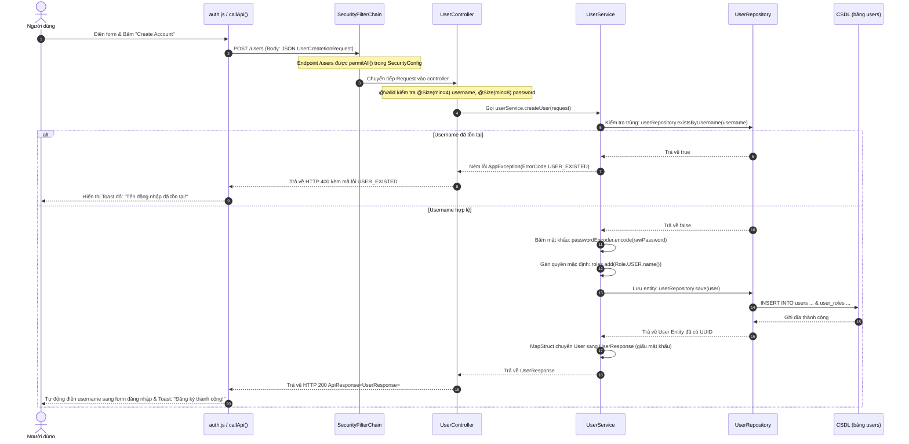
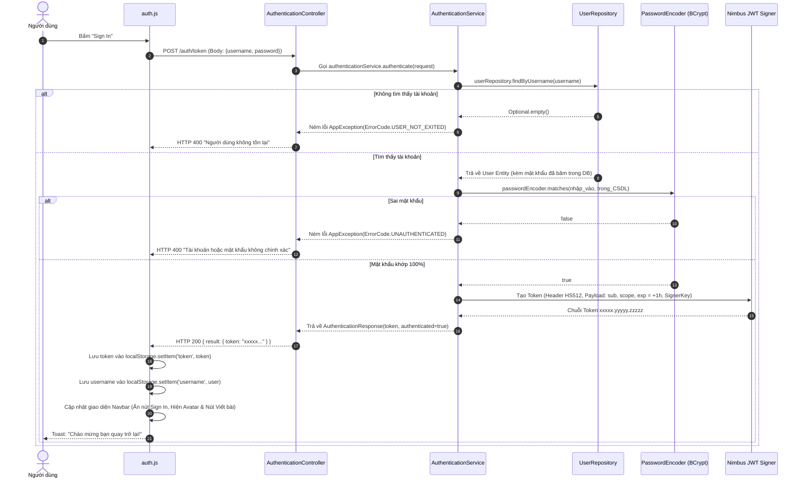
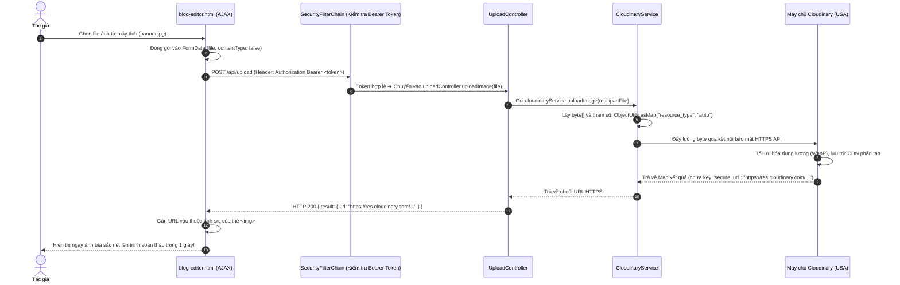
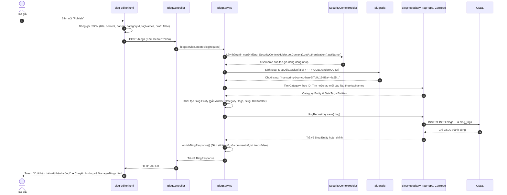
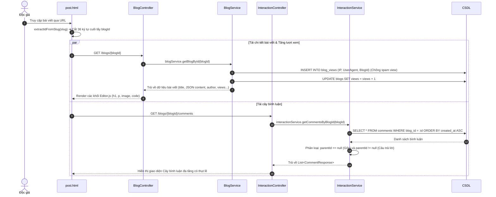
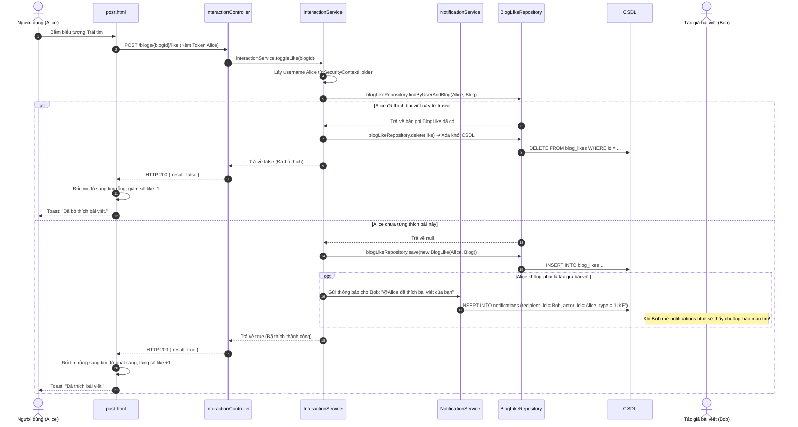
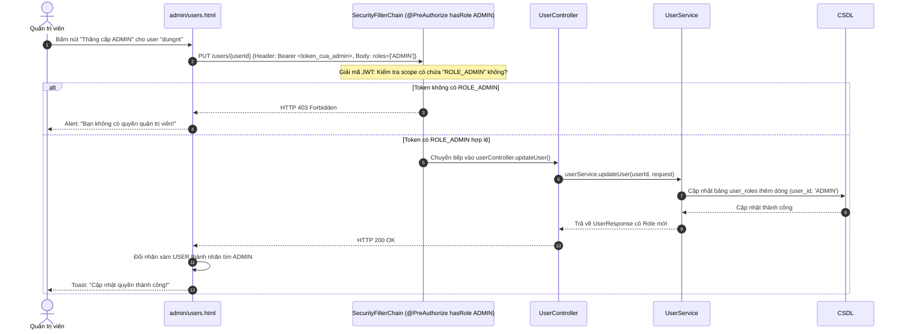

# BẢN ĐỒ VÒNG ĐỜI & TOÀN BỘ CÁC LUỒNG DỮ LIỆU HỆ THỐNG (DATA FLOWCHART)

> **Dành cho:** Bất kỳ ai cần giải thích trọn vẹn luồng đi của dữ liệu từ khi bấm chuột trên màn hình, đi qua các tầng mạng, tầng bảo mật, tầng mã nguồn Java, tầng CSDL và quay trở lại màn hình.  
> **Cấu trúc:** 7 sơ đồ tuần tự trực quan (Sequence Diagrams) bằng Mermaid kèm phân tích chi tiết từng bước.

---

## 🌊 1. TỔNG QUAN VÒNG ĐỜI MỘT YÊU CẦU TRONG MÔ HÌNH 3 LỚP

Mọi hành động trên website Bleb Blog đều tuân thủ chặt chẽ theo dòng chảy 6 trạm sau:

```
[Trình duyệt Web (HTML/JS)]
         │  1. Gửi HTTP Request (kèm dữ liệu JSON hoặc Bearer Token)
         ▼
[Spring Security Filter Chain] ──> Kiểm tra Token JWT hợp lệ hay không?
         │  2. Cho phép đi tiếp nếu hợp lệ
         ▼
[Controller Layer]            ──> Đón nhận URL, hứng RequestBody, bắt lỗi @Valid
         │  3. Chuyển dữ liệu DTO
         ▼
[Service Layer]               ──> Xử lý logic nghiệp vụ, tính toán, mã hóa, gọi dịch vụ ngoài
         │  4. Gọi lệnh truy vấn
         ▼
[Repository Layer (JPA)]      ──> Sinh câu lệnh SQL tương tác với CSDL
         │  5. Đọc/Ghi dữ liệu
         ▼
[Database (H2 / MySQL)]
```

---

## 🔐 2. LUỒNG 1: ĐĂNG KÝ TÀI KHOẢN MỚI (USER REGISTRATION FLOW)

### Kịch bản:
Người dùng mở modal Đăng ký (`#modal-auth`), nhập `username`, `password`, `email`, `fullName` và bấm nút **"Create Account"**.

### Sơ đồ tuần tự:


---

## 🔑 3. LUỒNG 2: ĐĂNG NHẬP & CẤP PHÁT JWT TOKEN (LOGIN FLOW)

### Kịch bản:
Người dùng nhập tên đăng nhập, mật khẩu và bấm nút **"Sign In"**.

### Sơ đồ tuần tự:


---

## ☁️ 4. LUỒNG 3: TẢI ẢNH BÌA LÊN CLOUDINARY (IMAGE UPLOAD FLOW)

### Kịch bản:
Trong trang `blog-editor.html`, tác giả bấm vào khung ảnh bìa và chọn file ảnh `.png` hoặc `.jpg` từ máy tính.

### Sơ đồ tuần tự:


---

## ✍️ 5. LUỒNG 4: TẠO & XUẤT BẢN BÀI VIẾT (CREATE BLOG & SLUG FLOW)

### Kịch bản:
Tác giả viết xong bài, gắn danh mục, thẻ tag và bấm nút **"Publish"**.

### Sơ đồ tuần tự:


---

## 📖 6. LUỒNG 5: ĐỌC BÀI VIẾT, TĂNG VIEW & BÌNH LUẬN ĐA CẤP (POST DETAIL & COMMENTS)

### Kịch bản:
Độc giả bấm vào xem bài viết tại đường dẫn `post.html?id=slug-cua-bai-viet`.

### Sơ đồ tuần tự:


---

## ❤️ 7. LUỒNG 6: THẢ TIM (LIKE) & BẮN THÔNG BÁO (NOTIFICATION FLOW)

### Kịch bản:
Người dùng bấm vào nút Trái tim (`#btn-like`) dưới bài viết.

### Sơ đồ tuần tự:


---

## 👑 8. LUỒNG 7: ADMIN PHÂN QUYỀN & KIỂM DUYỆT (ADMIN MANAGEMENT FLOW)

### Kịch bản:
Quản trị viên vào trang `admin/users.html` bấm nút **"Thăng cấp ADMIN"** cho một tài khoản.

### Sơ đồ tuần tự:


---

> 🎯 **BÍ QUYẾT KHI ĐI THI VẤN ĐÁP:**  
> Nếu thầy cô hỏi: *"Hãy trình bày cho tôi luồng chạy của chức năng X"*, bạn chỉ cần vẽ nhanh hoặc nói theo 5 bước:  
> 1. **Client (Giao diện):** Người dùng bấm cái gì, JavaScript gọi hàm `callApi()` gửi method gì (GET/POST/PUT/DELETE) lên URL nào.
> 2. **Bảo mật:** `SecurityFilterChain` kiểm tra Bearer Token ra sao.
> 3. **Controller:** Hứng dữ liệu ở hàm nào, kiểm tra `@Valid` cái gì.
> 4. **Service:** Xử lý logic gì (kiểm tra trùng, băm mật khẩu, tạo thông báo).
> 5. **Repository & CSDL:** Lưu vào bảng nào và trả dữ liệu ngược lại ra sao.  
> Trả lời đủ 5 bước này thì không một giảng viên nào có thể trừ điểm của bạn!
