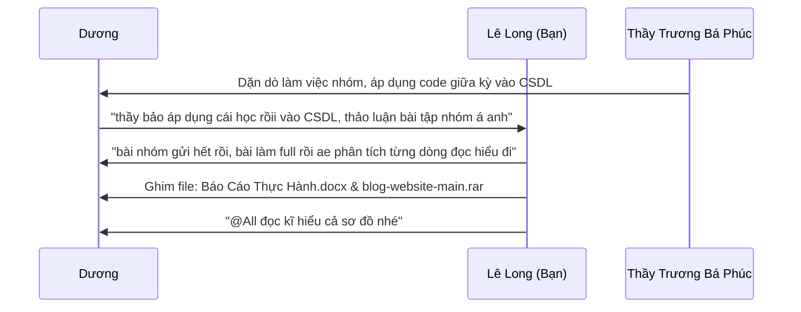

# PHÂN TÍCH TOÀN DIỆN 2 VIDEO THẦY TRƯƠNG BÁ PHÚC DẶN DÒ (27/09/2026)

> **Môn học**: Kiến trúc & Thiết kế Phần mềm / Công nghệ Web - Web Service (IUH)  
> **Giảng viên**: Thầy Trương Bá Phúc (Khoa Công nghệ Thông tin - IUH)  
> **Kênh họp**: Zoom Meeting (*Khoa Công nghệ Thông tin's Personal Meeting Room*)  
> **Dữ liệu phân tích gồm 2 video**:
> 1. **Video Phần 1**: `Videos/2026-09-27 18-02-58.mp4` (16 phút 15 giây) — Khảo sát điểm Giữa kỳ, nhắc nhở chuyên cần & định hướng liên kết Bài tập lớn.
> 2. **Video Phần 2**: `Videos/2026-09-27 18-21-41.mp4` (37 phút 01 giây) — Hướng dẫn cầm tay chỉ việc: Refactor code mẫu sang đề tài Đồ án, chuẩn hóa kiến trúc Web Service, phân biệt Thymeleaf vs Fetch API, và chuẩn bị tầng Repository JPA.

---

## MỤC LỤC
1. [TỔNG KẾT NHANH TOÀN BỘ CHỈ ĐẠO CỦA THẦY TRƯƠNG BÁ PHÚC](#1-tổng-kết-nhanh-toàn-bộ-chỉ-đạo-của-thầy-trương-bá-phúc)
2. [PHẦN 1: PHÂN TÍCH VIDEO 1 (18-02-58) — TỔNG QUAN & ĐỊNH HƯỚNG](#2-phần-1-phân-tích-video-1-18-02-58--tổng-quan--định-hướng)
   - [Bảng bóc băng đối chiếu chi tiết Video 1](#bảng-bóc-băng-đối-chiếu-chi-tiết-video-1)
   - [Phân tích 4 cụm ý trọng tâm Video 1](#phân-tích-4-cụm-ý-trọng-tâm-video-1)
3. [PHẦN 2: PHÂN TÍCH VIDEO 2 (18-21-41) — THỰC HÀNH CẦM TAY CHỈ VIỆC & GIẢI ĐÁP BẢN CHẤT](#3-phần-2-phân-tích-video-2-18-21-41--thực-hành-cầm-tay-chỉ-việc--giải-đáp-bản-chất)
   - [Bảng bóc băng đối chiếu chi tiết Video 2](#bảng-bóc-băng-đối-chiếu-chi-tiết-video-2)
   - [Phân tích chuyên sâu 5 Trọng điểm kiến thức & Kỹ thuật thầy Phúc truyền đạt](#phân-tích-chuyên-sâu-5-trọng-điểm-kiến-thức--kỹ-thuật-thầy-phúc-truyền-đạt)
4. [BỐI CẢNH ZALO NHÓM: SỰ CHỦ ĐỘNG CỦA LÊ LONG & GIẢI ĐÁP CHO DƯƠNG](#4-bối-cảnh-zalo-nhóm-sự-chủ-động-của-lê-long--giải-đáp-cho-dương)
5. [BẢN ĐỒ KIẾN TRÚC CHUẨN MỰC THEO Ý THẦY PHÚC](#5-bản-đồ-kiến-trúc-chuẩn-mực-theo-ý-thầy-phúc)
6. [TO-DO LIST HÀNH ĐỘNG NGAY CHO NHÓM](#6-to-do-list-hành-động-ngay-cho-nhóm)

---

## 1. TỔNG KẾT NHANH TOÀN BỘ CHỈ ĐẠO CỦA THẦY TRƯƠNG BÁ PHÚC

Nếu cần nắm bắt nhanh toàn bộ tinh thần của thầy trong cả 2 buổi video, đây là **5 điểm cốt tử**:

1. **Kỷ luật & Gỡ điểm Giữa kỳ**: Tỷ lệ điểm dưới 3 và dưới 5 trong bài thi giữa kỳ khá cao. Tuần sau đi thực hành **bắt buộc phải đi đúng ca đã đăng ký**, không được vắng. Thầy sẽ chấm bù điểm thông qua việc kiểm tra tiến độ bài tập lớn trên phòng máy.
2. **Không làm lại từ đầu – Hãy Refactor khung code Giữa kỳ**: Bài thi giữa kỳ (REST API + Giao diện SPA Fetch) chính là **bộ khung mẫu hoàn chỉnh**. Nhóm chỉ cần dùng công cụ `Refactor` $\rightarrow$ `Rename` trong IDE để đổi tên thực thể (ví dụ: `Faculty`/`Vendor` $\rightarrow$ `Group`, `Student`/`Device` $\rightarrow$ `Student`), sửa lại các trường dữ liệu là có ngay 80% khối lượng đồ án.
3. **Mô hình thực thể 1 - N**: Đề tài bài tập lớn không cần ôm đồm quá rộng. Chỉ cần xác định rõ quan hệ $1 - N$ (1 Lớp/Danh mục có nhiều Học sinh/Sản phẩm), trên giao diện có Combobox chọn đối tượng 1 và Table hiển thị danh sách đối tượng N.
4. **Cảnh báo lỗi sai Kiến trúc & Hiệu năng**: Thầy phê bình gay gắt các bạn đợi trang web tải xong rồi mới gọi API lấy dữ liệu đổ vào Combobox (làm web chậm $>3$ giây, nghẽn server). **Kiến trúc đúng**: Combobox danh mục ít dữ liệu thì Server nạp sẵn qua Model/Thymeleaf khi trả trang về; khi người dùng bấm chọn trên Combobox thì Client mới dùng JavaScript (`fetch`) gọi API lấy dữ liệu bảng động.
5. **Chỉ còn thiếu tầng Repository (JPA)**: Khung code Web Service hiện tại chỉ còn thiếu đúng 1 interface Repository (kế thừa `JpaRepository`). Thầy sẽ hướng dẫn trong 1 buổi thực hành tới trên phòng máy là ráp nối thành công Database.

---

## 2. PHẦN 1: PHÂN TÍCH VIDEO 1 (18-02-58) — TỔNG QUAN & ĐỊNH HƯỚNG

### Bảng bóc băng đối chiếu chi tiết Video 1

| Mốc thời gian | Lời bóc băng nhận dạng âm | Văn bản dịch chuẩn hóa ngữ nghĩa chuyên ngành |
| :--- | :--- | :--- |
| `00:03 - 02:14` | *Những bạn nào vừa rồi điểm trao ở dưới 3 điểm đâu đưa tay lên vậy?* | **"Những bạn nào vừa rồi điểm kiểm tra ở dưới 3 điểm đâu, giơ tay lên coi?"** *(Thầy khảo sát số lượng sinh viên bị điểm kém)* |
| `02:14 - 02:46` | *Không có hả? Cũng khá nhiều à.* | **"Không có hả? Cũng khá nhiều à..."** *(Nhiều sinh viên giơ tay biểu thị điểm thấp)* |
| `02:46 - 02:50` | *Ok được rồi.* | **"Ok, được rồi."** |
| `02:50 - 02:56` | *Tùm sau và được thành lời các bạn học ca nào đi ca đó...* | **"Tuần sau vào thực hành rồi, các bạn học ca nào thì đi đúng ca đó..."** |
| `02:56 - 03:00` | *...là phải đi học.* | **"...bắt buộc là phải đi học đầy đủ."** |
| `03:00 - 03:23` | *Những bạn nào dưới năm cố gắng phải đi học.* | **"Những bạn nào dưới 5 điểm cố gắng phải đi học đầy đủ."** *(Cơ hội gỡ điểm duy nhất)* |
| `03:23 - 03:30` | *Cái môn này chúng ta học nguồn xong hết rồi chỉ còn cái cơ sở yên liền đó.* | **"Cái môn này chúng ta học gần xong hết rồi, chỉ còn phần Cơ sở dữ liệu đó."** |
| `03:30 - 03:37` | *Trong tuần tới chúng ta sẽ thực hành cơ sở liền...* | **"Trong tuần tới chúng ta sẽ thực hành kết nối Cơ sở dữ liệu..."** |
| `03:37 - 03:43` | *...và sẽ kết hợp với đồ bản bà tộc lớn của mình làm rồn.* | **"...và sẽ kết hợp với Đồ án / Bài tập lớn của mình làm luôn."** |
| `03:43 - 03:55` | *Chúng ta sẽ học một cách khai báo làm sao để nó hiểu được cơ sở yên liền...* | **"Chúng ta sẽ học cách khai báo (JPA/Hibernate Entity Mapping) làm sao để hệ thống nó hiểu được Cơ sở dữ liệu..."** |
| `03:55 - 04:01` | *...để nó lốt chỉ liền lên và làm phải cũng như là nó đưa yên liền xuống...* | **"...để nó load dữ liệu lên giao diện cũng như là nó lưu/đưa dữ liệu xuống database..."** |
| `04:01 - 04:06` | *...và cũng có thể là sở yên liền hoặc là xóa yên liền.* | **"...và cũng có thể là sửa dữ liệu hoặc là xóa dữ liệu (các thao tác CRUD)."** |
| `04:06 - 04:10` | *Vì nó cũng dựa trên cái bộ khung cốt...* | **"Vì nó cũng dựa trên cái bộ khung code..."** |
| `04:10 - 04:13` | *...vừa rồi dựa kỳ các bạn làm đó.* | **"...vừa rồi đợt Giữa kỳ các bạn làm đó."** |
| `04:13 - 04:21` | *Bây giờ các bạn bận dụng cái bài cốt đó.* | **"Bây giờ các bạn vận dụng cái bài code đó."** |
| `04:21 - 04:26` | *Ở đây chúng ta thi cất ca là cất nhau hết...* | **"Ở đây chúng ta thi các ca là đề bài khác nhau hết..."** |
| `04:26 - 04:28` | *...cốt cất nhau hết.* | **"...code của các ca khác nhau hết."** |
| `04:28 - 04:33` | *Chứ nó sửa lại cho nó hợp với cái bài tập lớn của mình.* | **"Về các bạn sửa lại cho nó phù hợp với đề tài Bài tập lớn của nhóm mình."** |
| `04:33 - 04:37` | *Bây giờ các bạn là việc nhớ với nhau.* | **"Bây giờ các bạn làm việc nhóm (teamwork) với nhau ngay."** |
| `04:37 - 04:42` | *Bởi vì đến 2 bà quỳ nói thực hành thì thật sự hướng dẫn cái cách...* | **"Bởi vì trong 2 đến 3 buổi tới thực hành thì thầy sẽ hướng dẫn cái cách..."** |
| `04:42 - 04:45` | *...để mà ảnh sạng nó vào cơ sở liền...* | **"...để mà ánh xạ (mapping) nó vào Cơ sở dữ liệu..."** |
| `04:45 - 04:48` | *...thì một bộ yên thì chúng ta sẽ ảnh sạng được.* | **"...thì chỉ cần 1 buổi là chúng ta sẽ ánh xạ được."** |
| `04:48 - 04:53` | *Hoặc mà chuyên sâu thì nó có nhiều cốc độ phức tạm lắm.* | **"Còn nếu làm chuyên sâu thì nó có nhiều cấp độ phức tạp lắm..."** |
| `04:53 - 04:58` | *Để mà thêm xóa sở liền kiếm thì cũng không phức tạm lắm.* | **"...nhưng để mà thêm, xóa, sửa, tìm kiếm cơ bản thì cũng không phức tạp lắm."** |
| `04:58 - 05:09` | *Cơ bản thì cũng không phức tạm lắm.* | **"Mức cơ bản thì cũng không phức tạp lắm."** |
| `05:09 - 05:12` | *Mà các bạn chuẩn bị hả?* | **"Nên các bạn chuẩn bị nhé."** |
| `05:12 - 05:17` | *Cái bài hôm nay...* | **"Chuẩn bị bài từ hôm nay..."** |
| `05:17 - 05:22` | *Trong tuần này các bạn mang cái bài đó...* | **"Trong tuần này các bạn mang cái bài code đó..."** |
| `05:22 - 05:25` | *...lên trên lớp lập thầy.* | **"...lên trên lớp nộp/gặp thầy."** |
| `05:25 - 05:32` | *Đặc biệt là những cái bài mà liền thấp.* | **"Đặc biệt là những bạn mà điểm thi thấp."** |
| `05:32 - 05:36` | *Các bạn làm bài nhé. Các bạn cẩn thận tắt cam/mic...* | **"Các bạn lo làm bài nhé. Các bạn kiểm tra mic/cam..."** *(Kết thúc dặn dò phần 1, thầy tắt mic)* |

### Phân tích 4 cụm ý trọng tâm Video 1
1. **Điểm kiểm tra giữa kỳ & Kỷ luật**: Khảo sát nhanh thấy số lượng điểm $<5$ lớn. Thầy yêu cầu đi học đúng ca, chuyên cần để nhận điểm cộng bù.
2. **Kế hoạch tích hợp CSDL (JPA Mapping)**: Chỉ còn phần Database là hoàn tất chương trình. 1 buổi thực hành là có thể map xong bảng và làm đủ CRUD.
3. **Kế thừa khung code Giữa kỳ**: Tái sử dụng toàn bộ kiến trúc MVC/REST API giữa kỳ, chuyển đổi thực thể sang đề tài bài tập lớn.
4. **Nộp bài trên lớp tuần này**: Mang bài code lên phòng máy để thầy kiểm tra và chấm bù điểm giữa kỳ.

---

## 3. PHẦN 2: PHÂN TÍCH VIDEO 2 (18-21-41) — THỰC HÀNH CẦM TAY CHỈ VIỆC & GIẢI ĐÁP BẢN CHẤT

### Bảng bóc băng đối chiếu chi tiết Video 2

| Mốc thời gian | Lời bóc băng nhận dạng âm | Văn bản dịch chuẩn hóa ngữ nghĩa chuyên ngành |
| :--- | :--- | :--- |
| `00:00 - 00:49` | *Tập lớn của mình với cái cốt vừa rồi, giờ nhóm nào cần hỗ trợ đi Tây Nên...* | **"Vận dụng bài tập lớn của mình với cái code vừa rồi, giờ nhóm nào cần hỗ trợ thì giơ tay lên? Có nhóm nào cần hỗ trợ không?"** |
| `00:49 - 01:22` | *Phan Vũ Khánh có đây không?... Nhóm em vừa rồi ra điểm thấp không?* | Thầy kiểm tra nhóm bạn Phan Vũ Khánh (3 người, đang lên ý tưởng đồ án, xin hỗ trợ sau). |
| `01:22 - 02:16` | *Lên Nhật Nam đúng không?... bạn có còn học không hả?* | Bạn Lê Nhật Nam hỏi thăm về thành viên nhóm (Nguyễn Hoàng Hiệp) vắng thi, thầy hứa kiểm tra danh sách. |
| `02:17 - 02:39` | *Phan Thị Hồng Bích?... Dạ nhóm em điểm thấp hết rồi.* | Thầy hỏi thăm nhóm Phan Thị Hồng Bích: Cả nhóm đều bị điểm thấp, thầy chủ động đề nghị hỗ trợ hướng dẫn trực tiếp. |
| `02:40 - 03:35` | *Đề tà nhóm em làm về quế nhà trường hả? Quế nhà trường nó rộng lắm...* | **"Đề tài nhóm em làm về web nhà trường hả? Web nhà trường nó rộng lắm, phải cụ thể chức năng..."** $\rightarrow$ Bích chọn: Quản lý sức khỏe học sinh của nhóm trẻ mầm non. |
| `03:35 - 04:54` | *Bây giờ tụi em mới thiết kế cơ sản liệm, thì nó phải có cái mối quan hệ...* | **"Bây giờ tụi em thiết kế cơ sở dữ liệu thì nó phải có mối quan hệ: 1 lớp có nhiều học sinh. Danh sách lớp em đưa ra Combobox được không? Chọn 1 lớp thì nó load danh sách học sinh lên, giống hệt như thi giữa kỳ!"** |
| `05:08 - 06:45` | *Em mở cái clip lên... Em chưa có chia bác kỳ...* | **"Em mở Eclipse lên, em share màn hình lên... Cái này là em chưa có chia package. Bấm chuột phải New Package: com.example.demo.controller, gõ đúng tiếng Anh nhé."** |
| `06:45 - 07:22` | *Tương tự là em làm 1 chấm model... service...* | **"Tương tự em làm thêm package .model, và thêm 1 cái nữa là .service. Tắt gõ dấu tiếng Việt đi."** |
| `07:23 - 08:39` | *Em kéo 2 cái file entity... divide với vendor... vô model...* | **"Kéo 2 file entity (Device, Vendor) vào model. Kéo OrganizationService vào service. Kéo 2 controller vào controller. Giờ project đã tổ chức theo từng gói rõ ràng!"** |
| `08:40 - 09:34` | *Em phải đổi cái vendor thành cái lớp... bấm re-factor, re-nem...* | **"Em đổi Vendor thành Lớp học. Bấm chuột phải $\rightarrow$ Refactor $\rightarrow$ Rename. Trong tiếng Anh đặt tên là Group đi, chứ dùng Class là trùng từ khóa của Java!"** |
| `09:35 - 11:02` | *Vendor đổi thành Rup... Divide đổi thành Student...* | **"Đổi Device thành Student. Đổi VendorController thành GroupController, DeviceController thành StudentController."** |
| `11:03 - 13:00` | *Em muốn sửa ra cả Project thì bấm chuột phải... Re-factor... Rename...* | **"Muốn sửa cả project thì chuột phải vào biến/lớp $\rightarrow$ Refactor $\rightarrow$ Rename. Nó sẽ sửa đồng loạt tất cả các nơi dùng biến đó, chứ sửa tay là bị sót lỗi!"** |
| `13:01 - 14:15` | *Cái dòng 24 cũng sửa luôn... Chuột phải tab chọn Close All... Student sửa tương tự...* | Thầy chỉ cách sửa getter/setter trong `Group.java` và `Student.java`, đóng các tab cũ, lưu file và dặn sửa nốt các Controller. |
| `14:15 - 14:45` | *Làm như giữ kỳ nữa là xong... ráp thêm cơ sở liệu...* | **"Đấy, làm như giữa kỳ nữa là xong, nó ra gần như đồ án của em rồi! Cơ bản hướng đi là như vậy, tuần tới chỉ cần ráp thêm Database (JPA) nữa là xong."** |
| `14:46 - 15:22` | *Thầy chỉ trực quan như vầy tụi em dễ nắm hơn...* | Bạn Bích cảm ơn và bày tỏ mong muốn thầy chỉ trực quan như vậy vì sinh viên hệ liên thông mới học kỳ 2 bị ngợp. |
| `15:22 - 17:36` | *Mấy cái này sinh viên IT học từ năm nhất năm hai...* | **"Mấy cái kỹ năng IDE này sinh viên năm 1 năm 2 đã phải nắm rồi. Thầy chỉ như thế này là vì tụi em điểm thấp quá thầy mới cứu. Sinh viên liên thông phải tự giác bù đắp kiến thức, lên YouTube, hỏi AI, Google..."** |
| `17:37 - 19:15` | *Nhiều bạn làm bài thi giữa kỳ kết quả đúng nhưng sai về kiến trúc...* | **"Nhiều bạn thi giữa kỳ kết quả đúng nhưng SAI VỀ KIẾN TRÚC: Combobox rất ít item (20-30 cái) thì nạp sẵn từ server qua Model/Thymeleaf. Nhiều bạn lại đợi trang web tải xong hết rồi mới gọi service load về Combobox, mất hơn 3 giây! Thực tế người dùng vào nhiều là sập server!"** |
| `19:15 - 19:54` | *Trong kiến trúc này chỉ còn thiếu 1 repository nữa...* | **"Trong kiến trúc này chỉ còn thiếu đúng 1 tầng Repository nữa thôi. Thầy sẽ dạy trên phòng máy, nó chỉ có mấy dòng code thôi."** |
| `19:55 - 20:22` | *SV hỏi: Dùng Thymeleaf để thao tác trên JSON của RestController được không?* | Sinh viên thắc mắc liệu có thể dùng Thymeleaf để trực tiếp bind dữ liệu JSON trả về từ `@RestController` hay không. |
| `20:22 - 22:20` | *Thymeleaf là Template Engine chạy trên Server...* | **"Không! Thymeleaf là Server-side Template, nhận dữ liệu qua đối tượng Model trước khi trả HTML về trình duyệt. Trình duyệt nhận trang xong, người dùng chọn Combobox thì mới gọi Web Service trả về JSON."** |
| `22:20 - 23:22` | *SV hỏi: Vậy có được dùng JavaScript cho bài tập lớn không?* | **"Thì phải dùng chứ! Bản chất AJAX, Vue, thư viện gì cũng đều quy về JavaScript hết. Không dùng JavaScript sao mà gọi được Web Service!"** |
| `23:23 - 25:07` | *MVC thì trả về HTML, nhưng các file JS, CSS nên đưa lên CDN...* | Thầy phân tích kỹ thuật tối ưu web thực tế: Đưa JavaScript, CSS và tài nguyên tĩnh lên **CDN** để giảm tải và tránh nghẽn server Spring Boot. |
| `25:08 - 27:18` | *Thời buổi này công cụ quá đầy đủ, AI, ChatGPT, Gemini, YouTube...* | Thầy khuyến khích tận dụng tối đa công cụ AI hiện đại để học tập, giải quyết sĩ số nhóm cho Nam, cho phép lớp tắt cam để làm bài tập nhóm. |

---

### Phân tích chuyên sâu 5 Trọng điểm kiến thức & Kỹ thuật thầy Phúc truyền đạt

#### 1. Kỹ thuật Refactor chuẩn mực trong Java IDE (Eclipse / IntelliJ)
- **Vấn đề sinh viên hay mắc**: Khi đổi tên class hoặc biến (ví dụ từ `Vendor` sang `Group`), sinh viên hay dùng mắt tìm từng dòng rồi xóa đi gõ lại $\rightarrow$ Dẫn đến sót biến, lỗi biên dịch đỏ lòm, không tìm thấy getter/setter.
- **Kỹ thuật thầy chỉ dạy**:
  - Chọn tên Class hoặc biến $\rightarrow$ Chuột phải $\rightarrow$ `Refactor` $\rightarrow$ `Rename...` (Phím tắt: `Alt + Shift + R`).
  - IDE sẽ tự động đổi tên file `.java`, đổi tên Constructor, đổi các câu lệnh `import`, đổi các lời gọi phương thức ở tất cả các Controller và Service trong toàn bộ Project.
  - **Lưu ý đặc biệt từ thầy**: Khi đổi tên lớp học, **tuyệt đối KHÔNG đặt tên class là `Class`** (vì `class` là từ khóa hệ thống của Java). Hãy đặt là `Group`, `Classroom`, hoặc `Grade`.

#### 2. Định hình Mô hình Thực thể 1 - N cho Bài tập lớn
- Thầy uốn nắn đề tài cho nhóm sinh viên: Đừng chọn đề tài "bao la bát ngát" như *Hệ thống quản lý toàn bộ trường học* (gồm điểm danh, học phí, dinh dưỡng, sổ sức khỏe, thời khóa biểu...).
- Hãy cô đọng lại thành một mối quan hệ $1 - N$ cốt lõi:
  - **Entity 1 (Cha)**: `Group` (Nhóm trẻ / Lớp học).
  - **Entity N (Con)**: `Student` (Học sinh).
  - **Cơ chế giao diện**: Combobox chọn `Group`, bên dưới là Bảng hiển thị danh sách `Student` thuộc `Group` đó. Có đầy đủ nút: **Thêm học sinh**, **Sửa học sinh**, **Xóa học sinh**, và **Tìm kiếm theo tên**.
  - Mô hình này giống 100% với bài thi giữa kỳ (`Faculty - Student` hoặc `Vendor - Device`).

#### 3. Bóc trần Lỗi sai Kiến trúc & Hiệu năng Web (Lời cảnh tỉnh cực gắt của Thầy)
Thầy phân tích sự khác nhau giữa **Web chạy được** và **Web chuẩn kiến trúc công nghiệp**:
```
❌ KIẾN TRÚC SAI (Nhiều SV làm giữa kỳ):
Trình duyệt gửi GET /
   └── Server trả về file HTML rỗng
         └── Trình duyệt chờ window.onload (hoặc document.ready)
               └── JS gửi Fetch GET /api/categories (để lấy danh sách combobox)
                     └── Chờ Server phản hồi JSON
                           └── JS render options vào Combobox (Tốn > 3 giây, UX cực tệ!)
```
```
✅ KIẾN TRÚC ĐÚNG (Thầy Phúc yêu cầu):
Trình duyệt gửi GET /
   └── Controller nạp sẵn List Category vào Model: model.addAttribute("categories", list)
         └── Server render sẵn các thẻ <option> trong Combobox trả về ngay lập tức cho client.
               └── Người dùng nhìn thấy ngay Combobox không bị trễ.
                     └── Khi người dùng chọn 1 Category:
                           └── JS bắt sự kiện 'change', gọi Fetch API GET /api/categories/{id}/products
                                 └── Chỉ load dữ liệu bảng con bất đồng bộ!
```

#### 4. Phân biệt rạch ròi: Thymeleaf (SSR) vs REST API + JavaScript (CSR)
Trước câu hỏi hoang mang của sinh viên về việc dùng Thymeleaf với JSON:
- **Thymeleaf**: Hoạt động ở **Server-Side**. Nó chỉ nhìn thấy Java Objects được gắn vào `Model` lúc Spring Boot Controller đang xử lý request. Khi trang HTML đã gửi về trình duyệt rồi, Thymeleaf hoàn toàn kết thúc nhiệm vụ.
- **REST Controller (`@RestController`)**: Hoạt động độc lập, không sinh mã HTML, chỉ trả về chuỗi JSON thô qua giao thức HTTP.
- **JavaScript (Fetch API)**: Hoạt động ở **Client-Side (Trình duyệt)**. Nó nhận chuỗi JSON từ `@RestController`, sau đó dùng DOM API (`document.createElement`, `innerHTML`) để cập nhật giao diện mà không cần reload trang.
- **Kết luận của thầy**: Dự án Web Service hiện đại bắt buộc phải dùng JavaScript để gọi API.

#### 5. Mảnh ghép cuối cùng: Tầng `Repository` (Spring Data JPA)
- Thầy khẳng định: Toàn bộ Controller, Service, Model và Frontend các bạn đã nắm chắc từ đợt ôn thi giữa kỳ.
- Trong tuần tới, bước vào phần Database, chỉ cần thêm 1 interface duy nhất:
  ```java
  @Repository
  public interface StudentRepository extends JpaRepository<Student, Long> {
      List<Student> findByGroupId(Long groupId);
  }
  ```
- Không cần viết bất kỳ câu lệnh SQL `SELECT * FROM...` phức tạp nào, Spring Data JPA tự động lo toàn bộ các hàm `findAll()`, `findById()`, `save()`, `deleteById()`.

---

## 4. BỐI CẢNH ZALO NHÓM: SỰ CHỦ ĐỘNG CỦA LÊ LONG & GIẢI ĐÁP CHO DƯƠNG

Trong video 2 (tại phút `01:00` đến `04:00`), diễn biến trong Zalo nhóm `nhóm-WEB-nhóm 1 thứ 4` cho thấy sự chủ động rất cao của bạn (Lê Long):



### Giải đáp rõ cho câu hỏi của Hoàng Đại Dương:
> *"Anh @Lê Long cho em hỏi code thầy cho hết rồi, còn cái index.html mình tự code hả?"*
- **Sự thật**: Thầy chỉ hướng dẫn/cung cấp khung mẫu Backend Spring Boot.
- File `index.html` (Frontend SPA) là phần sinh viên phải tự viết bằng JavaScript Fetch API.
- **Tuy nhiên đối với nhóm của Long**: Bạn Long đã chuẩn bị sẵn file `index.html` hoàn chỉnh (kèm tài liệu chú thích chi tiết từng dòng, hướng dẫn đổi tên thực thể theo đúng bài tập lớn). Các thành viên trong nhóm chỉ cần đọc tài liệu và làm theo hướng dẫn đã ghim trên Zalo là hoàn thành bài tập lớn dễ dàng.

---

## 5. BẢN ĐỒ KIẾN TRÚC CHUẨN MỰC THEO Ý THẦY PHÚC

Dưới đây là sơ đồ tổng thể toàn bộ hệ thống Đồ án / Bài tập lớn mà thầy Phúc muốn sinh viên xây dựng:

```mermaid
graph TD
    subgraph Client ["Client Browser (Trình duyệt)"]
        UI["index.html (Giao diện SPA)"]
        CB["<select> Combobox Danh mục"]
        TBL["<table> Bảng dữ liệu Con"]
        JS["app.js / Fetch API"]
    end

    subgraph Backend ["Spring Boot Web Service"]
        VC["ViewController (Spring MVC)"]
        RC["RestController (@RestController)"]
        SVC["Service Layer (@Service)"]
        REPO["Repository Layer (JpaRepository)"]
        ENTITY["Entity Model (@Entity)"]
    end

    subgraph Database ["Hệ quản trị CSDL"]
        DB[(MySQL / SQL Server)]
    end

    %% Luồng 1: Load trang ban đầu
    UI -->|1. GET / | VC
    VC -->|2. Model nạp sẵn Danh mục| CB

    %% Luồng 2: Chọn combobox gọi REST API
    CB -->|3. OnChange event| JS
    JS -->|4. fetch GET /api/groups/1/students| RC
    RC --> SVC
    SVC --> REPO
    REPO -->|5. SQL Select| DB
    DB -->|6. Data Entity| REPO
    REPO --> SVC
    SVC --> RC
    RC -->|7. JSON Response| JS
    JS -->|8. Render DOM| TBL
```



---

## 6. TO-DO LIST HÀNH ĐỘNG NGAY CHO NHÓM

| STT | Nhiệm vụ cụ thể | Người phụ trách | Hướng dẫn chi tiết |
| :---: | :--- | :--- | :--- |
| **1** | **Chốt cặp thực thể 1 - N của Bài tập lớn** | Cả nhóm | Ví dụ: `Category - Product`, `Group - Student`, `Brand - Car`. Đảm bảo có tối thiểu 4 trường mỗi bảng. |
| **2** | **Refactor khung code giữa kỳ** | Dev chính (Long) | Dùng tính năng `Refactor -> Rename` đổi tên Entity, Service, Controller theo chuẩn thầy đã hướng dẫn bạn Bích. |
| **3** | **Cập nhật file `index.html`** | Thành viên nhóm | Mở file `index.html` mẫu trong thư mục `gk`, thay thế endpoint URL và tên các thuộc tính tương ứng. |
| **4** | **Đọc kỹ file giải thích code** | Dương & thành viên | Xem lại file `GIAI_THICH_CHI_TIET_TOAN_BO_CODE.md` đã có sẵn trong project để nắm chắc khi thầy vấn đáp. |
| **5** | **Mang laptop lên lớp đúng ca tuần này** | Cả nhóm | Chuẩn bị project chạy sẵn trên localhost, chủ động gọi thầy lại xem bài để ghi nhận điểm gỡ giữa kỳ. |

---
*Tài liệu được tổng hợp, bóc băng và phân tích chi tiết từ toàn bộ 2 video ghi hình buổi học ngày 27/09/2026 của thầy Trương Bá Phúc - Đại học Công nghiệp TP.HCM (IUH).*
