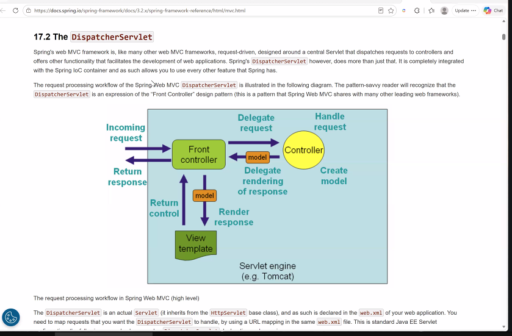

Eclipse J2EE   (Eclipse SE, ME)
MySQL, Workbench
Spring boot
Postman
.....
url (address bar)
href
--> MVC
JQuery
Fetch
Axiox
Ajax

truongbaphuc@iuh.edu.vn

t1

b1/ tạo 1 trang web dùng để quy đổi tiền tệ

b1.1/ true and true , true and false , true and null , true or null, false or null,

Trả lời:

- `true and true`   => **true**
- `true and false`  => **false**
- `true and null`   => **null**
- `true or null`    => **true**
- `false or null`   => **null**

b2/ cho chứa 1 mảng danh sách các đối tượng , đối tượng là 1 sản phẩm , viết hàm js để load danh sách này vào table

17 trang 

code đáp ứng yêu cầu khóa luận tốt nghiệp
