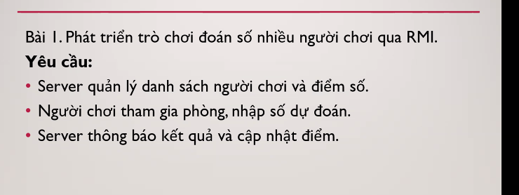
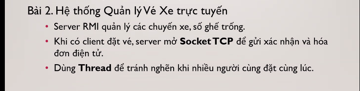

# Chương 3: Gọi Hàm Từ Xa (Remote Invocation)

## 1. Tổng Quan Kiến Trúc Lớp Phần Mềm Trung Gian (Middleware Layers)

Hệ thống phân tán truyền thông thông qua các lớp Middleware nằm trên giao thức truyền tải (TCP/UDP):

* **Applications**: Ứng dụng phân tán cấp cao.
* **Remote Invocation & Indirect Communication**: Gọi hàm từ xa (RMI, RPC) và giao tiếp gián tiếp (Pub-Sub, Message Queue).
* **Underlying IPC Primitives**: Sockets, truyền thông điệp (Message Passing), Multicast support.
* **Transport Protocol**: UDP & TCP.

---

## 2. Giao Thức Yêu Cầu - Phản Hồi (Request-Reply Communication Protocol)

Giao thức Request-Reply là nền tảng cho cả RPC và RMI:

### Các hàm cơ bản

1. `public byte[] doOperation(RemoteRef s, int operationId, byte[] arguments)`: Client gọi hàm này để gửi thông điệp yêu cầu tới máy chủ từ xa `s`, thực thi hàm `operationId` với tham số `arguments` và chờ nhận phản hồi.
2. `public byte[] getRequest()`: Server lắng nghe và nhận yêu cầu từ client qua port.
3. `public void sendReply(byte[] reply, InetAddress clientHost, int clientPort)`: Server gửi kết quả phản hồi về lại địa chỉ IP và Port của Client.

### Cấu trúc thông điệp Request-Reply

| Trường (Field)    | Kiểu dữ liệu         | Mô tả                                                   |
| :------------------ | :---------------------- | :-------------------------------------------------------- |
| `messageType`     | `int`                 | 0 = Request, 1 = Reply                                    |
| `requestId`       | `int`                 | Mã số định danh duy nhất cho yêu cầu               |
| `remoteReference` | `RemoteRef`           | Tham chiếu tới đối tượng từ xa                     |
| `operationId`     | `int` / `Operation` | Mã định danh phương thức cần gọi                  |
| `arguments`       | `array of bytes`      | Tham số đã được đóng gói nhị phân (Marshalled) |

---

## 3. Các Mô Hình Giao Thức Trao Đổi RPC (RPC Exchange Protocols)

1. **R (Request)**: Client gửi Request, không cần Server trả về kết quả (thích hợp cho thông báo ngắt).
2. **RR (Request-Reply)**: Client gửi Request, Server xử lý và trả về Reply (Phổ biến nhất).
3. **RRA (Request-Reply-Acknowledge)**: Client gửi Request, Server trả lời Reply, và Client gửi lại Acknowledge nhận reply để Server xóa bộ nhớ đệm kết quả.

---

## 4. Ngữ Nghĩa Gọi Hàm & Chịu Lỗi (Call Semantics & Fault Tolerance)

Do nguy cơ mất gói tin hoặc ngắt kết nối mạng, các cơ chế chịu lỗi quyết định ngữ nghĩa gọi hàm:

| Cơ chế retransmit request | Duplicate filtering (Lọc trùng) | Re-execute / Retransmit reply | Ngữ nghĩa gọi (Call Semantics) | Giải thích                                                                                   |
| :-------------------------: | :-------------------------------: | :---------------------------: | :-------------------------------- | :--------------------------------------------------------------------------------------------- |
|        **No**        |          Not applicable          |        Not applicable        | **Maybe**                   | Hàm có thể được thực thi 1 lần hoặc chưa từng thực thi (không đảm bảo).        |
|        **Yes**        |           **No**           |     Re-execute procedure     | **At-least-once**           | Hàm đảm bảo thực thi ít nhất 1 lần, nhưng có thể bị lặp lại nếu có trễ mạng. |
|        **Yes**        |           **Yes**           |       Retransmit reply       | **At-most-once**            | Hàm đảm bảo thực thi tối đa 1 lần (chuẩn an toàn nhất cho giao dịch).              |

---

## 5. Biểu Diễn Dữ Liệu Bên Ngoài & Interface (External Data Representation)

* **Sun XDR (External Data Representation)**: Định nghĩa cấu trúc dữ liệu chuẩn để trao đổi giữa các máy tính khác nhau (dùng trong ONC RPC).
* **CORBA IDL (Interface Definition Language)**: Ngôn ngữ định nghĩa giao diện độc lập với ngôn ngữ lập trình.
  ```idl
  struct Person { string name; string place; long year; };
  interface PersonList {
      readonly attribute string listname;
      void addPerson(in Person p);
      void getPerson(in string name, out Person p);
      long number();
  };
  ```
* **Cấu trúc thông điệp HTTP**:
  - **Request**: `GET /index.html HTTP/1.1` (Method + URL + HTTP version + Headers + Body).
  - **Reply**: `HTTP/1.1 200 OK` (HTTP version + Status code + Reason + Headers + Body).

---

## 6. Gọi Phương Thức Từ Xa Trong Java (Java RMI - Remote Method Invocation)

Java RMI tích hợp mô hình đối tượng phân tán trực tiếp vào ngôn ngữ Java.

### Các thành phần chính trong Java RMI

1. **Remote Interface**: Định nghĩa các phương thức từ xa. Phải `extends Remote` và các phương thức phải khai báo `throws RemoteException`.
2. **Servant (Remote Object Implementation)**: Lớp triển khai giao diện từ xa, thường `extends UnicastRemoteObject`.
3. **Proxy (Client Stub)**: Nằm ở phía Client, đóng vai trò đại diện cho đối tượng từ xa. Thực hiện đóng gói tham số (Marshalling) và gửi qua mạng.
4. **Skeleton & Dispatcher**: Nằm ở phía Server, giải nén tham số (Unmarshalling), chuyển yêu cầu tới Servant thực thi và đóng gói kết quả trả về.
5. **RMI Registry / Naming Class**: Dịch vụ đăng ký và tra cứu đối tượng từ xa theo tên:
   - `Naming.rebind("Shape List", aShapeList)`: Server đăng ký tên đối tượng.
   - `Naming.lookup("//hostname/Shape List")`: Client tra cứu đối tượng từ xa.
   - `bind()`, `unbind()`, `list()`.

### Ví dụ lập trình Java RMI chuẩn

#### 1. Định nghĩa Remote Interface

```java
import java.rmi.*;
import java.util.Vector;

public interface ShapeList extends Remote {
    Shape newShape(GraphicalObject g) throws RemoteException;
    Vector allShapes() throws RemoteException;
    int getVersion() throws RemoteException;
}
```

#### 2. Triển khai Server Servant

```java
import java.rmi.*;
import java.rmi.server.UnicastRemoteObject;
import java.util.Vector;

public class ShapeListServant extends UnicastRemoteObject implements ShapeList {
    private Vector theList;
    private int version;

    public ShapeListServant() throws RemoteException {
        theList = new Vector();
        version = 0;
    }

    public Shape newShape(GraphicalObject g) throws RemoteException {
        version++;
        Shape s = new ShapeServant(g, version);
        theList.addElement(s);
        return s;
    }

    public Vector allShapes() throws RemoteException { return theList; }
    public int getVersion() throws RemoteException { return version; }
}
```

#### 3. Đăng ký Server trong RMI Registry

```java
import java.rmi.*;

public class ShapeListServer {
    public static void main(String args[]) {
        System.setSecurityManager(new RMISecurityManager());
        try {
            ShapeList aShapeList = new ShapeListServant();
            Naming.rebind("Shape List", aShapeList);
            System.out.println("ShapeList server ready");
        } catch (Exception e) {
            System.out.println("Server error: " + e.getMessage());
        }
    }
}
```

#### 4. Client gọi phương thức từ xa

```java
import java.rmi.*;
import java.util.Vector;

public class ShapeListClient {
    public static void main(String args[]) {
        System.setSecurityManager(new RMISecurityManager());
        try {
            ShapeList aShapeList = (ShapeList) Naming.lookup("//bruno.ShapeList");
            Vector sList = aShapeList.allShapes();
        } catch (Exception e) {
            System.out.println("Client error: " + e.getMessage());
        }
    }
}
```

### Hệ thống các lớp hỗ trợ Java RMI

`RemoteObject` $\rightarrow$ `RemoteServer` $\rightarrow$ `UnicastRemoteObject` $\rightarrow$ `<servant class>` (hoặc `Activatable`).
