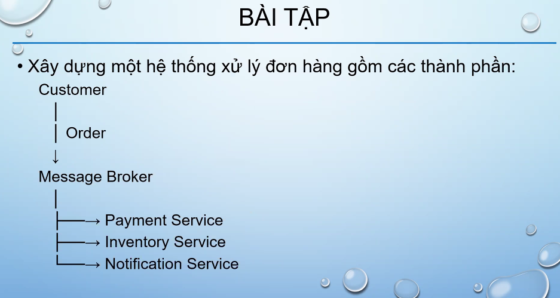
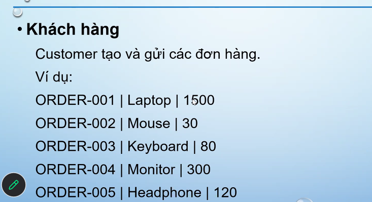
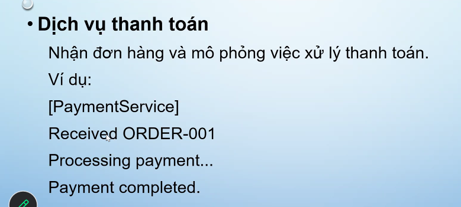
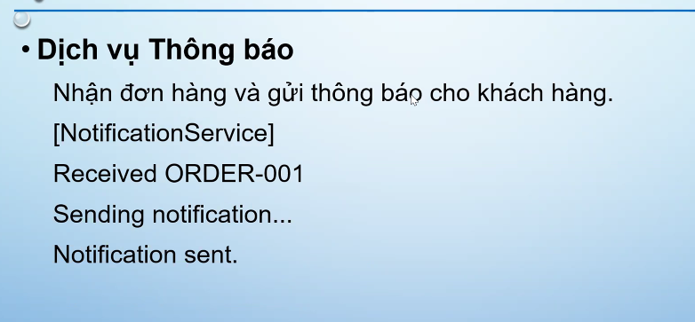
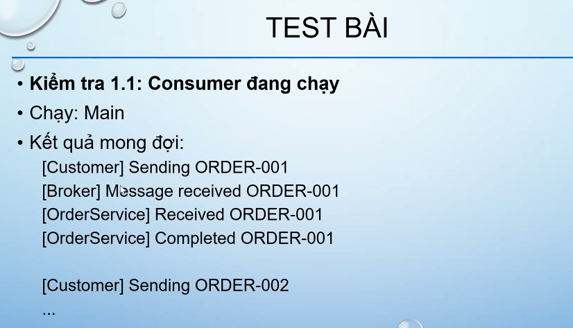
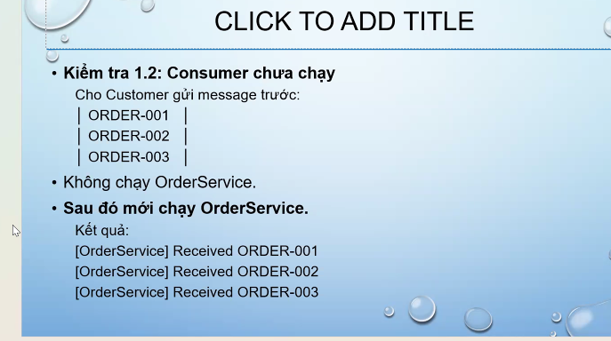
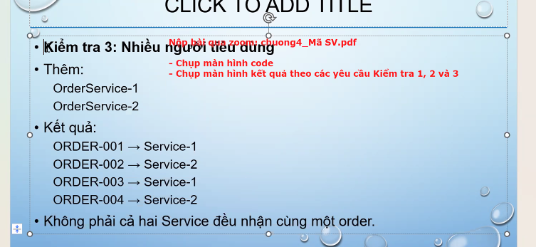

# Chương 4: Giao Tiếp Gián Tiếp (Indirect Communication)







## 1. Khái Niệm Phụ Thuộc Không Gian Và Thời Gian (Space & Time Coupling)

Giao tiếp gián tiếp giải phóng các thành phần truyền thông khỏi sự phụ thuộc lẫn nhau:

|                                                     | **Time-coupled (Phụ thuộc thời gian)**                                                                                                                    | **Time-uncoupled (Độc lập thời gian)**                                                                                                                      |
| :-------------------------------------------------- | :----------------------------------------------------------------------------------------------------------------------------------------------------------------- | :-------------------------------------------------------------------------------------------------------------------------------------------------------------------- |
| **Space coupling (Phụ thuộc không gian)**  | Bên gửi chỉ định rõ bên nhận;**Cả hai phải cùng tồn tại** tại thời điểm truyền.*Ví dụ*: Message passing, Remote Invocation (RPC, RMI). | Bên gửi chỉ định rõ bên nhận;**Bên gửi và bên nhận có tuổi thọ độc lập** (không cần tồn tại cùng lúc).                                 |
| **Space uncoupling (Độc lập không gian)** | Bên gửi**không cần biết danh tính** bên nhận; Bên nhận phải tồn tại tại thời điểm truyền.*Ví dụ*: IP Multicast.                        | Bên gửi**không cần biết danh tính** bên nhận; **Tuổi thọ hoàn toàn độc lập**.*Ví dụ*: Publish-Subscribe, Message Queues, Tuple Spaces. |

---

## 2. Truyền Thông Nhóm (Group Communication & Multicast)

* Một thông điệp được gửi tới một nhóm tiến trình (Process Group).
* **Open group**: Tiến trình ngoài nhóm có thể gửi thông điệp tới nhóm.
* **Closed group**: Chỉ các thành viên nội bộ trong nhóm mới có thể gửi thông điệp cho nhau.
* **Group Membership Management**: Quản lý các sự kiện `Join` (gia nhập), `Leave` (rời nhóm), `Fail` (lỗi nút).

### Thư viện JGroups trong Java

* Sử dụng `JChannel` để kết nối vào kênh nhóm.

```java
// Bên gửi (FireAlarmJG)
JChannel channel = new JChannel();
channel.connect("AlarmChannel");
Message msg = new Message(null, null, "Fire!");
channel.send(msg);

// Bên nhận (FireAlarmConsumerJG)
JChannel channel = new JChannel();
channel.connect("AlarmChannel");
Message msg = (Message) channel.receive(0);
String text = (String) msg.getObject();
```

---

## 3. Mô Hình Xuất Bản - Đăng Ký (Publish-Subscribe Paradigm)

* **Publishers** phát hành sự kiện (`publish(e)`), **Subscribers** đăng ký quan tâm chủ đề/nội dung (`subscribe(t)`).
* Hệ thống trung gian (Broker Network) làm nhiệm vụ **Khớp dữ liệu (Matching)** và chuyển tiếp thông điệp (`notify(e)`).
* **Định tuyến sự kiện (Event Routing)**:
  - **Flooding**: Gửi tràn toàn bộ mạng broker.
  - **Filtering-based routing**: Định tuyến dựa trên bộ lọc nội dung.
  - **Rendezvous-based routing**: Định tuyến qua nút hẹn ước (Rendezvous node).
  - **Informed Gossip**: Định tuyến dựa trên giao thức lan truyền tin đồn.
* Các hệ thống tiêu biểu: Siena, Gryphon, Hermes, TERA, TIB Rendezvous.

---

## 4. Mô Hình Hàng Đợi Thông Điệp (Message Queue Paradigm)

* Cung cấp khả năng giao tiếp điểm-tới-điểm (1-to-1) độc lập thời gian và không gian.
* **Producers** gửi thông điệp vào hàng đợi (`Send`), **Consumers** rút thông điệp ra (`Receive`, `Poll` hoặc nhận thông báo `Notify`).
* Ví dụ thương mại: **IBM WebSphere MQ**, RabbitMQ, Apache ActiveMQ.

### Java Message Service (JMS)

Mô hình lập trình chuẩn của Java cho Message Queue và Pub-Sub:
`ConnectionFactory` $\rightarrow$ `Connection` $\rightarrow$ `Session` $\rightarrow$ `MessageProducer` / `MessageConsumer` $\rightarrow$ `Destination` (Topic hoặc Queue).

```java
// Ví dụ JMS Publisher
Context ctx = new InitialContext();
TopicConnectionFactory factory = (TopicConnectionFactory) ctx.lookup("TopicConnectionFactory");
Topic topic = (Topic) ctx.lookup("Alarms");
TopicConnection conn = factory.createTopicConnection();
TopicSession sess = conn.createTopicSession(false, Session.AUTO_ACKNOWLEDGE);
TopicPublisher pub = sess.createPublisher(topic);
TextMessage msg = sess.createTextMessage("Fire!");
pub.publish(msg);
```

---

## 5. Bộ Nhớ Dùng Chung Phân Tán (DSM) & Không Gian Tuples (Tuple Spaces)

### Bộ nhớ dùng chung phân tán (Distributed Shared Memory - DSM)

Tạo ra một không gian địa chỉ bộ nhớ ảo dùng chung giữa các tiến trình chạy trên các máy tính vật lý khác nhau.

### Không gian Tuples (Tuple Spaces - Ngôn ngữ Linda / JavaSpaces)

* Lưu trữ các phần tử dữ liệu dưới dạng **Tuple** (Bản ghi có kiểu, ví dụ: `<"Capital", "Scotland", "Edinburgh">`).
* **Các thao tác cốt lõi trên JavaSpaces**:
  - `write(entry, txn, lease)`: Ghi một tuple vào không gian.
  - `read(template, txn, timeout)`: Đọc bản sao của tuple khớp mẫu (nếu không có thì chờ/block).
  - `readIfExists(...)`: Đọc tuple khớp mẫu (không block).
  - `take(template, txn, timeout)`: Đọc và **xóa** tuple khỏi không gian.
  - `takeIfExists(...)`: Lấy và xóa tuple (không block).
  - `notify(template, txn, listener, lease)`: Đăng ký nhận thông báo khi có tuple mới phù hợp được ghi vào.

### Thuật toán Sao chép Không gian Tuples (Xu & Liskov 1989)

* **Write**: Multicast yêu cầu ghi tới tất cả các bản sao (replicas), các nút chèn tuple và gửi ACK.
* **Read**: Multicast yêu cầu đọc tới các bản sao, nhận câu trả lời đầu tiên và bỏ qua các bản sao còn lại.
* **Take (2 pha)**:
  - *Pha 1*: Multicast xin khóa (lock) tập hợp tuple phù hợp tại các bản sao.
  - *Pha 2*: Gửi yêu cầu xóa (`remove`) tới tất cả các bản sao đã khóa và giải phóng khóa.

---

## 6. Bảng So Sánh Các Phong Cách Giao Tiếp Gián Tiếp (Summary)

| Tiêu chí                               | Truyền thông nhóm (Groups) | Xuất bản - Đăng ký (Pub-Sub) | Hàng đợi thông điệp (Message Queues) |           DSM           |  Không gian Tuples (Tuple Spaces)  |
| :--------------------------------------- | :---------------------------: | :-------------------------------: | :----------------------------------------: | :---------------------: | :---------------------------------: |
| **Space-uncoupled**                |              Có              |                Có                |                    Có                    |           Có           |                 Có                 |
| **Time-uncoupled**                 |           Có thể           |             Có thể             |               **Có**               |      **Có**      |            **Có**            |
| **Phong cách dịch vụ**          |   Dựa trên truyền thông   |     Dựa trên truyền thông     |         Dựa trên truyền thông         | Dựa trên trạng thái |       Dựa trên trạng thái       |
| **Mô hình truyền**              |           1-nhiều           |             1-nhiều             |                    1-1                    |        1-nhiều        |         1-1 hoặc 1-nhiều         |
| **Tính liên kết (Associative)** |            Không            |    Chỉ Content-based Pub-Sub    |                   Không                   |         Không         | **Có** (Khớp theo template) |
