# HƯỚNG DẪN CẤU HÌNH HỆ THỐNG VOIP TỪ A - Z (IUH)

Tài liệu hướng dẫn từng bước (Step-by-Step) xây dựng hệ thống **Tổng đài VoIP Asterisk** trên **Ubuntu 22.04**, **2 máy ảo Windows 7 SP1 x86** và **1 Điện thoại di động thật**, đáp ứng trọn vẹn 6 yêu cầu đề bài môn Quản trị dịch vụ mạng.

---

## MỤC LỤC

1. [Tổng quan Sơ đồ Mạng &amp; Phân bổ IP / Extension](#1-tổng-quan-sơ-đồ-mạng--phân-bổ-ip--extension)
2. [Bước 1: Cấu hình VMware Workstation &amp; Chuẩn hóa Mạng (VMnet8 NAT + Dual NIC)](#bước-1-cấu-hình-vmware-workstation--chuẩn-hóa-mạng-vmnet8-nat--dual-nic)
3. [Bước 2: Cài đặt &amp; Cấu hình Ubuntu 22.04 (VoIP Server)](#bước-2-cài-đặt--cấu-hình-ubuntu-2204-voip-server)
4. [Bước 3: Cấu hình 2 Máy Win 7 (Softphone MicroSIP)](#bước-3-cấu-hình-2-máy-win-7-softphone-microsip)
5. [Bước 4: Cấu hình Điện thoại Di động Thật (App Sipnetic)](#bước-4-cấu-hình-điện-thoại-di-động-thật-app-sipnetic)
6. [Bước 5: Kịch bản Test 6 Yêu cầu Đề bài](#bước-5-kịch-bản-test-6-yêu-cầu-đề-bài)

---

## 1. Tổng quan Sơ đồ Mạng & Phân bổ IP / Extension

```text
                        [ Laptop Máy Thật (Windows) ]
                                      │
                   ┌──────────────────┴──────────────────┐
                   │ VMware VMnet8 NAT (192.168.1.0/24)  │
                   │                                     │
         [ Ubuntu 22.04 Server ]                 [ Windows 7 - GiamDoc ]
         - Static IP: 192.168.1.100              - IP: 192.168.1.128 (hoặc tĩnh 101)
         - Dịch vụ: Asterisk PBX                 - Ext: 101 (MicroSIP)
         - Dual NIC: ens33 (NAT) + ens37 (Bridge)        │
                                                 [ Windows 7 - PhongKD ]
                                                 - IP: 192.168.1.129 (hoặc tĩnh 102)
                                                 - Ext: 102 (MicroSIP)
                                                         │
                                                 [ Điện thoại Di động Thật ]
                                                 - Wi-Fi / 4G Hotspot
                                                 - Ext: 103 (App Sipnetic)
```

### Bảng phân bổ thông số hệ thống:

| Thiết bị                    | Card mạng             | IP                                | Ext / Account | Mật khẩu | Vai trò                   |
| :---------------------------- | :--------------------- | :-------------------------------- | :------------ | :--------- | :------------------------- |
| **Ubuntu 22.04**        | NAT (VMnet8) + Bridged | `192.168.1.100` (Static)        | Server PBX    | -          | Tổng đài Asterisk       |
| **Win 7 - Máy 1**      | NAT (VMnet8)           | `192.168.1.128` (hoặc `101`) | `101`       | `123456` | Giám đốc                |
| **Win 7 - Máy 2**      | NAT (VMnet8)           | `192.168.1.129` (hoặc `102`) | `102`       | `123456` | Phòng Kinh doanh          |
| **Điện thoại thật** | Wi-Fi / Hotspot 4G     | Dải mạng Wi-Fi/Hotspot          | `103`       | `123456` | Di động (App Sipnetic)   |
| **Số Gọi Nhóm**      | -                      | -                                 | `600`       | -          | Đổ chuông 101, 102, 103 |
| **Số Tổng đài**     | -                      | -                                 | `100`       | -          | IVR Lời chào tự động  |

---

## Bước 1: Cấu hình VMware Workstation & Chuẩn hóa Mạng (VMnet8 NAT + Dual NIC)

### 1.1 Chuẩn hóa dải mạng NAT (VMnet8) trên VMware Workstation

Để tránh nhảy IP khi mang laptop đi các môi trường Wi-Fi khác nhau, ta cố định dải mạng NAT:

1. Trên cửa sổ VMware Workstation: Chọn **Edit** -> **Virtual Network Editor...**
2. Bấm nút **Change Settings** (góc dưới bên phải để cấp quyền Admin).
3. Chọn dòng **VMnet8** (loại NAT).
4. Tại ô **Subnet IP**: Đổi thành **`192.168.1.0`**, Subnet Mask: `255.255.255.0`.
5. Bấm vào nút **NAT Settings...**:
   * Mục **Gateway IP**: Kiểm tra/đổi thành **`192.168.1.2`** (hoặc `192.168.1.1`) -> Bấm **OK**.
6. Bấm **Apply** -> **OK**.

### 1.2 Mô hình Card mạng kép (Dual NIC) cho Server Ubuntu

* **Card 1 (VMnet8 NAT)**: Giao tiếp cố định IP tĩnh `192.168.1.100` với 2 máy ảo Windows 7.
* **Card 2 (VMnet0 Bridged)**: Kết nối tới Wi-Fi / 4G Hotspot phát từ Điện thoại di động để nhận IP DHCP cho Extension `103` truy cập từ thiết bị thật.

### 1.3 Tạo máy ảo Ubuntu Server 22.04

1. Bật VMware Workstation -> **File** -> **New Virtual Machine** -> Chọn **Custom (advanced)**.
   
   
2. Chọn ISO `ubuntu-22.04.x-live-server-amd64.iso`.
   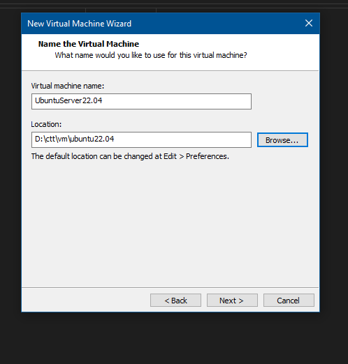
   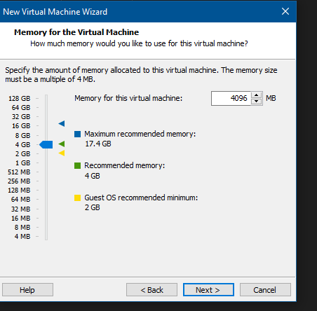
   
3. Đặt thông số phần cứng:

   * **RAM**: `2048 MB` (2GB).
     
   * **Processors**: `1 Processor`, `1 Core`.
     
   * **Network Connection**: Chọn **NAT** (Dùng dải mạng NAT VMnet8). Sau đó chọn Add thêm 1 Network Adapter thứ 2 chế độ **Bridged**.
     
   * **Disk**: `20 GB`.
     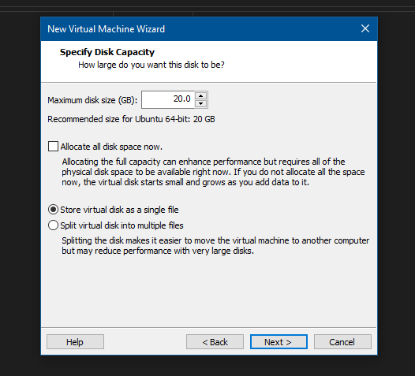

### 1.4 Tạo máy ảo Windows 7 SP1 x86 (Master Image)


1. Tạo máy ảo Win 7 với ISO `Windows 7 Professional SP1 32-bit (x86)`.
2. Thông số phần cứng:
   * **RAM**: `1024 MB` (1GB).
   * **Processors**: `1 Processor`, `1 Core`.
   * **Network**: Chọn **NAT**.
   * **Disk**: `20 GB`.
3. Cài xong Win 7 -> Tắt máy ảo Win 7.
4. **TẠO SNAPSHOT BẢN SẠCH**:
   * Chuột phải máy ảo Win 7 gốc -> **Snapshot** -> **Take Snapshot**.
   * Đặt tên: `00_CLEAN_BASE`. (Snapshot này giữ nguyên để dùng lại cho các môn học khác).

### 1.5 Tạo 2 máy Win 7 cho bài VoIP bằng Linked Clone

1. Chuột phải máy Win 7 gốc -> **Manage** -> **Clone**.
2. Chọn **An existing snapshot** -> Chọn `00_CLEAN_BASE`.
3. Chọn **Create a linked clone**.
4. Đặt tên máy 1: `Win7_GiamDoc`.
5. Làm tương tự tạo máy 2: `Win7_PhongKD`.

---

## Bước 2: Cài đặt & Cấu hình Ubuntu 22.04 (VoIP Server)

### 2.1 Đặt IP tĩnh cho Ubuntu

Mở Terminal trên Ubuntu 22.04 và sửa file netplan:

```bash
sudo nano /etc/netplan/00-installer-config.yaml
```

Cấu hình IP chuẩn theo dải mạng VMnet8 NAT:

```yaml
network:
  version: 2
  ethernets:
    ens33: # (Card NAT VMnet8)
      dhcp4: no
      addresses:
        - 192.168.1.100/24
      routes:
        - to: default
          via: 192.168.1.2
      nameservers:
        addresses: [8.8.8.8, 1.1.1.1]
    ens37: # (Card Bridged cho Phone/Hotspot nếu có)
      dhcp4: yes
```

Áp dụng cấu hình:

```bash
sudo netplan apply
```

### 2.2 Chạy Script tự động cài đặt Asterisk

1. Copy file `setup_voip_ubuntu.sh` vào Ubuntu (hoặc dùng SSH / SCP từ máy thật).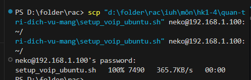
2. Phân quyền và chạy script:

```bash
chmod +x setup_voip_ubuntu.sh
sudo bash setup_voip_ubuntu.sh
```

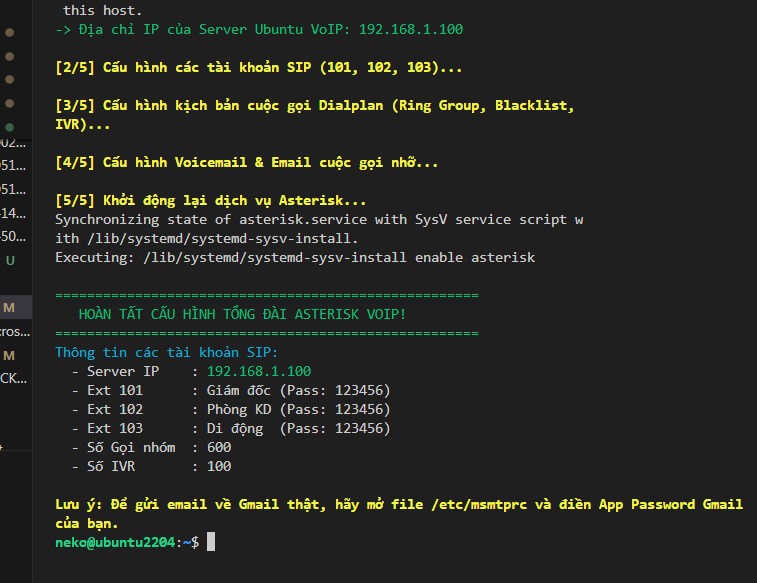

### 2.3 Cấu hình Gmail để gửi cuộc gọi nhỡ (Yêu cầu 5)

1. Mở tài khoản Gmail -> **Quản lý Tài khoản Google** -> **Bảo mật** -> Bật **Xác minh 2 bước**.
   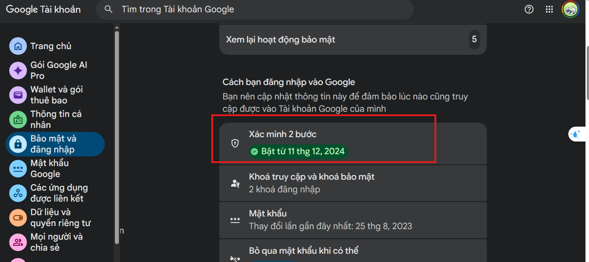
   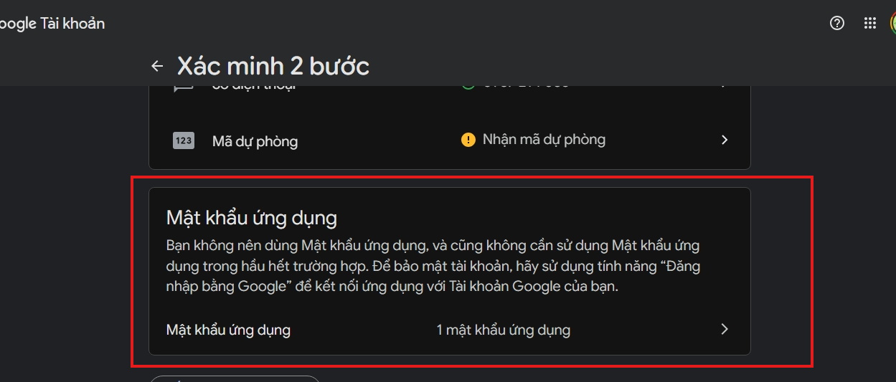
2. Tạo **Mật khẩu ứng dụng (App Password)** cho Mail.
   
   
3. Trên Ubuntu, mở file `/etc/msmtprc`:

```bash
sudo nano /etc/msmtprc
```

Điền Gmail và App Password của bạn vào:

```ini
from       lelong191001@gmail.com
user       lelong191001@gmail.com
password   nwzl sjvs owce dizo  # (Mật khẩu ứng dụng 16 ký tự)
```

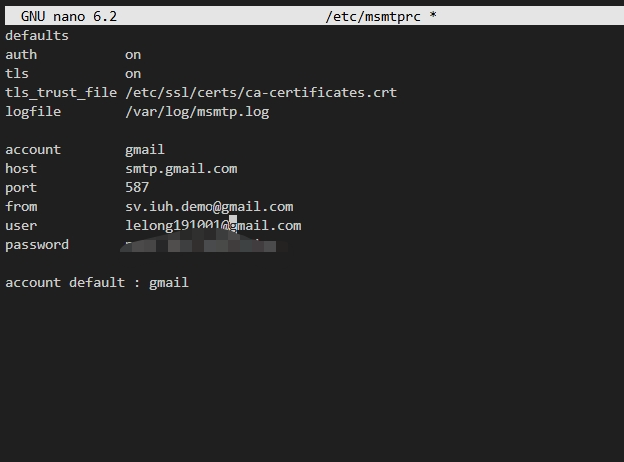
Vào `/etc/asterisk/voicemail.conf` sửa email người nhận ở dòng `101`:

```ini
101 => 1234,Giam Doc,lelong191001@gmail.com
```

Khởi động lại Asterisk: `sudo systemctl restart asterisk`.

### 2.4 Bật Trạm Phát File Nội bộ trên Ubuntu (Python HTTP Server)

Để giúp các máy ảo Win 7 dễ dàng tải file `MicroSIP.exe` mà không cần sử dụng cổng USB hay thao tác phức tạp:

1. **Đẩy file cài đặt lên Ubuntu** (Gõ lệnh SCP từ PowerShell máy thật):

   ```powershell
   scp "d:\folder\rac\iuh\môn\hk1-4\quan-tri-dich-vu-mang\MicroSIP.exe" neko@192.168.1.100:~/
   ```
2. **Bật Trạm phát file ngầm trên Ubuntu (Port 8000)**:

   ```bash
   nohup python3 -m http.server 8000 > /dev/null 2>&1 &
   ```

### Kết quả:

Trạm phát file sẽ chạy ngầm trên Ubuntu tại địa chỉ `http://192.168.1.100:8000`. Các máy Win 7 có thể truy cập qua trình duyệt web và tải file MicroSIP trực tiếp trong mạng LAN nội bộ.

---

## Bước 3: Cấu hình 2 Máy Win 7 (Softphone MicroSIP)

### 3.1 Tải MicroSIP về Win 7

1. Khởi động 2 máy ảo `Win7_GiamDoc` và `Win7_PhongKD`. Đảm bảo cùng mạng 192.168.1.xxx.
   
   
2. Trên máy **Win 7**, mở trình duyệt **Internet Explorer** gõ địa chỉ: `http://192.168.1.100:8000`
3. Click vào file **`MicroSIP.exe`** để tải thẳng về màn hình Desktop Win 7.

---

### 3.2 Cấu hình Đăng ký Tài khoản SIP trên MicroSIP

Mở file `MicroSIP.exe` trên Win 7:

#### 🟢 Đăng ký trên máy `Win7_GiamDoc` (Ext 101):

1. Bấm vào nút **Mũi tên xổ xuống `▼` ở góc trên bên phải giao diện MicroSIP** -> Chọn **Add Account...** (Thêm tài khoản...)
   
2. Điền chính xác các thông tin:
   * **Account Name**: `Giám đốc 101`
   * **SIP Server**: `192.168.1.100` *(Địa chỉ IP máy Server Ubuntu Asterisk)*
   * **Domain**: `192.168.1.100`
   * **Username**: `101`
   * **login**: `101`
   * **Password**: `123456`
   * **Display Name**: `Giám đốc`
3. Bấm **Save** (Lưu).
4. Quan sát ở góc dưới bên trái màn hình MicroSIP: Biểu tượng chuyển sang **dấu chấm màu XANH LÁ CÂY kèm chữ Online** là đã đăng ký thành công!

#### 🔵 Đăng ký trên máy `Win7_PhongKD` (Ext 102):

1. Mở MicroSIP trên máy Win 7 thứ hai -> Bấm **Add Account...**
2. Điền thông tin tương tự:
   * **Account Name**: `Phòng Kinh Doanh 102`
   * **SIP Server**: `192.168.1.100`
   * **Domain**: `192.168.1.100`
   * **Username**: `102`
   * **login**: `102`
   * **Password**: `123456`
   * **Display Name**: `Phòng KD`
3. Bấm **Save** -> Trạng thái hiển thị **Online** là hoàn tất!

💡 **LƯU Ý NHẮN TIN TÍNH NĂNG MICROSIP**:
Khi gửi tin nhắn văn bản (SIP MESSAGE) trên MicroSIP, nếu cửa sổ chat thu nhỏ, bạn kéo rộng cửa sổ sang bên phải để hiện nút **`Send`**, sau đó click chuột vào nút **`Send`** để gửi tin nhắn.

---

## Bước 4: Cấu hình Điện thoại Di động Thật (App Sipnetic)

### 4.1 Đảm bảo kết nối Mạng giữa Điện thoại và Máy chủ Ubuntu

* **Cách 1 (Kết nối chung Wi-Fi)**: Điện thoại di động và Laptop cùng kết nối vào một mạng Wi-Fi. Trên VMware, Card mạng thứ 2 (`ens37`) của Ubuntu chọn chế độ **Bridged (VMnet0)** tới Card Wi-Fi máy tính.

  **Các lệnh bật Card Bridged `ens37` và yêu cầu nhận IP DHCP từ Wi-Fi trên Ubuntu (khi card bị DOWN):**

  ```bash
  # 1. Bật card mạng ens37 lên trạng thái UP
  sudo ip link set ens37 up

  # 2. Yêu cầu nhận IP tự động DHCP từ Wi-Fi
  sudo dhclient ens37

  # 3. Kiểm tra IP vừa nhận được (Xem tại ô inet của card ens37)
  ip a
  ```
* **Cách 2 (Phát Hotspot 4G từ Điện thoại)**: Điện thoại bật tính năng Phát Wi-Fi Hotspot 4G -> Laptop bắt Wi-Fi Hotspot đó. Mở Terminal Ubuntu gõ `ip a` để lấy địa chỉ IP của card Bridged điền vô phone (ví dụ: `10.45.80.164`).(hiện tại mới chạy ổn cách này)

---

### 4.2 Cấu hình Chi tiết trên Ứng dụng Sipnetic Mobile

1. Tải ứng dụng **Sipnetic** từ Google Play Store (Android) hoặc App Store (iOS).
2. Mở ứng dụng **Sipnetic** trên điện thoại.
3. nhập ip ubuntu 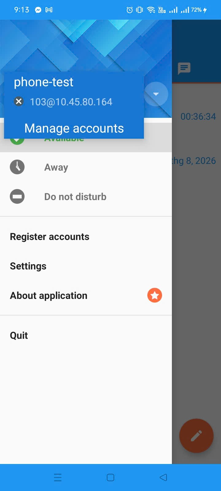
4. Nhập đầy đủ các tham số cấu hình:
   * **Account Name**: `Di động 103`
   * **User ID / Username**: `103`
   * **Domain / Server**:  *điền IP Card Bridged `10.10.55.250` / `10.45.80.164` nếu kết nối Wi-Fi/Hotspot)*
   * **Password**: `123456`
   * **Transport Protocol**: Chọn **UDP**
5. Bấm **SAVE** (Lưu) hoặc **APPLY**.
6. Quan sát biểu tượng tài khoản chuyển sang trạng thái **Registered** (Đã đăng ký) màu xanh lá cây là hoàn tất Extension `103`!

---

## Bước 5: Kịch bản Test 6 Yêu cầu Đề bài

Dưới đây là thứ tự test từng yêu cầu để thực hiện báo cáo demo với giáo viên:

| STT         | Yêu cầu đề bài                    | Thao tác thực hiện Test                                                                                                                                                                                                                                  | Kết quả mong đợi                                                                                                                                                                                                           |
| :---------- | :------------------------------------- | :---------------------------------------------------------------------------------------------------------------------------------------------------------------------------------------------------------------------------------------------------------- | :----------------------------------------------------------------------------------------------------------------------------------------------------------------------------------------------------------------------------- |
| **1** | **Gọi nhóm (Ring Group)**      | Từ bất kỳ máy nào (101, 102 hoặc 103), bấm gọi số**`600`**.<br />trong video là 103 gọi nhóm, 103 là phone<br />(video3)                                                                                                                     | Cả máy Win7 (`101`, `102`) và Điện thoại (`103`) đồng thời đổ chuông. Máy nào nhấc máy trước sẽ bắt đàm thoại.                                                                                    |
| **2** | **Gọi Di động**               | Từ Win7 (`101` hoặc `102`), bấm gọi số **`103`**.<br />(trong video 1)<br />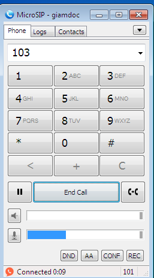                                                                                          | App Sipnetic trên điện thoại di động reo chuông, nhấc máy nghe rõ âm thanh 2 chiều.                                                                                                                                |
| **3** | **Nhắn tin (SIP Messaging)**    | Trên MicroSIP (máy`101`), mở tab **Messages**, gõ nhắn tới `103`. Bấm nút **Send**.<br />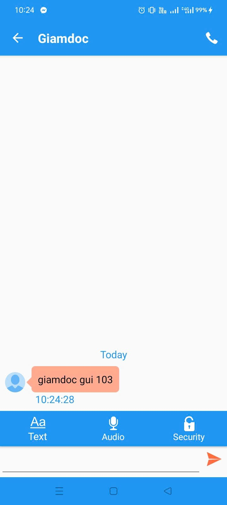 | App Sipnetic trên điện thoại (`103`) nhận được tin nhắn POP-UP hiển thị nội dung tin nhắn.                                                                                                                      |
| **4** | **Chặn cuộc gọi (Blacklist)** | **Lượt 1**: Từ Giám đốc (`101`) gọi Nhân viên (`102` hoặc `103`).<br />**Lượt 2**: Từ Nhân viên (`102` hoặc `103`) gọi Giám đốc (`101`).<br />(video1)                                                          | -**Lượt 1**: Cuộc gọi thành công đàm thoại bình thường.<br />- **Lượt 2**: Cuộc gọi bị **CHẶN** ngay lập tức, nghe tiếng báo không dịch vụ (`ss-noservice`) và ngắt cuộc gọi. |
| **5** | **Gửi Gmail cuộc gọi nhỡ**   | Gọi số**`100`** (Tổng đài IVR) -> Bấm phím `1` chuyển sang Giám đốc (`101`). Máy 101 KHÔNG nghe máy. Sau 20 giây tự chuyển qua Voicemail. Nói 1 đoạn âm thanh rồi cúp máy.<br />(video4))                                     | Asterisk tự động gửi 1 Email kèm file ghi âm`.wav` đến địa chỉ Gmail đã cấu hình (`...@gmail.com`).                                                                                                         |
| **6** | **Gọi Tổng đài (IVR)**       | Từ bất kỳ máy nào (101, 102, 103) bấm gọi số**`100`**.<br />()video2)                                                                                                                                                                       | Nghe lời chào tự động: Bấm phím`1` cuộc gọi tự chuyển sang Giám đốc (`101`), bấm phím `2` chuyển sang Phòng KD (`102`).                                                                              |

---
