# BÁO CÁO : XÂY DỰNG VÀ QUẢN TRỊ HỆ THỐNG TỔNG ĐÀI VOIP ASTERISK

**Môn học:** Quản trị dịch vụ mạng
**Trường:** Đại học Công nghiệp TP.HCM (IUH)
**Môi trường thử nghiệm:** Ubuntu 22.04 LTS (Asterisk PBX), 2 Máy ảo Windows 7 SP1 (MicroSIP Softphone), 1 Điện thoại Di động thật (Sipnetic App).

---

## MỤC LỤC

- [CHƯƠNG 1: TỔNG QUAN TRONG MẠNG VOIP](#chương-1-tổng-quan-trong-mạng-voip)
  - [1.1 Giới thiệu chung về VoIP](#11-giới-thiệu-chung-về-voip)
  - [1.2 Ưu điểm và Nhược điểm của giải pháp VoIP](#12-ưu-điểm-và-nhược-điểm-của-giải-pháp-voip)
- [CHƯƠNG 2: CÔNG NGHỆ TRONG VOIP](#chương-2-công-nghệ-trong-voip)
  - [2.1 Kiến trúc mạng VoIP](#21-kiến-trúc-mạng-voip)
  - [2.2 Các giao thức cốt lõi trong VoIP](#22-các-giao-thức-cốt-lõi-trong-voip)
  - [2.3 Mã hóa âm thanh (Audio Codec)](#23-mã-hóa-âm-thanh-audio-codec)
- [CHƯƠNG 3: BẢO MẬT TRONG VOIP](#chương-3-bảo-mật-trong-voip)
  - [3.1 Vấn đề bảo mật trong VoIP](#31-vấn-đề-bảo-mật-trong-voip)
  - [3.2 Giải pháp bảo mật và tối ưu hóa hệ thống](#32-giải-pháp-bảo-mật-và-tối-ưu-hóa-hệ-thống)
- [CHƯƠNG 4: THIẾT KẾ VÀ TRIỂN KHAI HỆ THỐNG THỰC TẾ](#chương-4-thiết-kế-và-triển-khai-hệ-thống-thực-tế)
  - [4.1 Tổng quan Sơ đồ Mạng &amp; Phân bổ IP / Extension](#41-tổng-quan-sơ-đồ-mạng--phân-bổ-ip--extension)
  - [4.2 Bước 1: Cấu hình VMware Workstation &amp; Chuẩn hóa Mạng (VMnet8 NAT + Dual NIC)](#42-bước-1-cấu-hình-vmware-workstation--chuẩn-hóa-mạng-vmnet8-nat--dual-nic)
  - [4.3 Bước 2: Cài đặt &amp; Cấu hình Ubuntu 22.04 (VoIP Server)](#43-bước-2-cài-đặt--cấu-hình-ubuntu-2204-voip-server)
  - [4.4 Bước 3: Cấu hình 2 Máy Win 7 (Softphone MicroSIP)](#44-bước-3-cấu-hình-2-máy-win-7-softphone-microsip)
  - [4.5 Bước 4: Cấu hình Điện thoại Di động Thật (App Sipnetic)](#45-bước-4-cấu-hình-điện-thoại-di-động-thật-app-sipnetic)
- [CHƯƠNG 5: KẾT QUẢ THỰC NGHIỆM VÀ DEMO 6 YÊU CẦU ĐỀ BÀI](#chương-5-kết-quả-thực-nghiệm-và-demo-6-yêu-cầu-đề-bài)

---

## CHƯƠNG 1: TỔNG QUAN TRONG MẠNG VOIP

### 1.1 Giới thiệu chung về VoIP

**VoIP (Voice over Internet Protocol)** - Điện thoại truyền qua giao thức Internet - là công nghệ cho phép truyền thoại và các dịch vụ truyền thông đa phương tiện (tin nhắn, hình ảnh, video) qua mạng IP (như mạng LAN nội bộ hoặc Internet), thay vì sử dụng mạng điện thoại chuyển mạch kênh truyền thống PSTN (Public Switched Telephone Network).

* **Nguyên lý hoạt động cơ bản:**
  1. **Số hóa (Digitization):** Tín hiệu âm thanh dạng tương tự (Analog) từ micro người nói được mã hóa thành các dữ liệu số (Digital).
  2. **Đóng gói (Packetization):** Dữ liệu số này được chia nhỏ và đóng gói vào các gói tin IP (IP Packets).
  3. **Truyền dẫn (Transmission):** Các gói tin IP được truyền đi trên hạ tầng mạng IP thông qua các giao thức định tuyến.
  4. **Giải mã và phát (Reconstruction):** Tại thiết bị nhận, các gói tin được tập hợp, sắp xếp lại theo đúng thứ tự, giải mã ngược thành tín hiệu âm thanh tương tự để phát ra loa.

### 1.2 Ưu điểm và Nhược điểm của giải pháp VoIP

| Tiêu chí                              | Mạng điện thoại truyền thống (PSTN)               | Mạng điện thoại VoIP                                               |
| :-------------------------------------- | :------------------------------------------------------ | :--------------------------------------------------------------------- |
| **Chi phí đầu tư**            | Rất cao (kéo dây cáp đồng, tổng đài PBX cứng) | Thấp (Tận dụng hạ tầng mạng LAN/Internet có sẵn)               |
| **Cước phí cuộc gọi**        | Tính theo khoảng cách địa lý và thời gian       | Miễn phí trong mạng nội bộ, cước liên tỉnh/quốc tế cực rẻ |
| **Tính linh hoạt**              | Cố định theo vị trí địa lý của dây cáp       | Di động (Truy cập mọi nơi có Wi-Fi/4G/Internet)                  |
| **Tính mở rộng**               | Khó mở rộng, phụ thuộc vào số cổng phần cứng  | Dễ dàng mở rộng hàng ngàn extension bằng phần mềm             |
| **Độ tin cậy & Chất lượng** | Cao (Băng thông riêng biệt 64kbps)                  | Phụ thuộc vào chất lượng mạng IP (Jitter, Latency, Packet Loss) |

---

## CHƯƠNG 2: CÔNG NGHỆ TRONG VOIP

### 2.1 Kiến trúc mạng VoIP

Mô hình kiến trúc mạng VoIP tiêu chuẩn gồm 4 thành phần chính:

```text
 [ User Agent / Softphone ] <──(SIP Signaling)──> [ VoIP PBX Server (Asterisk) ]
            │                                                 │
            └──────────────(RTP Audio Stream)─────────────────┘
```

1. **User Agent (UA) / Terminal:** Thiết bị đầu cuối của người dùng (Softphone trên PC/Mobile, IP Phone cứng, hoặc Adapter ATA kết nối máy analog). UA đóng vai trò là User Agent Client (UAC) khi phát yêu cầu gọi và User Agent Server (UAS) khi tiếp nhận cuộc gọi.
2. **SIP Registrar / Proxy Server:** Server tiếp nhận yêu cầu đăng ký vị trí (IP/Port) của các User Agent và làm trung gian thiết lập cuộc gọi.
3. **VoIP PBX Server (Tổng đài PBX):** Thành phần trung tâm quản lý toàn bộ luồng thoại, xử lý định tuyến (Dialplan), tạo nhóm gọi (Ring Group), tổng đài tự động (IVR), hộp thư thoại (Voicemail). Trong đồ án này sử dụng giải pháp mã nguồn mở **Asterisk 18 (PJSIP Stack)**.
4. **Media Gateway / Trunking:** Thiết bị/dịch vụ chuyển đổi tín hiệu giữa mạng VoIP IP và mạng điện thoại cố định PSTN hoặc mạng di động GSM.

### 2.2 Các giao thức cốt lõi trong VoIP

Hệ thống VoIP phân tách rõ ràng giữa **giao thức điều khiển (Signaling)** và **giao thức truyền tải dữ liệu thoại (Media Stream)**:

* **SIP (Session Initiation Protocol - RFC 3261):** Giao thức tầng ứng dụng dùng để khởi tạo, duy trì, sửa đổi và kết thúc các phiên truyền thông đa phương tiện (thoại, video, chat). SIP hoạt động theo mô hình Request/Response tương tự HTTP, chạy trên cổng mặc định UDP/TCP `5060` (hoặc `5061` cho TLS).
* **SDP (Session Description Protocol - RFC 4566):** Được nhúng bên trong thông điệp SIP nhằm thương lượng các thông số kỹ thuật phương tiện giữa hai đầu cuối (danh sách Codec hỗ trợ, địa chỉ IP thu phát media, cổng RTP).
* **RTP / RTCP (Real-time Transport Protocol - RFC 3550):** Giao thức truyền dữ liệu âm thanh/hình ảnh thời gian thực trên nền UDP. RTCP đi kèm để giám sát chất lượng dịch vụ (đo độ trễ, mất gói).
* **PJSIP Extension Stack:** Thư viện SIP thế hệ mới được Asterisk sử dụng thay thế cho module `chan_sip` cũ. PJSIP có hiệu năng cao, hỗ trợ đa luồng (multithreading), NAT Traversal linh hoạt và tính sẵn sàng cao.

### 2.3 Mã hóa âm thanh (Audio Codec)

Codec có nhiệm vụ nén/giải nén âm thanh để tối ưu băng thông đường truyền:

* **G.711 (alaw/ulaw):** Standard PCM 64 kbps, chất lượng âm thanh gốc chuẩn điện thoại, không nén, tốn băng thông nhưng không tiêu tốn CPU.
* **GSM 6.10:** Băng thông thấp (~13.2 kbps), nén tốt, chuyên dùng cho các thiết bị di động và lưu trữ file nhắn thoại Voicemail.
* **Opus:** Codec hiện đại có khả năng tự điều chỉnh linh hoạt bitrate (6-510 kbps), tối ưu nhất cho mạng di động 3G/4G/Wi-Fi có chất lượng không ổn định.

---

## CHƯƠNG 3: BẢO MẬT TRONG VOIP

### 3.1 Vấn đề bảo mật trong VoIP

Do chạy trên nền hạ tầng IP công cộng hoặc nội bộ, VoIP đối mặt với các nguy cơ bảo mật nghiêm trọng:

1. **Eavesdropping (Nghe lén cuộc gọi):** Kẻ tấn công sử dụng công cụ như Wireshark thực hiện ARP Spoofing để bắt các gói tin RTP unencrypted và khôi phục lại âm thanh cuộc gọi.
2. **SIP Registration Hijacking & Password Brute-Force:** Tấn công dò quét mật khẩu tài khoản SIP (Ext 101, 102...) để chiếm đoạt quyền gọi điện.
3. **Toll Fraud (Gian lận cước viễn thông):** Kẻ tấn công lợi dụng PBX bị chiếm đoạt để thực hiện các cuộc gọi tính phí quốc tế với chi phí đắt đỏ.
4. **SIP Spam & Vishing (Phishing qua thoại):** Tự động phát cuộc gọi rác hoặc giả mạo tổng đài ngân hàng/doanh nghiệp để lừa đảo.
5. **Denial of Service (DoS/DDoS):** Bơm dồn dập các gói tin `SIP INVITE` hoặc `REGISTER` gây quá tải CPU tổng đài PBX.

### 3.2 Giải pháp bảo mật và tối ưu hóa hệ thống

Trong đồ án này, hệ thống áp dụng các cơ chế bảo mật và phân quyền nâng cao:

* **Phân quyền Dialplan Context (Context-Based Authorization):**
  * Tách biệt `giamdoc-context` và `nhanvien-context`.
  * Áp dụng luật chặn chủ động tại tầng ứng dụng Asterisk: Nhân viên (`102`, `103`) khi bấm gọi tới Giám đốc (`101`) sẽ bị hệ thống phát âm báo dịch vụ không khả thi `Playback(ss-noservice)` và lập tức ngắt kết nối `Hangup(17)`.
* **Xác thực Digest Auth (MD5 Challenge/Response):** Tất cả tài khoản SIP bắt buộc phải xác thực mật khẩu qua cơ chế băm MD5, không bao giờ truyền mật khẩu dạng rõ (Plaintext) qua mạng.
* **Tự động nhận diện mạng NAT (NAT Traversal Dynamic Handling):**
  * Cấu hình tham số `local_net`, `external_signaling_address`, `external_media_address` tự động trong PJSIP.
  * Giúp chống lỗi **481 Call Leg Does Not Exist** hoặc treo cuộc gọi khi điện thoại di động kết nối từ hạ tầng Wi-Fi/4G khác giải mạng với máy chủ.

---

## CHƯƠNG 4: THIẾT KẾ VÀ TRIỂN KHAI HỆ THỐNG THỰC TẾ

### 4.1 Tổng quan Sơ đồ Mạng & Phân bổ IP / Extension

```text
                        [ Laptop Máy Thật (Windows) ]
                                      │
                   ┌──────────────────┴──────────────────┐
                   │ VMware VMnet8 NAT (192.168.1.0/24)  │
                   │                                     │
         [ Ubuntu 22.04 Server ]                 [ Windows 7 - GiamDoc ]
         - Static IP: 192.168.1.100              - IP: 192.168.1.128 (hoặc tĩnh 101)
         - Dịch vụ: Asterisk PBX                 - Ext: 101 (MicroSIP)
         - Dual NIC: ens33 (NAT) + ens37 (Bridge)        │
                                                 [ Windows 7 - PhongKD ]
                                                 - IP: 192.168.1.129 (hoặc tĩnh 102)
                                                 - Ext: 102 (MicroSIP)
                                                         │
                                                 [ Điện thoại Di động Thật ]
                                                 - Wi-Fi / 4G Hotspot
                                                 - Ext: 103 (App Sipnetic)
```

#### Bảng phân bổ thông số hệ thống:

| Thiết bị                    | Card mạng             | IP                                | Ext / Account | Mật khẩu | Vai trò                   |
| :---------------------------- | :--------------------- | :-------------------------------- | :------------ | :--------- | :------------------------- |
| **Ubuntu 22.04**        | NAT (VMnet8) + Bridged | `192.168.1.100` (Static)        | Server PBX    | -          | Tổng đài Asterisk       |
| **Win 7 - Máy 1**      | NAT (VMnet8)           | `192.168.1.128` (hoặc `101`) | `101`       | `123456` | Giám đốc                |
| **Win 7 - Máy 2**      | NAT (VMnet8)           | `192.168.1.129` (hoặc `102`) | `102`       | `123456` | Phòng Kinh doanh          |
| **Điện thoại thật** | Wi-Fi / Hotspot 4G     | Dải mạng Wi-Fi/Hotspot          | `103`       | `123456` | Di động (App Sipnetic)   |
| **Số Gọi Nhóm**      | -                      | -                                 | `600`       | -          | Đổ chuông 101, 102, 103 |
| **Số Tổng đài**     | -                      | -                                 | `100`       | -          | IVR Lời chào tự động  |

---

### 4.2 Bước 1: Cấu hình VMware Workstation & Chuẩn hóa Mạng (VMnet8 NAT + Dual NIC)

#### 1.1 Chuẩn hóa dải mạng NAT (VMnet8) trên VMware Workstation

Để tránh nhảy IP khi mang laptop đi các môi trường Wi-Fi khác nhau, ta cố định dải mạng NAT:

1. Trên cửa sổ VMware Workstation: Chọn **Edit** -> **Virtual Network Editor...**
2. Bấm nút **Change Settings** (góc dưới bên phải để cấp quyền Admin).
3. Chọn dòng **VMnet8** (loại NAT).
4. Tại ô **Subnet IP**: Đổi thành **`192.168.1.0`**, Subnet Mask: `255.255.255.0`.
5. Bấm vào nút **NAT Settings...**:
   * Mục **Gateway IP**: Kiểm tra/đổi thành **`192.168.1.2`** (hoặc `192.168.1.1`) -> Bấm **OK**.
6. Bấm **Apply** -> **OK**.

#### 1.2 Mô hình Card mạng kép (Dual NIC) cho Server Ubuntu

* **Card 1 (VMnet8 NAT)**: Giao tiếp cố định IP tĩnh `192.168.1.100` với 2 máy ảo Windows 7.
* **Card 2 (VMnet0 Bridged)**: Kết nối tới Wi-Fi / 4G Hotspot phát từ Điện thoại di động để nhận IP DHCP cho Extension `103` truy cập từ thiết bị thật.

#### 1.3 Tạo máy ảo Ubuntu Server 22.04

1. Bật VMware Workstation -> **File** -> **New Virtual Machine** -> Chọn **Custom (advanced)**.
   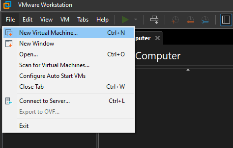
   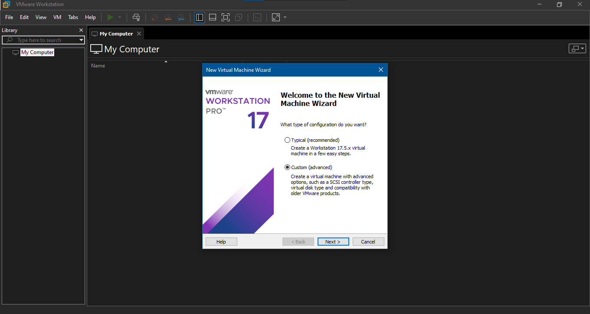
2. Chọn ISO `ubuntu-22.04.x-live-server-amd64.iso`.
   
   
   
3. Đặt thông số phần cứng:
   * **RAM**: `2048 MB` (2GB).
     
   * **Processors**: `1 Processor`, `1 Core`.
     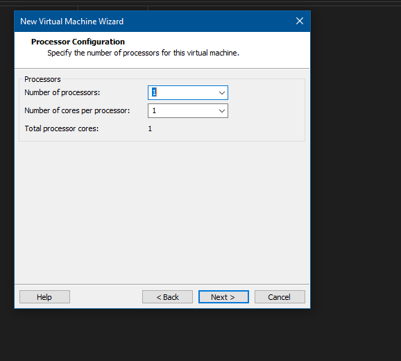
   * **Network Connection**: Chọn **NAT** (Dùng dải mạng NAT VMnet8). Sau đó chọn Add thêm 1 Network Adapter thứ 2 chế độ **Bridged**.
     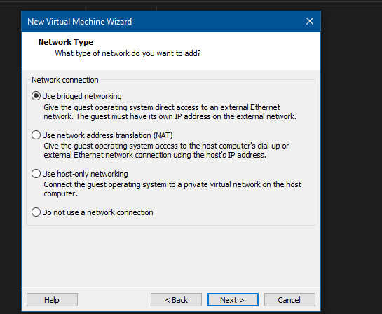
   * **Disk**: `20 GB`.
     

#### 1.4 Tạo máy ảo Windows 7 SP1 x86 (Master Image)

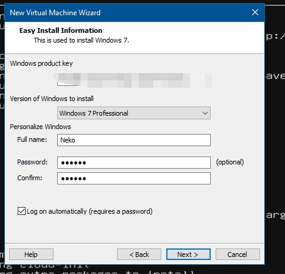

1. Tạo máy ảo Win 7 với ISO `Windows 7 Professional SP1 32-bit (x86)`.
2. Thông số phần cứng:
   * **RAM**: `1024 MB` (1GB).
   * **Processors**: `1 Processor`, `1 Core`.
   * **Network**: Chọn **NAT**.
   * **Disk**: `20 GB`.
3. Cài xong Win 7 -> Tắt máy ảo Win 7.
4. **TẠO SNAPSHOT BẢN SẠCH**:
   * Chuột phải máy ảo Win 7 gốc -> **Snapshot** -> **Take Snapshot**.
   * Đặt tên: `00_CLEAN_BASE`.

#### 1.5 Tạo 2 máy Win 7 bằng Linked Clone

1. Chuột phải máy Win 7 gốc -> **Manage** -> **Clone**.
2. Chọn **An existing snapshot** -> Chọn `00_CLEAN_BASE`.
3. Chọn **Create a linked clone**.
4. Đặt tên máy 1: `Win7_GiamDoc`.
5. Làm tương tự tạo máy 2: `Win7_PhongKD`.

---

### 4.3 Bước 2: Cài đặt & Cấu hình Ubuntu 22.04 (VoIP Server)

#### 2.1 Đặt IP tĩnh cho Ubuntu

Mở Terminal trên Ubuntu 22.04 và sửa file netplan:

```bash
sudo nano /etc/netplan/00-installer-config.yaml
```

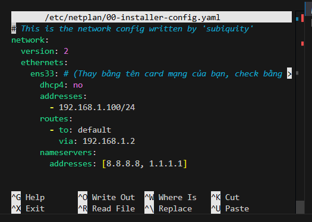

Cấu hình IP chuẩn theo dải mạng VMnet8 NAT:

```yaml
network:
  version: 2
  ethernets:
    ens33: # (Card NAT VMnet8)
      dhcp4: no
      addresses:
        - 192.168.1.100/24
      routes:
        - to: default
          via: 192.168.1.2
      nameservers:
        addresses: [8.8.8.8, 1.1.1.1]
    ens37: # (Card Bridged cho Phone/Hotspot nếu có)
      dhcp4: yes
```

Áp dụng cấu hình:

```bash
sudo netplan apply
```

#### 2.2 Chạy Script tự động cài đặt Asterisk (`setup_voip_ubuntu.sh`)

Script `setup_voip_ubuntu.sh` được tối ưu tự động dọn dẹp bản Asterisk cũ (nếu có), cài đặt phần mềm, tự động quét tìm địa chỉ IP động của card NAT và Bridged, sinh file cấu hình `pjsip.conf`, `extensions.conf`, `modules.conf`, `voicemail.conf`:

```bash
chmod +x setup_voip_ubuntu.sh
sudo ./setup_voip_ubuntu.sh
```


#### 2.3 Cấu hình Gmail tự động bằng Script (`setup_gmail.sh`)

1. Mở tài khoản Gmail -> **Quản lý Tài khoản Google** -> **Bảo mật** -> Bật **Xác minh 2 bước**.
   
   
2. Tạo **Mật khẩu ứng dụng (App Password)** cho Mail (mật khẩu 16 ký tự).
   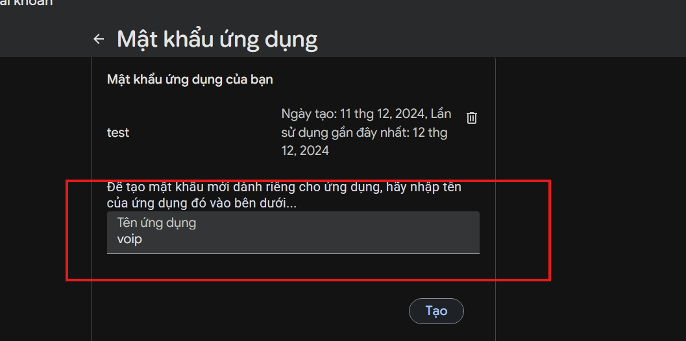
   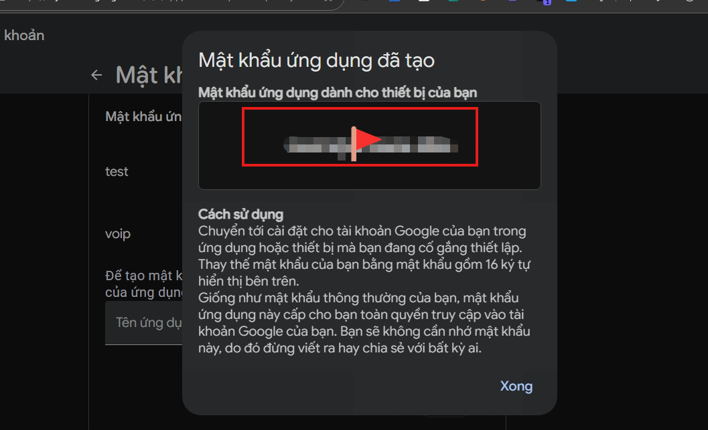
3. Chạy script tự động cấu hình Gmail:

```bash
chmod +x setup_gmail.sh
sudo ./setup_gmail.sh <địa_chỉ_gmail_của_bạn> <app_password_16_ký_tự>
```

*Ví dụ:*

```bash
sudo ./setup_gmail.sh lelong191001@gmail.com abcdsjvsoabcdizo
```

> **Lưu ý:** Script sẽ tự động tạo file `/etc/msmtprc`, phân quyền chuẩn xác `root:asterisk (640)`, cập nhật hòm thư nhận Voicemail trong `voicemail.conf`, gửi 1 email thử nghiệm (Test Email) kiểm tra kết nối và khởi động lại dịch vụ Asterisk.

#### 2.4 Bật Trạm Phát File Nội bộ trên Ubuntu (Python HTTP Server)

Để giúp các máy ảo Win 7 dễ dàng tải file `MicroSIP.exe` mà không cần sử dụng cổng USB hay thao tác phức tạp:

1. **Đẩy file cài đặt lên Ubuntu** (Gõ lệnh SCP từ PowerShell máy thật):

   ```powershell
   scp "d:\folder\rac\iuh\môn\hk1-4\quan-tri-dich-vu-mang\MicroSIP.exe" neko@192.168.1.100:~/
   ```
2. **Bật Trạm phát file ngầm trên Ubuntu (Port 8000)**:

   ```bash
   nohup python3 -m http.server 8000 > /dev/null 2>&1 &
   ```

Trạm phát file sẽ chạy ngầm tại `http://192.168.1.100:8000`.

---

### 4.4 Bước 3: Cấu hình 2 Máy Win 7 (Softphone MicroSIP)

#### 3.1 Tải MicroSIP về Win 7

1. Khởi động 2 máy ảo `Win7_GiamDoc` và `Win7_PhongKD`. Đảm bảo cùng mạng `192.168.1.xxx`.
   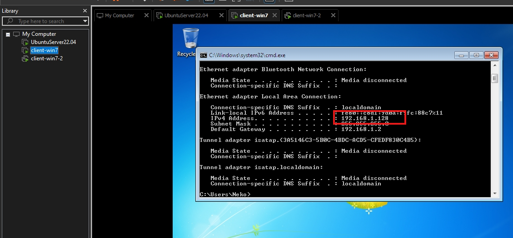
   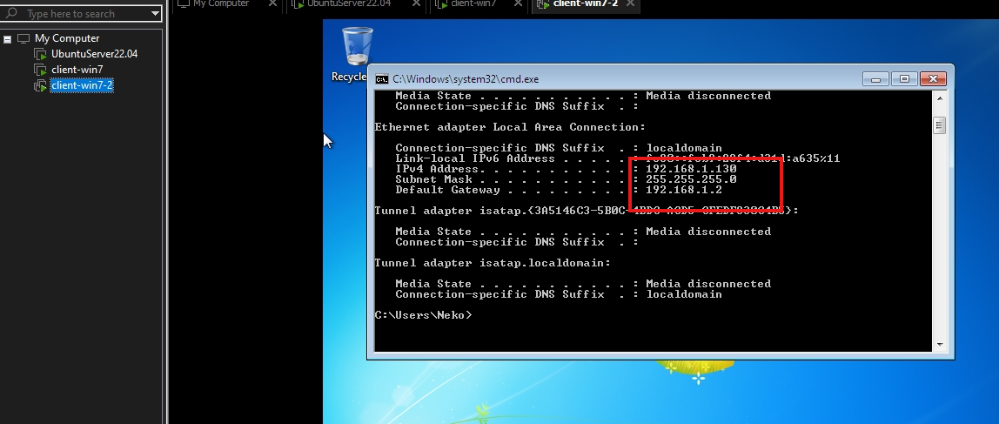
2. Trên máy **Win 7**, mở trình duyệt **Internet Explorer** gõ địa chỉ: `http://192.168.1.100:8000`
3. Click vào file **`MicroSIP.exe`** để tải thẳng về màn hình Desktop Win 7.

#### 3.2 Cấu hình Đăng ký Tài khoản SIP trên MicroSIP

##### 🟢 Đăng ký trên máy `Win7_GiamDoc` (Ext 101):

1. Bấm vào nút **Mũi tên xổ xuống `▼` ở góc trên bên phải giao diện MicroSIP** -> Chọn **Add Account...**
   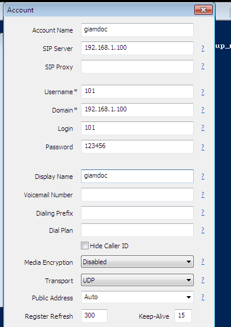
2. Điền thông tin:
   * **Account Name**: `Giám đốc 101`
   * **SIP Server**: `192.168.1.100`
   * **Domain**: `192.168.1.100`
   * **Username**: `101`
   * **login**: `101`
   * **Password**: `123456`
   * **Display Name**: `Giám đốc`
3. Bấm **Save**. Biểu tượng chuyển sang **dấu chấm màu XANH LÁ CÂY (Online)** là thành công.

##### 🔵 Đăng ký trên máy `Win7_PhongKD` (Ext 102):

1. Mở MicroSIP trên máy Win 7 thứ hai -> Bấm **Add Account...**
2. Điền thông tin:
   * **Account Name**: `Phòng Kinh Doanh 102`
   * **SIP Server**: `192.168.1.100`
   * **Domain**: `192.168.1.100`
   * **Username**: `102`
   * **login**: `102`
   * **Password**: `123456`
   * **Display Name**: `Phòng KD`
3. Bấm **Save** -> Trạng thái hiển thị **Online** là hoàn tất!

> 💡 **LƯU Ý NHẮN TIN TRÊN MICROSIP:** Khi gửi tin nhắn văn bản (SIP MESSAGE), nếu cửa sổ chat thu nhỏ, bạn kéo rộng cửa sổ sang bên phải để hiện nút **`Send`**, sau đó click vào nút **`Send`** để gửi tin nhắn.

---

### 4.5 Bước 4: Cấu hình Điện thoại Di động Thật (App Sipnetic)

#### 4.1 Đảm bảo kết nối Mạng giữa Điện thoại và Máy chủ Ubuntu

* **Cách 1 (Kết nối chung Wi-Fi)**: Điện thoại di động và Laptop cùng kết nối vào một mạng Wi-Fi. Trên VMware, Card mạng thứ 2 (`ens37`) của Ubuntu chọn chế độ **Bridged (VMnet0)** tới Card Wi-Fi máy tính.
  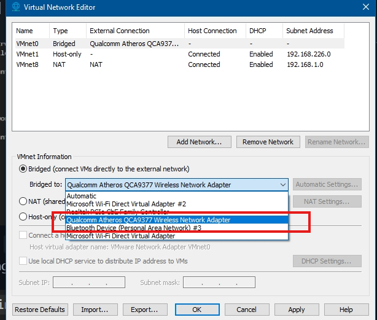

  Lệnh bật Card Bridged `ens37` nếu chưa nhận IP:

  ```bash
  sudo ip link set ens37 up
  sudo dhclient ens37
  ip a
  ```
* **Cách 2 (Phát Hotspot 4G từ Điện thoại)**: Điện thoại bật Wi-Fi Hotspot 4G -> Laptop kết nối Wi-Fi Hotspot đó. Mở Terminal Ubuntu gõ `ip a` xem địa chỉ IP của card Bridged (ví dụ: `10.45.80.164`).

#### 4.2 Cấu hình Chi tiết trên Ứng dụng Sipnetic Mobile

1. Tải ứng dụng **Sipnetic** từ Google Play Store hoặc App Store.
   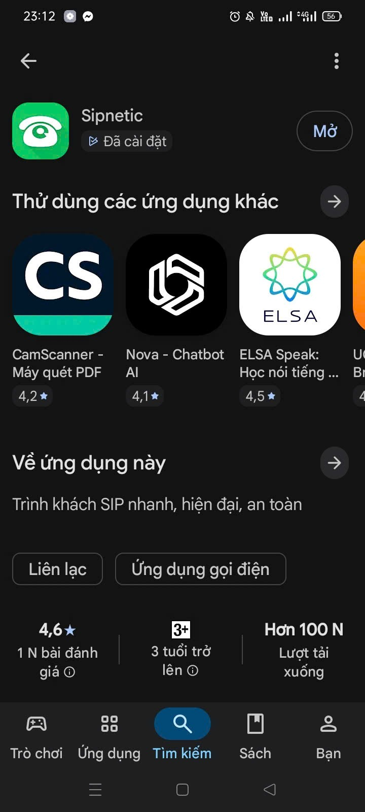
2. Mở **Sipnetic** -> Tạo tài khoản SIP mới:
   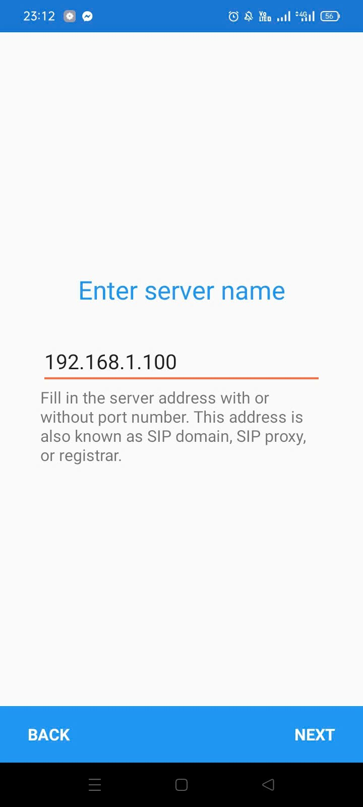
   
   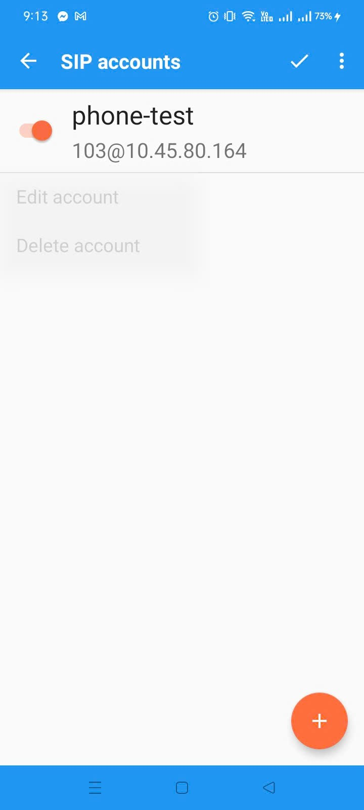
3. Điền thông tin cấu hình:
   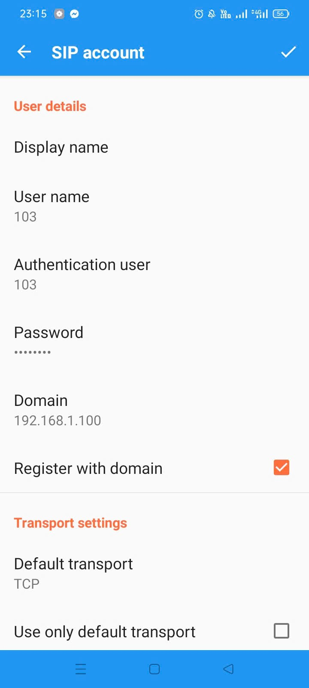
   * **Account Name**: `Di động 103`
   * **User ID / Username**: `103`
   * **Domain / Server**: *Điền IP Card Bridged của Ubuntu (ví dụ: `10.45.80.164`)*
   * **Password**: `123456`
   * **Transport Protocol**: Chọn **UDP**
4. Bấm **SAVE**. Biểu tượng tài khoản chuyển sang **Registered (Đã đăng ký màu xanh)** là hoàn tất Extension `103`!

---

## CHƯƠNG 5: KẾT QUẢ THỰC NGHIỆM VÀ DEMO 6 YÊU CẦU ĐỀ BÀI

Bảng đối chiếu kịch bản kiểm thử và kết quả thực nghiệm 6 yêu cầu đề bài:

| STT         | Yêu cầu đề bài                    | Thao tác thực hiện Test                                                                                                                                                                                                                                                | Kết quả thực nghiệm mong đợi                                                                                                                                                                      | Đánh giá          |
| :---------- | :------------------------------------- | :------------------------------------------------------------------------------------------------------------------------------------------------------------------------------------------------------------------------------------------------------------------------ | :------------------------------------------------------------------------------------------------------------------------------------------------------------------------------------------------------ | :------------------- |
| **1** | **Gọi nhóm (Ring Group)**      | Từ bất kỳ máy nào (`101`, `102` hoặc `103`), bấm gọi số **`600`**.<br />*(Trong video 3: Ext 103 gọi nhóm, 103 là điện thoại)*                                                                                                             | Cả máy Win7 (`101`, `102`) và Điện thoại (`103`) đồng thời đổ chuông. Máy nào nhấc máy trước sẽ bắt đàm thoại.                                                             | **ĐẠT (OK)** |
| **2** | **Gọi Di động**               | Từ Win7 (`101` hoặc `102`), bấm gọi số **`103`**.<br />*(Trong video 1)*<br />                                                                                                    | App Sipnetic trên điện thoại di động reo chuông, nhấc máy nghe rõ âm thanh 2 chiều thông suốt.                                                                                            | **ĐẠT (OK)** |
| **3** | **Nhắn tin (SIP Messaging)**    | Trên MicroSIP (máy`101`), mở tab **Messages**, nhập số nhận `103`, gõ văn bản và bấm **Send**.<br />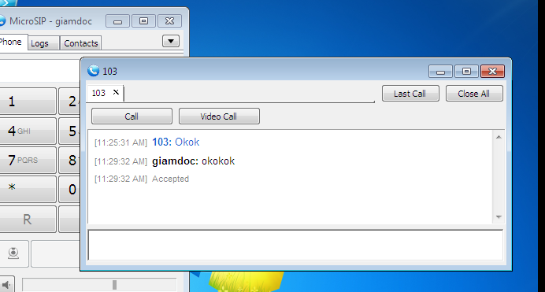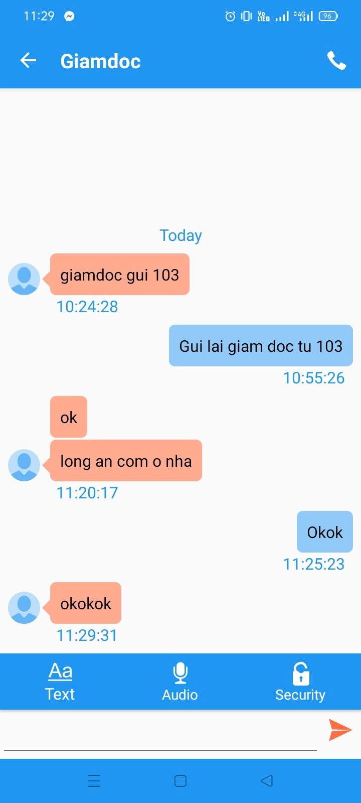 | App Sipnetic trên điện thoại (`103`) nhận được tin nhắn POP-UP tức thì với đúng nội dung văn bản.                                                                                    | **ĐẠT (OK)** |
| **4** | **Chặn cuộc gọi (Blacklist)** | **Lượt 1**: Từ Giám đốc (`101`) gọi Nhân viên (`102` hoặc `103`).<br />**Lượt 2**: Từ Nhân viên (`102` hoặc `103`) gọi lại Giám đốc (`101`).<br />*(Trong video 1)*                                                        | **Lượt 1**: Gọi thành công, đàm thoại bình thường.<br />**Lượt 2**: Cuộc gọi bị **CHẶN** lập tức, nghe âm báo không dịch vụ (`ss-noservice`) và tự ngắt. | **ĐẠT (OK)** |
| **5** | **Gửi Gmail cuộc gọi nhỡ**   | Gọi số**`100`** (IVR) -> Bấm phím `1` chuyển sang Giám đốc (`101`). Máy `101` không nghe máy. Sau 20s tự chuyển sang Voicemail. Để lại lời nhắn rồi cúp máy.<br />*(Trong video 4)*                                                  | Asterisk tự động đóng gói file âm thanh`.wav` và gửi 1 Email báo cuộc gọi nhỡ đến Gmail đã cấu hình.                                                                               | **ĐẠT (OK)** |
| **6** | **Gọi Tổng đài (IVR)**       | Từ bất kỳ extension nào (`101`, `102`, `103`), bấm gọi số **`100`**.<br />*(Trong video 2)*                                                                                                                                                        | Nghe lời chào tự động: Phím`1` chuyển sang Giám đốc (`101`), Phím `2` chuyển sang Phòng KD (`102`).                                                                                | **ĐẠT (OK)** |

---

## KẾT LUẬN VÀ HƯỚNG PHÁT TRIỂN

### Kết luận

Đồ án đã xây dựng hoàn chỉnh hệ thống **Tổng đài VoIP Asterisk PBX** trên Ubuntu 22.04 LTS đáp ứng trọn vẹn 6 yêu cầu thực tế:

1. Triển khai thành công gọi nhóm Ring Group (Ext 600).
2. Kết nối đa nền tảng giữa máy ảo Windows 7 (Softphone MicroSIP) và Điện thoại di động thật (Sipnetic App).
3. Hỗ trợ truyền tin nhắn văn bản tức thời SIP Messaging.
4. Bảo mật và phân quyền linh hoạt qua Context Dialplan (Chặn cuộc gọi tới Giám đốc).
5. Tự động hóa gửi thông báo cuộc gọi nhỡ kèm file ghi âm qua Gmail/MSMTP.
6. Xây dựng hệ thống tương tác giọng nói tự động IVR (Ext 100).

### Hướng phát triển

* Đóng gói toàn bộ hệ thống VoIPPBX trên container Docker / Kubernetes để dễ dàng mở rộng theo chiều ngang (Scale out).
* Tích hợp WebRTC và FreePBX GUI để quản trị tổng đài trực quan trên giao diện Web.
* Áp dụng mã hóa TLS/SRTP toàn bộ luồng thoại để chống nghe lén trên hạ tầng Internet công cộng.
