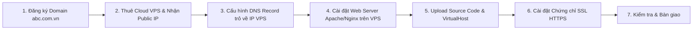

# TÀI LIỆU ÔN TẬP LÝ THUYẾT & THỰC HÀNH GIỮA KỲ - CUỐI KỲ
## MÔN: QUẢN TRỊ DỊCH VỤ MẠNG (IUH)

---

# CÂU 1: CÁC DỊCH VỤ MẠNG CỐT LÕI (DHCP, DNS, SAMBA, NFS, FTP, WEB)

## 1. Bảng tổng hợp giải pháp & nguyên lý hoạt động 6 dịch vụ cốt lõi

| Dịch vụ | Tên viết tắt & Port | Vai trò & Giải pháp trong hệ thống | Nguyên lý hoạt động chi tiết |
| :--- | :--- | :--- | :--- |
| **DHCP** | Dynamic Host Configuration Protocol<br/>**Port: UDP 67 (Server), UDP 68 (Client)** | Tự động hóa việc cấp phát địa chỉ IP, Subnet Mask, Gateway, DNS cho máy trạm. Tránh trùng lặp IP và tiết kiệm công sức quản trị. | Hoạt động theo mô hình Client - Server qua **quy trình 4 bước D-O-R-A**: Discover (Broadcast) $\rightarrow$ Offer (Unicast/Broadcast) $\rightarrow$ Request (Broadcast) $\rightarrow$ Acknowledge (Unicast). |
| **DNS** | Domain Name System<br/>**Port: UDP/TCP 53** | Phân giải giữa tên miền dễ nhớ (Domain) và địa chỉ IP nhị phân. Giúp người dùng truy cập dịch vụ mạng mà không cần nhớ IP. | Truy vấn phân cấp từ Root DNS Server (.) $\rightarrow$ TLD DNS Server (.vn, .com) $\rightarrow$ Authoritative Name Server. Sử dụng bộ nhớ đệm (Cache) và hỗ trợ phân giải xuôi (Forward: Tên $\rightarrow$ IP qua bản ghi A) và phân giải ngược (Reverse: IP $\rightarrow$ Tên qua bản ghi PTR). |
| **SAMBA** | SMB / CIFS<br/>**Port: TCP 445, TCP 139, UDP 137/138** | Chia sẻ file và máy in tương thích đa nền tảng giữa Linux và Windows trong mạng nội bộ công ty. | Dựa trên giao thức Server Message Block (SMB/CIFS). Server thiết lập quyền truy cập (read/write, valid users, public) và xác thực người dùng thông qua cơ sở dữ liệu `smbpasswd`. Hỗ trợ phân quyền cấp thư mục chi tiết. |
| **NFS** | Network File System<br/>**Port: TCP/UDP 2049, RPC port 111** | Chia sẻ thư mục tốc độ cao giữa các máy chủ Linux/Unix với nhau (chia sẻ file lưu trữ cho Web cluster, Database, Backup). | Hoạt động theo kiến trúc RPC (Remote Procedure Call). Phía Server khai báo thư mục chia sẻ trong `/etc/exports` kèm quyền và IP client được phép. Phía Client mount thư mục chia sẻ từ xa vào một thư mục cục bộ của mình và thao tác như ổ đĩa nội bộ. |
| **FTP** | File Transfer Protocol<br/>**Port: TCP 21 (Command), TCP 20 (Data Active)** | Truyền tải và trao đổi tập tin dung lượng lớn giữa Client và Server qua Internet hoặc mạng nội bộ. | Sử dụng **2 kết nối TCP riêng biệt**: Kênh điều khiển (Control connection - Port 21) để gửi lệnh/xác thực và Kênh truyền dữ liệu (Data connection) để truyền tải file. Hoạt động theo 2 chế độ: **Active Mode** (Server chủ động kết nối vào Client) và **Passive Mode** (Client chủ động kết nối vào Server - tối ưu cho mạng có tường lửa/NAT). |
| **WEB** | World Wide Web (HTTP/HTTPS)<br/>**Port: TCP 80 (HTTP), TCP 443 (HTTPS)** | Cung cấp trang tin tức, ứng dụng, website quảng bá thương hiệu và bán hàng của doanh nghiệp cho khách hàng trên Internet. | Hoạt động theo kiến trúc Request - Response của giao thức HTTP/HTTPS. Client (trình duyệt) gửi HTTP Request (GET, POST, HEAD...) tới Web Server (Apache/Nginx). Server xử lý mã nguồn (HTML, PHP, Node.js...) và trả về HTTP Response kèm mã trạng thái (200 OK, 301 Redirect, 404 Not Found, 500 Error). |

---

# CÂU 2: BÀI TOÁN XÂY DỰNG WEB SERVER CHO CÔNG TY ABC & HỆ THỐNG EMAIL

## 1. Đưa ra các giải pháp Web Server và lựa chọn giải pháp phù hợp

### a. So sánh các giải pháp Web Server:

| Giải pháp | Đặc điểm kiến trúc | Ưu điểm | Nhược điểm | Đánh giá độ phù hợp |
| :--- | :--- | :--- | :--- | :--- |
| **Tự dựng Server tại công ty (On-premise)** | Mua máy chủ vật lý đặt tại văn phòng công ty, thuê đường truyền leased-line riêng. | - Toàn quyền kiểm soát phần cứng và bảo mật nội bộ. | - Chi phí đầu tư ban đầu cực lớn.<br/>- Đòi hỏi phòng máy lạnh chuẩn, nguồn điện dự phòng UPS/máy phát điện.<br/>- Bắt buộc phải có đội ngũ IT trực 24/7. | **Không phù hợp** với công ty quy mô 200 người chỉ có nhu cầu quảng bá thương hiệu. |
| **Thuê máy chủ riêng (Dedicated Server)** | Thuê nguyên 1 máy chủ vật lý riêng biệt đặt tại Data Center chuyên nghiệp (Viettel, VNPT, FPT). | - Hiệu năng xử lý cực mạnh, băng thông lớn, tài nguyên độc lập 100%. | - Chi phí thuê hàng tháng cao.<br/>- Lãng phí tài nguyên nếu chỉ chạy website giới thiệu tĩnh. | **Chưa cần thiết** cho giai đoạn hiện tại, chỉ phù hợp cho sàn thương mại điện tử lớn. |
| **Thuê máy chủ ảo (Cloud VPS / Cloud Server)** | Thuê máy chủ ảo hóa trên hạ tầng điện toán đám mây với IP tĩnh riêng và toàn quyền Root. | - **Chi phí cực kỳ hợp lý**, linh hoạt nâng cấp RAM/CPU khi lượng truy cập tăng.<br/>- Hoạt động ổn định 99.9%, có Data Center bảo vệ điện, mạng và chống DDoS.<br/>- Toàn quyền cài đặt hệ điều hành (Ubuntu/CentOS), Web server (Apache/Nginx) và cấu hình bảo mật. | - Đòi hỏi người quản trị có kiến thức cơ bản về quản trị hệ điều hành Linux và an toàn mạng. | ⭐ **GIẢI PHÁP TỐI ƯU NHẤT CHO CÔNG TY ABC** |
| **Thuê Shared Hosting** | Nhiều website dùng chung 1 máy chủ vật lý và chung 1 địa chỉ IP. | - Chi phí rất rẻ, dễ dùng qua bảng điều khiển cPanel. | - Bị giới hạn cấu hình chuyên sâu, dễ bị ảnh hưởng nghẽn khi web khác trên cùng server bị tấn công. | Không đảm bảo độ uy tín cho thương hiệu doanh nghiệp. |

> **KẾT LUẬN CỦA BỘ PHẬN IT:**  
> **Chọn giải pháp Thuê Cloud VPS (Virtual Private Server)** vì:
> 1. Đáp ứng hoàn hảo nhu cầu quảng bá thương hiệu `abc.com.vn` với độ ổn định 24/7.
> 2. Chi phí đầu tư và vận hành tối ưu nhất cho doanh nghiệp 200 nhân sự.
> 3. Được cấp IP tĩnh công cộng (Public IP) riêng biệt, dễ dàng cấu hình bản ghi DNS và chứng chỉ số SSL.
> 4. Dễ dàng sao lưu (Backup snapshot) và mở rộng tài nguyên khi công ty phát triển.

---

### b. Các bước triển khai đưa Website ra ngoài Internet



1. **Bước 1 - Đăng ký tên miền:** Đăng ký tên miền `abc.com.vn` qua nhà đăng ký tên miền hợp pháp (VNNIC / Mắt Bão / PA Việt Nam).
2. **Bước 2 - Chuẩn bị hạ tầng máy chủ:** Thuê 1 gói Cloud VPS chạy hệ điều hành Ubuntu 22.04 LTS, nhận địa chỉ IP Public tĩnh (ví dụ: `203.162.x.x`).
3. **Bước 3 - Cấu hình bản ghi DNS:** Vào trang quản lý tên miền, tạo các bản ghi DNS:
   - Bản ghi **A**: Tên `@` $\rightarrow$ Trỏ về IP Public của VPS.
   - Bản ghi **CNAME**: Tên `www` $\rightarrow$ Trỏ về `abc.com.vn`.
4. **Bước 4 - Cài đặt Web Server:** Cài đặt Apache2 hoặc Nginx và PHP/Database trên Ubuntu VPS:
   ```bash
   sudo apt update && sudo apt install -y apache2
   ```
5. **Bước 5 - Cấu hình VirtualHost & Đưa mã nguồn lên:**
   - Đưa bộ mã nguồn website đã thiết kế vào thư mục `/var/www/abc.com.vn/`.
   - Tạo file cấu hình VirtualHost `/etc/apache2/sites-available/abc.com.vn.conf`:
     ```apache
     <VirtualHost *:80>
         ServerName abc.com.vn
         ServerAlias www.abc.com.vn
         DocumentRoot /var/www/abc.com.vn
         ErrorLog ${APACHE_LOG_DIR}/abc_error.log
         CustomLog ${APACHE_LOG_DIR}/abc_access.log combined
     </VirtualHost>
     ```
   - Kích hoạt site: `sudo a2ensite abc.com.vn.conf && sudo systemctl reload apache2`.
6. **Bước 6 - Cài đặt chứng chỉ số SSL (HTTPS):** Sử dụng Let's Encrypt (Certbot) miễn phí để bảo mật:
   ```bash
   sudo apt install -y certbot python3-certbot-apache
   sudo certbot --apache -d abc.com.vn -d www.abc.com.vn
   ```
7. **Bước 7 - Cấu hình tường lửa (Firewall):** Mở cổng 80 (HTTP) và cổng 443 (HTTPS) trên tường lửa VPS (`sudo ufw allow 80/tcp && sudo ufw allow 443/tcp`).

---

### c. Sơ đồ tổng quan hệ thống thư điện tử (Mail System)

```text
               +-------------------------------------------------------------+
               |                  INTERNET / DNS SERVER                      |
               |             (Phân giải bản ghi MX và A)                     |
               +------------------------------+------------------------------+
                                              ^
                                              | Gửi truy vấn MX
   +-----------------------+                  v                  +-----------------------+
   |  Người gửi (Sender)   |           [ SMTP Port 25 ]          | Người nhận (Receiver) |
   |  User: alice@abc.com  |        -------------------->        | User: bob@gmail.com   |
   +-----------+-----------+                                     +-----------^-----------+
               |                                                             |
   1. Gửi thư  | MUA (Outlook,                                   6. Đọc thư  | MUA (Webmail,
      qua SMTP | Thunderbird)                                    qua IMAP/POP| Thunderbird)
               v                                                             |
   +-----------+-----------+                                     +-----------+-----------+
   |   MTA Gửi (Mail Exchanger)|    2. Chuyển tiếp SMTP (Port 25)    |       MDA / Mailbox   |
   |   (Postfix / Exim)    | ==================================> |  (Dovecot / Maildir)  |
   |   abc.com.vn Mail Server|                                   |  gmail.com Mail Server|
   +-----------------------+                                     +-----------------------+
```

#### Giải thích các thành phần chính trong hệ thống Email:
1. **MUA (Mail User Agent):** Ứng dụng người dùng dùng để soạn thảo, gửi và đọc thư điện tử (ví dụ: Microsoft Outlook, Mozilla Thunderbird, Gmail Webmail, Apple Mail).
2. **MTA (Mail Transfer Agent):** Máy chủ phần mềm chịu trách nhiệm định tuyến, chuyển tiếp và phân phát email giữa các máy chủ mail trên Internet thông qua giao thức **SMTP (Simple Mail Transfer Protocol - Port 25/587)** (ví dụ: Postfix, Sendmail, Exim, Microsoft Exchange).
3. **MDA (Mail Delivery Agent):** Thành phần nhận thư từ MTA và lưu trữ thư an toàn vào hộp thư cá nhân (Mailbox/Maildir) của người nhận trên ổ cứng (ví dụ: Dovecot, Procmail).
4. **Mailbox (Hộp thư người dùng):** Nơi lưu trữ vật lý các email của người dùng trên máy chủ (theo định dạng mbox hoặc Maildir).
5. **DNS Server với bản ghi MX (Mail Exchanger Record):** Đóng vai trò chỉ đường, giúp máy chủ gửi thư biết chính xác địa chỉ IP của máy chủ nhận thư cho từng tên miền cụ thể.
6. **Cơ chế xác thực bảo mật mail (SPF, DKIM, DMARC):**
   - **SPF (Sender Policy Framework):** Khai báo IP nào được phép gửi mail nhân danh tên miền công ty.
   - **DKIM (DomainKeys Identified Mail):** Ký chữ ký số vào header email để chống giả mạo nội dung.
   - **DMARC:** Chính sách hướng dẫn máy chủ nhận xử lý email không đạt chuẩn SPF/DKIM (Reject hoặc Quarantine).

---

### d. So sánh chi tiết cách thức hoạt động của giao thức POP3 và IMAP

| Tiêu chí so sánh | Giao thức POP3 (Post Office Protocol v3) | Giao thức IMAP (Internet Message Access Protocol) |
| :--- | :--- | :--- |
| **Cơ chế hoạt động cốt lõi** | **Tải về và Xóa (Store and Forward):** MUA kết nối lên server, tải toàn bộ email về ổ cứng máy tính cá nhân, sau đó mặc định xóa email đó trên máy chủ. | **Đồng bộ hai chiều trực tiếp (Two-way Sync):** Email luôn luôn được lưu trữ tập trung trên máy chủ. MUA chỉ tải tiêu đề/nội dung để hiển thị và đồng bộ trạng thái trực tiếp với server. |
| **Hỗ trợ đa thiết bị** | **Rất kém:** Nếu đã đọc thư trên máy tính, mở điện thoại lên sẽ không thấy thư đó nữa (vì thư đã bị tải về và xóa khỏi server). | **Hoàn hảo:** Xem thư đồng bộ trên mọi thiết bị (Laptop, Điện thoại, Tablet, Webmail). Trạng thái đọc/chưa đọc, thư đã gửi, thư mục tạo mới đều đồng nhất trên tất cả thiết bị. |
| **Quản lý thư mục (Folders)** | Chỉ hỗ trợ duy nhất một hộp thư đến (Inbox) cục bộ trên máy trạm. | Hỗ trợ tạo, đổi tên, sắp xếp các thư mục con trực tiếp trên máy chủ. |
| **Dung lượng lưu trữ trên Server** | Chiếm rất ít dung lượng trên máy chủ (vì thư liên tục được tải về máy trạm). | Đòi hỏi máy chủ Mail phải có dung lượng ổ cứng lớn vì thư lưu trữ lâu dài trên server. |
| **Tốc độ & Truy cập Offline** | Sau khi tải xong, có thể xem lại toàn bộ nội dung và file đính kèm khi không có mạng Internet. | Chỉ xem được thư đã cache, cần kết nối mạng để xem các email cũ hoặc tải file đính kèm lớn. |
| **Cổng kết nối (Ports)** | - Cổng chuẩn: **TCP 110**<br/>- Cổng bảo mật SSL/TLS (POP3S): **TCP 995** | - Cổng chuẩn: **TCP 143**<br/>- Cổng bảo mật SSL/TLS (IMAPS): **TCP 993** |
| **Khuyên dùng khi nào?** | Phù hợp cho cá nhân dùng cố định 1 máy tính duy nhất, máy chủ dung lượng mail quá thấp. | **Khuyên dùng cho 100% doanh nghiệp hiện đại** khi nhân viên làm việc trên nhiều thiết bị. |

---

# CÂU 3: BÀI TOÁN TRIỂN KHAI DHCP CHO HỆ THỐNG MẠNG CÔNG TY ABC (DHCP RELAY AGENT)

## 1. Mô tả bài toán & Thiết kế sơ đồ mạng

### a. Hiện trạng công ty ABC:
- Tổng nhân sự: 200 người làm việc trong 3 phòng ban (Kế toán, Nhân sự, Đào tạo).
- Thiết bị: 2 máy chủ (Server), 200 máy bàn (PC), 15 laptop, 20 máy in, 2 máy photocopy/scan...
- **Mạng LAN 1:** Dải mạng `172.16.10.0/24`.
  - Dải dành riêng cho Server và Giám đốc (IP tĩnh): `172.16.10.2` đến `172.16.10.30`.
  - Dải cấp phát động cho nhân viên: `172.16.10.31` đến `172.16.10.254` (hoặc `172.16.10.1` đến `172.16.10.100` theo gợi ý đề thi).
- **Mạng LAN 2:** Mở rộng thêm chi nhánh/phòng ban với dải mạng `10.10.10.0/24`.
- **Vấn đề kỹ thuật:** LAN 1 và LAN 2 được nối qua Router. Do router chặn các gói tin quảng bá (Broadcast), máy tính ở LAN 2 **không nhận được IP** từ DHCP Server đặt tại LAN 1.

---

### b. Sơ đồ mô hình mạng chuẩn (Topology Diagram)

```text
 +---------------------------------------------------------------------------------------------------------+
 |                                      SƠ ĐỒ HỆ THỐNG MẠNG CÔNG TY ABC                                    |
 +---------------------------------------------------------------------------------------------------------+

       [ LAN 1: 172.16.10.0/24 ]                                                [ LAN 2: 10.10.10.0/24 ]
 
   +-------------------------------+                                        +-------------------------------+
   | Client 1 (Win 7 - Máy 1)      |                                        | Client 2 (Win 7 - Máy 2)      |
   | IP: Nhận tự động từ Scope 1   |                                        | IP: Nhận tự động từ Scope 2   |
   | (172.16.10.x / Gateway .1)    |                                        | (10.10.10.x / Gateway .1)     |
   +---------------+---------------+                                        +---------------+---------------+
                   |                                                                        |
                   | (VMnet2)                                                               | (VMnet3)
                   v                                                                        v
   +-------------------------------+                                        +-------------------------------+
   |        SERVER 1 (Ubuntu 1)    |                                        |        SERVER 2 (Ubuntu 2)    |
   | - Đóng vai trò: Router 1      |        [ ĐƯỜNG NỐI LIÊN ROUTER ]       | - Đóng vai trò: Router 2      |
   |   và DHCP SERVER CHÍNH        |         (Mạng: 192.168.x.0/24)         |   và DHCP RELAY AGENT         |
   |                               |                                        |                               |
   | NIC 1 (ens37): 172.16.10.1/24 |  (VMnet1)                    (VMnet1)  | NIC 1 (ens37): 10.10.10.1/24  |
   | NIC 2 (ens38): 192.168.x.1/24 +----------------------------------------+ NIC 2 (ens38): 192.168.x.2/24 |
   +-------------------------------+                                        +-------------------------------+
```

---

## 2. Phân tích giải pháp & Nguyên lý hoạt động của DHCP & DHCP Relay Agent

### a. Vì sao DHCP Server trên LAN 1 không cấp được IP cho LAN 2?
1. Khi máy trạm (Client) ở LAN 2 khởi động, nó chưa có địa chỉ IP nên bắt buộc phải phát gói tin xin IP là **DHCPDISCOVER** dưới dạng **Broadcast tầng 2 (MAC: `FF:FF:FF:FF:FF:FF`)** và **Broadcast tầng 3 (IP: `255.255.255.255`)**.
2. Theo nguyên lý căn bản của thiết bị định tuyến (Router): **Router không bao giờ chuyển tiếp gói tin Broadcast vượt qua các cổng của nó** (nhằm chia nhỏ Broadcast Domain, chống bão mạng Broadcast Storm).
3. Do đó, gói tin DHCPDISCOVER của Client LAN 2 bị Router chặn đứng ngay tại cổng kết nối, không thể chạm tới DHCP Server ở LAN 1.

---

### b. Giải pháp: Sử dụng DHCP Relay Agent (Tác nhân chuyển tiếp DHCP)
- Cấu hình dịch vụ **DHCP Relay Agent** ngay trên máy chủ **Server 2 (Router 2)** kết nối trực tiếp với LAN 2.
- DHCP Relay Agent đóng vai trò như một người phiên dịch trung gian (Proxy): Nó đón bắt gói tin Broadcast của Client LAN 2, biến đổi nó thành gói tin **Unicast**, chuyển tiếp qua đường mạng trung gian `192.168.x.0/24` đến thẳng địa chỉ IP của DHCP Server (`192.168.x.1`).
- Khi DHCP Server trả về kết quả, Relay Agent đón nhận và chuyển lại cho Client ở LAN 2.

---

### c. Nguyên lý 4 bước hoạt động của DHCP thường (Quy tắc D - O - R - A)

```text
    Client                                                              Server
      |                                                                   |
      | -------- 1. DHCPDISCOVER (Broadcast: 255.255.255.255:67) -------> |
      |                                                                   |
      | <------- 2. DHCPOFFER    (Unicast/Broadcast: Cấp IP mẫu) -------- |
      |                                                                   |
      | -------- 3. DHCPREQUEST  (Broadcast: Chấp nhận thuê IP) --------> |
      |                                                                   |
      | <------- 4. DHCPACK      (Unicast: Xác nhận hợp đồng thuê) ------ |
      v                                                                   v
```

1. **`D` - DHCPDISCOVER (Khám phá):**
   - Máy Client khởi động, chưa có IP, gửi gói tin Broadcast toàn mạng với địa chỉ nguồn `0.0.0.0:68` tới đích `255.255.255.255:67`. Gói tin mang theo địa chỉ MAC của Client để tìm kiếm máy chủ DHCP.
2. **`O` - DHCPOFFER (Đề nghị):**
   - Các DHCP Server trên mạng nhận được yêu cầu, kiểm tra quỹ IP còn rảnh. Server chọn ra 1 địa chỉ IP khả dụng, gắn kèm Subnet Mask, Default Gateway, DNS Server và thời gian thuê (Lease time) rồi gửi trả lại cho Client qua gói tin DHCPOFFER.
3. **`R` - DHCPREQUEST (Yêu cầu thuê):**
   - Máy Client có thể nhận được nhiều lời đề nghị từ nhiều Server, nhưng Client sẽ chọn lời đề nghị đầu tiên nhận được. Client phát gói tin Broadcast DHCPREQUEST thông báo: *"Tôi chính thức chọn thuê IP này của Server X!"*.
   - Gói này gửi broadcast để các DHCP Server khác biết rằng đề nghị của họ bị từ chối và thu hồi lại IP đó về kho cấp phát.
4. **`A` - DHCPACK (Xác nhận):**
   - Server X gửi gói tin DHCPACK chốt hợp đồng thuê, chính thức cấp quyền cho Client sử dụng IP đó cùng toàn bộ thông số Gateway, DNS. Lúc này Client hoàn tất cấu hình card mạng.

---

### d. Nguyên lý hoạt động của DHCP Relay Agent (Cấp IP qua Router)

```text
 Client (LAN 2)                  Router 2 (Relay Agent)             Server 1 (DHCP Server LAN 1)
       |                                   |                                     |
       | -- 1. DHCPDISCOVER (Broadcast) -> |                                     |
       |    Src: 0.0.0.0:68                |                                     |
       |    Dst: 255.255.255.255:67        |                                     |
       |                                   | -- 2. Chuyển tiếp Unicast (UDP 67) ->|
       |                                   |    Src: 192.168.x.2 (Giaddr: 10.10.10.1)
       |                                   |    Dst: 192.168.x.1:67               |
       |                                   |                                     |
       |                                   | <-- 3. DHCPOFFER (Unicast) -------- |
       |                                   |    Server chọn Scope 2 theo Giaddr  |
       | <-- 4. DHCPOFFER (Broadcast) ---- |                                     |
       |                                   |                                     |
       | -- 5. DHCPREQUEST (Broadcast) --> |                                     |
       |                                   | -- 6. Chuyển tiếp Unicast --------> |
       |                                   |                                     |
       |                                   | <-- 7. DHCPACK (Unicast) ---------- |
       | <-- 8. DHCPACK (Broadcast) ------ |                                     |
```

- **Điểm mấu chốt kỹ thuật (Trường `GIADDR` - Gateway IP Address):**
  - Khi DHCP Relay Agent đón gói Broadcast từ LAN 2, nó sẽ điền địa chỉ IP cổng mạng LAN 2 của chính nó (`10.10.10.1`) vào trường **`giaddr`** trong phần thân gói tin DHCP.
  - Khi DHCP Server (Server 1) nhận được gói tin, nó đọc trường `giaddr = 10.10.10.1`. Ngay lập tức Server hiểu rằng: *"Client này thuộc subnet `10.10.10.0/24`, ta phải trích IP từ **Scope 2** để cấp cho nó!"*.
  - Nhờ cơ chế này, DHCP Server biết chính xác cần cấp IP thuộc dải nào cho Client ở các chi nhánh từ xa.

---

## 3. Hướng dẫn từng bước cài đặt và cấu hình thực hành

### Cách 1: Triển khai trên Linux (Ubuntu 22.04 LTS Server)

#### BƯỚC 1: Cấu hình địa chỉ IP tĩnh và Bật Routing trên Server 1 & Server 2

- **Trên Server 1 (`/etc/netplan/01-netcfg.yaml`):**
  ```yaml
  network:
    version: 2
    renderer: networkd
    ethernets:
      ens37:  # Nối LAN 1 (VMnet2)
        addresses: [172.16.10.1/24]
      ens38:  # Nối Link liên router (VMnet1)
        addresses: [192.168.10.1/24]
        routes:
          - to: 10.10.10.0/24
            via: 192.168.10.2
  ```
  Kích hoạt: `sudo netplan apply`  
  Bật chuyển tiếp gói tin (Router):
  ```bash
  sudo sysctl -w net.ipv4.ip_forward=1
  echo "net.ipv4.ip_forward=1" | sudo tee -a /etc/sysctl.conf
  ```

- **Trên Server 2 (`/etc/netplan/01-netcfg.yaml`):**
  ```yaml
  network:
    version: 2
    renderer: networkd
    ethernets:
      ens37:  # Nối LAN 2 (VMnet3)
        addresses: [10.10.10.1/24]
      ens38:  # Nối Link liên router (VMnet1)
        addresses: [192.168.10.2/24]
        routes:
          - to: 172.16.10.0/24
            via: 192.168.10.1
  ```
  Kích hoạt: `sudo netplan apply`  
  Bật chuyển tiếp gói tin (Router):
  ```bash
  sudo sysctl -w net.ipv4.ip_forward=1
  echo "net.ipv4.ip_forward=1" | sudo tee -a /etc/sysctl.conf
  ```

---

#### BƯỚC 2: Cài đặt và cấu hình DHCP Server trên Server 1
1. Cài đặt gói:
   ```bash
   sudo apt update && sudo apt install -y isc-dhcp-server
   ```
2. Khai báo card mạng lắng nghe trong `/etc/default/isc-dhcp-server`:
   ```bash
   INTERFACESv4="ens37 ens38"
   ```
3. Cấu hình 2 dải Scope trong `/etc/dhcp/dhcpd.conf`:
   ```text
   # Cấu hình thời gian thuê mặc định
   default-lease-time 600;
   max-lease-time 7200;
   authoritative;

   # --- SCOPE 1: Cấp cho mạng LAN 1 (Cấp trực tiếp) ---
   subnet 172.16.10.0 netmask 255.255.255.0 {
       range 172.16.10.31 172.16.10.100;
       option routers 172.16.10.1;
       option subnet-mask 255.255.255.0;
       option domain-name-servers 8.8.8.8, 1.1.1.1;
   }

   # Khai báo subnet đường truyền liên router (bắt buộc)
   subnet 192.168.10.0 netmask 255.255.255.0 {
   }

   # --- SCOPE 2: Cấp cho mạng LAN 2 (Cấp qua DHCP Relay) ---
   subnet 10.10.10.0 netmask 255.255.255.0 {
       range 10.10.10.2 10.10.10.100;
       option routers 10.10.10.1;
       option subnet-mask 255.255.255.0;
       option domain-name-servers 8.8.8.8, 1.1.1.1;
   }
   ```
4. Kiểm tra cú pháp và khởi động dịch vụ:
   ```bash
   sudo dhcpd -t -cf /etc/dhcp/dhcpd.conf
   sudo systemctl restart isc-dhcp-server
   sudo systemctl status isc-dhcp-server
   ```

---

#### BƯỚC 3: Cài đặt và cấu hình DHCP Relay Agent trên Server 2
1. Cài đặt gói `isc-dhcp-relay`:
   ```bash
   sudo apt update && sudo apt install -y isc-dhcp-relay
   ```
2. Cấu hình file `/etc/default/isc-dhcp-relay`:
   ```text
   # Địa chỉ IP của máy chủ DHCP Server chính (Server 1)
   SERVERS="192.168.10.1"

   # Các card mạng tham gia trung chuyển (Cổng nhận từ client và cổng gửi sang server)
   INTERFACES="ens37 ens38"

   OPTIONS=""
   ```
3. Khởi động dịch vụ Relay:
   ```bash
   sudo systemctl restart isc-dhcp-relay
   sudo systemctl status isc-dhcp-relay
   ```

---

#### BƯỚC 4: Kiểm tra trên máy trạm Windows 7 Client 1 & Client 2
1. Trên cả 2 máy Win 7, mở **cmd** chạy quyền Administrator:
   ```cmd
   ipconfig /release
   ipconfig /renew
   ipconfig /all
   ```
2. **Kết quả mong đợi:**
   - **Win 7 Máy 1 (LAN 1):** Nhận IP dạng `172.16.10.x`, Default Gateway là `172.16.10.1`.
   - **Win 7 Máy 2 (LAN 2):** Nhận IP dạng `10.10.10.x`, Default Gateway là `10.10.10.1`.
3. Kiểm tra thông tuyến:
   - Từ Win 7 Máy 1 gõ: `ping 10.10.10.x` (ping máy 2) $\rightarrow$ **Reply from... (Thành công 100%)**!

---

### Cách 2: Triển khai trên Windows Server (Giao diện đồ họa GUI)

1. **Trên Server 1 (DHCP Server):**
   - Mở **Server Manager** $\rightarrow$ Chọn **Add Roles and Features** $\rightarrow$ Tích chọn **DHCP Server** $\rightarrow$ Bấm Next để cài đặt.
   - Mở công cụ **DHCP Management**:
     - Chuột phải vào **IPv4** $\rightarrow$ Chọn **New Scope...**
     - **Scope 1 (LAN 1):** Tên `LAN_1`, Dải IP `172.16.10.31` đến `172.16.10.100`, Subnet mask `255.255.255.0`. Cấu hình Router (Option 003) là `172.16.10.1`.
     - **Scope 2 (LAN 2):** Tên `LAN_2`, Dải IP `10.10.10.2` đến `10.10.10.100`, Subnet mask `255.255.255.0`. Cấu hình Router (Option 003) là `10.10.10.1`.
     - Kích hoạt cả 2 Scope (**Activate**).

2. **Trên Server 2 (DHCP Relay Agent):**
   - Mở **Server Manager** $\rightarrow$ Cài đặt Role **Network Policy and Access Services** (hoặc **Routing and Remote Access**).
   - Mở công cụ **Routing and Remote Access**:
     - Mở rộng nhánh **IPv4** $\rightarrow$ Chuột phải vào **General** $\rightarrow$ Chọn **New Routing Protocol...**
     - Chọn **DHCP Relay Agent** $\rightarrow$ Bấm OK.
     - Chuột phải vào **DHCP Relay Agent** $\rightarrow$ Chọn **Properties** $\rightarrow$ Nhập địa chỉ IP của DHCP Server: `192.168.10.1` $\rightarrow$ Bấm Add $\rightarrow$ OK.
     - Chuột phải vào **DHCP Relay Agent** $\rightarrow$ Chọn **New Interface...** $\rightarrow$ Chọn card mạng nối LAN 2 (`ens37` / Local Area Connection 2) $\rightarrow$ Bấm OK.

---

# CÂU 4: DỊCH VỤ VOIP (VOICE OVER IP)

## 1. Cơ chế hoạt động của VoIP
VoIP truyền tải tiếng nói thông qua mạng chuyển mạch gói IP thay cho mạng điện thoại truyền thống (PSTN). Quá trình diễn ra qua 2 giai đoạn độc lập:
1. **Giai đoạn báo hiệu và thiết lập cuộc gọi (Signaling):**
   - Sử dụng giao thức **SIP (Session Initiation Protocol - RFC 3261)** qua cổng **UDP/TCP 5060**.
   - Các bản tin SIP chính:
     - `REGISTER`: Thiết bị đăng ký số máy nhánh (Extension) lên tổng đài PBX.
     - `INVITE`: Yêu cầu bắt đầu cuộc gọi, gửi kèm thông tin đàm phán âm thanh (SDP).
     - `100 Trying`: Tổng đài báo đang xử lý tìm máy đích.
     - `180 Ringing`: Máy đích đang đổ chuông.
     - `200 OK`: Máy đích đã nhấc máy chấp nhận cuộc gọi.
     - `ACK`: Xác nhận hoàn tất kết nối đàm thoại.
     - `BYE`: Một bên cúp máy kết thúc cuộc gọi.
2. **Giai đoạn truyền luồng âm thanh thực tế (Media Transfer):**
   - Sử dụng giao thức **RTP (Real-time Transport Protocol)** và **RTCP (RTP Control Protocol)** qua các dải cổng động **UDP 10000 - 20000**.
   - Tiếng nói từ micro được số hóa, nén bằng các bộ codec âm thanh (**G.711 PCMU/PCMA**, GSM, G.722, Opus) rồi đóng gói thành các gói tin UDP truyền trực tiếp qua mạng.

---

## 2. Triển khai VoIP với Asterisk PBX
- Cấu hình tài khoản SIP trong `/etc/asterisk/pjsip.conf`:
  ```ini
  [endpoint-template](!)
  type=endpoint
  context=internal-context
  disallow=all
  allow=ulaw,alaw
  direct_media=no
  rewrite_contact=yes
  rtp_symmetric=yes

  [101](endpoint-template)
  auth=auth-101
  aors=101
  [auth-101](auth-template)
  username=101
  password=123456
  [101](aor-template)
  ```
- Cấu hình quy tắc gọi (Dialplan) trong `/etc/asterisk/extensions.conf`:
  ```ini
  [internal-context]
  ; Gọi trực tiếp máy nhánh 101, đổ chuông trong 20 giây
  exten => 101,1,Dial(PJSIP/101,20)
  same => n,Voicemail(101@default,u)
  same => n,Hangup()
  ```

---

## 3. Quản trị các tính năng nâng cao trong VoIP
1. **Gọi nhóm (Ring Group - Ext 600):** Khi gọi tới 600, tất cả máy nhánh trong phòng ban cùng reo chuông, ai nhấc máy trước sẽ tiếp nhận cuộc gọi:
   ```ini
   exten => 600,1,Dial(PJSIP/101&PJSIP/102&PJSIP/103,30)
   same => n,Hangup()
   ```
2. **Hộp thư thoại (Voicemail) & Gửi thông báo qua Email:** Khi máy bận hoặc không trả lời, chuyển vào hộp thư thoại ghi âm lời nhắn và dùng `msmtp` gửi file `.wav` về email người nhận.
3. **Tổng đài trả lời tự động (IVR - Interactive Voice Response - Ext 100):**
   ```ini
   exten => 100,1,Answer()
   same => n,Background(demo-congrats)  ; Phát lời chào hướng dẫn
   same => n,WaitExten(10)
   exten => 1,1,Dial(PJSIP/101,20)      ; Bấm phím 1 gặp Giám đốc
   exten => 2,1,Dial(PJSIP/102,20)      ; Bấm phím 2 gặp Kinh doanh
   ```
4. **Chặn cuộc gọi (Blacklist):** Chặn các số không được phép gọi tới lãnh đạo:
   ```ini
   exten => 101,1,Playback(ss-noservice)
   same => n,Hangup(17)
   ```

---

# CÂU 5: DỊCH VỤ BẢO MẬT WEB HTTPS & CHỨNG CHỈ SỐ SSL/TLS

## 1. Cơ chế hoạt động của HTTPS
HTTPS (Hypertext Transfer Protocol Secure) là giao thức HTTP chạy trên nền tảng mã hóa bảo mật của **SSL/TLS (cổng TCP 443)**.
- **3 mục tiêu bảo mật cốt lõi:**
  1. **Mã hóa (Encryption):** Bảo mật dữ liệu truyền đi, chống nghe lén (Sniffing).
  2. **Toàn vẹn (Integrity):** Đảm bảo dữ liệu không bị sửa đổi trên đường truyền qua mã kiểm tra băm HMAC.
  3. **Xác thực (Authentication):** Chứng minh danh tính thật của Website, chống tấn công giả mạo (Phishing/Man-In-The-Middle).

---

## 2. Quy trình bắt tay TLS Handshake (4 bước)

```text
    Client (Trình duyệt)                                    Server (Web Server)
            |                                                        |
            | -------- 1. ClientHello (TLS Version, Ciphers) ------> |
            |                                                        |
            | <------- 2. ServerHello, Certificate, Public Key ----- |
            |                                                        |
   [Kiểm tra tính hợp lệ                                             |
    của chứng chỉ số &                                               |
    tạo Pre-master Secret]                                           |
            |                                                        |
            | -------- 3. Gửi Session Key (Mã hóa bằng Public Key)-> |
            |                                                        |
            | <------- 4. Finished (Chuyển sang mã hóa đối xứng) --- |
            v                                                        v
      [Bắt đầu truyền tải dữ liệu HTTPS an toàn bằng khóa đối xứng]
```

1. **ClientHello:** Trình duyệt gửi phiên bản TLS hỗ trợ, danh sách thuật toán mã hóa (Cipher Suites) và một chuỗi số ngẫu nhiên.
2. **ServerHello & Certificate:** Server chọn thuật toán mã hóa phù hợp nhất, gửi chứng chỉ số số **SSL Certificate (chứa Public Key của Server)** về cho Client.
3. **Key Exchange:** Trình duyệt xác thực chứng chỉ với các Root CA tin cậy. Nếu hợp lệ, trình duyệt tạo ra một khóa bí mật phiên (**Pre-Master Secret**), mã hóa khóa này bằng **Public Key của Server** rồi gửi về cho Server.
4. **Finished:** Server dùng **Private Key của mình** giải mã lấy khóa phiên. Từ thời điểm này, cả 2 bên giao tiếp với nhau bằng thuật toán mã hóa đối xứng (AES) tốc độ cao.

---

## 3. Quy trình triển khai chứng chỉ số và cấu hình HTTPS trên Ubuntu (Apache2)

1. **Bật module SSL trong Apache:**
   ```bash
   sudo a2enmod ssl
   sudo a2enmod rewrite
   ```
2. **Tạo chứng chỉ số tự ký (Self-Signed Certificate):**
   ```bash
   sudo openssl req -x509 -nodes -days 365 -newkey rsa:2048 \
     -keyout /etc/ssl/private/apache-selfsigned.key \
     -out /etc/ssl/certs/apache-selfsigned.crt \
     -subj "/C=VN/ST=TPHCM/L=GoVap/O=IUH/OU=CNTT/CN=abc.com.vn"
   ```
3. **Cấu hình VirtualHost HTTPS (`/etc/apache2/sites-available/default-ssl.conf`):**
   ```apache
   <IfModule mod_ssl.c>
   <VirtualHost _default_:443>
       ServerAdmin admin@abc.com.vn
       ServerName abc.com.vn
       DocumentRoot /var/www/html

       SSLEngine on
       SSLCertificateFile /etc/ssl/certs/apache-selfsigned.crt
       SSLCertificateKeyFile /etc/ssl/private/apache-selfsigned.key

       <FilesMatch "\.(cgi|shtml|phtml|php)$">
           SSLOptions +StdEnvVars
       </FilesMatch>
       BrowserMatch "MSIE [2-6]" nokeepalive ssl-unclean-shutdown downgrade-1.0
   </VirtualHost>
   </IfModule>
   ```
4. **Cấu hình tự động chuyển hướng HTTP (Cổng 80) sang HTTPS (Cổng 443):**
   Trong file `/etc/apache2/sites-available/000-default.conf`:
   ```apache
   <VirtualHost *:80>
       ServerName abc.com.vn
       Redirect permanent / https://abc.com.vn/
   </VirtualHost>
   ```
5. **Kích hoạt VirtualHost và khởi động lại dịch vụ:**
   ```bash
   sudo a2ensite default-ssl.conf
   sudo systemctl restart apache2
   ```

---

## 4. Bảng tra cứu cổng mạng (Port Cheat-sheet) cho phòng thi

| Dịch vụ mạng | Giao thức truyền tải (Layer 4) | Cổng chuẩn (Plaintext) | Cổng an toàn (SSL / TLS) |
| :--- | :---: | :---: | :---: |
| **DHCP** | UDP | **67** (Server) / **68** (Client) | - |
| **DNS** | UDP & TCP | **53** | **853** (DoT / DoH: 443) |
| **Web HTTP/HTTPS** | TCP | **80** | **443** |
| **FTP** | TCP | **21** (Lệnh) / **20** (Dữ liệu) | **990** (FTPS) |
| **Mail SMTP** | TCP | **25** (Server-to-Server) / **587** (Client) | **465** (SMTPS) |
| **Mail POP3** | TCP | **110** | **995** (POP3S) |
| **Mail IMAP** | TCP | **143** | **993** (IMAPS) |
| **Samba (SMB)** | TCP | **445**, **139** | Đã tích hợp mã hóa SMB3 |
| **NFS** | TCP & UDP | **2049** (NFS), **111** (RPCbind) | - |
| **VoIP SIP / RTP** | UDP / TCP | **5060** (SIP Báo hiệu) | **10000 - 20000** (RTP Âm thanh) |
| **SSH** | TCP | **22** | Mặc định mã hóa SSH2 |
