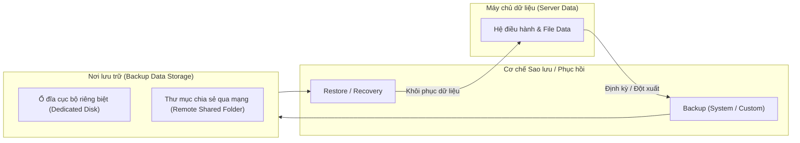
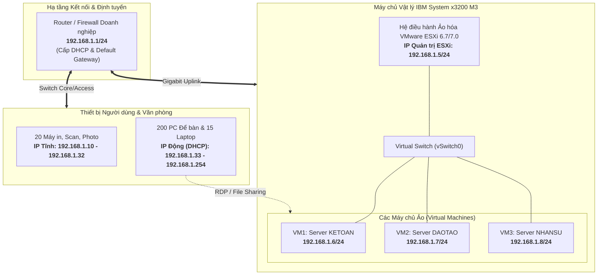
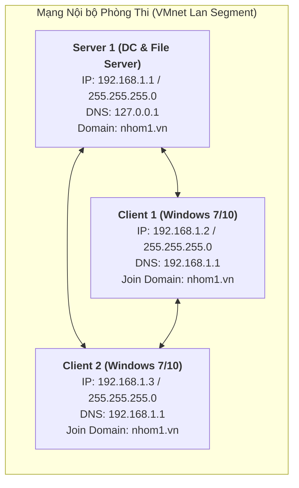

# CẨM NANG ÔN TẬP GIỮA KỲ & THỰC HÀNH MÔN QUẢN TRỊ VÀ BẢO TRÌ HỆ THỐNG (QTBTHT)
> **Tài liệu chuẩn hóa phục vụ ôn tập Lý thuyết & Cấu hình Thực hành 3 máy thi Giữa kỳ (IUH)**  
> **Nguồn tài liệu gốc:** `ÔN TẬP GK_CK QTBTHT.pdf`, `Nội dung ôn GK QTBTHT (author GVBM)`, `Đề minh họa KTTH QTBTHT DHTH18`.

---

# MỤC LỤC
1. [PHẦN 1: TOÀN BỘ LÝ THUYẾT ÔN TẬP CHUẨN TÀI LIỆU](#phần-1-toàn-bộ-lý-thuyết-ôn-tập-chuẩn-tài-liệu)
   - [Chủ đề 1: Quản trị Domain & Dịch vụ Active Directory](#chủ-đề-1-quản-trị-domain--dịch-vụ-active-directory)
   - [Chủ đề 2: Sao lưu & Phục hồi hệ thống (Backup & Restore)](#chủ-đề-2-sao-lưu--phục-hồi-hệ-thống-backup--restore)
   - [Chủ đề 3: File Server & Phân quyền bảo mật NTFS Permissions](#chủ-đề-3-file-server--phân-quyền-bảo-mật-ntfs-permissions)
   - [Chủ đề 4: Nguyên lý ảo hóa & Giải pháp ảo hóa máy chủ doanh nghiệp (Case Study Công ty ABC)](#chủ-đề-4-nguyên-lý-ảo-hóa--giải-pháp-ảo-hóa-máy-chủ-doanh-nghiệp-case-study-công-ty-abc)
2. [PHẦN 2: HƯỚNG DẪN CHI TIẾT CẤU HÌNH THỰC HÀNH 3 MÁY PHÒNG THI (60 PHÚT - 10 ĐIỂM)](#phần-2-hướng-dẫn-chi-tiết-cấu-hình-thực-hành-3-máy-phòng-thi-60-phút---10-điểm)
   - [Sơ đồ mạng & Bảng quy hoạch IP 3 máy](#sơ-đồ-mạng--bảng-quy-hoạch-ip-3-máy)
   - [Câu 1 (2.0đ): Nâng cấp Domain Controller & Chính sách GPO](#câu-1-20đ-nâng-cấp-domain-controller--chính-sách-gpo)
   - [Câu 2 (3.0đ): Cây thư mục, Phân quyền NTFS, Share mạng & Creator Owner](#câu-2-30đ-cây-thư-mục-phân-quyền-ntfs-share-mạng--creator-owner)
   - [Câu 3 (3.0đ): Cấu trúc OU, Nhóm, Người dùng & Ủy quyền quản trị (Delegation)](#câu-3-30đ-cấu-trúc-ou-nhóm-người-dùng--ủy-quyền-quản-trị-delegation)
   - [Câu 4 (2.0đ): Quản lý tài nguyên tệp FSRM & Triển khai phần mềm qua GPO](#câu-4-20đ-quản-lý-tài-nguyên-tệp-fsrm--triển-khai-phần-mềm-qua-gpo)
3. [PHẦN 3: SCRIPT POWERSHELL TỰ ĐỘNG HÓA TOÀN BỘ PHÒNG THI (30 GIÂY)](#phần-3-script-powershell-tự-động-hóa-toàn-bộ-phòng-thi-30-giây)
4. [PHẦN 4: BẢNG KIỂM TRA CHẤM ĐIỂM (TESTING CHECKLIST)](#phần-4-bảng-kiểm-tra-chấm-điểm-testing-checklist)

---

# PHẦN 1: TOÀN BỘ LÝ THUYẾT ÔN TẬP CHUẨN TÀI LIỆU

## Chủ đề 1: Quản trị Domain & Dịch vụ Active Directory

### 1.1 Khái niệm và Vai trò của Domain Controller (DC)
- **Domain Controller (DC)**: Là máy chủ chuyên trách quản lý cơ sở dữ liệu danh bạ tập trung (**Active Directory Database - ntds.dit**), kiểm soát danh sách người dùng (Users), nhóm người dùng (Groups), máy tính thành viên (Computers) và các chính sách bảo mật tập trung (Group Policy) trên toàn bộ hệ thống mạng nội bộ.
- **Vai trò cốt lõi**:
  1. Xác thực người dùng và phân quyền truy cập tài nguyên mạng một cách tập trung (Single Sign-On).
  2. Đồng bộ hóa dữ liệu danh bạ và lưu trữ danh mục toàn cục (Global Catalog).
  3. Quản lý tập trung các quy định bảo mật hệ thống thông qua Group Policy Objects (GPO).

### 1.2 Phương pháp và Công cụ quản trị hệ thống Domain
1. **Thiết lập và quản lý máy chủ Domain Controller**:
   - Cài đặt vai trò **Active Directory Domain Services (AD DS)** và **DNS Server**.
   - Thăng cấp máy chủ thành Domain Controller (**Promote this server to a domain controller**).
   - Đảm bảo tính bảo mật và khả năng sẵn sàng cao của DC.
2. **Quản lý người dùng, nhóm và đơn vị tổ chức (OU)**:
   - Sử dụng công cụ **Active Directory Users and Computers (`dsa.msc`)**.
   - Phân cấp hệ thống theo Đơn vị tổ chức (**Organizational Unit - OU**) theo sơ đồ phòng ban.
   - Tạo nhóm bảo mật (**Security Groups**) để gom nhóm người dùng cùng chức năng, giúp đơn giản hóa việc phân quyền truy cập thư mục và tài nguyên.
3. **Cấu hình chính sách bảo mật qua Group Policy (GPO)**:
   - Sử dụng công cụ **Group Policy Management Console (`gpmc.msc`)**.
   - Bao gồm 2 chính sách mặc định quan trọng:
     - **Default Domain Policy**: Áp dụng cho toàn bộ người dùng và máy tính trong Domain (Password Policy, Account Lockout Policy, Kerberos...).
     - **Default Domain Controllers Policy**: Áp dụng riêng cho các máy chủ DC (quyền đăng nhập tại chỗ *Allow log on locally*, quyền truy cập từ mạng...).
4. **Quản trị phân phối phần mềm và cấp phát tài nguyên**:
   - Tự động triển khai phần mềm (Software Deployment) qua GPO đến từng OU/User.
   - Kiểm soát hạn ngạch dung lượng ổ đĩa (**Disk Quotas**) và lọc định dạng tệp (**File Screening**) thông qua công cụ **File Server Resource Manager (FSRM)**.
5. **Giám sát, sao lưu và bảo trì**:
   - Sao lưu trạng thái hệ thống (**System State Backup**) bao gồm AD DS, SYSVOL, Registry.
   - Định kỳ bảo trì cơ sở dữ liệu Active Directory, kiểm tra dịch vụ Event Viewer.
6. **Đào tạo người dùng và ủy quyền quản trị (Delegation)**:
   - Đào tạo người dùng tuân thủ quy tắc mật khẩu mạnh.
   - Phân chia quyền quản trị cấp dưới (**Delegation of Control**) cho các trưởng phòng/trợ lý mà không cần cấp quyền Administrator tối cao.

---

## Chủ đề 2: Sao lưu & Phục hồi hệ thống (Backup & Restore)



### 2.1 Định nghĩa và Khái niệm
- **Sao lưu hệ thống (System Backup)**: Là quá trình tạo ra các bản sao của dữ liệu gốc, trạng thái hệ điều hành (System State) và lưu trữ chúng ở một vị trí an toàn, tách biệt. Khi hệ thống gặp sự cố phần cứng, phần mềm hoặc bị mã độc tấn công, bản sao lưu sẽ được sử dụng để hoàn nguyên hệ thống.
- **Phục hồi hệ thống (System Restore / Recovery)**: Là quá trình sử dụng các bản sao lưu đã có để khôi phục dữ liệu, tệp tin, phân vùng hoặc toàn bộ cấu hình máy chủ về trạng thái hoạt động bình thường tại thời điểm sao lưu.

### 2.2 Vai trò trong Quản trị và Bảo trì hệ thống
- Bảo đảm **tính sẵn sàng (Availability)** và **tính toàn vẹn (Integrity)** của dữ liệu doanh nghiệp.
- Giảm thiểu thời gian ngừng hoạt động (**Downtime**) khi có sự cố thảm họa phần cứng, lỗi phần mềm, virus hoặc do con người vô tình xóa nhầm.
- Đáp ứng các tiêu chuẩn tuân thủ an toàn thông tin và quy định pháp lý của doanh nghiệp.

### 2.3 Giải pháp kỹ thuật trên Windows Server (Windows Server Backup)
- **Cài đặt**: Bổ sung Feature **Windows Server Backup** (thông qua Server Manager hoặc PowerShell `Install-WindowsFeature Windows-Server-Backup`).
- **Phân loại tác vụ sao lưu**:
  1. **Backup Once (Sao lưu một lần)**:
     - Dùng khi cần sao lưu tức thời trước khi thực hiện nâng cấp, vá lỗi hệ thống.
     - Cho phép chọn *Different options* ➔ *Full Server* (toàn bộ máy chủ) hoặc *Custom* (chọn thư mục/phân vùng chỉ định).
     - Nơi lưu trữ: Đĩa cứng cục bộ hoặc Thư mục mạng chia sẻ (**Remote shared folder** `\\Server\ShareBackup`).
  2. **Backup Schedule (Lên lịch sao lưu định kỳ)**:
     - Thiết lập lịch tự động sao lưu hàng ngày tại một hoặc nhiều khung giờ cố định (ví dụ: `23:00` hàng đêm).
     - Lựa chọn ổ đĩa chuyên dụng được định dạng riêng cho backup (*Dedicated disk for backup*) hoặc ổ đĩa mạng.
  3. **Recovery (Khôi phục dữ liệu)**:
     - Chọn vị trí chứa bản sao lưu: *This server* hoặc *A backup stored in another location*.
     - Chọn ngày giờ của bản sao lưu và loại dữ liệu cần khôi phục: *Files and folders*, *Volumes*, *Applications*, hoặc *System State*.

---

## Chủ đề 3: File Server & Phân quyền bảo mật NTFS Permissions

### 3.1 Khái niệm File Server
- **File Server (Máy chủ tệp tin)**: Là hệ thống máy chủ quản lý, lưu trữ và chia sẻ dữ liệu tập trung qua mạng LAN. Cho phép các máy trạm làm việc (Workstations/Clients) truy cập các tài nguyên dùng chung (văn bản, bảng tính, hình ảnh, tài liệu dự án...) một cách an toàn mà không cần sử dụng thiết bị lưu trữ ngoài (USB, ổ cứng di động).

### 3.2 Khái niệm và Hệ thống quyền NTFS Permissions
- **NTFS Permission**: Là tập hợp các quyền kiểm soát truy cập (Access Control Entries - ACE) được gán cho Người dùng (Users) hoặc Nhóm người dùng (Groups) trên các đối tượng (Thư mục và Tập tin) nằm trên phân vùng định dạng NTFS.
- **6 Quyền NTFS cơ bản**:
  1. **Full Control (F)**: Toàn quyền truy cập, tạo mới, chỉnh sửa, đọc, ghi, xóa và đặc biệt là **thay đổi quyền (Change Permissions)** và **chiếm quyền sở hữu (Take Ownership)**.
  2. **Modify (M)**: Bao gồm quyền Đọc, Ghi, Thực thi và **Xóa (Delete)** thư mục/tập tin. Không thể thay đổi quyền bảo mật.
  3. **Read & Execute (R&X)**: Xem nội dung thư mục, đọc dữ liệu tập tin và thực thi các chương trình ứng dụng.
  4. **List Folder Contents**: Liệt kê tên các tập tin và thư mục con bên trong thư mục.
  5. **Read (R)**: Đọc nội dung tập tin, xem thuộc tính (Attributes), quyền sở hữu và bảo mật.
  6. **Write (W)**: Ghi thêm nội dung vào tập tin, tạo tập tin và thư mục con mới, thay đổi thuộc tính.
- **Nhóm quyền đọc thông dụng (kí hiệu R trong đề thi IUH)**: Gồm bộ 3 quyền liên hoàn: `Read & Execute`, `List Folder Contents`, `Read`.

### 3.3 Quy tắc quan trọng về Phân quyền NTFS
1. **Quy tắc Kế thừa (Inheritance)**: Mặc định thư mục con thừa hưởng toàn bộ quyền từ thư mục cha. Muốn phân quyền riêng biệt cho thư mục con, bắt buộc phải **Disable inheritance** và chọn **Convert inherited permissions into explicit permissions**.
2. **Quy tắc Deny (Từ chối) luôn ưu tiên**: Quyền Deny luôn ghi đè lên quyền Allow.
3. **Kết hợp Quyền Nhóm (Group Accumulation)**: Nếu người dùng thuộc nhiều nhóm, quyền hạn hiệu lực (Effective Access) là phép **cộng gộp** của các quyền Allow.
4. **Share Permission vs NTFS Permission**: Khi truy cập qua mạng, quyền hiệu lực là **giao điểm chặt chẽ nhất (Most Restrictive)** giữa Share Permission và NTFS Permission.  
   *Nguyên tắc chuẩn quản trị*: Luôn đặt **Share Permission = Everyone: Full Control**, và kiểm soát toàn bộ bảo mật chi tiết bằng **NTFS Permissions**.

---

### 3.4 Case Study Thực tế: Giải pháp File Server Công ty ABC (Trích Đề thi PDF)
**Mô tả tình huống**:  
Công ty ABC gồm 4 phòng ban:
- **Phòng Kế toán**: `nvtai` (Nguyễn Văn Tài), `ttminh` (Trần Thị Minh).
- **Phòng Kinh doanh**: `latan` (Lê An Tân - Trưởng phòng), `ntduong` (Nguyễn Trúc Dương), `ntduc` (Nguyễn Tuấn Đức) và 50 nhân viên bán hàng.
- **Phòng Giám đốc**: `nvtin` (Nguyễn Văn Tín), `dvhieu` (Đặng Văn Hiệu).
- **Phòng Quản trị**: `dcphung` (Đặng Công Phụng), `nphung` (Nguyễn Phúc Hưng).

**Quy định chia sẻ & phân quyền**:
1. Chia sẻ thư mục cha `CONGTY` cho toàn bộ nhân viên truy cập qua mạng.
2. Thư mục phòng ban nào thì chỉ nhân viên phòng ban đó được vào.
3. Trong mỗi phòng ban có thư mục cá nhân cho từng nhân viên:
   - Nhân viên sở hữu có **toàn quyền (Full Control)** trên thư mục cá nhân của mình.
   - Trưởng phòng và Ban Giám đốc chỉ có **quyền đọc (Read)** trên thư mục nhân viên.
4. Ban Quản trị: Có **toàn quyền (Full Control)** trên tất cả thư mục phòng ban và thư mục nhân viên.
5. Ban Giám đốc: Có **quyền đọc (Read)** trên tất cả thư mục phòng ban khác, **nhưng tuyệt đối không được truy xuất vào thư mục của Ban Quản trị**.

#### Cây thư mục (Folder Hierarchy)
```
D:\ (hoặc C:\)
└── CONGTY
    ├── KETOAN
    │   ├── tai
    │   └── minh
    ├── KINHDOANH
    │   ├── tan (Trưởng phòng)
    │   ├── duong
    │   └── duc
    ├── GIAMDOC
    │   ├── tin
    │   └── hieu
    └── QUANTRI
        ├── phung
        └── hung
```

#### Bảng Ma trận Phân quyền NTFS (NTFS Permission Matrix)
*(Quy ước: `F` = Full Control, `R` = Bộ 3 quyền Read & Execute + List + Read, `-` = Không có quyền / Không gán quyền)*

| Thư mục | Everyone | QUANTRI | GIAMDOC | KETOAN | KINHDOANH | nvtai | ttminh | latan | ntduong | ntduc | nvtin | dvhieu | dcphung | nphung |
| :--- | :---: | :---: | :---: | :---: | :---: | :---: | :---: | :---: | :---: | :---: | :---: | :---: | :---: | :---: |
| **CONGTY** | **R** | **F** | - | - | - | - | - | - | - | - | - | - | - | - |
| **KETOAN** | - | **F** | **R** | **R** | - | - | - | - | - | - | - | - | - | - |
| ├── `tai` | - | **F** | **R** | - | - | **F** | - | - | - | - | - | - | - | - |
| └── `minh` | - | **F** | **R** | - | - | - | **F** | - | - | - | - | - | - | - |
| **KINHDOANH** | - | **F** | **R** | - | **R** | - | - | **R** | - | - | - | - | - | - |
| ├── `tan` | - | **F** | **R** | - | - | - | - | **F** | - | - | - | - | - | - |
| ├── `duong` | - | **F** | **R** | - | - | - | - | **R** | **F** | - | - | - | - | - |
| └── `duc` | - | **F** | **R** | - | - | - | - | **R** | - | **F** | - | - | - | - |
| **GIAMDOC** | - | **F** | **R** | - | - | - | - | - | - | - | - | - | - | - |
| ├── `tin` | - | **F** | **R** | - | - | - | - | - | - | - | **F** | - | - | - |
| └── `hieu` | - | **F** | **R** | - | - | - | - | - | - | - | - | **F** | - | - |
| **QUANTRI** | - | **R** | - | - | - | - | - | - | - | - | - | - | - | - |
| ├── `phung` | - | - | - | - | - | - | - | - | - | - | - | - | **F** | - |
| └── `hung` | - | - | - | - | - | - | - | - | - | - | - | - | - | **F** |

---

## Chủ đề 4: Nguyên lý ảo hóa & Giải pháp ảo hóa máy chủ doanh nghiệp (Case Study Công ty ABC)

### 4.1 Tình huống thực tế (Trích trang 9 - 12 tài liệu PDF)
- **Quy mô**: 200 nhân viên thuộc 3 phòng ban: **Kế toán**, **Nhân sự**, **Đào tạo**.
- **Hiện trạng thiết bị phần cứng**:
  - 01 Server vật lý **IBM System x3200 M3**: CPU Intel Xeon Quad-Core X3430 2.4GHz, RAM 32GB DDR3 ECC, Ổ cứng SAS/SATA Hot Swap, 2 cổng mạng Dual Gigabit Ethernet (10/100/1000 Mbps), Nguồn 430W.
  - 200 máy trạm để bàn (PC Dual Core E5200, 2GB RAM).
  - 15 máy tính xách tay (Laptop Core i5, 2GB RAM).
  - 20 máy in mạng, 02 máy photocopy/scan kết nối mạng.
  - Thiết bị mạng Switch, Router.
- **Hạn chế & Bất cập của hệ thống hiện tại**:
  1. Máy chủ hiện chỉ dùng lưu trữ chia sẻ file cơ bản, gây lãng phí nghiêm trọng tài nguyên phần cứng (CPU, 32GB RAM).
  2. Nhu cầu CNTT tăng cao (cần máy chủ quản trị domain, cơ sở dữ liệu kế toán, phần mềm quản lý nhân sự, cổng đào tạo nội bộ).
  3. Mạng LAN chưa phân vùng chuyên nghiệp, không tập trung tại phòng Server rack, thiếu thiết bị Firewall chuyên dụng.

---

### 4.2 Câu hỏi 1: Lựa chọn công nghệ ảo hóa phù hợp & Giải thích lý do
**Trả lời**:
- **Công nghệ lựa chọn**: **Ảo hóa máy chủ (Server Virtualization)** sử dụng nền tảng **VMware ESXi (Type 1 Bare-metal Hypervisor)**.
- **Bản chất kỹ thuật**:
  - VMware ESXi là giải pháp ảo hóa loại 1 (Bare-metal), được cài đặt trực tiếp lên phần cứng máy chủ vật lý IBM x3200 M3 mà không cần thông qua hệ điều hành máy chủ trung gian (như Windows hay Linux).
  - Trình ảo hóa quản lý trực tiếp CPU Xeon, 32GB bộ nhớ RAM ECC và các cổng mạng Gigabit, mang lại hiệu năng tối ưu tiệm cận với máy chủ vật lý, độ ổn định cực cao và độ trễ cực thấp.
  - Quản trị trực quan qua giao diện web hiện đại (**vSphere Client / ESXi Host Client**).
- **Lý do lựa chọn**:
  1. **Tận dụng tối đa tài nguyên phần cứng**: Máy chủ IBM x3200 M3 sở hữu CPU 4 nhân và 32GB RAM ECC. Nếu chỉ chạy 1 hệ điều hành truyền thống sẽ lãng phí tới 70-80% hiệu năng. Sử dụng ESXi cho phép gom 3 máy chủ chuyên biệt cho 3 phòng ban (Kế toán, Nhân sự, Đào tạo) lên cùng 1 máy vật lý.
  2. **Tiết kiệm chi phí đầu tư & vận hành (TCO)**: Không phải mua thêm 2 máy chủ vật lý mới (tiết kiệm hàng trăm triệu đồng tiền thiết bị phần cứng, tủ rack, chi phí điện năng tiêu thụ và hệ thống làm mát).
  3. **Cách ly an toàn & Tính sẵn sàng cao (High Security & Isolation)**: Mỗi phòng ban hoạt động trong một máy ảo (VM) độc lập hoàn toàn. Nếu máy ảo Đào tạo bị tấn công hoặc lỗi hệ điều hành thì máy ảo Kế toán và Nhân sự vẫn hoạt động bình thường, không bị ảnh hưởng chéo.
  4. **Sao lưu & Khắc phục thảm họa dễ dàng (Snapshot & Backup)**: Toàn bộ máy ảo được đóng gói dưới dạng các tệp tin (`.vmx`, `.vmdk`). Quản trị viên có thể tạo ảnh chụp nhanh (**Snapshot**) trước khi cấu hình hoặc sao lưu toàn bộ máy ảo sang thiết bị NAS lưu trữ mạng một cách nhanh chóng.

---

### 4.3 Câu hỏi 2: Thiết kế giải pháp ảo hóa, Sơ đồ kết nối & Bảng quy hoạch IP

#### Sơ đồ Kiến trúc Ảo hóa (Mermaid Architecture Diagram)


#### Bảng Quy hoạch Địa chỉ IP Chi tiết cho Doanh nghiệp (Lớp mạng `192.168.1.0/24`)

| Thành phần / Thiết bị | Số lượng | Địa chỉ IP / Dải IP | Subnet Mask | Default Gateway | DNS Server | Phương thức cấp IP | Ghi chú kỹ thuật |
| :--- | :---: | :---: | :---: | :---: | :---: | :---: | :--- |
| **Router / Firewall** | 01 | `192.168.1.1` | `255.255.255.0` | - | `8.8.8.8` | Static (Tĩnh) | Cổng ngõ Internet, cấp DHCP cho trạm |
| **ESXi Host (IBM x3200 M3)** | 01 | `192.168.1.5` | `255.255.255.0` | `192.168.1.1` | `192.168.1.1` | Static (Tĩnh) | Giao diện web quản lý vSphere Client |
| **VM1 - Server KẾ TOÁN** | 01 | `192.168.1.6` | `255.255.255.0` | `192.168.1.1` | `192.168.1.1` | Static (Tĩnh) | Chạy Windows Server, phần mềm Kế toán |
| **VM2 - Server ĐÀO TẠO** | 01 | `192.168.1.7` | `255.255.255.0` | `192.168.1.1` | `192.168.1.1` | Static (Tĩnh) | Chạy Web Server E-Learning / Moodle |
| **VM3 - Server NHÂN SỰ** | 01 | `192.168.1.8` | `255.255.255.0` | `192.168.1.1` | `192.168.1.1` | Static (Tĩnh) | Chạy Quản lý Nhân sự, chấm công |
| **Máy in, Photo, Scan** | 22 | `192.168.1.10` - `192.168.1.32` | `255.255.255.0` | `192.168.1.1` | `192.168.1.1` | Static (Tĩnh) | Cố định IP để client map máy in ổn định |
| **200 PC & 15 Laptop** | 215 | `192.168.1.33` - `192.168.1.254` | `255.255.255.0` | `192.168.1.1` | `192.168.1.1` | Dynamic (DHCP) | Router cấp phát động kèm Lease Time |

#### Vận hành và Chính sách Bảo mật Hệ thống Ảo hóa
1. **Liên lạc mạng & Kiểm tra kết nối**:
   - Tất cả các máy ảo được nối chung vào **vSwitch0** gắn với cổng mạng vật lý của Server IBM x3200 M3.
   - Các máy ảo và máy trạm cùng nằm trong phân mạng `192.168.1.0/24`, dễ dàng kiểm tra thông suốt bằng lệnh `ping 192.168.1.6`, `ping 192.168.1.7`...
2. **Cơ chế người dùng làm việc với máy ảo**:
   - Nhân viên sử dụng giao thức **Remote Desktop (RDP - Cổng 3389)** từ máy tính để bàn để đăng nhập vào môi trường làm việc trên máy ảo tương ứng theo quyền hạn.
   - Truy xuất thư mục dữ liệu thông qua giao thức chia sẻ tệp tin **SMB/CIFS (`\\192.168.1.6\Data`)**.
3. **Chính sách bảo mật áp dụng**:
   - Phân quyền kiểm soát truy cập nghiêm ngặt bằng **NTFS Permissions** trên từng máy ảo.
   - Cấu hình tường lửa (**Windows Firewall / Hardware Firewall**) chỉ mở các port dịch vụ cần thiết (RDP: 3389, HTTP: 80, HTTPS: 443, SMB: 445).
   - Thiết lập lịch sao lưu tự động các snapshot của máy ảo định kỳ sang ổ cứng lưu trữ ngoài hoặc NAS.

---

# PHẦN 2: HƯỚNG DẪN CHI TIẾT CẤU HÌNH THỰC HÀNH 3 MÁY PHÒNG THI (60 PHÚT - 10 ĐIỂM)

> **Căn cứ**: Đề minh họa KTTH QTBTHT DHTH18 (Trường ĐH Công Nghiệp TP.HCM - IUH).  
> **Thời gian làm bài**: 60 phút. Thang điểm: 10 điểm.

## Sơ đồ Mạng & Bảng Quy hoạch IP 3 Máy



| Máy ảo | Hệ điều hành | Vai trò | Card mạng (VMware) | Địa chỉ IP | Subnet Mask | Preferred DNS |
| :--- | :--- | :--- | :--- | :--- | :--- | :--- |
| **Server 1** | Windows Server 2019 / 2022 | DC, DNS, File Server, FSRM | VMnet2 (hoặc LAN Segment) | **`192.168.1.1`** | `255.255.255.0` | **`127.0.0.1`** (hoặc `192.168.1.1`) |
| **Client 1** | Windows 10 / Windows 7 | Máy trạm kiểm thử 1 | VMnet2 (cùng dải Server) | **`192.168.1.2`** | `255.255.255.0` | **`192.168.1.1`** (Trỏ về Server 1) |
| **Client 2** | Windows 10 / Windows 7 | Máy trạm kiểm thử 2 | VMnet2 (cùng dải Server) | **`192.168.1.3`** | `255.255.255.0` | **`192.168.1.1`** (Trỏ về Server 1) |

---

## Câu 1 (2.0đ): Nâng cấp Domain Controller & Chính sách GPO

### Yêu cầu đề thi:
- Nâng cấp Server 1 thành Domain Controller với tên miền: `nhom1.vn`.
- Cho phép các Users log on trực tiếp vào máy chủ Server 1 (**Allow log on locally**).
- Chính sách mật khẩu: Bắt buộc mật khẩu dài tối thiểu **3 ký tự**, bật tính năng mật khẩu phức tạp (**Complexity Requirements**).
- Khóa tài khoản nếu đăng nhập sai quá **3 lần** (**Account Lockout Threshold**).

---

### Các bước thực hiện chi tiết:

#### Bước 1.1: Đặt IP tĩnh cho Server 1
1. Mở cửa sổ Run (`Win + R`) ➔ gõ `ncpa.cpl` ➔ Enter.
2. Chuột phải vào card mạng **Ethernet** ➔ chọn **Properties** ➔ nhấp đúp vào **Internet Protocol Version 4 (TCP/IPv4)**.
3. Chọn *Use the following IP address*:
   - IP address: `192.168.1.1`
   - Subnet mask: `255.255.255.0`
   - Default gateway: (để trống)
   - Preferred DNS server: `127.0.0.1`
4. Bấm **OK** ➔ **OK**.

#### Bước 1.2: Cài đặt AD DS và Nâng cấp Domain Controller (`nhom1.vn`)
1. Mở **Server Manager** ➔ chọn **Manage** ➔ **Add Roles and Features**.
2. Bấm **Next** 3 lần đến bước **Server Roles** ➔ tích chọn **Active Directory Domain Services** ➔ bấm **Add Features** ➔ bấm **Next** liên tục ➔ **Install**.
3. Sau khi cài xong, bấm vào biểu tượng **lá cờ cảnh báo vàng** ở góc trên Server Manager ➔ chọn **Promote this server to a domain controller**.
4. Tại cửa sổ cấu hình:
   - Chọn **Add a new forest**.
   - Mục *Root domain name*: nhập `nhom1.vn` ➔ bấm **Next**.
   - Nhập mật khẩu DSRM (ví dụ: `P@ssword123`) ➔ bấm **Next**.
   - Bấm **Next** qua các bước DNS Options, Additional Options (NetBIOS name: `NHOM1`), Paths, Review Options.
   - Khi kiểm tra Prerequisites hiển thị dấu tích xanh thành công ➔ bấm **Install**.
5. Server tự động khởi động lại. Đăng nhập lại với tài khoản `NHOM1\Administrator`.

#### Bước 1.3: Cấu hình cho phép User đăng nhập vào DC (Allow log on locally)
> [!IMPORTANT]
> Mặc định Windows Server Domain Controller CHỈ CHO Administrators đăng nhập tại console/máy chủ. Để Domain Users đăng nhập được, PHẢI cấu hình chính sách này trên **Default Domain Controllers Policy**.

1. Vào **Server Manager** ➔ **Tools** ➔ **Group Policy Management** (hoặc gõ lệnh `gpmc.msc`).
2. Mở rộng cây: `Forest: nhom1.vn` ➔ `Domains` ➔ `nhom1.vn` ➔ `Domain Controllers`.
3. Chuột phải vào **Default Domain Controllers Policy** ➔ chọn **Edit...**.
4. Truy cập theo đường dẫn:  
   `Computer Configuration` ➔ `Policies` ➔ `Windows Settings` ➔ `Security Settings` ➔ `Local Policies` ➔ `User Rights Assignment`.
5. Ở bảng bên phải, tìm chính sách **Allow log on locally** ➔ nhấp đúp mở ra.
6. Tích chọn **Define these policy settings** (nếu chưa có) ➔ bấm **Add User or Group...**.
7. Bấm **Browse...** ➔ gõ `Domain Users` ➔ bấm **Check Names** ➔ bấm **OK** ➔ **OK** ➔ **Apply** ➔ **OK**.

#### Bước 1.4: Cấu hình Password Policy & Account Lockout
> [!NOTE]
> Chính sách Mật khẩu và Khóa tài khoản cho toàn bộ user miền PHẢI được chỉnh sửa trên **Default Domain Policy**.

1. Vẫn trong **Group Policy Management Console (`gpmc.msc`)**:
   - Dưới nhánh `Domains` ➔ `nhom1.vn`, chuột phải vào **Default Domain Policy** ➔ chọn **Edit...**.
2. Truy cập theo đường dẫn:  
   `Computer Configuration` ➔ `Policies` ➔ `Windows Settings` ➔ `Security Settings` ➔ `Account Policies`:
3. **Cấu hình Password Policy**:
   - Chọn thư mục **Password Policy**:
     - Nhấp đúp **Minimum password length** ➔ gõ `3` ➔ bấm **OK**.
     - Nhấp đúp **Password must meet complexity requirements** ➔ chọn **Enabled** ➔ bấm **OK**.
     - *(Khuyên dùng)*: Nhấp đúp **Maximum password age** ➔ chỉnh thành `0` (password never expires) để không bị phiền hà hết hạn mật khẩu trong phòng thi.
4. **Cấu hình Account Lockout Policy**:
   - Chọn thư mục **Account Lockout Policy**:
     - Nhấp đúp **Account lockout threshold** ➔ gõ `3` (khóa sau 3 lần sai) ➔ bấm **OK**.
     - Hệ thống xuất hiện bảng gợi ý thiết lập *Account lockout duration* và *Reset account lockout counter after* (mặc định 30 phút) ➔ bấm **OK** đồng ý.
5. **Cập nhật chính sách**:
   - Mở cửa sổ Run (`Win + R`) ➔ gõ `cmd` ➔ chạy lệnh:
     ```cmd
     gpupdate /force
     ```
   - Đảm bảo hiển thị: *"Computer Policy update has completed successfully."*

---

## Câu 2 (3.0đ): Cây thư mục, Phân quyền NTFS, Share mạng & Creator Owner

### Yêu cầu đề thi:
- Tạo cây thư mục trên ổ đĩa `C:\`:
  - `C:\CHUNG`
  - `C:\DULIEU`
  - `C:\GIAOVIEN`
  - `C:\QUANLY`
- Phân quyền NTFS:
  - Tất cả các tài khoản (`Everyone` hoặc `Domain Users`) đều có **toàn quyền (Full Control)** trên `CHUNG`.
  - Trên `DULIEU`: `G_Giaovien` và `G_Quanly` chỉ có **quyền đọc (Read)**.
  - Trên `GIAOVIEN`: `G_Giaovien` có **toàn quyền (Full Control)**. `G_Quanly` **không có quyền**.
  - Trên `QUANLY`: `G_Quanly` có **toàn quyền (Full Control)**. `G_Giaovien` **không có quyền**.
- **Share cây thư mục**: Chia sẻ qua mạng sao cho quyền cấp vẫn duy trì đầy đủ khi truy cập qua mạng.
- **Yêu cầu nâng cao (Đặc trưng IUH - 2.3)**: Điều chỉnh quyền sao cho **các User chỉ có thể xóa tài nguyên do chính mình tạo ra**.

---

### Các bước thực hiện chuẩn chỉ:

#### Bước 2.1: Tạo thư mục trên ổ đĩa `C:\`
Mở `cmd` hoặc `PowerShell` chạy nhanh:
```powershell
New-Item -Path "C:\CHUNG", "C:\DULIEU", "C:\GIAOVIEN", "C:\QUANLY" -ItemType Directory -Force
```

#### Bước 2.2: Bẻ gãy kế thừa (Disable Inheritance) trước khi phân quyền
> [!WARNING]
> Mọi thư mục tạo mới trên ổ C mặc định đều thừa hưởng quyền của `Users` cục bộ (có quyền đọc/ghi). Nếu không bẻ gãy kế thừa, các nhóm sẽ bị thấy quyền dư thừa!

Thao tác cho **từng thư mục** (`CHUNG`, `DULIEU`, `GIAOVIEN`, `QUANLY`):
1. Chuột phải vào thư mục ➔ chọn **Properties** ➔ thẻ **Security** ➔ bấm **Advanced**.
2. Bấm nút **Disable inheritance** ➔ chọn dòng 1: **Convert inherited permissions into explicit permissions on this object**.
3. Trong danh sách Permission entries:
   - Xóa các dòng của nhóm `Users` (`Server1\Users` hoặc `BUILTIN\Users`).
   - Giữ lại `SYSTEM` và `Administrators`.

---

#### Bước 2.3: Thiết lập quyền NTFS chi tiết cho từng thư mục

1. **Thư mục `C:\CHUNG`**:
   - Trong thẻ **Security** ➔ bấm **Edit...** ➔ **Add...**.
   - Gõ `Everyone` ➔ Check Names ➔ OK.
   - Tích chọn **Full control** (Allow) ➔ **Apply** ➔ **OK**.

2. **Thư mục `C:\DULIEU`**:
   - Thẻ **Security** ➔ bấm **Edit...** ➔ **Add...**.
   - Thêm 2 nhóm: `G_Giaovien` và `G_Quanly`.
   - Cả 2 nhóm chỉ tích: **Read & execute**, **List folder contents**, **Read** ➔ **Apply** ➔ **OK**.

3. **Thư mục `C:\GIAOVIEN`**:
   - Thẻ **Security** ➔ bấm **Edit...** ➔ **Add...**.
   - Thêm `G_Giaovien`: Tích chọn **Full control** (Allow).
   - **Tuyệt đối không Add `G_Quanly` vào** (Vì không có trong danh sách tức là không có quyền truy cập).
   - Bấm **Apply** ➔ **OK**.

4. **Thư mục `C:\QUANLY`**:
   - Thẻ **Security** ➔ bấm **Edit...** ➔ **Add...**.
   - Thêm `G_Quanly`: Tích chọn **Full control** (Allow).
   - **Không Add `G_Giaovien` vào**.
   - Bấm **Apply** ➔ **OK**.

---

#### Bước 2.4: Điều chỉnh quyền sao cho "User chỉ có thể xóa tài nguyên do chính mình tạo ra" (Mục 2.3)
> [!IMPORTANT]
> Đây là câu hỏi kinh điển phân loại điểm 9-10 của IUH.
> **Nguyên lý**: 
> - Nếu cấp cho User/Nhóm quyền `Full Control` hoặc `Modify`, họ sẽ xóa được file của người khác.
> - Giải pháp: Trên nhóm chung, chỉ cấp quyền Tạo mới/Ghi (không có quyền Delete). Đồng thời cấp quyền **Full Control** cho đối tượng đặc biệt **`CREATOR OWNER`**. Khi một User tạo file, họ tự động trở thành Creator Owner của file đó và được toàn quyền xóa file của chính mình!

**Các bước cấu hình (áp dụng cho thư mục `C:\CHUNG` hoặc các thư mục dùng chung)**:
1. Chuột phải thư mục `C:\CHUNG` ➔ **Properties** ➔ thẻ **Security** ➔ bấm **Advanced**.
2. Chỉnh sửa quyền của `Everyone`:
   - Chọn dòng `Everyone` ➔ bấm **Edit**.
   - Mục *Applies to*: Chọn **This folder, subfolders and files**.
   - Bỏ tích: **Full control**, **Delete subfolders and files**, **Delete**.
   - Chỉ giữ lại các quyền: *Traverse folder / execute file*, *List folder / read data*, *Read attributes*, *Create files / write data*, *Create folders / append data*, *Write attributes*, *Read permissions*.
   - Bấm **OK**.
3. Thêm quyền cho **CREATOR OWNER**:
   - Vẫn trong bảng Advanced Security Settings ➔ bấm **Add**.
   - Bấm **Select a principal** ➔ gõ `CREATOR OWNER` ➔ Check Names ➔ OK.
   - Mục *Applies to*: Chọn **Subfolders and files only**.
   - Tích chọn: **Full control**.
   - Bấm **OK** ➔ **Apply** ➔ **OK**.

---

#### Bước 2.5: Chia sẻ thư mục qua mạng (Share Permission)
Để người dùng truy cập từ Client 1 và Client 2:
1. Chuột phải lần lượt vào các thư mục `CHUNG`, `DULIEU`, `GIAOVIEN`, `QUANLY` (hoặc tạo 1 thư mục cha chứa tất cả rồi share):
2. Chọn **Properties** ➔ thẻ **Sharing** ➔ bấm **Advanced Sharing...**.
3. Tích chọn **Share this folder**.
4. Bấm nút **Permissions**:
   - Chọn nhóm **Everyone** ➔ tích chọn **Full Control** (Allow).
5. Bấm **OK** ➔ **OK** ➔ **Close**.

> **Giải thích bảo mật**: Khi gán Share Permission là `Everyone: Full Control`, các ràng buộc bảo mật sẽ do quyền **NTFS Permission** đã cấu hình ở Bước 2.3 và 2.4 quyết định 100% khi truy cập qua mạng.

---

## Câu 3 (3.0đ): Cấu trúc OU, Nhóm, Người dùng & Ủy quyền quản trị (Delegation)

### Yêu cầu đề thi:
1. Tạo 2 Đơn vị tổ chức (OU):
   - OU `Giaovien`
   - OU `Quanly`
2. Tạo các Nhóm (Security Groups) & Người dùng (Users):
   - Trong OU `Giaovien`: Nhóm `G_Giaovien`, các User `ttgv` (Tổ trưởng giáo viên), `u2`.
   - Trong OU `Quanly`: Nhóm `G_Quanly`, các User `tpql` (Trưởng phòng quản lý), `u1`.
3. **Thực hiện Ủy quyền (Delegation of Control)**:
   - **Ủy quyền 1**: User `u1` có quyền quản lý tài khoản người dùng (*User accounts*) trong OU `Quanly`. Kiểm tra: Log on vào `u1` để tạo 1 user mới tên là `ql` với password `a@1` (hoặc pass thỏa policy).
   - **Ủy quyền 2**: User `tpql` có **toàn quyền quản lý (Full Control)** trong OU `Quanly`.
   - **Ủy quyền 3**: User `ttgv` có quyền quản lý tài khoản người dùng (*User accounts*) và Nhóm (*Group*) trong OU `Giaovien`. Kiểm tra: Log on vào `ttgv` để tạo 1 Group mới tên là `ToIT` nằm trong OU `Giaovien`.

---

### Các bước thực hiện chi tiết:

#### Bước 3.1: Tạo OU, Group và User trong `dsa.msc`
1. Mở **Active Directory Users and Computers** (`dsa.msc`).
2. Mở rộng domain `nhom1.vn`:
   - Chuột phải vào `nhom1.vn` ➔ **New** ➔ **Organizational Unit** ➔ đặt tên `Giaovien` ➔ OK.
   - Chuột phải vào `nhom1.vn` ➔ **New** ➔ **Organizational Unit** ➔ đặt tên `Quanly` ➔ OK.
3. **Trong OU `Giaovien`**:
   - Chuột phải vào khoảng trống ➔ **New** ➔ **Group** ➔ Group name: `G_Giaovien` (Group scope: Global, Group type: Security) ➔ OK.
   - Chuột phải ➔ **New** ➔ **User**:
     - First name: `ttgv`, User logon name: `ttgv` ➔ Next ➔ Password: `a@1` (hoặc `P@ss123`), bỏ tích *User must change password at next logon*, tích chọn *Password never expires* ➔ Next ➔ Finish.
     - Tạo tiếp User `u2` với mật khẩu tương tự.
   - Thêm `ttgv` và `u2` vào nhóm `G_Giaovien` (Chuột phải `G_Giaovien` ➔ Properties ➔ thẻ Members ➔ Add).
4. **Trong OU `Quanly`**:
   - Chuột phải vào khoảng trống ➔ **New** ➔ **Group** ➔ Group name: `G_Quanly` ➔ OK.
   - Chuột phải ➔ **New** ➔ **User**:
     - Tạo User `tpql` (Pass: `a@1`, Password never expires).
     - Tạo tiếp User `u1` (Pass: `a@1`, Password never expires).
   - Thêm `tpql` và `u1` vào nhóm `G_Quanly`.

---

#### Bước 3.2: Cấu hình Ủy quyền quản trị (Delegation of Control Wizard)

##### 1. Cấu hình Ủy quyền 1 (User `u1` quản lý user trong OU `Quanly`):
1. Trong `dsa.msc`, chuột phải vào **OU `Quanly`** ➔ chọn **Delegate Control...**.
2. Bấm **Next**.
3. Tại bước *Users or Groups*: Bấm **Add...** ➔ gõ `u1` ➔ Check Names ➔ OK ➔ bấm **Next**.
4. Tại bước *Tasks to Delegate*:
   - Tích chọn: **Create, delete, and manage user accounts**.
   - Bấm **Next** ➔ bấm **Finish**.

##### 2. Cấu hình Ủy quyền 2 (User `tpql` có toàn quyền quản lý OU `Quanly`):
1. Chuột phải vào **OU `Quanly`** ➔ chọn **Delegate Control...** ➔ **Next**.
2. Bấm **Add...** ➔ gõ `tpql` ➔ Check Names ➔ OK ➔ bấm **Next**.
3. Tại bước *Tasks to Delegate*:
   - Chọn dòng: **Create a custom task to delegate** ➔ bấm **Next**.
   - Chọn: **This folder, existing objects in this folder, and creation of new objects in this folder** ➔ bấm **Next**.
   - Tích chọn mục **General** ➔ ở danh sách quyền tích chọn **Full Control** ➔ bấm **Next** ➔ **Finish**.

##### 3. Cấu hình Ủy quyền 3 (User `ttgv` quản lý user và group trong OU `Giaovien`):
1. Trong `dsa.msc`, chuột phải vào **OU `Giaovien`** ➔ chọn **Delegate Control...**.
2. Bấm **Next** ➔ bấm **Add...** ➔ gõ `ttgv` ➔ Check Names ➔ OK ➔ bấm **Next**.
3. Tại bước *Tasks to Delegate*:
   - Tích chọn 2 mục:
     - ☑ **Create, delete, and manage user accounts**
     - ☑ **Modify the membership of a group**
   - *(Nếu muốn tạo/xóa nhóm, chọn Custom task ➔ tích chọn Group objects)*.
   - Bấm **Next** ➔ **Finish**.

---

#### Bước 3.3: Kiểm tra (Verify) Ủy quyền
1. Đăng xuất hoặc chuyển sang Client 1.
2. Đăng nhập với tài khoản `NHOM1\u1` (Mật khẩu: `a@1`).
3. Mở công cụ quản trị (hoặc trên Server 1 mở MMC kết nối):
   - Mở `dsa.msc` dưới quyền user `u1`.
   - Vào OU `Quanly` ➔ Chuột phải ➔ **New** ➔ **User** ➔ tạo user `ql` (Password: `a@1`) ➔ Tạo thành công!
   - Thử sang OU `Giaovien` tạo user ➔ Bị báo lỗi *Access Denied* ngay (chứng minh ủy quyền chuẩn xác).

---

## Câu 4 (2.0đ): Quản lý tài nguyên tệp FSRM & Triển khai phần mềm qua GPO

### Yêu cầu đề thi:
- 4.1. Cấm chép file có đuôi `*.exe` vào thư mục `C:\CHUNG`.
- 4.2. Tạo giới hạn dung lượng **10 MB** (Quota) cho thư mục `C:\CHUNG`.
- 4.3. Cấu hình Disk Quota cho user `u1`, `u2`: Limit là **100 MB**, Warning level là **95 MB** (95%).
- 4.4. Triển khai phần mềm tự động (**Deploy Software**) cho User qua GPO.

---

### Các bước thực hiện chi tiết:

#### Bước 4.1: Cài đặt dịch vụ File Server Resource Manager (FSRM)
1. Trên **Server 1**, mở **Server Manager** ➔ **Add Roles and Features** ➔ Next.
2. Tại **Server Roles** ➔ mở rộng `File and Storage Services` ➔ mở rộng `File and iSCSI Services`:
   - Tích chọn: **File Server Resource Manager**.
   - Bấm **Add Features** ➔ bấm **Next** ➔ **Install**.

---

#### Bước 4.2: Cấm chép file `*.exe` vào `C:\CHUNG` (File Screening Management)
1. Mở **Server Manager** ➔ **Tools** ➔ **File Server Resource Manager**.
2. Mở rộng nhánh **File Screening Management**:
3. **Kiểm tra File Group**:
   - Chọn mục **File Groups** ➔ tìm nhóm có sẵn tên **Executable Files** (trong đó đã chứa sẵn `*.exe`, `*.bat`, `*.com`...).
4. **Tạo File Screen áp vào thư mục `C:\CHUNG`**:
   - Nhấp chuột phải vào mục **File Screens** ➔ chọn **Create File Screen...**.
   - Mục *File screen path*: Bấm **Browse...** ➔ trỏ đến `C:\CHUNG`.
   - Chọn tùy chọn 2: **Define custom file screen properties** ➔ bấm **Custom Properties...**.
   - Tại tab *Settings*:
     - Chọn kiểu: **Active screening: Do not allow users to save unauthorized files** (Chặn không cho ghi).
     - Trong danh sách *File groups*, tích chọn: ☑ **Executable Files**.
   - Bấm **OK** ➔ bấm **Create**.
   - Xuất hiện hộp thoại hỏi lưu template ➔ chọn *Save the custom file screen without creating a template* ➔ bấm **OK**.

---

#### Bước 4.3: Tạo giới hạn 10 MB cho thư mục `C:\CHUNG` (Directory Quota)
1. Vẫn trong **File Server Resource Manager**, mở rộng nhánh **Quota Management**:
2. Chuột phải vào mục **Quotas** ➔ chọn **Create Quota...**.
3. Tại cửa sổ cấu hình:
   - Mục *Quota path*: Bấm **Browse...** ➔ chọn `C:\CHUNG`.
   - Chọn tùy chọn: **Define custom quota properties** ➔ bấm **Custom Properties...**.
4. Trong cửa sổ Quota Properties:
   - Mục *Space limit*: Nhập `10` và chọn đơn vị là `MB`.
   - Chọn loại: **Hard quota: Do not allow users to exceed limit** (Chặn ghi khi vượt 10MB).
   - *(Tùy chọn)*: Tại tab *Notification thresholds*, có thể bấm Add để thêm mức cảnh báo 85% hoặc 90% nếu đề yêu cầu.
5. Bấm **OK** ➔ bấm **Create** ➔ chọn *Save the custom quota without creating a template* ➔ **OK**.

---

#### Bước 4.4: Cấu hình Disk Quota cho User `u1`, `u2` (Quota Limit 100MB, Warning 95MB)
> [!NOTE]
> Để cấp Quota theo từng tài khoản User cá nhân (per-user Quota), Windows hỗ trợ tính năng **NTFS Disk Quota** trực tiếp trên phân vùng ổ đĩa `C:\`.

1. Mở **File Explorer** (`This PC`).
2. Chuột phải vào ổ đĩa **Local Disk (C:)** ➔ chọn **Properties**.
3. Chuyển sang thẻ **Quota** ➔ bấm nút **Show Quota Settings**.
4. Cấu hình kích hoạt Quota:
   - Tích chọn: ☑ **Enable quota management**.
   - Tích chọn: ☑ **Deny disk space to users exceeding quota limit**.
5. Bấm nút **Quota Entries...** ở góc dưới.
6. Trong cửa sổ *Quota Entries for Local Disk (C:)*:
   - Bấm vào biểu tượng tờ giấy trắng **New Quota Entry** (hoặc menu *Quota* ➔ *New Quota Entry...*).
   - Bấm **Advanced...** ➔ **Find Now** ➔ chọn cả 2 user `u1` và `u2` (giữ Ctrl để chọn nhiều) ➔ bấm **OK** ➔ **OK**.
7. Thiết lập dung lượng:
   - Chọn: 🔘 **Limit disk space to**: nhập `100` và chọn đơn vị `MB`.
   - Mục **Set warning level to**: nhập `95` và chọn đơn vị `MB`.
8. Bấm **OK**. Danh sách Quota Entries sẽ hiển thị `NHOM1\u1` và `NHOM1\u2` với Limit = 100 MB, Warning = 95 MB.
9. Đóng cửa sổ Quota Entries ➔ Bấm **Apply** ➔ hệ thống hiện cảnh báo kích hoạt Quota ➔ bấm **OK**.

---

#### Bước 4.5: Triển khai phần mềm tự động (Deploy Software) qua GPO
1. **Chuẩn bị gói cài đặt & Chia sẻ qua mạng**:
   - Tạo một thư mục: `C:\SoftwareShare`.
   - Copy file cài đặt định dạng `.msi` (ví dụ: `7zip.msi` hoặc `Orca.msi`) vào thư mục này.
   - Chuột phải vào `C:\SoftwareShare` ➔ **Properties** ➔ **Sharing** ➔ **Advanced Sharing** ➔ tích **Share this folder** ➔ **Permissions** ➔ cấp cho `Everyone: Read` ➔ **OK**.
   - Ghi nhớ đường dẫn mạng UNC: `\\Server1\SoftwareShare\7zip.msi` (hoặc `\\192.168.1.1\SoftwareShare\7zip.msi`).
2. **Cấu hình GPO**:
   - Mở **Group Policy Management** (`gpmc.msc`).
   - Chuột phải vào OU muốn triển khai (ví dụ OU `Quanly` hoặc toàn bộ domain `nhom1.vn`) ➔ chọn **Create a GPO in this domain, and Link it here...**.
   - Đặt tên GPO: `Deploy_Software_Policy` ➔ OK.
   - Chuột phải vào GPO vừa tạo ➔ chọn **Edit...**.
3. **Tạo gói triển khai cho User**:
   - Truy cập theo đường dẫn:  
     `User Configuration` ➔ `Policies` ➔ `Software Settings` ➔ chuột phải vào **Software installation** ➔ chọn **New** ➔ **Package...**.
   - **CỰC KỲ QUAN TRỌNG**: Tại ô File name, KHÔNG duyệt theo đường dẫn ổ C cục bộ, mà PHẢI nhập đường dẫn mạng UNC:
     ```
     \\Server1\SoftwareShare\7zip.msi
     ```
     (hoặc `\\192.168.1.1\SoftwareShare\7zip.msi`).
   - Bấm **Open**.
   - Tại hộp thoại *Deploy Software*, chọn: 🔘 **Assigned** ➔ bấm **OK**.
4. **Cập nhật & Kiểm tra**:
   - Chạy lệnh: `gpupdate /force`.
   - Sang Client 1 hoặc Client 2, đăng nhập bằng User thuộc OU `Quanly` (ví dụ `u1`). Phần mềm sẽ tự động xuất hiện trên Desktop hoặc Control Panel của máy trạm.

---

# PHẦN 3: SCRIPT POWERSHELL TỰ ĐỘNG HÓA TOÀN BỘ PHÒNG THI (30 GIÂY)

Dưới đây là kịch bản tự động hóa viết bằng PowerShell để chạy trực tiếp trên **Server 1**. Script sẽ tự động:
1. Tạo toàn bộ cấu trúc OU, Groups, Users.
2. Tạo cây thư mục `C:\CHUNG`, `DULIEU`, `GIAOVIEN`, `QUANLY`.
3. Phân quyền NTFS chuẩn ma trận đề thi (bao gồm quyền Creator Owner).
4. Share thư mục qua mạng.
5. Cài đặt và cấu hình FSRM (File Screening chặn `.exe` và Quota 10MB).

```powershell
<#
================================================================================
SCRIPT TỰ ĐỘNG CẤU HÌNH THI GIỮA KỲ QTBTHT - IUH
Chạy trên Server 1 (Chạy với quyền Administrator sau khi đã nâng cấp DC)
================================================================================
#>

Write-Host "[1/5] Dang tao Users, Groups va OUs..." -ForegroundColor Cyan
Import-Module ActiveDirectory

# 1. Tao OU
if (-not (Get-ADOrganizationalUnit -Filter "Name -eq 'Giaovien'")) {
    New-ADOrganizationalUnit -Name "Giaovien" -Path "DC=nhom1,DC=vn"
}
if (-not (Get-ADOrganizationalUnit -Filter "Name -eq 'Quanly'")) {
    New-ADOrganizationalUnit -Name "Quanly" -Path "DC=nhom1,DC=vn"
}

# 2. Tao Groups
if (-not (Get-ADGroup -Filter "Name -eq 'G_Giaovien'")) {
    New-ADGroup -Name "G_Giaovien" -GroupScope Global -GroupCategory Security -Path "OU=Giaovien,DC=nhom1,DC=vn"
}
if (-not (Get-ADGroup -Filter "Name -eq 'G_Quanly'")) {
    New-ADGroup -Name "G_Quanly" -GroupScope Global -GroupCategory Security -Path "OU=Quanly,DC=nhom1,DC=vn"
}

# 3. Tao Users (Password: a@1 hoac Password123 tuy Password Policy)
$securePass = ConvertTo-SecureString "a@1" -AsPlainText -Force
$users = @(
    @{Name="ttgv"; OU="OU=Giaovien,DC=nhom1,DC=vn"; Group="G_Giaovien"},
    @{Name="u2";   OU="OU=Giaovien,DC=nhom1,DC=vn"; Group="G_Giaovien"},
    @{Name="tpql"; OU="OU=Quanly,DC=nhom1,DC=vn";   Group="G_Quanly"},
    @{Name="u1";   OU="OU=Quanly,DC=nhom1,DC=vn";   Group="G_Quanly"}
)

foreach ($u in $users) {
    if (-not (Get-ADUser -Filter "SamAccountName -eq '$($u.Name)'")) {
        New-ADUser -Name $u.Name -SamAccountName $u.Name -UserPrincipalName "$($u.Name)@nhom1.vn" `
                   -AccountPassword $securePass -Enabled $true -PasswordNeverExpires $true `
                   -Path $u.OU
        Add-ADGroupMember -Identity $u.Group -Members $u.Name
    }
}

Write-Host "[2/5] Dang tao cay thu muc tren C:\..." -ForegroundColor Cyan
$folders = @("C:\CHUNG", "C:\DULIEU", "C:\GIAOVIEN", "C:\QUANLY")
foreach ($f in $folders) {
    if (-not (Test-Path $f)) { New-Item -Path $f -ItemType Directory | Out-Null }
}

Write-Host "[3/5] Dang thiet lap quyen NTFS va Creator Owner..." -ForegroundColor Cyan
# Ham reset ke thua va giu lai Administrators, SYSTEM
function Reset-AclWithBasics($path) {
    $acl = Get-Acl $path
    $acl.SetAccessRuleProtection($true, $false) # Disable inheritance, discard old
    $adminRule = New-Object System.Security.AccessControl.FileSystemAccessRule("BUILTIN\Administrators","FullControl","ContainerInherit,ObjectInherit","None","Allow")
    $systemRule = New-Object System.Security.AccessControl.FileSystemAccessRule("NT AUTHORITY\SYSTEM","FullControl","ContainerInherit,ObjectInherit","None","Allow")
    $acl.AddAccessRule($adminRule)
    $acl.AddAccessRule($systemRule)
    Set-Acl -Path $path -AclObject $acl
}

# 1. C:\CHUNG: Everyone Full Control + Creator Owner de chi xoa file minh tao
Reset-AclWithBasics "C:\CHUNG"
$aclChung = Get-Acl "C:\CHUNG"
# Cap Everyone quyen tao va doc (bo Delete)
$evRights = [System.Security.AccessControl.FileSystemRights]"Traverse,ListDirectory,ReadAttributes,ReadExtendedAttributes,CreateFiles,AppendData,WriteAttributes,WriteExtendedAttributes,ReadPermissions"
$evRule = New-Object System.Security.AccessControl.FileSystemAccessRule("Everyone", $evRights, "ContainerInherit,ObjectInherit", "None", "Allow")
$aclChung.AddAccessRule($evRule)
# Cap CREATOR OWNER Full Control
$coRule = New-Object System.Security.AccessControl.FileSystemAccessRule("CREATOR OWNER", "FullControl", "ContainerInherit,ObjectInherit", "InheritOnly", "Allow")
$aclChung.AddAccessRule($coRule)
Set-Acl "C:\CHUNG" $aclChung

# 2. C:\DULIEU: G_Giaovien va G_Quanly quyen Read
Reset-AclWithBasics "C:\DULIEU"
$aclDuLieu = Get-Acl "C:\DULIEU"
$gvRead = New-Object System.Security.AccessControl.FileSystemAccessRule("nhom1\G_Giaovien", "ReadAndExecute", "ContainerInherit,ObjectInherit", "None", "Allow")
$qlRead = New-Object System.Security.AccessControl.FileSystemAccessRule("nhom1\G_Quanly", "ReadAndExecute", "ContainerInherit,ObjectInherit", "None", "Allow")
$aclDuLieu.AddAccessRule($gvRead)
$aclDuLieu.AddAccessRule($qlRead)
Set-Acl "C:\DULIEU" $aclDuLieu

# 3. C:\GIAOVIEN: G_Giaovien Full Control
Reset-AclWithBasics "C:\GIAOVIEN"
$aclGV = Get-Acl "C:\GIAOVIEN"
$gvFull = New-Object System.Security.AccessControl.FileSystemAccessRule("nhom1\G_Giaovien", "FullControl", "ContainerInherit,ObjectInherit", "None", "Allow")
$aclGV.AddAccessRule($gvFull)
Set-Acl "C:\GIAOVIEN" $aclGV

# 4. C:\QUANLY: G_Quanly Full Control
Reset-AclWithBasics "C:\QUANLY"
$aclQL = Get-Acl "C:\QUANLY"
$qlFull = New-Object System.Security.AccessControl.FileSystemAccessRule("nhom1\G_Quanly", "FullControl", "ContainerInherit,ObjectInherit", "None", "Allow")
$aclQL.AddAccessRule($qlFull)
Set-Acl "C:\QUANLY" $aclQL

Write-Host "[4/5] Dang chia se cac thu muc qua mang (Share Permissions)..." -ForegroundColor Cyan
foreach ($name in @("CHUNG", "DULIEU", "GIAOVIEN", "QUANLY")) {
    if (-not (Get-SmbShare -Name $name -ErrorAction SilentlyContinue)) {
        New-SmbShare -Name $name -Path "C:\$name" -FullAccess "Everyone" | Out-Null
    }
}

Write-Host "[5/5] Dang cau hinh FSRM (Quota 10MB va Chan *.exe)..." -ForegroundColor Cyan
# Cai Feature FSRM neu chua co
if ((Get-WindowsFeature FS-Resource-Manager).InstallState -ne "Installed") {
    Install-WindowsFeature FS-Resource-Manager -IncludeManagementTools | Out-Null
}

# Quota 10MB cho C:\CHUNG
cmd.exe /c "dirquota quota add /path:C:\CHUNG /limit:10mb /type:hard" 2>$null

# File Screen chan *.exe tren C:\CHUNG
cmd.exe /c "filescrn screen add /path:C:\CHUNG /add-filegroup:`"Executable Files`" /type:active" 2>$null

Write-Host "====================================================" -ForegroundColor Green
Write-Host "HOAN TAT CAU HINH TOAN BO HE THONG TRONG 30 GIAY!" -ForegroundColor Green
Write-Host "====================================================" -ForegroundColor Green
```

---

# PHẦN 4: BẢNG KIỂM TRA CHẤM ĐIỂM (TESTING CHECKLIST)

Khi làm xong bài thi, thực hiện kiểm tra tuần tự trên **Client 1** và **Client 2** theo bảng sau để đảm bảo đạt trọn vẹn **10/10 điểm**:

| STT | Nội dung kiểm tra | Cách thức thao tác | Kết quả đạt yêu cầu | Điểm |
| :---: | :--- | :--- | :--- | :---: |
| **1** | **Thông mạng & Ping** | Trên Client 1, gõ: `ping 192.168.1.1` và `ping nhom1.vn` | Nhận phản hồi Reply 0% packet loss | - |
| **2** | **Đăng nhập DC** | Trên Server 1, đăng xuất Administrator, gõ đăng nhập bằng `u1` (pass: `a@1`) | Đăng nhập thành công vào màn hình Server | **0.5đ** |
| **3** | **Độ phức tạp mật khẩu** | Tạo thử 1 user với pass ngắn `1` hoặc không phức tạp | Báo lỗi không thỏa Password Policy | **0.5đ** |
| **4** | **Khóa tài khoản sai 3 lần** | Nhập sai pass tài khoản `u2` liên tiếp 4 lần | Thông báo tài khoản bị khóa (*Account is locked*) | **1.0đ** |
| **5** | **Quyền thư mục `CHUNG`** | Truy cập `\\192.168.1.1\CHUNG`, tạo file văn bản `test.txt` | Tạo và lưu nội dung bình thường | **0.5đ** |
| **6** | **Quyền thư mục `DULIEU`** | User `u1` và `u2` truy cập `\\192.168.1.1\DULIEU`, mở file đọc và thử tạo file mới | Mở đọc bình thường, tạo mới báo *Access Denied* | **0.5đ** |
| **7** | **Quyền cách ly `GIAOVIEN` vs `QUANLY`** | - User `u1` (Quản lý) vào `\\192.168.1.1\GIAOVIEN`<br/>- User `u2` (Giáo viên) vào `\\192.168.1.1\QUANLY` | Cả hai đều bị chặn không mở được thư mục (*Access Denied*) | **1.0đ** |
| **8** | **Creator Owner (Chỉ xóa file mình tạo)** | 1. User `u1` tạo file `u1_file.txt` trong `CHUNG`<br/>2. User `u2` vào xóa file `u1_file.txt`<br/>3. User `u1` tự vào xóa file `u1_file.txt` | - User `u2` xóa ➔ Bị từ chối (*Access Denied*)<br/>- User `u1` tự xóa ➔ Xóa thành công | **1.0đ** |
| **9** | **Ủy quyền tạo User `ql`** | User `u1` mở `dsa.msc` tạo user `ql` (pass `a@1`) trong OU `Quanly` | Tạo thành công user `ql` | **1.5đ** |
| **10** | **Ủy quyền tạo Group `ToIT`** | User `ttgv` mở `dsa.msc` tạo Group `ToIT` trong OU `Giaovien` | Tạo thành công Group `ToIT` | **1.5đ** |
| **11** | **FSRM chặn `*.exe`** | Thử copy 1 file `.exe` bất kỳ vào thư mục `\\192.168.1.1\CHUNG` | Bị chặn báo lỗi không cho copy | **0.5đ** |
| **12** | **FSRM Disk Quota 10MB** | Copy file tài liệu có kích thước > 10MB vào thư mục `CHUNG` | Báo lỗi không đủ dung lượng (*There is not enough space*) | **0.5đ** |
| **13** | **Deploy Software GPO** | Đăng nhập tài khoản thuộc OU `Quanly` trên máy Client | Phần mềm cài đặt xuất hiện trên máy Client | **1.0đ** |
| **TỔNG** | **TOÀN BỘ BÀI THI** | **ĐẠT TRỌN VẸN 10/10 ĐIỂM THỰC HÀNH GIỮA KỲ** | 🏆 | **10.0đ** |
