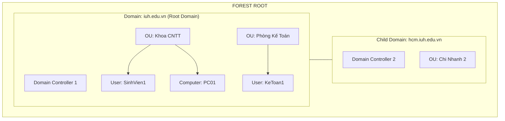
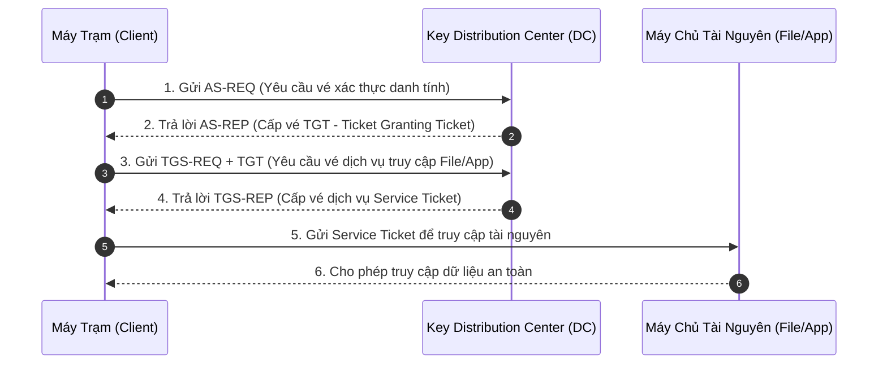

# BÁO CÁO BÀI TẬP NHÓM MÔN: QUẢN TRỊ VÀ BẢO TRÌ HỆ THỐNG
## CHỦ ĐỀ 1: ACTIVE DIRECTORY DOMAIN SERVICES (AD DS)
**Trường Đại học Công nghiệp TP.HCM (IUH)**  
**Khoa Công nghệ Thông tin - Bộ môn Hệ thống Thông tin & Mạng**

---

### THÔNG TIN NHÓM THỰC HIỆN
| STT | Mã sinh viên | Họ và tên | Vai trò / Nhiệm vụ chính |
| :--- | :--- | :--- | :--- |
| 1 | **24688491** | **Đỗ Hữu Châu** | Trưởng nhóm, Soạn thảo lý thuyết, Thiết kế Slide |
| 2 | **24700621** | **Phan Thanh Đô** | Kỹ thuật viên, Cài đặt & Cấu hình DC/DNS, Soạn kịch bản Demo |
| 3 | **23630851** | **Lê Thành Long** | Thuyết minh Demo, Quay & Biên tập Video, Kiểm thử Join Client |

---

# PHẦN I: LÝ THUYẾT NỀN TẢNG VỀ ACTIVE DIRECTORY

## 1. GIỚI THIỆU TỔNG QUAN

### 1.1. Bối cảnh ra đời
Trong các mạng máy tính ngang hàng (Peer-to-Peer / Workgroup) thời kỳ đầu, mỗi máy tính tự quản lý danh sách tài khoản và quyền hạn người dùng cục bộ trong cơ sở dữ liệu SAM (Security Accounts Manager). Khi quy mô doanh nghiệp tăng lên (hàng chục đến hàng nghìn máy tính và nhân viên), mô hình Workgroup bộc lộ các nhược điểm nghiêm trọng:
- Quản trị viên phải tạo tài khoản cho từng nhân viên trên từng máy tính độc lập.
- Không thể đồng bộ mật khẩu, không thể áp đặt chính sách an ninh mạng (Password Policy, Account Lockout) đồng nhất.
- Khó khăn trong việc tìm kiếm và phân quyền tài nguyên dùng chung (file share, máy in, ứng dụng).

Để giải quyết triệt để vấn đề này, Microsoft đã phát triển **Active Directory (AD)**, giới thiệu lần đầu tiên trên Windows 2000 Server và liên tục hoàn thiện, nâng cấp qua các thế hệ Windows Server 2003, 2008, 2012, 2016, 2019 và 2022.

### 1.2. Định nghĩa Active Directory
**Active Directory (AD)** là dịch vụ thư mục (Directory Service) độc quyền của Microsoft, đóng vai trò là "bộ não" trung tâm của toàn bộ hệ thống mạng doanh nghiệp. Nó lưu trữ thông tin về các đối tượng mạng (người dùng, nhóm, máy tính tính, máy in, tài nguyên chia sẻ...) dưới dạng một cơ sở dữ liệu phân cấp có cấu trúc, đồng thời cung cấp các cơ chế xác thực (Authentication) và ủy quyền (Authorization) an toàn cho toàn bộ hệ thống.

---

## 2. CHỨC NĂNG CỦA DIRECTORY SERVICE (DỊCH VỤ THƯ MỤC)

Một **Directory Service** tiêu chuẩn trong hệ thống phân tán thực hiện 4 chức năng cốt lõi sau:

### 2.1. Quản trị tập trung (Centralized Administration)
- Cung cấp một kho dữ liệu trung tâm duy nhất (Single Data Repository) để quản lý toàn bộ định danh (Identity), quyền truy cập và tài nguyên mạng.
- Quản trị viên chỉ cần thao tác tại một máy chủ quản lý (Domain Controller) thì các thay đổi sẽ tự động có hiệu lực trên toàn bộ hệ thống mạng.

### 2.2. Khả năng mở rộng và cấu trúc phân cấp (Scalability & Hierarchy)
- Dịch vụ thư mục không lưu dữ liệu dạng bảng phẳng (flat table) như SAM cục bộ, mà tổ chức dữ liệu theo hình cây (Hierarchical Tree Structure).
- Cho phép mở rộng từ mạng doanh nghiệp nhỏ vài chục người dùng đến các tập đoàn đa quốc gia với hàng triệu đối tượng mà vẫn duy trì hiệu năng truy vấn cao.

### 2.3. Định danh và tra cứu tài nguyên toàn cục (Global Directory & Searchability)
- Cho phép người dùng và ứng dụng nhanh chóng định vị, tìm kiếm thông tin về bất kỳ đối tượng nào trong mạng thông qua các giao thức chuẩn (như LDAP, DNS) dựa trên các thuộc tính (tên, email, số điện thoại, vị trí văn phòng...).

### 2.4. Bảo mật và kiểm soát truy cập (Security & Access Control)
- Mỗi đối tượng trong thư mục đều được gắn liền với một danh sách điều khiển truy cập (ACL - Access Control List).
- Dịch vụ thư mục bảo đảm rằng chỉ những chủ thể được cấp quyền hợp lệ mới có thể xem, chỉnh sửa hoặc sở hữu tài nguyên mạng.

---

## 3. MỤC ĐÍCH CỦA ACTIVE DIRECTORY

Active Directory được triển khai trong hạ tầng CNTT doanh nghiệp nhằm đạt được các mục đích chiến lược:

1. **Đăng nhập một lần (Single Sign-On - SSO):** Người dùng chỉ cần một tài khoản và mật khẩu duy nhất để đăng nhập vào bất kỳ máy tính nào thuộc Domain và truy cập mọi dịch vụ nội bộ (File server, Web nội bộ, Mail, SQL Server, VPN...).
2. **Đơn giản hóa và tự động hóa quản trị:** Cắt giảm chi phí vận hành hạ tầng (OpEx). Thay vì cấu hình riêng rẽ từng máy, quản trị viên sử dụng Group Policy Objects (GPO) để cấu hình hàng loạt máy tính chỉ trong vài giây.
3. **Bảo mật danh tính toàn diện:** Ngăn chặn các cuộc tấn công đánh cắp mật khẩu, giả mạo danh tính nhờ giao thức mã hóa Kerberos v5 hiện đại thay thế cho NTLM cổ điển.
4. **Phân quyền quản trị linh hoạt (Delegation of Control):** Cho phép chia nhỏ quyền quản trị. Quản trị viên cấp cao (Enterprise Admins) có thể ủy quyền cho các quản trị viên chi nhánh (Helpdesk) chỉ có quyền reset mật khẩu hoặc tạo tài khoản trong phòng ban của họ mà không sợ ảnh hưởng đến toàn bộ hệ thống.
5. **Dự phòng sự cố và cân bằng tải (High Availability & Fault Tolerance):** Hỗ trợ mô hình đa máy chủ (Multi-master Domain Controllers). Nếu một DC gặp sự cố phần cứng, các DC còn lại vẫn duy trì đăng nhập và cung cấp dịch vụ bình thường.

---

## 4. CÁC TÍNH NĂNG NỔI BẬT CỦA ACTIVE DIRECTORY

### 4.1. Cấu trúc logic (Logical Structure)
- **Object (Đối tượng):** Đơn vị nhỏ nhất đại diện cho thực thể trong mạng (User, Group, Computer, Printer, Shared Folder). Mỗi đối tượng có tập thuộc tính (Attributes) như Username, Display Name, SID, GUID.
- **Organizational Unit - OU (Đơn vị tổ chức):** Thùng chứa (Container) logic dùng để gom nhóm các đối tượng theo phòng ban, vị trí địa lý hoặc chức năng (ví dụ: OU `KeToan`, OU `NhanSu`). OU là cấp độ nhỏ nhất có thể gán chính sách **Group Policy (GPO)** và ủy quyền quản trị.
- **Domain (Miền):** Đơn vị nòng cốt quản lý an ninh mạng. Tất cả các tài khoản trong cùng một Domain cùng chia sẻ chung một cơ sở dữ liệu AD (`ntds.dit`) và một chính sách bảo mật chung.
- **Tree (Cây):** Tập hợp một hoặc nhiều Domain có cùng không gian tên liên tục (Contiguous Namespace), ví dụ: `iuh.edu.vn` (Root) -> `cntt.iuh.edu.vn` (Child Domain).
- **Forest (Rừng):** Ranh giới an ninh tối cao (Security Boundary) của AD. Tập hợp nhiều Tree có thể khác nhau về không gian tên nhưng cùng chia sẻ chung **Schema**, **Configuration Container** và **Global Catalog**.

### 4.2. Cấu trúc vật lý (Physical Structure)
- **Domain Controller (DC):** Máy chủ Windows Server đã cài đặt role AD DS, lưu trữ bản sao cơ sở dữ liệu thư mục và thực thi việc xác thực người dùng.
- **Sites & Subnets:** Mô tả vị trí địa lý vật lý thực tế của hệ thống mạng (dựa trên dải IP Subnet). Sites giúp tối ưu hóa lưu lượng đồng bộ dữ liệu (Replication) qua đường truyền WAN và hướng dẫn Client chọn DC gần nhất để đăng nhập.

### 4.3. Schema và Global Catalog
- **Active Directory Schema:** Định nghĩa bản thiết kế (Blueprint) của toàn bộ AD, bao gồm danh mục tất cả các lớp đối tượng (Classes - ví dụ: User, Computer) và các thuộc tính (Attributes - ví dụ: telephoneNumber, mail) có thể tồn tại trong Forest.
- **Global Catalog (GC):** Máy chủ DC lưu trữ bản sao đầy đủ các đối tượng trong Domain của nó, cộng với **bản sao một phần (Partial Attribute Set)** của TẤT CẢ các đối tượng trong toàn bộ Forest. Cho phép tìm kiếm tài nguyên nhanh chóng xuyên suốt cả Forest mà không cần truy vấn từng DC riêng biệt (chạy trên cổng TCP 3268/3269).

### 4.4. 5 Vai trò FSMO (Flexible Single Master Operation Roles)
Mặc dù AD hoạt động theo mô hình Multi-Master, vẫn có 5 nhiệm vụ đặc biệt chỉ được phép xử lý bởi MỘT DC duy nhất tại một thời điểm để tránh xung đột dữ liệu:
1. **Schema Master (Toàn Forest):** Quản lý việc sửa đổi cấu trúc Schema.
2. **Domain Naming Master (Toàn Forest):** Kiểm soát việc thêm/xóa Domain trong Forest.
3. **PDC Emulator (Theo từng Domain):** Đồng bộ thời gian (Time Sync), xử lý đổi mật khẩu khẩn cấp và duy trì tương thích ứng dụng cũ.
4. **RID Master (Theo từng Domain):** Cung cấp các khối Relative ID (RID) cho các DC để gán SID duy nhất cho các đối tượng mới tạo.
5. **Infrastructure Master (Theo từng Domain):** Quản lý và cập nhật tham chiếu đối tượng giữa các Domain khác nhau.

### 4.5. Read-Only Domain Controller (RODC)
- Được giới thiệu từ Windows Server 2008 nhằm giải quyết vấn đề an ninh vật lý tại các văn phòng chi nhánh nhỏ (Branch Office) không có phòng Server chuyên dụng hay IT bảo vệ.
- **Đặc điểm:** Cơ sở dữ liệu AD trên RODC chỉ đọc (Read-only), không cho phép ghi trực tiếp; không lưu trữ mật khẩu người dùng theo mặc định (Password Replication Policy - PRP); ngăn ngừa kẻ xấu chiếm máy chủ chi nhánh rồi xâm nhập toàn bộ hệ thống tổng công ty.

---

## 5. CƠ CHẾ HOẠT ĐỘNG CỦA ACTIVE DIRECTORY

### 5.1. Cơ chế xác thực người dùng (Kerberos v5 Authentication Flow)
Active Directory sử dụng giao thức **Kerberos v5** làm cơ chế xác thực mặc định. Quá trình đăng nhập diễn ra qua mô hình bán vé an toàn:

### 5.2. Mối quan hệ mật thiết giữa Active Directory và DNS Server
- **Không có DNS thì Active Directory KHÔNG THỂ hoạt động!**
- DNS đóng vai trò là "người chỉ đường" giúp Client tìm thấy Domain Controller thông qua các bản ghi dịch vụ **SRV (Service Resource Records)** nằm trong phân vùng `_msdcs`.
  - Ví dụ: Khi Client muốn đăng nhập, nó truy vấn DNS record `_ldap._tcp.dc._msdcs.<domain-name>` để lấy địa chỉ IP của DC đang khả dụng.
- Vì lý do này, khi cài đặt Domain Controller đầu tiên, trình cài đặt AD DS luôn tích hợp cài đặt và cấu hình luôn role DNS Server.

### 5.3. Cơ chế nâng cấp và tích hợp Forest/Domain qua công cụ ADPREP
Trong thực tế doanh nghiệp, khi hệ thống mạng đang chạy các phiên bản Windows Server cũ (như Windows Server 2000, 2003) và doanh nghiệp muốn đưa thêm máy chủ mới (Windows Server 2008/2012) vào làm Domain Controller, cấu trúc Schema và phân quyền cũ không tương thích. Microsoft cung cấp tiện ích `adprep.exe` để chuẩn bị hạ tầng:
1. **`adprep /forestprep`:**
   - **Mục đích:** Mở rộng và cập nhật Schema của toàn bộ Forest. Nó bổ sung các lớp đối tượng, thuộc tính mới mà Windows Server phiên bản mới yêu cầu.
   - **Nơi thực thi:** Phải chạy trên máy chủ đang giữ vai trò **Schema Master** và người thực thi phải là thành viên nhóm **Enterprise Admins** và **Schema Admins**.
2. **`adprep /domainprep /gpprep`:**
   - **Mục đích:** Cập nhật các quyền bảo mật (security permissions) của Domain và chuẩn bị các phân vùng đối tượng chính sách nhóm (Group Policy objects - Sysvol).
   - **Nơi thực thi:** Phải chạy trên máy chủ đang giữ vai trò **Infrastructure Master** của từng Domain và người thực thi phải là thành viên nhóm **Domain Admins**.
3. **`adprep /rodcprep`:**
   - **Mục đích:** Cập nhật các phân quyền bảo mật cho phân vùng ứng dụng DNS (Application Directory Partitions) trên toàn Forest để cho phép Read-Only Domain Controller (RODC) có thể đồng bộ các bản ghi DNS.
   - **Nơi thực thi:** Chạy tại bất kỳ DC nào bởi thành viên nhóm **Enterprise Admins**.

*(Ghi chú kỹ thuật: Từ Windows Server 2012 trở đi, trình thuật toán Server Manager Promotion Wizard đã tự động tích hợp adprep ngầm trong quá trình promote DC nếu quản trị viên có đủ quyền hạn).*

---

# PHẦN II: DÀN Ý SLIDE BÁO CÁO THUYẾT TRÌNH (POWERPOINT OUTLINE)

Dưới đây là thiết kế chi tiết từng slide cho nhóm chuẩn bị bài thuyết trình 10-15 phút:

* **Slide 1: Trang bìa**
  * Tên đề tài: Tìm hiểu & Cài đặt Quản trị Active Directory Domain Services (AD DS).
  * Giảng viên hướng dẫn môn Quản trị và bảo trì hệ thống.
  * Nhóm thực hiện: Nhóm 1 (Đỗ Hữu Châu, Phan Thanh Đô, Lê Thành Long).
* **Slide 2: Nội dung báo cáo (Agenda)**
  1. Tổng quan & Chức năng Directory Service.
  2. Mục đích & Lợi ích của Active Directory.
  3. Các tính năng & Kiến trúc nổi bật (Logical, Physical, FSMO, RODC).
  4. Cơ chế hoạt động & Vai trò của DNS / ADPREP.
  5. Video Demo thực hành cài đặt & cấu hình.
* **Slide 3: Khái niệm & Chức năng Directory Service**
  * So sánh Workgroup (SAM cục bộ) vs. Domain (AD DS tập trung).
  * 4 Chức năng chính: Quản trị tập trung, Khả năng mở rộng, Tra cứu toàn cục, Kiểm soát truy cập.
* **Slide 4: Mục đích triển khai Active Directory**
  * Đăng nhập 1 lần (Single Sign-On).
  * Quản trị tự động qua Group Policy (GPO).
  * Nâng cao tính an toàn bảo mật và dự phòng máy chủ (Fault Tolerance).
* **Slide 5: Kiến trúc Logic của Active Directory**
  * Sơ đồ phân cấp: Forest -> Tree -> Domain -> Organizational Unit (OU) -> Objects.
  * Vai trò của OU trong phân quyền quản trị và áp đặt GPO.
* **Slide 6: Kiến trúc Vật lý & 5 Vai trò FSMO**
  * Khái niệm Domain Controller, Sites & Subnets.
  * Bảng tổng hợp 5 vai trò FSMO (Schema, Domain Naming, PDC, RID, Infrastructure).
* **Slide 7: Read-Only Domain Controller (RODC) & An toàn chi nhánh**
  * Định nghĩa RODC: Chỉ đọc, bảo vệ an ninh vật lý chi nhánh.
  * Cơ chế Password Replication Policy (PRP).
* **Slide 8: Cơ chế xác thực Kerberos & Tích hợp DNS**
  * Sơ đồ cấp vé Kerberos v5 (Client - KDC - Server).
  * Bản ghi `_msdcs` và tầm quan trọng sống còn của DNS đối với AD.
* **Slide 9: Các lệnh chuẩn bị nâng cấp hệ thống (ADPREP)**
  * `adprep /forestprep` (Nâng cấp Schema toàn Forest).
  * `adprep /domainprep /gpprep` (Nâng cấp quyền Domain & GPO).
  * `adprep /rodcprep` (Chuẩn bị hạ tầng phân quyền DNS cho RODC).
* **Slide 10: Mô hình triển khai Demo thực tế**
  * Sơ đồ mạng Demo:
    * Server DC: Windows Server 2012 (IP: `192.168.10.10`, Domain: `nhom1.local`).
    * Client: Windows 7 (IP: `192.168.10.20`, Preferred DNS: `192.168.10.10`).
* **Slide 11: Video Demo & Kết quả nghiệm thu**
  * Trình chiếu video clip demo cài đặt và kiểm thử.
  * Minh chứng kết quả: Promote thành công, DNS hoạt động tốt, Client join Domain và đăng nhập tài khoản Domain.
* **Slide 12: Lời cảm ơn & Hỏi đáp (Q&A)**
