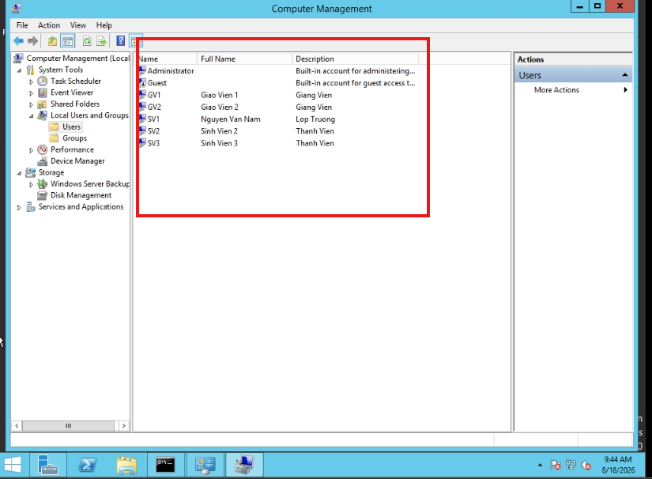
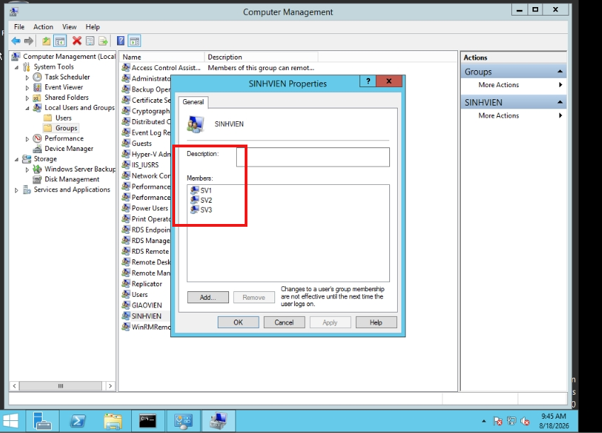
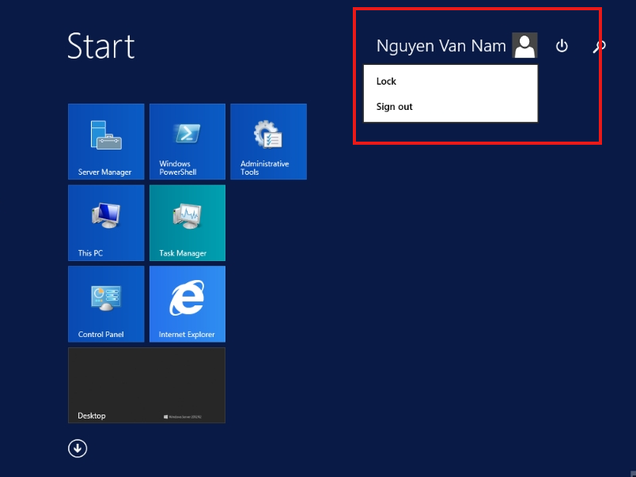
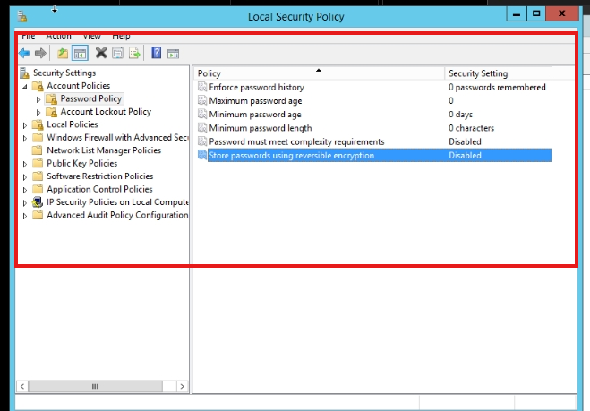
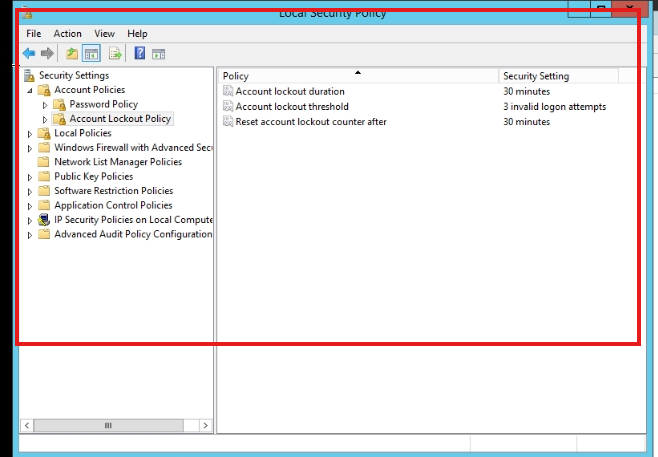
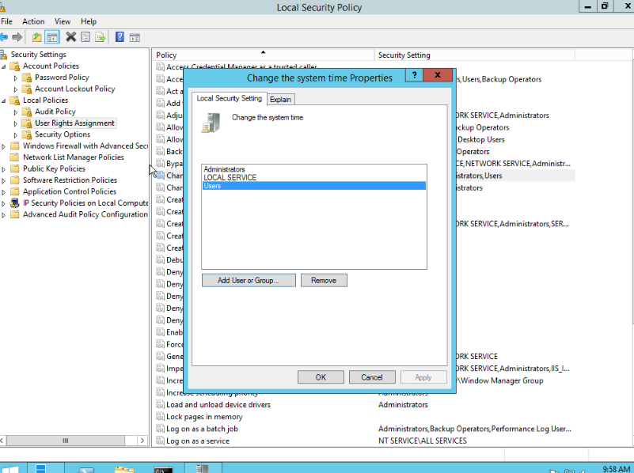
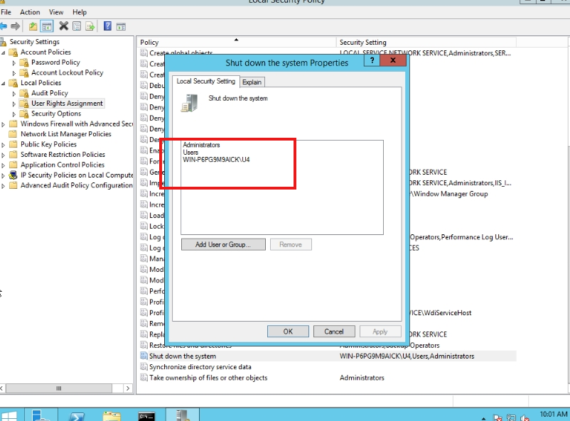

# HƯỚNG DẪN THỰC HÀNH CHI TIẾT BẰNG TAY (BÀI 1 ĐẾN BÀI 4)

## MÔN: QUẢN TRỊ VÀ BẢO TRÌ HỆ THỐNG (IUH)

Tài liệu này hướng dẫn chi tiết từng bước (Step-by-step) cấu hình bằng giao diện đồ họa (GUI) cho các Bài 1, 2, 3, 4 trên máy **Windows Server 2012 R2** (hoặc Windows Server 2008) và máy **Client Windows 7**, kèm theo hướng dẫn kiểm tra và các góc chụp màn hình để lấy minh chứng nộp báo cáo.

---

# BÀI 1: LOCAL USER ACCOUNT & GROUP ACCOUNT (TÀI KHOẢN NGƯỜI DÙNG & NHÓM CỤC BỘ)

### 🎯 Mục tiêu bài học:

* Tạo tài khoản người dùng cục bộ (Local User) và nhóm người dùng cục bộ (Local Group).
* Thêm các người dùng vào nhóm tương ứng để tiện quản lý.
* Đăng nhập kiểm tra tài khoản cục bộ.

---

### 📝 Các bước thực hiện:

#### 1. Tạo Local User Account

1. Bấm tổ hợp phím **`Windows + R`** ➔ Gõ **`lusrmgr.msc`** ➔ Nhấn **Enter** (hoặc mở *Computer Management* ➔ *Local Users and Groups*).
2. Nhấp chọn thư mục **`Users`** ở cột bên trái.
3. Nhấp chuột phải vào vùng trống ở giữa ➔ Chọn **`New User...`**.
4. Nhập thông tin tài khoản **`SV1`**:
   * **User name**: `SV1`
   * **Full name**: `Nguyen Van Nam`
   * **Description**: `Lop Truong`
   * **Password**: `abc@123` (hoặc mật khẩu theo yêu cầu giảng viên)
   * **Confirm password**: `abc@123`
   * **Bỏ tích** ô: `User must change password at next logon` (để khi đăng nhập không bắt đổi pass).
   * Tích ô: `Password never expires` (tùy chọn để pass không bị hết hạn).
5. Nhấn nút **Create**.
6. Tiếp tục tạo các User tiếp theo với cách tương tự:
   * User **`SV2`** (Password: `abc@123`, bỏ check đổi pass).
   * User **`SV3`** (Password: `abc@123`, bỏ check đổi pass).
   * User **`GV1`** (Password: `abc@123`, bỏ check đổi pass).
   * User **`GV2`** (Password: `abc@123`, bỏ check đổi pass).
7. Nhấn **Close** để đóng hộp thoại New User.

#### 2. Tạo Local Group Account & Thêm User vào Group

1. Vẫn trong cửa sổ `lusrmgr.msc`, nhấp chọn thư mục **`Groups`** ở cột bên trái.
2. Nhấp chuột phải vào vùng trống ➔ Chọn **`New Group...`**.
3. Tạo Group **`SINHVIEN`**:
   * **Group name**: `SINHVIEN`
   * **Description**: `Nhom Sinh Vien`
   * Nhấn nút **`Add...`** bên dưới.
   * Tại ô *Enter the object names to select*, gõ: `SV1; SV2; SV3` ➔ Nhấn **Check Names** (tên user sẽ được gạch chân) ➔ Nhấn **OK**.
   * Nhấn nút **Create**.
4. Tạo Group **`GIAOVIEN`**:
   * **Group name**: `GIAOVIEN`
   * **Description**: `Nhom Giao Vien`
   * Nhấn nút **`Add...`** ➔ Gõ: `GV1; GV2` ➔ Nhấn **Check Names** ➔ Nhấn **OK**.
   * Nhấn nút **Create** ➔ Nhấn **Close**.

#### 3. Kiểm tra kết quả & Chụp màn hình báo cáo:

* **Ảnh chụp 1**: Mở thư mục `Users`, hiển thị danh sách các User vừa tạo (`SV1`, `SV2`, `SV3`, `GV1`, `GV2`).
* **Ảnh chụp 2**: Mở thư mục `Groups`, nhấp đúp vào nhóm `SINHVIEN` (hiện danh sách SV1, SV2, SV3) và nhóm `GIAOVIEN`.
* **Ảnh chụp 3 (Đăng nhập)**: Đăng xuất (Sign out) tài khoản hiện tại, đăng nhập bằng tài khoản `SV1` với pass `abc@123` ➔ Đăng nhập thành công vào màn hình Desktop.

---

# BÀI 2: LOCAL SECURITY POLICY (CHÍNH SÁCH BẢO MẬT CỤC BỘ)

### 🎯 Mục tiêu bài học:

* Hiệu chỉnh **Password Policy** (Chính sách độ phức tạp và tuổi thọ mật khẩu).
* Hiệu chỉnh **Account Lockout Policy** (Khóa tài khoản khi đăng nhập sai nhiều lần).
* Phân quyền đặc quyền **User Rights Assignment** (Cho phép User bình thường được quyền Tắt máy và Chỉnh ngày giờ).

---

### 📝 Các bước thực hiện:

#### 1. Cấu hình Password Policy (Cho phép đặt mật khẩu đơn giản)

1. Bấm **`Windows + R`** ➔ Gõ **`secpol.msc`** ➔ Nhấn **Enter** để mở *Local Security Policy*.
2. Mở theo đường dẫn bên trái:
   `Security Settings` ➔ `Account Policies` ➔ **`Password Policy`**.
3. Cấu hình các mục ở cột bên phải:
   * **Password must meet complexity requirements**: Nhấp đúp ➔ Chọn **`Disabled`** ➔ Nhấn **OK** (Tắt yêu cầu mật khẩu phức tạp).
   * **Minimum password length**: Nhấp đúp ➔ Đặt là **`0`** (hoặc `1`) characters ➔ **OK**.
   * **Enforce password history**: Nhấp đúp ➔ Đặt là **`0`** passwords remembered ➔ **OK**.
   * **Minimum password age**: Đặt là **`0`** days ➔ **OK**.
   * **Maximum password age**: Đặt là **`0`** (Password will not expire) hoặc `42` days ➔ **OK**.
4. Cập nhật chính sách: Mở CMD gõ **`gpupdate /force`** ➔ Nhấn **Enter**.
5. **Kiểm tra**: Vào `lusrmgr.msc` tạo thử user **`U4`** với mật khẩu siêu ngắn/đơn giản là **`123`** ➔ Tạo thành công (không bị báo lỗi Password Complexity).

#### 2. Cấu hình Account Lockout Policy (Khóa tài khoản khi nhập sai)

1. Trong cửa sổ *Local Security Policy* (`secpol.msc`), chọn đường dẫn:
   `Security Settings` ➔ `Account Policies` ➔ **`Account Lockout Policy`**.
2. Thiết lập các thông số:
   * **Account lockout threshold**: Nhấp đúp ➔ Điền **`3`** invalid logon attempts (Nhập sai 3 lần sẽ bị khóa) ➔ Nhấn **OK**.
   * Khi đó Windows sẽ tự động gợi ý đặt 2 mục còn lại là 30 phút:
     * **Account lockout duration**: **`30`** minutes.
     * **Reset account lockout counter after**: **`30`** minutes.
   * Nhấn **OK**.
3. **Kiểm tra**:
   * Sign out (hoặc Lock máy) ➔ Chọn tài khoản `U4`.
   * Cố tình nhập sai mật khẩu 4 lần liên tiếp.
   * Quan sát thông báo: *"The referenced account is currently locked out and may not be logged on to"*.

#### 3. Cấu hình User Rights Assignment (Cấp quyền tắt máy & đổi giờ cho User thường)

1. Trong cửa sổ *Local Security Policy* (`secpol.msc`), mở đường dẫn:
   `Security Settings` ➔ `Local Policies` ➔ **`User Rights Assignment`**.
2. **Cấp quyền thay đổi ngày giờ hệ thống**:
   * Tìm chính sách **`Change the system time`** ➔ Nhấp đúp.
   * Nhấn **`Add User or Group...`** ➔ Gõ **`Users`** ➔ Nhấn **Check Names** ➔ **OK** ➔ **OK**.
3. **Cấp quyền tắt máy**:
   * Tìm chính sách **`Shut down the system`** ➔ Nhấp đúp.
   * Nhấn **`Add User or Group...`** ➔ Gõ **`Users`** ➔ Nhấn **Check Names** ➔ **OK** ➔ **OK**.
4. Cập nhật chính sách: Mở CMD gõ **`gpupdate /force`**.
5. **Kiểm tra**:
   * Đăng nhập bằng tài khoản `U4`.
   * Nhấp đúp vào đồng hồ ở góc phải màn hình ➔ Đổi ngày giờ thành công (không bị hỏi quyền Admin).
   * Bấm nút Start ➔ Bấm **Shut down** được máy tính.

---

# BÀI 3: SHARE PERMISSION (QUẢN TRỊ CHIA SẺ VÀ PHÂN QUYỀN SHARE)

### 🎯 Mục tiêu bài học:

* Tạo thư mục và chia sẻ tài nguyên qua mạng LAN với quyền **Share Permission**.
* Tạo thư mục **Share ẩn** (sử dụng ký tự `$`).
* Cấu hình **Share 1 thư mục với nhiều tên khác nhau**.
* **Map Network Drive** (Gán ổ đĩa mạng) để truy cập nhanh từ máy Client.

---

### 📝 Các bước thực hiện:

#### 1. Chuẩn bị thư mục và User trên máy Server (PC01):

1. Tạo 2 User: **`U1`** và **`U2`** (Mật khẩu: `123` hoặc `abc@123`).
2. Mở ổ đĩa **`C:\`** ➔ Tạo thư mục lớn tên **`THUCHANH`**.
3. Bên trong thư mục `C:\THUCHANH`, tạo 2 thư mục con:
   * **`DULIEU`**
   * **`BIMAT`**
4. Trong mỗi thư mục, tạo một file text: `thuchanh.txt` (nội dung: *"Day la tai lieu thuc hanh"*).
5. Tạo thêm một thư mục riêng **`C:\TAILIEU`** để làm bài Map Network Drive.

#### 2. Share thư mục thường (Folder DULIEU)

1. Nhấp chuột phải vào thư mục `C:\THUCHANH\DULIEU` ➔ Chọn **Properties**.
2. Chọn tab **`Sharing`** ➔ Nhấn nút **`Advanced Sharing...`**.
3. Tích chọn vào ô **`Share this folder`**.
4. Ô **Share name**: để mặc định là `DULIEU`.
5. Nhấn nút **`Permissions`**:
   * Mặc định có group `Everyone`.
   * Ở khung Permissions for Everyone, tích chọn **`Allow`** cho mục **`Full Control`** (hoặc Change, Read).
   * Nhấn **OK** ➔ Nhấn **OK** ➔ Nhấn **Close**.

#### 3. Share ẩn một thư mục (Folder BIMAT$)

1. Nhấp chuột phải vào thư mục `C:\THUCHANH\BIMAT` ➔ Chọn **Properties**.
2. Chọn tab **`Sharing`** ➔ Nhấn nút **`Advanced Sharing...`**.
3. Tích chọn vào ô **`Share this folder`**.
4. Ô **Share name**: Điền thêm dấu **`$`** vào cuối: **`BIMAT$`**.
5. Nhấn nút **`Permissions`** ➔ Chọn Everyone ➔ Tích **Allow Full Control** ➔ Nhấn **OK** ➔ **OK** ➔ **Close**.

#### 4. Share một thư mục với nhiều tên (Multi-Share Name)

1. Chuột phải lại vào thư mục `C:\THUCHANH\DULIEU` ➔ **Properties** ➔ tab **Sharing** ➔ **`Advanced Sharing...`**.
2. Nhấn nút **`Add`** (nằm bên dưới khung Share name).
3. Nhập tên chia sẻ mới:
   * **Share name**: `DULIEU_KETOAN`
   * **Description**: `Du lieu phong ke toan`
   * Nhấn nút **Permissions** ➔ Cấp quyền Everyone Allow Full Control ➔ **OK**.
4. Nhấn **OK** ➔ Lúc này ở ô Share name xổ xuống sẽ có 2 tên: `DULIEU` và `DULIEU_KETOAN`.
5. Nhấn **OK** ➔ **Close**.

#### 5. Cấu hình Map Network Drive (Gán ổ đĩa mạng)

1. Share thư mục `C:\TAILIEU` với quyền Everyone Full Control (Share name: `TAILIEU`).
2. Trên máy Client (Win7):
   * Mở **Computer** (Windows Explorer).
   * Bấm vào nút **`Map network drive`** trên thanh công cụ.
   * **Drive**: Chọn ký tự ổ đĩa (ví dụ: `Z:` hoặc `W:`).
   * **Folder**: Gõ đường dẫn chia sẻ mạng: **`\\192.168.11.1\TAILIEU`** (hoặc `\\Server\TAILIEU`).
   * Tích chọn **`Reconnect at logon`** ➔ Nhấn **Finish**.
   * Đăng nhập với User `U1` / pass `123`.

#### 6. Kiểm tra kết quả & Chụp màn hình:

* **Từ máy Client (Win7)**: Bấm `Windows + R` ➔ Gõ `\\192.168.11.1` ➔ Thấy xuất hiện thư mục `DULIEU`, `DULIEU_KETOAN`, `TAILIEU`, nhưng **KHÔNG THẤY** thư mục `BIMAT` (do đã bị ẩn).
* Gõ tiếp vào Run: `\\192.168.11.1\BIMAT$` ➔ Truy cập vào thư mục ẩn `BIMAT$` thành công!
* Mở **Computer** trên Client: Thấy xuất hiện ổ đĩa mạng **`TAILIEU (Z:)`**.

---

# BÀI 4: NTFS PERMISSION (QUYỀN TRÊN HỆ THỐNG TẬP TIN NTFS)

### 🎯 Mục tiêu bài học:

* Phân biệt và kết hợp **Share Permission** và **NTFS Permission**.
* Ngắt tính năng thừa kế quyền (**Disable Inheritance**).
* Phân quyền cho các Group **KETOAN** và **NHANSU** trên từng cây thư mục con.
* Thiết lập quyền đặc biệt (**Special Permissions**): *"File của ai tạo thì người đó mới có quyền xóa, người khác không được xóa"*.

---

### 📝 Các bước thực hiện:

#### 1. Chuẩn bị cây thư mục và User/Group trên Server:

1. **Tạo 2 Group**: `KETOAN`, `NHANSU`.
2. **Tạo các User**:
   * User `KT1`, `KT2` ➔ Add vào Group `KETOAN`.
   * User `NS1`, `NS2` ➔ Add vào Group `NHANSU`.
3. **Tạo cây thư mục trên ổ C:**
   ```
   C:\DATA
   ├── CHUNG
   ├── KETOAN
   └── NHANSU
   ```
4. **Chia sẻ thư mục gốc `C:\DATA`**:
   * Chuột phải `C:\DATA` ➔ **Properties** ➔ **Sharing** ➔ **Advanced Sharing**.
   * Tích **Share this folder** (Share name: `DATA`) ➔ **Permissions** ➔ Everyone Allow **Full Control** ➔ **OK** (Quyền mạng để mở hoàn toàn, việc siết quyền sẽ do tab Security/NTFS đảm nhận).

---

#### 2. Phân quyền trên thư mục gốc `C:\DATA`:

> **Yêu cầu**: Group KETOAN và NHANSU chỉ có quyền Đọc (Read & Execute), không được tự ý tạo file/thư mục lung tung ở thư mục gốc.

1. Chuột phải `C:\DATA` ➔ **Properties** ➔ chọn tab **`Security`** ➔ Nhấn **`Advanced`**.
2. **Ngắt kế thừa (Disable Inheritance)**:
   * Nhấn nút **`Disable inheritance`**.
   * Chọn dòng: **`Convert inherited permissions into explicit permissions on this object`** (Chuyển quyền kế thừa thành quyền trực tiếp).
3. Xóa bớt quyền mặc định của User thường:
   * Chọn dòng **`Users (...)`** ➔ Nhấn **Remove**.
4. **Thêm Group KETOAN và NHANSU**:
   * Nhấn nút **`Add`** ➔ Chọn **`Select a principal`** ➔ Gõ: `KETOAN; NHANSU` ➔ **Check Names** ➔ **OK**.
   * Tại mục **Basic permissions**: Tích chọn **`Read & execute`**, **`List folder contents`**, **`Read`**.
   * Nhấn **OK** ➔ **Apply** ➔ **OK**.

---

#### 3. Phân quyền trên thư mục con `C:\DATA\CHUNG`:

> **Yêu cầu**: Cả 2 phòng KETOAN và NHANSU đều có quyền toàn quyền (**Full Control**) làm việc chung.

1. Chuột phải `C:\DATA\CHUNG` ➔ **Properties** ➔ tab **`Security`** ➔ Nhấn **`Edit...`**.
2. Nhấn **`Add...`** ➔ Gõ: `KETOAN; NHANSU` ➔ **Check Names** ➔ **OK**.
3. Chọn group `KETOAN` ➔ Tích **Allow Full control**.
4. Chọn group `NHANSU` ➔ Tích **Allow Full control**.
5. Nhấn **OK** ➔ **OK**.

---

#### 4. Phân quyền trên thư mục riêng `C:\DATA\KETOAN` và `C:\DATA\NHANSU`:

> **Yêu cầu**: Phòng nào chỉ được vào phòng đó với toàn quyền (**Full Control**), phòng kia bị cấm tuyệt đối (không có quyền truy cập).

**A. Đối với thư mục `C:\DATA\KETOAN`:**

1. Chuột phải `C:\DATA\KETOAN` ➔ **Properties** ➔ tab **`Security`** ➔ **`Advanced`**.
2. Nhấn **`Disable inheritance`** ➔ Chọn **`Convert inherited permissions...`**.
3. Trong danh sách Permission entries:
   * Chọn dòng **`NHANSU`** ➔ Nhấn nút **`Remove`** (để xóa hẳn quyền của phòng Nhân sự).
   * Chọn dòng **`KETOAN`** ➔ Nhấn nút **`Edit`** ➔ Tích chọn **`Full control`** ➔ Nhấn **OK**.
4. Nhấn **Apply** ➔ **OK**.

**B. Đối với thư mục `C:\DATA\NHANSU`:**

1. Chuột phải `C:\DATA\NHANSU` ➔ **Properties** ➔ tab **`Security`** ➔ **`Advanced`**.
2. Nhấn **`Disable inheritance`** ➔ Chọn **`Convert inherited permissions...`**.
3. Trong danh sách Permission entries:
   * Chọn dòng **`KETOAN`** ➔ Nhấn nút **`Remove`** (xóa quyền phòng Kế toán).
   * Chọn dòng **`NHANSU`** ➔ Nhấn nút **`Edit`** ➔ Tích chọn **`Full control`** ➔ Nhấn **OK**.
4. Nhấn **Apply** ➔ **OK**.

---

#### 5. Phân quyền Special Permission ("File của ai người đó xóa"):

> **Yêu cầu**: Trong thư mục `KETOAN`, user `KT1` và `KT2` đều có thể tạo file và sửa file, nhưng `KT1` **không được xóa** file của `KT2` tạo ra và ngược lại.

1. Chuột phải `C:\DATA\KETOAN` ➔ **Properties** ➔ tab **`Security`** ➔ Nhấn **`Advanced`**.
2. Chọn dòng quyền của **`KETOAN`** ➔ Nhấn **`Edit`**.
3. Nhấp vào chữ **`Show advanced permissions`** (ở góc phải).
4. **BỎ TÍCH** 2 dòng sau:
   * ❌ **`Delete subfolders and files`**
   * ❌ **`Delete`**
     *(Vẫn giữ tích các quyền: Read, Write, Execute, Create files, Create folders...)*.
5. Nhấn **OK**.
6. Đảm bảo trong danh sách có đối tượng **`CREATOR OWNER`** với quyền **Full Control** (đây là đối tượng đại diện cho người vừa tạo ra file, giúp người tạo file vẫn có toàn quyền xóa file của chính mình).
7. Nhấn **Apply** ➔ **OK** ➔ **OK**.

---

#### 6. Kiểm tra toàn bộ kết quả Bài 4 (Testing & Chụp ảnh):

1. **Kiểm tra phân quyền thư mục riêng**:
   * Đăng nhập Client bằng `KT1` truy cập `\\192.168.11.1\DATA`:
     * Vào `KETOAN` ➔ **Thành công**.
     * Vào `NHANSU` ➔ Bị báo lỗi **Access is denied** (Chặn thành công!).
   * Đăng nhập Client bằng `NS1` truy cập `\\192.168.11.1\DATA`:
     * Vào `NHANSU` ➔ **Thành công**.
     * Vào `KETOAN` ➔ Bị báo lỗi **Access is denied** (Chặn thành công!).
2. **Kiểm tra Special Permission (Chống xóa file người khác)**:
   * Đăng nhập `KT1` vào `KETOAN` ➔ Tạo file `KT1_data.txt`.
   * Đăng nhập `KT2` vào `KETOAN` ➔ Tạo file `KT2_data.txt`.
   * Thử dùng `KT1` bấm xóa file `KT2_data.txt` ➔ Windows hiện bảng cảnh báo: **`Folder/File Access Denied - You need permission to perform this action`** ➔ Chụp lại tấm hình này làm minh chứng điểm 10!
   * Dùng `KT1` xóa file `KT1_data.txt` của chính mình ➔ **Xóa thành công**.
