# HƯỚNG DẪN CHI TIẾT TRIỂN KHAI HỆ THỐNG DOMAIN CONTROLLER (AD DS)
## MÔN: QUẢN TRỊ VÀ BẢO TRÌ HỆ THỐNG (IUH) - BÀI THỰC HÀNH TUẦN 2 (LAB 2-T2)

Tài liệu này hướng dẫn chi tiết từng bước (Step-by-step) cấu hình nâng cấp máy **Windows Server 2012 R2 / 2016** thành máy chủ điều khiển vùng **Domain Controller (Active Directory Domain Services - AD DS)**, cấu hình **DNS Server**, tạo tài khoản người dùng trên Domain, cấu hình máy **Client Windows 7 (1)** và **Windows 7 (2)** gia nhập Domain (Join Domain) và đăng nhập xác thực tập trung.

---

# 📋 BẢNG THÔNG SỐ CẤU HÌNH HỆ THỐNG (GIỮ NGUYÊN DẢI MẠNG ĐANG DÙNG)

> 💡 **Quy hoạch mạng đồng bộ với Lab 1 và Lab 2 (1-4):**

| Thiết bị / Máy ảo | Card mạng (VMware) | Địa chỉ IP (IPv4) | Subnet Mask | Default Gateway | Preferred DNS Server | Tên máy / Vai trò |
| :--- | :--- | :--- | :--- | :--- | :--- | :--- |
| **Windows Server** | `VMnet11` (LAN 1) | **`192.168.11.1`** | `255.255.255.0` | *(Để trống)* | **`127.0.0.1`** (hoặc `192.168.11.1`) | **DC-SERVER** (Domain Controller) |
| **Windows Server** | `VMnet12` (LAN 2) | **`100.100.11.1`** | `255.255.255.0` | *(Để trống)* | *(Để trống)* | Card mạng định tuyến phụ |
| **Client Win 7 (1)** | `VMnet11` | **`192.168.11.2`** | `255.255.255.0` | `192.168.11.1` | **`192.168.11.1`** *(Bắt buộc)* | **WIN7-PC1** (Domain Member) |
| **Client Win 7 (2)** | `VMnet12` | **`100.100.11.2`** | `255.255.255.0` | `100.100.11.1` | **`100.100.11.1`** *(Bắt buộc)* | **WIN7-PC2** (Domain Member) |

---

### 🔑 THÔNG TIN DOMAIN & TÀI KHOẢN:
* **Tên miền gốc (Root Domain Name)**: **`newstar.vn`** (hoặc `iuh.edu.vn` / `lab.local`)
* **Tên NetBIOS Domain**: **`NEWSTAR`**
* **Tài khoản Domain Administrator**:
  * **User**: `Administrator` (hoặc `NEWSTAR\Administrator`)
  * **Password**: `123` (hoặc `Longko0!`)
* **Tài khoản người dùng mẫu trên Domain**:
  * **User**: `hiepdh` (Họ tên: `Hiep Dang`, Logon name: `hiepdh@newstar.vn`)
  * **Password**: `123` (hoặc `abc@123`)

---

# 🌐 SƠ ĐỒ MÔ HÌNH MẠNG LAB

---

# PHẦN 1: CẤU HÌNH TRÊN MÁY WINDOWS SERVER (NÂNG CẤP DOMAIN CONTROLLER)

### BƯỚC 1: KIỂM TRA ĐẶT IP TĨNH VÀ TRỎ DNS CHO SERVER
1. Mở **Network and Sharing Center** ➔ **Change adapter settings**.
2. Nhấp chuột phải vào card mạng `VMnet11` ➔ Chọn **Properties** ➔ Nhấp đúp vào **Internet Protocol Version 4 (TCP/IPv4)**.
3. Thiết lập thông số:
   * **IP address**: `192.168.11.1`
   * **Subnet mask**: `255.255.255.0`
   * **Preferred DNS server**: **`127.0.0.1`** (hoặc `192.168.11.1` - *Bắt buộc trỏ về chính mình để làm DNS Server*).
4. Nhấn **OK** ➔ **OK**.

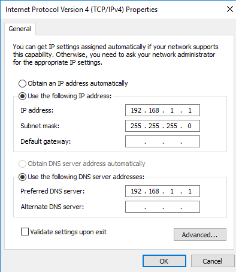

---

### BƯỚC 2: CÀI ĐẶT ROLE ACTIVE DIRECTORY DOMAIN SERVICES (AD DS)
1. Mở **Server Manager** ➔ Bấm vào **Manage** ở góc phải trên ➔ Chọn **Add Roles and Features**.
2. Bấm **Next** ➔ Chọn **Role-based or feature-based installation** ➔ Bấm **Next**.
3. Chọn Server hiện tại trong danh sách ➔ Bấm **Next**.
4. Tại trang **Server Roles**: Tích chọn vào mục **`Active Directory Domain Services`**.
   * Khi hộp thoại phụ hiện lên, bấm **Add Features** ➔ Bấm **Next**.
5. Các trang tiếp theo bấm **Next** theo mặc định ➔ Tại trang Confirm, bấm **Install**.
6. Chờ quá trình cài đặt hoàn tất (Feature installation succeeded).

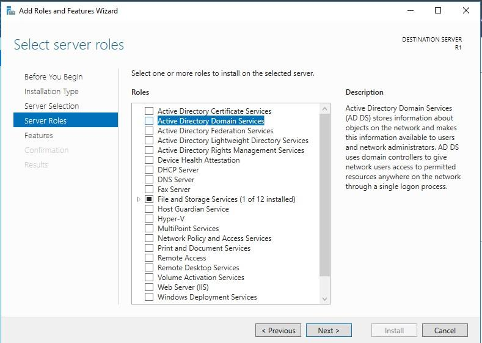

---

### BƯỚC 3: NÂNG CẤP SERVER LÊN DOMAIN CONTROLLER (PROMOTE TO DOMAIN CONTROLLER)
1. Trong cửa sổ **Server Manager**, nhấp vào biểu tượng **lá cờ cảnh báo màu vàng** ở góc trên cùng.
2. Bấm vào dòng chữ màu xanh: **`Promote this server to a domain controller`**.

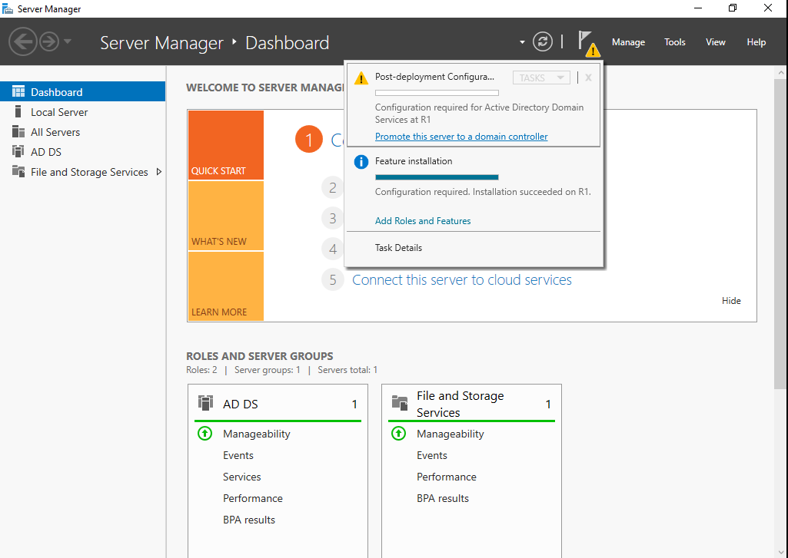

3. **Tại trang Deployment Configuration**:
   * Tích chọn vào tùy chọn thứ 3: **`Add a new forest`** *(Tạo một Forest mới)*.
   * Ô **Root domain name**: Điền tên miền: **`newstar.vn`** (hoặc `iuh.edu.vn`).
   * Bấm **Next**.

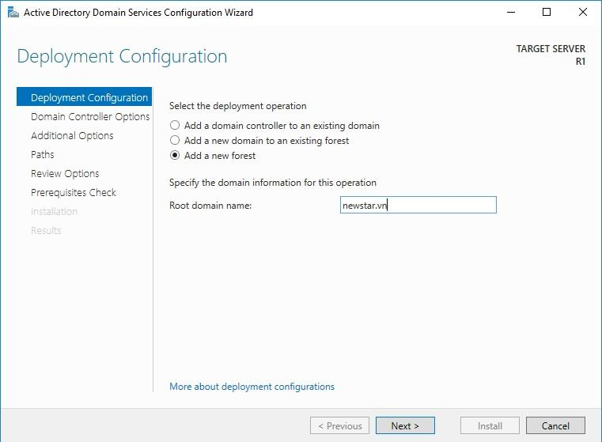

4. **Tại trang Domain Controller Options**:
   * Forest functional level & Domain functional level: Để mặc định (*Windows Server 2012 R2*).
   * Đảm bảo đã tích: **Domain Name System (DNS) server** và **Global Catalog (GC)**.
   * **Directory Services Restore Mode (DSRM) password**: Điền mật khẩu khôi phục (ví dụ: `123` hoặc `abc@123`).
   * Bấm **Next**.

5. **Các trang tiếp theo**:
   * **DNS Options**: Bấm **Next** (bỏ qua cảnh báo DNS delegation).
   * **Additional Options**: Chờ hệ thống tự điền NetBIOS domain name là **`NEWSTAR`** ➔ Bấm **Next**.
   * **Paths**: Để mặc định thư mục cơ sở dữ liệu `NTDS` và `SYSVOL` ➔ Bấm **Next**.
   * **Review Options**: Kiểm tra lại thông tin ➔ Bấm **Next**.
   * **Prerequisites Check**: Hệ thống kiểm tra điều kiện cài đặt. Khi thấy dòng chữ xanh *"All prerequisite checks passed successfully"* ➔ Bấm **Install**.

6. Máy Server sẽ tự động cài đặt và **tự động Restart (Khởi động lại)**.
7. Sau khi khởi động lại, màn hình đăng nhập Server sẽ đổi thành: **`NEWSTAR\Administrator`**. Đăng nhập bằng mật khẩu của bạn (`123` hoặc `Longko0!`).

---

### BƯỚC 4: TẠO TÀI KHOẢN NGƯỜI DÙNG TRÊN DOMAIN (DOMAIN USER)
1. Trên Server, mở **Server Manager** ➔ Vào menu **Tools** ở góc phải trên ➔ Chọn **`Active Directory Users and Computers`** (hoặc bấm `Windows + R` gõ `dsa.msc`).
2. Mở rộng cây tên miền **`newstar.vn`** bên cột trái.
3. Nhấp chọn thư mục (OU) **`Users`**.
4. Nhấp chuột phải vào vùng trống ➔ Chọn **`New`** ➔ **`User`**.
5. Nhập thông tin người dùng mẫu:
   * **First name**: `Hiep`
   * **Last name**: `Dang`
   * **Full name**: `Hiep Dang`
   * **User logon name**: **`hiepdh`** `@newstar.vn`
   * Bấm **Next**.
6. Đặt mật khẩu:
   * **Password**: `123` (hoặc `abc@123`)
   * **Confirm password**: `123` (hoặc `abc@123`)
   * **Bỏ tích**: `User must change password at next logon`.
   * **Tích chọn**: `Password never expires`.
   * Bấm **Next** ➔ Bấm **Finish**.

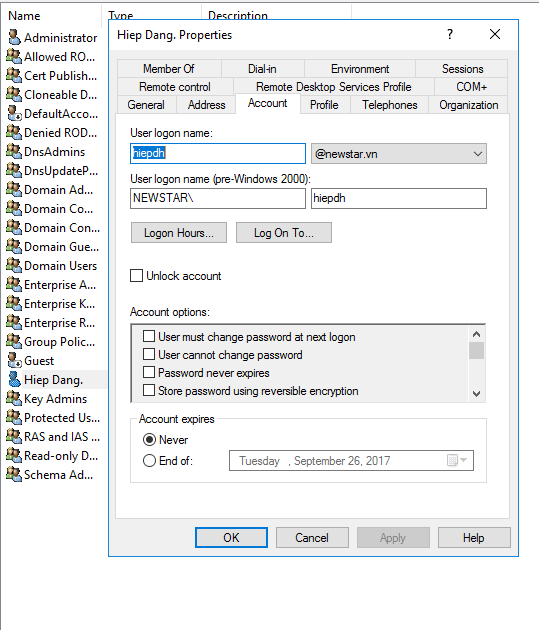

---

# PHẦN 2: CẤU HÌNH TRÊN MÁY CLIENT WIN 7 (1) GIA NHẬP DOMAIN (JOIN DOMAIN)

### BƯỚC 1: KIỂM TRA ĐẶT IP VÀ TRỎ DNS VỀ DOMAIN CONTROLLER
1. Trên máy **Win 7 (1)**, mở `ncpa.cpl` (Network Connections).
2. Chuột phải vào card mạng ➔ **Properties** ➔ **Internet Protocol Version 4 (TCP/IPv4)**.
3. Thiết lập thông số:
   * **IP address**: `192.168.11.2`
   * **Subnet mask**: `255.255.255.0`
   * **Default gateway**: `192.168.11.1`
   * **Preferred DNS server**: **`192.168.11.1`** *(QUAN TRỌNG NHẤT: Bắt buộc phải trỏ đúng về IP của Server để phân giải được tên miền newstar.vn)*.
4. Bấm **OK** ➔ **OK**.
5. Mở CMD trên Win 7, gõ kiểm tra: `ping newstar.vn` ➔ Phải thấy phản hồi từ `192.168.11.1` là chuẩn 100%!

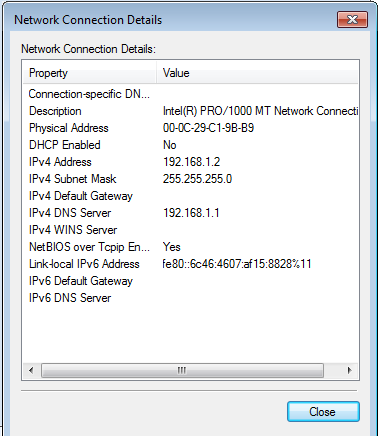

---

### BƯỚC 2: TIẾN HÀNH GIA NHẬP DOMAIN (JOIN DOMAIN)
1. Trên máy **Win 7 (1)**, nhấp chuột phải vào biểu tượng **Computer** (trên Desktop hoặc Start Menu) ➔ Chọn **`Properties`**.
2. Tại mục *Computer name, domain, and workgroup settings*, bấm vào dòng chữ màu xanh: **`Change settings`**.
3. Hộp thoại *System Properties* hiện ra, bấm vào nút **`Change...`** ở phía dưới.
4. Tại mục **Member of**:
   * Tích chọn vào ô: **`Domain`**.
   * Nhập tên miền: **`newstar.vn`**.
   * Bấm nút **OK**.

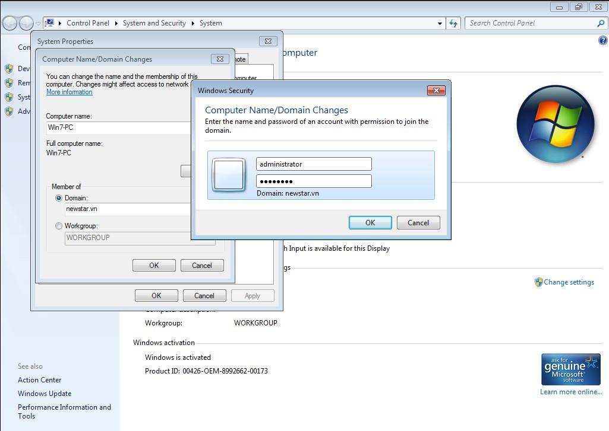

5. Hộp thoại **Windows Security** hiện lên yêu cầu xác thực tài khoản có quyền gia nhập Domain:
   * **User name**: **`administrator`** (hoặc `newstar.vn\administrator`)
   * **Password**: **`123`** (hoặc mật khẩu Administrator của Server).
   * Bấm **OK**.
6. Khi thấy thông báo: **`Welcome to the newstar.vn domain.`** ➔ Bấm **OK**.
7. Bấm **OK** tiếp theo thông báo khởi động lại ➔ Bấm **Close** ➔ Bấm **`Restart Now`** để khởi động lại máy Win 7.

---

### BƯỚC 3: ĐĂNG NHẬP BẰNG TÀI KHOẢN DOMAIN TRÊN CLIENT WIN 7
1. Sau khi máy Win 7 khởi động lại, tại màn hình đăng nhập:
2. Nhấn nút **`Switch User`** ➔ Chọn **`Other User`**.
3. Quan sát thấy dòng chữ: **`Log on to: NEWSTAR`**.
4. Nhập thông tin tài khoản Domain:
   * **User name**: **`hiepdh`** (hoặc `newstar\hiepdh`)
   * **Password**: **`123`** (hoặc `abc@123`)
5. Nhấn **Enter** ➔ Máy Win 7 sẽ chuẩn bị màn hình Desktop mới cho tài khoản Domain User!

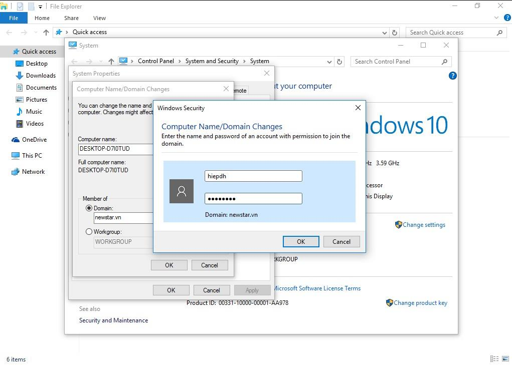

---

# PHẦN 3: CẤU HÌNH TRÊN MÁY CLIENT WIN 7 (2) (HOẶC WIN 8/10) GIA NHẬP DOMAIN

### BƯỚC 1: ĐẶT IP VÀ DNS TRÊN WIN 7 (2) (DẢI MẠNG VMNET12)
1. Trên máy **Win 7 (2)**, mở card mạng đặt IP tĩnh:
   * **IP address**: `100.100.11.2`
   * **Subnet mask**: `255.255.255.0`
   * **Default gateway**: `100.100.11.1`
   * **Preferred DNS server**: **`100.100.11.1`** (hoặc `192.168.11.1`).
2. Mở CMD test: `ping newstar.vn` ➔ Có phản hồi thành công.

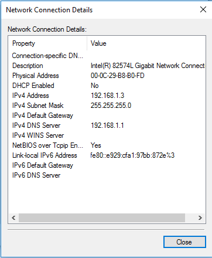

---

### BƯỚC 2: JOIN DOMAIN VÀ ĐĂNG NHẬP TRÊN CLIENT 2
1. Mở **Computer Properties** ➔ **Change settings** ➔ **Change...**.
2. Tích chọn **Domain**: Nhập `newstar.vn` ➔ Bấm **OK**.
3. Nhập tài khoản quản trị Domain: `administrator` / pass `123`.
4. Báo **Welcome to the newstar.vn domain** ➔ Restart máy.
5. Sau khi khởi động lại, đăng nhập bằng tài khoản:
   * **`NEWSTAR\Administrator`** (Mật khẩu: `123`)
   * Hoặc tài khoản **`hiepdh`** (Mật khẩu: `123`).

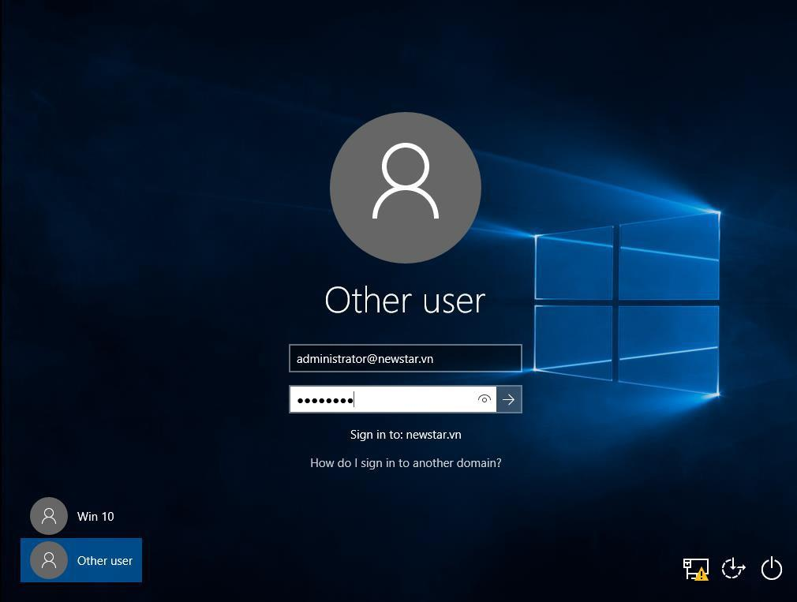

---

# PHẦN 4: KIỂM TRA TOÀN BỘ KẾT QUẢ TRÊN DOMAIN CONTROLLER (CHỤP HÌNH BÁO CÁO)

1. Trên máy **Windows Server**, mở **Server Manager** ➔ **Tools** ➔ **Active Directory Users and Computers** (`dsa.msc`).
2. Mở rộng `newstar.vn` ➔ Nhấp vào thư mục **`Computers`**.
3. **Minh chứng điểm 10**: Trong danh sách bên phải sẽ hiển thị đầy đủ tên của các máy Client đã gia nhập Domain thành công (ví dụ: `WIN7-PC1`, `WIN7-PC2` hoặc `DESKTOP-...`).

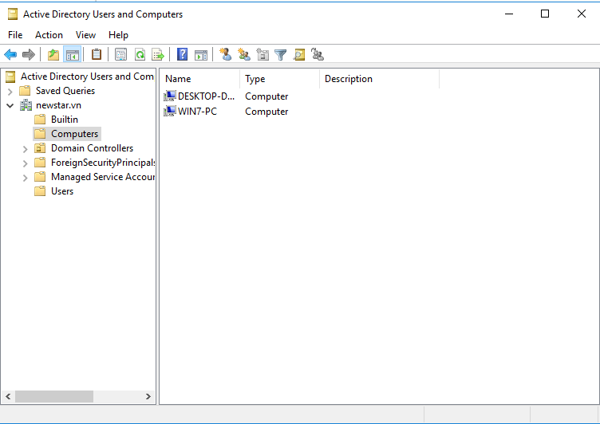
