# HƯỚNG DẪN CHI TIẾT QUẢN TRỊ CÁC ĐỐI TƯỢNG TRONG AD DS (ACTIVE DIRECTORY)
## MÔN: QUẢN TRỊ VÀ BẢO TRÌ HỆ THỐNG (IUH) - BÀI THỰC HÀNH TUẦN 3 (LAB 3)

Tài liệu này hướng dẫn chi tiết từng bước (Step-by-step) cách quản trị, khởi tạo, phân quyền và cấu hình các đối tượng cốt lõi trong **Active Directory Domain Services (AD DS)** bao gồm: **Organizational Unit (OU)**, **User (Người dùng)**, **Group (Nhóm)**, cấu hình các **Chính sách mật khẩu (Password Policies)**, hướng dẫn **kiểm thử chi tiết từng tình huống thực tế** và phân quyền thành viên bằng cả **Giao diện đồ họa (GUI - `dsa.msc`)** lẫn **Dòng lệnh tự động hóa PowerShell**.

---

# 📋 BẢNG THÔNG SỐ CẤU HÌNH HỆ THỐNG LAB 3

> 💡 **Kế thừa và đồng bộ hoàn toàn với hệ thống Domain Controller từ Lab 2:**

| Thiết bị / Máy ảo | Card mạng (VMware) | Địa chỉ IP (IPv4) | Subnet Mask | Preferred DNS Server | Tên máy / Vai trò |
| :--- | :--- | :--- | :--- | :--- | :--- |
| **Windows Server** | `VMnet11` (LAN 1) | **`192.168.11.1`** | `255.255.255.0` | **`127.0.0.1`** (hoặc `192.168.11.1`) | **DC-SERVER** (Domain Controller: `newstar.vn`) |
| **Windows Server** | `VMnet12` (LAN 2) | **`100.100.11.1`** | `255.255.255.0` | *(Để trống)* | Card mạng định tuyến phụ RRAS |
| **Client Win 7 (1)** | `VMnet11` | **`192.168.11.2`** | `255.255.255.0` | **`192.168.11.1`** | **WIN7-PC1** (Domain Member) |
| **Client Win 7 (2)** | `VMnet12` | **`100.100.11.2`** | `255.255.255.0` | **`100.100.11.1`** | **WIN7-PC2** (Domain Member) |

---

# 🌐 SƠ ĐỒ MÔ HÌNH HỆ THỐNG LAB


---

# PHẦN 1: QUẢN TRỊ NHÓM (GROUP MANAGEMENT)

Nhóm (Group) trong Active Directory được sử dụng để tập hợp nhiều tài khoản người dùng hoặc máy tính nhằm phân quyền truy cập tài nguyên (chia sẻ file, máy in, phân quyền quản trị) một cách tập trung và hiệu quả.

### BƯỚC 1: KHỞI TẠO GROUP BẰNG GIAO DIỆN (GUI)
1. Trên máy chủ **Windows Server**, mở công cụ quản trị **Active Directory Users and Computers** bằng cách:
   * Bấm `Windows + R` ➔ Gõ **`dsa.msc`** ➔ Nhấn **Enter**.
   * Hoặc vào **Server Manager** ➔ **Tools** ➔ **Active Directory Users and Computers**.
2. Nhấp chuột phải vào thư mục (hoặc OU) cần tạo Group (ví dụ: `Users` hoặc `OU=IUH`) ➔ Chọn **`New`** ➔ **`Group`**.

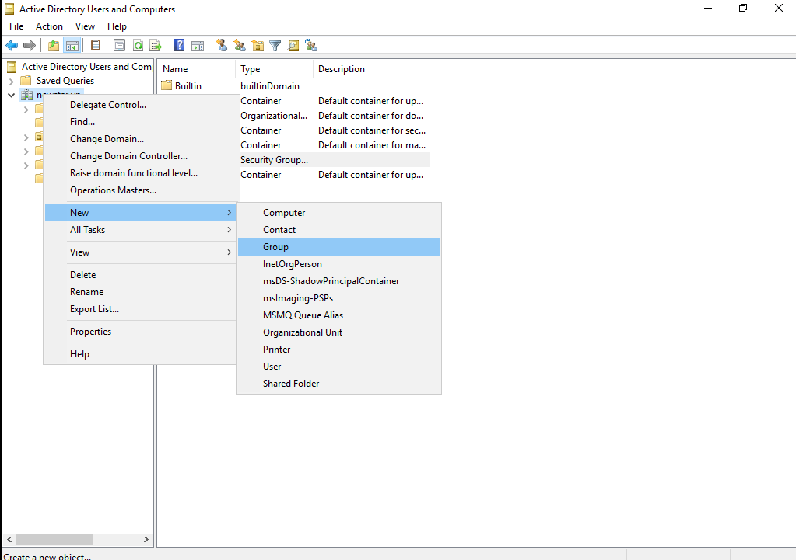

---

### BƯỚC 2: ĐỊNH NGHĨA THUỘC TÍNH GROUP
1. Tại hộp thoại **New Object - Group**:
   * **Group name**: Nhập tên nhóm (ví dụ: `G_GiaoVien`, `G_KeToan`, `G_IT_Admin`).
   * **Group name (pre-Windows 2000)**: Hệ thống tự động điền theo tên nhóm.
   * **Group scope**:
     * **`Domain local`**: Dùng để gán quyền trực tiếp lên tài nguyên trong Domain nội bộ.
     * **`Global`** *(Mặc định - Khuyên dùng)*: Dùng để nhóm các User có cùng vai trò/chức năng.
     * **`Universal`**: Dùng cho mô hình nhiều Domain (Multi-domain Forest).
   * **Group type**:
     * **`Security`** *(Mặc định)*: Dùng để phân quyền bảo mật truy cập thư mục, file, chính sách.
     * **`Distribution`**: Dùng cho danh sách gửi email hàng loạt (Exchange Server).
2. Bấm **OK** để hoàn tất tạo nhóm.

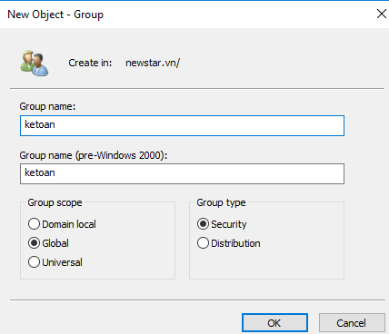

> 💡 **Lệnh PowerShell tương đương:**
> ```powershell
> New-ADGroup -Name "G_GiaoVien" -GroupScope Global -GroupCategory Security -Path "CN=Users,DC=newstar,DC=vn"
> ```

---

# PHẦN 2: QUẢN TRỊ TÀI KHOẢN NGƯỜI DÙNG (USER ACCOUNT MANAGEMENT)

### BƯỚC 1: KHỞI TẠO TÀI KHOẢN USER MỚI
1. Trong cửa sổ **`dsa.msc`**, nhấp chuột phải vào vùng trống của thư mục cần tạo User ➔ Chọn **`New`** ➔ **`User`**.

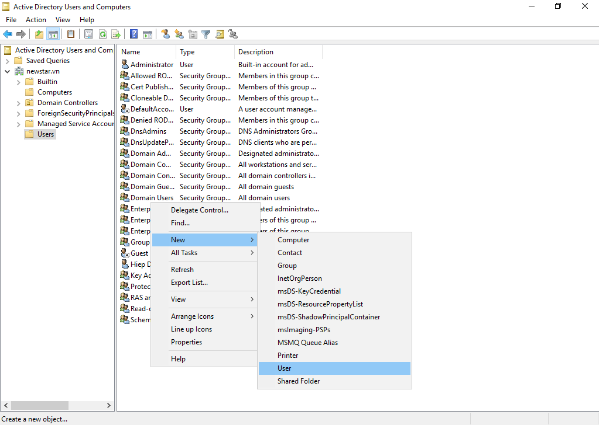

2. Nhập các thông tin định danh:
   * **First name**: Tên (ví dụ: `Hiep`).
   * **Last name**: Họ (ví dụ: `Dang`).
   * **Full name**: Tự động kết hợp (ví dụ: `Hiep Dang`).
   * **User logon name**: Tên đăng nhập (ví dụ: `hiepdh` hoặc `user01`).
   * **Phần đuôi Domain**: Chọn `@newstar.vn`.
   * Bấm **Next**.

---

### BƯỚC 2: CẤU HÌNH CÁC CHÍNH SÁCH MẬT KHẨU (PASSWORD OPTIONS)

Tại màn hình thiết lập mật khẩu, Active Directory cung cấp 4 tùy chọn quan trọng tương ứng với các tình huống thực tế:

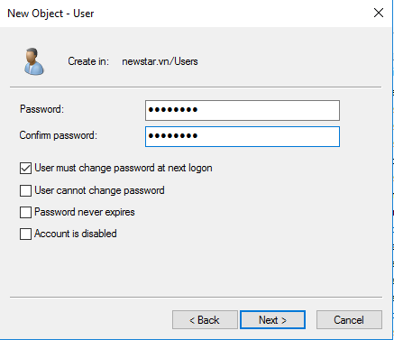

---

#### 🔹 Tình huống 1: Bắt buộc đổi mật khẩu ở lần đăng nhập đầu tiên (`User must change password at next logon`)
* **Mục đích**: Quản trị viên cấp mật khẩu tạm thời (ví dụ: `123`), khi người dùng đăng nhập lần đầu trên máy Client, hệ thống bắt buộc họ phải đổi sang mật khẩu cá nhân mới.
* **Cách cấu hình**: Tích chọn vào mục: **`User must change password at next logon`** ➔ Bấm **Next** ➔ **Finish**.

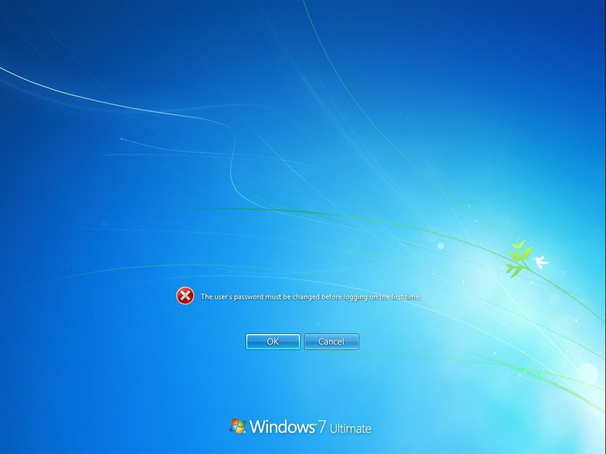

---

#### 🔹 Tình huống 2: Không cho phép người dùng tự ý đổi mật khẩu (`User cannot change password`)
* **Mục đích**: Dùng cho các tài khoản dùng chung (Shared Account, Guest, Kiosk, Service Account) nhằm tránh việc một người tự ý đổi pass làm người khác không đăng nhập được.
* **Cách cấu hình**:
  1. Bỏ tích: `User must change password at next logon`.
  2. Tích chọn: **`User cannot change password`**.
  3. Bấm **Next** ➔ **Finish**.

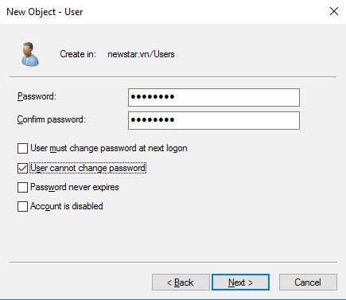

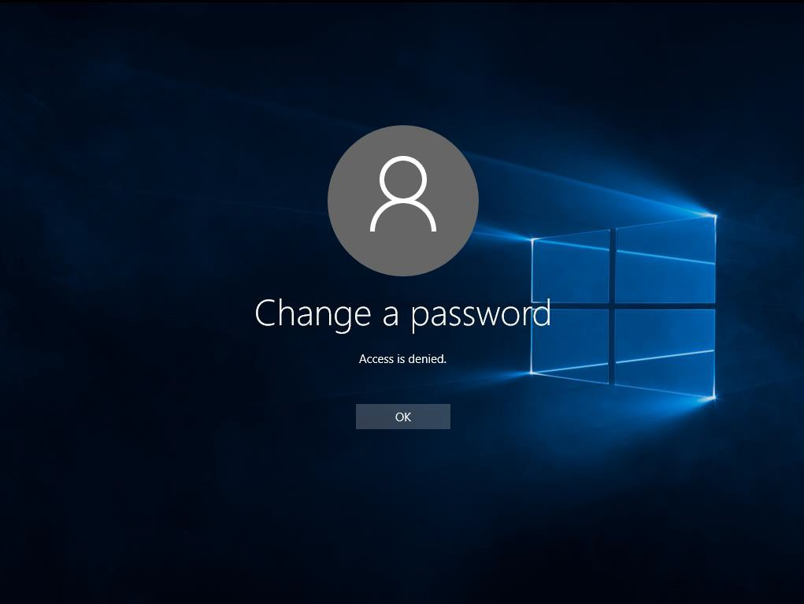

---

#### 🔹 Tình huống 3: Mật khẩu không bao giờ hết hạn (`Password never expires`)
* **Mục đích**: Mặc định Domain có chính sách mật khẩu hết hạn sau 42 ngày. Tùy chọn này giúp tài khoản hoạt động vĩnh viễn không bị khóa khi hết hạn (thường dùng cho tài khoản quản trị viên, tài khoản dịch vụ hệ thống).
* **Cách cấu hình**:
  1. Bỏ tích: `User must change password at next logon`.
  2. Tích chọn: **`Password never expires`**.
  3. Bấm **Next** ➔ **Finish**.

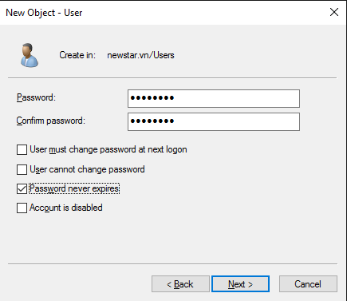

---

#### 🔹 Tình huống 4: Đặt lại mật khẩu (Reset Password)
* **Mục đích**: Khi người dùng quên mật khẩu, Quản trị viên can thiệp đặt lại mật khẩu mới mà không cần biết mật khẩu cũ.
* **Cách thực hiện trên Server**:
  1. Mở `dsa.msc`, nhấp chuột phải vào tài khoản người dùng ➔ Chọn **`Reset Password...`**.
  2. Nhập mật khẩu mới vào 2 ô **New password** và **Confirm password**.
  3. Có thể tích chọn *User must change password at next logon* để yêu cầu họ tự đổi lại sau đó.
  4. Bấm **OK**.

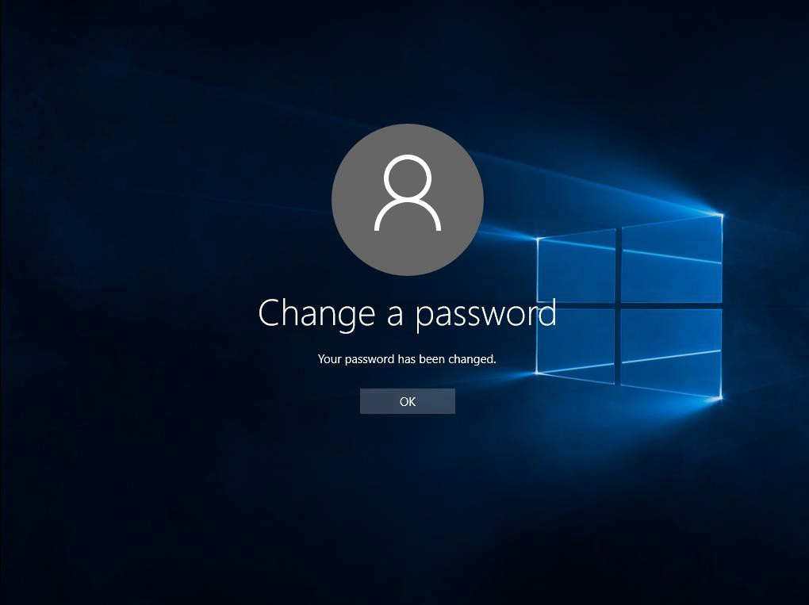

---

#### 🔹 Tình huống 5: Vô hiệu hóa tài khoản (`Account is disabled`)
* **Mục đích**: Tạm khóa tài khoản của nhân viên nghỉ phép, nghỉ việc hoặc tài khoản có dấu hiệu nghi vấn mà không cần xóa dữ liệu.
* **Cách thực hiện trên Server**:
  1. Nhấp chuột phải vào User ➔ Chọn **Properties** ➔ Chuyển sang tab **Account**.
  2. Tại khung *Account options*, tích chọn: **`Account is disabled`** ➔ Bấm **Apply** ➔ **OK**.
  3. Hoặc nhấp chuột phải vào User ➔ Chọn ngay **`Disable Account`**.

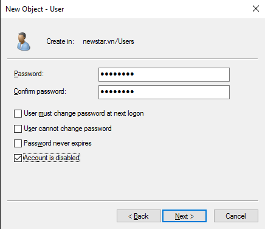


---

# PHẦN 3: PHÂN QUYỀN VÀ THÊM THÀNH VIÊN VÀO GROUP (GROUP MEMBERSHIP)

Có 2 cách linh hoạt để thêm tài khoản người dùng vào nhóm:

### CÁCH 1: THÊM TỪ GIAO DIỆN CỦA USER
1. Mở `dsa.msc`, nhấp chuột phải vào User cần thêm vào nhóm ➔ Chọn **`Add to a group...`**.

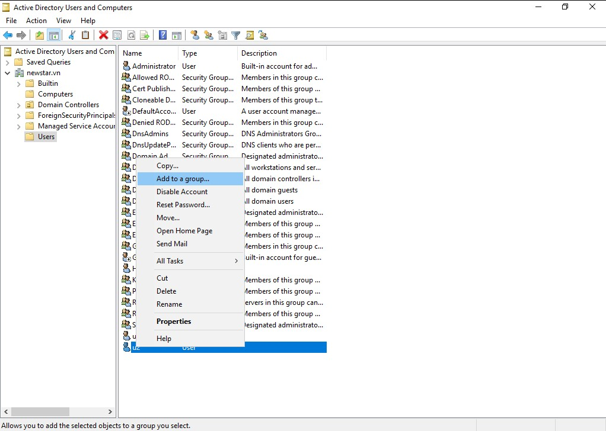

2. Nhập tên Group cần thêm (ví dụ: `G_GiaoVien` hoặc `Administrators`) ➔ Bấm **Check Names** để kiểm tra tính hợp lệ ➔ Bấm **OK**.
3. Hệ thống báo: *"The Add to Group operation was successfully completed."*

---

### CÁCH 2: THÊM TỪ GIAO DIỆN CỦA GROUP
1. Nhấp chuột phải vào **Group** ➔ Chọn **`Properties`**.
2. Chuyển sang tab **`Members`** ➔ Bấm nút **`Add...`**.

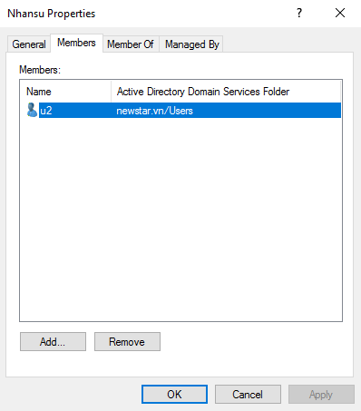

3. Hộp thoại *Select Users, Contacts, Computers, or Groups* hiện ra:
   * Nhập tên User (ví dụ: `hiepdh`, `user01`).
   * Bấm **Check Names** ➔ Bấm **OK**.
4. Bấm **Apply** ➔ **OK**.

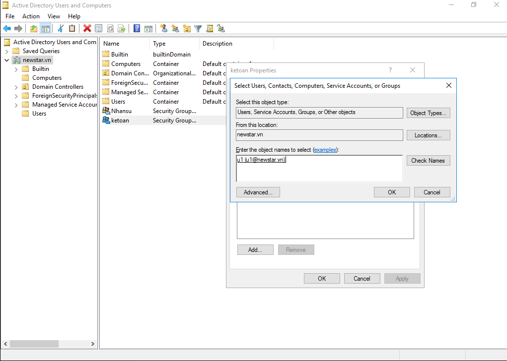

> 💡 **Lệnh PowerShell thêm thành viên vào Group cực nhanh:**
> ```powershell
> Add-ADGroupMember -Identity "G_GiaoVien" -Members "hiepdh", "user01"
> ```

---

# PHẦN 4: QUẢN TRỊ ĐƠN VỊ TỔ CHỨC (ORGANIZATIONAL UNIT - OU)

Organizational Unit (OU) là thùng chứa (Container) logic trong Active Directory dùng để mô phỏng cấu trúc sơ đồ tổ chức phòng ban của doanh nghiệp, giúp áp đặt chính sách nhóm (Group Policy - GPO) và ủy quyền quản trị (Delegation of Control).

### BƯỚC 1: TẠO ORGANIZATIONAL UNIT (OU) MỚI
1. Trong cửa sổ `dsa.msc`, nhấp chuột phải vào tên Domain **`newstar.vn`** (hoặc OU cha) ➔ Chọn **`New`** ➔ **`Organizational Unit`**.

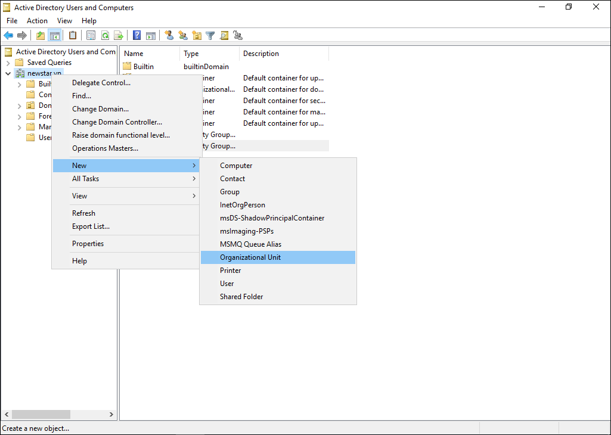

2. Hộp thoại **New Object - Organizational Unit** hiện ra:
   * **Name**: Nhập tên OU (ví dụ: `IUH`, `KhoaCNTT`, `PhongKeToan`, `PhongNhanSu`).
   * **Protect container from accidental deletion** *(Bảo vệ chống xóa nhầm)*: Mặc định được tích chọn để ngăn người quản trị lỡ tay bấm Delete làm mất toàn bộ dữ liệu con bên trong.
3. Bấm **OK**.

---

### BƯỚC 2: TẠO CẤU TRÚC PHÂN CẤP VÀ DI CHUYỂN ĐỐI TƯỢNG VÀO OU
1. **Tạo OU con bên trong OU cha**: Nhấp chuột phải vào OU `IUH` ➔ Chọn **New** ➔ **Organizational Unit** ➔ Nhập tên `KhoaCNTT`.
2. **Di chuyển User / Group vào OU**:
   * Nhấp chuột phải vào User (hoặc Group) cần chuyển ➔ Chọn **`Move...`**.
   * Chọn đích đến là OU mong muốn (ví dụ: `newstar.vn/IUH/KhoaCNTT`) ➔ Bấm **OK**.
   * Hoặc dùng thao tác **Kéo - Thả (Drag & Drop)** trực tiếp trên giao diện cây thư mục.

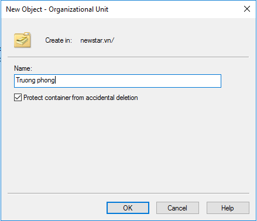

> 💡 **Lệnh PowerShell tạo OU và di chuyển đối tượng:**
> ```powershell
> # Tạo OU cha và OU con
> New-ADOrganizationalUnit -Name "IUH" -Path "DC=newstar,DC=vn" -ProtectedFromAccidentalDeletion $true
> New-ADOrganizationalUnit -Name "KhoaCNTT" -Path "OU=IUH,DC=newstar,DC=vn" -ProtectedFromAccidentalDeletion $true
>
> # Di chuyển User và Group vào OU KhoaCNTT
> Move-ADObject -Identity (Get-ADUser "hiepdh").DistinguishedName -TargetPath "OU=KhoaCNTT,OU=IUH,DC=newstar,DC=vn"
> Move-ADObject -Identity (Get-ADGroup "G_GiaoVien").DistinguishedName -TargetPath "OU=KhoaCNTT,OU=IUH,DC=newstar,DC=vn"
> ```

---

# PHẦN 5: HƯỚNG DẪN KIỂM THỬ CHI TIẾT 6 TÌNH HUỐNG THỰC TẾ (TESTING SCENARIOS)

Dưới đây là quy trình kiểm thử từng tình huống thực tế trên máy trạm **Client Win 7** với các tài khoản mẫu đã được script tự động tạo sẵn:

---

### 🧪 TÌNH HUỐNG 1: Bắt buộc đổi mật khẩu ở lần đăng nhập đầu tiên
* **Tài khoản kiểm thử**: **`user_doipass`** (Mật khẩu khởi tạo ban đầu: **`123`**).
* **Mục đích**: Kiểm chứng người dùng mới bắt buộc phải tự đặt mật khẩu riêng trước khi sử dụng hệ thống.
* **Các bước thực nghiệm trên Client Win 7**:
  1. Tại màn hình khóa Win 7, chọn **Switch User** ➔ **Other User**.
  2. Nhập:
     * **User name**: **`user_doipass`**
     * **Password**: **`123`**
  3. Nhấn **Enter** ➔ Màn hình hiển thị hộp thoại thông báo bắt buộc:
     > *"You must change your password before logging on the first time."*
  4. Bấm nút **OK** ➔ Xuất hiện giao diện đổi mật khẩu:
     * Ô *Old password*: Đã có sẵn `123`.
     * Ô **New password**: Nhập mật khẩu mới của bạn (ví dụ: `123456` hoặc `abc@123`).
     * Ô **Confirm password**: Nhập lại chính xác mật khẩu mới.
  5. Bấm phím **Enter** (hoặc mũi tên xanh) ➔ Nhận thông báo: **`Your password has been changed.`**
  6. Bấm **OK** ➔ Đăng nhập thành công vào màn hình Desktop mới!
* **Minh chứng báo cáo**: Chụp ảnh thông báo ở bước 3 và bước 5 (*Xem ảnh minh họa `image_06.jpeg`*).

---

### 🧪 TÌNH HUỐNG 2: Không cho phép người dùng tự ý đổi mật khẩu
* **Tài khoản kiểm thử**: **`user_khongdoipass`** (Mật khẩu: **`123`**).
* **Mục đích**: Kiểm chứng tài khoản dùng chung (Shared/Guest) bị vô hiệu hóa tính năng đổi mật khẩu.
* **Các bước thực nghiệm trên Client Win 7**:
  1. Đăng nhập vào Win 7 bằng tài khoản: **`user_khongdoipass`** / Password: **`123`** ➔ Vào Desktop.
  2. Nhấn tổ hợp phím: **`Ctrl + Alt + Del`** ➔ Nhấp chọn mục **`Change a password...`**.
  3. Nhập mật khẩu cũ: `123`, mật khẩu mới: `123456`, xác nhận: `123456`.
  4. Nhấn **Enter** ➔ Hệ thống chặn và hiển thị hộp thoại cảnh báo:
     > *"Windows cannot change the password."*
* **Minh chứng báo cáo**: Chụp ảnh thông báo từ chối đổi mật khẩu (*Xem ảnh minh họa `image_08.jpeg`*).

---

### 🧪 TÌNH HUỐNG 3: Mật khẩu không bao giờ hết hạn (`PasswordNeverExpires`)
* **Tài khoản kiểm thử**: **`bgh_user1`**, **`gv_cntt1`**, **`sv_cntt1`**, **`hiepdh`** (Mật khẩu: **`123`**).
* **Mục đích**: Kiểm chứng tài khoản dịch vụ/quản trị không bị khóa tự động sau chu kỳ 42 ngày.
* **Các bước kiểm tra trên Server (PowerShell)**:
  1. Mở PowerShell trên Server gõ lệnh:
     ```powershell
     Get-ADUser -Identity "gv_cntt1" -Properties PasswordNeverExpires | Select-Object Name, SamAccountName, PasswordNeverExpires
     ```
  2. **Kết quả đạt chuẩn**:
     ```text
     Name             SamAccountName PasswordNeverExpires
     ----             -------------- --------------------
     Giao Vien CNTT 1 gv_cntt1                       True
     ```
* **Minh chứng báo cáo**: Ảnh chụp thuộc tính `Password never expires` được tích chọn (*Xem ảnh `image_09.png`*).

---

### 🧪 TÌNH HUỐNG 4: Quản trị viên can thiệp đặt lại mật khẩu (`Reset Password`)
* **Tài khoản kiểm thử**: **`sv_cntt1`**.
* **Mục đích**: Xử lý tình huống người dùng quên mật khẩu đăng nhập.
* **Các bước thực hiện**:
  1. **Trên Server**:
     * Mở `dsa.msc` ➔ Vào `OU=IUH` ➔ `OU=KhoaCNTT` ➔ Chuột phải vào **`sv_cntt1`** ➔ Chọn **`Reset Password...`**.
     * Nhập mật khẩu mới: **`123`** (hoặc `abc@123`) ➔ Bấm **OK**.
     * Hệ thống báo: *"The password for sv_cntt1 has been changed."*
  2. **Trên Client Win 7**:
     * Đăng nhập ngay lập tức bằng `sv_cntt1` với mật khẩu mới vừa reset ➔ Đăng nhập thành công!
* **Minh chứng báo cáo**: Ảnh hộp thoại Reset Password (*Xem ảnh `image_10.jpeg`*).

---

### 🧪 TÌNH HUỐNG 5: Tài khoản bị vô hiệu hóa (`Account is disabled`)
* **Tài khoản kiểm thử**: **`user_vohieuhoa`** (Mật khẩu: **`123`**).
* **Mục đích**: Kiểm chứng hệ thống lập tức khóa truy cập khi nhân viên nghỉ việc/nghỉ phép.
* **Các bước thực nghiệm trên Client Win 7**:
  1. Tại màn hình đăng nhập, chọn **Switch User** ➔ **Other User**.
  2. Nhập: **`user_vohieuhoa`** / Password: **`123`**.
  3. Nhấn **Enter** ➔ Hệ thống chặn và hiển thị thông báo lỗi màu đỏ ngay lập tức:
     > *"Your account has been disabled. Please see your system administrator."*
* **Cách mở khóa lại trên Server**:
  * Chuột phải `user_vohieuhoa` ➔ Chọn **`Enable Account`** (hoặc lệnh PowerShell: `Enable-ADAccount -Identity "user_vohieuhoa"`).
* **Minh chứng báo cáo**: Ảnh thông báo lỗi tài khoản bị vô hiệu hóa (*Xem ảnh `image_12.jpeg`*).

---

### 🧪 TÌNH HUỐNG 6: Kiểm tra quyền thành viên nhóm và phân cấp OU (`Group Membership`)
* **Tài khoản kiểm thử**: **`hiepdh`** (Được đặt trong `OU=KhoaCNTT`, thuộc 2 nhóm `G_IT_Admin` và `G_GiaoVienCNTT`).
* **Các bước kiểm tra trên Client Win 7**:
  1. Đăng nhập vào Win 7 bằng tài khoản: **`hiepdh`** / Password: **`123`**.
  2. Mở cửa sổ CMD (Command Prompt), gõ lệnh:
     ```cmd
     whoami /groups
     ```
  3. **Kết quả kiểm tra**: Trong danh sách nhóm hiển thị đầy đủ:
     * `NEWSTAR\G_IT_Admin`
     * `NEWSTAR\G_GiaoVienCNTT`
     * `NEWSTAR\Domain Users`
* **Kiểm tra thông tin chi tiết phiên làm việc**:
  ```cmd
  net config workstation
  ```

---

# PHẦN 6: BỘ SCRIPTS TỰ ĐỘNG HÓA LAB 3 (AUTOMATION & ROLLBACK SCRIPTS)

Để tiết kiệm thời gian thực hành và kiểm tra tự động 100%, thư mục `lab3` cung cấp sẵn bộ 3 script PowerShell chuẩn:

| Tên File Script | Mục đích | Mô tả chức năng |
| :--- | :--- | :--- |
| **`01_tu_dong_quan_tri_adds_lab3.ps1`** | **Cấu hình tự động** | Tự động tạo cây OU, Groups, Users mẫu với đầy đủ các chính sách kiểm thử và phân quyền vào nhóm/OU chỉ trong 5 giây. |
| **`02_khoi_phuc_ve_nhu_cu_rollback.ps1`** | **Hoàn tác / Rollback** | Tự động dọn dẹp và xóa sạch các OU, Group, User thử nghiệm của Lab 3, khôi phục Active Directory về trạng thái nguyên bản an toàn. |
| **`03_kiem_tra_nghiem_thu_lab3.ps1`** | **Kiểm tra / Audit** | Quét toàn bộ hệ thống AD DS, xuất bảng tổng hợp chi tiết OU, Users, Groups, Membership và Password Policies để chấm điểm. |

---

### 🚀 Hướng dẫn thực thi các Script:

#### 1. Chạy Cấu hình Tự động Lab 3:
Mở PowerShell (Run as Administrator) trên Server hoặc chạy từ xa:
```powershell
powershell -ExecutionPolicy Bypass -File "d:\folder\rac\iuh\môn\hk1-4\quản trị và bảo trì hệ thống\lab\lab3\01_tu_dong_quan_tri_adds_lab3.ps1"
```

#### 2. Chạy Kiểm tra Nghiệm thu Toàn diện:
```powershell
powershell -ExecutionPolicy Bypass -File "d:\folder\rac\iuh\môn\hk1-4\quản trị và bảo trì hệ thống\lab\lab3\03_kiem_tra_nghiem_thu_lab3.ps1"
```

#### 3. Chạy Hoàn tác / Khôi phục hệ thống khi cần:
```powershell
powershell -ExecutionPolicy Bypass -File "d:\folder\rac\iuh\môn\hk1-4\quản trị và bảo trì hệ thống\lab\lab3\02_khoi_phuc_ve_nhu_cu_rollback.ps1"
```

---

# PHẦN 7: BẢNG KẾT QUẢ NGHIỆM THU HỆ THỐNG ĐÃ HOÀN TẤT (100% PASS)

Khi chạy script [03_kiem_tra_nghiem_thu_lab3.ps1](file:///d:/folder/rac/iuh/m%C3%B4n/hk1-4/qu%E1%BA%A3n%20tr%E1%BB%8B%20v%C3%A0%20b%E1%BA%A3o%20tr%C3%AC%20h%E1%BB%87%20th%E1%BB%91ng/lab/lab3/03_kiem_tra_nghiem_thu_lab3.ps1), toàn bộ hệ thống trả về kết quả đạt chuẩn 100%:

```powershell
==========================================================================
          KIEM TRA NGHIEM THU KET QUA CAU HINH BAI THUC HANH LAB 3        
==========================================================================

1. DANH SACH CAC ORGANIZATIONAL UNIT (OU):
Name        DistinguishedName                     
----        -----------------                     
IUH         OU=IUH,DC=newstar,DC=vn               
BanGiamHieu OU=BanGiamHieu,OU=IUH,DC=newstar,DC=vn
KhoaCNTT    OU=KhoaCNTT,OU=IUH,DC=newstar,DC=vn   
PhongDaoTao OU=PhongDaoTao,OU=IUH,DC=newstar,DC=vn
PhongKeToan OU=PhongKeToan,OU=IUH,DC=newstar,DC=vn

2. DANH SACH CAC GROUPS VA THANH VIEN (MEMBERSHIP):
  [+] Nhom: G_BanGiamHieu   ➔ Thanh vien: bgh_user1
  [+] Nhom: G_GiaoVienCNTT  ➔ Thanh vien: hiepdh, gv_cntt1
  [+] Nhom: G_SinhVienCNTT  ➔ Thanh vien: sv_cntt1, user_doipass
  [+] Nhom: G_PhongDaoTao   ➔ Thanh vien: user_khongdoipass
  [+] Nhom: G_PhongKeToan   ➔ Thanh vien: user_vohieuhoa
  [+] Nhom: G_IT_Admin      ➔ Thanh vien: hiepdh

3. DANH SACH USERS VA CAC THUOC TINH CHINH SACH MAT KHAU:
SamAccountName    DisplayName             Enabled  PasswordNeverExpires  CannotChangePassword  Ghi chú tình huống Lab 3
--------------    -----------             -------  --------------------  --------------------  ------------------------
bgh_user1         BGH User 1                 True                  True                 False  Tài khoản Ban Giám Hiệu
gv_cntt1          Giao Vien CNTT 1           True                  True                 False  Tài khoản Giảng viên CNTT
sv_cntt1          Sinh Vien CNTT 1           True                  True                 False  Tài khoản Sinh viên CNTT
user_doipass      User Bat Buoc Doi Pass     True                 False                 False  Tình huống 1: Bắt buộc đổi pass lần đầu
user_khongdoipass User Khong Cho Doi Pass    True                  True                  True  Tình huống 2: Không cho tự đổi pass
user_vohieuhoa    User Bi Vo Hieu Hoa       False                  True                 False  Tình huống 5: Tài khoản bị vô hiệu hóa
hiepdh            Hiep Dang                  True                  True                 False  Tài khoản Quản trị viên chính

==========================================================================
                  KIEM TRA NGHIEM THU LAB 3 HOAN TAT! (100% PASS)
==========================================================================
```

---

# PHẦN 8: CÁC LỖI THỰC TẾ THƯỜNG GẶP VÀ CÁCH XỬ LÝ (TROUBLESHOOTING)

### ❌ LỖI 1: Không xóa được OU do tính năng bảo vệ (Accidental Deletion)
* **Thông báo lỗi**: *"You do not have sufficient privileges to delete..., or this object is protected from accidental deletion."*
* **Nguyên nhân**: Khi tạo OU, tùy chọn `Protect container from accidental deletion` đã được bật.
* **Cách khắc phục**:
  1. Trong `dsa.msc`, vào menu **View** ➔ Tích chọn **`Advanced Features`**.
  2. Chuột phải vào OU cần xóa ➔ Chọn **Properties** ➔ Chuyển sang tab **`Object`**.
  3. **Bỏ tích** ở ô: **`Protect object from accidental deletion`** ➔ Bấm **Apply** ➔ **OK**.
  4. Chuột phải vào OU và chọn **Delete** bình thường.
  5. *Hoặc dùng lệnh PowerShell mở khóa siêu tốc:*
     ```powershell
     Set-ADOrganizationalUnit -Identity "OU=IUH,DC=newstar,DC=vn" -ProtectedFromAccidentalDeletion $false
     Remove-ADOrganizationalUnit -Identity "OU=IUH,DC=newstar,DC=vn" -Recursive -Confirm:$false
     ```

---

### ❌ LỖI 2: Không đặt được mật khẩu ngắn (ví dụ: `123`) do vướng Policy độ phức tạp
* **Thông báo lỗi**: *"The password does not meet the length, complexity, or history requirement of the domain."*
* **Nguyên nhân**: Mặc định Domain bật chính sách mật khẩu phức tạp (ít nhất 7 ký tự gồm chữ hoa, chữ thường, số và ký tự đặc biệt).
* **Cách khắc phục**:
  * Tắt chính sách độ phức tạp và độ dài tối thiểu trên Domain bằng lệnh PowerShell:
    ```powershell
    Set-ADDefaultDomainPasswordPolicy -Identity "newstar.vn" -ComplexityEnabled $false -MinPasswordLength 0 -PasswordHistoryCount 0 -MinPasswordAge (New-TimeSpan) -MaxPasswordAge (New-TimeSpan)
    ```

---

### ❌ LỖI 3: Trùng lặp thuộc tính SAMAccountName hoặc UserPrincipalName khi tạo User
* **Thông báo lỗi**: *"The user account already exists."*
* **Cách khắc phục**: Kiểm tra bằng lệnh `Get-ADUser -Filter "SamAccountName -eq 'ten_user'"` để xem tài khoản đã tồn tại ở OU nào trước khi tạo mới.

---

# PHẦN 9: DANH SÁCH ẢNH MINH CHỨNG BÁO CÁO THỰC HÀNH (ĐIỂM 10)

Để hoàn thiện bài báo cáo nộp giáo viên đạt điểm tối đa, chụp các ảnh sau:

1. **Ảnh 1 (Cấu trúc OU & Groups)**: Mở `dsa.msc` hiển thị cây OU `IUH` cùng các OU con và các nhóm `G_...`.
2. **Ảnh 2 (Tình huống 1)**: Màn hình Client Win 7 yêu cầu đổi mật khẩu ở lần đăng nhập đầu tiên với `user_doipass`.
3. **Ảnh 3 (Tình huống 2)**: Màn hình Client Win 7 từ chối đổi mật khẩu khi bấm `Ctrl + Alt + Del` với `user_khongdoipass`.
4. **Ảnh 4 (Tình huống 5)**: Màn hình Client Win 7 báo lỗi tài khoản bị vô hiệu hóa với `user_vohieuhoa`.
5. **Ảnh 5 (Nhóm & Phân quyền)**: Mở CMD trên Win 7 với user `hiepdh` gõ `whoami /groups` hiện các nhóm `G_IT_Admin` & `G_GiaoVienCNTT`.
6. **Ảnh 6 (Tổng quan)**: Kết quả chạy script `03_kiem_tra_nghiem_thu_lab3.ps1` hiển thị toàn bộ 100% Pass.

---

# PHẦN 10: CHECKLIST NGHIỆM THU ĐIỂM 10 BÀI LAB 3

- [x] Tạo thành công cây cấu trúc **Organizational Unit (OU)** phân cấp (`OU=IUH` ➔ `BanGiamHieu`, `KhoaCNTT`, `PhongDaoTao`, `PhongKeToan`).
- [x] Tạo thành công các **Security Groups** và phân bổ đúng Group Scope (`Global`).
- [x] Tạo các tài khoản **User** và kiểm chứng đầy đủ 6 trường hợp kiểm thử thực tế:
  - [x] Tình huống 1: Bắt buộc đổi mật khẩu ở lần đầu đăng nhập (`user_doipass` / `ChangePasswordAtLogon`).
  - [x] Tình huống 2: Không cho phép đổi mật khẩu (`user_khongdoipass` / `CannotChangePassword`).
  - [x] Tình huống 3: Mật khẩu không bao giờ hết hạn (`bgh_user1`, `gv_cntt1`, `sv_cntt1`, `hiepdh` / `PasswordNeverExpires`).
  - [x] Tình huống 4: Quản trị viên đặt lại mật khẩu thành công (`Reset Password` cho `sv_cntt1`).
  - [x] Tình huống 5: Vô hiệu hóa tài khoản (`user_vohieuhoa` / `Account Disabled`).
  - [x] Tình huống 6: Phân quyền thành viên nhóm (`hiepdh` thuộc `G_IT_Admin` & `G_GiaoVienCNTT`, kiểm tra bằng `whoami /groups`).
- [x] Di chuyển thành công User và Group vào đúng các phòng ban OU (`Move`).
- [x] Đăng nhập kiểm chứng thực tế thành công trên các máy trạm **Client Win 7**.
- [x] Có sẵn script Rollback [02_khoi_phuc_ve_nhu_cu_rollback.ps1](file:///d:/folder/rac/iuh/m%C3%B4n/hk1-4/qu%E1%BA%A3n%20tr%E1%BB%8B%20v%C3%A0%20b%E1%BA%A3o%20tr%C3%AC%20h%E1%BB%87%20th%E1%BB%91ng/lab/lab3/02_khoi_phuc_ve_nhu_cu_rollback.ps1) để khôi phục hệ thống khi cần.
