# HƯỚNG DẪN THỰC HÀNH CHI TIẾT LAB 4
## BẢO MẬT AD DS VÀ QUẢN TRỊ TÀI KHOẢN NGƯỜI DÙNG (GROUP POLICY)

---

## 🎯 MỤC TIÊU BÀI LAB
1. Hiểu và làm chủ công cụ **Group Policy Management (GPMC)** trên Windows Server.
2. Nắm vững sự khác nhau giữa **Default Domain Controllers Policy** (áp dụng riêng cho máy chủ Domain Controller) và **Default Domain Policy** (áp dụng cho toàn bộ domain).
3. Cho phép tài khoản người dùng thông thường (không phải Administrator) được phép đăng nhập trực tiếp trên máy Domain Controller (**Allow log on locally**).
4. Thiết lập và kiểm thử các chính sách bảo mật mật khẩu (**Password Policy**):
   - Ghi nhớ lịch sử mật khẩu (**Enforce password history**): 2 mật khẩu.
   - Thời hạn sử dụng tối đa (**Maximum password age**): 10 ngày.
   - Thời hạn sử dụng tối thiểu (**Minimum password age**): 1 ngày.
   - Độ dài mật khẩu tối thiểu (**Minimum password length**): 7 ký tự.
   - Yêu cầu độ phức tạp mật khẩu (**Password must meet complexity requirements**): Enabled.
5. Kiểm thử các trường hợp thực tế và xử lý các lỗi thường gặp trong kỳ thi.

---

## 🖥️ MÔ HÌNH VÀ THÔNG SỐ HỆ THỐNG MÁY ẢO


Hệ thống triển khai trên 3 máy ảo VMware của bạn:
* **Máy 1: Windows Server 2012 (Domain Controller)**
  - Tên máy (Hostname): `WIN-P6PG9M9AICK` (hoặc `DC-SERVER`)
  - Tên miền (Domain Name): `newstar.vn`
  - Card mạng NAT (`VMnet8`): Nhận IP tự động (ví dụ `192.168.1.154`)
  - Card mạng LAN 1 (`VMnet11`): `192.168.11.1 / 24`
  - Card mạng LAN 2 (`VMnet12`): `100.100.11.1 / 24`
  - Tài khoản quản trị cao nhất: `newstar.vn\Administrator` (Password: `123` hoặc `P@ssword123`)
* **Máy 2: Client 1 - Windows 7 (`client-win7-1`)**
  - Tên máy: `WIN7-PC1`
  - IP mạng LAN 1: `192.168.11.2 / 24`, Gateway: `192.168.11.1`, DNS: `192.168.11.1`
  - Trạng thái: Đã gia nhập miền `newstar.vn`
* **Máy 3: Client 2 - Windows 7 (`client-win7-2`)**
  - Tên máy: `WIN7-PC2`
  - IP mạng LAN 2: `100.100.11.2 / 24`, Gateway: `100.100.11.1`, DNS: `100.100.11.1`
  - Trạng thái: Đã gia nhập miền `newstar.vn`

---

## 📝 BƯỚC 0: CHUẨN BỊ TÀI KHOẢN NGƯỜI DÙNG TEST (`u1`)

Trước khi tiến hành phân quyền, ta cần tạo 1 tài khoản người dùng thông thường để thử nghiệm:
1. Trên máy **Windows Server 2012**, vào **Server Manager** ➔ chọn góc phải **Tools** ➔ mở **Active Directory Users and Computers** (hoặc nhấn tổ hợp phím `Windows + R`, gõ `dsa.msc` rồi nhấn Enter).
2. Mở rộng cây thư mục `newstar.vn` ➔ Chuột phải vào nhánh `Users` (hoặc tạo OU mới tên `LAB4`) ➔ chọn **New** ➔ **User**.
3. Điền thông tin:
   - **First name**: `User`
   - **User logon name**: `u1` (➔ tài khoản sẽ là `u1@newstar.vn`).
   - Nhấn **Next**.
4. Đặt mật khẩu khởi tạo:
   - Password: `P@ssword123!` (hoặc `123456aA@`).
   - Bỏ tích chọn: `User must change password at next logon`.
   - Tích chọn: `Password never expires` (để tiện test ban đầu).
   - Nhấn **Next** ➔ **Finish**.

---

## 🔒 PHẦN 1: CẤU HÌNH QUYỀN ĐĂNG NHẬP LOCAL TRÊN DOMAIN CONTROLLER CHO USER

### 1.1. Hiện tượng mặc định
Mặc định trên Windows Server khi đã nâng cấp lên Domain Controller, Microsoft vì lý do an ninh tối cao sẽ **CẤM** tất cả người dùng thông thường đăng nhập trực tiếp (Console/Interactive Logon) vào máy DC. Chỉ có nhóm quản trị (`Administrators`, `Server Operators`, `Account Operators`, `Backup Operators`, `Print Operators`) mới được phép đăng nhập.

Nếu tài khoản `u1` cố tình đăng nhập trực tiếp tại màn hình máy chủ DC, hệ thống sẽ chặn lại và báo lỗi:
> *"The sign-in method you're trying to use isn't allowed. For more info, contact your network administrator."*

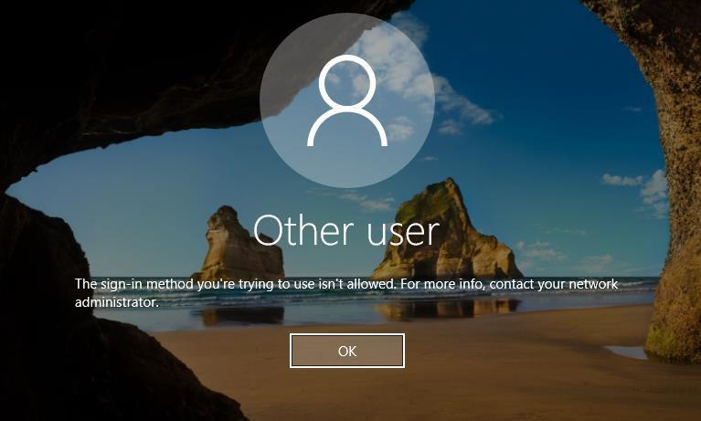

---

### 1.2. Mở công cụ Group Policy Management (GPMC)
1. Trên Windows Server, mở **Server Manager** ➔ **Tools** ➔ chọn **Group Policy Management** (hoặc nhấn `Windows + R`, gõ `gpmc.msc` rồi nhấn Enter).
2. Bung cây thư mục theo thứ tự:
   `Forest: newstar.vn` ➔ `Domains` ➔ `newstar.vn` ➔ `Domain Controllers`.
3. Tại đây bạn sẽ thấy chính sách mặc định dành riêng cho máy chủ Domain Controller là **`Default Domain Controllers Policy`**.

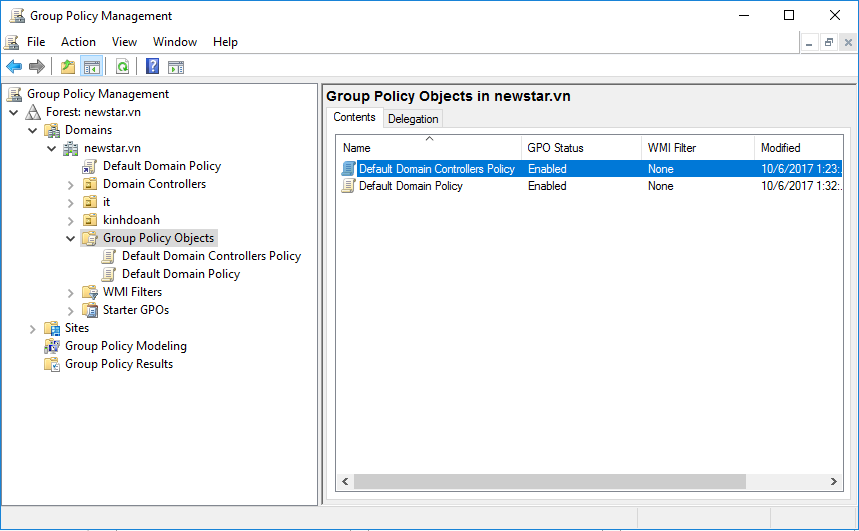

---

### 1.3. Chỉnh sửa chính sách "Allow log on locally"
1. Nhấp chuột phải vào **Default Domain Controllers Policy** ➔ chọn **Edit...**

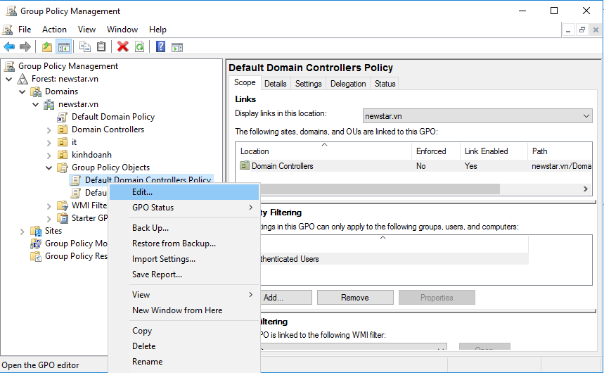

2. Cửa sổ **Group Policy Management Editor** mở ra. Bạn duyệt theo đường dẫn sau:
   - **Computer Configuration**
     - ➔ **Policies**
       - ➔ **Windows Settings**
         - ➔ **Security Settings**
           - ➔ **Local Policies**
             - ➔ **User Rights Assignment**

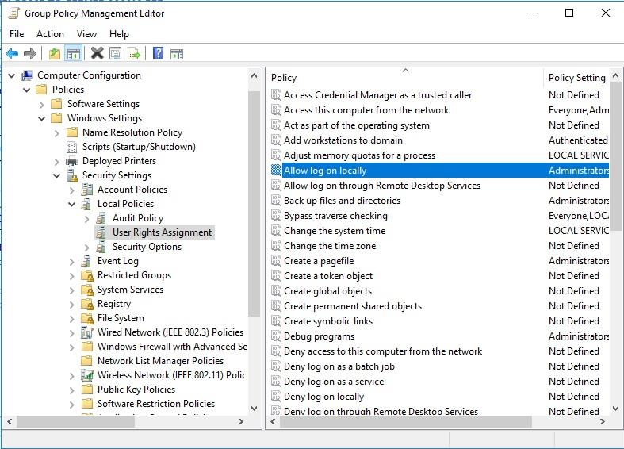

3. Ở khung bên phải, tìm chính sách có tên: **`Allow log on locally`**.
4. Nhấp đúp chuột vào **`Allow log on locally`** để mở hộp thoại cấu hình.
5. Đảm bảo ô **Define these policy settings** được tích chọn.
6. Bấm nút **Add User or Group...**:
   - Để cấp quyền cho toàn bộ người dùng trong miền: Gõ `Users` ➔ Bấm **Check Names** ➔ Bấm **OK**.
   - Hoặc để cấp quyền riêng cho tài khoản test: Gõ `u1` ➔ Bấm **Check Names** ➔ Bấm **OK**.

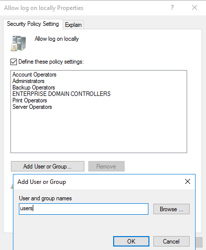

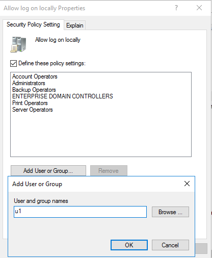

7. Nhấn **Apply** ➔ **OK** để lưu lại cấu hình.

---

### 1.4. Cập nhật chính sách và kiểm tra đăng nhập
1. Nhấn tổ hợp phím `Windows + R`, gõ lệnh:
   ```cmd
   gpupdate /force
   ```
   Nhấn **OK**. Chờ vài giây đến khi màn hình báo `Computer Policy update has completed successfully`.

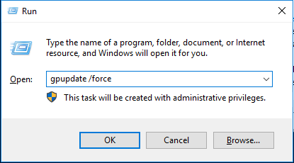

2. **Kiểm tra đăng nhập thực tế**:
   - Trên máy chủ Windows Server, nhấn `Ctrl + Alt + Insert` (hoặc phím tắt của VMware) ➔ Chọn **Switch User** (hoặc **Sign out** tài khoản Administrator).
   - Chọn **Other user**.
   - Đăng nhập với tài khoản:
     * User name: `u1` (hoặc `newstar\u1`)
     * Password: `P@ssword123!`
   - ➔ **Kết quả**: Tài khoản `u1` đăng nhập thành công vào màn hình Desktop của máy chủ Domain Controller!

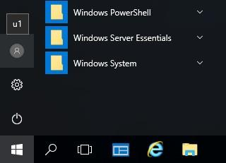

---

## 🛡️ PHẦN 2: THIẾT LẬP CHÍNH SÁCH MẬT KHẨU TOÀN HỆ THỐNG (PASSWORD POLICY)

> [!NOTE]
> Khác với quyền đăng nhập DC chỉ áp dụng cho máy DC, **Password Policy** phải được áp dụng cho **toàn bộ tài khoản trong Domain**. Do đó, chúng ta bắt buộc phải cấu hình trên chính sách **`Default Domain Policy`** (nằm ở gốc của Domain).

---

### 2.1. Mở chỉnh sửa Default Domain Policy
1. Trong cửa sổ **Group Policy Management** (`gpmc.msc`):
   Bung nhánh `Forest: newstar.vn` ➔ `Domains` ➔ `newstar.vn`.
2. Nhấp chuột phải vào **Default Domain Policy** (ở ngay dưới gốc tên miền `newstar.vn`) ➔ chọn **Edit...**

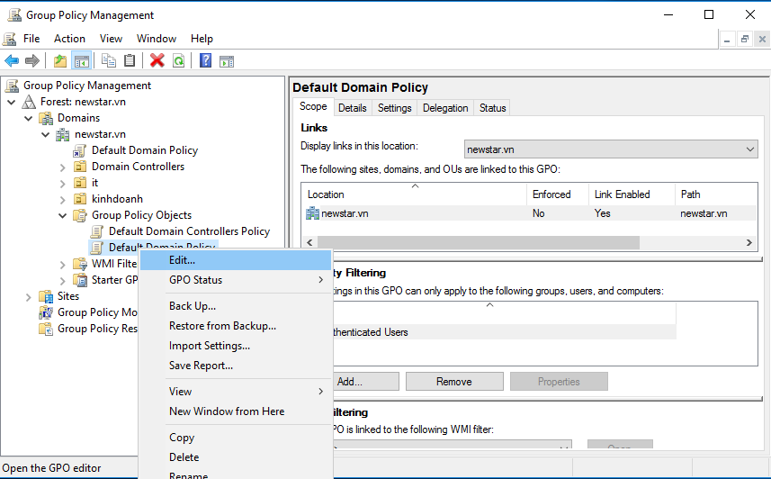

3. Trong cửa sổ **Group Policy Management Editor**, điều hướng theo cây thư mục:
   - **Computer Configuration**
     - ➔ **Policies**
       - ➔ **Windows Settings**
         - ➔ **Security Settings**
           - ➔ **Account Policies**
             - ➔ **Password Policy**

---

### 2.2. Cấu hình chi tiết các tham số theo yêu cầu bài Lab

Tại khung bên phải của **Password Policy**, bạn tiến hành cấu hình lần lượt các mục sau:

#### ① Số lượng mật khẩu ghi nhớ (Enforce password history):
* **Ý nghĩa**: Ngăn người dùng đặt lại mật khẩu giống với các mật khẩu gần nhất họ từng dùng.
* **Thao tác**: Nhấp đúp vào **Enforce password history** ➔ Nhập số: **`2`** (passwords remembered) ➔ Bấm **OK**.

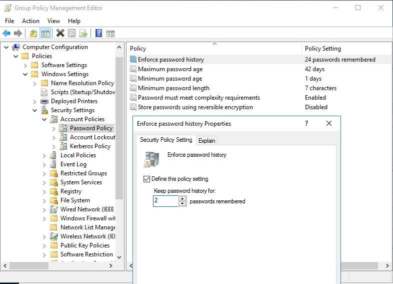

---

#### ② Thời gian sử dụng tối đa của mật khẩu (Maximum password age):
* **Ý nghĩa**: Sau bao nhiêu ngày thì mật khẩu bắt buộc phải hết hạn và người dùng phải đổi mật khẩu mới.
* **Thao tác**: Nhấp đúp vào **Maximum password age** ➔ Nhập số: **`10`** (days) ➔ Bấm **OK**.

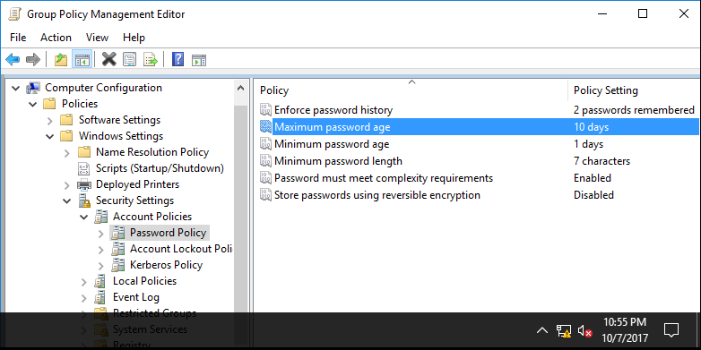

---

#### ③ Thời gian sử dụng tối thiểu của mật khẩu (Minimum password age):
* **Ý nghĩa**: Sau khi vừa đổi mật khẩu, người dùng phải sử dụng nó ít nhất bao nhiêu ngày thì mới được phép đổi sang mật khẩu tiếp theo (tránh tình trạng người dùng cố tình đổi liên tục 2-3 lần để quay lại mật khẩu cũ yêu thích).
* **Thao tác**: Nhấp đúp vào **Minimum password age** ➔ Nhập số: **`1`** (days) ➔ Bấm **OK**.

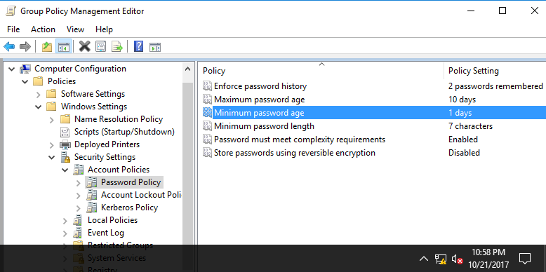

---

#### ④ Các chính sách bổ sung theo chuẩn bảo mật:
* **Minimum password length**: Đặt là **`7`** characters (Mật khẩu phải dài tối thiểu 7 ký tự).
* **Password must meet complexity requirements**: Chọn **`Enabled`** (Bắt buộc mật khẩu phải chứa ít nhất 3 trong 4 loại ký tự: Chữ hoa `A-Z`, chữ thường `a-z`, chữ số `0-9`, ký tự đặc biệt `@, #, $, !...`).

---

### 2.3. Cập nhật Group Policy
Sau khi chỉnh sửa xong, mở cửa sổ Command Prompt hoặc Run (`Windows + R`) trên Windows Server và gõ:
```cmd
gpupdate /force
```
Nhấn Enter để hệ thống đồng bộ chính sách mới vào toàn bộ Domain.

---

## 🧪 PHẦN 3: KIỂM THỬ VÀ NGHIỆM THU CÁC CHÍNH SÁCH

### Trường Hợp 1: Kiểm thử ghi nhớ mật khẩu cũ (Enforce password history)
1. Đăng nhập vào máy Client 1 (`WIN7-PC1`) hoặc trên Server bằng tài khoản `u1`.
2. Nhấn tổ hợp phím `Ctrl + Alt + Delete` ➔ Chọn **Change a password...**
3. Nhập mật khẩu hiện tại (`P@ssword123!`).
4. Tại ô mật khẩu mới, thử nhập lại chính mật khẩu cũ vừa dùng (`P@ssword123!`).
5. ➔ **Kết quả**: Hệ thống sẽ từ chối và báo lỗi:
   > *"Unable to update the password. The value provided for the new password does not meet the length, complexity, or history requirements of the domain."*


---

### Trường Hợp 2: Kiểm thử thời gian tối thiểu được phép đổi mật khẩu (Minimum password age)
1. Giả sử tài khoản `u1` vừa đổi mật khẩu thành công sang mật khẩu mới hợp lệ (ví dụ: `P@ssword456!`).
2. Ngay lập tức trong cùng ngày hôm đó, nhấn `Ctrl + Alt + Delete` ➔ Chọn **Change a password...** một lần nữa để đổi sang mật khẩu khác (`P@ssword789!`).
3. ➔ **Kết quả**: Windows sẽ ngay lập tức chặn lại và hiện bảng thông báo lỗi:
   > *"Unable to update the password. The value provided for the new password does not meet the length, complexity, or history requirements of the domain."*
   *(Lý do: Chính sách yêu cầu phải dùng mật khẩu hiện tại tối thiểu đủ 1 ngày mới được đổi tiếp!)*

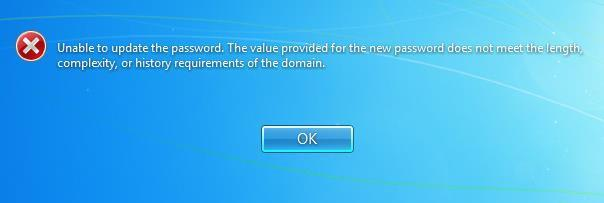

---

### Trường Hợp 3: Kiểm thử thời gian hết hạn tối đa (Maximum password age)
1. Khi tài khoản `u1` đã dùng mật khẩu quá 10 ngày (hoặc trên Server ta bỏ tích `Password never expires` và chỉnh ngày hệ thống tiến lên 11 ngày sau, hoặc tích chọn `User must change password at next logon`).
2. Khi người dùng `u1` tiến hành đăng nhập vào máy tính, Windows sẽ hiển thị cảnh báo:
   > *"Your password has expired and must be changed."*
3. Người dùng bắt buộc phải bấm **OK** và nhập mật khẩu mới phức tạp thì mới có thể vào được Windows.

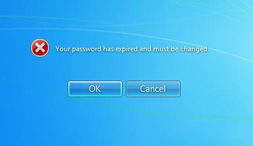

---

## 💡 CÁC MẸO VÀ KINH NGHIỆM ĐI THI QUAN TRỌNG

1. **Nhầm lẫn giữa 2 GPO**:
   - Nhớ quy tắc: Quyền đăng nhập trên máy chủ DC (`Allow log on locally`) ➔ Cấu hình ở **Default Domain Controllers Policy**.
   - Chính sách mật khẩu (`Password Policy`) ➔ Cấu hình ở **Default Domain Policy**.
   - Nếu bạn cấu hình Password Policy trong *Default Domain Controllers Policy*, nó sẽ **không có tác dụng** đối với tài khoản Domain!
2. **Quy tắc phụ thuộc khi chỉnh số ngày Password**:
   - Windows bắt buộc: `Minimum password age` phải **NHỎ HƠN** `Maximum password age`.
   - Nếu bạn đặt `Minimum password age = 15` mà `Maximum = 10`, Windows sẽ báo lỗi không cho lưu!
3. **Luôn chạy `gpupdate /force`**:
   - Sau khi sửa bất kỳ chính sách nào trong GPO, luôn mở `cmd` chạy `gpupdate /force` trên máy DC (và cả trên máy Client nếu kiểm tra Client) để chính sách có hiệu lực tức thì mà không cần khởi động lại máy.
