# HƯỚNG DẪN THỰC HÀNH CHI TIẾT LAB 5
## QUẢN TRỊ CHIA SẺ VÀ PHÂN QUYỀN (SHARE & ADVANCED NTFS PERMISSIONS)

---

## 🎯 MỤC TIÊU BÀI LAB
1. Hiểu rõ sự kết hợp giữa hai tầng bảo mật trên Windows: **Share Permissions** (tầng chia sẻ mạng) và **NTFS Permissions** (tầng hệ thống tập tin cục bộ). Quy tắc thực tế: *Quyền hiệu dụng (Effective Permission) là giao điểm chặt chẽ nhất giữa Share và NTFS*.
2. Nắm vững kỹ thuật ngắt kế thừa quyền (**Disable Inheritance**) và chuyển đổi quyền thừa kế thành quyền tường minh (**Convert inherited permissions into explicit permissions**).
3. Thiết lập quyền cấm truy cập đặc biệt (**Deny Permission**) và nguyên tắc: *Quyền Deny luôn luôn được ưu tiên cao nhất, đè bẹp mọi quyền Allow*.
4. Cấu hình phân quyền nâng cao (**Advanced Permissions**) với đối tượng đặc biệt **`CREATOR OWNER`** để thực hiện nguyên tắc nghiệp vụ: *"Người nào tạo ra dữ liệu thì người đó có quyền xóa, người khác chỉ được xem/sửa nhưng tuyệt đối KHÔNG ĐƯỢC XÓA dữ liệu của nhau"*.
5. Làm chủ kỹ thuật chiếm lại quyền sở hữu (**Take Ownership**) của người quản trị (**Administrator**) khi người dùng cố tình chiếm quyền và xóa bỏ mọi tài khoản quản trị trên thư mục.

---

## 🖥️ MÔ HÌNH VÀ THÔNG SỐ HỆ THỐNG MÁY ẢO

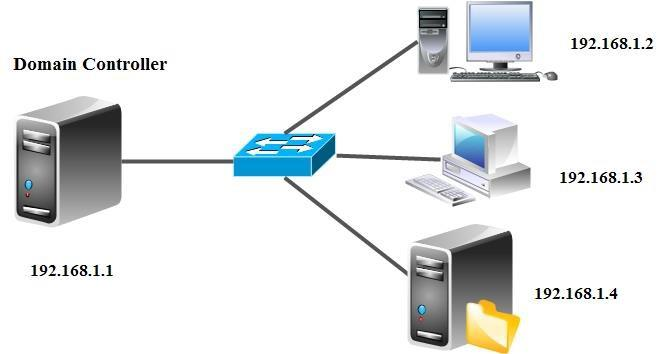

Hệ thống triển khai trên 3 máy ảo VMware của bạn:
* **Máy 1: Windows Server 2012 (Domain Controller & File Server)**
  - Tên máy: `WIN-P6PG9M9AICK` (hoặc `DC-SERVER`)
  - Tên miền: `newstar.vn`
  - Địa chỉ IP: `192.168.1.154` (hoặc `192.168.11.1`)
  - Tài khoản quản trị: `Administrator` (Mật khẩu: `123`)
* **Máy 2: Client 1 - Windows 7 (`client-win7-1`)**
  - Tên máy: `WIN7-PC1`, IP: `192.168.11.2`, Domain: `newstar.vn`
* **Máy 3: Client 2 - Windows 7 (`client-win7-2`)**
  - Tên máy: `WIN7-PC2`, IP: `100.100.11.2`, Domain: `newstar.vn`

---

## 🌳 CÂY THƯ MỤC VÀ SƠ ĐỒ PHÂN QUYỀN LAB 5

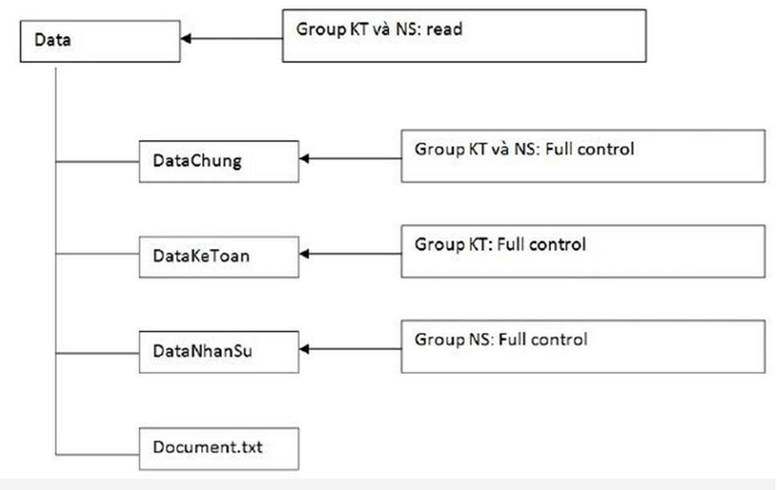

| Thư mục / Tập tin | Nhóm / Người dùng | Quyền phân bổ | Ý nghĩa nghiệp vụ |
| :--- | :--- | :--- | :--- |
| **`C:\Data`** *(Gốc chia sẻ)* | Group `KT` và Group `NS` `Administrators`, `SYSTEM` | **Read** (`Read & execute`, `List`) **Full control** | Cả 2 phòng chỉ được nhìn thấy cây thư mục, không được xóa/sửa thư mục gốc. |
| ├── **`DataChung`** | Group `KT` và Group `NS` | **Full control** | Thư mục dùng chung, cả 2 phòng đều có toàn quyền trao đổi dữ liệu. |
| ├── **`DataKeToan`** | Group `KT` User **`KT1`** | **Full control** **Deny: Read / Write / Execute** | Chỉ phòng Kế toán được truy cập. Riêng nhân viên `KT1` bị cấm hoàn toàn. |
| ├── **`DataNhanSu`** | Group `NS` **`CREATOR OWNER`** | **Read / Write (Bỏ Delete)** **Full control** | Nhân viên phòng Nhân sự được tạo/xem dữ liệu, nhưng chỉ người tạo mới được xóa. |
| └── **`Document.txt`** | Kế thừa từ `Data` | **Read** | Tập tin văn bản chỉ đọc. |

---

## 📝 BƯỚC 1: TẠO TÀI KHOẢN VÀ NHÓM TRÊN ACTIVE DIRECTORY

1. Trên máy chủ **Windows Server 2012**, mở **Active Directory Users and Computers** (`dsa.msc`).
2. Nhấp chuột phải vào nhánh tên miền `newstar.vn` (hoặc tạo OU riêng tên `LAB5`) ➔ Chọn **New** ➔ **Group**:
   - Tạo Group: **`KT`** (Group scope: *Global*, Group type: *Security*).
   - Tạo Group: **`NS`** (Group scope: *Global*, Group type: *Security*).
3. Tạo 4 tài khoản người dùng:
   - **`KT1`**, **`KT2`**: Đặt mật khẩu `P@ssword123!` (Bỏ tích *User must change password at next logon*).
     * Nhấp đúp vào user `KT1` ➔ Tab **Member Of** ➔ Bấm **Add...** ➔ Thêm vào nhóm **`KT`**.
     * Thực hiện tương tự thêm `KT2` vào nhóm **`KT`**.
   - **`NS1`**, **`NS2`**: Đặt mật khẩu `P@ssword123!`.
     * Thêm cả 2 user `NS1` và `NS2` vào nhóm **`NS`**.

---

## 📂 BƯỚC 2: TẠO CẤU TRÚC THƯ MỤC VÀ CHIA SẺ MẠNG (SHARE PERMISSIONS)

### 2.1. Tạo thư mục trên ổ đĩa `C:\`
Mở **File Explorer** trên Windows Server, vào ổ `C:\` và tạo cấu trúc sau:
* `C:\Data`
* `C:\Data\DataChung`
* `C:\Data\DataKeToan`
* `C:\Data\DataNhanSu`
* `C:\Data\Document.txt` *(Chuột phải chọn New -> Text Document, gõ vài dòng nội dung rồi lưu lại)*.

---

### 2.2. Chia sẻ mạng (Share Permissions) cho thư mục `Data`
> [!TIP]
> **Nguyên tắc vàng quản trị Windows Server**: Luôn cấp quyền Share là **`Everyone: Full Control`**, sau đó kiểm soát bảo mật chi tiết chặt chẽ bằng quyền **NTFS Permissions**. Điều này giúp quản trị viên dễ dàng quản lý phân quyền tập trung tại một nơi duy nhất là tab Security mà không bị xung đột với quyền Share.

1. Nhấp chuột phải vào thư mục **`C:\Data`** ➔ Chọn **Properties**.
2. Chọn tab **Sharing** ➔ Bấm nút **Advanced Sharing...**
3. Tích chọn vào ô **Share this folder**.
   - Share name: Giữ nguyên là **`Data`**.
4. Bấm nút **Permissions**:
   - Mặc định có sẵn nhóm `Everyone`.
   - Tích chọn vào ô **Full Control** (cột *Allow*).
5. Nhấn **OK** ➔ **OK** để hoàn tất chia sẻ.

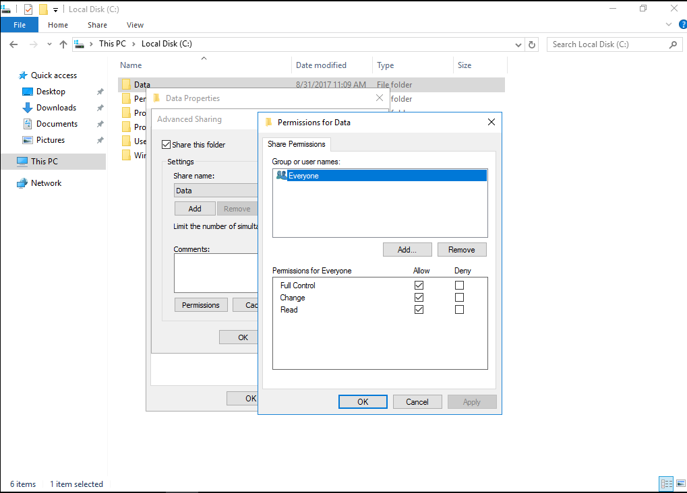

---

## 🔒 BƯỚC 3: PHÂN QUYỀN NTFS TRÊN THƯ MỤC GỐC `C:\DATA`

Mặc định thư mục tạo mới trên ổ `C:\` sẽ kế thừa toàn bộ quyền từ ổ đĩa gốc `C:\` (trong đó có nhóm `Users` thông thường có quyền tạo file). Ta cần ngắt kế thừa và thiết lập quyền chuẩn:

### 3.1. Gỡ bỏ kế thừa (Disable Inheritance)
1. Trong cửa sổ **Data Properties**, chuyển sang tab **Security** ➔ Bấm nút **Advanced** (ở góc dưới).
2. Tại cửa sổ **Advanced Security Settings for Data**, bấm nút **Disable inheritance**.
3. Một hộp thoại màu vàng xuất hiện hỏi bạn xử lý các quyền kế thừa như thế nào:
   - Chọn dòng đầu tiên: **`Convert inherited permissions into explicit permissions on this object`** *(Chuyển các quyền thừa kế thành quyền tường minh trực tiếp để chúng ta có thể chỉnh sửa/xóa bỏ)*.

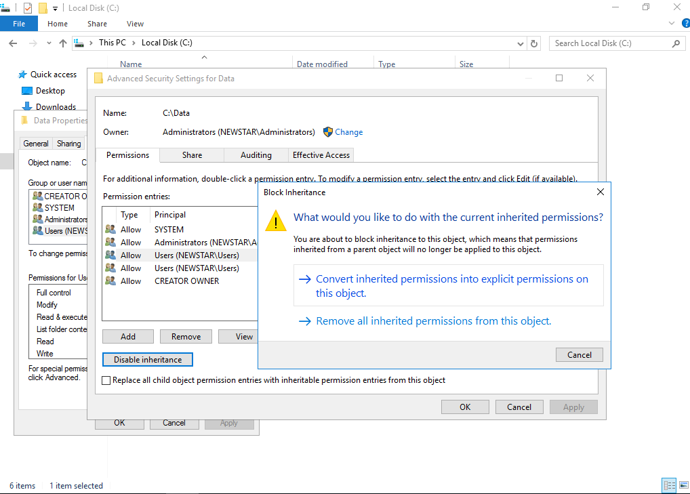

---

### 3.2. Xóa bỏ nhóm Users và cấp quyền cho nhóm KT, NS
1. Sau khi Convert xong, tại danh sách quyền:
   - Nhấp chọn nhóm **`Users (NEWSTAR\Users)`** ➔ Bấm nút **Remove**.
   - *(Nếu có thêm dòng `Users` thứ 2, chọn và bấm Remove tiếp)*.
   - Giữ lại các nhóm hệ thống: `Administrators`, `SYSTEM`, `CREATOR OWNER`.

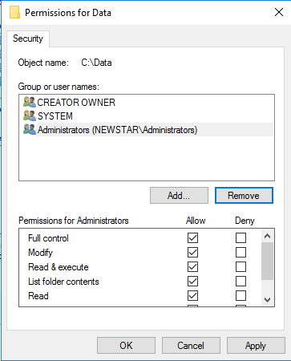

2. Bấm nút **Add**:
   - Bấm **Select a principal** ➔ Gõ `KT` ➔ Bấm **Check Names** ➔ Bấm **OK**.
   - Tại mục **Basic permissions**: Chỉ tích chọn **`Read & execute`**, **`List folder contents`**, **`Read`** *(Không tích Modify hay Write)* ➔ Bấm **OK**.
3. Bấm **Add** tiếp tục:
   - Bấm **Select a principal** ➔ Gõ `NS` ➔ Bấm **Check Names** ➔ Bấm **OK**.
   - Cấp quyền tương tự: Chỉ tích **`Read & execute`**, **`List folder contents`**, **`Read`** ➔ Bấm **OK**.
4. Bấm **Apply** ➔ **OK** để lưu lại tab Advanced.

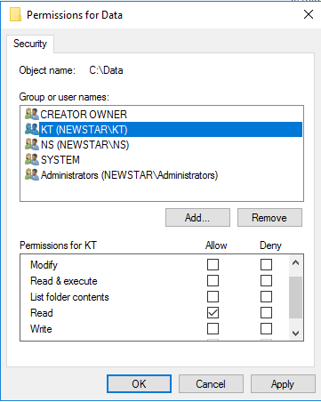

---

## 👥 BƯỚC 4: PHÂN QUYỀN CÁC THƯ MỤC CON

### 4.1. Cấu hình thư mục `C:\Data\DataChung`
Thư mục này cho phép cả 2 phòng ban toàn quyền trao đổi dữ liệu:
1. Nhấp chuột phải vào `C:\Data\DataChung` ➔ **Properties** ➔ tab **Security** ➔ Bấm **Edit...**
2. Nhấp chọn nhóm **`KT`** ➔ Tích chọn **Full control** (cột *Allow*).
3. Nhấp chọn nhóm **`NS`** ➔ Tích chọn **Full control** (cột *Allow*).
4. Nhấn **Apply** ➔ **OK**.

---

### 4.2. Cấu hình thư mục `C:\Data\DataKeToan` & Chặn truy xuất KT1
1. Nhấp chuột phải vào `C:\Data\DataKeToan` ➔ **Properties** ➔ tab **Security** ➔ Bấm **Advanced**:
   - Bấm **Disable inheritance** ➔ Chọn **Convert inherited permissions...**
   - Chọn nhóm **`NS`** ➔ Bấm **Remove** *(vì phòng Nhân sự không được phép xem tài liệu Kế toán)*.
   - Chọn nhóm **`KT`** ➔ Bấm **Edit** ➔ Cấp quyền **Full control** (Allow).
2. **Thiết lập quyền cấm (Deny) riêng cho `KT1`**:
   - Vẫn trong tab **Security**, bấm nút **Edit...** (hoặc nút **Add** trong Advanced).
   - Bấm nút **Add...** ➔ Gõ `KT1` ➔ Bấm **Check Names** ➔ Bấm **OK**.
   - Nhấp chọn `KT1`, tại khung phân quyền bên dưới:
     * Tích chọn vào cột **Deny** ở các dòng: **`Read & execute`**, **`Read`**, **`Write`** (hoặc tích thẳng vào **Full control** ở cột **Deny**).
   - Bấm **Apply** ➔ Một thông báo cảnh báo của Windows hiện ra: *"Deny permissions take precedence over allow permissions..."* (Quyền Deny sẽ được ưu tiên hơn quyền Allow) ➔ Bạn bấm **Yes** ➔ **OK**.

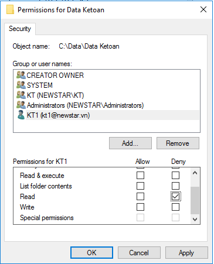

3. **Kiểm tra thực tế từ máy Client**:
   - Đăng nhập máy Client bằng tài khoản `KT1`.
   - Vào **Run** (`Win + R`) ➔ gõ `\\192.168.1.154\Data` ➔ Nhấp đúp vào thư mục `DataKeToan`.
   - ➔ **Kết quả**: Windows sẽ chặn lại ngay và báo lỗi:
     > *"Windows cannot access \\192.168.1.154\Data\DataKeToan. You do not have permission to access... Contact your network administrator to request access."*
   - Trong khi đó, nếu dùng tài khoản `KT2` truy cập thì mở và chỉnh sửa tài liệu bình thường!

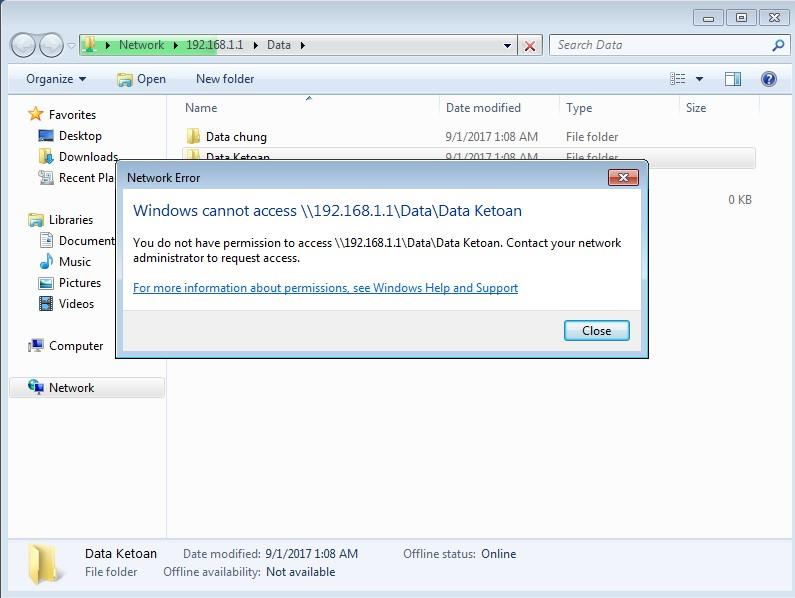

---

### 4.3. Cấu hình thư mục `C:\Data\DataNhanSu`: Nguyên tắc "Không xóa dữ liệu người khác"

Đây là phần trọng tâm và hay gặp nhất trong các đề thi quản trị mạng:

#### Phân tích cơ chế NTFS:
* Mặc định quyền `Modify` hoặc `Full control` bao gồm cả quyền **`Delete`** (xóa chính folder/file đó) và quyền **`Delete subfolders and files`** (xóa các thư mục và tập tin con bên trong).
* Nếu để nguyên quyền này, `NS2` có thể xóa sạch mọi file/folder mà đồng nghiệp `NS1` tạo ra.
* **Giải pháp chuẩn của Microsoft**:
  1. Nhóm **`NS`**: Được cấp quyền đọc, ghi, tạo file, tạo folder nhưng **BỎ 2 QUYỀN**: `Delete` và `Delete subfolders and files`.
  2. Đối tượng đặc biệt **`CREATOR OWNER`**: Được cấp quyền **`Full control`**. Khi `NS1` tạo ra 1 folder mới, `NS1` tự động trở thành `CREATOR OWNER` của folder đó, nên chỉ duy nhất `NS1` có quyền xóa folder của mình!

#### Các bước thực hiện:
1. Nhấp chuột phải vào `C:\Data\DataNhanSu` ➔ **Properties** ➔ tab **Security** ➔ Bấm **Advanced**.
2. Bấm **Disable inheritance** ➔ Chọn **Convert inherited permissions...**
3. Chọn nhóm **`KT`** ➔ Bấm **Remove** *(phòng Kế toán không được vào thư mục Nhân sự)*.
4. Đảm bảo đối tượng **`CREATOR OWNER`** có quyền **`Full control`** (nếu chưa có thì bấm Add thêm `CREATOR OWNER` và cấp Full Control).
5. Chọn nhóm **`NS`** ➔ Bấm **Edit**:
   - Bấm vào dòng chữ xanh góc trên bên phải: **Show advanced permissions**.
   - Tại danh sách các quyền nâng cao:
     * Tích chọn tất cả các quyền đọc, ghi, duyệt, tạo file.
     * **BỎ TÍCH 2 Ô SAU ĐÂY**:
       - ❌ **`Delete subfolders and files`**
       - ❌ **`Delete`**

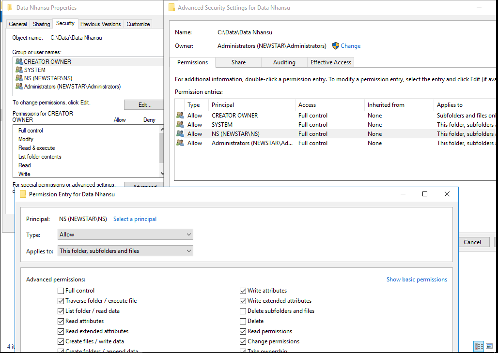

6. Nhấn **OK** ➔ **Apply** ➔ **OK**.

---

### 4.4. Kiểm thử nguyên tắc "Không xóa dữ liệu người khác"

1. **Bước 1: `NS1` tạo thư mục**:
   - Đăng nhập máy Client bằng tài khoản `NS1`.
   - Vào `\\192.168.1.154\Data\DataNhanSu` ➔ Tạo 1 thư mục mới đặt tên là **`NS1_TaiLieu`**.
   - Tạo thành công bình thường.

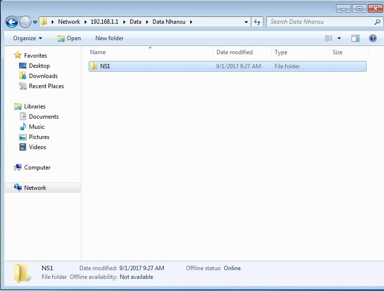

2. **Bước 2: `NS2` đăng nhập kiểm tra**:
   - Đăng nhập máy Client bằng tài khoản `NS2`.
   - Vào `\\192.168.1.154\Data\DataNhanSu` ➔ `NS2` nhìn thấy thư mục `NS1_TaiLieu` của `NS1`.

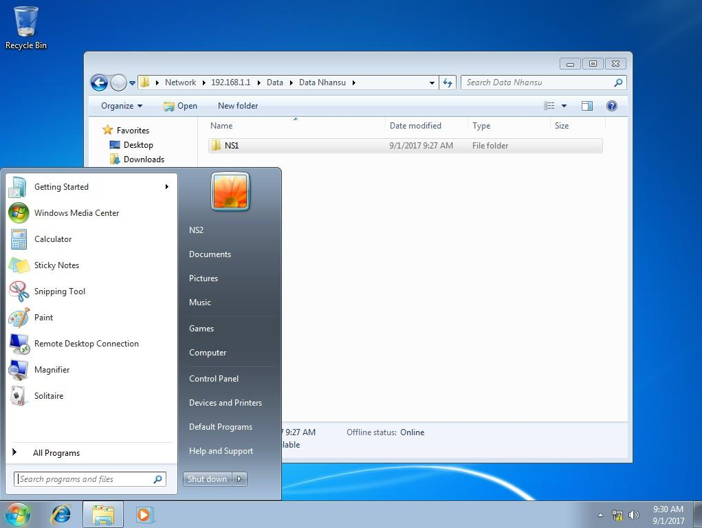

3. **Bước 3: `NS2` cố tình xóa thư mục của `NS1`**:
   - `NS2` bấm chuột phải vào thư mục `NS1_TaiLieu` ➔ chọn **Delete**.
   - ➔ **Kết quả**: Windows ngay lập tức bật hộp thoại cảnh báo từ chối:
     > *"Folder Access Denied. You need permission to perform this action. You require permission from NEWSTAR\NS1 to make changes to this folder."*
   - `NS2` hoàn toàn **KHÔNG THỂ XÓA** được thư mục của `NS1`!

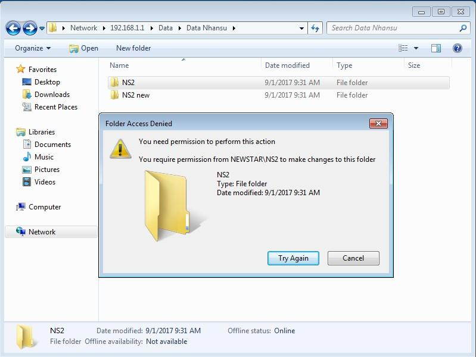

4. **Bước 4: `NS2` tạo thư mục riêng của mình và tự xóa**:
   - `NS2` tạo thư mục tên **`NS2_Rieng`** ➔ Tạo thành công.
   - `NS2` bấm Delete chính thư mục `NS2_Rieng` của mình ➔ Xóa được bình thường *(vì `NS2` là CREATOR OWNER của nó)*!

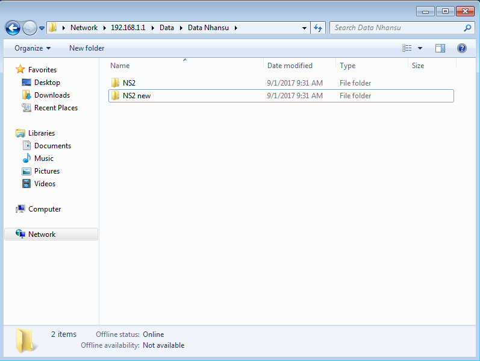

---

## 👑 BƯỚC 5: TÌNH HUỐNG CHIẾM QUYỀN VÀ QUY TRÌNH TAKE OWNERSHIP CỦA ADMINISTRATOR

### 5.1. Tình huống: Người dùng chiếm quyền thư mục
1. Tài khoản `NS2` tạo một thư mục con trong `DataNhanSu` tên là **`NS2_BiMat`**.
2. Do là người tạo, `NS2` có quyền Owner trên thư mục này. `NS2` nhấp chuột phải vào `NS2_BiMat` ➔ **Properties** ➔ **Security** ➔ **Advanced**:
   - Bấm **Disable inheritance** ➔ Chọn **Remove all inherited permissions**.
   - Cấp quyền cho riêng mình `NS2`, và **XÓA SẠCH TOÀN BỘ CÁC TÀI KHOẢN KHÁC** (kể cả `Administrators` và `SYSTEM`).

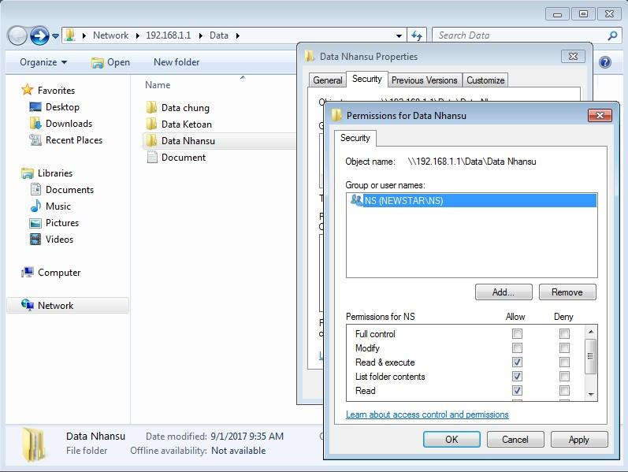

3. **Hiện tượng**:
   - Người quản trị tối cao `Administrator` khi truy cập vào thư mục `NS2_BiMat` sẽ bị báo lỗi:
     > *"You don't currently have permission to access this folder. Click Continue to permanently get access to this folder."*
     > 
     > Hoặc qua mạng báo: *"Windows cannot access \\192.168.1.154\Data\DataNhanSu\NS2_BiMat... Access is denied."*

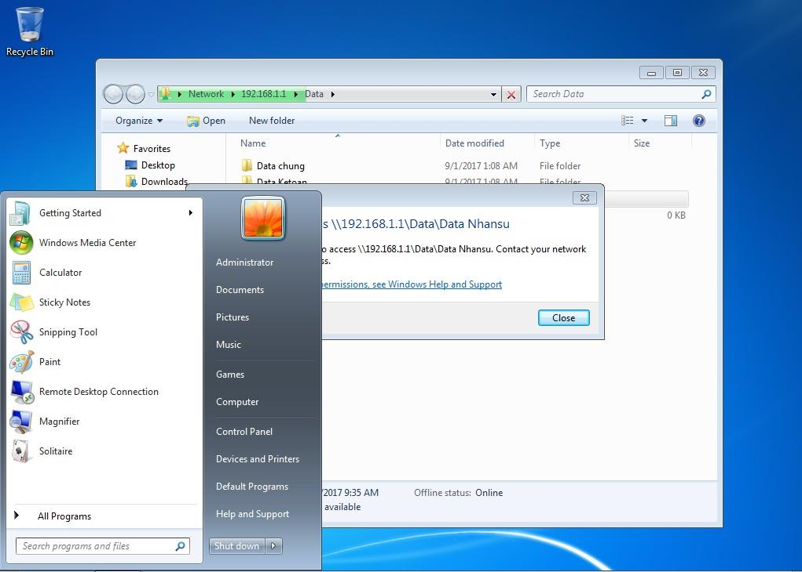

---

### 5.2. Quy trình Administrator chiếm lại quyền (Take Ownership)
Trên hệ điều hành Windows Server, tài khoản quản trị viên **`Administrator`** có một đặc quyền tối thượng của hệ thống là **`SeTakeOwnershipPrivilege`** (Quyền chiếm quyền sở hữu bất kỳ đối tượng nào trên ổ cứng, bất chấp người dùng có xóa sạch quyền của Admin):

1. Trên máy chủ **Windows Server 2012** với tài khoản **Administrator**:
2. Nhấp chuột phải vào thư mục bị chiếm quyền (`NS2_BiMat`) ➔ chọn **Properties** ➔ tab **Security** ➔ bấm **Advanced**.
3. Ở dòng trên cùng, tại mục **Owner**:
   - Bấm vào chữ **`Change`** màu xanh bên cạnh tên chủ sở hữu hiện tại.
   - Hộp thoại chọn đối tượng mở ra: Gõ **`Administrator`** (hoặc `Administrators`) ➔ Bấm **Check Names** ➔ Bấm **OK**.
4. **CỰC KỲ QUAN TRỌNG**: Tích chọn vào ô:
   - ☑️ **`Replace owner on subcontainers and objects`** *(Áp dụng quyền sở hữu cho toàn bộ các thư mục con và file bên trong)*.
5. Nhấn **Apply** ➔ Windows sẽ thông báo bạn đã trở thành Owner của thư mục.

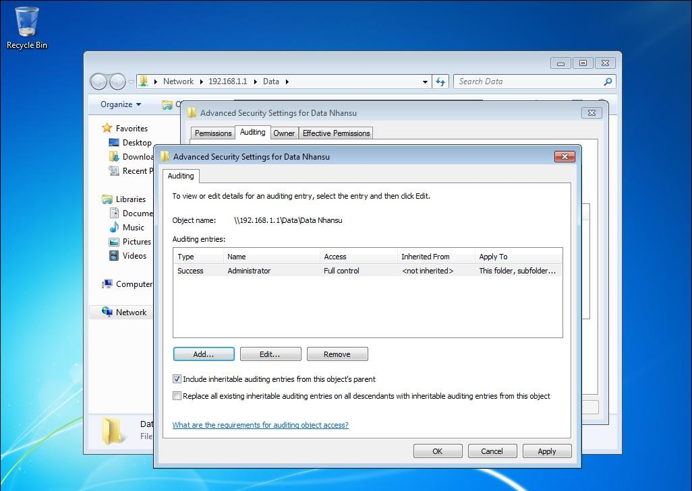

6. **Cấp lại quyền Full Control cho Administrator**:
   - Sau khi nhận quyền Owner, bấm **OK** đóng cửa sổ Advanced.
   - Mở lại **Properties** ➔ tab **Security** ➔ bấm **Edit...**
   - Bấm **Add...** ➔ Thêm nhóm **`Administrators`** và tài khoản **`Administrator`**.
   - Tích chọn **`Full control`** (cột *Allow*).
   - Nhấn **Apply** ➔ **OK**.

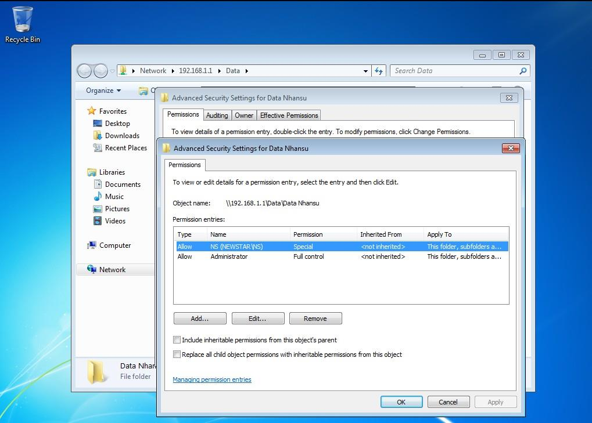

7. ➔ **Kết quả**: Quản trị viên `Administrator` lập tức mở và xem toàn bộ nội dung dữ liệu bên trong thư mục bình thường!

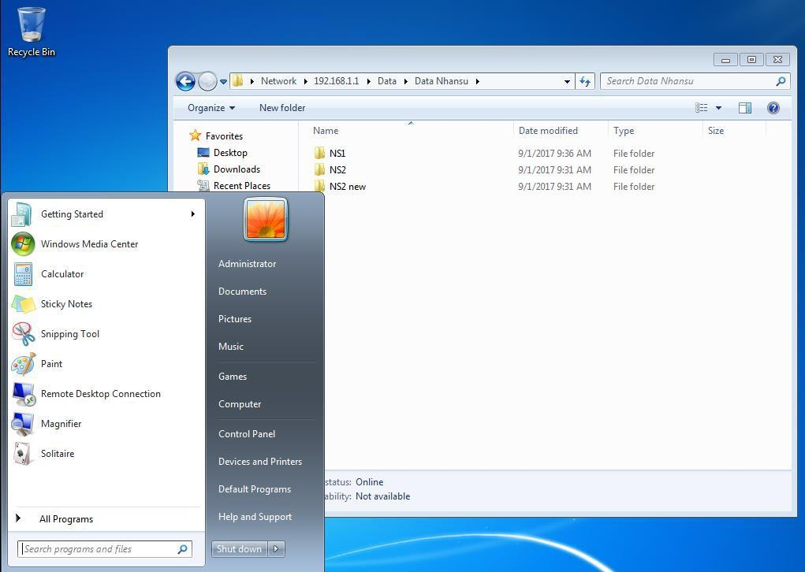

---

## 🎯 TỔNG KẾT BẢNG SO SÁNH QUAN TRỌNG CHO BÀI THI

| Tình huống | Thao tác cần nhớ | Lỗi thường gặp nếu làm sai |
| :--- | :--- | :--- |
| **Share Folder** | Luôn cấp `Everyone: Full Control` ở tab Sharing. | Nếu để mặc định `Everyone: Read` thì dù NTFS có phân Full Control, Client cũng chỉ đọc được chứ không ghi được file. |
| **Ngắt kế thừa** | Chọn `Convert inherited permissions...` | Nếu chọn *Remove all* thì thư mục sẽ mất trắng mọi quyền, không ai vào được kể cả Admin. |
| **Chặn một người (Deny)** | Thêm user đó và tích cột **Deny**. | Không bao giờ tích Deny cho nhóm `Everyone` hoặc nhóm lớn vì sẽ chặn luôn cả chính bản thân mình. |
| **Cấm xóa file nhau** | Bỏ `Delete` & `Delete subfolders` của Group, cấp Full cho `CREATOR OWNER`. | Quên cấp quyền cho `CREATOR OWNER` thì cả người tạo cũng không xóa được file của chính mình. |
| **Lấy lại quyền Admin** | Tab Security ➔ Advanced ➔ Owner: Change ➔ Tích *Replace owner...* | Quên tích *Replace owner on subcontainers...* thì chỉ lấy được folder mẹ, các file con bên trong vẫn bị khóa. |
