# HƯỚNG DẪN THỰC HÀNH CHI TIẾT LAB 6
## TRIỂN KHAI VÀ QUẢN LÝ CHÍNH SÁCH NHÓM (GROUP POLICY OBJECTS - GPO)

---

## 🎯 MỤC TIÊU BÀI LAB
1. **Nắm vững kiến trúc & cơ chế thực thi Group Policy**: Hiểu rõ chu trình phân cấp GPO từ cấp Rừng (Forest), Tên miền (Domain), Đơn vị tổ chức (Organizational Unit - OU) đến Người dùng (User Configuration) và Máy tính (Computer Configuration).
2. **Quản trị và hạn chế môi trường làm việc người dùng (User Environment Lockdown)**:
   - **Ẩn biểu tượng Desktop**: Ẩn Computer (`My Computer` / `This PC`) và Thùng rác (`Recycle Bin`) nhằm tối giản không gian làm việc và ngăn chặn người dùng truy cập trực tiếp ổ đĩa.
   - **Tùy biến Control Panel**: Ẩn mục chỉ định (**`Microsoft.Mouse`**) trong Control Panel để ngăn can thiệp cấu hình chuột máy tính.
   - **Kiểm soát giao diện cá nhân**: Cấm người dùng tự ý thay đổi Theme hệ thống (**`Prevent changing theme`**), chuẩn hóa giao diện doanh nghiệp.
   - **Bảo mật cấu hình mạng**: Khóa menu thuộc tính card mạng (**`Prohibit access to properties of a LAN connection`**), ngăn ngừa thay đổi IP gây xung đột mạng nội bộ.
   - **Cố định thanh tác vụ**: Khóa thanh Taskbar (**`Lock the Taskbar`**) tránh xáo trộn giao diện người dùng.
3. **Kiểm soát phần mềm & bảo mật hệ điều hành**:
   - **Chặn truy cập dòng lệnh**: Vô hiệu hóa Command Prompt (**`Prevent access to the command prompt`**) ngăn chặn thực thi lệnh cmd trái phép.
   - **Chặn ứng dụng chỉ định**: Cấm khởi chạy phần mềm Paint (**`Don't run specified Windows applications: mspaint.exe`**).
4. **Tự động hóa kịch bản đăng nhập (Logon Script)**:
   - Triển khai kịch bản VBScript tự động chào mừng người dùng (**`welcome.vbs`**) hiển thị thông điệp *"Chúc bạn một ngày làm việc vui vẻ"* mỗi khi đăng nhập máy trạm.
5. **Kỹ năng nghiệm thu & xử lý sự cố (Troubleshooting GPO)**:
   - Sử dụng thành thạo các công cụ: `gpupdate /force`, `gpresult /r`, `RSOP.msc` và kiểm tra giá trị Registry tương ứng.

---

## 🖥️ MÔ HÌNH VÀ THÔNG SỐ HỆ THỐNG MÁY ẢO

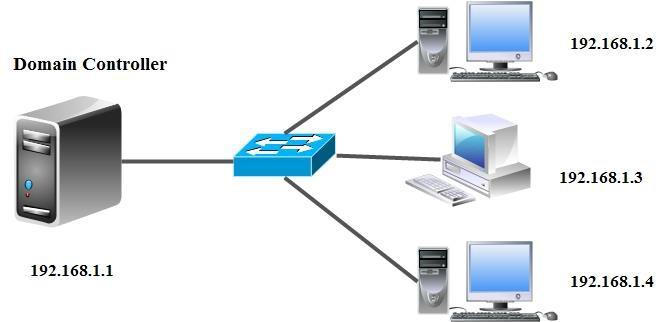

Hệ thống lab triển khai hoàn chỉnh trên hệ sinh thái máy ảo kết nối nội bộ:

* **Máy chủ Domain Controller (Windows Server 2012 R2 / 2016)**
  - Tên máy: `WIN-P6PG9M9AICK`
  - Tên miền quản trị: `newstar.vn`
  - Địa chỉ IP Quản trị: `192.168.1.154` (Card NAT) / `192.168.11.1` (Card VMnet11) / `100.100.11.1` (Card VMnet12)
  - Vai trò: Domain Controller, DNS Server, Group Policy Management Server
  - Tài khoản quản trị: `Administrator` / Mật khẩu: `123`

* **Máy trạm Client 1 (Windows 7 Professional SP1 - `WIN7-PC1`)**
  - Tên máy: `WIN7-PC1`
  - Địa chỉ IP: `192.168.11.2/24` (VMnet11)
  - DNS Server: `192.168.11.1` (Trỏ về máy chủ Domain Controller)
  - Trạng thái: Đã gia nhập miền `newstar.vn` (Joined Domain)
  - Người dùng thử nghiệm: `KT1`, `NS1`, `SV1` hoặc `Administrator`

* **Máy trạm Client 2 (Windows 7 Professional SP1 - `WIN7-PC2`)**
  - Tên máy: `WIN7-PC2`
  - Địa chỉ IP: `100.100.11.2/24` (VMnet12)
  - DNS Server: `100.100.11.1` (Trỏ về máy chủ Domain Controller)
  - Trạng thái: Đã gia nhập miền `newstar.vn` (Joined Domain)

---

## 📊 BẢNG TỔNG HỢP CÁC CHÍNH SÁCH GPO LAB 6

| STT | Mục tiêu chính sách | Vị trí cấu hình trong Group Policy Management Editor | Tên Policy Setting | Giá trị thiết lập | Vị trí Registry tương ứng (HKCU) |
| :---: | :--- | :--- | :--- | :---: | :--- |
| **1** | **Ẩn biểu tượng Computer trên Desktop** | `User Configuration` ➔ `Administrative Templates` ➔ `Desktop` | **Remove Computer icon on the desktop** | **Enabled** | `Software\Microsoft\Windows\CurrentVersion\Policies\NonEnum`<br>`{20D04FE0-3AEA-1069-A2D8-08002B30309D}` = `1` (DWORD) |
| **2** | **Ẩn thùng rác Recycle Bin trên Desktop** | `User Configuration` ➔ `Administrative Templates` ➔ `Desktop` | **Remove Recycle Bin icon from desktop** | **Enabled** | `Software\Microsoft\Windows\CurrentVersion\Policies\NonEnum`<br>`{645FF040-5081-101B-9F08-00AA002F954E}` = `1` (DWORD) |
| **3** | **Ẩn mục Chuột (Mouse) trong Control Panel** | `User Configuration` ➔ `Administrative Templates` ➔ `Control Panel` | **Hide specified Control Panel items** | **Enabled**<br>List: `Microsoft.Mouse` | `Software\Microsoft\Windows\CurrentVersion\Policies\Explorer`<br>`DisallowCpl` = `1` (DWORD)<br>Key con `DisallowCpl`: `1` = `"Microsoft.Mouse"` (String) |
| **4** | **Cấm thay đổi Theme giao diện** | `User Configuration` ➔ `Administrative Templates` ➔ `Control Panel` ➔ `Personalization` | **Prevent changing theme** | **Enabled** | `Software\Microsoft\Windows\CurrentVersion\Policies\Explorer`<br>`NoThemesTab` = `1` (DWORD) |
| **5** | **Khóa thuộc tính card mạng (Cấm sửa IP)** | `User Configuration` ➔ `Administrative Templates` ➔ `Network` ➔ `Network Connections` | **Prohibit access to properties of a LAN connection** | **Enabled** | `Software\Policies\Microsoft\Windows\Network Connections`<br>`NC_LanProperties` = `0` (DWORD) |
| **6** | **Khóa thanh Taskbar** | `User Configuration` ➔ `Administrative Templates` ➔ `Start Menu and Taskbar` | **Lock the Taskbar** | **Enabled** | `Software\Microsoft\Windows\CurrentVersion\Policies\Explorer`<br>`TaskbarLockAll` = `1` (DWORD) & `LockTaskbar` = `1` |
| **7** | **Chặn mở Command Prompt (CMD)** | `User Configuration` ➔ `Administrative Templates` ➔ `System` | **Prevent access to the command prompt** | **Enabled**<br>(Disable scripts: `Yes`/`No`) | `Software\Policies\Microsoft\Windows\System`<br>`DisableCMD` = `2` (chỉ chặn CMD) hoặc `1` (chặn cả script) |
| **8** | **Chặn chạy ứng dụng Paint (`mspaint.exe`)** | `User Configuration` ➔ `Administrative Templates` ➔ `System` | **Don't run specified Windows applications** | **Enabled**<br>List: `mspaint.exe` | `Software\Microsoft\Windows\CurrentVersion\Policies\Explorer`<br>`DisallowRun` = `1` (DWORD)<br>Key con `DisallowRun`: `1` = `"mspaint.exe"` (String) |
| **9** | **Logon Script câu chào mừng** | `User Configuration` ➔ `Windows Settings` ➔ `Scripts (Logon/Logoff)` ➔ `Logon` | **Logon Script** | File: `welcome.vbs`<br>MsgBox câu chào | Thư mục SYSVOL của GPO:<br>`\\newstar.vn\SysVol\newstar.vn\Policies\{GUID}\User\Scripts\Logon\` |

---

## 🛠️ HƯỚNG DẪN CHI TIẾT CÁC BƯỚC THỰC HIỆN TRÊN WINDOWS SERVER

### PHẦN 1: KHỞI TẠO VÀ QUẢN LÝ GPO

#### Bước 1.1: Khởi động Group Policy Management Console
1. Trên máy chủ **Windows Server**, nhấn phím `Windows + R`, gõ `gpmc.msc` và nhấn `Enter` (hoặc mở qua **Server Manager** ➔ menu **Tools** ➔ chọn **Group Policy Management**).
2. Mở rộng cây thư mục: **Forest: newstar.vn** ➔ **Domains** ➔ **newstar.vn**.

#### Bước 1.2: Tạo mới GPO `Remove Recycle Bin`
1. Nhấp chuột phải vào nhánh **Group Policy Objects** (hoặc nhấp trực tiếp vào tên miền `newstar.vn`) ➔ Chọn **New** (hoặc *Create a GPO in this domain, and Link it here...*).
2. Trong hộp thoại **New GPO**:
   - **Name**: Nhập tên `Remove Recycle Bin`.
   - **Source Starter GPO**: Để mặc định là `(none)`.
   - Bấm **OK**.

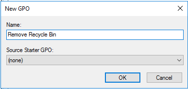

3. Nhấp chuột phải vào GPO **`Remove Recycle Bin`** vừa tạo ➔ Chọn **Edit** để mở cửa sổ **Group Policy Management Editor**.

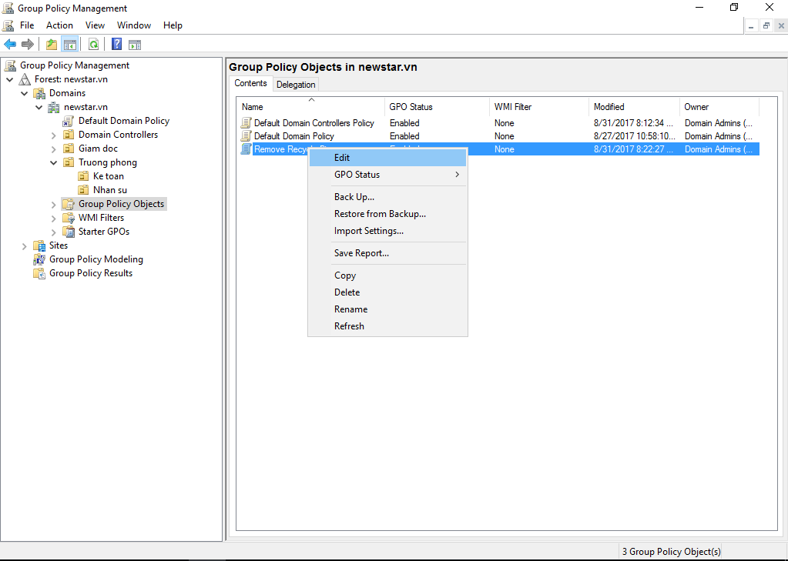

---

### PHẦN 2: CẤU HÌNH CÁC CHÍNH SÁCH HẠN CHẾ MÔI TRƯỜNG NGƯỜI DÙNG

#### Bước 2.1: Ẩn biểu tượng Computer và Recycle Bin trên Desktop
1. Trong cửa sổ **Group Policy Management Editor**, điều hướng theo cây thư mục bên trái:
   - `User Configuration` ➔ `Policies` ➔ `Administrative Templates` ➔ `Desktop` ➔ chọn mục `Desktop`.

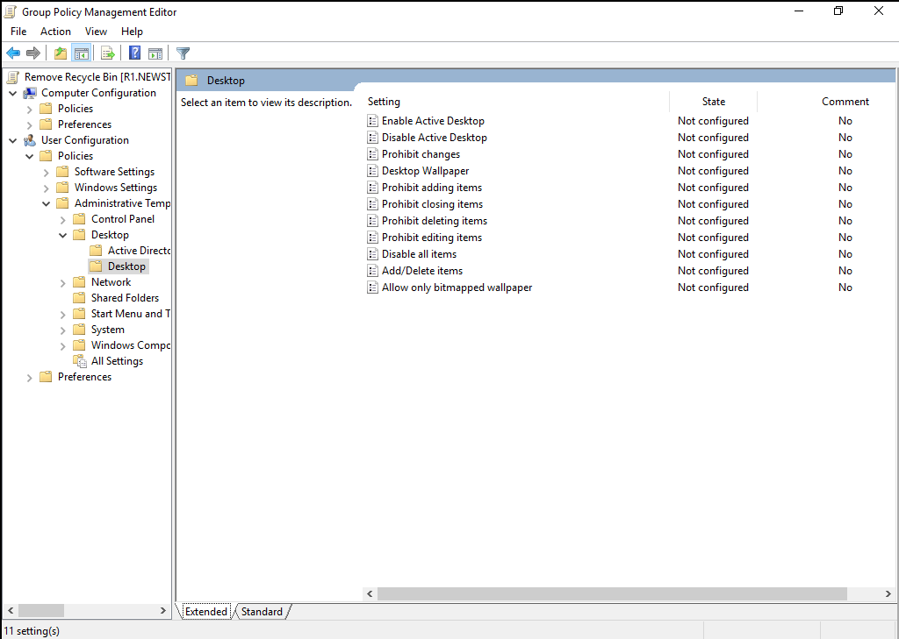

2. Cấu hình ẩn Computer icon:
   - Tìm kiếm thiết lập: **`Remove Computer icon on the desktop`**.
   - Nhấp đúp chuột vào setting này, chuyển trạng thái từ *Not Configured* sang **`Enabled`**.
   - Bấm **Apply** ➔ **OK**.

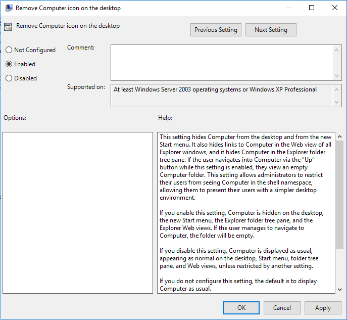

3. Cấu hình ẩn Recycle Bin:
   - Tìm kiếm thiết lập: **`Remove Recycle Bin icon from desktop`**.
   - Nhấp đúp chuột, chọn **`Enabled`**.
   - Bấm **Apply** ➔ **OK**.

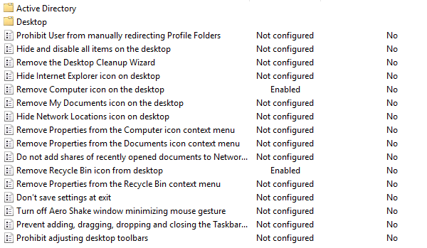

---

#### Bước 2.2: Ẩn mục chỉ định trong Control Panel (`Microsoft.Mouse`)
1. Điều hướng theo đường dẫn:
   - `User Configuration` ➔ `Policies` ➔ `Administrative Templates` ➔ `Control Panel`.
2. Ở khung bên phải, tìm chính sách: **`Hide specified Control Panel items`**.
3. Nhấp đúp chuột vào chính sách, chọn **`Enabled`**.
4. Tại khung *Options*, nhấp nút **`Show...`** bên cạnh dòng *List of disallowed Control Panel items*:
   - Trong cột **Value**, nhập chính xác: **`Microsoft.Mouse`**
5. Nhấn **OK** ➔ **Apply** ➔ **OK**.

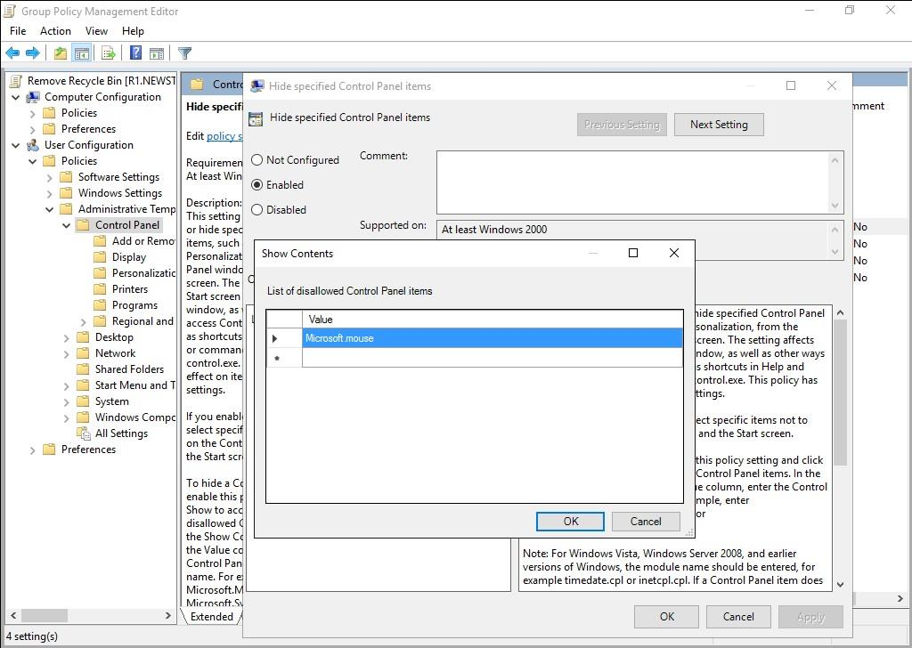

---

#### Bước 2.3: Cấm người dùng thay đổi Theme giao diện
1. Điều hướng theo đường dẫn:
   - `User Configuration` ➔ `Policies` ➔ `Administrative Templates` ➔ `Control Panel` ➔ `Personalization`.
2. Tìm chính sách: **`Prevent changing theme`**.
3. Nhấp đúp chuột, chọn **`Enabled`**.
4. Bấm **Apply** ➔ **OK**.

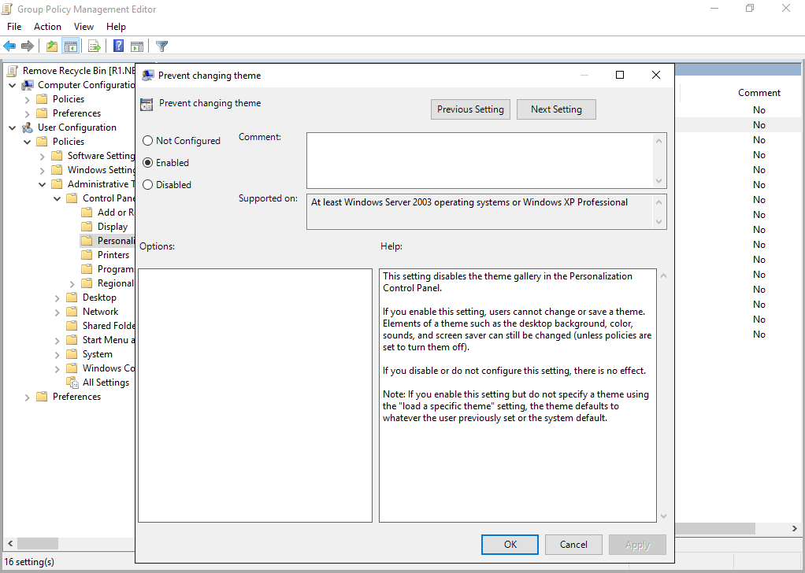

---

#### Bước 2.4: Khóa thuộc tính card mạng (Không cho sửa IP)
1. Điều hướng theo đường dẫn:
   - `User Configuration` ➔ `Policies` ➔ `Administrative Templates` ➔ `Network` ➔ `Network Connections`.
2. Tìm chính sách: **`Prohibit access to properties of a LAN connection`**.
3. Nhấp đúp chuột, chọn **`Enabled`**.
4. Bấm **Apply** ➔ **OK**.

> [!IMPORTANT]
> **LƯU Ý SỐNG CÒN VỀ TÀI KHOẢN ADMINISTRATOR KHI KHÓA MẠNG:**
> Mặc định trong Windows (kể từ Windows 2000/XP đến Windows 7/10/Server), hệ điều hành có cơ chế bảo vệ an toàn: **Các chính sách hạn chế card mạng sẽ KHÔNG ÁP DỤNG cho tài khoản thuộc nhóm Administrators** nhằm tránh việc Admin vô tình khóa chính mình không thể cấu hình mạng.
> 
> Vì vậy, nếu bạn đăng nhập vào Windows 7 bằng tài khoản **Administrator** hoặc tài khoản có quyền Admin cục bộ, bạn **vẫn sẽ thấy nút Properties và đổi được IP** trừ khi bạn bật thêm 2 chính sách bắt buộc sau:
> 1. **`Enable Network Connections settings for Administrators`**: Chọn **`Enabled`** (Bắt buộc các chính sách cấm thuộc tính mạng áp dụng cho cả tài khoản Administrator).
> 2. **`Prohibit access to properties of components of a LAN connection`**: Chọn **`Enabled`** (Vô hiệu hóa trực tiếp nút Properties của từng thành phần giao thức như TCP/IPv4 bên trong card mạng).
> 
> *(Bộ script tự động hóa `automate_lab6_gpo.ps1` đã được lập trình cấu hình đầy đủ cả 3 chính sách này vào GPO và Client để đảm bảo khóa chặt 100% mọi tài khoản).*

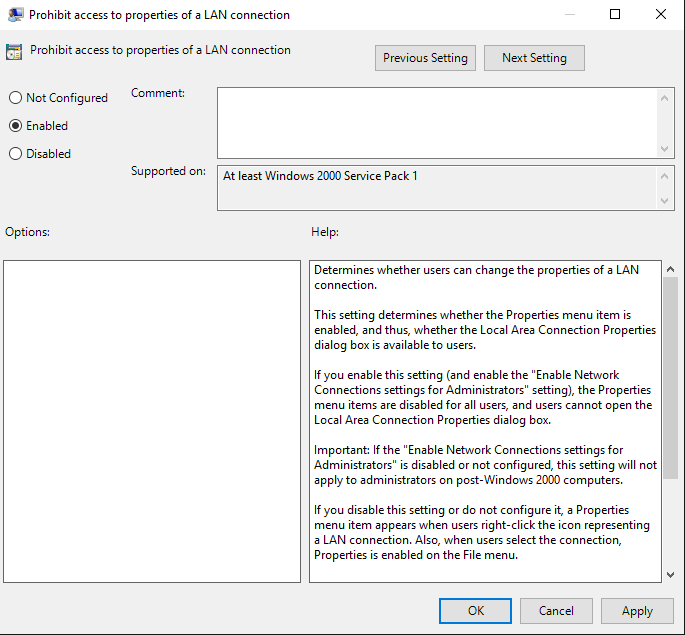

---

#### Bước 2.5: Khóa thanh Start Menu & Taskbar
1. Điều hướng theo đường dẫn:
   - `User Configuration` ➔ `Policies` ➔ `Administrative Templates` ➔ `Start Menu and Taskbar`.
2. Tìm chính sách: **`Lock the Taskbar`**.
3. Nhấp đúp chuột, chọn **`Enabled`**.
4. Bấm **Apply** ➔ **OK**.

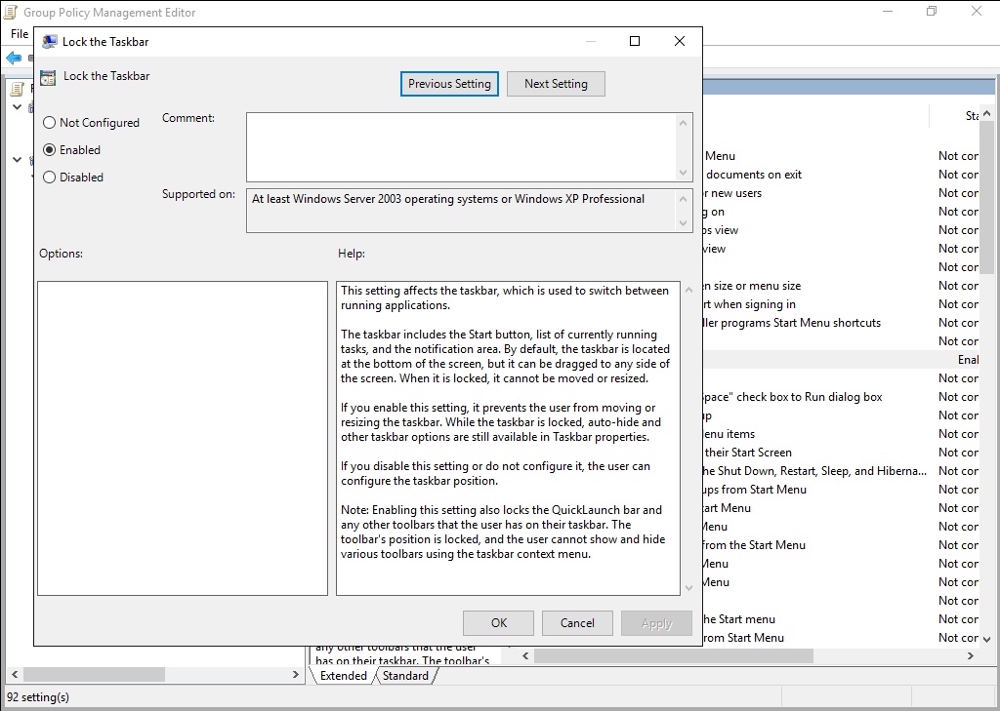

---

#### Bước 2.6: Chặn người dùng mở Command Prompt (CMD)
1. Điều hướng theo đường dẫn:
   - `User Configuration` ➔ `Policies` ➔ `Administrative Templates` ➔ `System`.
2. Tìm chính sách: **`Prevent access to the command prompt`**.
3. Nhấp đúp chuột, chọn **`Enabled`**.
4. Ở mục *Options* ➔ *Disable the command prompt script processing also?*:
   - Chọn **`Yes`** (hoặc `No` nếu vẫn muốn các file `.bat` kịch bản ngầm chạy).
5. Bấm **Apply** ➔ **OK**.

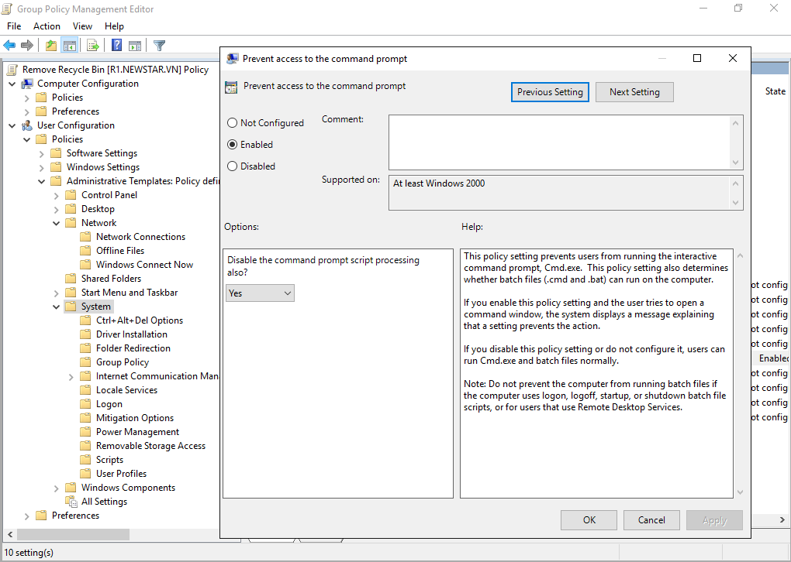

---

#### Bước 2.7: Chặn khởi chạy ứng dụng Paint (`mspaint.exe`)
1. Tại cùng mục: `User Configuration` ➔ `Policies` ➔ `Administrative Templates` ➔ `System`.
2. Tìm chính sách: **`Don't run specified Windows applications`**.
3. Nhấp đúp chuột, chọn **`Enabled`**.
4. Bấm vào nút **`Show...`** ở khung *Options*:
   - Trong danh sách *List of disallowed applications*, gõ: **`mspaint.exe`**
5. Bấm **OK** ➔ **Apply** ➔ **OK**.

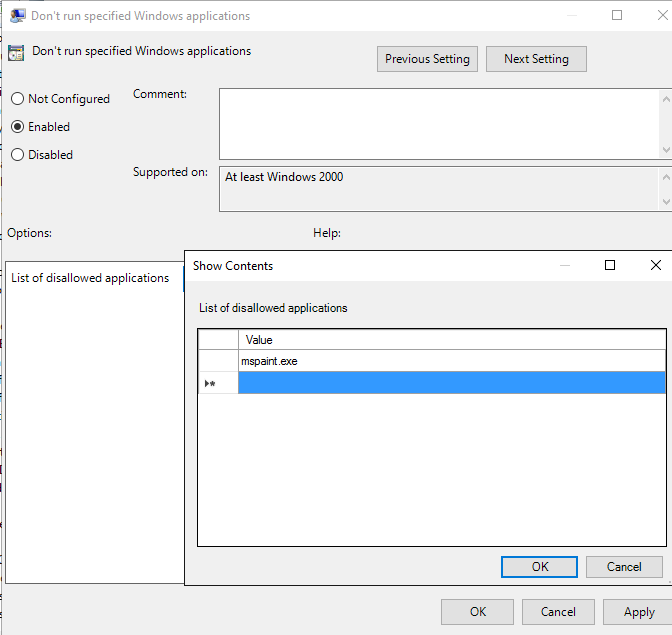

---

### PHẦN 3: TẠO GPO LOGON SCRIPT HIỂN THỊ CÂU CHÀO MỪNG

#### Bước 3.1: Tạo GPO `Script Logon`
1. Mở lại **Group Policy Management Console** (`gpmc.msc`).
2. Chuột phải vào nhánh tên miền `newstar.vn` ➔ Chọn **Create a GPO in this domain, and Link it here...**
3. Đặt tên GPO: **`Script Logon`** ➔ Bấm **OK**.
4. Chuột phải vào GPO `Script Logon` ➔ Chọn **Edit**.

#### Bước 3.2: Tạo file kịch bản VBScript `welcome.vbs`
1. Trong cửa sổ GPO Editor, điều hướng theo đường dẫn:
   - `User Configuration` ➔ `Policies` ➔ `Windows Settings` ➔ `Scripts (Logon/Logoff)`.
2. Ở khung bên phải, nhấp đúp vào **`Logon`**.

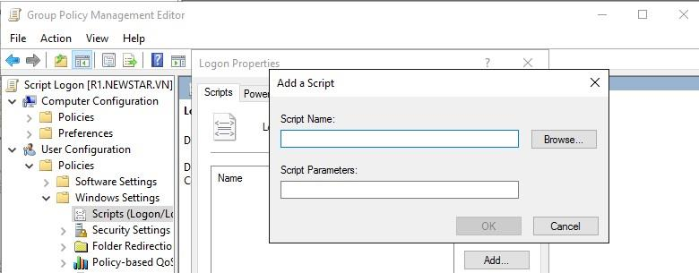

3. Trong cửa sổ **Logon Properties**, bấm nút **`Show Files...`**:
   - Windows Explorer sẽ mở thư mục SYSVOL lưu kịch bản logon tương ứng của GPO:
     `\\newstar.vn\SysVol\newstar.vn\Policies\{GUID}\User\Scripts\Logon`
4. Để tạo file đuôi `.vbs` chính xác không bị đổi nhầm thành `.txt`, vào **Organize** (hoặc menu View) ➔ **Folder and search options** ➔ tab **View** ➔ bỏ tích chọn ô ☑️ **`Hide extensions for known file types`** ➔ Bấm **OK**.

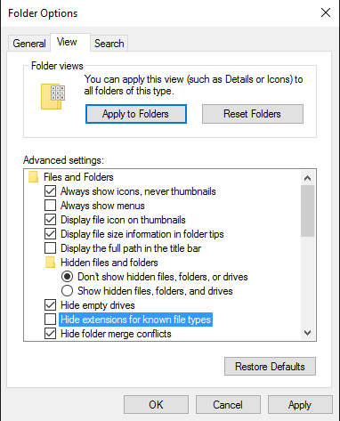

5. Trong thư mục `Logon` này:
   - Chuột phải chọn **New** ➔ **Text Document**.
   - Đổi tên file thành: **`welcome.vbs`** (lưu ý xóa bỏ đuôi `.txt`).
   - Chuột phải vào `welcome.vbs` chọn **Edit** (hoặc mở bằng Notepad).
   - Nhập nội dung sau:
     ```vbscript
     MsgBox "Chuc ban mot ngay lam viec vui ve", 64, "Chao mung"
     ```
   - Nhấn `Ctrl + S` lưu lại và đóng Notepad.
6. Quay lại cửa sổ **Logon Properties**:
   - Bấm nút **`Add...`**
   - Tại dòng *Script Name*, bấm **`Browse...`** ➔ Chọn file **`welcome.vbs`** vừa tạo.
   - Bấm **OK** ➔ Bấm **Apply** ➔ **OK**.

---

### PHẦN 4: LIÊN KẾT GPO (LINKING) & CẬP NHẬT CHÍNH SÁCH

1. Đảm bảo cả 2 GPO **`Remove Recycle Bin`** và **`Script Logon`** đều được liên kết trực tiếp vào tên miền `newstar.vn` (hoặc OU chứa tài khoản người dùng thử nghiệm).
2. Kiểm tra cột **Link Enabled** hiển thị là **Yes**.
3. Mở cửa sổ **PowerShell / CMD** với quyền Administrator trên Server, gõ:
   ```cmd
   gpupdate /force
   ```
   Hệ thống báo: *"User Policy update has completed successfully. Computer Policy update has completed successfully."*

---

## 🔍 QUY TRÌNH KIỂM THỬ VÀ NGHIỆM THU TRÊN MÁY TRẠM CLIENT

Khởi động máy trạm **Windows 7 Client** (`WIN7-PC1` hoặc `WIN7-PC2`). Đăng nhập bằng tài khoản người dùng thuộc miền `newstar.vn` (ví dụ: `KT1`, `NS1`, `SV1` hoặc `Administrator`).

### 1. Cập nhật chính sách tức thì:
Bấm tổ hợp phím `Windows + R`, gõ:
```cmd
gpupdate /force
```
Nhấn `Enter` và chờ lệnh thực thi xong.

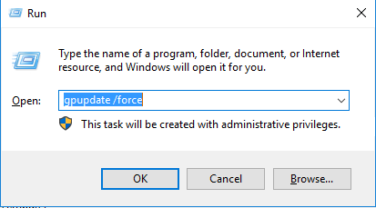

---

### 2. Nghiệm thu kết quả từng tính năng:

#### ✅ Kiểm tra 1: Biểu tượng Desktop đã bị ẩn
- Quan sát màn hình Desktop: Cả 2 biểu tượng **Computer** (`This PC`) và **Recycle Bin** (`Thùng rác`) đã hoàn toàn biến mất khỏi màn hình Desktop!

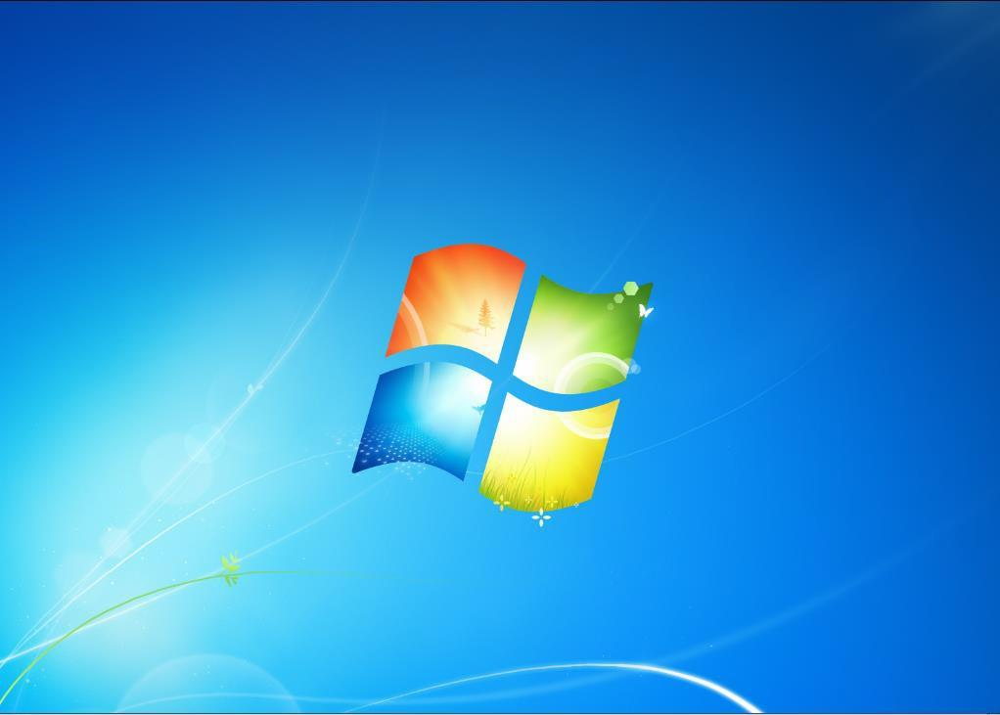

---

#### ✅ Kiểm tra 2: Mục Mouse trong Control Panel đã biến mất
- Vào menu **Start** ➔ Mở **Control Panel** ➔ Chọn chế độ xem **View by: Large icons**.
- Rà soát danh sách: Biểu tượng **Mouse** đã bị ẩn hoàn toàn, người dùng không thể can thiệp cài đặt chuột.

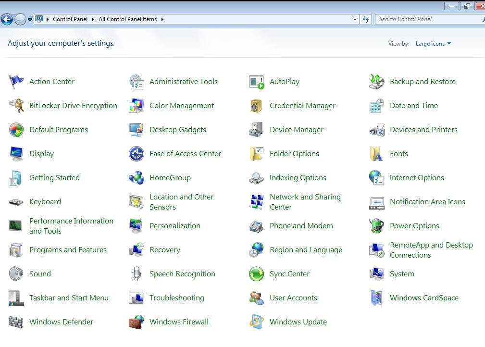

---

#### ✅ Kiểm tra 3: Bị cấm thay đổi Theme giao diện
- Chuột phải vào màn hình Desktop ➔ Chọn **Personalize** (hoặc vào Control Panel ➔ Personalization).
- **Kết quả**: Toàn bộ các gói Theme (Windows 7, Architecture, Characters...) đều bị làm mờ (grayed out) không thể nhấp chọn, phía dưới hiển thị dòng thông báo cảnh báo màu đen:
  > *"One or more of the settings on this page has been disabled by the system administrator."*

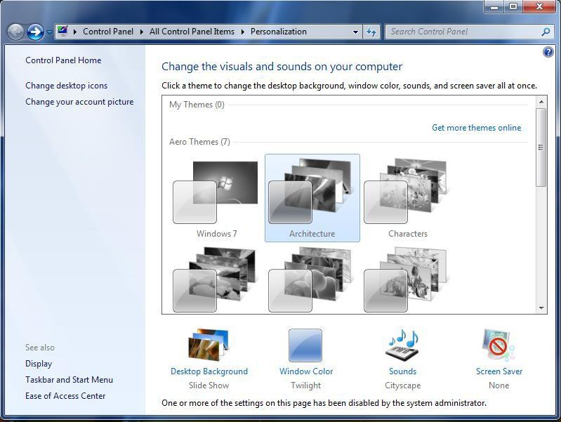

---

#### ✅ Kiểm tra 4: Không thể chỉnh sửa địa chỉ IP card mạng
- Vào **Control Panel** ➔ **Network and Sharing Center** ➔ Bấm **Change adapter settings**.
- Nhấp chuột phải vào card mạng **Local Area Connection**.
- **Kết quả**: Mục **`Properties`** ở cuối menu chuột phải bị làm mờ màu xám (disabled), người dùng không thể nhấp vào để thay đổi IP!

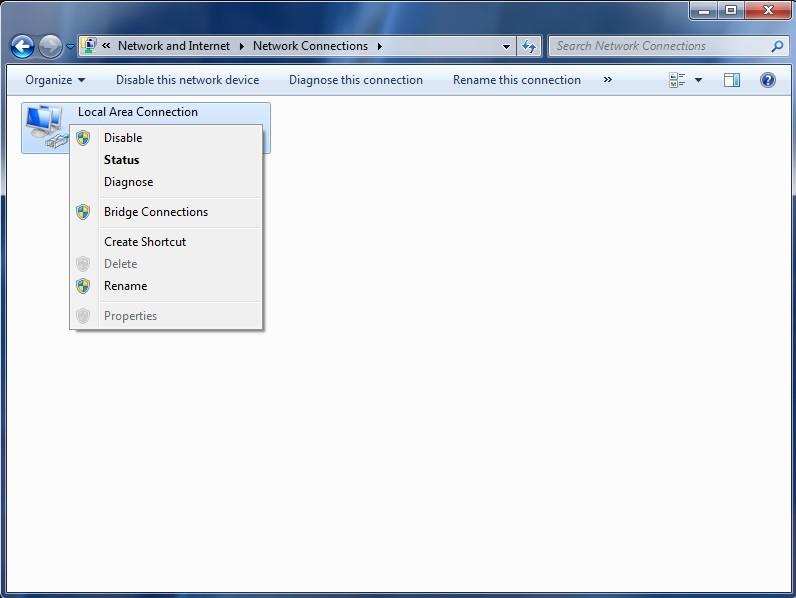

---

#### ✅ Kiểm tra 5: Thanh tác vụ Taskbar đã bị khóa cứng
- Nhấp chuột phải vào vị trí trống trên thanh **Taskbar**.
- **Kết quả**: Dòng **`Lock the taskbar`** đã được đánh dấu tích `✓` tự động và bị vô hiệu hóa (mờ đi), người dùng không thể kéo giãn, di chuyển thanh Taskbar sang các cạnh màn hình.

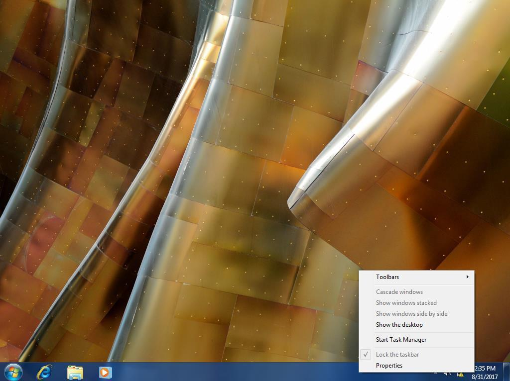

---

#### ✅ Kiểm tra 6: Cửa sổ dòng lệnh Command Prompt (CMD) bị chặn
- Bấm `Windows + R`, gõ `cmd` và nhấn `Enter`.
- **Kết quả**: Cửa sổ màu đen hiện lên dòng chữ từ chối từ quản trị viên và không cho gõ lệnh:
  > ```text
  > The command prompt has been disabled by your administrator.
  > Press any key to continue . . .
  > ```

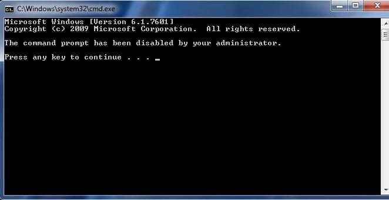

---

#### ✅ Kiểm tra 7: Ứng dụng Paint (`mspaint.exe`) bị chặn khởi chạy
- Bấm `Windows + R`, gõ `mspaint` (hoặc vào *Start* ➔ *Accessories* ➔ *Paint*).
- **Kết quả**: Hệ điều hành Windows lập tức bật hộp thoại cảnh báo với biểu tượng dấu gạch chéo đỏ:
  > **Restrictions**  
  > *"This operation has been cancelled due to restrictions in effect on this computer. Please contact your system administrator."*

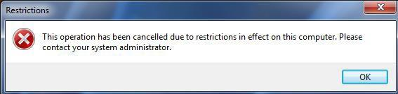

---

#### ✅ Kiểm tra 8: Hộp thoại chào mừng xuất hiện khi đăng nhập
- Đăng xuất (`Log off`) tài khoản và đăng nhập lại vào máy trạm Windows 7.
- **Kết quả**: Ngay khi vừa vào Desktop, hộp thoại VBScript lập tức xuất hiện trang trọng trên màn hình:
  > **Chao mung**  
  > *"Chuc ban mot ngay lam viec vui ve"*

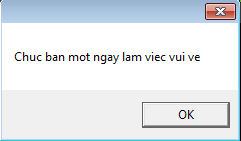

---

## ⚡ TỰ ĐỘNG HÓA BẰNG POWERSHELL

Thay vì thao tác thủ công qua giao diện đồ họa GUI nhiều bước, bạn có thể thực thi trọn vẹn toàn bộ quy trình trên bằng bộ script tự động hóa được tích hợp sẵn:

1. **Script cấu hình toàn diện trên máy chủ Server**:
   - Tệp: [`automate_lab6_gpo.ps1`](./automate_lab6_gpo.ps1)
   - Chức năng: Tự động khởi tạo 2 GPO `Remove Recycle Bin` và `Script Logon`, nạp đầy đủ các registry policy, tạo file kịch bản `welcome.vbs` trong Sysvol và liên kết vào Domain root.
2. **Script kiểm tra & nghiệm thu tự động (Validation Report)**:
   - Tệp: [`verify_lab6.ps1`](./verify_lab6.ps1)
   - Chức năng: Kết nối kiểm tra tình trạng áp dụng chính sách trên cả Server và 2 máy trạm Client 1, Client 2; xuất báo cáo Pass/Fail chi tiết cho giảng viên chấm điểm.

---

## 💡 MẸO VÀ KINH NGHIỆM XỬ LÝ SỰ CỐ (TROUBLESHOOTING)

1. **Lệnh xem kết quả chính sách thực tế áp dụng (RSOP)**:
   - Trên máy Client, mở Command Prompt hoặc PowerShell gõ:
     ```cmd
     gpresult /v
     ```
     Hoặc gõ `rsop.msc` để mở giao diện trực quan xem các chính sách đang có hiệu lực.
2. **Khi máy Client không nhận GPO mới**:
   - Đảm bảo card mạng của máy Client trỏ đúng **Preferred DNS** về địa chỉ IP của Domain Controller (`192.168.11.1` hoặc `100.100.11.1`).
   - Ping kiểm tra thông suốt tên miền: `ping newstar.vn`.
   - Chạy lệnh làm mới chính sách bắt buộc: `gpupdate /force /boot` (nếu có chính sách cần khởi động lại máy).
3. **Lưu ý về tài khoản Administrator**:
   - Các chính sách thuộc phần `User Configuration` áp dụng cho tài khoản người dùng đăng nhập. Nếu quản trị viên muốn tự loại trừ tài khoản `Administrator` để không bị chặn CMD khi quản trị, vào tab **Delegation** của GPO ➔ chọn **Advanced** ➔ tìm nhóm **Domain Admins** ➔ tích ô **Deny** ở quyền **Apply group policy**.
