# HƯỚNG DẪN THỰC HÀNH CHI TIẾT LAB 7
## TRIỂN KHAI VÀ QUẢN TRỊ PROFILE TRONG WINDOWS SERVER ACTIVE DIRECTORY
### (Home Directory, Logon Script Mapped Drives, FSRM Storage Quota, Roaming Profile, Folder Redirection)

---

## 🎯 MỤC TIÊU BÀI THỰC HÀNH
1. **Nắm vững bản chất các loại User Profile trong Windows**:
   - **Local Profile**: Hồ sơ người dùng lưu cục bộ trên từng máy tính trạm, không đồng bộ khi chuyển máy.
   - **Home Folder (Home Directory)**: Ánh xạ ổ đĩa mạng riêng cho từng người dùng (`Z:`), lưu trữ tài liệu cá nhân tập trung về máy chủ Domain Controller / File Server.
   - **Roaming Profile**: Hồ sơ người dùng di động, đồng bộ toàn bộ Desktop, Documents, AppData, thiết lập giao diện cá nhân... theo tài khoản người dùng đến bất kỳ máy tính nào trong miền khi đăng nhập/đăng xuất.
   - **Folder Redirection (Chuyển hướng thư mục)**: Chuyển hướng lưu trữ các thư mục đặc biệt như `Documents` (My Documents), `Desktop`... về máy chủ File Server một cách trong suốt với người dùng, kết hợp bộ đệm ngoại tuyến (Offline Files).
2. **Kiểm soát dung lượng lưu trữ với File Server Resource Manager (FSRM Quota)**:
   - Thiết lập hạn ngạch lưu trữ cứng (**Hard Quota**) và mềm (**Soft Quota**) trên các thư mục chia sẻ dùng chung và dùng riêng của từng phòng ban (ví dụ phòng Nhân sự: thư mục chung 1 GB, thư mục riêng 500 MB).
3. **Tự động hóa ánh xạ ổ đĩa bằng Group Policy Logon Script**:
   - Triển khai kịch bản Batch (`profile.bat`) tự động gán các ký tự ổ đĩa mạng (`M:`, `N:`) theo đúng phòng ban khi người dùng đăng nhập vào hệ thống.
4. **Kỹ năng kiểm thử, nghiệm thu và xử lý sự cố (Troubleshooting)**:
   - Sử dụng các lệnh kiểm tra `net use`, `gpupdate /force`, `gpresult /r`, cấu hình phân quyền NTFS & SMB Share chính xác để tránh lỗi từ chối truy cập (Access Denied).

---

## 🖥️ MÔ HÌNH VÀ THÔNG SỐ HỆ THỐNG MÁY ẢO

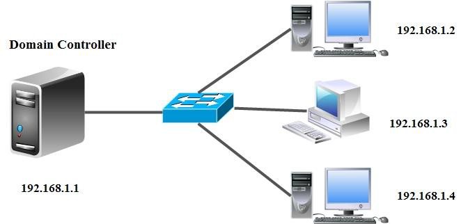

* **Máy chủ Domain Controller / File Server (Windows Server 2012 R2 / 2016 / 2019)**
  - Tên máy: `WIN-P6PG9M9AICK` (hoặc tên viết tắt `R1`)
  - Tên miền quản trị: `newstar.vn`
  - Địa chỉ IP: `192.168.1.154` (NAT) / `192.168.11.1` (VMnet11) / `100.100.11.1` (VMnet12)
  - Vai trò: Domain Controller (AD DS), DNS Server, File Server Resource Manager (FSRM), Group Policy Management
  - Tài khoản quản trị: `Administrator` / Mật khẩu: `123`

* **Máy trạm Client 1 (Windows 7 Professional SP1 - `WIN7-PC1`)**
  - Địa chỉ IP: `192.168.11.2/24` (VMnet11)
  - DNS Server: `192.168.11.1` (Trỏ về máy chủ Domain Controller)
  - Trạng thái: Đã gia nhập miền `newstar.vn` (Joined Domain)
  - Người dùng kiểm thử: `hiepdh`, `u1`, `u2`, `ns1`, `ns2`, `sep`, `u11`

* **Máy trạm Client 2 (Windows 7 Professional SP1 - `WIN7-PC2`)**
  - Địa chỉ IP: `100.100.11.2/24` (VMnet12)
  - DNS Server: `100.100.11.1` (Trỏ về máy chủ Domain Controller)
  - Trạng thái: Đã gia nhập miền `newstar.vn` (Joined Domain)

---

## 📊 BẢNG TỔNG HỢP CÁC THÀNH PHẦN CẤU HÌNH TRONG BÀI LAB

| STT | Thành phần cấu hình | Thư mục vật lý trên Server | Tên SMB Share | Quyền Share / NTFS | Đối tượng người dùng áp dụng | Kết quả đạt được trên máy Client |
| :---: | :--- | :--- | :--- | :--- | :--- | :--- |
| **1** | **Home Folder** | `C:\home` | `home` | **Share**: Everyone Full Control<br>**NTFS**: Users Modify | `hiepdh`, `u1`, `u2` | Tự động xuất hiện ổ đĩa `Z:` kết nối về `\\SERVER\home\<username>`. Thư mục riêng tự động tạo trên server. |
| **2** | **Nhansu Chung** | `C:\Nhansu_Chung` | `Nhansu_Chung` | **Share**: Everyone Full Control<br>**NTFS**: Modify, Quota **1 GB** | Users trong OU `Nhansu` (`ns1`, `ns2`) | Tự động ánh xạ thành ổ đĩa `M:` (dung lượng hiển thị 1.00 GB). |
| **3** | **Nhansu Rieng** | `C:\Nhansu_rieng` | `Nhansu_rieng` | **Share**: Everyone Full Control<br>**NTFS**: Modify, Quota **500 MB** | Users trong OU `Nhansu` (`ns1`, `ns2`) | Tự động ánh xạ thành ổ đĩa `N:` (dung lượng hiển thị 500 MB). |
| **4** | **Logon Script** | `SYSVOL\... \profile.bat` | Netlogon / Sysvol | Script gán ổ đĩa `M:` và `N:` | GPO `Profile nhansu` link OU `Nhansu` | Mỗi khi user `ns1`, `ns2` đăng nhập, 2 ổ đĩa mạng `M:` và `N:` tự động gắn vào Computer. |
| **5** | **Roaming Profile** | `C:\Sep_Roaming` | `Sep_Roaming` | **Share**: Everyone Full Control<br>**NTFS**: Auth Users Full Control | Tài khoản `sep` (Sếp / Giám đốc) | Hồ sơ chuyển vùng (Desktop, Documents...) lưu về `C:\Sep_Roaming\sep.V2`. Chuyển máy làm việc vẫn giữ nguyên môi trường. |
| **6** | **Folder Redirection** | `C:\Direction` | `Direction` | **Share**: Everyone Full Control<br>**NTFS**: Everyone Full Control | GPO `Folder Redirection` link OU `Ke Toan` (User `u11`) | Thư mục `My Documents` trỏ thẳng về `\\SERVER\Direction\u11\Documents`. Dữ liệu lưu tập trung trên Server. |

---

## 🛠️ HƯỚNG DẪN THỰC HIỆN CHI TIẾT TỪNG BƯỚC

---

### PHẦN 1: CẤU HÌNH HOME PROFILE (HOME FOLDER)
> **Mục đích**: Cung cấp cho mỗi nhân viên một ổ đĩa cá nhân (ổ `Z:`) để lưu trữ dữ liệu riêng. Thư mục được đặt trên máy chủ nhưng hiển thị trực quan như một ổ cứng trên máy trạm của người dùng.

#### Bước 1.1: Tạo thư mục và chia sẻ tài nguyên `home`
1. Trên máy chủ **Windows Server**, mở **File Explorer**, truy cập ổ đĩa `C:`.
2. Nhấp chuột phải ➔ **New** ➔ **Folder**, đặt tên thư mục là `home`.
3. Nhấp chuột phải vào thư mục `C:\home` ➔ Chọn **Properties** ➔ Chọn tab **Sharing** ➔ Bấm **Advanced Sharing...**.
4. Tích chọn **Share this folder**, mục **Share name** để là `home`.
5. Bấm vào nút **Permissions**:
   - Chọn nhóm **Everyone**.
   - Tích chọn **Full Control**, **Change**, **Read** trong cột **Allow**.
   - Bấm **OK** ➔ **OK**.

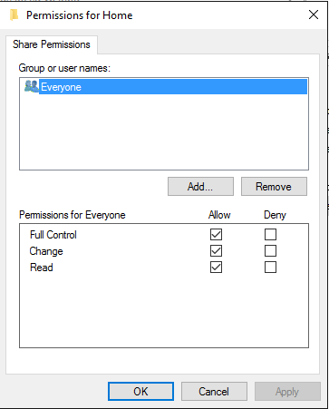

6. Chuyển sang tab **Security** (phân quyền NTFS):
   - Đảm bảo nhóm **Authenticated Users** hoặc **Users** có quyền **Modify**, nhóm **SYSTEM** và **Administrators** có quyền **Full Control**.

#### Bước 1.2: Cấu hình thuộc tính Home Folder cho người dùng trong Active Directory
1. Mở công cụ **Active Directory Users and Computers** (`dsa.msc`).
2. Tìm đến tài khoản người dùng cần cấu hình (ví dụ: `hiepdh` trong OU `KhoaCNTT` hoặc `Users`).
3. Nhấp chuột phải vào tài khoản ➔ Chọn **Properties** ➔ Chuyển sang tab **Profile**:
   - Tại khung **Home folder**, tích chọn **Connect**.
   - Mục chọn chữ cái ổ đĩa: Chọn **`Z:`**.
   - Ô **To**: Nhập đường dẫn mạng theo cú pháp:
     ```text
     \\WIN-P6PG9M9AICK\home\%username%
     ```
     *(Trong đó biến `%username%` sẽ tự động chuyển thành tên tài khoản tương ứng, ví dụ `hiepdh`).*
4. Bấm **Apply** ➔ Hệ thống tự động thay `%username%` bằng tên user ➔ Bấm **OK**.

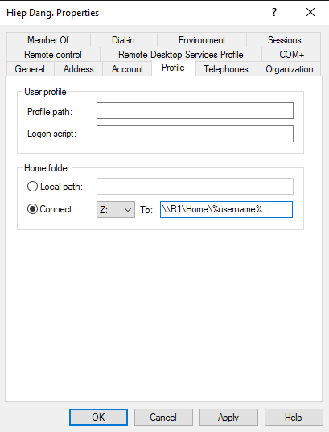

#### Bước 1.3: Cấu hình đồng loạt Home Folder cho nhiều người dùng
1. Trong **Active Directory Users and Computers**, giữ phím `Ctrl` hoặc quét chuột để chọn nhiều tài khoản cùng lúc (ví dụ: `u1`, `u2`).
2. Nhấp chuột phải ➔ Chọn **Properties**.
3. Chuyển sang tab **Profile**:
   - Tích chọn hộp kiểm **Home folder**.
   - Chọn **Connect**: Chọn ổ **`Z:`**.
   - Ô **To**: Nhập `\\WIN-P6PG9M9AICK\home\%username%`.
4. Bấm **OK**. Hệ thống sẽ tự động gán đường dẫn riêng biệt cho từng người dùng đã chọn.

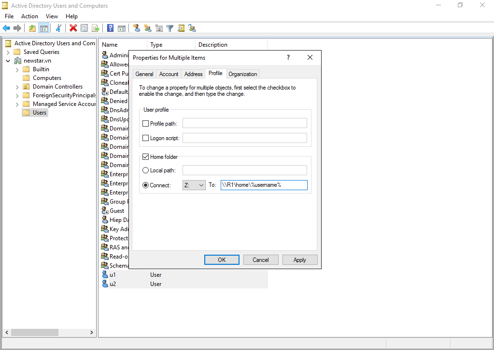

5. Kiểm tra trên máy chủ tại đường dẫn `C:\home`: Bạn sẽ thấy hệ thống tự động sinh ra các thư mục con riêng biệt cho từng tài khoản (`hiepdh`, `u1`, `u2`) và tự động phân quyền chỉ tài khoản đó mới có quyền truy cập.

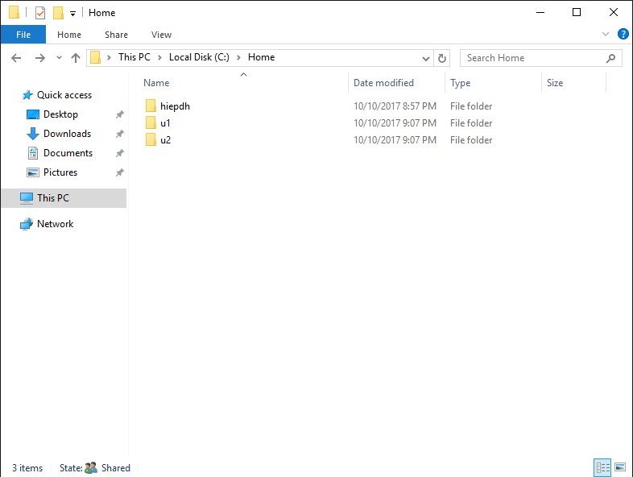

#### Bước 1.4: Kiểm tra kết quả trên máy trạm Client
1. Đăng nhập vào máy trạm **Client 1 (Windows 7)** bằng tài khoản domain `newstar\hiepdh` (mật khẩu: `123`).
2. Mở **Computer** (hoặc **This PC**):
   - Trong mục **Network Location**, bạn sẽ thấy xuất hiện ổ đĩa mạng:
     **`hiepdh (\\WIN-P6PG9M9AICK\home) (Z:)`**
3. Thử tạo một tệp tin mới trong ổ `Z:`, sau đó quay lại máy chủ mở thư mục `C:\home\hiepdh` kiểm tra: Tệp tin đã được lưu trữ an toàn trên máy chủ!

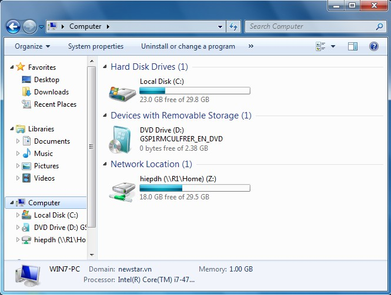

---

### PHẦN 2: CẤU HÌNH LOGON SCRIPT KẾT HỢP FSRM QUOTA, SHARE VÀ NTFS
> **Mục đích**: Ánh xạ tự động ổ đĩa phòng ban dùng chung (`M:`) và dùng riêng (`N:`) cho phòng Nhân sự thông qua kịch bản đăng nhập (Logon Script GPO), đồng thời giới hạn dung lượng lưu trữ (FSRM Quota) trên máy chủ: thư mục chung 1 GB, thư mục riêng 500 MB.

#### Bước 2.1: Tạo các thư mục và chia sẻ tài nguyên cho phòng Nhân sự
1. Trên máy chủ, tạo 2 thư mục tại ổ `C:`:
   - `C:\Nhansu_Chung` (Dùng chung cho toàn bộ nhân sự)
   - `C:\Nhansu_rieng` (Dùng riêng lưu trữ nghiệp vụ)
2. Chia sẻ cả 2 thư mục với quyền **Share**:
   - Nhấp chuột phải vào `C:\Nhansu_Chung` ➔ **Properties** ➔ **Sharing** ➔ **Advanced Sharing** ➔ Tích **Share this folder** với tên `Nhansu_Chung` ➔ Bấm **Permissions** ➔ Cấp **Full Control** cho **Everyone**.
   - Thực hiện tương tự cho `C:\Nhansu_rieng` với tên share `Nhansu_rieng`.

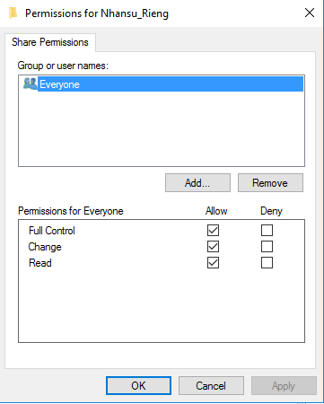

#### Bước 2.2: Chuẩn bị OU và tài khoản phòng Nhân sự
1. Mở **Active Directory Users and Computers** (`dsa.msc`).
2. Tạo đơn vị tổ chức OU mới có tên: **`Nhansu`**.
3. Tạo hoặc di chuyển 2 tài khoản **`ns1`** và **`ns2`** vào trong OU `Nhansu`.

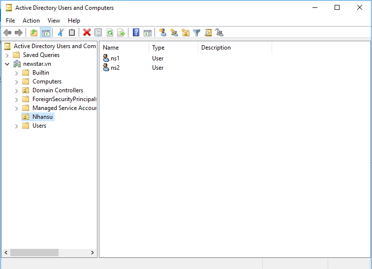

#### Bước 2.3: Tạo kịch bản đăng nhập (Logon Script `profile.bat`) trong GPO
1. Mở **Group Policy Management Console** (`gpmc.msc`).
2. Nhấp chuột phải vào OU **`Nhansu`** ➔ Chọn **Create a GPO in this domain, and Link it here...**.
3. Đặt tên GPO là: **`Profile nhansu`** ➔ Bấm **OK**.

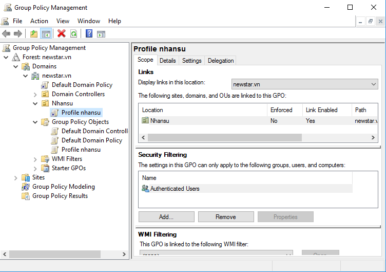

4. Nhấp chuột phải vào GPO **`Profile nhansu`** ➔ Chọn **Edit** để mở cửa sổ Group Policy Management Editor.
5. Điều hướng theo nhánh:
   - `User Configuration` ➔ `Policies` ➔ `Windows Settings` ➔ `Scripts (Logon/Logoff)`.
6. Nhấp đúp vào mục **Logon**:
   - Bấm vào nút **Show Files...**: Cửa sổ thư mục Logon của GPO trong SYSVOL sẽ mở ra.
   - Nhấp chuột phải trong thư mục này ➔ **New** ➔ **Text Document**, đặt tên là `profile.bat` (chú ý bỏ đuôi `.txt`).
   - Mở tệp `profile.bat` bằng Notepad và soạn thảo nội dung 2 dòng lệnh ánh xạ ổ đĩa:
     ```cmd
     net use m: \\WIN-P6PG9M9AICK\Nhansu_Chung
     net use n: \\WIN-P6PG9M9AICK\Nhansu_rieng
     ```
   - Lưu tệp (`Ctrl + S`) và đóng Notepad.

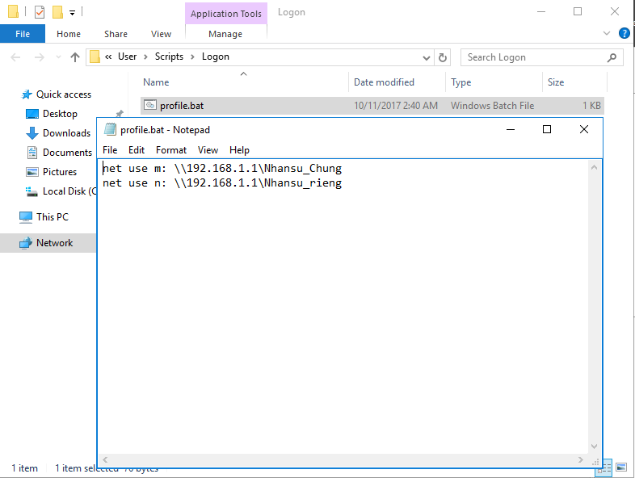

7. Trở lại hộp thoại **Logon Properties**:
   - Bấm nút **Add...**.
   - Bấm **Browse...** ➔ Chọn tệp `profile.bat` vừa tạo ➔ Bấm **Open** ➔ Bấm **OK** ➔ Bấm **Apply** ➔ **OK**.

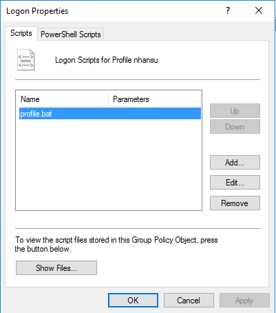

#### Bước 2.4: Cấu hình hạn ngạch lưu trữ đĩa (FSRM Quota Management)
1. Cài đặt vai trò **File Server Resource Manager** (nếu chưa cài):
   - Mở **Server Manager** ➔ **Add roles and features** ➔ Chọn **File and Storage Services** ➔ **File and iSCSI Services** ➔ Tích chọn **File Server Resource Manager** ➔ Bấm Next và Install.
2. Mở công cụ: **Server Manager** ➔ Menu **Tools** ➔ Chọn **File Server Resource Manager**.
3. Mở rộng nhánh: **Quota Management** ➔ Chọn mục **Quotas**.
4. Thiết lập hạn ngạch cho thư mục dùng chung `C:\Nhansu_Chung`:
   - Nhấp chuột phải vào vùng trống (hoặc panel bên phải) ➔ Chọn **Create Quota...**.
   - **Quota path**: Bấm **Browse...** chọn đường dẫn `C:\Nhansu_Chung`.
   - Chọn mục: **Define custom quota properties** ➔ Bấm **Custom Properties...**.
   - Đặt **Space limit**: Nhập giá trị **`1`** và đơn vị chọn **`GB`**.
   - Chọn loại: **Hard quota: Do not allow users to exceed limit**.
   - Bấm **OK** ➔ Bấm **Create** (chọn lưu cấu hình trực tiếp hoặc tạo template).
5. Thiết lập hạn ngạch cho thư mục dùng riêng `C:\Nhansu_rieng`:
   - Tương tự, chọn **Create Quota...**, Quota path: `C:\Nhansu_rieng`.
   - **Space limit**: Nhập **`500`** và đơn vị **`MB`**, chọn **Hard quota**.
   - Bấm **OK** ➔ Bấm **Create**.

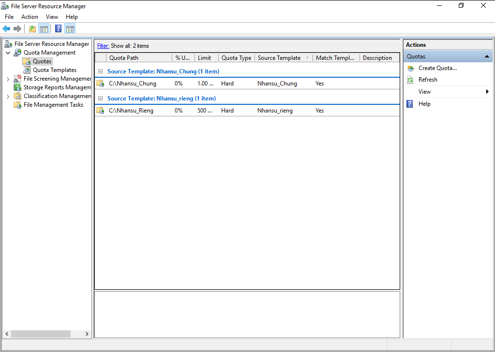

#### Bước 2.5: Kiểm tra kết quả ánh xạ ổ đĩa và Quota trên Client
1. Đăng nhập vào máy Client bằng tài khoản nhân sự: `newstar\ns1` (mật khẩu: `123`).
2. Mở **Computer**:
   - Quan sát mục **Network Location**: Tự động xuất hiện 2 ổ đĩa mạng:
     - **`Nhansu_Chung (\\WIN-P6PG9M9AICK) (M:)`**: Hiển thị tổng dung lượng là `1.00 GB`.
     - **`Nhansu_rieng (\\WIN-P6PG9M9AICK) (N:)`**: Hiển thị tổng dung lượng là `500 MB`.
3. Thử copy dữ liệu vượt quá dung lượng cho phép: Hệ thống Windows sẽ cảnh báo không đủ dung lượng (There is not enough space on...), chứng minh chính sách Hard Quota hoạt động chuẩn xác!

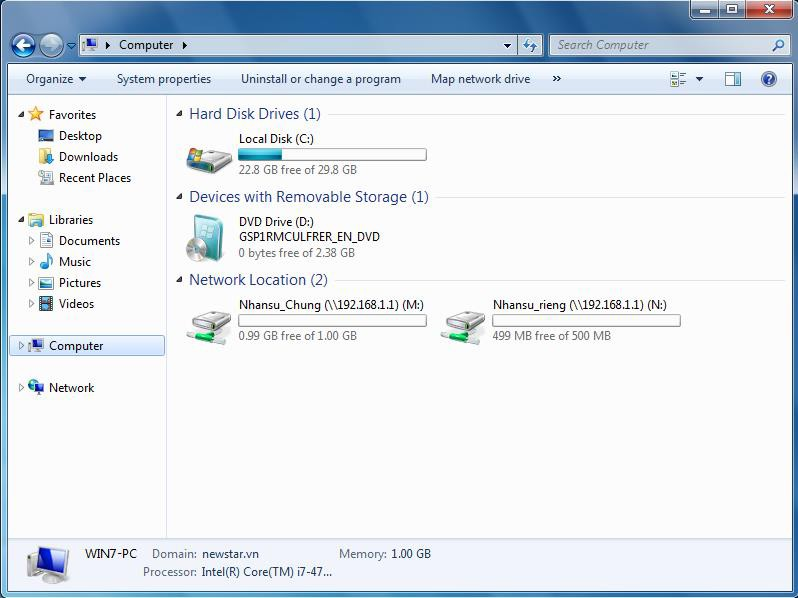

---

### PHẦN 3: CẤU HÌNH ROAMING PROFILE CHO LÃNH ĐẠO (SẾP)
> **Mục đích**: Tài khoản lãnh đạo (`sep`) thường xuyên di chuyển giữa các văn phòng và phòng họp. Roaming Profile giúp môi trường làm việc cá nhân của sếp (Desktop, tài liệu, icon, thanh công cụ...) tự động tải về khi đăng nhập bất kỳ máy trạm nào và đồng bộ ngược lên máy chủ khi đăng xuất.

#### Bước 3.1: Tạo thư mục và chia sẻ tài nguyên `Sep_Roaming`
1. Trên máy chủ, tạo thư mục: `C:\Sep_Roaming`.
2. Chia sẻ thư mục:
   - Nhấp chuột phải vào `C:\Sep_Roaming` ➔ **Properties** ➔ **Sharing** ➔ **Advanced Sharing...**.
   - Tích chọn **Share this folder**, đặt tên share là: **`Sep_Roaming`**.
   - Bấm **Permissions** ➔ Cấp quyền **Full Control** cho **Everyone** ➔ Bấm **OK** ➔ **OK**.

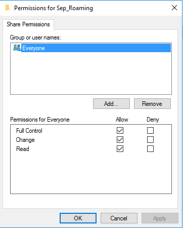

3. Tại tab **Security**: Đảm bảo nhóm **Authenticated Users** có quyền **Full Control** (hoặc Modify) để máy trạm của sếp có thể ghi đè dữ liệu profile khi đăng xuất.

#### Bước 3.2: Cấu hình đường dẫn Roaming Profile trên tài khoản `sep`
1. Mở **Active Directory Users and Computers** (`dsa.msc`).
2. Tạo hoặc tìm tài khoản **`sep`** (Họ tên: *Sep Giam Doc*, username: *sep*, mật khẩu: *123*).
3. Nhấp chuột phải vào tài khoản `sep` ➔ Chọn **Properties** ➔ Chuyển sang tab **Profile**:
   - Tại mục **User profile**, ô **Profile path**: Nhập đường dẫn UNC:
     ```text
     \\WIN-P6PG9M9AICK\Sep_Roaming\%username%
     ```
     *(Hoặc nhập thẳng: `\\WIN-P6PG9M9AICK\Sep_Roaming\sep`).*
4. Bấm **Apply** ➔ Bấm **OK**.

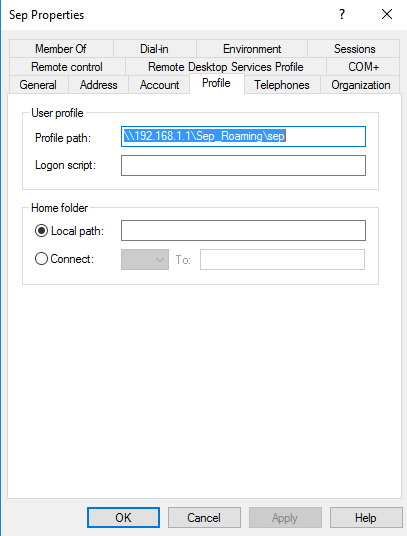

#### Bước 3.3: Kiểm tra quá trình đồng bộ Roaming Profile
1. Trên máy Client 1, đăng nhập bằng tài khoản `newstar\sep` (mật khẩu: `123`).
2. Tạo một vài tập tin hoặc thư mục thử nghiệm trên màn hình Desktop (ví dụ: `KeHoachKinhDoanh.docx`).
3. Chọn **Start** ➔ **Log off** (Đăng xuất khỏi Client 1).
   - *Trong quá trình Log off, Windows sẽ tải toàn bộ thư mục cá nhân lên máy chủ.*
4. Quay trở lại máy chủ kiểm tra thư mục `C:\Sep_Roaming`:
   - Bạn sẽ thấy tự động xuất hiện thư mục: **`sep.V2`** (Hậu tố `.V2` biểu thị định dạng Profile của Windows 7 / Server 2008 R2; nếu đăng nhập từ Windows 10 sẽ là `.V5` hoặc `.V6`).
5. Đăng nhập tài khoản `sep` trên máy **Client 2**: Toàn bộ icon, tệp tin và hình nền Desktop đã được tải về nguyên vẹn!

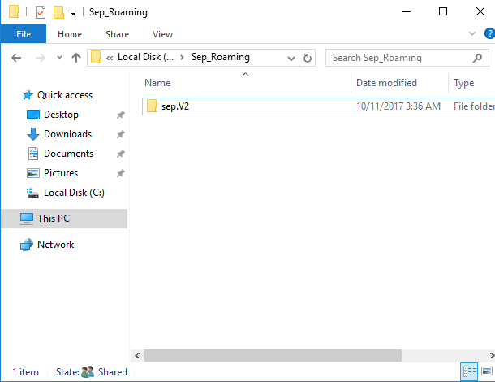

---

### PHẦN 4: CẤU HÌNH FOLDER REDIRECTION (CHUYỂN HƯỚNG MY DOCUMENTS)
> **Mục đích**: Tách biệt thư mục tài liệu `Documents` (My Documents) khỏi máy trạm cục bộ và lưu trữ trực tiếp trên File Server. Giúp sao lưu dữ liệu tập trung, chống mất mát khi máy trạm bị hỏng ổ cứng hoặc nhiễm mã độc.

#### Bước 4.1: Tạo thư mục và chia sẻ tài nguyên `Direction`
1. Trên máy chủ, tạo thư mục tại ổ đĩa `C:` có tên: `C:\Direction`.
2. Chia sẻ thư mục:
   - Nhấp chuột phải vào `C:\Direction` ➔ **Properties** ➔ **Sharing** ➔ **Advanced Sharing...**.
   - Tích chọn **Share this folder**, đặt tên share là: **`Direction`**.
   - Bấm **Permissions** ➔ Cấp quyền **Full Control** cho **Everyone** ➔ Bấm **OK** ➔ **OK**.

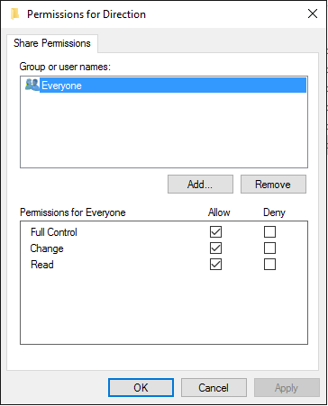

#### Bước 4.2: Tạo OU và tài khoản phòng Kế toán
1. Trong **Active Directory Users and Computers**, tạo OU mới có tên: **`Ke Toan`**.
2. Tạo tài khoản người dùng kiểm thử trong OU `Ke Toan` có tên là: **`u11`** (mật khẩu: `123`).

#### Bước 4.3: Khởi tạo và cấu hình GPO `Folder Redirection`
1. Mở **Group Policy Management Console** (`gpmc.msc`).
2. Nhấp chuột phải vào OU **`Ke Toan`** ➔ Chọn **Create a GPO in this domain, and Link it here...**.
3. Đặt tên GPO là: **`Folder Redirection`** ➔ Bấm **OK**.

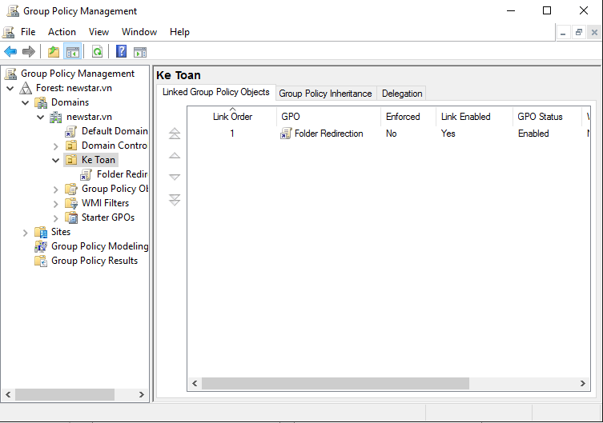

4. Nhấp chuột phải vào GPO **`Folder Redirection`** ➔ Chọn **Edit**.
5. Trong cửa sổ **Group Policy Management Editor**, điều hướng theo cây thư mục:
   - `User Configuration` ➔ `Policies` ➔ `Windows Settings` ➔ `Folder Redirection`.
6. Nhấp chuột phải vào thư mục con **`Documents`** ➔ Chọn **Properties**.

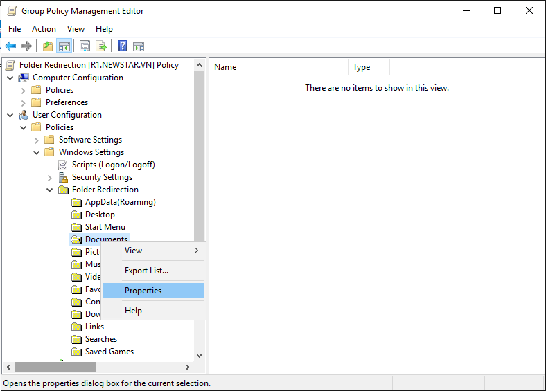

7. Trong tab **Target**:
   - Mục **Setting**: Chọn **`Basic - Redirect everyone's folder to the same location`**.
   - Mục **Target folder location**: Chọn **`Create a folder for each user under the root path`**.
   - Mục **Root Path**: Nhập đường dẫn chia sẻ mạng:
     ```text
     \\WIN-P6PG9M9AICK\Direction
     ```
     *(Phía dưới sẽ hiển thị đường dẫn xem trước: `\\WIN-P6PG9M9AICK\Direction\<Username>\Documents`).*

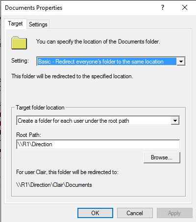

8. Bấm sang tab **Settings**:
   - Tích chọn: **Grant the user exclusive rights to Documents** (Đảm bảo tính riêng tư, chỉ chính chủ mới mở được tài liệu).
   - Tích chọn: **Move the contents of Documents to the new location** (Tự động di chuyển tài liệu cũ lên Server).
   - Tại mục **Policy Removal**: Chọn **Redirect the folder back to the local userprofile location when policy is removed**.
9. Bấm **Apply** ➔ Hộp thoại cảnh báo tương thích Windows XP/2000 xuất hiện ➔ Bấm **Yes** để tiếp tục ➔ Bấm **OK**.

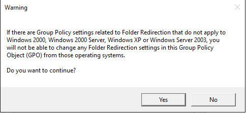

10. Cập nhật chính sách Group Policy:
    - Nhấn phím `Windows + R`, gõ lệnh `gpupdate /force` và nhấn `Enter`.

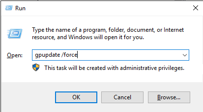

#### Bước 4.4: Kiểm tra kết quả chuyển hướng trên máy Client
1. Đăng nhập vào máy Client bằng tài khoản `newstar\u11` (mật khẩu: `123`).
2. Mở **Start Menu** (hoặc **Computer**), nhấp chuột phải vào thư mục **Documents** (My Documents) ➔ Chọn **Properties**:
   - Tại tab **General** hoặc **Location**: Bạn sẽ thấy mục **Location** đã chuyển thành đường dẫn mạng:
     **`\\WIN-P6PG9M9AICK\Direction\u11`** (hoặc `\\WIN-P6PG9M9AICK\Direction\u11\Documents`).

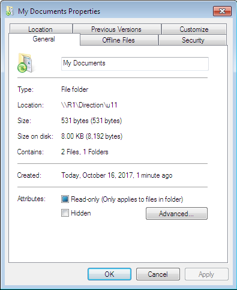

3. Quay lại máy chủ kiểm tra thư mục `C:\Direction`: Bạn sẽ thấy tự động xuất hiện thư mục con mang tên **`u11`**.

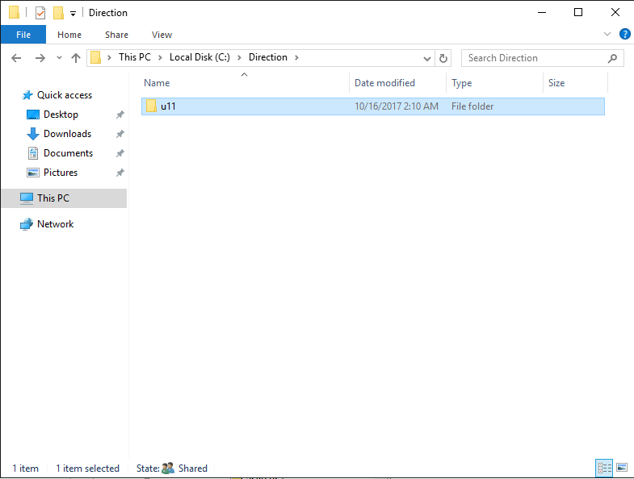

4. Trên máy Client, mở thư mục **Documents**, tạo một tệp tin văn bản mới đặt tên là **`U11 tao.txt`**.
   - Quan sát biểu tượng thư mục Documents có icon mũi tên xoay tròn màu xanh (Offline Files Sync).
   - Tệp tin được tự động lưu thẳng về máy chủ một cách mượt mà và an toàn!

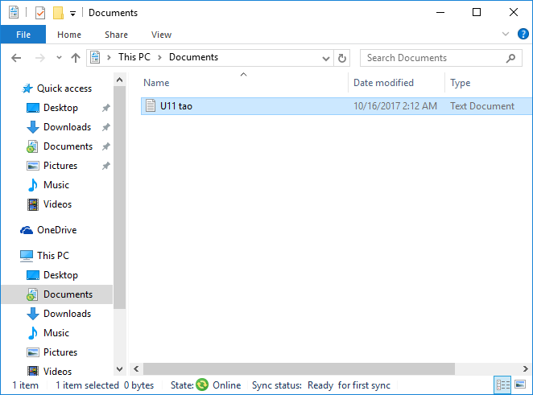

---

## ⚡ HƯỚNG DẪN CẤU HÌNH TỰ ĐỘNG BẰNG POWERSHELL

Toàn bộ các bước cấu hình phức tạp ở trên có thể được tự động hóa 100% bằng script PowerShell duy nhất:

### File kịch bản: `automate_lab7_profile.ps1`
- **Vị trí lưu trữ**: [automate_lab7_profile.ps1](file:///d:/folder/rac/iuh/m%C3%B4n/hk1-4/qu%E1%BA%A3n%20tr%E1%BB%8B%20v%C3%A0%20b%E1%BA%A3o%20tr%C3%AC%20h%E1%BB%87%20th%E1%BB%91ng/lab/lab7/automate_lab7_profile.ps1)
- **Cách thực thi trên Server**:
  ```powershell
  Set-ExecutionPolicy Unrestricted -Scope Process -Force
  .\automate_lab7_profile.ps1
  ```

---

## 🧪 SCRIPT KIỂM THỬ VÀ NGHIỆM THU LAB 7

Sau khi cấu hình xong, chạy script kiểm tra đánh giá chất lượng hệ thống:

### File kiểm tra: `verify_lab7.ps1`
- **Vị trí lưu trữ**: [verify_lab7.ps1](file:///d:/folder/rac/iuh/m%C3%B4n/hk1-4/qu%E1%BA%A3n%20tr%E1%BB%8B%20v%C3%A0%20b%E1%BA%A3o%20tr%C3%AC%20h%E1%BB%87%20th%E1%BB%91ng/lab/lab7/verify_lab7.ps1)
- **Cách thực thi**:
  ```powershell
  .\verify_lab7.ps1
  ```
- **10 tiêu chí nghiệm thu tự động**:
  1. Kiểm tra đủ 5 SMB Shares hoạt động: `home`, `Nhansu_Chung`, `Nhansu_rieng`, `Sep_Roaming`, `Direction`.
  2. Kiểm tra thuộc tính Home Folder (`Z:`) trên tài khoản người dùng.
  3. Kiểm tra các thư mục con tương ứng đã được khởi tạo trong `C:\home`.
  4. Kiểm tra cấu trúc OU `Nhansu`, OU `Ke Toan` và các tài khoản.
  5. Kiểm tra hạn ngạch lưu trữ FSRM Quota: `Nhansu_Chung` (1 GB) và `Nhansu_rieng` (500 MB).
  6. Kiểm tra GPO `Profile nhansu` đã liên kết vào OU `Nhansu`.
  7. Kiểm tra tệp kịch bản `profile.bat` trong SYSVOL chứa lệnh map ổ `M:` và `N:`.
  8. Kiểm tra thuộc tính ProfilePath Roaming Profile của tài khoản `sep`.
  9. Kiểm tra GPO `Folder Redirection` đã liên kết vào OU `Ke Toan`.
  10. Kiểm tra cấu hình chuyển hướng thư mục Documents trong GPO và Registry.

---

## ❓ CÂU HỎI ÔN TẬP VÀ XỬ LÝ SỰ CỐ (TROUBLESHOOTING)

### 1. Phân biệt sự khác nhau giữa Home Folder và Roaming Profile?
- **Home Folder**: Chỉ là một ổ đĩa mạng (ví dụ `Z:`) được ánh xạ về máy chủ để người dùng lưu trữ tài liệu thủ công. Môi trường desktop, icon, ứng dụng cài đặt vẫn nằm trên máy cục bộ.
- **Roaming Profile**: Đồng bộ toàn bộ môi trường người dùng (Desktop, cấu hình phần mềm trong AppData, thiết lập registry cá nhân...). Người dùng ngồi ở bất kỳ máy tính nào cũng có giao diện quen thuộc của mình.

### 2. Tại sao người dùng đăng nhập Client không thấy ổ đĩa mạng `M:` và `N:` xuất hiện?
- **Nguyên nhân 1**: Máy Client chưa cập nhật GPO mới. Hãy mở CMD trên Client và chạy lệnh `gpupdate /force`, sau đó Log off và Log in lại.
- **Nguyên nhân 2**: Ký tự ổ đĩa `M:` hoặc `N:` đã bị chiếm dụng bởi một ổ đĩa cứng hoặc USB trên máy Client. Hãy đổi sang ký tự khác trong file `profile.bat`.
- **Nguyên nhân 3**: Quyền truy cập chia sẻ SMB Share chưa cấp cho `Everyone` hoặc tài khoản nhân sự.

### 3. Tại sao thư mục Roaming Profile của Sếp có đuôi `.V2` hoặc `.V6`?
- Để ngăn ngừa xung đột định dạng cấu hình giữa các thế hệ hệ điều hành khác nhau, Microsoft quy định hậu tố phiên bản profile:
  - `.V2`: Windows 7, Windows Server 2008 R2
  - `.V3`: Windows 8, Windows Server 2012
  - `.V4`: Windows 8.1, Windows Server 2012 R2
  - `.V5`: Windows 10 (các bản đầu)
  - `.V6`: Windows 10 (bản 1607 trở lên), Windows 11, Windows Server 2016/2019/2022.

### 4. Người dùng báo lỗi "Access is denied" khi mở thư mục Documents chuyển hướng?
- Do tùy chọn **Grant the user exclusive rights to Documents** trong tab Settings của GPO được bật, Windows mặc định sẽ chỉ cấp quyền cho duy nhất tài khoản người dùng đó và gỡ quyền của Administrators. Để quản trị viên có thể truy cập hỗ trợ, cần cấu hình phân quyền Security trước khi chính sách được áp dụng lần đầu.

---

## ⚡ TỔNG HỢP NHANH: CẦN MỞ GÌ ĐƯA THẦY XEM ĐỂ XONG LAB 7 (CHỈ MẤT 1 PHÚT)

> Khi thầy gọi kiểm tra bài, bạn chỉ cần mở sẵn **đúng các cửa sổ sau** trên 2 máy để thầy nhìn vào là biết bài Lab đã hoàn thành 100%:

### 🖥️ 1. TRÊN MÁY SERVER (Mở sẵn 3 màn hình):
1. **Cửa sổ PowerShell**:
   - Chạy lệnh: `cd C:\LAB7; .\verify_lab7.ps1`
   - **Chỉ thầy xem**: Dòng chữ màu xanh lá **`10 / 10 TIEU CHI DAT (100%) - [PASS] CHUC MUNG!`** (Minh chứng cấu hình sạch sẽ, không lỗi).
2. **Cửa sổ File Server Resource Manager (`fsrm.msc`)**:
   - Mở mục **Quota Management** ➔ **Quotas**.
   - **Chỉ thầy xem**: 2 hạn ngạch đĩa:
     - `C:\Nhansu_Chung`: Limit **1.00 GB** (Hard Quota).
     - `C:\Nhansu_rieng`: Limit **500 MB** (Hard Quota).
3. **Cửa sổ File Explorer (`C:\`)**:
   - **Chỉ thầy xem**: Đủ 5 thư mục chia sẻ:
     - `C:\home` (bên trong có folder riêng của user: `hiepdh`, `u1`, `u2`).
     - `C:\Nhansu_Chung` và `C:\Nhansu_rieng`.
     - `C:\Sep_Roaming` (có folder `sep.V2`).
     - `C:\Direction` (có folder `u11\Documents`).

---

### 💻 2. TRÊN MÁY CLIENT 1 (Mở sẵn cửa sổ Computer):
1. **Đăng nhập bằng tài khoản `newstar\ns1` (mật khẩu: `123`)**:
   - Mở cửa sổ **Computer** (hoặc This PC).
   - **Chỉ thầy xem**: 2 ổ đĩa mạng tự động xuất hiện dưới mục *Network Location*:
     - **`Nhansu_Chung (\\WIN-P6PG9M9AICK) (M:)`** ➔ Dung lượng hiển thị đúng **1.00 GB**.
     - **`Nhansu_rieng (\\WIN-P6PG9M9AICK) (N:)`** ➔ Dung lượng hiển thị đúng **500 MB**.
2. *(Nếu thầy muốn kiểm tra thêm Home Folder hoặc Redirection)*:
   - **Home Folder**: Đăng nhập `hiepdh` ➔ Mở Computer thấy ổ **`Z:`** kết nối về `\\SERVER\home\hiepdh`.
   - **Folder Redirection**: Đăng nhập `u11` ➔ Chuột phải vào thư mục **Documents** ➔ Chọn **Properties** ➔ Chỉ thầy mục **Location** trỏ về mạng: `\\WIN-P6PG9M9AICK\Direction\u11`.

---

### 💻 3. TRÊN MÁY CLIENT 2 (Nếu thầy yêu cầu kiểm tra Roaming Profile Sếp):
- Đăng nhập tài khoản `newstar\sep` (mật khẩu: `123`).
- **Chỉ thầy xem**: Màn hình Desktop tự động đồng bộ nguyên vẹn các icon/tệp tin đã tạo từ Client 1.

---

## 🎓 HƯỚNG DẪN CHI TIẾT QUY TRÌNH DEMO & TEST CHO GIẢNG VIÊN

> **Mẹo đạt điểm tối đa (10/10)**: Giảng viên chấm thực hành thường chỉ có 2 - 3 phút cho mỗi sinh viên. Bạn cần chuẩn bị sẵn môi trường máy ảo, mở sẵn các cửa sổ minh chứng và thao tác theo kịch bản mạch lạc 5 bước dưới đây.

---

### 📋 1. CÔNG TÁC CHUẨN BỊ TRƯỚC KHI GỌI THẦY ĐẾN CHẤM
1. **Khởi động đủ các máy ảo**:
   - **Máy Server (DC)**: `192.168.1.154` (Đăng nhập quyền `Administrator`).
   - **Máy Client 1**: `192.168.11.2` (Bật sẵn ở màn hình đăng nhập hoặc đăng nhập `Administrator` / `hiepdh`).
   - **Máy Client 2**: `100.100.11.2` (Bật sẵn để demo Roaming Profile của Sếp).
2. **Mở sẵn các cửa sổ minh chứng trên máy Server**:
   - **Active Directory Users and Computers** (`dsa.msc`): Mở sẵn nhánh OU `Nhansu`, `Ke Toan` và `Users`.
   - **File Server Resource Manager** (`fsrm.msc`): Chọn sẵn mục **Quotas** hiển thị 2 hạn ngạch 1 GB và 500 MB.
   - **File Explorer**: Mở sẵn cửa sổ ổ `C:` hiển thị các thư mục: `home`, `Nhansu_Chung`, `Nhansu_rieng`, `Sep_Roaming`, `Direction`.
   - **PowerShell (Run as Administrator)**: Điều hướng sẵn vào `cd C:\LAB7`.

---

### 🎬 2. KỊCH BẢN DEMO 5 BƯỚC CHO GIẢNG VIÊN CHẤM ĐIỂM

```
┌─────────────────────────────────────────────────────────────────────────┐
│                    KỊCH BẢN DEMO BÁO CÁO GIẢNG VIÊN                     │
├─────────────────────────────────────────────────────────────────────────┤
│  Bước 1: Chạy Script nghiệm thu tự động verify_lab7.ps1 (10/10 PASS)    │
│    ⬇                                                                    │
│  Bước 2: Demo Home Folder (Ổ đĩa cá nhân Z: của hiepdh / u1 / u2)       │
│    ⬇                                                                    │
│  Bước 3: Demo Logon Script & FSRM Quota (Ổ M: 1GB và Ổ N: 500MB)        │
│    ⬇                                                                    │
│  Bước 4: Demo Roaming Profile Sếp (Đồng bộ Desktop từ Client 1 -> 2)   │
│    ⬇                                                                    │
│  Bước 5: Demo Folder Redirection (Chuyển hướng My Documents về Server) │
└─────────────────────────────────────────────────────────────────────────┘
```

#### 🔹 BƯỚC 1: BÁO CÁO NGHIỆM THU TỔNG QUAN BẰNG SCRIPT (30 GIÂY ĐẦU TIÊN)
- **Lời nói với thầy**:
  > *"Dạ thưa thầy, nhóm/em đã cấu hình hoàn chỉnh hệ thống quản trị Profile cho bài Lab 7. Em xin phép chạy script kiểm thử tự động `verify_lab7.ps1` để kiểm tra toàn bộ 10 tiêu chí theo đúng yêu cầu đề bài ạ."*
- **Thao tác**:
  Trên cửa sổ PowerShell máy Server, gõ lệnh:
  ```powershell
  .\verify_lab7.ps1
  ```
- **Minh chứng chỉ cho thầy xem**:
  Màn hình xuất hiện kết quả màu xanh lá rực rỡ:
  ```text
  ==========================================================================
     KET QUA DANH GIA NGHIEM THU LAB 7: 10 / 10 TIEU CHI DAT (100%)
  ==========================================================================
  [PASS] CHUC MUNG! HE THONG LAB 7 PROFILE DA DAT 100% TAT CA CAC TIEU CHI DE BAI!
  ```
  *(Thầy nhìn thấy 100% PASS là đã có ấn tượng rất tốt và nắm được toàn bộ các thành phần hệ thống đã hoạt động chuẩn xác).*

---

#### 🔹 BƯỚC 2: DEMO HOME FOLDER (Ổ ĐĨA MẠNG Z: CÁ NHÂN)
- **Lời nói với thầy**:
  > *"Sau đây em xin demo tính năng Home Folder. Mỗi nhân viên khi đăng nhập sẽ tự động có một ổ Z: riêng biệt lưu trữ về máy chủ ạ."*
- **Thao tác 1 (Trên Server)**:
  - Mở **ADUC** ➔ Chọn user `hiepdh` ➔ Chuột phải **Properties** ➔ Tab **Profile**:
    Chỉ cho thầy xem mục **Home folder**: `Connect Z: To \\WIN-P6PG9M9AICK\home\%username%`.
  - Mở `C:\home`: Chỉ cho thầy thấy thư mục `C:\home\hiepdh` đã được tự động khởi tạo.
- **Thao tác 2 (Trên Client 1)**:
  - Đăng nhập tài khoản `newstar\hiepdh` (mật khẩu: `123`).
  - Mở **Computer**: Chỉ thầy ổ đĩa mạng **`hiepdh (\\WIN-P6PG9M9AICK\home) (Z:)`**.
  - Mở ổ `Z:`, tạo một tệp tin `BaoCao_Hiep.txt` và gõ vài ký tự nội dung.
- **Thao tác 3 (Xác nhận trên Server)**:
  - Quay lại Server mở `C:\home\hiepdh`: File `BaoCao_Hiep.txt` đã xuất hiện ngay lập tức trên máy chủ!

---

#### 🔹 BƯỚC 3: DEMO FSRM QUOTA VÀ LOGON SCRIPT ÁNH XẠ Ổ ĐĨA (Ổ M: VÀ Ổ N:)
- **Lời nói với thầy**:
  > *"Tiếp theo là phần quản lý phòng Nhân sự: Em đã cấu hình GPO Logon Script tự động gắn 2 ổ đĩa M: (dùng chung) và N: (dùng riêng), kết hợp giới hạn dung lượng cứng FSRM Quota: chung 1 GB, riêng 500 MB ạ."*
- **Thao tác 1 (Trên Server)**:
  - Mở **File Server Resource Manager** ➔ Mục **Quotas**:
    Chỉ cho thầy thấy 2 dòng Quota:
    - `C:\Nhansu_Chung`: Limit `1.00 GB`, Hard Quota.
    - `C:\Nhansu_rieng`: Limit `500 MB`, Hard Quota.
  - Mở GPO `Profile nhansu`: Chỉ cho thầy xem file `profile.bat` chứa lệnh:
    ```cmd
    net use m: \\WIN-P6PG9M9AICK\Nhansu_Chung
    net use n: \\WIN-P6PG9M9AICK\Nhansu_rieng
    ```
- **Thao tác 2 (Trên Client 1)**:
  - Đăng xuất `hiepdh`, đăng nhập tài khoản nhân sự: `newstar\ns1` (mật khẩu: `123`).
  - Mở **Computer**: Chỉ cho thầy thấy 2 ổ đĩa mạng vừa được tự động gắn vào:
    - **`Nhansu_Chung (\\WIN-P6PG9M9AICK) (M:)`**: Thanh dung lượng hiển thị tối đa `1.00 GB`.
    - **`Nhansu_rieng (\\WIN-P6PG9M9AICK) (N:)`**: Thanh dung lượng hiển thị tối đa `500 MB`.
- **Thao tác ghi điểm (Nếu thầy yêu cầu thử Quota)**:
  - Thử sao chép một file dung lượng lớn hơn 500 MB vào ổ `N:`.
  - Windows lập tức bật thông báo chặn: *"There is not enough space on Nhansu_rieng"*. Giải thích: *"Đây là cơ chế Hard Quota ngăn chặn tuyệt đối người dùng lưu trữ vượt mức cho phép ạ."*

---

#### 🔹 BƯỚC 4: DEMO ROAMING PROFILE CHO LÃNH ĐẠO (SẾP)
- **Lời nói với thầy**:
  > *"Em xin demo phần Roaming Profile cho tài khoản Sếp: Dữ liệu môi trường làm việc của sếp sẽ di chuyển theo sếp sang bất kỳ máy tính nào ạ."*
- **Thao tác 1 (Trên Client 1)**:
  - Đăng xuất `ns1`, đăng nhập tài khoản: `newstar\sep` (mật khẩu: `123`).
  - Trên màn hình Desktop, tạo một tệp tin văn bản tên là **`KeHoachKinhDoanh_Sep.txt`** (hoặc tạo một thư mục riêng của sếp).
  - Bấm **Start** ➔ **Log off** (Đăng xuất khỏi Client 1).
- **Thao tác 2 (Trên Server)**:
  - Mở thư mục `C:\Sep_Roaming`:
  - Chỉ cho thầy thấy thư mục **`sep.V2`** đã được tự động sinh ra và máy chủ đã lưu toàn bộ Desktop của sếp vào đây.
- **Thao tác 3 (Trên Client 2)**:
  - Sang máy **Client 2**, đăng nhập tài khoản `newstar\sep` (mật khẩu: `123`).
  - Ngay khi màn hình Desktop hiện lên: Tệp tin **`KeHoachKinhDoanh_Sep.txt`** lập tức hiển thị nguyên vẹn trên màn hình Client 2!
  - Kết luận với thầy: *"Toàn bộ cấu hình và dữ liệu làm việc của sếp đã đồng bộ chuyển vùng thành công giữa các máy trạm ạ."*

---

#### 🔹 BƯỚC 5: DEMO FOLDER REDIRECTION (CHUYỂN HƯỚNG MY DOCUMENTS)
- **Lời nói với thầy**:
  > *"Cuối cùng là Folder Redirection: Thay vì lưu thư mục Documents trên ổ cứng cục bộ máy trạm, chính sách GPO đã chuyển hướng dữ liệu về lưu trữ tập trung trên Server ạ."*
- **Thao tác 1 (Trên Client)**:
  - Đăng nhập tài khoản phòng Kế toán: `newstar\u11` (mật khẩu: `123`).
  - Mở Start Menu ➔ Nhấp chuột phải vào thư mục **Documents** (My Documents) ➔ Chọn **Properties**:
    - Chỉ cho thầy xem mục **Location**: Đường dẫn hiển thị là:
      **`\\WIN-P6PG9M9AICK\Direction\u11`** (hoặc `\\WIN-P6PG9M9AICK\Direction\u11\Documents`).
  - Mở thư mục **Documents**, tạo một tệp tin mới đặt tên là: **`U11 tao.txt`**.
- **Thao tác 2 (Kiểm tra trên Server)**:
  - Quay lại máy chủ, mở đường dẫn: `C:\Direction\u11\Documents`.
  - Chỉ cho thầy thấy tệp tin **`U11 tao.txt`** đã nằm sẵn trên máy chủ!
  - Giải thích với thầy: *"Người dùng chỉ cần thao tác lưu file vào Documents như bình thường, nhưng toàn bộ dữ liệu đã được bảo vệ và lưu trữ tập trung trên máy chủ ạ."*

---

### 💡 3. BẢNG "BÍ KÍP" TRẢ LỜI CÂU HỎI PHẢN BIỆN CỦA GIẢNG VIÊN

| STT | Câu hỏi thường gặp của Thầy/Cô | Câu trả lời chuẩn xác & ghi điểm |
| :---: | :--- | :--- |
| **1** | **Home Folder khác gì so với Roaming Profile? Khi nào dùng loại nào?** | - **Home Folder**: Chỉ là một ổ đĩa mạng ánh xạ (như ổ `Z:`) để user tự lưu tài liệu. Môi trường desktop, icon máy trạm vẫn là cục bộ. Phù hợp cho đa số nhân viên văn phòng cố định.<br>- **Roaming Profile**: Đồng bộ toàn bộ môi trường làm việc (Desktop, AppData, Registry cá nhân...). Đi đến đâu môi trường theo đến đó. Phù hợp cho lãnh đạo, chuyên viên di chuyển nhiều máy. |
| **2** | **Tại sao thư mục Roaming Profile của Sếp lại có đuôi `.V2` chứ không phải là `sep` trần?** | - Hậu tố `.V2` là cơ chế phân biệt phiên bản Profile của Microsoft (Version 2 áp dụng cho Windows 7 và Windows Server 2008 R2).<br>- Nếu sếp đăng nhập từ Windows 10/11, hệ thống sẽ sinh ra thư mục `sep.V6`. Việc tách đuôi phiên bản giúp tránh xung đột cấu hình registry giữa các hệ điều hành khác nhau khi người dùng dùng nhiều loại máy. |
| **3** | **Phân biệt Hard Quota và Soft Quota trong FSRM?** | - **Hard Quota**: Chặn tuyệt đối khi dung lượng chạm ngưỡng. Người dùng không thể ghi thêm bất kỳ byte nào vào thư mục nữa.<br>- **Soft Quota**: Không chặn người dùng ghi tiếp dữ liệu, mà chỉ gửi cảnh báo (gửi Email cho Admin, ghi sự kiện Event Log) để theo dõi và nhắc nhở nhân viên dọn dẹp dung lượng. |
| **4** | **Folder Redirection có ưu điểm gì vượt trội so với Roaming Profile truyền thống?** | - Roaming Profile phải tải toàn bộ dữ liệu khi Logon và đẩy ngược toàn bộ khi Logoff, nếu profile nặng (vài chục GB) sẽ làm máy đăng nhập/đăng xuất cực kỳ chậm (treo máy).<br>- Folder Redirection chỉ chuyển hướng con trỏ đường dẫn về mạng, file mở đến đâu nạp đến đó, kết hợp tính năng Offline Files nên tốc độ đăng nhập/đăng xuất vẫn diễn ra gần như tức thì. |
| **5** | **Tại sao khi cấu hình đường dẫn mạng lại dùng biến `%username%` thay vì gõ tên cứng?** | - Biến `%username%` là biến môi trường đại diện cho tên tài khoản. Khi cấu hình cho hàng loạt người dùng (hoặc tạo User Template), hệ thống sẽ tự động thay thế bằng tên của từng user tương ứng, giúp người quản trị chỉ cần thao tác 1 lần duy nhất cho toàn bộ hàng nghìn nhân viên. |
| **6** | **Nếu người dùng báo lỗi "Access is denied" khi mở thư mục Documents chuyển hướng, lý do là gì?** | - Do trong tab Settings của GPO Folder Redirection có bật tùy chọn *"Grant the user exclusive rights to Documents"*. Windows sẽ phân quyền chỉ duy nhất user đó sở hữu thư mục và loại bỏ quyền của cả nhóm Administrators. Nếu muốn Admin can thiệp được thì cần bỏ tích chọn này trước khi triển khai chính sách. |

---

### 📋 4. BẢNG CHECKLIST TỔNG HỢP THÔNG SỐ TEST NHANH

| STT | Nội dung Demo | Tài khoản đăng nhập | Mật khẩu | Máy thực hiện | Mục tiêu kiểm tra cần chỉ thầy xem |
| :---: | :--- | :--- | :---: | :---: | :--- |
| **1** | **Chạy Test tự động** | `Administrator` | `123` | **Server** | Chạy `.\verify_lab7.ps1` đạt **10/10 PASS (100%)** |
| **2** | **Home Folder** | `newstar\hiepdh` | `123` | **Client 1** | Ổ **`Z:`** xuất hiện, tạo file lưu về `C:\home\hiepdh` |
| **3** | **Logon Script & Quota** | `newstar\ns1` | `123` | **Client 1** | Ổ **`M:` (1 GB)** và **`N:` (500 MB)** tự động gắn vào Computer |
| **4** | **Roaming Profile** | `newstar\sep` | `123` | **Client 1 & 2** | Tạo file ở Client 1, Log off, sang Client 2 file tự hiển thị |
| **5** | **Folder Redirection** | `newstar\u11` | `123` | **Client 1** | Properties của Documents có Location là `\\SERVER\Direction\u11` |

