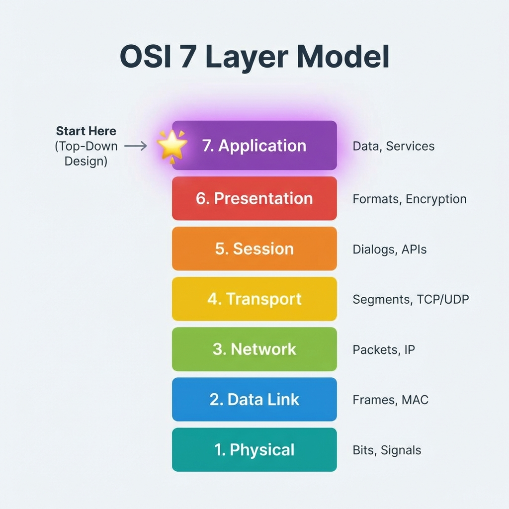
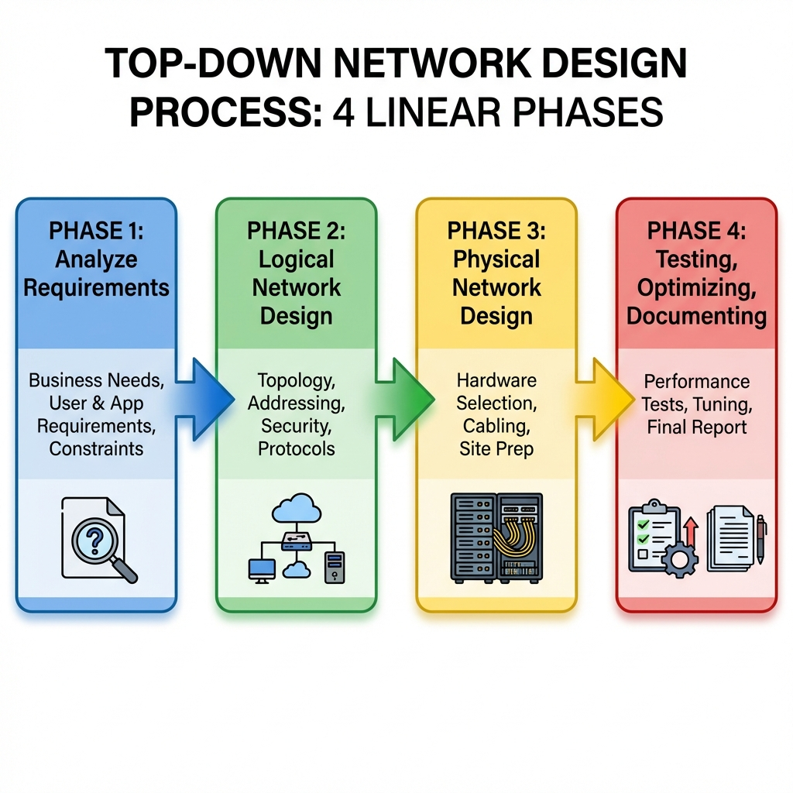
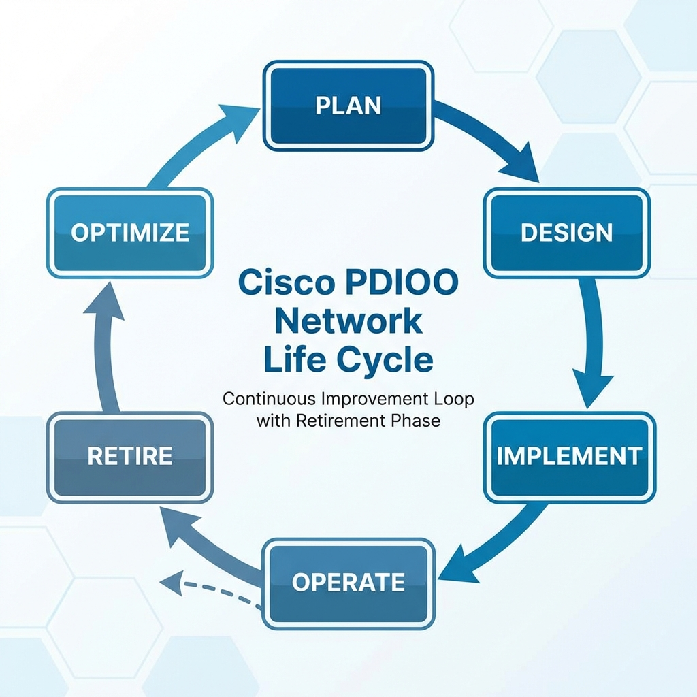
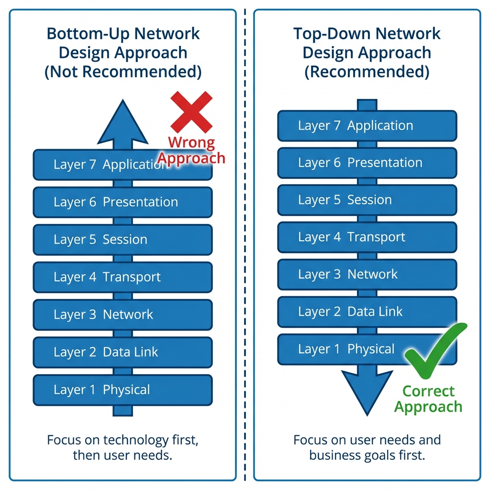

# Chương 1: Phân Tích Mục Tiêu Kinh Doanh (Analyzing Business Goals and Constraints)

> **Sách tham khảo:** Top-Down Network Design, 3rd Edition - Priscilla Oppenheimer (Cisco Press)

---

## 🎯 Mục tiêu chương học
Sau khi học xong chương này, bạn sẽ hiểu:
- Tại sao thiết kế mạng phải bắt đầu từ nhu cầu kinh doanh.
- Các bước trong quy trình thiết kế Top-Down.
- Vòng đời mạng PDIOO của Cisco.
- Cách thu thập yêu cầu từ khách hàng.

---

## 1. Thiết Kế Mạng Top-Down (Top-Down Network Design)

### 📖 Nội dung Slide
> *"Network design should be a complete process that matches business needs to available technology to deliver a system that will maximize an organization's success."*

**Ý chính:**
- Trong LAN: Không chỉ là mua vài cái Switch rồi cắm vào.
- Trong WAN: Không chỉ là gọi điện cho nhà mạng đặt đường truyền.
- Thiết kế mạng là một **quy trình hoàn chỉnh** để kết nối công nghệ với mục tiêu kinh doanh.

### 🌍 Liên hệ thực tế doanh nghiệp
- **Sai lầm phổ biến của doanh nghiệp nhỏ:** Mua Switch 48 cổng "cho chắc", nhưng công ty chỉ có 10 nhân viên → **Lãng phí tiền**.
- **Sai lầm của doanh nghiệp lớn:** Mua thiết bị siêu xịn (Cisco Nexus) nhưng IT không biết cấu hình → **Thiết bị đắt tiền nằm im**.
- **Giải pháp:** Luôn hỏi "Công ty cần gì?" trước khi hỏi "Mua gì?".

---

## 2. Bắt đầu từ đâu? (Start at the Top)

### 📖 Nội dung Slide
> *"Don't just start connecting the dots."* (Đừng chỉ nối dây lại với nhau)

Phải làm theo thứ tự:
1. Analyze business and technical goals first (Phân tích mục tiêu kinh doanh trước).
2. Explore divisional and group structures (Khảo sát cơ cấu tổ chức, phòng ban).
3. Determine what applications will run on the network (Xác định ứng dụng sẽ chạy).
4. **Focus on Layer 7 and above first.** (Tập trung Lớp 7 trước - Lớp Ứng dụng).

### 🖼️ Mô hình OSI - Bắt đầu từ Layer 7

| Layer | Tên | Ý nghĩa trong thiết kế |
|:---:|:---|:---|
| 7 | Application | **BẮT ĐẦU TỪ ĐÂY:** Doanh nghiệp cần chạy ứng dụng gì? (ERP, VoIP, Video?) |
| 6 | Presentation | Dữ liệu cần mã hóa không? (SSL/TLS) |
| 5 | Session | Các phiên làm việc như thế nào? |
| 4 | Transport | TCP hay UDP? Cần đảm bảo gói tin không mất? |
| 3 | Network | IP Subnet, Routing Protocol (OSPF, EIGRP?) |
| 2 | Data Link | VLAN, STP, MAC Address |
| 1 | Physical | Cáp Cat6? Cáp quang? Wireless? |

### 🌍 Liên hệ thực tế
- **VoIP (Voice over IP):** Yêu cầu từ Layer 7 là "Gọi điện nội bộ miễn phí". Từ đó suy ra Layer 4 cần UDP (gói tin nhỏ, nhanh), Layer 3 cần QoS ưu tiên voice.
- Nếu làm ngược lại (mua Switch trước, setup VoIP sau), bạn có thể mua Switch không hỗ trợ QoS → **VoIP giật lag**.

---

## 3. Thiết Kế Có Cấu Trúc (Structured Design)

### 📖 Nội dung Slide
- **Focus on data flow:** Dữ liệu chạy từ đâu đến đâu?
- **Focus on user communities:** Ai sử dụng mạng? Họ ở đâu?
- **Logical model before physical model:**
  - **Logical Model:** Sơ đồ logic (VLAN, IP, Routing) - "Kiến trúc".
  - **Physical Model:** Thiết bị cụ thể (Switch model nào, đi dây thế nào) - "Xây dựng".

### 🌍 Liên hệ thực tế
- **Ví dụ:** Thiết kế mạng cho bệnh viện.
  - *Logical:* Phòng khám (VLAN 10), Phòng mổ (VLAN 20), Hành chính (VLAN 30). VLAN 20 cần bandwidth cao nhất (máy chụp CT, MRI).
  - *Physical:* Phòng server ở tầng hầm, đi dây quang lên các tầng.
- Nếu bạn vẽ Physical trước (đi dây bừa), sau này muốn thêm VLAN sẽ rất khó sửa.

---

## 4. Vòng Đời Phát Triển Hệ Thống (SDLC - Systems Development Life Cycle)

### 📖 Nội dung Slide
- SDLC không phải là "Synchronous Data Link Control" (giao thức cũ).
- SDLC = **Systems Development Life Cycle** (Vòng đời phát triển hệ thống).
- Mọi hệ thống (bao gồm mạng) đều tồn tại qua một vòng đời: Từ lúc sinh ra → Phát triển → Lỗi thời → Thay thế.

---

## 5. Các Bước Thiết Kế Mạng Top-Down (4 Phases)

### 🖼️ Sơ đồ 4 Giai Đoạn

### 📖 Chi tiết từng Phase

#### **Phase 1: Analyze Requirements (Phân tích yêu cầu)**
- Analyze business goals and constraints (Mục tiêu kinh doanh).
- Analyze technical goals and tradeoffs (Mục tiêu kỹ thuật).
- Characterize the existing network (Khảo sát mạng hiện tại).
- Characterize network traffic (Phân tích lưu lượng).

#### **Phase 2: Logical Network Design (Thiết kế Logic)**
- Design a network topology (Topology: Star, Mesh, Hierarchical?).
- Design models for addressing and naming (Đặt IP, đặt tên thiết bị).
- Select switching and routing protocols (Chọn STP, OSPF, EIGRP...).
- Develop network security strategies (Chiến lược bảo mật).
- Develop network management strategies (Chiến lược quản lý).

#### **Phase 3: Physical Network Design (Thiết kế Vật lý)**
- Select technologies and devices for campus networks (Switch, Router nào?).
- Select technologies and devices for enterprise networks (WAN, VPN?).

#### **Phase 4: Testing, Optimizing, and Documenting**
- Test the network design (Kiểm thử).
- Optimize the network design (Tối ưu).
- Document the network design (Viết tài liệu).

### 🌍 Liên hệ thực tế
- **Sai lầm:** Doanh nghiệp thường BỎ QUA Phase 4 (Documenting). 5 năm sau, IT nghỉ việc, không ai biết mạng đấu nối thế nào → **Hỗn loạn**.
- **Kinh nghiệm:** Luôn vẽ sơ đồ mạng và cập nhật mỗi khi thay đổi. Dùng công cụ như Visio, Draw.io, hoặc NetBox.

---

## 6. Vòng Đời Mạng PDIOO (Cisco)

### 🖼️ Sơ đồ PDIOO

### 📖 Giải thích từng giai đoạn

| Giai đoạn | Tiếng Anh | Mô tả | Thực tế |
|:---:|:---|:---|:---|
| **P** | Plan | Lập kế hoạch: Xác định nhu cầu, ngân sách. | Họp với Sếp, hỏi "Năm nay công ty cần gì?" |
| **D** | Design | Thiết kế: Vẽ sơ đồ Logical → Physical. | Vẽ Visio, tính subnet, chọn thiết bị. |
| **I** | Implement | Triển khai: Cấu hình, lắp đặt, kiểm thử. | Cài đặt Switch, cấu hình VLAN, routing. |
| **O** | Operate | Vận hành: Giám sát hằng ngày. | Monitor bằng PRTG, Zabbix, xử lý ticket sự cố. |
| **O** | Optimize | Tối ưu: Chỉnh sửa, nâng cấp. | Thấy nghẽn mạng → Nâng cấp link, tối ưu QoS. |
| *(R)* | Retire | Loại bỏ: Thay thế thiết bị cũ. | Switch cũ 10 năm → Mua mới, bỏ cũ. |

### 🌍 Liên hệ thực tế
- **Vòng lặp Optimize → Plan:** Sau khi tối ưu, nếu phát hiện mạng cần nâng cấp lớn → Quay lại Plan để lập dự án mới.
- **Retire thường bị quên:** Nhiều công ty vẫn chạy Switch 10 năm tuổi, dễ hỏng, không còn hỗ trợ bảo mật.

---

## 7. Mục Tiêu Kinh Doanh (Business Goals)

### 📖 Danh sách từ Slide
1. **Increase revenue** (Tăng doanh thu)
2. **Reduce operating costs** (Giảm chi phí vận hành)
3. **Improve communications** (Cải thiện truyền thông)
4. **Shorten product development cycle** (Rút ngắn chu kỳ phát triển sản phẩm)
5. **Expand into worldwide markets** (Mở rộng thị trường toàn cầu)
6. **Build partnerships with other companies** (Xây dựng đối tác)
7. **Offer better customer support or new customer services** (Hỗ trợ khách hàng tốt hơn)

### 🌍 Liên hệ thực tế
| Mục tiêu | Vai trò của mạng |
|:---|:---|
| Tăng doanh thu | Website nhanh hơn → Khách mua hàng dễ hơn. |
| Giảm chi phí | Dùng VoIP thay điện thoại cố định → Tiết kiệm cước. |
| Cải thiện truyền thông | Video conference Zoom/Teams chất lượng cao → Họp từ xa hiệu quả. |
| Rút ngắn phát triển SP | Mạng nội bộ nhanh → Dev push code, test nhanh hơn. |
| Mở rộng thị trường | VPN kết nối các chi nhánh quốc tế. |

---

## 8. Ưu Tiên Kinh Doanh Gần Đây (Recent Business Priorities)

### 📖 Nội dung Slide
- **Mobility:** Nhân viên làm việc từ xa, BYOD (Bring Your Own Device).
- **Security:** An ninh mạng ngày càng quan trọng.
- **Resiliency (Fault Tolerance):** Khả năng chịu lỗi, dự phòng.
- **Business Continuity After Disaster:** Khôi phục sau thảm họa (Disaster Recovery).
- **Fiscal Goals:** Dự án mạng phải phù hợp ngân sách tài chính.
- **Low Delay for VoIP:** Mạng phải đủ nhanh cho gọi điện thời gian thực.

### 🌍 Liên hệ thực tế (Sau COVID-19)
- **Mobility:** 90% nhân viên làm việc ở nhà → VPN, Zero Trust Network Access (ZTNA) trở nên quan trọng.
- **Security:** Ransomware tấn công tăng 300% → Firewall, EDR, SIEM là bắt buộc.
- **Disaster Recovery:** Đặt backup ở Cloud (AWS, Azure) để khôi phục nhanh.

---

## 9. Ràng Buộc Kinh Doanh (Business Constraints)

### 📖 Nội dung Slide
1. **Budget (Ngân sách):** Quan trọng nhất. Không có tiền thì không làm gì được.
2. **Staffing (Nhân sự):** IT có đủ người và đủ trình độ không?
3. **Schedule (Tiến độ):** Phải hoàn thành trước deadline nào?
4. **Politics and Policies (Chính trị nội bộ):** Các phòng ban có "ghét nhau" không?

### 🌍 Liên hệ thực tế

| Ràng buộc | Ví dụ thực tế |
|:---|:---|
| **Budget** | Sếp: "Chỉ có 100 triệu thôi." → Bạn phải chọn Switch tầm trung, không mua được Cisco flagship. |
| **Staffing** | IT chỉ biết Windows, không biết Linux → Đừng thiết kế hệ thống chạy toàn Open Source. |
| **Schedule** | "Mùa Black Friday phải chạy!" → Không có thời gian test lâu, rủi ro cao. |
| **Politics** | Phòng Sales không muốn chia băng thông với Kế toán → Phải làm QoS riêng cho từng VLAN. |

> **Ghi nhớ:** "Politics" hay còn gọi là **"Layer 8"** (Lớp 8 - Con người) - Yếu tố khó xử lý nhất trong mọi dự án IT.

---

## 10. Thu Thập Thông Tin Trước Khi Gặp Khách Hàng

### 📖 Nội dung Slide
Trước khi meeting, hãy tự nghiên cứu:
- **Products produced / Services supplied:** Công ty làm gì?
- **Financial viability:** Tình hình tài chính thế nào?
- **Customers, suppliers, competitors:** Khách hàng, nhà cung cấp, đối thủ là ai?
- **Competitive advantage:** Lợi thế cạnh tranh của họ?

### 🌍 Liên hệ thực tế
- **Ví dụ:** Bạn sắp thiết kế mạng cho ngân hàng.
  - Trước khi gặp, Google tìm hiểu: "Ngân hàng A dùng core banking gì?", "Có bao nhiêu chi nhánh?".
  - Điều này giúp bạn hỏi đúng câu hỏi và thể hiện sự chuyên nghiệp.

---

## 11. Gặp Gỡ Khách Hàng (Meet With the Customer)

### 📖 Nội dung Slide - Những điều cần hỏi:

**Mục tiêu dự án:**
- Họ đang cố giải quyết vấn đề gì? (What problem are they trying to solve?)
- Công nghệ mới sẽ giúp họ thành công như thế nào?
- Điều gì phải xảy ra để dự án thành công?
- Điều gì xảy ra nếu dự án thất bại? (Nghiêm trọng thế nào?)

**Định kiến (Biases):**
- Họ có chỉ dùng sản phẩm của hãng nào đó không? (Chỉ mua Cisco? Ghét Huawei?)
- Họ có ghét công nghệ nào không? (Không muốn dùng Cloud?)
- Đội Data và đội Voice có "kèn cựa" nhau không?

**Tài liệu cần lấy:**
- **Organization Chart:** Sơ đồ tổ chức → Hiểu ai quan trọng, ai ở đâu.
- **Security Policy:** Chính sách bảo mật → Biết giới hạn thiết kế.

### 🖼️ Sơ đồ Top-Down vs Bottom-Up

---

## 12. Phạm Vi Dự Án (Scope of the Design Project)

### 📖 Nội dung Slide
- **Small scope:** Cho nhân viên Sales truy cập mạng qua VPN.
- **Large scope:** Thiết kế lại toàn bộ mạng doanh nghiệp (Enterprise redesign).

**Làm rõ scope bằng OSI Model:**
- Chỉ thêm ứng dụng mới (Layer 7)?
- Hay thay đổi routing protocol (Layer 3)?
- Hay lắp thêm Wifi (Layer 1-2)?

**Kiểm tra tính khả thi:**
- Scope có phù hợp với Budget?
- Staff có đủ năng lực?
- Schedule có đủ thời gian?

### 🌍 Liên hệ thực tế
- **Sai lầm:** Sếp nói "Làm cho mạng nhanh hơn" → Scope không rõ ràng → Bạn làm xong vẫn bị chê.
- **Giải pháp:** Viết rõ "Mục tiêu: Tăng throughput từ 100Mbps lên 1Gbps trong 3 tháng, ngân sách 200 triệu."

---

## 13. Thu Thập Thông Tin Chi Tiết (Gather More Detailed Information)

### 📖 Nội dung Slide - Cần thu thập:
| Thông tin | Mô tả |
|:---|:---|
| **Applications** | Ứng dụng hiện tại và tương lai (ERP, CRM, Email, VoIP...) |
| **User Communities** | Nhóm người dùng (Sales, Kỹ thuật, Quản lý...) |
| **Data Stores** | Dữ liệu nằm ở đâu? (Server nội bộ, Cloud?) |
| **Protocols** | Giao thức đang dùng (TCP/IP, legacy SNA?) |
| **Current Logical/Physical Architecture** | Sơ đồ mạng hiện tại |
| **Current Performance** | Hiệu suất hiện tại (Bandwidth, Latency, Downtime?) |

### Bảng mẫu: Network Applications

| Tên ứng dụng | Loại | Mới không? | Mức độ quan trọng | Ghi chú |
|:---|:---|:---:|:---|:---|
| SAP ERP | Client/Server | Không | Critical | Chạy 24/7 |
| Microsoft Teams | Cloud SaaS | Có | High | Cần VoIP quality |
| Camera IP | Streaming | Có | Medium | 50 camera, motion detect |

---

## 14. Tóm Tắt Chương (Summary)

### 📖 Nội dung Slide
- **Systematic approach:** Làm theo quy trình, đừng làm bừa.
- **Focus first on business requirements:** Kinh doanh trước, công nghệ sau.
- **Understand corporate structure:** Hiểu tổ chức, ai là ai.
- **Understand business style:** Hiểu phong cách làm việc của họ.

---

## 15. Câu Hỏi Ôn Tập (Review Questions)

### ❓ Câu hỏi trong Slide
1. What are the main phases of network design per the **top-down** network design approach?
2. What are the main phases of network design per the **PDIOO** approach?
3. Why is it important to understand your customer's **business style**?
4. What are some typical **business goals** for organizations today?

### ✅ Gợi ý trả lời

**Câu 1:** 4 Phases: Analyze Requirements → Logical Design → Physical Design → Test/Optimize/Document.

**Câu 2:** PDIOO = Plan → Design → Implement → Operate → Optimize (+ Retire).

**Câu 3:** Vì business style ảnh hưởng đến cách họ sử dụng mạng. Ví dụ:
- Công ty truyền thống: Họp trực tiếp, ít dùng Video call.
- Công ty công nghệ: 100% remote, cần VPN mạnh, Cloud-first.

**Câu 4:** Increase revenue, reduce costs, improve communications, expand markets, better customer support, etc.

---

## 📝 Bảng Tổng Hợp Từ Khóa Quan Trọng

| Từ khóa | Ý nghĩa |
|:---|:---|
| **Top-Down** | Thiết kế từ nhu cầu kinh doanh (Layer 7) xuống hạ tầng (Layer 1). |
| **Bottom-Up** | (SAI) Thiết kế từ thiết bị lên ứng dụng. |
| **PDIOO** | Plan → Design → Implement → Operate → Optimize. |
| **SDLC** | Vòng đời phát triển hệ thống (Systems Development Life Cycle). |
| **Business Constraints** | Budget, Staffing, Schedule, Politics. |
| **Layer 8** | Yếu tố con người (Politics, Culture) - khó xử lý nhất. |
| **Scope** | Phạm vi dự án - phải làm rõ trước khi bắt đầu. |

---

> **Mẹo thi:** Nếu đề hỏi "Bắt đầu thiết kế mạng từ đâu?", trả lời: **"Từ nhu cầu kinh doanh và ứng dụng (Layer 7+), không phải từ thiết bị."**