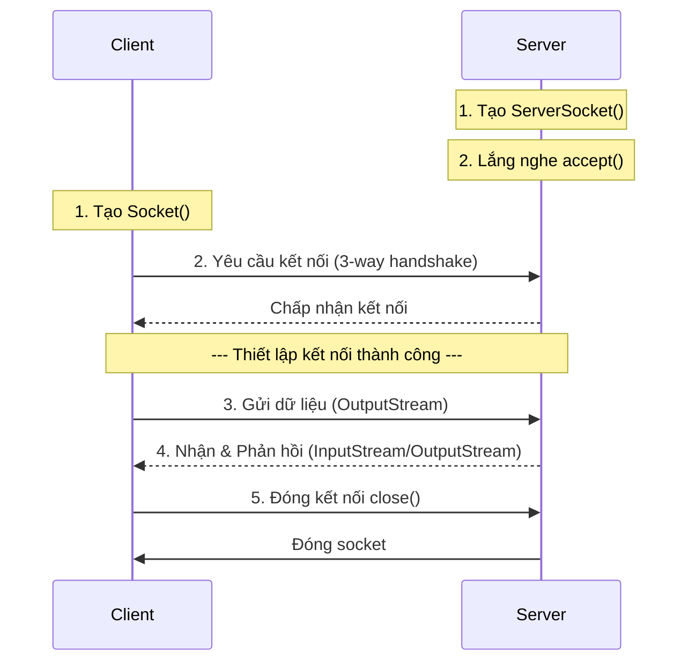
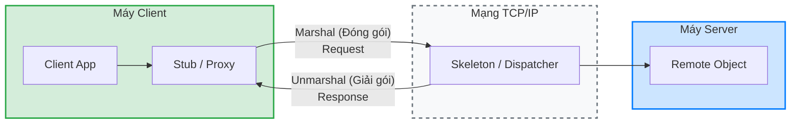
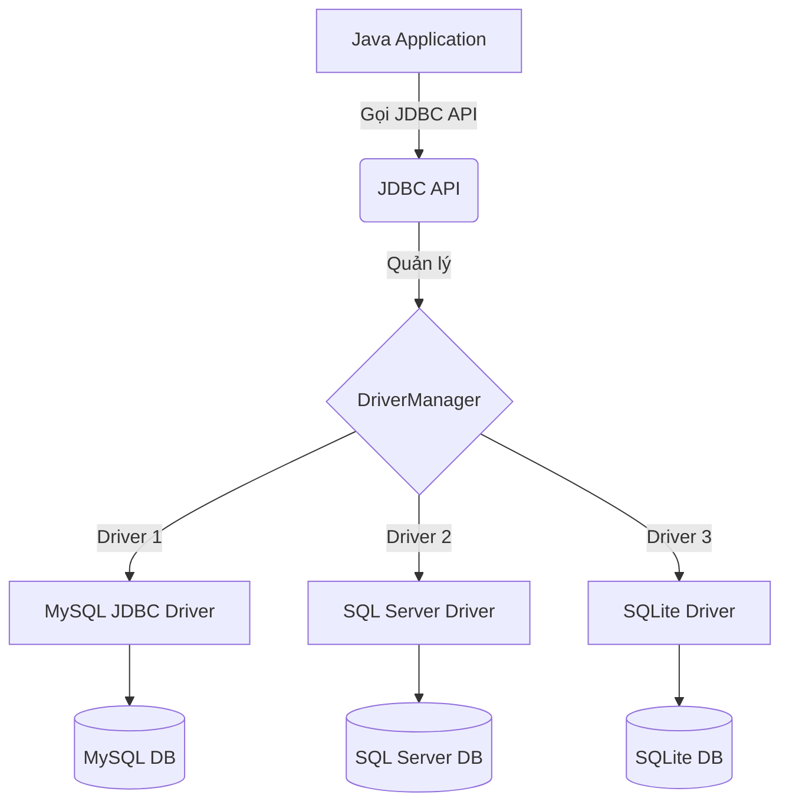

# ĐỀ CƯƠNG ÔN THI: PHÁT TRIỂN HỆ THỐNG TÍCH HỢP

**Nội dung thi:** Socket, RMI, Thread, DBMS (JDBC)
**Dạng đề:** Điền vào chỗ trống · Viết chương trình · Phân tích
**Được sử dụng:** Tài liệu giấy

## MỤC LỤC CHI TIẾT

- [MỤC LỤC](#mục-lục)
- **[PHẦN 1: SOCKET (TCP/UDP)](#phần-1-socket-tcpudp)**
  - [CÂU 2: SO SÁNH TCP VÀ UDP](#câu-2-so-sánh-tcp-và-udp)
  - [CÂU 4: TRUYỀN THÔNG TCP SOCKET VÀ ĐA LUỒNG](#câu-4-truyền-thông-tcp-socket-và-đa-luồng)
    - [b. Code mẫu TCP cơ bản: Server trả về độ dài tin nhắn](#b.-code-mẫu-tcp-cơ-bản-server-trả-về-độ-dài-tin-nhắn)
  - [BÀI TẬP SOCKET CÁC DẠNG](#bài-tập-socket-các-dạng)
    - [Dạng 1: Máy Tính Bằng TCP Socket (Bài 8)](#dạng-1-máy-tính-bằng-tcp-socket-bài-8)
    - [Dạng 2: Menu Dịch Vụ Đếm Từ (UDP)](#dạng-2-menu-dịch-vụ-đếm-từ-udp)
    - [Dạng 3: TCP Tính Tổng Từng Dòng](#dạng-3-tcp-tính-tổng-từng-dòng)
    - [Dạng 4: Date/Time TCP](#dạng-4-datetime-tcp)
  - [OOP KẾT HỢP SOCKET (Dạng kế thừa + truyền qua mạng)](#oop-kết-hợp-socket-dạng-kế-thừa-+-truyền-qua-mạng)
  - [MẪU ĐI THI: SERVER TCP ĐA LUỒNG (Template 3 file)](#mẫu-đi-thi-server-tcp-đa-luồng-template-3-file)
  - [BÀI TẬP ÔN TẬP SOCKET (Từ LAB 06)](#bài-tập-ôn-tập-socket-từ-lab-06)
    - [Dạng 5: TCP Tính Giai Thừa](#dạng-5-tcp-tính-giai-thừa)
    - [Dạng 6: TCP Chuyển Hoa + Đếm Ký Tự (trả 2 kết quả)](#dạng-6-tcp-chuyển-hoa-+-đếm-ký-tự-trả-2-kết-quả)
    - [Dạng 8: TCP Dịch Số Thành Chữ (Từ LAB 04)](#dạng-8-tcp-dịch-số-thành-chữ-từ-lab-04)
    - [Dạng 9: TCP Tính Tổng Chuỗi Ký Tự Số (Từ LAB 04)](#dạng-9-tcp-tính-tổng-chuỗi-ký-tự-số-từ-lab-04)
    - [Dạng 10: Server Lưu Dữ Liệu Client Vào File (Từ LAB 04)](#dạng-10-server-lưu-dữ-liệu-client-vào-file-từ-lab-04)
  - [KIẾN THỨC BỔ SUNG: JAVA STREAM (LAB 02)](#kiến-thức-bổ-sung-java-stream-lab-02)
    - [Dạng 7: Thread Buffer — Nhập số + Tính tổng (LAB 06 bài 3)](#dạng-7-thread-buffer-—-nhập-số-+-tính-tổng-lab-06-bài-3)
  - [BẢNG TRA NHANH: SOCKET (Điền vào chỗ trống)](#bảng-tra-nhanh-socket-điền-vào-chỗ-trống)
- **[PHẦN 2: THREAD (ĐA LUỒNG)](#phần-2-thread-đa-luồng)**
  - [7. Bài mẫu tổng hợp: Server TCP Đa Luồng (Socket + Thread)](#7.-bài-mẫu-tổng-hợp-server-tcp-đa-luồng-socket-+-thread)
  - [THREAD NÂNG CAO: PRODUCER-CONSUMER (wait/notify)](#thread-nâng-cao-producer-consumer-waitnotify)
  - [BÀI TẬP THỰC HÀNH THREAD (Từ LAB 03)](#bài-tập-thực-hành-thread-từ-lab-03)
    - [Dạng: Đọc/Ghi File Đa Luồng có Đồng Bộ Hóa](#dạng-đọcghi-file-đa-luồng-có-đồng-bộ-hóa)
  - [BẢNG TRA NHANH: THREAD (Điền vào chỗ trống)](#bảng-tra-nhanh-thread-điền-vào-chỗ-trống)
- **[PHẦN 3: RMI (REMOTE METHOD INVOCATION)](#phần-3-rmi-remote-method-invocation)**
  - [BỔ SUNG RMI: KIẾN TRÚC CHI TIẾT](#bổ-sung-rmi-kiến-trúc-chi-tiết)
    - [Luồng hoạt động của RMI](#luồng-hoạt-động-của-rmi)
  - [RMI CHI TIẾT: GIẢI THÍCH TỪNG DÒNG CODE (Dạng phân tích)](#rmi-chi-tiết-giải-thích-từng-dòng-code-dạng-phân-tích)
    - [Luồng dữ liệu RMI (Dùng để phân tích/giải thích)](#luồng-dữ-liệu-rmi-dùng-để-phân-tíchgiải-thích)
  - [MARSHAL & UNMARSHAL (Serialization) — Dạng điền/phân tích](#marshal-&-unmarshal-serialization-—-dạng-điềnphân-tích)
  - [BÀI TẬP RMI MẪU: ĐẾM ĐỘ DÀI CHUỖI](#bài-tập-rmi-mẫu-đếm-độ-dài-chuỗi)
  - [RMI: 31 DẠNG BÀI ĐÃ LÀM (Tham khảo nhanh)](#rmi-31-dạng-bài-đã-làm-tham-khảo-nhanh)
  - [BÀI TẬP RMI THỰC HÀNH (Từ LAB 07)](#bài-tập-rmi-thực-hành-từ-lab-07)
    - [Bài RMI: Quản Lý Danh Bạ (HashMap)](#bài-rmi-quản-lý-danh-bạ-hashmap)
    - [Bài RMI: Tài Khoản Ngân Hàng](#bài-rmi-tài-khoản-ngân-hàng)
    - [Bài RMI: Diện Tích Hình Học](#bài-rmi-diện-tích-hình-học)
    - [Bài RMI: Đặt Vé Máy Bay](#bài-rmi-đặt-vé-máy-bay)
  - [BẢNG TRA NHANH: RMI (Điền vào chỗ trống)](#bảng-tra-nhanh-rmi-điền-vào-chỗ-trống)
- **[PHẦN 4: JDBC / DBMS](#phần-4-jdbc--dbms)**
  - [KIẾN THỨC BỔ SUNG: JDBC (JAVA DATABASE CONNECTIVITY)](#kiến-thức-bổ-sung-jdbc-java-database-connectivity)
  - [BỔ SUNG JDBC: CallableStatement (Gọi Stored Procedure)](#bổ-sung-jdbc-callablestatement-gọi-stored-procedure)
  - [BỔ SUNG JDBC: Transaction + Aggregation (Từ LAB 08)](#bổ-sung-jdbc-transaction-+-aggregation-từ-lab-08)
  - [BẢNG TRA NHANH: JDBC (Điền vào chỗ trống)](#bảng-tra-nhanh-jdbc-điền-vào-chỗ-trống)
- **[PHỤ LỤC](#phụ-lục)**
  - [KIẾN THỨC BỔ SUNG](#kiến-thức-bổ-sung)
  - [LỖI HAY GẶP KHI THI (Debug nhanh)](#lỗi-hay-gặp-khi-thi-debug-nhanh)

---

# PHẦN 1: SOCKET (TCP/UDP)

### a. Trình bày khái niệm socket trong giao tiếp mạng. Vai trò của socket trong việc thiết lập và quản lý kết nối mạng giữa các ứng dụng client/server. (2,0đ)

**Khái niệm Socket trong Giao Tiếp Mạng:**
Socket, hay còn gọi là ổ cắm mạng, là một điểm cuối (endpoint) trong kênh giao tiếp hai chiều giữa hai chương trình chạy trên mạng. Nó cung cấp một giao diện lập trình ứng dụng (API) cho phép các ứng dụng gửi và nhận dữ liệu qua mạng.

**Vai trò của Socket trong Kết Nối Client/Server:**

* **Thiết lập Kết nối:**
  * **Client:** Tạo socket và sử dụng nó để kết nối đến địa chỉ và cổng của server.
  * **Server:** Tạo socket, liên kết nó với địa chỉ và cổng cụ thể, sau đó lắng nghe kết nối từ client.
* **Truyền Dữ liệu:**
  * Client: Gửi dữ liệu đến server thông qua socket.
  * Server: Nhận dữ liệu từ client thông qua socket.
  * Cả hai bên có thể gửi và nhận dữ liệu theo cả hai hướng.
* **Quản lý Kết nối:**
  * **Kiểm soát luồng:** Socket hỗ trợ các cơ chế kiểm soát luồng để đảm bảo dữ liệu được truyền một cách hiệu quả và tránh quá tải cho bên nhận.
  * **Kiểm tra lỗi:** Socket có thể phát hiện lỗi trong quá trình truyền dữ liệu và thực hiện các hành động khắc phục.
  * **Đóng kết nối:** Khi hoàn tất việc truyền dữ liệu, socket được đóng để giải phóng tài nguyên.

**Các Loại Socket:**

* **Socket Dòng (Stream Socket):** Cung cấp luồng dữ liệu đáng tin cậy, hướng kết nối (TCP).
* **Socket Dữ liệu (Datagram Socket):** Cung cấp giao tiếp không kết nối, không đảm bảo độ tin cậy (UDP).

## CÂU 2: SO SÁNH TCP VÀ UDP

### Trình bày sự khác nhau giữa giao thức TCP và UDP trong giao tiếp socket thông qua các tình huống sử dụng điển hình. (3 điểm)

**1. TCP (Transmission Control Protocol):**
TCP là giao thức đảm bảo việc truyền tải dữ liệu một cách an toàn và có thứ tự thông qua cơ chế handshake, kiểm soát luồng, định thời.

* **Kết nối hướng kết nối (Connection-oriented):** Thiết lập một kết nối đáng tin cậy giữa hai máy tính trước khi truyền, đảm bảo đầy đủ và đúng thứ tự.
* **Kiểm soát luồng (Flow control):** Điều chỉnh tốc độ truyền để tránh quá tải cho máy nhận.
* **Kiểm tra lỗi (Error checking):** Phát hiện và sửa lỗi dữ liệu bị hỏng/mất.
* **Thích hợp cho:**
  * Truyền dữ liệu yêu cầu độ tin cậy cao (tải file, email, HTTP, FTP).
  * Ứng dụng cần đảm bảo dữ liệu truyền đầy đủ, đúng thứ tự.

**2. UDP (User Datagram Protocol):**
UDP tập trung vào việc truyền nhanh, hiệu quả mà không cần đảm bảo độ tin cậy. Không yêu cầu thiết lập kết nối (giảm độ trễ), không kiểm soát luồng.

* **Không kết nối (Connectionless):** Không thiết lập kết nối trước, các gói tin (datagram) gửi độc lập, không đảm bảo thứ tự.
* **Không kiểm soát luồng:** Có thể dẫn đến mất mát dữ liệu nếu máy nhận không kịp xử lý.
* **Kiểm tra lỗi cơ bản:** Chỉ kiểm tra lỗi cơ bản của gói tin.
* **Thích hợp cho:**
  * Truyền dữ liệu thời gian thực (streaming video, game online, VoIP).
  * Giao tiếp broadcast và multicast.

**Tình huống sử dụng điển hình:**

* **TCP:** Tải xuống file (đảm bảo không lỗi).
* **UDP:** Streaming video (nhanh chóng, chấp nhận mất một số khung hình).
* **UDP:** Trò chơi trực tuyến (ưu tiên tốc độ phản ứng).
* **UDP:** DNS (truy vấn tên miền đơn giản, yêu cầu tốc độ).

**Tóm lại:**

* **TCP:** Độ tin cậy cao, đảm bảo dữ liệu, kiểm soát luồng (ứng dụng cần độ chính xác).
* **UDP:** Tốc độ cao, không đảm bảo dữ liệu (ứng dụng thời gian thực).

## CÂU 4: TRUYỀN THÔNG TCP SOCKET VÀ ĐA LUỒNG

### a. Trình bày ngắn gọn các giai đoạn chính trong quá trình truyền thông TCP Socket. (6 điểm)

**Sơ đồ truyền thông TCP:**



**Giao Tiếp TCP Socket giữa Hai Host - Java:**

1. **Chuẩn bị:** Import thư viện `java.net.*` và `java.io.*`.
2. **Tạo Socket:**
   * Tự động sử dụng TCP (hướng kết nối).
   * Code: `Socket socket = new Socket("127.0.0.1", 65432);`
3. **Kết nối (Client):**
   * Tự động thực hiện quá trình bắt tay 3 bước (3-way handshake).
4. **Truyền Dữ liệu:**
   * Gửi: Sử dụng `OutputStream` và `PrintWriter`.
   * Nhận: Sử dụng `InputStream` và `BufferedReader`.
5. **Đóng kết nối:**
   * Gọi hàm `close()`. Quá trình bắt tay 4 bước diễn ra để kết thúc an toàn.

### b. Code mẫu TCP cơ bản: Server trả về độ dài tin nhắn

**Server.java**

```java
import java.io.*;
import java.net.*;

public class Server {
    public static void main(String[] args) {
        final int PORT = 65432;
        try (ServerSocket serverSocket = new ServerSocket(PORT)) {
            System.out.println("Server đang chạy tại port " + PORT);
          
            Socket clientSocket = serverSocket.accept();
            System.out.println("Kết nối từ: " + clientSocket.getInetAddress());
          
            try (BufferedReader in = new BufferedReader(new InputStreamReader(clientSocket.getInputStream()));
                 PrintWriter out = new PrintWriter(clientSocket.getOutputStream(), true)) {
              
                String message;
                while ((message = in.readLine()) != null) {
                    System.out.println("Nhận: " + message);
                    int length = message.length();
                    out.println(length);  // Gửi độ dài về client
                }
            }
        } catch (IOException e) {
            System.out.println("Lỗi server: " + e.getMessage());
        }
    }
}
```

**Client.java**

```java
import java.io.*;
import java.net.*;

public class Client {
    public static void main(String[] args) {
        final String HOST = "127.0.0.1";
        final int PORT = 65432;
        try (Socket socket = new Socket(HOST, PORT);
             BufferedReader in = new BufferedReader(new InputStreamReader(socket.getInputStream()));
             PrintWriter out = new PrintWriter(socket.getOutputStream(), true);
             BufferedReader userInput = new BufferedReader(new InputStreamReader(System.in))) {
           
            System.out.println("Đã kết nối đến server " + HOST + ":" + PORT);
            System.out.print("Nhập tin nhắn: ");
            String message = userInput.readLine();
            out.println(message);  // Gửi tin nhắn đến server
          
            String response = in.readLine();
            System.out.println("Độ dài tin nhắn: " + response);
          
        } catch (IOException e) {
            System.out.println("Lỗi client: " + e.getMessage());
        }
    }
}
```

### c. Xây dựng ứng dụng Chat đa luồng sử dụng TCP Socket

**Giải thích:** `ChatServer` dùng `ServerSocket` chờ Client, khi có ai kết nối sẽ tạo một Thread `ClientHandler` mới và thêm vào tập hợp `clientWriters`. Khi nhận tin nhắn, Server duyệt `clientWriters` gửi tin cho mọi người.

```java
import java.io.*;
import java.net.*;
import java.util.*;
import java.util.concurrent.ConcurrentHashMap;

public class ChatServer {
    private static final int PORT = 65432;
    private static final String HOST = "127.0.0.1";
    private static Set<PrintWriter> clientWriters = ConcurrentHashMap.newKeySet();

    private static class ClientHandler implements Runnable {
        private Socket clientSocket;
        private BufferedReader in;
        private PrintWriter out;

        public ClientHandler(Socket socket) throws IOException {
            this.clientSocket = socket;
            this.in = new BufferedReader(new InputStreamReader(socket.getInputStream()));
            this.out = new PrintWriter(socket.getOutputStream(), true);
        }

        @Override
        public void run() {
            try {
                clientWriters.add(out);
                String message;
                while ((message = in.readLine()) != null) {
                    System.out.println("Received message: " + message);
                    for (PrintWriter writer : clientWriters) {
                        if (writer != out) {
                            writer.println(message);
                        }
                    }
                }
            } catch (IOException e) {
                System.err.println("Error: " + e.getMessage());
            } finally {
                try { clientSocket.close(); } catch (IOException e) {}
                clientWriters.remove(out);
            }
        }
    }

    public static void main(String[] args) {
        try (ServerSocket serverSocket = new ServerSocket(PORT)) {
            System.out.println("Server listening on " + HOST + ":" + PORT);
            while (true) {
                Socket clientSocket = serverSocket.accept();
                new Thread(new ClientHandler(clientSocket)).start();
            }
        } catch (IOException e) {
            e.printStackTrace();
        }
    }
}
```

---

## BÀI TẬP SOCKET CÁC DẠNG

### Dạng 1: Máy Tính Bằng TCP Socket (Bài 8)

**Yêu cầu:** Gửi chuỗi dạng `+ 100 200` để Server tính kết quả.

**Serverbai8.java**

```java
import java.io.*;
import java.net.*;

public class Serverbai8 {
    public static void main(String[] args) {
        try (ServerSocket serverSocket = new ServerSocket(2003)) {
            System.out.println("Server dang chay...");
            while (true) {
                Socket clientSocket = serverSocket.accept();
                BufferedReader nhap = new BufferedReader(new InputStreamReader(clientSocket.getInputStream()));
                PrintWriter xuat = new PrintWriter(new OutputStreamWriter(clientSocket.getOutputStream()), true);
              
                String yeuCau;
                while ((yeuCau = nhap.readLine()) != null) {
                    String[] phanTu = yeuCau.split(" ");
                    if (phanTu.length != 3) {
                        xuat.println("Loi dinh dang"); continue;
                    }
                  
                    String phepToan = phanTu[0];
                    double a = Double.parseDouble(phanTu[1]);
                    double b = Double.parseDouble(phanTu[2]);
                    double ketQua = 0;
                  
                    switch (phepToan) {
                        case "+": ketQua = a + b; break;
                        case "-": ketQua = a - b; break;
                        case "*": ketQua = a * b; break;
                        case "/": 
                            if(b != 0) ketQua = a / b;
                            else { xuat.println("Loi chia 0"); continue; }
                            break;
                    }
                    xuat.println("Ket qua: " + ketQua);
                }
                clientSocket.close();
            }
        } catch (Exception e) {}
    }
}
```

**Clientbai8.java**

```java
import java.io.*;
import java.net.*;
import java.util.Scanner;

public class Clientbai8 {
    public static void main(String[] args) {
        try (Socket socket = new Socket("localhost", 2003);
             BufferedReader nhap = new BufferedReader(new InputStreamReader(socket.getInputStream()));
             PrintWriter xuat = new PrintWriter(new OutputStreamWriter(socket.getOutputStream()), true);
             Scanner scanner = new Scanner(System.in)) {

            while (true) {
                System.out.print("Nhap phep tinh (VD: 100+200): ");
                String input = scanner.nextLine().trim();
                if (input.equalsIgnoreCase("exit")) break;
              
                // Format thành chuẩn OP A B
                String yeuCau = formatString(input);
                xuat.println(yeuCau);
                System.out.println("Phan hoi tu server: " + nhap.readLine());
            }
        } catch (Exception e) {}
    }
  
    private static String formatString(String in) {
        in = in.replaceAll("\\s+", "");
        if (in.contains("+")) return "+ " + in.replace("+", " ");
        if (in.contains("-")) return "- " + in.replace("-", " ");
        if (in.contains("*")) return "* " + in.replace("*", " ");
        if (in.contains("/")) return "/ " + in.replace("/", " ");
        return null;
    }
}
```

### Dạng 2: Menu Dịch Vụ Đếm Từ (UDP)

**Yêu cầu:** Server UDP đa luồng đếm số từ / ký tự từng dòng. Client gửi kết thúc bằng dấu chấm `.`.

**UDPServer.java**

```java
import java.io.*;
import java.net.*;

public class UDPServer {
    public static void main(String[] args) throws Exception {
        DatagramSocket serverSocket = new DatagramSocket(9771);
        System.out.println("Server tao tai cong 9771");
      
        while (true) {
            byte[] receiveData = new byte[4096];
            DatagramPacket receivePacket = new DatagramPacket(receiveData, receiveData.length);
            serverSocket.receive(receivePacket);
          
            String msg = new String(receivePacket.getData(), 0, receivePacket.getLength());
            if (msg.endsWith(".")) {
                handleClient(msg, receivePacket.getAddress(), receivePacket.getPort(), serverSocket);
            }
        }
    }
  
    private static void handleClient(String msg, InetAddress ip, int port, DatagramSocket socket) throws Exception {
        StringBuilder response = new StringBuilder();
        String data = msg.substring(0, msg.length() - 1); // Bỏ dấu chấm
        String[] lines = data.split("\n");
      
        if (msg.startsWith("1")) {
            for (int i = 1; i < lines.length; i++) {
                int count = lines[i].trim().split("\\s+").length;
                response.append("Dong ").append(i).append(" co ").append(count).append(" tu\n");
            }
        } else if (msg.startsWith("2")) {
            for (int i = 1; i < lines.length; i++) {
                int count = lines[i].replaceAll("\\s", "").length();
                response.append("Dong ").append(i).append(" co ").append(count).append(" ky tu\n");
            }
        }
      
        byte[] sendData = response.toString().getBytes();
        socket.send(new DatagramPacket(sendData, sendData.length, ip, port));
    }
}
```

**UDPClient.java**

```java
import java.io.*;
import java.net.*;
import java.util.Scanner;

public class UDPClient {
    public static void main(String[] args) throws Exception {
        DatagramSocket socket = new DatagramSocket();
        InetAddress ip = InetAddress.getByName("localhost");
        Scanner sc = new Scanner(System.in);
      
        System.out.print("Chon dich vu (1-Dem tu, 2-Dem ky tu): ");
        String choice = sc.nextLine();
      
        System.out.println("Nhap van ban (Ket thuc bang dau .): ");
        StringBuilder input = new StringBuilder(choice + "\n");
        String line;
        while (!(line = sc.nextLine()).endsWith(".")) {
            input.append(line).append("\n");
        }
        input.append(line); // Thêm dấu chấm cuối
      
        byte[] sendData = input.toString().getBytes();
        socket.send(new DatagramPacket(sendData, sendData.length, ip, 9771));
      
        byte[] recvData = new byte[4096];
        DatagramPacket recvPacket = new DatagramPacket(recvData, recvData.length);
        socket.receive(recvPacket);
      
        System.out.println("Server phan hoi:\n" + new String(recvPacket.getData(), 0, recvPacket.getLength()));
        socket.close();
    }
}
```

### Dạng 3: TCP Tính Tổng Từng Dòng

**TCPServer.java (Xử lý nhiều chuỗi số nguyên)**

```java
// Logic bên trong ClientHandler Thread
String clientInput;
int lineNumber = 0;
while ((clientInput = inFromClient.readLine()) != null) {
    lineNumber++; 
    int totalSum = 0; 
    boolean isEnd = clientInput.trim().endsWith(".");
  
    if(isEnd) clientInput = clientInput.substring(0, clientInput.length() - 1);
  
    String[] numbers = clientInput.split(" ");
    for (String n : numbers) {
        if (!n.isEmpty()) totalSum += Integer.parseInt(n);
    }
  
    outToClient.writeBytes("Tong dong " + lineNumber + ": " + totalSum + "\n");
    if (isEnd) break;
}
```

### Dạng 4: Date/Time TCP

Server nhận Menu 1, 2, 3 và trả về `SimpleDateFormat`:

```java
// Logic DateTime Server
switch (clientChoice) {
    case "1": return new SimpleDateFormat("HH:mm:ss").format(new Date());
    case "2": return new SimpleDateFormat("yyyy-MM-dd").format(new Date());
    case "3": return new SimpleDateFormat("yyyy-MM-dd HH:mm:ss").format(new Date());
}
```

## OOP KẾT HỢP SOCKET (Dạng kế thừa + truyền qua mạng)

Khi đề thi yêu cầu tạo class OOP rồi gửi qua Socket:

```java
// Lớp cha
class NhanVien {
    String id, ten;
    public NhanVien(String id, String ten) { this.id = id; this.ten = ten; }
    public double tinhLuong() { return 0; }

    // Parse từ chuỗi CSV gửi qua socket: "NV001,Nguyen Van A,..."
    public static NhanVien fromCSV(String csv) {
        String[] p = csv.split(",");
        return new NhanVien(p[0].trim(), p[1].trim());
    }

    @Override
    public String toString() { return id + " | " + ten + " | Luong: " + tinhLuong(); }
}

// Lớp con
class NhanVienFullTime extends NhanVien {
    double luongCoBan, heSo;

    public NhanVienFullTime(String id, String ten, double luongCoBan, double heSo) {
        super(id, ten);
        this.luongCoBan = luongCoBan;
        this.heSo = heSo;
    }

    @Override
    public double tinhLuong() { return luongCoBan * heSo; }

    // Parse: "NV001,Nguyen Van A,5000000,2.5"
    public static NhanVienFullTime fromCSV(String csv) {
        String[] p = csv.split(",");
        return new NhanVienFullTime(p[0].trim(), p[1].trim(),
                Double.parseDouble(p[2].trim()), Double.parseDouble(p[3].trim()));
    }
}
```

**Trong Handler.java, hàm `xuLy()` sẽ:**

```java
private String xuLy(String input) {
    NhanVienFullTime nv = NhanVienFullTime.fromCSV(input);
    return nv.toString(); // Trả về: "NV001 | Nguyen Van A | Luong: 12500000.0"
}
```

---

---

## MẪU ĐI THI: SERVER TCP ĐA LUỒNG (Template 3 file)

Đây là bộ template cực mạnh từ thư mục `exam/`. Khi đi thi, bạn chỉ cần **đổi hàm `xuLy()`** theo yêu cầu đề là xong.

### Server.java (Không cần đổi gì — chạy trước)

```java
import java.io.*;
import java.net.*;

public class Server {
    static final int PORT = 5000; // Đổi port theo đề

    public static void main(String[] args) throws IOException {
        try (ServerSocket ss = new ServerSocket(PORT)) {
            System.out.println("Server chay port " + PORT);
            int count = 0;
            while (true) {
                Socket client = ss.accept();
                count++;
                System.out.println("Client #" + count + " ket noi");
                new Handler(client, count).start(); // Mỗi client = 1 Thread
            }
        }
    }
}
```

### Handler.java (Đổi hàm `xuLy()` theo đề)

```java
import java.io.*;
import java.net.*;

public class Handler extends Thread {
    private Socket socket;
    private int clientId;

    public Handler(Socket socket, int clientId) {
        this.socket = socket;
        this.clientId = clientId;
    }

    @Override
    public void run() {
        // Dùng DataInputStream/DataOutputStream (phổ biến nhất trong thi)
        try (Socket s = socket;
             DataInputStream in = new DataInputStream(s.getInputStream());
             DataOutputStream out = new DataOutputStream(s.getOutputStream())) {

            while (true) {
                String msg = in.readUTF();
                if ("exit".equalsIgnoreCase(msg)) { out.writeUTF("Bye!"); out.flush(); break; }
                String result = xuLy(msg);
                out.writeUTF(result);
                out.flush();
            }
        } catch (IOException e) { /* client ngắt */ }
        System.out.println("Client #" + clientId + " ngat.");
    }

    // ★★★ ĐỔI HÀM NÀY THEO ĐỀ ★★★
    private String xuLy(String input) {

        // Chuyển HOA:
        return input.toUpperCase();

        // Chuyển thường:
        // return input.toLowerCase();

        // Đếm ký tự:
        // return "So ky tu: " + input.length();

        // Kiểm tra chẵn/lẻ:
        // int n = Integer.parseInt(input.trim());
        // return n + " la so " + (n % 2 == 0 ? "Chan" : "Le");

        // Tổng các số (input = "1 2 3 4"):
        // String[] parts = input.trim().split("\\s+");
        // int sum = 0;
        // for (String p : parts) sum += Integer.parseInt(p);
        // return "Tong: " + sum;
    }
}
```

### Client.java (Không cần đổi gì — chạy sau)

```java
import java.io.*;
import java.net.*;

public class Client {
    static final String HOST = "127.0.0.1";
    static final int PORT = 5000; // Phải trùng Server

    public static void main(String[] args) throws IOException {
        try (Socket socket = new Socket(HOST, PORT);
             DataInputStream in = new DataInputStream(socket.getInputStream());
             DataOutputStream out = new DataOutputStream(socket.getOutputStream());
             BufferedReader kb = new BufferedReader(new InputStreamReader(System.in))) {

            System.out.println("Ket noi thanh cong!");
            while (true) {
                System.out.print("Nhap ('exit' de thoat): ");
                String input = kb.readLine();
                out.writeUTF(input);
                out.flush();
                String resp = in.readUTF();
                System.out.println("Server: " + resp);
                if ("exit".equalsIgnoreCase(input)) break;
            }
        }
    }
}
```

### Bảng chọn nhanh khi thi

| Loại đề                     | Đổi gì?                                                      |
| ------------------------------ | --------------------------------------------------------------- |
| Chuyển hoa/thường           | `xuLy()` → `toUpperCase()` / `toLowerCase()`             |
| Đếm ký tự/từ              | `xuLy()` → `input.length()` hoặc `split("\\s+").length` |
| Tính toán (chẵn/lẻ, tổng) | `xuLy()` → parse int rồi tính                              |
| Menu (Time/Date)               | Đổi sang nhận `int` bằng `in.readInt()`                 |
| UDP                            | Đổi sang `DatagramSocket` + `DatagramPacket`              |
| OOP kế thừa                  | Thêm class Entity/ConA vào Handler.java                       |

## BÀI TẬP ÔN TẬP SOCKET (Từ LAB 06)

### Dạng 5: TCP Tính Giai Thừa

**Yêu cầu:** Server port 6789. Client gửi số n, Server trả về n!

**Handler `xuLy()`:**

```java
private String xuLy(String input) {
    int n = Integer.parseInt(input.trim());
    long giaiThua = 1;
    for (int i = 2; i <= n; i++) giaiThua *= i;
    return n + "! = " + giaiThua;
}
```

### Dạng 6: TCP Chuyển Hoa + Đếm Ký Tự (trả 2 kết quả)

**Yêu cầu:** Client gửi chuỗi, Server trả về chuỗi viết HOA VÀ số ký tự.

**Handler `xuLy()`:**

```java
private String xuLy(String input) {
    return "Hoa: " + input.toUpperCase() + " | So ky tu: " + input.length();
}
```

### Dạng 8: TCP Dịch Số Thành Chữ (Từ LAB 04)

**Yêu cầu:** Client gửi một số từ 0-9. Server trả về chữ ("Không", "Một"...). Nếu ngoài khoảng thì trả về "Không phải số nguyên".

**Handler `xuLy()`:**

```java
private String xuLy(String input) {
    try {
        int n = Integer.parseInt(input.trim());
        String[] words = {"Khong", "Mot", "Hai", "Ba", "Bon", "Nam", "Sau", "Bay", "Tam", "Chin"};
        if (n >= 0 && n <= 9) return words[n];
        return "Khong hop le (chi nhan 0-9)";
    } catch (NumberFormatException e) {
        return "Khong phai so nguyen";
    }
}
```

### Dạng 9: TCP Tính Tổng Chuỗi Ký Tự Số (Từ LAB 04)

**Yêu cầu:** Client gửi số nguyên `n`. Server trả về tổng: `1 + 3 + 5 + ... + (2n+1)`

**Handler `xuLy()`:**

```java
private String xuLy(String input) {
    try {
        int n = Integer.parseInt(input.trim());
        long sum = 0;
        for (int i = 0; i <= n; i++) {
            sum += (2 * i + 1);
        }
        return "Tong 1+3+...+(2n+1) = " + sum;
    } catch (NumberFormatException e) {
        return "Vui long nhap so nguyen";
    }
}
```

### Dạng 10: Server Lưu Dữ Liệu Client Vào File (Từ LAB 04)

**Yêu cầu:** Server nhận tin nhắn từ Client và lưu vào file (vd: `client1.txt`). Kết thúc khi client gửi "HET".

**Trong `run()` của Handler (Thay vì chỉ `xuLy`):**

```java
public void run() {
    try (DataInputStream in = new DataInputStream(socket.getInputStream());
         DataOutputStream out = new DataOutputStream(socket.getOutputStream());
         PrintWriter fileOut = new PrintWriter(new FileWriter("client_" + clientId + ".txt", true))) {
       
        while (true) {
            String msg = in.readUTF();
            if ("HET".equalsIgnoreCase(msg)) {
                out.writeUTF("Da luu xong!"); out.flush();
                break;
            }
            fileOut.println(msg);  // Ghi vào file
            fileOut.flush();
            out.writeUTF("Da luu: " + msg); out.flush();
        }
    } catch (IOException e) {}
}
```

---

## KIẾN THỨC BỔ SUNG: JAVA STREAM (LAB 02)

- **`InputStream` / `OutputStream`**: Stream dạng **byte** (đọc/ghi file nhị phân, dữ liệu thô).
  - Phương thức: `read()`, `write(int b)`
- **`InputStreamReader`**: Chuyển từ Stream byte sang Stream ký tự.
- **`BufferedReader`**: Stream dạng ký tự có bộ đệm (nhanh hơn). Dùng `readLine()` để đọc từng dòng.
- **`PrintWriter`**: Dùng để ghi chuỗi ra `OutputStream`. Phương thức `println()`, `flush()`.
- **`DataInputStream` / `DataOutputStream`**: Đọc/ghi các kiểu dữ liệu nguyên thủy (int, float, chuỗi UTF). Phương thức `readUTF()`, `writeUTF()`, `readInt()`. Tương thích tuyệt đối giữa 2 đầu Java.

---

### Dạng 7: Thread Buffer — Nhập số + Tính tổng (LAB 06 bài 3)

**Yêu cầu:** Thread 1 nhập số vào buffer, Thread 2 lấy từ buffer tính tổng, dừng khi nhập -1.

```java
import java.util.LinkedList;
import java.util.Scanner;

class Buffer {
    private LinkedList<Integer> queue = new LinkedList<>();
    private boolean done = false;

    public synchronized void put(int val) {
        queue.add(val);
        if (val == -1) done = true;
        notifyAll();
    }

    public synchronized int take() throws InterruptedException {
        while (queue.isEmpty()) wait();
        return queue.removeFirst();
    }

    public synchronized boolean isDone() { return done && queue.isEmpty(); }
}

public class BufferDemo {
    public static void main(String[] args) {
        Buffer buf = new Buffer();

        // Thread 1: Nhập số
        new Thread(() -> {
            Scanner sc = new Scanner(System.in);
            int val;
            do {
                System.out.print("Nhap so (-1 de dung): ");
                val = sc.nextInt();
                buf.put(val);
            } while (val != -1);
        }).start();

        // Thread 2: Tính tổng
        new Thread(() -> {
            int sum = 0;
            try {
                while (true) {
                    int val = buf.take();
                    if (val == -1) break;
                    sum += val;
                    System.out.println("Tong hien tai: " + sum);
                }
            } catch (InterruptedException e) {}
            System.out.println("Tong cuoi cung: " + sum);
        }).start();
    }
}
```

---

## BẢNG TRA NHANH: SOCKET (Điền vào chỗ trống)

| Câu hỏi thường gặp      | Đáp án                                  |
| ---------------------------- | ------------------------------------------ |
| Lớp tạo server TCP         | `ServerSocket`                           |
| Lớp tạo client TCP         | `Socket`                                 |
| Method chờ client kết nối | `serverSocket.accept()`                  |
| Lớp gửi/nhận UDP          | `DatagramSocket`                         |
| Gói tin UDP                 | `DatagramPacket`                         |
| Lấy OutputStream để gửi  | `socket.getOutputStream()`               |
| Lấy InputStream để nhận  | `socket.getInputStream()`                |
| Ghi dữ liệu text           | `PrintWriter`                            |
| Đọc dữ liệu text         | `BufferedReader` + `InputStreamReader` |

---

---

# PHẦN 2: THREAD (ĐA LUỒNG)

### 1. Khái niệm

* **Process (Tiến trình):** Là một chương trình đang chạy, có không gian bộ nhớ riêng biệt.
* **Thread (Luồng):** Là đơn vị thực thi nhỏ nhất bên trong một Process. Nhiều Thread trong cùng một Process **chia sẻ chung bộ nhớ** (heap), giúp giao tiếp nhanh hơn nhưng cần cẩn thận về đồng bộ.

**Tại sao cần Thread?**

* Server cần phục vụ **nhiều client cùng lúc** (ví dụ: ChatServer).
* Tăng hiệu suất bằng cách thực hiện nhiều tác vụ **song song**.
* Giữ cho giao diện người dùng không bị **đơ** khi xử lý tác vụ nặng.

### 2. Hai cách tạo Thread trong Java

**Cách 1: Kế thừa lớp `Thread`**

```java
class MyThread extends Thread {
    @Override
    public void run() {
        for (int i = 0; i < 5; i++) {
            System.out.println(Thread.currentThread().getName() + " - " + i);
        }
    }
}

// Sử dụng:
MyThread t1 = new MyThread();
t1.start(); // Gọi start(), KHÔNG gọi run() trực tiếp
```

**Cách 2: Implement interface `Runnable` (Khuyến khích dùng)**

```java
class MyRunnable implements Runnable {
    @Override
    public void run() {
        for (int i = 0; i < 5; i++) {
            System.out.println(Thread.currentThread().getName() + " - " + i);
        }
    }
}

// Sử dụng:
Thread t2 = new Thread(new MyRunnable());
t2.start();
```

> **💡 Khi nào dùng cách nào?**
>
> - Dùng `Runnable` khi class đã `extends` lớp khác (Java không cho đa kế thừa).
> - Dùng `Thread` khi cần override thêm các method khác của Thread.
> - **Đi thi:** Ưu tiên viết `implements Runnable` vì linh hoạt hơn.

### 3. Vòng đời của Thread (Thread Lifecycle)

```
  NEW  ──start()──▶  RUNNABLE  ──được CPU──▶  RUNNING
                        ▲                        │
                        │                        ▼
                        └──notify()──  BLOCKED/WAITING  (sleep, wait, I/O)
                                                 │
                                                 ▼
                                            TERMINATED (kết thúc run())
```

| Trạng thái              | Mô tả                                                                 |
| ------------------------- | ----------------------------------------------------------------------- |
| **NEW**             | Thread vừa được tạo (`new Thread()`), chưa gọi `start()`     |
| **RUNNABLE**        | Đã gọi `start()`, sẵn sàng chạy, chờ CPU cấp phát            |
| **RUNNING**         | Đang thực thi mã trong `run()`                                     |
| **BLOCKED/WAITING** | Đang chờ tài nguyên (I/O,`sleep()`, `wait()`, `synchronized`) |
| **TERMINATED**      | Phương thức `run()` kết thúc hoặc bị dừng                     |

### 4. Các phương thức quan trọng của Thread

| Phương thức                | Chức năng                                           |
| ----------------------------- | ----------------------------------------------------- |
| `start()`                   | Khởi chạy thread (gọi `run()` trong luồng mới) |
| `run()`                     | Chứa code mà thread sẽ thực thi                   |
| `sleep(ms)`                 | Tạm dừng thread trong `ms` mili-giây             |
| `join()`                    | Chờ thread kết thúc rồi mới tiếp tục           |
| `isAlive()`                 | Kiểm tra thread còn đang chạy không              |
| `interrupt()`               | Gửi tín hiệu ngắt đến thread                    |
| `getName()` / `setName()` | Lấy / đặt tên thread                              |
| `currentThread()`           | Trả về tham chiếu đến thread hiện tại          |

### 5. Đồng bộ hóa (Synchronization)

Khi nhiều Thread cùng truy cập **một tài nguyên chung** (biến, file, database), có thể xảy ra **Race Condition** (xung đột dữ liệu). Giải pháp: dùng từ khóa `synchronized`.

**Ví dụ: Race Condition và cách khắc phục**

```java
class BankAccount {
    private int balance = 1000;

    // Không synchronized → có thể bị lỗi khi 2 thread rút cùng lúc
    // public void withdraw(int amount) {

    // Có synchronized → chỉ 1 thread được vào tại 1 thời điểm
    public synchronized void withdraw(int amount) {
        if (balance >= amount) {
            System.out.println(Thread.currentThread().getName() + " rút " + amount);
            balance -= amount;
            System.out.println("Số dư còn: " + balance);
        } else {
            System.out.println("Không đủ tiền!");
        }
    }
}

// Test
public class Main {
    public static void main(String[] args) {
        BankAccount acc = new BankAccount();
        Thread t1 = new Thread(() -> acc.withdraw(800), "Nguoi1");
        Thread t2 = new Thread(() -> acc.withdraw(800), "Nguoi2");
        t1.start();
        t2.start();
    }
}
```

> **💡 Ghi nhớ:**
>
> - `synchronized` trên **method**: khóa toàn bộ method, chỉ 1 thread vào 1 lúc.
> - `synchronized(object) { ... }`: khóa trên một đối tượng cụ thể (linh hoạt hơn).

### 6. ExecutorService — Quản lý Thread Pool

Thay vì tạo Thread thủ công, dùng `ExecutorService` để quản lý một nhóm Thread (Thread Pool). Đây là cách **chuyên nghiệp** và thường được hỏi trong đề thi.

```java
import java.util.concurrent.*;

public class ThreadPoolDemo {
    public static void main(String[] args) {
        // Tạo pool với 3 thread
        ExecutorService pool = Executors.newFixedThreadPool(3);

        for (int i = 1; i <= 5; i++) {
            final int taskId = i;
            pool.submit(() -> {
                System.out.println("Task " + taskId + " chạy bởi " + Thread.currentThread().getName());
            });
        }

        pool.shutdown(); // Đóng pool sau khi hoàn thành
    }
}
```

### 7. Bài mẫu tổng hợp: Server TCP Đa Luồng (Socket + Thread)

Đây là dạng bài **kết hợp Socket + Thread** hay ra thi nhất:

```java
import java.io.*;
import java.net.*;

public class MultiThreadServer {
    public static void main(String[] args) throws IOException {
        ServerSocket serverSocket = new ServerSocket(5000);
        System.out.println("Server đang chờ...");

        while (true) {
            Socket client = serverSocket.accept();
            // Mỗi client → 1 thread riêng
            new Thread(new ClientHandler(client)).start();
        }
    }
}

class ClientHandler implements Runnable {
    private Socket socket;

    public ClientHandler(Socket socket) {
        this.socket = socket;
    }

    @Override
    public void run() {
        try (BufferedReader in = new BufferedReader(new InputStreamReader(socket.getInputStream()));
             PrintWriter out = new PrintWriter(socket.getOutputStream(), true)) {

            String input;
            while ((input = in.readLine()) != null) {
                System.out.println("Nhận từ " + socket.getInetAddress() + ": " + input);
                out.println("Server đã nhận: " + input);
            }
        } catch (IOException e) {
            e.printStackTrace();
        } finally {
            try { socket.close(); } catch (IOException e) {}
        }
    }
}
```

## THREAD NÂNG CAO: PRODUCER-CONSUMER (wait/notify)

Dạng bài **đồng bộ luồng** — nhiều thread cùng truy cập 1 tài nguyên chung (Kho hàng).

```java
// Kho hàng dùng chung
class SharedKho {
    private int sucChua, tonKho = 0;

    public SharedKho(int sucChua) { this.sucChua = sucChua; }

    // Nhập hàng — nếu đầy thì CHỜ
    public synchronized void nhap(int x, String who) throws InterruptedException {
        while (tonKho + x > sucChua) {
            System.out.println(who + " cho (kho day)...");
            wait(); // Nhả khóa, chờ đến khi có notify
        }
        tonKho += x;
        System.out.println(who + " nhap " + x + " | ton: " + tonKho);
        notifyAll(); // Đánh thức tất cả thread đang chờ
    }

    // Xuất hàng — nếu thiếu thì CHỜ
    public synchronized void xuat(int x, String who) throws InterruptedException {
        while (tonKho < x) {
            System.out.println(who + " cho (kho thieu)...");
            wait();
        }
        tonKho -= x;
        System.out.println(who + " xuat " + x + " | ton: " + tonKho);
        notifyAll();
    }
}

// Test
public class ProducerConsumerDemo {
    public static void main(String[] args) {
        SharedKho kho = new SharedKho(10); // Sức chứa tối đa 10

        // Producer (nhập hàng)
        new Thread(() -> {
            try {
                for (int i = 0; i < 5; i++) kho.nhap(3, "NhaCungCap");
            } catch (InterruptedException e) {}
        }).start();

        // Consumer (xuất hàng)
        new Thread(() -> {
            try {
                for (int i = 0; i < 5; i++) kho.xuat(2, "KhachHang");
            } catch (InterruptedException e) {}
        }).start();
    }
}
```

> **💡 Ghi nhớ cho thi:**
>
> - `wait()`: Thread nhả khóa và ngủ, chờ đến khi thread khác gọi `notify()`
> - `notify()` / `notifyAll()`: Đánh thức 1 / tất cả thread đang `wait()`
> - `wait()` và `notify()` CHỈ được gọi bên trong block `synchronized`

## BÀI TẬP THỰC HÀNH THREAD (Từ LAB 03)

### Dạng: Đọc/Ghi File Đa Luồng có Đồng Bộ Hóa

**Yêu cầu:** Tạo luồng đọc và luồng ghi cùng truy cập một file. Cần đảm bảo đồng bộ hóa (synchronization) để không bị lỗi xung đột dữ liệu.

```java
import java.io.*;

class SharedFile {
    private String filename;
    public SharedFile(String filename) { this.filename = filename; }

    // Phương thức GHI đồng bộ
    public synchronized void writeData(String data) {
        try (FileWriter fw = new FileWriter(filename, true);
             PrintWriter pw = new PrintWriter(fw)) {
            pw.println(data);
            System.out.println("Đã ghi: " + data);
            Thread.sleep(100); // Mô phỏng thời gian ghi
        } catch (Exception e) { e.printStackTrace(); }
    }

    // Phương thức ĐỌC đồng bộ
    public synchronized void readData() {
        try (BufferedReader br = new BufferedReader(new FileReader(filename))) {
            String line;
            System.out.println("--- Bắt đầu đọc ---");
            while ((line = br.readLine()) != null) {
                System.out.println("Đọc được: " + line);
            }
            System.out.println("--- Kết thúc đọc ---");
        } catch (Exception e) { e.printStackTrace(); }
    }
}

public class FileThreadDemo {
    public static void main(String[] args) {
        SharedFile sharedFile = new SharedFile("data.txt");

        // Luồng ghi
        Thread writer = new Thread(() -> {
            for (int i = 1; i <= 5; i++) {
                sharedFile.writeData("Dòng dữ liệu thứ " + i);
            }
        });

        // Luồng đọc
        Thread reader = new Thread(() -> {
            sharedFile.readData();
        });

        writer.start();
        // Chờ ghi được 1 lúc rồi mới cho đọc
        try { Thread.sleep(200); } catch (Exception e) {}
        reader.start();
    }
}
```

---

## BẢNG TRA NHANH: THREAD (Điền vào chỗ trống)

| Câu hỏi thường gặp     | Đáp án                                        |
| --------------------------- | ------------------------------------------------ |
| 2 cách tạo thread         | `extends Thread` hoặc `implements Runnable` |
| Method khởi chạy thread   | `thread.start()`                               |
| Method chứa code thực thi | `run()`                                        |
| Tạm dừng thread           | `Thread.sleep(ms)`                             |
| Chờ thread kết thúc      | `thread.join()`                                |
| Từ khóa đồng bộ        | `synchronized`                                 |
| Tạo thread pool            | `Executors.newFixedThreadPool(n)`              |

---

---

# PHẦN 3: RMI (REMOTE METHOD INVOCATION)

### a. Ưu và nhược điểm của RMI (Remote Method Invocation) trong phát triển ứng dụng phân tán? (2 điểm)

Khái niệm: RMI là công nghệ trong Java cho phép gọi các phương thức của các đối tượng đặt trên máy chủ từ các máy khác. Gồm **Stub** (client) và **Skeleton** (server).

**Ưu điểm:**

* **Dễ sử dụng:** Đơn giản hóa phát triển, gọi phương thức từ xa như gọi cục bộ.
* **Mạnh mẽ:** Hỗ trợ truyền đối tượng phức tạp, đối tượng tùy chỉnh.
* **Hỗ trợ đa luồng:** Cho phép các client gọi đồng thời.
* **Tích hợp:** Nằm sẵn trong Java, dễ tích hợp với ứng dụng Java.

**Nhược điểm:**

* **Giới hạn trong Java:** Chỉ hoạt động giữa các ứng dụng Java, không tương thích ngôn ngữ khác.
* **Vấn đề tường lửa:** RMI sử dụng cổng động nên dễ bị chặn bởi Firewall.
* **Khả năng mở rộng:** Khó mở rộng cho ứng dụng cực lớn.
* **Bảo mật:** Dễ bị tấn công nếu cấu hình sai.

**Code Triển Khai Nhanh (Calculator):**

```java
// 1. Remote Interface
import java.rmi.*;
public interface Calculator extends Remote { 
    int add(int x, int y) throws RemoteException; 
}

// 2. Server
import java.rmi.registry.*;
import java.rmi.server.*;
public class CalculatorServer implements Calculator { 
    public CalculatorServer() {} 
    public int add(int x, int y) throws RemoteException { return x + y; } 
    public static void main(String[] args) { 
        try { 
            CalculatorServer server = new CalculatorServer(); 
            Calculator stub = (Calculator) UnicastRemoteObject.exportObject(server, 0); 
            Registry registry = LocateRegistry.createRegistry(1099); 
            registry.bind("Calculator", stub); 
            System.out.println("Server ready"); 
        } catch (Exception e) { e.printStackTrace(); }
    }
}

// 3. Client
import java.rmi.registry.*;
public class CalculatorClient { 
    public static void main(String[] args) { 
        try { 
            Registry registry = LocateRegistry.getRegistry("localhost", 1099); 
            Calculator calculator = (Calculator) registry.lookup("Calculator"); 
            System.out.println("Result: " + calculator.add(3, 5)); 
        } catch (Exception e) { e.printStackTrace(); }
    }
}
```

## BỔ SUNG RMI: KIẾN TRÚC CHI TIẾT

### Luồng hoạt động của RMI

**Sơ đồ Kiến trúc RMI:**



```

```

**Các thành phần chính:**

| Thành phần               | Vai trò                                                                  |
| -------------------------- | ------------------------------------------------------------------------- |
| **Remote Interface** | Định nghĩa các method có thể gọi từ xa (phải `extends Remote`) |
| **Remote Object**    | Class implement interface, chứa logic xử lý thực tế                  |
| **Stub**             | Proxy ở phía Client, đóng gói lời gọi gửi qua mạng               |
| **Skeleton**         | Proxy ở phía Server, nhận lời gọi và chuyển đến Remote Object    |
| **RMI Registry**     | Bộ đăng ký tên, giúp Client tìm được Stub theo tên dịch vụ   |

**3 bước triển khai RMI (ghi nhớ cho điền vào chỗ trống):**

1. **Tạo Remote Interface** → `extends Remote`, mỗi method phải `throws RemoteException`
2. **Tạo Remote Object (Server)** → `extends UnicastRemoteObject`, `implements Interface`, đăng ký vào `Registry`
3. **Tạo Client** → `LocateRegistry.getRegistry()` → `registry.lookup("tên")` → Ép kiểu → Gọi method

---

## RMI CHI TIẾT: GIẢI THÍCH TỪNG DÒNG CODE (Dạng phân tích)

Phần này giúp bạn **giải thích được bất kỳ dòng code RMI nào** khi đề yêu cầu phân tích.

### Ví dụ hoàn chỉnh: Kiểm tra số nguyên tố qua RMI

**File 1: ICheckNumber.java (Interface — "Hợp đồng" dùng chung)**

```java
import java.rmi.Remote;
import java.rmi.RemoteException;

public interface ICheckNumber extends Remote {
    // extends Remote: báo cho Java biết interface này dùng qua MẠNG
    // throws RemoteException: bắt buộc vì mạng có thể đứt bất kỳ lúc nào
    public boolean isPrime(int n) throws RemoteException;
}
```

> File này phải có MẶT Ở CẢ HAI PHÍA (Client và Server) — giống như cái MENU mà cả khách và nhà hàng đều phải có.

**File 2: CheckNumberImpl.java (Implementation — "Đầu bếp" xử lý)**

```java
import java.rmi.RemoteException;
import java.rmi.server.UnicastRemoteObject;

// extends UnicastRemoteObject: biến class thành đối tượng RMI có thể giao tiếp qua mạng TCP/IP
// implements ICheckNumber: cam kết thực hiện đúng "hợp đồng"
public class CheckNumberImpl extends UnicastRemoteObject implements ICheckNumber {

    // Constructor BẮT BUỘC throws RemoteException và gọi super()
    public CheckNumberImpl() throws RemoteException {
        super(); // Mở cổng kết nối ngầm cho đối tượng RMI
    }

    @Override
    public boolean isPrime(int n) throws RemoteException {
        // Logic thực tế chạy trên SERVER
        if (n <= 1) return false;
        for (int i = 2; i <= Math.sqrt(n); i++) {
            if (n % i == 0) return false;
        }
        return true;
    }
}
```

> File này CHỈ NẰM Ở SERVER. Client không cần biết ai nấu, chỉ cần biết menu (Interface).

**File 3: RMIServer.java (Server — "Nhà hàng" mở cửa)**

```java
import java.rmi.Naming;
import java.rmi.registry.LocateRegistry;

public class RMIServer {
    public static void main(String[] args) {
        try {
            // 1. Thuê đầu bếp (tạo đối tượng thực thi)
            ICheckNumber checker = new CheckNumberImpl();

            // 2. Mở tổng đài tại cổng 6789 (tạo Registry)
            LocateRegistry.createRegistry(6789);

            // 3. Ghi vào danh bạ: "PrimeChecker" → gặp ông checker
            // Cú pháp: "rmi://[IP]:[Port]/[Tên dịch vụ]"
            Naming.rebind("rmi://localhost:6789/PrimeChecker", checker);

            System.out.println("Server đã sẵn sàng!");
        } catch (Exception e) { e.printStackTrace(); }
    }
}
```

**File 4: RMIClient.java (Client — "Khách hàng" gọi món)**

```java
import java.rmi.Naming;
import java.util.Scanner;

public class RMIClient {
    public static void main(String[] args) {
        try {
            // 1. Tra danh bạ để tìm dịch vụ (lookup)
            // Kết quả trả về là Remote → phải ép kiểu về Interface
            ICheckNumber checker = (ICheckNumber) Naming.lookup("rmi://localhost:6789/PrimeChecker");

            // 2. Gọi hàm — nhìn như local nhưng thực ra gửi qua mạng
            Scanner sc = new Scanner(System.in);
            System.out.print("Nhập số: ");
            int n = sc.nextInt();

            // 3. Stub đóng gói n → gửi qua mạng → Skeleton nhận → gọi isPrime → trả kết quả
            if (checker.isPrime(n))
                System.out.println(n + " LÀ số nguyên tố.");
            else
                System.out.println(n + " KHÔNG PHẢI số nguyên tố.");

        } catch (Exception e) { e.printStackTrace(); }
    }
}
```

### Luồng dữ liệu RMI (Dùng để phân tích/giải thích)

```
Client gọi checker.isPrime(17)
    → Stub đóng gói (marshal) số 17 thành byte stream
    → Gửi qua mạng TCP đến Server
    → Skeleton nhận, giải gói (unmarshal) ra số 17
    → Gọi CheckNumberImpl.isPrime(17) trên Server
    → Server tính: 17 LÀ số nguyên tố → return true
    → Skeleton đóng gói true → gửi về Client
    → Stub nhận, trả true cho Client
```

### 3 điều PHẢI KHỚP giữa Client ↔ Server

| Yếu tố                                    | Sai thì sao?                               |
| ------------------------------------------- | ------------------------------------------- |
| **IP/Hostname** (`localhost`)       | Không tìm thấy máy                      |
| **Port** (`6789`)                   | Không vào được "nhà"                  |
| **Tên dịch vụ** (`PrimeChecker`) | Vào được nhà nhưng gọi nhầm người |

### So sánh RMI vs Socket

| Tiêu chí         | Socket (TCP/UDP)                  | RMI                                 |
| ------------------ | --------------------------------- | ----------------------------------- |
| Mức trừu tượng | Thấp (tự đóng gói dữ liệu) | Cao (gọi hàm như bình thường) |
| Ngôn ngữ         | Đa ngôn ngữ                    | Chỉ Java ↔ Java                   |
| Truyền dữ liệu  | Byte stream / Text                | Object Java (Serialization)         |
| Cài đặt         | Phức tạp (tự parse)            | Đơn giản (chỉ cần Interface)   |
| Hiệu năng        | Nhanh hơn (ít overhead)         | Chậm hơn (do serialization)       |
| Sử dụng          | Chat, truyền file, game          | Hệ thống phân tán, enterprise   |

---

## MARSHAL & UNMARSHAL (Serialization) — Dạng điền/phân tích

| Thuật ngữ                      | Ý nghĩa                                                  | Ví dụ                                                         |
| -------------------------------- | ---------------------------------------------------------- | --------------------------------------------------------------- |
| **Marshal (Đóng gói)**  | Chuyển Object/tham số → byte stream để gửi qua mạng | Client gọi `isPrime(17)` → Stub chuyển số 17 thành bytes |
| **Unmarshal (Giải gói)** | Chuyển byte stream → Object/tham số                     | Skeleton nhận bytes → giải mã ra số 17                     |
| **Serializable**           | Interface đánh dấu Object có thể marshal/unmarshal    | `class User implements Serializable { ... }`                  |

---

## BÀI TẬP RMI MẪU: ĐẾM ĐỘ DÀI CHUỖI

**1. Interface**

```java
import java.rmi.*;
public interface MyRemoteInterface extends Remote {
    int stringLength(String input) throws RemoteException;
}
```

**2. Object Implementation**

```java
import java.rmi.server.*;
public class MyRemoteObject extends UnicastRemoteObject implements MyRemoteInterface { 
    public MyRemoteObject() throws RemoteException { super(); }
    public int stringLength(String input) throws RemoteException {
        return (input != null) ? input.length() : 0;
    }
}
```

**3. Server**

```java
import java.rmi.Naming;
import java.rmi.registry.LocateRegistry;
public class Server {
    public static void main(String[] args) {
        try {
            LocateRegistry.createRegistry(1099);
            Naming.rebind("rmi://localhost/StringService", new MyRemoteObject());
            System.out.println("Server is ready!");
        } catch (Exception e) {}
    }
}
```

**4. Client**

```java
import java.rmi.Naming;
import java.util.Scanner;
public class Client {
    public static void main(String[] args) {
        try {
            MyRemoteInterface obj = (MyRemoteInterface) Naming.lookup("rmi://localhost/StringService");
            Scanner sc = new Scanner(System.in);
            System.out.print("Nhập chuỗi: ");
            System.out.println("Độ dài: " + obj.stringLength(sc.nextLine()));
        } catch (Exception e) {}
    }
}
```

## RMI: 31 DẠNG BÀI ĐÃ LÀM (Tham khảo nhanh)

Từ file `ServiceImpl.java` trong thư mục `rmi/`, các dạng bài RMI đã làm qua:

| #     | Dạng bài                                 | Input mẫu              |
| ----- | ------------------------------------------ | ----------------------- |
| 1     | Tam giác (chu vi, diện tích)            | `3 4 5`               |
| 2     | Số phức (cộng/trừ/nhân/chia)          | `ADD 1 2 3 4`         |
| 3     | Fibonacci                                  | `10`                  |
| 4     | Quy đổi tiền tệ                        | `100 USD VND`         |
| 5     | Kiểm tra số nguyên tố                  | `17`                  |
| 6-7   | Sắp xếp tăng/giảm dần                 | `5 2 9 1`             |
| 8     | Thống kê số lượng từ                 | `phat trien he thong` |
| 9     | Sắp xếp chuỗi alphabet                  | `zebra,apple,cat`     |
| 10    | Đảo chuỗi                               | `abcde`               |
| 11    | Ngắt chuỗi theo dấu                     | `a-b-c`               |
| 12    | ƯCLN & BCNN                               | `24 36`               |
| 13-14 | Phương trình bậc 1, bậc 2             | `2 4` / `1 -3 2`    |
| 15    | Tổng 1 đến N                            | `100`                 |
| 16    | Đếm nguyên âm/phụ âm                 | `hello world`         |
| 17    | Chuẩn hóa chuỗi (Title Case)            | `phat TRIEN he thong` |
| 18    | Kiểm tra Palindrome                       | `racecar`             |
| 19    | Giai thừa                                 | `5`                   |
| 20    | Tổng chữ số                             | `12345`               |
| 21-31 | Min/Max, Chẵn/Lẻ, Diện tích, Chu vi... | *(xem code)*          |

> **Tất cả dạng trên đều dùng chung 1 template:** Interface → Impl → Server → Client. Chỉ thay logic trong hàm `xuLyDuLieu()`.

---

## BÀI TẬP RMI THỰC HÀNH (Từ LAB 07)

Tất cả đều dùng chung template: **Interface → Impl → Server → Client**. Chỉ thay Interface + logic.

### Bài RMI: Quản Lý Danh Bạ (HashMap)

```java
// Interface
public interface IPhoneBook extends Remote {
    void addContact(String name, String phone) throws RemoteException;
    String findContact(String name) throws RemoteException;
    boolean deleteContact(String name) throws RemoteException;
}

// Impl — Server lưu bằng HashMap
public class PhoneBookImpl extends UnicastRemoteObject implements IPhoneBook {
    private HashMap<String, String> contacts = new HashMap<>();
    public PhoneBookImpl() throws RemoteException { super(); }

    public void addContact(String name, String phone) { contacts.put(name, phone); }
    public String findContact(String name) {
        return contacts.getOrDefault(name, "Khong tim thay");
    }
    public boolean deleteContact(String name) { return contacts.remove(name) != null; }
}
```

> **Ghi nhớ:** Dạng này hay ra vì kết hợp **RMI + Collection (HashMap)**.

### Bài RMI: Tài Khoản Ngân Hàng

```java
public interface IBank extends Remote {
    double getBalance() throws RemoteException;
    void deposit(double amount) throws RemoteException;
    boolean withdraw(double amount) throws RemoteException;
}

public class BankImpl extends UnicastRemoteObject implements IBank {
    private double balance = 1000000; // Số dư ban đầu
    public BankImpl() throws RemoteException { super(); }

    public double getBalance() { return balance; }
    public void deposit(double amount) { balance += amount; }
    public boolean withdraw(double amount) {
        if (amount > balance) return false;
        balance -= amount;
        return true;
    }
}
```

### Bài RMI: Diện Tích Hình Học

```java
public interface IGeometry extends Remote {
    double rectangleArea(double w, double h) throws RemoteException;
    double circleArea(double r) throws RemoteException;
    double triangleArea(double base, double h) throws RemoteException;
}

public class GeometryImpl extends UnicastRemoteObject implements IGeometry {
    public GeometryImpl() throws RemoteException { super(); }
    public double rectangleArea(double w, double h) { return w * h; }
    public double circleArea(double r) { return Math.PI * r * r; }
    public double triangleArea(double base, double h) { return 0.5 * base * h; }
}
```

### Bài RMI: Đặt Vé Máy Bay

```java
public interface IBooking extends Remote {
    boolean bookTicket(String flight, int seats) throws RemoteException;
    int availableSeats(String flight) throws RemoteException;
    boolean cancelBooking(String flight, int seats) throws RemoteException;
}

public class BookingImpl extends UnicastRemoteObject implements IBooking {
    private HashMap<String, Integer> flights = new HashMap<>();
    public BookingImpl() throws RemoteException {
        super();
        flights.put("VN100", 50); flights.put("VN200", 30);
    }
    public boolean bookTicket(String flight, int seats) {
        int avail = flights.getOrDefault(flight, 0);
        if (seats > avail) return false;
        flights.put(flight, avail - seats);
        return true;
    }
    public int availableSeats(String flight) { return flights.getOrDefault(flight, 0); }
    public boolean cancelBooking(String flight, int seats) {
        flights.put(flight, flights.getOrDefault(flight, 0) + seats);
        return true;
    }
}
```

---

## BẢNG TRA NHANH: RMI (Điền vào chỗ trống)

| Câu hỏi thường gặp        | Đáp án                                                    |
| ------------------------------ | ------------------------------------------------------------ |
| Interface gốc phải extends   | `Remote`                                                   |
| Exception bắt buộc           | `RemoteException`                                          |
| Lớp export remote object      | `UnicastRemoteObject`                                      |
| Tạo registry trên server     | `LocateRegistry.createRegistry(1099)`                      |
| Client lấy registry           | `LocateRegistry.getRegistry("host", 1099)`                 |
| Đăng ký object trên server | `registry.bind("tên", stub)` hoặc `Naming.rebind(...)` |
| Client tìm object             | `registry.lookup("tên")`                                  |

---

---

# PHẦN 4: JDBC / DBMS

## KIẾN THỨC BỔ SUNG: JDBC (JAVA DATABASE CONNECTIVITY)

### 1. Khái niệm và Vai trò của JDBC

**JDBC (Java Database Connectivity)** là một API của Java dùng để kết nối và thực thi các câu lệnh truy vấn tới cơ sở dữ liệu (Database). Nó đóng vai trò như một cầu nối giúp các ứng dụng viết bằng ngôn ngữ Java có thể tương tác (thêm, sửa, xóa, truy vấn) với bất kỳ hệ quản trị cơ sở dữ liệu quan hệ nào (như MySQL, SQL Server, Oracle, PostgreSQL...).

### 2. Các thành phần chính trong kiến trúc JDBC

**Sơ đồ Kiến trúc JDBC:**



* **DriverManager:** Lớp quản lý danh sách các trình điều khiển cơ sở dữ liệu (Database Drivers). Nhiệm vụ của nó là nhận yêu cầu kết nối từ ứng dụng và tìm Driver phù hợp để xử lý.
* **Driver:** Interface xử lý việc giao tiếp cụ thể với từng loại cơ sở dữ liệu.
* **Connection:** Interface đại diện cho toàn bộ phiên làm việc (session) với cơ sở dữ liệu. Nó cho phép tạo ra các đối tượng thực thi câu lệnh SQL.
* **Statement / PreparedStatement / CallableStatement:** Dùng để gửi câu lệnh SQL tới CSDL. PreparedStatement thường được ưu tiên dùng vì nó có khả năng ngăn chặn tấn công SQL Injection và thực thi nhanh hơn.
* **ResultSet:** Đối tượng chứa danh sách các bản ghi (records) trả về sau khi thực hiện câu lệnh SELECT.

### 3. Các bước cơ bản để kết nối và thao tác với Database bằng JDBC

1. **Nạp/Đăng ký Driver:** (Từ bản JDBC 4.0 trở đi bước này thường được tự động hóa).
2. **Tạo kết nối (Connection):** Sử dụng DriverManager.getConnection(URL, User, Password) để mở kết nối.
3. **Tạo Statement/PreparedStatement:** Dùng đối tượng Connection để khởi tạo.
4. **Thực thi truy vấn (Execute Query):**
   * Dùng executeQuery() cho lệnh SELECT (trả về đối tượng ResultSet).
   * Dùng executeUpdate() cho lệnh INSERT, UPDATE, DELETE (trả về số dòng bị thay đổi).
5. **Xử lý kết quả:** Duyệt qua vòng lặp của ResultSet (nếu là lệnh SELECT).
6. **Đóng kết nối (Close):** Đóng ResultSet, Statement, và Connection để tránh rò rỉ bộ nhớ.

### 4. Mã mẫu Đầy Đủ: CRUD (Create, Read, Update, Delete)

Dưới đây là một `Class` tổng hợp đầy đủ 4 thao tác cơ bản với cơ sở dữ liệu. Nếu đi thi yêu cầu viết đoạn code cập nhật, xoá hay lấy dữ liệu, bạn chỉ cần chọn đúng hàm tương ứng để viết:

```java
import java.sql.*;

public class JDBC_CRUD_Thi {

    // 1. Hàm dùng chung: Tạo kết nối CSDL (Luôn phải có)
    public static Connection getConnect() throws Exception {
        String url = "jdbc:mysql://localhost:3306/ten_csdl";
        String user = "root";
        String password = "password123";
        return DriverManager.getConnection(url, user, password);
    }

    // 2. CREATE (Thêm mới - INSERT)
    public static void themSinhVien(String ten, int tuoi, String nganh) {
        String sql = "INSERT INTO SinhVien(ten, tuoi, nganh_hoc) VALUES (?, ?, ?)";
        try (Connection conn = getConnect();
             PreparedStatement ps = conn.prepareStatement(sql)) {
          
            ps.setString(1, ten);
            ps.setInt(2, tuoi);
            ps.setString(3, nganh);
          
            int rows = ps.executeUpdate(); // Trả về số dòng thêm thành công
            System.out.println("Thêm thành công: " + rows + " dòng");
        } catch (Exception e) { e.printStackTrace(); }
    }

    // 3. READ (Đọc/Lấy dữ liệu - SELECT)
    public static void xemSinhVien() {
        String sql = "SELECT * FROM SinhVien WHERE nganh_hoc = ?";
        try (Connection conn = getConnect();
             PreparedStatement ps = conn.prepareStatement(sql)) {
          
            ps.setString(1, "CNTT");
            ResultSet rs = ps.executeQuery(); // SELECT phải dùng executeQuery
          
            while (rs.next()) {
                System.out.println(rs.getInt("id") + " - " + rs.getString("ten"));
            }
        } catch (Exception e) { e.printStackTrace(); }
    }

    // 4. UPDATE (Cập nhật - UPDATE)
    public static void capNhatTuoi(int idSinhVien, int tuoiMoi) {
        String sql = "UPDATE SinhVien SET tuoi = ? WHERE id = ?";
        try (Connection conn = getConnect();
             PreparedStatement ps = conn.prepareStatement(sql)) {
          
            ps.setInt(1, tuoiMoi);
            ps.setInt(2, idSinhVien);
          
            int rows = ps.executeUpdate(); // Trả về số dòng cập nhật thành công
            System.out.println("Cập nhật thành công: " + rows + " dòng");
        } catch (Exception e) { e.printStackTrace(); }
    }

    // 5. DELETE (Xóa - DELETE)
    public static void xoaSinhVien(int idSinhVien) {
        String sql = "DELETE FROM SinhVien WHERE id = ?";
        try (Connection conn = getConnect();
             PreparedStatement ps = conn.prepareStatement(sql)) {
          
            ps.setInt(1, idSinhVien);
          
            int rows = ps.executeUpdate(); // Trả về số dòng xoá thành công
            System.out.println("Xoá thành công: " + rows + " dòng");
        } catch (Exception e) { e.printStackTrace(); }
    }
}
```

## BỔ SUNG JDBC: CallableStatement (Gọi Stored Procedure)

Ngoài `Statement` và `PreparedStatement`, còn có `CallableStatement` dùng để gọi **Stored Procedure** (thủ tục lưu sẵn) trong CSDL.

```java
// Giả sử trong MySQL có Stored Procedure:
// CREATE PROCEDURE getSinhVienByNganh(IN nganh VARCHAR(50))
// BEGIN
//     SELECT * FROM SinhVien WHERE nganh_hoc = nganh;
// END

public static void goiStoredProcedure(String nganh) {
    String sql = "{CALL getSinhVienByNganh(?)}"; // Cú pháp gọi SP
    try (Connection conn = getConnect();
         CallableStatement cs = conn.prepareCall(sql)) {
      
        cs.setString(1, nganh);
        ResultSet rs = cs.executeQuery();
      
        while (rs.next()) {
            System.out.println(rs.getInt("id") + " - " + rs.getString("ten"));
        }
    } catch (Exception e) { e.printStackTrace(); }
}
```

> **💡 Phân biệt 3 loại Statement:**
>
> | Loại                 | Khi nào dùng                          | Cú pháp                             |
> | --------------------- | --------------------------------------- | ------------------------------------- |
> | `Statement`         | SQL tĩnh, đơn giản                  | `conn.createStatement()`            |
> | `PreparedStatement` | SQL có tham số `?` (khuyến khích) | `conn.prepareStatement(sql)`        |
> | `CallableStatement` | Gọi Stored Procedure                   | `conn.prepareCall("{CALL sp(?)}") ` |

---

## BỔ SUNG JDBC: Transaction + Aggregation (Từ LAB 08)

### Transaction (Giao dịch)

Khi cần thực hiện **nhiều câu lệnh INSERT/UPDATE** cùng lúc, dùng Transaction để đảm bảo **tất cả thành công** hoặc **tất cả rollback**.

```java
try (Connection conn = DriverManager.getConnection(URL, USER, PASS)) {
    conn.setAutoCommit(false); // TẮT auto-commit

    try (PreparedStatement ps1 = conn.prepareStatement("UPDATE sanpham SET soluong = soluong - ? WHERE maSP = ?");
         PreparedStatement ps2 = conn.prepareStatement("INSERT INTO donhang(maSP, soluong) VALUES (?, ?)")) {

        // Trừ tồn kho
        ps1.setInt(1, 5); ps1.setString(2, "SP001");
        ps1.executeUpdate();

        // Thêm đơn hàng
        ps2.setString(1, "SP001"); ps2.setInt(2, 5);
        ps2.executeUpdate();

        conn.commit(); // Thành công → lưu tất cả
        System.out.println("Giao dich thanh cong!");

    } catch (SQLException e) {
        conn.rollback(); // Lỗi → hủy tất cả
        System.out.println("Rollback! Loi: " + e.getMessage());
    }
} catch (SQLException e) { e.printStackTrace(); }
```

> **Ghi nhớ:**
>
> - `conn.setAutoCommit(false)` → bắt đầu transaction
> - `conn.commit()` → lưu tất cả thay đổi
> - `conn.rollback()` → hủy tất cả thay đổi

### Aggregation Functions (Hàm tổng hợp)

```java
// SUM — Tổng lương
ResultSet rs = stmt.executeQuery("SELECT SUM(luong) AS tongLuong FROM nhanvien");
if (rs.next()) System.out.println("Tong luong: " + rs.getDouble("tongLuong"));

// AVG — Lương trung bình
rs = stmt.executeQuery("SELECT AVG(luong) AS tbLuong FROM nhanvien");
if (rs.next()) System.out.println("TB luong: " + rs.getDouble("tbLuong"));

// MIN / MAX — Lương thấp nhất / cao nhất
rs = stmt.executeQuery("SELECT MIN(luong) AS minL, MAX(luong) AS maxL FROM nhanvien");
if (rs.next()) System.out.println("Min: " + rs.getDouble("minL") + " | Max: " + rs.getDouble("maxL"));

// COUNT + GROUP BY — Đếm nhân viên theo chức vụ
rs = stmt.executeQuery("SELECT chuc_vu, COUNT(*) AS sl FROM nhanvien GROUP BY chuc_vu");
while (rs.next()) System.out.println(rs.getString("chuc_vu") + ": " + rs.getInt("sl") + " nguoi");
```

### So sánh 3 loại Statement

| Loại                 | Khi nào dùng             | Ưu điểm                                  |
| --------------------- | -------------------------- | ------------------------------------------- |
| `Statement`         | SQL tĩnh, không tham số | Đơn giản                                 |
| `PreparedStatement` | SQL có tham số `?`     | An toàn (chống SQL Injection), nhanh hơn |
| `CallableStatement` | Gọi Stored Procedure      | Tận dụng logic DB, tham số IN/OUT        |

---

## BẢNG TRA NHANH: JDBC (Điền vào chỗ trống)

| Câu hỏi thường gặp        | Đáp án                                                 |
| ------------------------------ | --------------------------------------------------------- |
| Lớp quản lý driver          | `DriverManager`                                         |
| Tạo kết nối                 | `DriverManager.getConnection(url, user, pass)`          |
| Nạp driver thủ công         | `Class.forName("com.mysql.cj.jdbc.Driver")`             |
| Tạo PreparedStatement         | `conn.prepareStatement(sql)`                            |
| Thực thi SELECT               | `ps.executeQuery()` → trả về `ResultSet`           |
| Thực thi INSERT/UPDATE/DELETE | `ps.executeUpdate()` → trả về `int`                |
| Duyệt kết quả               | `while (rs.next()) { ... }`                             |
| Lấy giá trị cột            | `rs.getString("tên_cột")`, `rs.getInt("tên_cột")` |
| Gọi Stored Procedure          | `conn.prepareCall("{CALL sp(?)}")`                      |

---

---

# PHỤ LỤC

### b. Cách thức hoạt động của Web Service Framework. Ưu điểm của dịch vụ web? (2 điểm)

**Cách thức hoạt động:**

1. **Định nghĩa Web Service:** Viết mã thực thi và định nghĩa giao diện bằng WSDL (mô tả phương thức, tham số).
2. **Triển khai:** Khởi chạy trên Server có khả năng xử lý SOAP. Công bố file WSDL.
3. **Khám phá:** Client tìm kiếm qua UDDI, tải file WSDL để hiểu giao diện.
4. **Gọi Web Service:** Client đóng gói yêu cầu thành file XML (SOAP Request) và gửi qua mạng (HTTP).
5. **Xử lý yêu cầu:** Server nhận, gọi mã thực thi xử lý.
6. **Trả về kết quả:** Đóng gói kết quả (SOAP Response) và gửi về cho Client.

**Ưu điểm của Web Services:**

* **Khả năng tương tác:** Dùng chuẩn chung (XML, SOAP, WSDL) giúp mọi ngôn ngữ đều kết nối được.
* **Tái sử dụng:** Dùng được cho nhiều ứng dụng khác nhau.
* **Khả năng mở rộng và truy cập từ xa** qua kết nối Internet tiêu chuẩn (port 80).
* **Đơn giản hóa tích hợp hệ thống.**

## KIẾN THỨC BỔ SUNG

### 1. Trình bày khái niệm về Lập trình tích hợp, Hệ thống tích hợp

* **Lập trình tích hợp:** Là quá trình kết hợp và tương tác giữa các thành phần phần mềm hoặc các ứng dụng khác nhau để làm cho chúng hoạt động cùng nhau một cách hiệu quả.
* **Hệ thống tích hợp:** Là mô hình hệ thống được xây dựng để tự động hóa và quản lý quá trình kết nối, trao đổi dữ liệu liền mạch.

### 2. Đặc điểm của hệ thống Publish-Subscribe (Pub/Sub)

* **Giao tiếp tách rời:** Publisher và Subscriber không biết về nhau, chỉ tương tác qua Topic.
* **Bất đồng bộ:** Giảm độ trễ, tăng hiệu quả.
* **Dựa trên Topic:** Gửi và nhận tin nhắn dựa trên các chủ đề.
* **Một - Nhiều:** 1 Publisher gửi cho nhiều Subscriber cùng lúc.
* **Khả năng mở rộng tốt.**

**3 Ví dụ thực tế Pub/Sub:**

1. **Hệ thống tin tức (Real-time news):** Đăng ký nhận tin tức thể thao, khi có tin hệ thống tự đẩy về cho ai đăng ký Topic đó.
2. **Theo dõi biến động chứng khoán:** Publisher liên tục cập nhật giá, người chơi chứng khoán chỉ đăng ký nghe ngóng đúng mã cổ phiếu của mình.
3. **Mạng IoT:** Hàng ngàn cảm biến báo nhiệt độ về Server. Các module phân tích tự đăng ký nhận data nếu nhiệt độ thay đổi.

## LỖI HAY GẶP KHI THI (Debug nhanh)

| Lỗi                        | Nguyên nhân              | Cách sửa                                                  |
| --------------------------- | -------------------------- | ----------------------------------------------------------- |
| `Connection refused`      | Server chưa chạy         | Chạy Server TRƯỚC, Client SAU                            |
| `Address already in use`  | Port bị chiếm            | Đổi PORT hoặc restart IDE                                |
| Client treo không nhận    | Thiếu `flush()`         | Thêm `out.flush()` sau mỗi lần ghi                     |
| `NumberFormatException`   | Parse sai kiểu            | Thêm `.trim()`, bọc `try/catch`                       |
| `NotBoundException` (RMI) | Tên dịch vụ sai         | Kiểm tra tên trong `bind()` và `lookup()` khớp nhau |
| `ClassNotFoundException`  | Thiếu Interface ở Client | Copy file Interface sang project Client                     |
