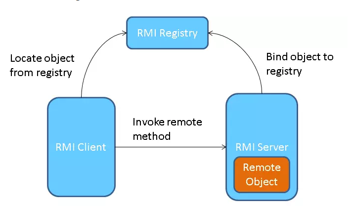
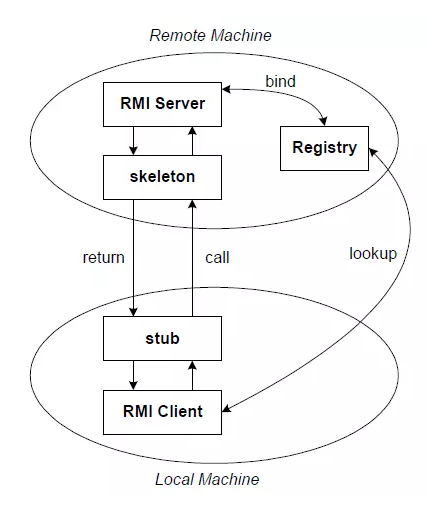

# KIẾN THỨC JAVA RMI (Remote Method Invocation) - ÔN THI CUỐI KỲ

---

## 1. KHÁI NIỆM RMI

**RMI (Remote Method Invocation)** là cơ chế cho phép một đối tượng Java trên máy này có thể gọi (invoke) phương thức của một đối tượng Java đang chạy trên máy khác (JVM khác), thông qua mạng.

- RMI là API bậc cao, xây dựng trên nền tảng Socket.
- RMI cho phép truyền dữ liệu VÀ gọi phương thức giữa các máy khác nhau.
- Việc truyền dữ liệu qua mạng được xử lý trong suốt (transparent) bởi JVM.
- RMI hỗ trợ cơ chế callback: Server cũng có thể gọi ngược phương thức ở Client.

---

## 2. KIẾN TRÚC RMI (3 TẦNG)

**Sơ đồ tổng quan: Client → Registry → Server (bind / lookup / invoke)**



**Sơ đồ chi tiết: Stub (Client) ↔ Skeleton (Server) qua mạng**



### Các thành phần chính:

| Thành phần                 | Vai trò                                                                                                                                      |
| ---------------------------- | --------------------------------------------------------------------------------------------------------------------------------------------- |
| **Interface (Remote)** | "Hợp đồng" dùng chung giữa Client và Server. Khai báo các phương thức có thể gọi từ xa.                                        |
| **Implementation**     | Lớp triển khai logic thực sự (nằm ở Server). Kế thừa `UnicastRemoteObject` và implement Interface.                                 |
| **RMI Server**         | Khởi tạo đối tượng Impl, tạo Registry, đăng ký (bind) dịch vụ.                                                                    |
| **RMI Client**         | Tra cứu (lookup) dịch vụ từ Registry, gọi phương thức từ xa.                                                                         |
| **Stub**               | Đối tượng proxy phía Client. Khi Client gọi phương thức, Stub sẽ đóng gói (marshal) tham số và gửi qua mạng.                 |
| **Skeleton**           | Đối tượng proxy phía Server. Nhận request từ Stub, giải mã (unmarshal) tham số, gọi phương thức thật, rồi trả kết quả.     |
| **RMI Registry**       | Bộ danh bạ (Name Service). Server đăng ký tên dịch vụ vào đây. Client tra cứu tên để lấy reference tới đối tượng từ xa. |

---

## 3. LUỒNG HOẠT ĐỘNG CỦA RMI

```
1. Server tạo đối tượng Impl (đầu bếp)
2. Server tạo Registry tại một cổng (vd: 6789)
3. Server đăng ký (bind/rebind) đối tượng vào Registry với 1 tên (vd: "MyService")
4. Server chờ...

5. Client dùng Naming.lookup("rmi://host:port/MyService") để tra cứu
6. Registry trả về Stub (proxy) cho Client
7. Client gọi phương thức trên Stub
8. Stub đóng gói (marshal) tham số → gửi qua mạng (TCP)
9. Skeleton nhận → giải mã (unmarshal) tham số → gọi phương thức thật trên Impl
10. Impl tính toán, trả kết quả cho Skeleton
11. Skeleton đóng gói kết quả → gửi về Stub
12. Stub giải mã → trả kết quả cho Client
```

**Tóm gọn:** Client → Stub → [Mạng] → Skeleton → Impl → Skeleton → [Mạng] → Stub → Client

---

## 4. MARSHAL & UNMARSHAL (SERIALIZATION)

- **Marshal (Đóng gói):** Chuyển đổi tham số/đối tượng thành dạng byte stream để truyền qua mạng.
  - Kiểu primitive (int, double...) → đóng gói trực tiếp.
  - Kiểu Object → phải implements `Serializable` để serialize.
- **Unmarshal (Giải gói):** Chuyển byte stream ngược lại thành đối tượng Java.

---

## 5. CÁC BƯỚC CÀI ĐẶT ỨNG DỤNG RMI (QUAN TRỌNG NHẤT - THUỘC LÒNG)

### Bước 1: Tạo Interface (Hợp đồng dùng chung)

```java
import java.rmi.Remote;
import java.rmi.RemoteException;

public interface IService extends Remote {
    // Mọi phương thức PHẢI throws RemoteException
    public String xuLyDuLieu(String data) throws RemoteException;
}
```

**Quy tắc:**

- Interface PHẢI `extends Remote`
- Mọi phương thức PHẢI `throws RemoteException`
- File này phải có MẶT Ở CẢ HAI PHÍA (Client và Server)

---

### Bước 2: Tạo lớp Implementation (Logic xử lý - chỉ nằm ở Server)

```java
import java.rmi.RemoteException;
import java.rmi.server.UnicastRemoteObject;

public class ServiceImpl extends UnicastRemoteObject implements IService {

    // Constructor BẮT BUỘC throws RemoteException
    public ServiceImpl() throws RemoteException {
        super(); // Mở cổng kết nối ngầm cho đối tượng RMI
    }

    @Override
    public String xuLyDuLieu(String data) throws RemoteException {
        // Logic xử lý thực tế ở đây
        return "Kết quả: " + data.toUpperCase();
    }
}
```

**Quy tắc:**

- PHẢI `extends UnicastRemoteObject` (để biến thành đối tượng RMI có thể giao tiếp qua mạng)
- PHẢI `implements IService` (cam kết thực hiện đúng Interface)
- Constructor PHẢI `throws RemoteException` và gọi `super()`

---

### Bước 3: Tạo RMI Server (Khởi động và đăng ký dịch vụ)

```java
import java.rmi.Naming;
import java.rmi.registry.LocateRegistry;

public class RMIServer {
    public static void main(String[] args) {
        try {
            // 1. Tạo đối tượng thực thi (thuê đầu bếp)
            IService service = new ServiceImpl();

            // 2. Tạo Registry tại cổng 6789 (mở tổng đài)
            LocateRegistry.createRegistry(6789);

            // 3. Đăng ký dịch vụ với tên "MyService" (ghi vào danh bạ)
            // Cú pháp: "rmi://[IP hoặc hostname]:[port]/[tên dịch vụ]"
            Naming.rebind("rmi://localhost:6789/MyService", service);

            System.out.println(">>> Server đã sẵn sàng trên cổng 6789!");
        } catch (Exception e) {
            e.printStackTrace();
        }
    }
}
```

**Quy tắc:**

- `LocateRegistry.createRegistry(port)`: Tạo bộ đăng ký tại port chỉ định
- `Naming.rebind(url, obj)`: Đăng ký đối tượng với tên. Dùng `rebind` thay `bind` để tránh lỗi trùng tên
- Cổng mặc định của RMI là 1099, nhưng có thể dùng cổng bất kỳ
- **LUÔN CHẠY SERVER TRƯỚC, CLIENT SAU**

---

### Bước 4: Tạo RMI Client (Kết nối và gọi phương thức từ xa)

```java
import java.rmi.Naming;
import java.util.Scanner;

public class RMIClient {
    public static void main(String[] args) {
        try {
            // 1. Tra cứu dịch vụ từ xa (lookup trong danh bạ)
            IService service = (IService) Naming.lookup("rmi://localhost:6789/MyService");

            // 2. Gọi phương thức từ xa (nhìn như gọi local nhưng thực ra qua mạng)
            Scanner sc = new Scanner(System.in);
            System.out.print("Nhap du lieu: ");
            String input = sc.nextLine();

            String result = service.xuLyDuLieu(input);
            System.out.println("Ket qua tu Server: " + result);

        } catch (Exception e) {
            e.printStackTrace();
        }
    }
}
```

**Quy tắc:**

- `Naming.lookup(url)`: Tra cứu dịch vụ. URL phải khớp IP, Port, Tên với Server
- Ép kiểu `(IService)` kết quả trả về từ lookup
- Client CHỈ CẦN biết Interface, không cần biết file Impl

---

## **3 điều phải khớp giữa Client ↔ Server:**

1. **IP/Hostname** (ví dụ: `localhost` hoặc `192.168.1.100`)
2. **Port** (ví dụ: `6789`)
3. **Tên dịch vụ** (ví dụ: `MyService`)

→ Sai 1 trong 3 là toàn bộ không chạy.

---

## 8. VÍ DỤ MINH HỌA: CÁC DẠNG BÀI TẬP (ĐÃ CÓ SẴN TRONG CODE)

Code RMI đã có sẵn 31 dạng bài tập trong file `ServiceImpl.java` (thư mục `rmi/`).
Chỉ cần uncomment 1 dòng return duy nhất trong hàm `xuLyDuLieu()` để chuyển dạng bài:

| Bài  | Mô tả                                                      | Input ví dụ                      |
| ----- | ------------------------------------------------------------ | ---------------------------------- |
| 1     | Tam giác (chu vi, diện tích)                              | `3 4 5`                          |
| 2     | Số phức (cộng/trừ/nhân/chia)                            | `ADD 1 2 3 4`                    |
| 3     | Fibonacci                                                    | `10`                             |
| 4     | Quy đổi tiền tệ                                          | `100 USD VND`                    |
| 5     | Kiểm tra số nguyên tố                                    | `17`                             |
| 6     | Sắp xếp tăng dần                                         | `5 2 9 1`                        |
| 7     | Sắp xếp giảm dần                                         | `5 2 9 1`                        |
| 8     | Thống kê số lượng từ                                   | `phat trien he thong phat trien` |
| 9     | Sắp xếp chuỗi (alphabet)                                  | `zebra,apple,cat`                |
| 10    | Đảo chuỗi                                                 | `abcde`                          |
| 11    | Ngắt chuỗi theo dấu                                       | `a-b-c                             |
| 12    | ƯCLN & BCNN                                                 | `24 36`                          |
| 13    | Phương trình bậc 1                                       | `2 4`                            |
| 14    | Phương trình bậc 2                                       | `1 -3 2`                         |
| 15    | Tổng 1 đến N                                              | `100`                            |
| 16    | Đếm nguyên âm/phụ âm                                   | `hello world`                    |
| 17    | Chuẩn hóa chuỗi (Title Case)                              | `phat TRIEN he thong`            |
| 18    | Kiểm tra Palindrome                                         | `racecar`                        |
| 19    | Giai thừa                                                   | `5`                              |
| 20    | Tổng chữ số                                               | `12345`                          |
| 21-31 | Tổng danh sách, Min/Max, Chẵn lẻ, Diện tích, Chu vi... | (xem code)                         |

---

## 9. SO SÁNH RMI VỚI SOCKET THƯỜNG

| Tiêu chí              | Socket (TCP/UDP)                        | RMI                                          |
| ----------------------- | --------------------------------------- | -------------------------------------------- |
| Mức độ trừu tượng | Thấp (phải tự đóng gói dữ liệu) | Cao (gọi hàm như bình thường)          |
| Ngôn ngữ              | Đa ngôn ngữ                          | Chỉ Java ↔ Java                            |
| Truyền dữ liệu       | Byte stream / Text                      | Object Java (Serialization)                  |
| Cài đặt              | Phức tạp (phải tự parse)            | Đơn giản (chỉ cần Interface)            |
| Hiệu năng             | Nhanh hơn (ít overhead)               | Chậm hơn (do serialization)                |
| Sử dụng               | Chat, truyền file, game                | Hệ thống phân tán, ứng dụng enterprise |
