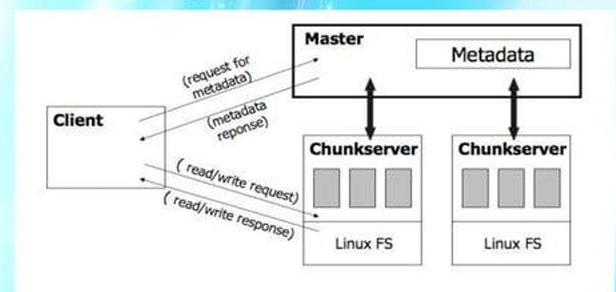
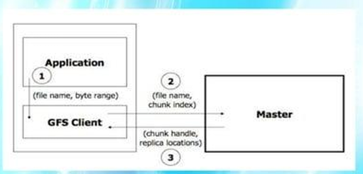
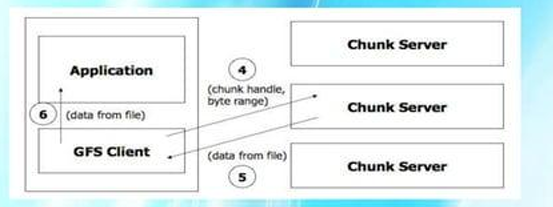
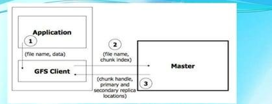
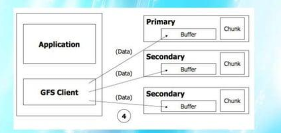
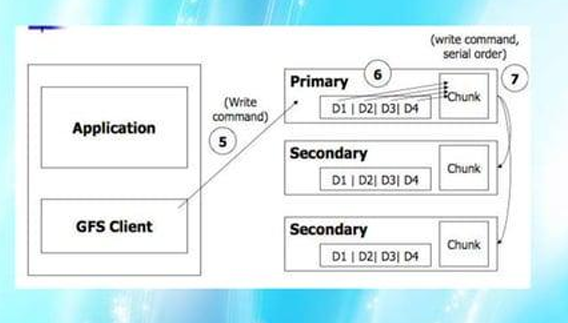

# HỆ THỐNG FILE PHÂN TÁN (Distributed File System) - ÔN THI CUỐI KỲ

## Trọng tâm: Google File System (GFS)

---

## 1. GIỚI THIỆU

Google File System (GFS) được thiết kế bởi Sanjay Ghemawat, Howard Gobioff và Shun-Tak Leung (Google, 2002-2003).

**Mục tiêu chính:**
- Cung cấp khả năng **chịu lỗi** (fault tolerance) trên phần cứng giá rẻ thông thường (commodity hardware).
- Phục vụ **số lượng lớn client** với hiệu năng tổng hợp (aggregate performance) cao.
- Google lưu trữ dữ liệu trên hơn 15.000 máy chủ phần cứng thông thường.
- Xử lý các thách thức đặc thù của hệ thống phân tán quy mô lớn.

---

## 2. CÁC GIẢ ĐỊNH THIẾT KẾ (Design Assumptions)

| Giả định | Giải thích |
|---|---|
| Phần cứng hay hỏng | Hệ thống được xây từ nhiều linh kiện giá rẻ, lỗi phần cứng là BÌNH THƯỜNG, không phải ngoại lệ. |
| File kích thước lớn | Lưu trữ số lượng vừa phải các file có dung lượng LỚN (hàng GB). |
| Đọc tuần tự lớn | Workload chủ yếu là đọc tuần tự (streaming read) số lượng lớn dữ liệu và đọc ngẫu nhiên nhỏ. |
| Ghi tuần tự (append) | Hầu hết thao tác ghi là ghi nối đuôi (append) dữ liệu vào cuối file, rất ít ghi đè. |
| Đồng thời nhiều client | Hệ thống phải hỗ trợ hiệu quả ngữ nghĩa cho nhiều client ghi đồng thời vào cùng file. |
| Băng thông > Độ trễ | Ưu tiên **thông lượng cao** (high throughput) hơn là **độ trễ thấp** (low latency). |

---

## 3. KIẾN TRÚC GFS

### 3.1 Các thành phần chính



| Thành phần | Vai trò |
|---|---|
| **Master** | Một tiến trình duy nhất, quản lý toàn bộ metadata (namespace, mapping file→chunk, vị trí replica). |
| **Chunkserver** | Lưu trữ các chunk trên đĩa cứng cục bộ dưới dạng file Linux thông thường. |
| **Client** | Tương tác với Master để lấy metadata, sau đó trao đổi dữ liệu trực tiếp với Chunkserver. |

### 3.2 Chunk (Khối dữ liệu)

- File được chia thành các **chunk** có kích thước cố định **64 MB**.
- Mỗi chunk được gán một **chunk handle** (mã định danh) duy nhất, bất biến, 64 bit.
- Mỗi chunk được **nhân bản (replicate)** trên nhiều chunkserver (mặc định 3 bản sao).

**Tại sao chunk 64 MB (lớn)?**
- Ít chunk hơn → ít metadata hơn → Master quản lý nhẹ hơn.
- Client cần ít lần liên lạc Master hơn (1 chunk phục vụ nhiều thao tác).
- **Nhược điểm:** Có thể tạo ra hotspot (điểm nóng) nếu file nhỏ chỉ gồm 1 chunk mà nhiều client cùng truy cập.

### 3.3 Metadata (Siêu dữ liệu)

Master lưu trữ 3 loại metadata chính:
1. **File và chunk namespace** (cấu trúc thư mục, tên file).
2. **Mapping từ file sang chunk** (file nào gồm những chunk nào).
3. **Vị trí các replica** của mỗi chunk (chunk nằm ở chunkserver nào).

**Lưu ý:**
- Loại 1 và 2 được lưu bền vững (persistent) vào **Operation Log** trên đĩa Master.
- Loại 3 KHÔNG lưu bền vững mà Master hỏi lại chunkserver mỗi khi khởi động.
- Toàn bộ metadata nằm trong **bộ nhớ RAM** → thao tác của Master rất nhanh.

---

## 4. THUẬT TOÁN ĐỌC FILE (Read Algorithm)

**Bước 1-3: Client gửi yêu cầu đọc → Master trả về metadata (chunk handle + vị trí replica)**



**Bước 4-6: Client đọc dữ liệu trực tiếp từ Chunkserver**



**Điểm quan trọng:** Dữ liệu đi trực tiếp từ Chunkserver → Client, KHÔNG đi qua Master. Master chỉ xử lý metadata.

---

## 5. THUẬT TOÁN GHI FILE (Write Algorithm)

**Bước 1-3: Client gửi yêu cầu ghi → Master trả về Primary + Secondary locations**



**Bước 4: Client đẩy dữ liệu tới TẤT CẢ các replica (vào Buffer, chưa ghi chính thức)**



**Bước 5-9: Client gửi write command → Primary sắp xếp thứ tự → ghi vào chunk → báo Secondary**



**Điểm quan trọng:**
- Primary quyết định thứ tự ghi → đảm bảo tính nhất quán.
- Dữ liệu được đẩy tới tất cả replica TRƯỚC khi lệnh ghi được phát.

---

## 6. THUẬT TOÁN GHI NỐI (Record Append Algorithm)

```
Bước 1: Ứng dụng gửi yêu cầu record append.
Bước 2-3: Tương tự ghi thông thường (lấy metadata từ Master).
Bước 4: Client đẩy dữ liệu tới tất cả replica của chunk CUỐI CÙNG trong file.
Bước 5: Primary kiểm tra bản ghi có vừa trong chunk hiện tại không.
         - KHÔNG VỪA → Primary đệm (pad) chunk, báo Secondary làm tương tự,
           thông báo Client thử lại với chunk tiếp theo.
         - VỪA → Primary ghi bản ghi, gửi lệnh cho Secondary ghi tại
           CÙNG VỊ TRÍ OFFSET, nhận phản hồi, rồi trả kết quả cho Client.
```

---

## 7. QUẢN LÝ NAMESPACE VÀ KHÓA (Namespace & Locking)

- GFS **KHÔNG** có cấu trúc thư mục kiểu cây (per-directory) như hệ thống file truyền thống.
- GFS biểu diễn namespace như một **bảng tra cứu (lookup table)** ánh xạ đường dẫn đầy đủ → metadata.
- Mỗi thao tác của Master phải **khóa (lock)** các vùng namespace tương ứng trước khi thực hiện.
- Cho phép nhiều thao tác chạy đồng thời trên các vùng namespace khác nhau.

---

## 8. SẮP XẾP & NHÂN BẢN REPLICA (Replica Placement & Replication)

### 8.1 Đặt Replica
Mục tiêu: Tối đa hóa **độ tin cậy**, **tính sẵn sàng** và **sử dụng băng thông** mạng.
- Các replica được phân tán trên **nhiều rack** (giá đỡ máy chủ) khác nhau.
- Yếu tố chọn vị trí đặt replica mới:
  1. Ưu tiên chunkserver có dung lượng đĩa trống dưới mức trung bình.
  2. Hạn chế số lượng replica vừa tạo gần đây trên cùng chunkserver.
  3. Phân tán replica của cùng 1 chunk trên nhiều rack khác nhau.

### 8.2 Nhân bản lại (Re-replication)
- Master tự động nhân bản lại khi số replica giảm xuống dưới ngưỡng mong muốn (vd: chunkserver chết).
- Ưu tiên chunk nào thiếu replica nhiều nhất.

### 8.3 Cân bằng tải (Rebalancing)
- Master định kỳ kiểm tra và di chuyển replica để cân bằng tải giữa các chunkserver.

---

## 9. THU GOM RÁC (Garbage Collection)

- Khi ứng dụng xóa file, Master **KHÔNG xóa ngay lập tức**.
- File được **đổi tên** thành tên ẩn (hidden name) → vẫn có thể đọc và khôi phục.
- Sau một thời gian nhất định, Master mới xóa metadata trong bộ nhớ.
- Cơ chế này đơn giản, an toàn, và cho phép khôi phục file bị xóa nhầm.

---

## 10. CHỊU LỖI (Fault Tolerance)

### 10.1 Tính sẵn sàng cao (High Availability)
| Cơ chế | Mô tả |
|---|---|
| **Fast Recovery** | Master và Chunkserver được thiết kế để khởi động lại nhanh chóng bất kể trạng thái trước đó. |
| **Chunk Replication** | Mỗi chunk được nhân bản trên nhiều chunkserver, nhiều rack. Nếu 1 server chết, dữ liệu vẫn còn ở server khác. |
| **Master Replication** | Operation log và checkpoint của Master được nhân bản tới nhiều máy. Nếu Master chết, 1 máy dự phòng có thể thay thế. |

### 10.2 Toàn vẹn dữ liệu (Data Integrity)
- Mỗi chunkserver sử dụng **checksum** để xác minh tính toàn vẹn dữ liệu.
- Chunk 64 MB được chia thành các block 64 KB, mỗi block có checksum 32 bit riêng.
- Khi đọc, chunkserver kiểm tra checksum. Nếu sai → báo lỗi, Client đọc replica khác.

---

## 11. THÁCH THỨC (Challenges)

- **Dung lượng lưu trữ:** Quy mô dữ liệu tăng nhanh theo thời gian.
- **Nút thắt cổ chai (Bottleneck):** Master là Single Point of Failure (SPOF). Nhiều client truy cập đồng thời có thể gây nghẽn.
- **Thời gian:** Các thao tác trên hệ thống phân tán chịu độ trễ mạng.

---

## 12. KẾT LUẬN

- GFS được thiết kế để hỗ trợ **xử lý dữ liệu quy mô lớn**.
- Cung cấp khả năng **chịu lỗi** mạnh mẽ qua cơ chế nhân bản.
- Xử lý tốt khi **chunkserver bị lỗi** mà không ảnh hưởng tính sẵn sàng.
- Đạt **thông lượng cao** phù hợp với ứng dụng xử lý dữ liệu lớn (MapReduce, BigTable).
- Là nền tảng cho nhiều dịch vụ nghiên cứu và phát triển của Google.

---

## 13. CODE MINH HỌA TƯỢNG TRƯNG (Java đơn giản)

Dưới đây là đoạn code Java tượng trưng mô phỏng cơ chế hoạt động cơ bản của GFS:

```java
import java.util.*;

// Mô phỏng Master quản lý metadata
class GFSMaster {
    // Mapping: fileName -> danh sách chunk handle
    private Map<String, List<String>> fileToChunks = new HashMap<>();
    // Mapping: chunkHandle -> danh sách chunkserver chứa replica
    private Map<String, List<String>> chunkLocations = new HashMap<>();

    // Client yêu cầu đọc file -> Master trả metadata
    public Map<String, Object> readRequest(String fileName, int chunkIndex) {
        Map<String, Object> response = new HashMap<>();
        List<String> chunks = fileToChunks.get(fileName);
        if (chunks != null && chunkIndex < chunks.size()) {
            String chunkHandle = chunks.get(chunkIndex);
            response.put("chunkHandle", chunkHandle);
            response.put("locations", chunkLocations.get(chunkHandle));
        }
        return response;
    }

    // Đăng ký file mới
    public void registerFile(String fileName, List<String> chunkHandles,
                             Map<String, List<String>> locations) {
        fileToChunks.put(fileName, chunkHandles);
        for (var entry : locations.entrySet()) {
            chunkLocations.put(entry.getKey(), entry.getValue());
        }
    }
}

// Mô phỏng Chunkserver lưu trữ dữ liệu chunk
class ChunkServer {
    private String serverName;
    private Map<String, byte[]> chunks = new HashMap<>();  // chunkHandle -> data

    public ChunkServer(String name) { this.serverName = name; }

    public void storeChunk(String chunkHandle, byte[] data) {
        chunks.put(chunkHandle, data);
        System.out.println(serverName + " da luu chunk: " + chunkHandle);
    }

    public byte[] readChunk(String chunkHandle) {
        return chunks.get(chunkHandle);
    }
}

// Demo luồng đọc file đơn giản
public class GFSDemo {
    public static void main(String[] args) {
        // 1. Khởi tạo Master và các Chunkserver
        GFSMaster master = new GFSMaster();
        ChunkServer cs1 = new ChunkServer("ChunkServer-1");
        ChunkServer cs2 = new ChunkServer("ChunkServer-2");

        // 2. Giả lập: file "report.txt" gồm 1 chunk, replica trên cs1 và cs2
        byte[] data = "Du lieu bao cao nam 2026".getBytes();
        cs1.storeChunk("chunk_001", data);
        cs2.storeChunk("chunk_001", data.clone());   // replica

        master.registerFile("report.txt",
            Arrays.asList("chunk_001"),
            Map.of("chunk_001", Arrays.asList("ChunkServer-1", "ChunkServer-2")));

        // 3. Client yêu cầu đọc chunk 0 của file "report.txt"
        Map<String, Object> meta = master.readRequest("report.txt", 0);
        System.out.println("Master tra ve: " + meta);

        // 4. Client chọn chunkserver đầu tiên và đọc dữ liệu
        byte[] result = cs1.readChunk((String) meta.get("chunkHandle"));
        System.out.println("Du lieu doc duoc: " + new String(result));
    }
}
```

**Kết quả chạy:**
```
ChunkServer-1 da luu chunk: chunk_001
ChunkServer-2 da luu chunk: chunk_001
Master tra ve: {chunkHandle=chunk_001, locations=[ChunkServer-1, ChunkServer-2]}
Du lieu doc duoc: Du lieu bao cao nam 2026
```
