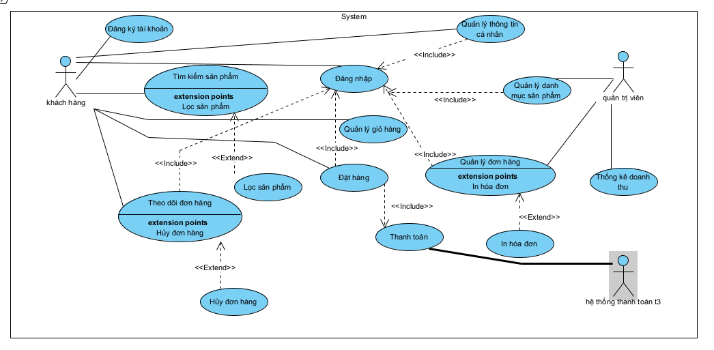
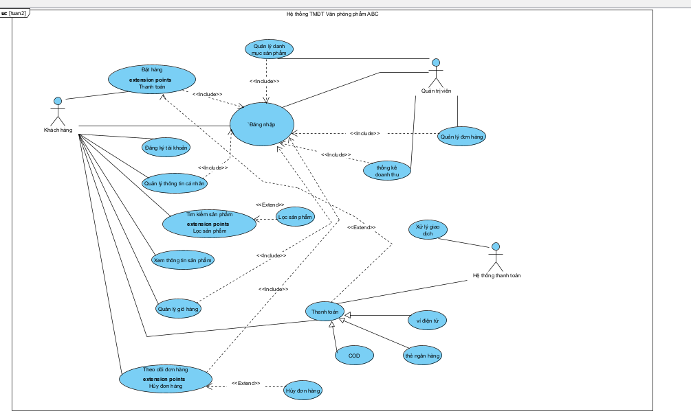

### PHẦN 1: XÁC ĐỊNH CÁC BÊN LIÊN QUAN (ACTORS) VÀ CHỨC NĂNG

#### 1. Actor: Khách hàng (Customer)

* **Đăng ký tài khoản**
* **Đăng nhập**
* **Quản lý thông tin cá nhân:** Sửa tên, địa chỉ, số điện thoại.
* **Tìm kiếm sản phẩm**
* **Lọc sản phẩm:** (Extend từ Tìm kiếm)
* **Xem thông tin sản phẩm**
* **Quản lý giỏ hàng:** Thêm/sửa/xóa sản phẩm trong giỏ.
* **Đặt hàng**
* **Thanh toán:** Chọn phương thức và trả tiền.
* **Theo dõi đơn hàng:** Xem trạng thái ship.
* **Hủy đơn hàng:** (Extend từ Theo dõi đơn hàng) Nếu đơn chưa đi.

#### 2. Actor: Quản trị viên (Admin)

* **Đăng nhập**
* **Quản lý danh mục sản phẩm:** Thêm, sửa, xóa, cập nhật giá/khuyến mãi.
* **Quản lý đơn hàng:** Xem danh sách, cập nhật trạng thái (đang giao, đã giao), in hóa đơn.
* **Thống kê báo cáo**

#### 3. Actor: Hệ thống thanh toán (Payment Gateway - Actor phụ)

Hệ thống bên ngoài (như Momo, VNPay, Visa...) để xử lý tiền.

* **Xử lý giao dịch**

---

### PHẦN 2: LẬP KẾ HOẠCH PHỎNG VẤN

| Đối tượng phỏng vấn                   | Mục tiêu phỏng vấn                                               | Câu hỏi gợi ý (Sample Questions)                                                                                                                                                                                        |
| ------------------------------------------- | -------------------------------------------------------------------- | --------------------------------------------------------------------------------------------------------------------------------------------------------------------------------------------------------------------------- |
| **Ban Giám đốc (ABC)**             | Xác định mục tiêu kinh doanh, ngân sách, quy tắc bán hàng. | 1. Công ty dự kiến xử lý bao nhiêu đơn hàng/ngày? 2. Quy trình duyệt đơn hàng như thế nào? 3. Có cho phép khách nợ (trả sau) không hay bắt buộc thanh toán ngay?                       |
| **Nhân viên Quản trị/Bán hàng** | Hiểu quy trình thao tác thực tế, báo cáo cần thiết.         | 1. Khi thêm một sản phẩm mới, anh/chị cần nhập những thông tin gì (kích thước, màu sắc...)? 2. Anh/chị cần in hóa đơn theo mẫu nào? 3. Khi nào thì được phép hủy đơn của khách? |
| **Khách hàng tiềm năng**          | Hiểu nhu cầu trải nghiệm người dùng (UX).                     | 1. Bạn thích thanh toán qua Ví điện tử hay COD (tiền mặt) hơn? 2. Bạn thường tìm kiếm sản phẩm theo tiêu chí nào nhất (Giá rẻ hay Thương hiệu)?                                              |

---

### PHẦN 3:SƠ ĐỒ USE CASE (VISUAL PARADIGM)

