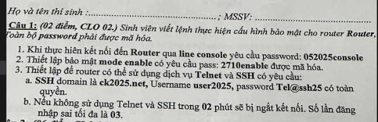
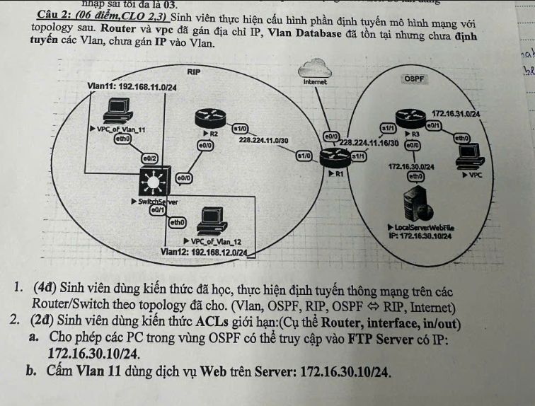
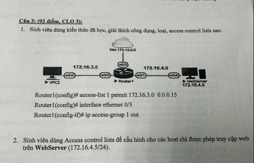

📌 MỤC LỤC TRA CỨU THEO TRANG / PHẦN (BẢN CHUẨN ĐẦY ĐỦ KHI IN GIẤY THI)
==================================================================================

📖 **[TRANG 1 / PHẦN 1]**: ⚡ [BÍ KÍP TRA CỨU SUBNET MASK & WILDCARD MASK](#trang-1--ph%E1%BA%A7n-1-b%C3%AD-k%C3%ADp-tra-c%E1%BB%A9u-subnet-mask--wildcard-mask-vi%E1%BA%BFt-nay-kh%C3%B4ng-c%E1%BA%A7n-t%C3%ADnh)

- [1. Quy tắc vàng: Khi nào dùng Subnet Mask, khi nào dùng Wildcard Mask?](#1-quy-t%E1%BA%AFc-v%C3%A0ng-khi-n%C3%A0o-d%C3%B9ng-mask-n%C3%A0o)
- [2. Trong đề thi chỉ có 2 loại mạng chính (/30 và /24)](#2-trong-%C4%91%E1%BB%81-thi-ch%E1%BA%A3-c%C3%B3-2-lo%E1%BA%A1i-m%E1%BA%A1ng-ch%C3%ADnh-thu%E1%BB%99c-l%C3%B2ng-vi%E1%BA%BFt-lu%C3%B4n)
- [3. Bảng tra cứu đầy đủ tất cả dải mạng từ /30 đến /24](#3-b%E1%BA%A3ng-tra-c%E1%BB%A9u-%C4%91%E1%BA%A7y-%C4%91%E1%BB%A7-t%E1%BA%A5t-c%E1%BA%A3-d%E1%BA%A3i-m%E1%BA%A1ng-t%E1%BB%AB-30-%C4%91%E1%BA%BFn-24)

📖 **[TRANG 2 / PHẦN 2]**: 🔐 [CÂU 1 (2đ): CẤU HÌNH BẢO MẬT ROUTER](#trang-2--ph%E1%BA%A7n-2-c%C3%A2u-1-2-%C4%91i%E1%BB%83m---clo-02-c%E1%BA%A5u-h%C3%ACnh-b%E1%BA%A3o-m%E1%BA%ADt-router)

- [Đề bài & Lệnh bài giải Câu 1](#b%C3%A0i-gi%E1%BA%A3i-c%C3%A2u-1)
- [Giải thích chi tiết từng dòng lệnh Câu 1](#gi%E1%BA%A3i-th%C3%ADch-chi-ti%E1%BA%BFt-t%E1%BB%ABng-l%E1%BB%87nh-c%E1%BA%A5u-h%C3%ACnh)

📖 **[TRANG 3 / PHẦN 3]**: 🌐 [CÂU 2 (6đ): ĐỊNH TUYẾN MÔ HÌNH MẠNG + ACL](#trang-3--ph%E1%BA%A7n-3-c%C3%A2u-2-6-%C4%91i%E1%BB%83m---clo-23-%C4%91%E1%BB%8Bnh-tuy%E1%BA%BFn--acl)

- [Cấu hình SwitchServer (Trunk, Access VLAN 11 & 12)](#1-switchserver)
- [Cấu hình R2 (Router-on-a-stick + RIPv2)](#2-r2-router-on-a-stick--rip)
- [Cấu hình R1 Trung tâm (Redistribution + NAT Overload)](#3-r1-trung-t%C3%A2m---redistribution--nat)
- [Cấu hình R3 (OSPF Area 0)](#4-r3-ospf)
- [Cấu hình IP các VPC](#5-ip-c%C3%A1c-vpc)
- [Cấu hình ACL (Cách 1 Gộp tại R3 e0/0 out \| Cách 2 Tách 2a & 2b)](#c%C3%A1ch-1-c%E1%BA%A5u-h%C3%ACnh-g%E1%BB%99p-tr%C3%AAn-router-r3-c%E1%BB%95ng-e00-chi%E1%BB%81u-out---t%E1%BB%91i-%C6%B0u--g%E1%BB%8Dn-nh%E1%BA%A5t)
- [Giải thích chi tiết từng dòng lệnh trong Câu 2](#gi%E1%BA%A3i-th%C3%ADch-chi-ti%E1%BA%BFt-t%E1%BB%ABng-d%C3%B2ng-l%E1%BB%87nh-trong-c%C3%A2u-2)

📖 **[TRANG 4 / PHẦN 4]**: 🛡️ [CÂU 3 (2đ): GIẢI THÍCH ACL LÝ THUYẾT & WEB-ONLY](#trang-4--ph%E1%BA%A7n-4-c%C3%A2u-3-2-%C4%91i%E1%BB%83m---clo-3-gi%E1%BA%A3i-th%C3%ADch-acl-l%C3%BD-thuy%E1%BA%BFt)

- [Bài giải Câu 3.1 (Giải thích Standard ACL 1 & e0/3 out)](#b%C3%A0i-gi%E1%BA%A3i-c%C3%A2u-31)
- [Bài giải Câu 3.2 (Extended ACL WEB_ONLY cho WebServer 172.16.4.5)](#b%C3%A0i-gi%E1%BA%A3i-c%C3%A2u-32)
- [Giải thích chi tiết & Lý do vị trí đặt ACL](#gi%E1%BA%A3i-th%C3%ADch-chi-ti%E1%BA%BFt-l%E1%BB%87nh--v%E1%BB%8B-tr%C3%AD-%C4%91%E1%BA%B7t-acl)

📖 **[TRANG 5 / PHẦN 5]**: 📋 [MẪU THAY SỐ NHANH ĐI THI (CHỈ CẦN THAY GIÁ TRỊ TRONG [ ])](#trang-5--ph%E1%BA%A7n-5-m%E1%BA%A8u-thay-s%E1%BB%91-nhanh-%C4%91i-thi-ch%E1%BA%A3-c%E1%BA%A7n-thay-gi%C3%A1-tr%E1%BB%8B-trong--)

- [Mẫu Câu 1: Bảo mật Router](#m%E1%BA%ABu-c%C3%A2u-1-b%E1%BA%A3o-m%E1%BA%ADt-router)
- [Mẫu Câu 2: Switch (VLAN + Trunk)](#m%E1%BA%ABu-c%C3%A2u-2-switch-g%C3%A1n-vlan--trunk)
- [Mẫu Câu 2: Router-on-a-stick](#m%E1%BA%ABu-c%C3%A2u-2-router-on-a-stick-router-c%C3%B3-vlan)
- [Mẫu Câu 2: R1 Trung tâm (Redistribution + NAT)](#m%E1%BA%ABu-c%C3%A2u-2-r1-trung-t%C3%A2m-redistribution--nat)
- [Mẫu Câu 2: Router OSPF thuần](#m%E1%BA%ABu-c%C3%A2u-2-router-ospf-thu%E1%BA%A7n)
- [Mẫu ACL: Cấm dịch vụ cụ thể](#m%E1%BA%ABu-acl-c%E1%BA%A5m-d%E1%BB%8Bch-v%E1%BB%A5-c%E1%BB%A5-th%E1%BB%83)
- [Bảng Port dịch vụ phổ biến](#b%E1%BA%A3ng-port-ph%E1%BB%95-bi%E1%BA%BFn)
- [Mẫu văn giải thích ACL chép vào giấy thi](#m%E1%BA%ABu-gi%E1%BA%A3i-th%C3%ADch-acl-vi%E1%BA%BFt-v%C3%A0o-gi%E1%BA%A5y-thi)

📖 **[TRANG 6 / PHẦN 6]**: 📖 [CẨM NANG LÝ THUYẾT & VẤN ĐÁP THI CỦA CÁC BÀI LAB](#trang-6--ph%E1%BA%A7n-6-c%E1%BA%A9m-nang-l%C3%BD-thuy%E1%BA%BFt--v%E1%BA%A5n-%C4%91%C3%A1p-t%E1%BB%95ng-h%E1%BB%A3p-t%E1%BB%AB-t%E1%BA%A5t-c%E1%BA%A3-c%C3%A1c-b%C3%A0i-lab-pdf)

- [I. Kiến thức nền tảng thiết bị & CLI Modes](#i-ki%E1%BA%BFn-th%E1%BB%A9c-n%E1%BB%81n-t%E1%BA%A3ng-thi%E1%BA%BFt-b%E1%BB%8B-m%E1%BA%A1ng--d%C3%B2ng-l%E1%BB%87nh-cli)
- [II. Lý thuyết VLAN, VTP, Trunking & Router-on-a-stick](#ii-l%C3%BD-thuy%E1%BA%BFt-vlan-vtp-trunking--router-on-a-stick)
- [III. Lý thuyết Định tuyến động (RIPv1 vs RIPv2 vs OSPF)](#iii-l%C3%BD-thuy%E1%BA%BFt-%C4%91%E1%BB%8Bnh-tuy%E1%BA%BFn-%C4%91%E1%BB%99ng-rip--ospf)
- [IV. Lý thuyết Route Redistribution](#iv-l%C3%BD-thuy%E1%BA%BFt-route-redistribution-d%E1%BB%8Bch-%C4%91%E1%BB%8Bnh-tuy%E1%BA%BFn-ch%C3%A9o)
- [V. Lý thuyết ACL & NAT Overload](#v-l%C3%BD-thuy%E1%BA%BFt-access-control-list-acl--nat)
- [VI. Tổng hợp Câu hỏi Vấn đáp thường gặp](#vi-t%E1%BB%95ng-h%E1%BB%A3p-c%C3%A2u-h%E1%BB%8Fi-v%E1%BA%A5n-%C4%91%C3%A1p-th%C6%B0%E1%BB%9Dng-g%E1%BA%B7p-khi-b%E1%BA%A3o-v%E1%BB%87)

📖 **[TRANG 7 / PHẦN 7]**: 📊 [BẢNG GIẢI MÃ KÝ HIỆU & THÔNG SỐ TOÀN TẬP IN CISCO IOS](#trang-7--ph%E1%BA%A7n-7-b%E1%BA%A3ng-gi%E1%BA%A3i-m%C3%A3-k%C3%BD-hi%E1%BB%87u--th%C3%B4ng-s%E1%BB%91-to%C3%A0n-t%E1%BA%ADp-trong-cisco-ios)

- [1. Giải mã ký hiệu bảng định tuyến (`show ip route`)](#1-b%E1%BA%A3ng-gi%E1%BA%A3i-m%C3%A3-k%C3%BD-hi%E1%BB%87u-trong-b%E1%BA%A3ng-%C4%91%E1%BB%8Bnh-tuy%E1%BA%BFn-show-ip-route)
- [2. Giải mã ký hiệu kiểm tra `ping`](#2-b%E1%BA%A3ng-gi%E1%BA%A3i-m%C3%A3-k%C3%BD-hi%E1%BB%87u-ki%E1%BB%83m-tra-k%E1%BA%BFt-n%E1%BB%91i-ping-ping)
- [3. Giải mã ký hiệu `traceroute`](#3-b%E1%BA%A3ng-gi%E1%BA%A3i-m%C3%A3-k%C3%BD-hi%E1%BB%87u-theo-d%C3%B5i-%C4%91C6%B0%E1%BB%9Dng-%C4%91i-traceroute-traceroute--trace)
- [4. Giải mã trạng thái cổng mạng (`show ip interface brief`)](#4-b%E1%BA%A3ng-gi%E1%BA%A3i-m%C3%A3-tr%E1%BA%A1ng-th%C3%A1i-c%E1%BB%95ng-m%E1%BA%A1ng-show-ip-interface-brief)
- [5. Giải mã thông số `show vtp status`](#5-b%E1%BA%A3ng-gi%E1%BA%A3i-m%C3%A3-th%C3%B4ng-s%E1%BB%91-vtp-status-show-vtp-status)
- [6. Bảng toán tử & cú pháp nâng cao ACL](#6-b%E1%BA%A3ng-to%C3%A1n-t%E1%BB%AD--c%C3%BA-ph%C3%A1p-n%C3%A2ng-cao-trong-access-control-list-acl)
- [7. Bảng phân loại địa chỉ IP, Subnet Mask & Private IP](#7-b%E1%BA%A3ng-ph%C3%A2n-lo%E1%BA%A1i-%C4%91%E1%BB%8Ba-ch%E1%BB%89-ip-subnet-mask--wildcard-mask-chu%E1%BA%A9n)

=====================================================================

=====================================================================
=====================================================================

[TRANG 1 / PHẦN 1]: BÍ KÍP TRA CỨU SUBNET MASK & WILDCARD MASK (VIẾT NAY KHÔNG CẦN TÍNH)
================================================================================================

=====================================================================

### 1. QUY TẮC VÀNG: KHI NÀO DÙNG MASK NÀO?

👉 **CHỈ DÙNG SUBNET MASK (dạng `255.255.255.x`) TRONG CÁC LỆNH:**

1. Đặt IP cổng Router / Sub-interface: `ip address 192.168.11.1 255.255.255.0`
2. Đặt IP cổng Serial nối Router: `ip address 228.224.11.1 255.255.255.252`
3. Đặt IP trên máy VPCS / Server: `ip 192.168.11.10 255.255.255.0 192.168.11.1`
4. Lệnh tạo Route tĩnh: `ip route 0.0.0.0 0.0.0.0 e0/0`

👉 **CHỈ DÙNG WILDCARD MASK (dạng `0.0.0.x`) TRONG CÁC LỆNH:**

1. Lệnh khai báo mạng OSPF: `network 172.16.30.0 0.0.0.255 area 0`
2. Lệnh tạo Access Control List (ACL): `access-list 1 permit 172.16.3.0 0.0.0.15`

---

### 2. TRONG ĐỀ THI CHỈ CÓ 2 LOẠI MẠNG CHÍNH (THUỘC LÒNG VIẾT LUÔN):

- **Loại 1: Mạng `/30` (Nối 2 Router với nhau qua cáp Serial)**

  - Subnet Mask = **`255.255.255.252`** (dùng cho lệnh `ip address`)
  - Wildcard Mask = **`0.0.0.3`** (dùng cho lệnh `network` OSPF)
- **Loại 2: Mạng `/24` (Mạng LAN, VLAN, PC, Server)**

  - Subnet Mask = **`255.255.255.0`** (dùng cho lệnh `ip address` và gán IP PC)
  - Wildcard Mask = **`0.0.0.255`** (dùng cho OSPF và ACL)

---

### 3. BẢNG TRA CỨU ĐẦY ĐỦ TẤT CẢ DẢI MẠNG (TỪ /30 ĐẾN /24):

|    Prefix (CIDR)    | Subnet Mask (Gán IP / Sub-interface) |       Wildcard Mask (OSPF / ACL)       | Đề thi dùng ở vị trí nào?                              |
| :-----------------: | :-----------------------------------: | :------------------------------------: | :------------------------------------------------------------ |
|    **/30**    |          `255.255.255.252`          |              `0.0.0.3`              | **Nối 2 Router với nhau** (Serial `s1/0`, `s1/1`) |
|    **/28**    |          `255.255.255.240`          |              `0.0.0.15`              | Mạng nhỏ 14 máy / Dải ACL 16 IP                           |
|    **/27**    |          `255.255.255.224`          |              `0.0.0.31`              | Dải mạng 30 máy trạm                                      |
|    **/26**    |          `255.255.255.192`          |              `0.0.0.63`              | Dải mạng 62 máy trạm                                      |
|    **/25**    |          `255.255.255.128`          |             `0.0.0.127`             | Nửa dải mạng Class C (126 máy)                            |
|    **/24**    |           `255.255.255.0`           |             `0.0.0.255`             | **Mạng LAN tiêu chuẩn** (VLAN, PC, Server)           |
| **host 1 IP** |          `255.255.255.255`          | `0.0.0.0` (hoặc từ khóa `host`) | Chỉ định đúng 1 IP Server trong ACL                      |

---

### 3. Mẹo tính dải IP của mạng `/30` (Nối 2 Router):

Mạng `/30` có bước nhảy là **4 IP** cho mỗi block: `.0`, `.4`, `.8`, `.12`, `.16`, `.20`, `.24`, `.28`, `.32`...

- **Block 1 (`228.224.11.0/30`)**:
  + IP Mạng (Network ID): `228.224.11.0` (không gán cho thiết bị)
  + IP Router thứ nhất (R2): `228.224.11.1`
  + IP Router thứ hai (R1): `228.224.11.2`
  + IP Broadcast: `228.224.11.3` (không gán cho thiết bị)
- **Block 5 (`228.224.11.16/30`)**:
  + IP Mạng (Network ID): `228.224.11.16` (không gán cho thiết bị)
  + IP Router thứ nhất (R1): `228.224.11.17`
  + IP Router thứ hai (R3): `228.224.11.18`
  + IP Broadcast: `228.224.11.19` (không gán cho thiết bị)

=====================================================================
=====================================================================

[TRANG 2 / PHẦN 2]: CÂU 1 (2 ĐIỂM - CLO 02) - CẤU HÌNH BẢO MẬT ROUTER
=============================================================================

======================================================================

ĐỀ BÀI:



1. Line Console yêu cầu password: 052025console
2. Enable mode yêu cầu pass: 2710enable (mã hóa)
3. Telnet và SSH:
   a. SSH domain: ck2025.net, Username: user2025, Password: Tel@ssh25, toàn quyền
   b. Không sử dụng trong 02 phút -> ngắt. Đăng nhập sai tối đa 03 lần
4. Toàn bộ password phải được mã hóa

---

BÀI GIẢI CÂU 1:
------------------

Router> enable
Router# configure terminal

! 0. Đổi hostname (BẮT BUỘC để tạo RSA key cho SSH)
Router(config)# hostname R1

! 1. Mã hóa toàn bộ password
R1(config)# service password-encryption

! 2. Line Console
R1(config)# line console 0
R1(config-line)# password 052025console
R1(config-line)# login
R1(config-line)# exit

! 3. Enable mode (mã hóa)
R1(config)# enable secret 2710enable

! 4a. SSH
R1(config)# ip domain-name ck2025.net
R1(config)# crypto key generate rsa modulus 1024
R1(config)# username user2025 privilege 15 secret Tel@ssh25

! 4b. VTY (Telnet + SSH)
R1(config)# line vty 0 4
R1(config-line)# login local
R1(config-line)# transport input ssh telnet
R1(config-line)# exec-timeout 2 0
R1(config-line)# exit

! 4c. Giới hạn đăng nhập sai
R1(config)# ip ssh authentication-retries 3

R1(config)# end
R1# write memory

GIẢI THÍCH CHI TIẾT TỪNG LỆNH CẤU HÌNH:

- **enable**: Chuyển từ chế độ User EXEC Mode (`Router>`) sang Privileged EXEC Mode (`Router#`) để có quyền xem cấu hình chi tiết và thực thi các lệnh kiểm tra, quản trị cao cấp.
- **configure terminal**: Chuyển từ Privileged EXEC Mode sang chế độ cấu hình toàn cục Global Configuration Mode (`Router(config)#`), cho phép thực hiện cấu hình các thông số hệ thống của Router.
- **hostname R1**: Thay đổi tên định danh của thiết bị từ "Router" mặc định thành "R1". Đây là **điều kiện bắt buộc** để Cisco IOS cho phép tạo cặp khóa mã hóa RSA (SSH yêu cầu Hostname và Domain Name phải khác mặc định).
- **service password-encryption**: Bật tính năng mã hóa mật khẩu hệ thống. Lệnh này sẽ tự động mã hóa tất cả các mật khẩu dạng văn bản thuần túy (Cleartext Passwords) hiển thị trong file cấu hình thành dạng mã hóa Type 7 (vòng lặp Vigenere), giúp bảo mật thông tin khi hiển thị cấu hình qua lệnh `show running-config`.
- **line console 0**: Truy cập vào chế độ cấu hình cổng Console vật lý số 0 (`Router(config-line)#`). Cổng Console dùng để quản trị thiết bị trực tiếp bằng cáp console cắm trực tiếp từ máy tính vào Router.
- **password 052025console**: Đặt mật khẩu đăng nhập cho kết nối qua cổng Console là "052025console" (Mật khẩu này sẽ được mã hóa tự động thành Type 7 nhờ lệnh mã hóa ở trên).
- **login**: Kích hoạt việc yêu cầu xác thực mật khẩu Console mỗi khi có kết nối vật lý vào cổng này. Nếu thiếu lệnh `login`, mật khẩu đã cấu hình ở trên sẽ không có tác dụng và người dùng vẫn vào thẳng Router mà không cần pass.
- **exit**: Thoát khỏi chế độ cấu hình hiện tại (Line configuration) để quay lại chế độ cấu hình Global Configuration Mode.
- **enable secret 2710enable**: Đặt mật khẩu bảo vệ để nâng quyền từ User EXEC lên Privileged EXEC Mode (`enable`). Mật khẩu này được mã hóa bằng thuật toán băm một chiều bảo mật cao Type 5 (thường là MD5 hoặc SHA-256), có độ ưu tiên cao hơn và ghi đè hoàn toàn lệnh `enable password` thông thường.
- **ip domain-name ck2025.net**: Thiết lập tên miền (Domain Name) cho thiết bị là "ck2025.net". Đây là **điều kiện bắt buộc thứ hai** để tạo khóa mã hóa RSA cho dịch vụ SSH hoạt động. Tên miền đầy đủ của thiết bị sẽ là `R1.ck2025.net`.
- **crypto key generate rsa modulus 1024**: Thực hiện tạo cặp khóa bảo mật RSA dùng để mã hóa thông tin truyền nhận trên các phiên làm việc SSH. Từ khóa `modulus 1024` chỉ định độ dài khóa là 1024 bit, đây là độ dài tối thiểu được Cisco khuyến nghị để kích hoạt giao thức SSH phiên bản v2 bảo mật cao hơn (mặc định dưới 768 bit chỉ chạy SSHv1).
- **username user2025 privilege 15 secret Tel@ssh25**: Tạo một tài khoản quản trị cục bộ trong cơ sở dữ liệu của Router với Username là "user2025", phân quyền cấp độ cao nhất là `privilege 15` (vào thẳng chế độ đặc quyền `#` sau khi đăng nhập mà không cần nhập thêm pass enable), và mật khẩu được mã hóa Type 5 là "Tel@ssh25".
- **line vty 0 4**: Chui vào chế độ cấu hình các cổng ảo VTY (Virtual Type Terminal) từ cổng số 0 đến số 4, cho phép tối đa 5 kết nối từ xa (Telnet/SSH) đồng thời tại một thời điểm.
- **login local**: Yêu cầu Router sử dụng cơ sở dữ liệu User/Password cục bộ (đã tạo bằng lệnh `username` ở trên) để xác thực người dùng khi kết nối từ xa, thay vì dùng một mật khẩu chung cho đường line vty.
- **transport input ssh telnet**: Cấu hình các cổng VTY chỉ chấp nhận các kết nối đi vào bằng hai giao thức SSH (mã hóa bảo mật) và Telnet (văn bản thuần không bảo mật).
- **exec-timeout 2 0**: Cấu hình thời gian tự động ngắt kết nối (timeout) của phiên làm việc Console hoặc VTY sau **2 phút 0 giây** nếu không phát hiện bất kỳ thao tác gõ phím nào từ người dùng, ngăn ngừa rủi ro bị người khác dùng trộm khi người quản trị bỏ máy đi ra ngoài.
- **ip ssh authentication-retries 3**: Giới hạn số lần nhập sai mật khẩu tối đa khi thực hiện đăng nhập từ xa qua SSH là 3 lần. Nếu nhập sai quá số lần này, Router sẽ ngắt phiên kết nối ngay lập tức.
- **end**: Thoát nhanh từ chế độ cấu hình con bất kỳ về thẳng chế độ Privileged EXEC Mode (`Router#`).
- **write memory**: Lưu toàn bộ các cấu hình đang chạy trong RAM (Running Configuration) vào bộ nhớ không bay hơi NVRAM (Startup Configuration) để đảm bảo cấu hình không bị mất khi Router khởi động lại hoặc mất điện. Giao tiếp tương đương lệnh `copy running-config startup-config`.

=====================================================================
=====================================================================

[TRANG 3 / PHẦN 3]: CÂU 2 (6 ĐIỂM - CLO 2,3) - ĐỊNH TUYẾN MÔ HÌNH MẠNG + ACL
======================================================================================

=====================================================================

ĐỀ BÀI (đọc từ sơ đồ):



- Vùng RIP (trái): R2 + SwitchServer + VPC_Vlan_11 + VPC_Vlan_12
  VLAN 11: 192.168.11.0/24
  VLAN 12: 192.168.12.0/24
  R2 (s1/0) nối R1 (s1/0): mạng 228.224.11.0/30
- R2 (s0/0) nối SwitchServer (s0/0)
- R1 (trung tâm): Internet (e0/0) + Redistribution OSPF <-> RIP
- Vùng OSPF (phải): R3 + VPC + LocalServerWebFile
  R1 (s1/1) nối R3 (s1/1): mạng 228.224.11.16/30
  R3 (e0/0): 172.16.30.0/24 (Server IP: 172.16.30.10)
  R3 (e0/1): 172.16.31.0/24 (VPC)

YÊU CẦU:

1. (4đ) Định tuyến thông mạng: VLAN, OSPF, RIP, OSPF <-> RIP, Internet
2. (2đ) ACL:
   a. Cho phép PC vùng OSPF truy cập FTP Server 172.16.30.10
   b. Cấm VLAN 11 dùng dịch vụ Web trên Server 172.16.30.10

LƯU Ý ĐỀ: Router và VPC đã gán IP, VLAN Database đã tồn tại
           nhưng CHƯA định tuyến các VLAN, CHƯA gán IP vào VLAN.

---

BÀI GIẢI CÂU 2:
------------------

=== 1. SwitchServer ===
SwitchServer> enable
SwitchServer# configure terminal
SwitchServer(config)# interface e0/0
SwitchServer(config-if)# switchport trunk encapsulation dot1q
SwitchServer(config-if)# switchport mode trunk
SwitchServer(config-if)# no shutdown
SwitchServer(config-if)# interface e0/2
SwitchServer(config-if)# switchport mode access
SwitchServer(config-if)# switchport access vlan 11
SwitchServer(config-if)# no shutdown
SwitchServer(config-if)# interface e0/1
SwitchServer(config-if)# switchport mode access
SwitchServer(config-if)# switchport access vlan 12
SwitchServer(config-if)# no shutdown
SwitchServer(config-if)# end
SwitchServer# write memory

=== 2. R2 (Router-on-a-stick + RIP) ===
R2> enable
R2# configure terminal
R2(config)# interface e0/0
R2(config-if)# no shutdown
R2(config-if)# interface e0/0.11
R2(config-subif)# encapsulation dot1Q 11
R2(config-subif)# ip address 192.168.11.1 255.255.255.0
R2(config-subif)# interface e0/0.12
R2(config-subif)# encapsulation dot1Q 12
R2(config-subif)# ip address 192.168.12.1 255.255.255.0
R2(config-subif)# interface s1/0
R2(config-if)# ip address 228.224.11.1 255.255.255.252
R2(config-if)# no shutdown

R2(config-if)# router rip
R2(config-router)# version 2
R2(config-router)# no auto-summary
R2(config-router)# network 192.168.11.0
R2(config-router)# network 192.168.12.0
R2(config-router)# network 228.224.11.0
R2(config-router)# end
R2# write memory

=== 3. R1 (Trung tâm - Redistribution + NAT) ===
R1> enable
R1# configure terminal
R1(config)# interface s1/0
R1(config-if)# ip address 228.224.11.2 255.255.255.252
R1(config-if)# ip nat inside
R1(config-if)# no shutdown
R1(config-if)# interface s1/1
R1(config-if)# ip address 228.224.11.17 255.255.255.252
R1(config-if)# ip nat inside
R1(config-if)# no shutdown
R1(config-if)# interface e0/0
R1(config-if)# ip address dhcp
R1(config-if)# ip nat outside
R1(config-if)# no shutdown

R1(config-if)# exit
R1(config)# access-list 1 permit any
R1(config)# ip nat inside source list 1 interface e0/0 overload
R1(config)# ip route 0.0.0.0 0.0.0.0 e0/0

R1(config)# router rip
R1(config-router)# version 2
R1(config-router)# no auto-summary
R1(config-router)# network 228.224.11.0
R1(config-router)# redistribute ospf 1 metric 2
R1(config-router)# default-information originate

R1(config-router)# router ospf 1
R1(config-router)# network 228.224.11.16 0.0.0.3 area 0
R1(config-router)# redistribute rip subnets
R1(config-router)# default-information originate

R1(config-router)# end
R1# write memory

=== 4. R3 (OSPF) ===
R3> enable
R3# configure terminal
R3(config)# interface s1/1
R3(config-if)# ip address 228.224.11.18 255.255.255.252
R3(config-if)# no shutdown
R3(config-if)# interface e0/0
R3(config-if)# ip address 172.16.30.1 255.255.255.0
R3(config-if)# no shutdown
R3(config-if)# interface e0/1
R3(config-if)# ip address 172.16.31.1 255.255.255.0
R3(config-if)# no shutdown

R3(config-if)# router ospf 1
R3(config-router)# network 228.224.11.16 0.0.0.3 area 0
R3(config-router)# network 172.16.30.0 0.0.0.255 area 0
R3(config-router)# network 172.16.31.0 0.0.0.255 area 0
R3(config-router)# end
R3# write memory

=== 5. IP CÁC VPC ===
VPC_of_Vlan_11> ip 192.168.11.10 255.255.255.0 192.168.11.1
VPC_of_Vlan_11> save

VPC_of_Vlan_12> ip 192.168.12.10 255.255.255.0 192.168.12.1
VPC_of_Vlan_12> save

VPC_OSPF> ip 172.16.31.10 255.255.255.0 172.16.31.1
VPC_OSPF> save

LocalServer> ip 172.16.30.10 255.255.255.0 172.16.30.1
LocalServer> save

=== 6. ACL ===

### ÔN LẠI QUY TẮC BEST PRACTICE ĐẶT ACL (CISCO CCNA):

- **Extended ACL** → Ưu tiên đặt **GẦN NGUỒN** (tiêu hủy gói sớm, tiết kiệm băng thông WAN).
- **Standard ACL** → Đặt **GẦN ĐÍCH** (tránh chặn nhầm vì chỉ lọc IP nguồn).

### ĐỌC LẠI ĐỀ BÀI NGUYÊN VĂN:

- **2a**: *"Cho phép các PC trong vùng OSPF có thể truy cập vào **FTP** Server có IP: 172.16.30.10/24."*
- **2b**: *"Cấm **Vlan 11** dùng dịch vụ **Web** trên Server: 172.16.30.10/24."*

→ Cần phân biệt **dịch vụ** (FTP port 20/21 vs Web port 80/443) → **BẮT BUỘC dùng Extended ACL** (Standard ACL chỉ lọc IP, không phân biệt port/dịch vụ).

### PHÂN TÍCH LUỒNG DỮ LIỆU TRÊN SƠ ĐỒ ĐỀ THI:

```
LUỒNG 2a (FTP từ PC vùng OSPF → Server):
  VPC (172.16.31.10) --[e0/1]--> R3 --[e0/0]--> Server (172.16.30.10)
  ⚠️ Gói tin này chạy NỘI BỘ trong R3, KHÔNG đi qua R1 hay R2!

LUỒNG 2b (Web từ VLAN 11 → Server):
  VPC_Vlan11 (192.168.11.10) --> SwitchServer --> R2 --[s1/0]--> R1 --[s1/1]--> R3 --[e0/0]--> Server
  Gói tin đi qua 3 Router: R2 → R1 → R3
```

### VỊ TRÍ ĐẶT ACL — PHÂN TÍCH BEST PRACTICE:

**Phương án 1 — Áp ở R1 (s1/0 in hoặc s1/1 out)** (theo đúng best practice "gần nguồn"):

- ✅ Chặn được VLAN 11 dùng Web (2b): Gói tin từ VLAN 11 đi qua R1 → OK.
- ❌ **KHÔNG chặn/cho phép được FTP từ PC vùng OSPF (2a)**: Vì gói FTP đi NỘI BỘ trong R3, KHÔNG BAO GIỜ chạy qua R1! → Lệnh trên R1 vô tác dụng với yêu cầu 2a!

**Phương án 2 — Áp ở R3 (e0/0 out)** (gần đích = gần Server):

- ✅ Chặn được VLAN 11 dùng Web (2b): Gói từ VLAN 11 cuối cùng cũng phải đi RA cổng e0/0 của R3 → bị ACL chặn tại đây.
- ✅ **Cho phép được FTP từ PC vùng OSPF (2a)**: Gói FTP đi nội bộ trong R3 và RA cổng e0/0 → ACL kiểm tra và cho phép.
- ✅ **1 bộ ACL duy nhất** kiểm soát trọn vẹn mọi nguồn truy cập vào Server.

### KẾT LUẬN:

> **Trong bài thi này, Best Practice "Extended ACL gần nguồn" KHÔNG áp dụng được vì 2 yêu cầu ACL có 2 nguồn khác nhau (VPC OSPF nội bộ R3 và VLAN 11 từ RIP).**
> **Vị trí DUY NHẤT đáp ứng CẢ 2 yêu cầu đồng thời là: Router R3, cổng e0/0, chiều out (ngay trước cửa Server).**
> Đây KHÔNG phải vi phạm best practice — đây là trường hợp ngoại lệ hợp lý mà CCNA cũng chấp nhận: khi nguồn đến từ nhiều hướng khác nhau, ta đặt ACL tại điểm hội tụ chung (convergence point) gần đích.

---

### CÁCH 1: CẤU HÌNH GỘP TRÊN ROUTER R3 (CỔNG e0/0 CHIỀU OUT) — TỐI ƯU & GỌN NHẤT

---

*Áp 1 bộ Extended ACL duy nhất tại cổng nối Server `172.16.30.10` để kiểm soát tất cả các nguồn dữ liệu đi vào Server:*

R3> enable
R3# configure terminal
R3(config)# ip access-list extended ACL_SERVER

! 2a. Cho phép các PC vùng OSPF (172.16.31.0/24) truy cập FTP tới Server 172.16.30.10
R3(config-ext-nacl)# permit tcp 172.16.31.0 0.0.0.255 host 172.16.30.10 eq ftp
R3(config-ext-nacl)# permit tcp 172.16.31.0 0.0.0.255 host 172.16.30.10 eq ftp-data

! 2b. Cấm VLAN 11 (192.168.11.0/24) dùng dịch vụ Web tới Server 172.16.30.10
R3(config-ext-nacl)# deny tcp 192.168.11.0 0.0.0.255 host 172.16.30.10 eq 80
R3(config-ext-nacl)# deny tcp 192.168.11.0 0.0.0.255 host 172.16.30.10 eq 443

! Cho phép tất cả lưu lượng còn lại đi qua bình thường
R3(config-ext-nacl)# permit ip any any

R3(config-ext-nacl)# exit
R3(config)# interface e0/0
R3(config-if)# ip access-group ACL_SERVER out
R3(config-if)# exit
R3(config)# end
R3# write memory

---

### CÁCH 2: TÁCH RIÊNG CÂU 2A VÀ CÂU 2B THEO CHUẨN BEST PRACTICE (GẦN NGUỒN NHẤT)

---

#### CÂU 2A: Cho phép các PC trong vùng OSPF truy cập FTP Server (172.16.30.10)

- **Vị trí chuẩn Best Practice**: Đặt tại cổng **`e0/1` chiều `IN` trên Router R3** (gần nguồn PC vùng OSPF nhất).

```text
R3> enable
R3# configure terminal
R3(config)# ip access-list extended ALLOW_OSPF_FTP

! Cho phép OSPF PC (172.16.31.0/24) truy cập FTP (port 21) và FTP-Data (port 20) tới Server 172.16.30.10
R3(config-ext-nacl)# permit tcp 172.16.31.0 0.0.0.255 host 172.16.30.10 eq ftp
R3(config-ext-nacl)# permit tcp 172.16.31.0 0.0.0.255 host 172.16.30.10 eq ftp-data

! Cho phép OSPF PC đi tới các địa chỉ khác bình thường
R3(config-ext-nacl)# permit ip any any
R3(config-ext-nacl)# exit

R3(config)# interface e0/1
R3(config-if)# ip access-group ALLOW_OSPF_FTP in
R3(config-if)# exit
R3(config)# end
R3# write memory
```

#### CÂU 2B: Cấm VLAN 11 (192.168.11.0/24) dùng dịch vụ Web trên Server (172.16.30.10)

- **Vị trí chuẩn Best Practice**: Đặt tại cổng **`e0/0.11` chiều `IN` trên Router R2** (gần nguồn VLAN 11 nhất) *HOẶC* tại cổng **`s1/0` chiều `IN` trên Router R1**.

*Option B1: Cấu hình trên R2 (gần VLAN 11 nhất)*

```text
R2> enable
R2# configure terminal
R2(config)# ip access-list extended BLOCK_VLAN11_WEB

! Cấm VLAN 11 truy cập HTTP (80) & HTTPS (443) tới Server 172.16.30.10
R2(config-ext-nacl)# deny tcp 192.168.11.0 0.0.0.255 host 172.16.30.10 eq 80
R2(config-ext-nacl)# deny tcp 192.168.11.0 0.0.0.255 host 172.16.30.10 eq 443

! Cho phép tất cả các lưu lượng còn lại của VLAN 11 đi qua
R2(config-ext-nacl)# permit ip any any
R2(config-ext-nacl)# exit

R2(config)# interface e0/0.11
R2(config-subif)# ip access-group BLOCK_VLAN11_WEB in
R2(config-subif)# exit
R2(config)# end
R2# write memory
```

*Option B2: Cấu hình trên R1 (Cổng vào từ phía RIP s1/0)*

```text
R1> enable
R1# configure terminal
R1(config)# ip access-list extended BLOCK_VLAN11_WEB
R1(config-ext-nacl)# deny tcp 192.168.11.0 0.0.0.255 host 172.16.30.10 eq 80
R1(config-ext-nacl)# deny tcp 192.168.11.0 0.0.0.255 host 172.16.30.10 eq 443
R1(config-ext-nacl)# permit ip any any
R1(config-ext-nacl)# exit
R1(config)# interface s1/0
R1(config-if)# ip access-group BLOCK_VLAN11_WEB in
R1(config-if)# exit
R1(config)# end
R1# write memory
```

---

### GIẢI THÍCH CHI TIẾT TỪNG DÒNG LỆNH ACL CÂU 2:

| STT | Lệnh                                                         | Ý nghĩa                                                                                                                                                                                                                                   |
| :-: | :------------------------------------------------------------ | :------------------------------------------------------------------------------------------------------------------------------------------------------------------------------------------------------------------------------------------ |
|  1  | `ip access-list extended ACL_SERVER`                        | Tạo Extended ACL đặt tên là`ACL_SERVER`. Extended = lọc được IP nguồn + IP đích + Port/dịch vụ.                                                                                                                             |
|  2  | `permit tcp 172.16.31.0 0.0.0.255 host 172.16.30.10 eq ftp` | Cho phép giao thức TCP từ dải IP nguồn`172.16.31.0/24` (VPC vùng OSPF, wildcard `0.0.0.255`) đến đúng 1 máy đích `172.16.30.10` (từ khóa `host` = wildcard `0.0.0.0`) trên port **21** (FTP điều khiển). |
|  3  | `permit tcp ... eq ftp-data`                                | Tương tự dòng trên nhưng cho port**20** (FTP truyền dữ liệu). FTP cần cả 2 port 20+21 để hoạt động.                                                                                                                   |
|  4  | `deny tcp 192.168.11.0 0.0.0.255 host 172.16.30.10 eq 80`   | Cấm TCP từ dải IP nguồn`192.168.11.0/24` (VLAN 11) đến Server trên port **80** (HTTP/Web).                                                                                                                                   |
|  5  | `deny tcp ... eq 443`                                       | Cấm VLAN 11 truy cập port**443** (HTTPS/Web bảo mật) tới Server.                                                                                                                                                                 |
|  6  | `permit ip any any`                                         | Cho phép tất cả lưu lượng còn lại đi qua. Nếu thiếu dòng này, implicit deny sẽ chặn toàn bộ traffic khác (ping, Internet, VLAN 12...).                                                                                    |
|  7  | `interface e0/0` + `ip access-group ACL_SERVER out`       | Áp ACL vào cổng`e0/0` của R3 (cổng nối Server) theo chiều **out** (lọc gói khi đi RA khỏi Router vào Server).                                                                                                           |

### TẠI SAO CẦN CẢ `eq ftp` VÀ `eq ftp-data`?

- FTP dùng **2 port**: Port **21** (kênh điều khiển - gửi lệnh `USER`, `PASS`, `LIST`, `RETR`) và Port **20** (kênh truyền dữ liệu - gửi/nhận file thực tế).
- Nếu chỉ permit port 21 mà quên port 20 → người dùng đăng nhập FTP được nhưng KHÔNG tải file được!

### TỪ KHÓA `host` TRONG ACL LÀ GÌ?

- `host 172.16.30.10` là viết tắt của `172.16.30.10 0.0.0.0` (wildcard toàn số 0 = chỉ đúng 1 IP duy nhất).
- Hai cách viết sau là **HOÀN TOÀN GIỐNG NHAU**:
  + `deny tcp 192.168.11.0 0.0.0.255 host 172.16.30.10 eq 80`
  + `deny tcp 192.168.11.0 0.0.0.255 172.16.30.10 0.0.0.0 eq 80`

---

### GIẢI THÍCH CHI TIẾT TỪNG DÒNG LỆNH CẤU HÌNH ĐỊNH TUYẾN CÂU 2:

#### A. Giải thích lệnh trên SwitchServer:

- **`switchport trunk encapsulation dot1q`**: (Bắt buộc trên IOL) Chọn chuẩn gán nhãn VLAN 802.1Q trước khi bật mode trunk, nếu thiếu lệnh này Switch sẽ từ chối chuyển sang mode trunk.
- **`switchport mode trunk`**: Đưa cổng `e0/0` thành đường Trunk truyền tải dữ liệu của nhiều VLAN (VLAN 11 và VLAN 12) cùng lúc lên Router R2.
- **`switchport mode access` & `switchport access vlan 11`**: Đặt cổng `e0/2` làm cổng Access dành riêng cho máy tính VLAN 11.
- **`switchport access vlan 12`**: Đặt cổng `e0/1` làm cổng Access dành riêng cho máy tính VLAN 12.

#### B. Giải thích lệnh trên R2 (Router-on-a-stick + RIP):

- **`interface e0/0` & `no shutdown`**: Bật cổng vật lý `e0/0` lên để các sub-interface bên dưới hoạt động.
- **`interface e0/0.11`**: Tạo cổng con ảo (sub-interface) số `.11` phục vụ định tuyến cho VLAN 11.
- **`encapsulation dot1Q 11`**: Khai báo cổng ảo này bóc tách nhãn VLAN 11 đi qua đường Trunk.
- **`ip address 192.168.11.1 255.255.255.0`**: Đặt địa chỉ IP Gateway cho các máy trạm VLAN 11 (`192.168.11.1/24`).
- **`interface s1/0` & `ip address 228.224.11.1 255.255.255.252`**: Đặt IP cho cổng Serial nối R1. Dải IP `/30` có Subnet Mask chuẩn là `255.255.255.252`.
- **`router rip` / `version 2` / `no auto-summary`**: Kích hoạt giao thức định tuyến RIPv2 và cấm tự động gộp mạng con.
- **`network 192.168.11.0` / `network 192.168.12.0` / `network 228.224.11.0`**: Khai báo quảng bá 3 dải mạng trực tiếp của R2 cho các Router vùng RIP biết.

#### C. Giải thích lệnh trên R1 (Trung tâm - Redistribution + NAT):

- **`ip nat inside`**: Khai báo các cổng nối mạng nội bộ (`s1/0` nối R2 và `s1/1` nối R3).
- **`ip nat outside`**: Khai báo cổng `e0/0` nối ra đám mây Internet.
- **`access-list 1 permit any` & `ip nat inside source list 1 interface e0/0 overload`**: Bật tính năng NAT Overload (PAT), biến tất cả IP riêng nội bộ thành IP công cộng trên cổng `e0/0` để ra Internet.
- **`ip route 0.0.0.0 0.0.0.0 e0/0`**: Tạo đường mặc định tĩnh chỉ đường ra Internet qua cổng `e0/0`.
- **`redistribute ospf 1 metric 2` (trong RIP)**: Nạp toàn bộ thông tin các mạng OSPF vào RIP, thông báo cho vùng RIP rằng các mạng OSPF cách 2 hop.
- **`redistribute rip subnets` (trong OSPF)**: Nạp toàn bộ thông tin các mạng RIP vào OSPF. Từ khóa `subnets` bắt buộc có để OSPF nhận cả các mạng con VLSM.
- **`default-information originate`**: Quảng bá đường mặc định ra Internet cho toàn bộ các Router thuộc dải RIP và OSPF.

#### D. Giải thích lệnh trên R3 (OSPF):

- **`interface s1/1` (`228.224.11.18 255.255.255.252`)**: IP cổng Serial nối R1. Subnet mask `/30` = `255.255.255.252`.
- **`interface e0/0` (`172.16.30.1 255.255.255.0`)**: IP Gateway cho Server (`172.16.30.10`).
- **`interface e0/1` (`172.16.31.1 255.255.255.0`)**: IP Gateway cho VPC vùng OSPF.
- **`network 228.224.11.16 0.0.0.3 area 0`**: Quảng bá dải mạng `/30` vào OSPF Area 0. Wildcard Mask của `/30` là `0.0.0.3`.
- **`network 172.16.30.0 0.0.0.255 area 0`**: Quảng bá dải mạng LAN Server `/24` vào Area 0. Wildcard Mask của `/24` là `0.0.0.255`.

=====================================================================
=====================================================================

[TRANG 4 / PHẦN 4]: CÂU 3 (2 ĐIỂM - CLO 3) - GIẢI THÍCH ACL LÝ THUYẾT & WEB-ONLY
========================================================================================

======================================================================



ĐỀ BÀI 3.1:
Cho sơ đồ: VPC2 (172.16.3.0) -> Router1 (e0/0, e0/1, e0/3) -> WebServer (172.16.4.5)

  Router1(config)# access-list 1 permit 172.16.3.0 0.0.0.15
  Router1(config)# interface ethernet 0/3
  Router1(config-if)# ip access-group 1 out

---

BÀI GIẢI CÂU 3.1:
--------------------

LOẠI ACL: Standard ACL (số hiệu 1, nằm trong khoảng 1-99)

CÔNG DỤNG: Lọc lưu lượng dựa trên ĐỊA CHỈ IP NGUỒN.
Chỉ cho phép các máy có IP nguồn từ 172.16.3.0 đến 172.16.3.15 (tổng 16 IP) được phép gửi dữ liệu đi RA cổng e0/3 (hướng ra đám mây / mạng Net 172.16.0.0). Tất cả các IP nguồn khác sẽ bị chặn bởi luật ngầm deny any.

PHÂN TÍCH TỪNG THÀNH PHẦN:

- access-list    : Lệnh khai báo danh sách kiểm soát truy cập
- 1              : Số hiệu ACL. Standard ACL (1-99) chỉ lọc theo IP nguồn
- permit         : Hành động cho phép gói tin đi qua
- 172.16.3.0     : Địa chỉ IP nguồn bắt đầu kiểm tra
- 0.0.0.15       : Wildcard Mask -> Cho phép 16 IP nguồn (từ .0 đến .15)
  Tính toán: 255.255.255.255 - 255.255.255.240 = 0.0.0.15
- interface ethernet 0/3 : Cổng áp dụng ACL (cổng nối hướng ra đám mây Net 172.16.0.0)
- ip access-group 1 out : Lọc các gói tin đi RA (outbound) khỏi cổng e0/3

IMPLICIT DENY: Cuối ACL luôn có lệnh ngầm "deny any" chặn tất cả. Các IP nguồn KHÔNG thuộc dải .0 đến .15 khi muốn gửi dữ liệu ra cổng e0/3 sẽ bị chặn hoàn toàn.

---

BÀI GIẢI CÂU 3.2:
--------------------

ĐỀ BÀI: Dùng ACL cấu hình cho host CHỈ ĐƯỢC PHÉP truy cập Web
         trên WebServer (172.16.4.5/24).

Router1> enable
Router1# configure terminal
Router1(config)# ip access-list extended WEB_ONLY
Router1(config-ext-nacl)# permit tcp any host 172.16.4.5 eq 80
Router1(config-ext-nacl)# permit tcp any host 172.16.4.5 eq 443
Router1(config-ext-nacl)# deny ip any host 172.16.4.5
Router1(config-ext-nacl)# permit ip any any
Router1(config-ext-nacl)# exit
Router1(config)# interface ethernet 0/1
Router1(config-if)# ip access-group WEB_ONLY out
Router1(config-if)# exit
Router1(config)# end
Router1# write memory

GIẢI THÍCH CHI TIẾT LỆNH & VỊ TRÍ ĐẶT ACL:

1. `permit tcp any host 172.16.4.5 eq 80`   -> Cho phép HTTP (Web) tới Server
2. `permit tcp any host 172.16.4.5 eq 443`  -> Cho phép HTTPS (Web bảo mật) tới Server
3. `deny ip any host 172.16.4.5`            -> Cấm mọi dịch vụ khác (ping, FTP, Telnet...) tới Server
4. `permit ip any any`                      -> Cho phép các lưu lượng đi tới địa chỉ ĐÍCH KHÁC đi qua bình thường

TẠI SAO DÙNG EXTENDED ACL VÀ ÁP VÀO CỔNG `e0/1 out` (GẦN ĐÍCH)?

- **Tại sao dùng Extended ACL?**: Standard ACL chỉ kiểm tra địa chỉ IP nguồn, KHÔNG phân biệt được cổng dịch vụ (Port 80/443 Web vs Port 21 FTP/Ping). Muốn chỉ cho phép Web thì BẮT BUỘC phải dùng Extended ACL.
- **Quy tắc lý thuyết vị trí đặt ACL**:
  + **Standard ACL**: Đặt **Gần Đích** (để tránh chặn nhầm dữ liệu của IP nguồn đó đi tới các nơi khác).
  + **Extended ACL**: Ưu tiên đặt **Gần Nguồn** (để tiêu hủy gói tin không hợp lệ ngay từ sớm, tránh lãng phí băng thông đường truyền WAN qua nhiều Router).
- **Tại sao Câu 3.2 Extended ACL lại đặt ở `e0/1 out` (Cổng WebServer - Gần Đích)?**:
  + **Sơ đồ chỉ có 1 Router duy nhất (Router1)**: Tất cả thiết bị đều cắm trực tiếp vào Router1, không có đường truyền WAN qua nhiều trạm Router intermediate.
  + **Nguồn truy cập WebServer đến từ NHIỀU HƯỚNG KHÁC NHAU**: Vừa từ VPC2 (`e0/0`) vừa từ đám mây Internet (`e0/3`).
  + Nếu áp Extended ACL ở `e0/0 in` thì chỉ bảo vệ được WebServer khỏi VPC2, còn traffic từ Internet (`e0/3`) chui vào vẫn truy cập FTP/Telnet của WebServer bình thường.
  + Do đó, áp **1 bộ Extended ACL duy nhất tại `e0/1 out`** (chiều đi ra khỏi Router1 chui vào WebServer) là phương án tối ưu nhất, giúp bảo vệ WebServer trước **MỌI nguồn truy cập** (cả VPC2 lẫn Internet) chỉ với một lần cấu hình!

=====================================================================
=====================================================================

[TRANG 5 / PHẦN 5]: MẪU THAY SỐ NHANH ĐI THI (CHỈ CẦN THAY GIÁ TRỊ TRONG [ ])
=====================================================================================

=====================================================================

=== MẪU CÂU 1: BẢO MẬT ROUTER ===

Router> enable
Router# configure terminal
Router(config)# hostname [TÊN_ROUTER]
[TÊN_ROUTER](config)# service password-encryption

[TÊN_ROUTER](config)# line console 0
[TÊN_ROUTER](config-line)# password [PASS_CONSOLE]
[TÊN_ROUTER](config-line)# login
[TÊN_ROUTER](config-line)# exit

[TÊN_ROUTER](config)# enable secret [PASS_ENABLE]

[TÊN_ROUTER](config)# ip domain-name [DOMAIN]
[TÊN_ROUTER](config)# crypto key generate rsa modulus 1024
[TÊN_ROUTER](config)# username [USERNAME] privilege 15 secret [PASS_SSH]

[TÊN_ROUTER](config)# line vty 0 4
[TÊN_ROUTER](config-line)# login local
[TÊN_ROUTER](config-line)# transport input ssh telnet
[TÊN_ROUTER](config-line)# exec-timeout [SỐ_PHÚT] 0
[TÊN_ROUTER](config-line)# exit

[TÊN_ROUTER](config)# ip ssh authentication-retries [SỐ_LẦN_SAI]
[TÊN_ROUTER](config)# end
[TÊN_ROUTER]# write memory

=== MẪU CÂU 2: SWITCH (Gán VLAN + Trunk) ===

Switch> enable
Switch# configure terminal
Switch(config)# interface [CỔNG_NỐI_ROUTER]
Switch(config-if)# switchport trunk encapsulation dot1q
Switch(config-if)# switchport mode trunk
Switch(config-if)# no shutdown
Switch(config-if)# interface [CỔNG_VPC_A]
Switch(config-if)# switchport mode access
Switch(config-if)# switchport access vlan [SỐ_VLAN_A]
Switch(config-if)# interface [CỔNG_VPC_B]
Switch(config-if)# switchport mode access
Switch(config-if)# switchport access vlan [SỐ_VLAN_B]
Switch(config-if)# end
Switch# write memory

=== MẪU CÂU 2: ROUTER-ON-A-STICK (Router có VLAN) ===

Router> enable
Router# configure terminal
Router(config)# interface [CỔNG_NỐI_SWITCH]
Router(config-if)# no shutdown
Router(config-if)# interface [CỔNG].X
Router(config-subif)# encapsulation dot1Q [SỐ_VLAN_X]
Router(config-subif)# ip address [IP_GATEWAY_X] [MASK]
Router(config-subif)# interface [CỔNG].Y
Router(config-subif)# encapsulation dot1Q [SỐ_VLAN_Y]
Router(config-subif)# ip address [IP_GATEWAY_Y] [MASK]
Router(config-subif)# interface [SERIAL_NỐI_R1]
Router(config-if)# ip address [IP_SERIAL] 255.255.255.252
Router(config-if)# no shutdown

Router(config-if)# router rip
Router(config-router)# version 2
Router(config-router)# no auto-summary
Router(config-router)# network [MẠNG_VLAN_X]
Router(config-router)# network [MẠNG_VLAN_Y]
Router(config-router)# network [MẠNG_SERIAL]
Router(config-router)# end
Router# write memory

=== MẪU CÂU 2: R1 TRUNG TÂM (Redistribution + NAT) ===

R1> enable
R1# configure terminal
R1(config)# interface [SERIAL_RIP]
R1(config-if)# ip address [IP] 255.255.255.252
R1(config-if)# ip nat inside
R1(config-if)# no shutdown
R1(config-if)# interface [SERIAL_OSPF]
R1(config-if)# ip address [IP] 255.255.255.252
R1(config-if)# ip nat inside
R1(config-if)# no shutdown
R1(config-if)# interface [CỔNG_INTERNET]
R1(config-if)# ip address dhcp
R1(config-if)# ip nat outside
R1(config-if)# no shutdown

R1(config-if)# exit
R1(config)# access-list 1 permit any
R1(config)# ip nat inside source list 1 interface [CỔNG_INTERNET] overload

R1(config)# router rip
R1(config-router)# version 2
R1(config-router)# no auto-summary
R1(config-router)# network [MẠNG_SERIAL_RIP]
R1(config-router)# redistribute ospf 1 metric 2
R1(config-router)# default-information originate

R1(config-router)# router ospf 1
R1(config-router)# network [MẠNG_SERIAL_OSPF] [WILDCARD] area 0
R1(config-router)# redistribute rip subnets
R1(config-router)# default-information originate
R1(config-router)# end
R1# write memory

=== MẪU CÂU 2: ROUTER OSPF THUẦN ===

Router> enable
Router# configure terminal
Router(config)# interface [SERIAL]
Router(config-if)# ip address [IP] 255.255.255.252
Router(config-if)# no shutdown
Router(config-if)# interface [LAN_1]
Router(config-if)# ip address [IP] [MASK]
Router(config-if)# no shutdown
Router(config-if)# interface [LAN_2]
Router(config-if)# ip address [IP] [MASK]
Router(config-if)# no shutdown

Router(config-if)# router rip / router ospf 1
Router(config-router)# network [MẠNG_SERIAL] [WILDCARD] area 0
Router(config-router)# network [MẠNG_LAN_1] [WILDCARD] area 0
Router(config-router)# network [MẠNG_LAN_2] [WILDCARD] area 0
Router(config-router)# end
Router# write memory

=== MẪU ACL: CẤM DỊCH VỤ CỤ THỂ ===

Router> enable
Router# configure terminal
Router(config)# ip access-list extended [TÊN_ACL]
Router(config-ext-nacl)# deny tcp [IP_NGUỒN] [WILDCARD] host [IP_SERVER] eq [PORT]
Router(config-ext-nacl)# permit ip any any
Router(config-ext-nacl)# exit
Router(config)# interface [CỔNG]
Router(config-if)# ip access-group [TÊN_ACL] in
Router(config-if)# end
Router# write memory

=== BẢNG PORT PHỔ BIẾN ===

| Dịch vụ   | Port | Keyword                               |
| ----------- | ---- | ------------------------------------- |
| HTTP (Web)  | 80   | eq 80 hoặc eq www                    |
| HTTPS       | 443  | eq 443                                |
| FTP Control | 21   | eq ftp                                |
| FTP Data    | 20   | eq ftp-data                           |
| Telnet      | 23   | eq telnet hoặc eq 23                 |
| SSH         | 22   | eq 22                                 |
| DNS         | 53   | eq domain                             |
| PING        | -    | Dùng "deny icmp" thay vì "deny tcp" |

=== WILDCARD MASK NHANH ===

16 IP  (.0-.15)  : 0.0.0.15
32 IP  (.0-.31)  : 0.0.0.31
64 IP  (.0-.63)  : 0.0.0.63
128 IP (.0-.127) : 0.0.0.127
256 IP (.0-.255) : 0.0.0.255
1 host           : host [IP]
Tất cả           : any

=== MẪU GIẢI THÍCH ACL (Viết vào giấy thi) ===

"Đây là [Standard/Extended] ACL số [X].

- Loại: [Standard chỉ lọc IP nguồn | Extended lọc IP nguồn, đích, giao thức, port].
- Hành động: permit cho phép / deny chặn gói tin khớp điều kiện.
- Wildcard Mask [Z]: Cho phép dải IP từ [A] đến [B] (tổng [N] IP).
- Áp dụng: Cổng [e0/X] chiều [in = vào / out = ra].
- Implicit Deny: Cuối ACL luôn có lệnh ngầm deny any chặn mọi gói tin không khớp."

=====================================================================
=====================================================================

[TRANG 6 / PHẦN 6]: CẨM NANG LÝ THUYẾT & VẤN ĐÁP TỔNG HỢP LAB (PDF)
============================================================================

=====================================================================

## I. KIẾN THỨC NỀN TẢNG THIẾT BỊ MẠNG & DÒNG LỆNH (CLI)

### 1. Phân biệt Router, Switch Layer 2, Switch Layer 3 (Multilayer Switch)

- **Router**: Thiết bị định tuyến ở Layer 3 (Network Layer). Kết nối các dải mạng IP khác nhau (Inter-network). Router định tuyến gói tin dựa trên địa chỉ IP đích (Destination IP) trong IP Header.
- **Switch Layer 2**: Thiết bị chuyển mạch ở Layer 2 (Data Link Layer). Chuyển tiếp khung dữ liệu (Ethernet Frame) trong cùng một dải mạng LAN dựa trên địa chỉ MAC (MAC Address Table). Không có tính năng định tuyến IP (phải gõ `no ip routing`).
- **Switch Layer 3 (Multilayer Switch - ví dụ SW3 trong Lab 5)**: Hỗ trợ cả chức năng Layer 2 (Switching) và Layer 3 (Routing). Cho phép tạo các Interface ảo đại diện cho VLAN (SVI - Switch Virtual Interface) và thực hiện định tuyến Inter-VLAN tốc độ cao trực tiếp trên Switch mà không cần Router ngoài (khi bật lệnh `ip routing`).

### 2. Các chế độ dòng lệnh Cisco CLI (CLI Modes) & Chuyển đổi

- **User EXEC Mode (`Router>`)**: Chế độ người dùng cơ bản, chỉ xem được một số thông tin hạn chế, không chỉnh sửa được cấu hình.
- **Privileged EXEC Mode (`Router#`)**: Chế độ đặc quyền. Cho phép thực thi tất cả các lệnh kiểm tra (`show`), chẩn đoán (`ping`, `traceroute`), lưu cấu hình (`write memory`), debug. Gõ lệnh `enable` từ User mode để vào.
- **Global Configuration Mode (`Router(config)#`)**: Chế độ cấu hình toàn cục. Cho phép thay đổi thông số hệ thống (hostname, domain, routing, password, ACL). Gõ `configure terminal` từ Privileged mode để vào.
- **Interface Configuration Mode (`Router(config-if)#`)**: Cấu hình cổng mạng cụ thể. Gõ `interface e0/0` hoặc `interface s1/0`.
- **Sub-interface Configuration Mode (`Router(config-subif)#`)**: Cấu hình cổng con định tuyến VLAN (Router-on-a-stick). Gõ `interface e0/0.11`.
- **Line Configuration Mode (`Router(config-line)#`)**: Cấu hình kết nối Console/VTY. Gõ `line console 0` hoặc `line vty 0 4`.
- **Router Configuration Mode (`Router(config-router)#`)**: Cấu hình giao thức định tuyến động. Gõ `router rip` hoặc `router ospf 1`.

### 3. Sự khác nhau giữa `enable password` và `enable secret`

- **`enable password`**: Đặt mật khẩu truy cập chế độ `#` lưu dưới dạng chữ thuần (Cleartext/Type 7). Dễ bị đọc trộm khi xem `show running-config`.
- **`enable secret`**: Đặt mật khẩu truy cập chế độ `#` sử dụng thuật toán băm một chiều bảo mật cao (Type 5 - MD5/SHA-256).
- **Quy tắc ưu tiên**: Khi cả 2 lệnh cùng tồn tại, Cisco IOS luôn ưu tiên và bắt buộc sử dụng mật khẩu của `enable secret`.

### 4. Cơ chế hoạt động của `service password-encryption`

- Mặc định, các mật khẩu như `line console` hay `line vty` hiển thị dạng văn bản thuần.
- Lệnh `service password-encryption` bật tính năng tự động biến đổi tất cả mật khẩu văn bản thuần trong file cấu hình thành chuỗi mã hóa Type 7 (Vigenere cipher). Ngăn chặn người ngoài nhìn trộm màn hình khi xem `show running-config`.

---

## II. LÝ THUYẾT VLAN, VTP, TRUNKING & ROUTER-ON-A-STICK

### 1. VLAN (Virtual Local Area Network) là gì? Tại sao phải chia VLAN?

- **Khái niệm**: VLAN là kỹ thuật chia một Switch vật lý thành nhiều mạng LAN ảo độc lập về mặt logic. Các máy trong cùng VLAN có thể giao tiếp trực tiếp ở Layer 2. Các máy khác VLAN muốn giao tiếp bắt buộc phải đi qua thiết bị Layer 3 (Router/L3 Switch).
- **Lợi ích**:
  + **Bảo mật**: Cách ly lưu lượng giữa các phòng ban (ví dụ VLAN 11 Kế toán không soi được VLAN 12 Nhân sự).
  + **Thu nhỏ vùng Broadcast (Broadcast Domain)**: Tránh việc gói Broadcast quét toàn bộ mạng gây nghẽn đường truyền.
  + **Quản lý linh hoạt**: Phân chia mạng theo chức năng công việc thay vì vị trí địa lý.

### 2. Phân biệt Cổng Access và Cổng Trunk

- **Access Port**: Cổng thuộc về **duy nhất 1 VLAN**. Dùng để nối Switch xuống các thiết bị cuối (PC, Server, Printer). Khung dữ liệu đi qua cổng Access là **Untagged** (không mang nhãn VLAN ID).
- **Trunk Port**: Cổng cho phép **nhiều VLAN cùng đi qua trên một sợi cáp vật lý**. Dùng để nối giữa Switch với Switch, hoặc Switch với Router. Khung dữ liệu đi qua đường Trunk bắt buộc phải được đóng gói nhãn (Tagged) theo chuẩn **IEEE 802.1Q (dot1q)**.

### 3. Giao thức VTP (VLAN Trunking Protocol)

- **Công dụng**: Giúp đồng bộ cấu hình VLAN (tạo/xóa/sửa tên VLAN) tự động từ một Switch trung tâm (VTP Server) sang các Switch khác (VTP Client) qua đường Trunk, tránh phải cấu hình thủ công trên từng Switch.
- **Các chế độ (VTP Modes)**:
  + **Server Mode**: Có quyền tạo/sửa/xóa VLAN và quảng bá thông tin VLAN cho các Switch khác. Lưu VLAN vào NVRAM.
  + **Client Mode**: KHÔNG thể tạo/sửa/xóa VLAN cục bộ. Chỉ nhận và đồng bộ thông tin VLAN từ Server. Không lưu VLAN vào NVRAM.
  + **Transparent Mode**: Không đồng bộ VLAN từ Server, có thể tạo VLAN riêng cục bộ. Chỉ chuyển tiếp (forward) các bản tin VTP từ Server sang Switch khác.
- **Điều kiện đồng bộ VTP**: Các Switch phải cùng **VTP Domain**, cùng **VTP Password**, và kết nối với nhau bằng đường **Trunk**.

### 4. Cơ chế Router-on-a-stick (Định tuyến Inter-VLAN bằng Sub-interface)

- **Khái niệm**: Sử dụng một cổng vật lý duy nhất của Router (ví dụ `e0/0`) chia thành nhiều cổng ảo (Sub-interface: `e0/0.11`, `e0/0.12`), mỗi cổng ảo đóng vai trò là Default Gateway cho một VLAN.
- **Cú pháp bắt buộc**:
  ```text
  interface e0/0.11
   encapsulation dot1Q 11       # Bắt buộc gán nhãn VLAN trước
   ip address 192.168.11.1 255.255.255.0  # Đặt IP Gateway cho VLAN 11
  ```

---

## III. LÝ THUYẾT ĐỊNH TUYẾN ĐỘNG (RIP & OSPF)

### 1. Bảng so sánh RIPv1 vs RIPv2 vs OSPF

| Tiêu chí                             | RIP version 1                        | RIP version 2                                | OSPF (Open Shortest Path First)                      |
| -------------------------------------- | ------------------------------------ | -------------------------------------------- | ---------------------------------------------------- |
| **Loại thuật toán**           | Distance Vector (Hop Count)          | Distance Vector (Hop Count)                  | Link-State (Dijkstra SPF)                            |
| **Metric (Độ đo)**            | Số hop (Số Router qua). Max = 15   | Số hop. Max = 15                            | Cost = 10^8 / Bandwidth                              |
| **Phân loại IP**               | Classful (Không gửi Subnet Mask)   | Classless (Có gửi Subnet Mask)             | Classless (Hỗ trợ VLSM/CIDR)                       |
| **Auto-summary**                 | Mặc định tự gộp mạng           | Mặc định gộp → Phải`no auto-summary` | Không tự động gộp                               |
| **Administrative Distance (AD)** | 120                                  | 120                                          | 110                                                  |
| **Thời gian gửi cập nhật**   | 30 giây (Broadcast 255.255.255.255) | 30 giây (Multicast 224.0.0.9)               | Khi có thay đổi (Multicast 224.0.0.5 / 224.0.0.6) |
| **Xác thực bảo mật**         | Không hỗ trợ                      | Hỗ trợ Plaintext & MD5                     | Hỗ trợ Plaintext & MD5                             |

### 2. Tại sao OSPF lại ưu tiên hơn RIP trong bảng định tuyến? (Khái niệm AD)

- **AD (Administrative Distance)**: Là chỉ số đo lường độ tin cậy của giao thức định tuyến. **AD càng nhỏ = Càng đáng tin cậy = Càng được ưu tiên**.
- Bảng giá trị AD tiêu chuẩn:
  + Connected (Cắm trực tiếp): **0**
  + Static Route (Định tuyến tĩnh): **1**
  + OSPF: **110**
  + RIP: **120**
- Nếu Router học cùng một mạng đích từ cả OSPF (AD=110) và RIP (AD=120), Router sẽ **luôn chọn đường đi của OSPF** đưa vào bảng định tuyến.

### 3. Tại sao RIPv2 phải có lệnh `no auto-summary`?

- Mặc định, RIP tự động gộp các mạng con (Subnet) về dải mạng gốc theo chuẩn Classful (A, B, C). Ví dụ `192.168.11.0/24` và `192.168.12.0/24` sẽ bị gộp thành `192.168.0.0/16`.
- Điều này gây sai lệch đường đi khi các mạng con nằm ở nhiều hướng Router khác nhau. Lệnh `no auto-summary` bắt buộc RIPv2 giữ nguyên Subnet Mask chính xác khi quảng bá.

### 4. Các khái niệm quan trọng trong OSPF

- **Area 0 (Backbone Area)**: Vùng trung tâm bắt buộc. Tất cả các Area khác (Area 1, Area 2...) muốn trao đổi dữ liệu với nhau bắt buộc phải nối trực tiếp vào Area 0.
- **ABR (Area Border Router)**: Router nằm ở ranh giới giữa 2 vùng (có 1 cổng thuộc Area 0 và cổng khác thuộc Area khác).
- **ASBR (Autonomous System Boundary Router)**: Router ranh giới kết nối mạng OSPF với một mạng chạy giao thức khác (ví dụ OSPF ↔ RIP hoặc Internet).
- **Wildcard Mask**: Ngược lại với Subnet Mask (đảo bit 0 ↔ 1). OSPF dùng Wildcard Mask để xác định chính xác địa chỉ IP hoặc dải mạng cần bật OSPF:
  + Subnet `255.255.255.0` (`/24`) → Wildcard `0.0.0.255`
  + Subnet `255.255.255.252` (`/30`) → Wildcard `0.0.0.3`
  + Match 1 IP duy nhất `172.16.30.10` → Wildcard `0.0.0.0` (hoặc từ khóa `host`)
- **DR (Designated Router) & BDR (Backup Designated Router)**:
  + Trong mạng Broadcast (nhiều Router nối chung 1 Switch), OSPF bầu chọn 1 Router làm **DR** (Lớp trưởng) để thu thập và phân phối bản tin LSA cho toàn bộ Router khác, tránh lặp bản tin nghẽn mạng. **BDR** làm Lớp phó dự phòng.
  + Tiêu chí bầu: Router có **Priority cao nhất** (Default = 1) → Nếu bằng nhau, chọn **Router-ID cao nhất**.

---

## IV. LÝ THUYẾT ROUTE REDISTRIBUTION (DỊCH ĐỊNH TUYẾN CHÉO)

### 1. Route Redistribution là gì? Tại sao phải dùng?

- **Khái niệm**: Là kỹ thuật cho phép một Router (ASBR - như R1 trong đề thi) lấy các tuyến đường học từ giao thức định tuyến này (ví dụ RIP) tiêm/chuyển sang cho giao thức định tuyến khác (ví dụ OSPF) và ngược lại.
- **Lý do**: Khi hai vùng mạng sử dụng 2 giao thức định tuyến khác nhau (RIP và OSPF), nếu không có Redistribution thì hai vùng mạng hoàn toàn "mù" về nhau và không thể ping thông.

### 2. Cú pháp Redistribution chuẩn trong Cisco IOS

- **Tiêm OSPF vào RIP (trên R1)**:
  ```text
  router rip
   redistribute ospf 1 metric 2   # BẮT BUỘC có metric (Hop count) vì OSPF không có hop count
  ```
- **Tiêm RIP vào OSPF (trên R1)**:
  ```text
  router ospf 1
   redistribute rip subnets       # BẮT BUỘC có từ khóa "subnets" để dịch cả các mạng con VLSM
  ```

---

## V. LÝ THUYẾT ACCESS CONTROL LIST (ACL) & NAT

### 1. Phân biệt Standard ACL và Extended ACL

| Tiêu chí                        | Standard ACL                                                     | Extended ACL                                                                               |
| --------------------------------- | ---------------------------------------------------------------- | ------------------------------------------------------------------------------------------ |
| **Dải số hiệu**          | 1 - 99 và 1300 - 1999                                           | 100 - 199 và 2000 - 2699                                                                  |
| **Yếu tố kiểm tra**      | Chỉ kiểm tra**Địa chỉ IP NGUỒN**                     | Kiểm tra**IP Nguồn, IP Đích, Giao thức (TCP/UDP/ICMP), Cổng dịch vụ (Port)** |
| **Độ linh hoạt**         | Thấp (Chỉ chặn hoặc cho phép toàn bộ traffic từ IP đó) | Rất cao (Có thể chặn Web nhưng cho phép FTP/Ping)                                    |
| **Vị trí đặt tối ưu** | Đặt**gần ĐÍCH (Destination)** nhất có thể          | Đặt**gần NGUỒN (Source)** nhất có thể để chặn sớm                         |

### 2. Quy tắc hoạt động của ACL (Top-Down Processing & Implicit Deny)

- **Top-Down (Từ trên xuống dưới)**: Router so sánh gói tin với các dòng luật ACL từ trên xuống theo thứ tự số hiệu (10, 20, 30...). Khi gói tin khớp (match) với một dòng luật, Router thực hiện ngay hành động (`permit` hoặc `deny`) và **DỪNG LẠI**, không kiểm tra các dòng bên dưới nữa.
- **Implicit Deny Any (Từ chối ngầm định ở cuối)**: Ở cuối BẤT KỲ danh sách ACL nào cũng luôn có một dòng lệnh ẩn `deny ip any any`. Nếu gói tin không khớp với tất cả các dòng trên, nó sẽ bị tiêu hủy. **Do đó, nếu đã có dòng `deny`, bắt buộc phải có `permit ip any any` ở cuối để cho phép các traffic hợp lệ khác đi qua**.

### 3. NAT Overload (PAT - Port Address Translation)

- **Công dụng**: Cho phép hàng trăm máy tính trong mạng LAN nội bộ (dùng IP riêng - Private IP) dùng chung **duy nhất 1 địa chỉ IP công cộng (Public IP)** trên cổng WAN của Router để truy cập Internet cùng lúc.
- **Cách phân biệt luồng dữ liệu**: NAT Overload gắn thêm số Cổng nguồn (Source Port) riêng biệt cho từng kết nối của mỗi máy trạm.
- **Cú pháp cơ bản**:
  ```text
  interface e0/0
   ip nat outside                # Cổng nối ra Internet
  interface s1/0
   ip nat inside                 # Cổng nối mạng nội bộ
  access-list 1 permit any
  ip nat inside source list 1 interface e0/0 overload  # Kích hoạt PAT
  ```

---

## VI. TỔNG HỢP CÂU HỎI VẤN ĐÁP THƯỜNG GẶP KHI BẢO VỆ

**Q1: Tại sao gõ lệnh `crypto key generate rsa` trên Router lại bị báo lỗi?**

> **Trả lời**: Do chưa đổi Hostname (thiết bị vẫn giữ tên mặc định là `Router`) hoặc chưa khai báo `ip domain-name`. Cisco IOS bắt buộc phải có cả Hostname khác mặc định và Domain Name thì mới tạo được chìa khóa RSA cho SSH.

**Q2: Lệnh `no ip cef` dùng để làm gì trong EVE-NG?**

> **Trả lời**: CEF (Cisco Express Forwarding) là cơ chế chuyển tiếp gói tin tốc độ cao bằng phần cứng của Cisco. Trên môi trường giả lập IOL/EVE-NG, CEF hay bị lỗi làm Router không chịu chuyển tiếp gói tin giữa các VLAN (dẫn đến timeout khi ping). Lệnh `no ip cef` tắt tính năng này để Router dùng cơ sở chuyển tiếp truyền thống, xử lý dứt điểm lỗi rớt mạng trong EVE-NG.

**Q3: Ký hiệu `O*E2` trong bảng định tuyến `show ip route` nghĩa là gì?**

> **Trả lời**:
>
> - **O**: Học qua giao thức OSPF.
> - *****: Tuyến đường mặc định (Candidate Default Route - `0.0.0.0/0`).
> - **E2 (External Type 2)**: Tuyến đường được nhận từ bên ngoài vùng OSPF (do lệnh `default-information originate` hoặc `redistribute` quảng bá vào), có Metric cố định không tăng theo quãng đường đi.

**Q4: Làm sao để kiểm tra một ACL có đang thực sự hoạt động và chặn gói tin hay không?**

> **Trả lời**: Gõ lệnh `show access-lists` trên Router. Ở cuối mỗi dòng luật sẽ hiển thị số đếm gói tin đã khớp `(X matches)`. Nếu số `matches` tăng lên sau khi thực hiện ping/truy cập dịch vụ, chứng tỏ ACL hoạt động chính xác.

**Q5: Tại sao cổng Trunk trên Switch IOL bắt buộc phải gõ `switchport trunk encapsulation dot1q` trước khi gõ `switchport mode trunk`?**

> **Trả lời**: Switch IOL hỗ trợ nhiều chuẩn đóng gói Trunk (cả ISL của Cisco và dot1q chuẩn chung). Khi chưa chỉ định chuẩn đóng gói (`encapsulation dot1q`), Switch từ chối chuyển cổng sang chế độ `mode trunk`.

=====================================================================
=====================================================================

[TRANG 7 / PHẦN 7]: BẢNG GIẢI MÃ KÝ HIỆU & THÔNG SỐ TOÀN TẬP CISCO IOS
================================================================================

=====================================================================

## VII. BẢNG GIẢI MÃ KÝ HIỆU & THÔNG SỐ TOÀN TẬP TRONG CISCO IOS

### 1. Bảng giải mã Ký hiệu trong Bảng định tuyến (`show ip route`)

Khi chạy lệnh `show ip route`, Cisco IOS sử dụng các mã ký hiệu ở đầu mỗi dòng để cho biết nguồn gốc tuyến đường:

| Mã ký hiệu   | Tên đầy đủ         | Độ ưu tiên (AD)              | Ý nghĩa & Giải thích chi tiết                                                                                                    |
| --------------- | ----------------------- | -------------------------------- | ------------------------------------------------------------------------------------------------------------------------------------- |
| **C**     | Directly Connected      | **0**                      | Mạng cắm dây trực tiếp vào cổng vật lý/ảo của Router.                                                                      |
| **L**     | Local                   | **0**                      | Địa chỉ IP chính xác của cổng mạng Router (luôn mang Subnet Mask`/32` với IPv4 hoặc `/128` với IPv6).                 |
| **S**     | Static Route            | **1**                      | Tuyến đường tĩnh do quản trị viên cấu hình thủ công (`ip route`).                                                       |
| **S\***   | Candidate Default Route | **1**                      | Tuyến đường mặc định tĩnh (`ip route 0.0.0.0 0.0.0.0`), là "lối thoát hiểm" dẫn ra Internet hoặc Router tuyến trên. |
| **R**     | RIP                     | **120**                    | Tuyến đường học tự động từ giao thức RIP (Routing Information Protocol). Metric = Số hop (Router đi qua).                 |
| **O**     | OSPF Intra-Area         | **110**                    | Tuyến đường học từ giao thức OSPF thuộc**cùng một vùng (Area)**. Metric = Cost.                                      |
| **O IA**  | OSPF Inter-Area         | **110**                    | Tuyến đường học từ OSPF thuộc**vùng khác (Inter-Area)** nhưng cùng thuộc hệ thống OSPF.                           |
| **O E1**  | OSPF External Type 1    | **110**                    | Tuyến đường học từ bên ngoài OSPF (redistribute). Metric = Cost gốc từ ngoài + Cost đường đi nội bộ.                 |
| **O E2**  | OSPF External Type 2    | **110**                    | Tuyến đường học từ bên ngoài OSPF (Mặc định). Metric = Cost gốc từ ngoài không thay đổi.                             |
| **O\*E2** | OSPF Default External   | **110**                    | Tuyến đường mặc định ra Internet được phát tán tự động qua OSPF nhờ lệnh`default-information originate`.           |
| **D**     | EIGRP                   | **90**                     | Tuyến đường học từ giao thức EIGRP nội bộ.                                                                                   |
| **D EX**  | EIGRP External          | **170**                    | Tuyến đường học từ bên ngoài tiêm vào EIGRP.                                                                                |
| **B**     | BGP                     | **20 (eBGP) / 200 (iBGP)** | Tuyến đường học từ giao thức định tuyến liên vùng BGP (Border Gateway Protocol).                                          |

**Cú pháp một dòng Route đầy đủ:**

```text
R    192.168.4.0/24 [120/2] via 10.0.0.2, 00:00:15, Ethernet0/0
│    └──────┬─────┘ └─┬──┘     └───┬────┘  └───┬────┘  └───┬─────┘
│           │         │            │           │           └─ Cổng xuất gói tin của Router này
│           │         │            │           └─ Thời gian cập nhật gần nhất (15 giây trước)
│           │         │            └─ Địa chỉ IP của Router trạm tiếp theo (Next-hop)
│           │         └─ [AD = 120 / Metric = 2 Hop]
│           └─ Mạng đích và Subnet Mask
└─ Ký hiệu giao thức (RIP)
```

---

### 2. Bảng giải mã Ký hiệu Kiểm tra Kết nối Ping (`ping`)

Khi thực hiện ping từ Router hoặc VPCS, kết quả hiển thị các ký hiệu sau:

| Ký hiệu   | Tên đầy đủ         | Ý nghĩa & Nguyên nhân kỹ thuật                                                                                                                                                                                                                                       |
| ----------- | ----------------------- | -------------------------------------------------------------------------------------------------------------------------------------------------------------------------------------------------------------------------------------------------------------------------- |
| **!** | Success                 | **Thành công**: Gói ICMP Echo Request đã gửi đi và nhận được phản hồi ICMP Echo Reply từ máy đích.                                                                                                                                                 |
| **.** | Timed Out               | **Hết thời gian chờ**: Router gửi gói đi nhưng không nhận được phản hồi sau thời gian chờ (mặc định 2s).  *Nguyên nhân*: Đứt cáp, máy đích tắt nguồn, sai Gateway, không có tuyến đường quay về, hoặc bị Firewall/ACL chặn. |
| **U** | Destination Unreachable | **Không tới được đích**: Router trung gian trên đường đi trả về bản tin ICMP Type 3 báo rằng nó không có tuyến đường đi tới IP đích trong bảng định tuyến.                                                                           |
| **C** | Congestion Experienced  | **Nghẽn mạng**: Gói tin đi qua tuyến đường bị nghẽn nghiêm trọng.                                                                                                                                                                                        |
| **I** | User Interrupt          | **Hủy lệnh thủ công**: Người dùng nhấn tổ hợp phím `Ctrl + Shift + 6` để dừng quá trình ping.                                                                                                                                                      |
| **N** | Network Unreachable     | Mạng đích bị gián đoạn hoàn toàn.                                                                                                                                                                                                                                 |
| **P** | Protocol Unreachable    | Giao thức truyền tải bị thiết bị đích từ chối.                                                                                                                                                                                                                   |

---

### 3. Bảng giải mã Ký hiệu Theo dõi Đường đi Traceroute (`traceroute` / `trace`)

Lệnh `traceroute` (gõ trên Router) hoặc `trace` (gõ trên VPCS) hiển thị các ký hiệu phản hồi tại từng trạm (Hop):

| Ký hiệu             | Ý nghĩa                                                                                                                |
| --------------------- | ------------------------------------------------------------------------------------------------------------------------ |
| **[IP] [Time]** | Hiện IP của Router trạm đó và thời gian phản hồi (ms) → Gói tin đi qua trạm này bình thường.            |
| **\***          | **Timeout tại trạm đó**: Trạm đó không phản hồi bản tin ICMP Time Exceeded (do cấm ICMP hoặc nghẽn). |
| **!H**          | **Host Unreachable**: Máy trạm cuối không liên lạc được.                                                  |
| **!N**          | **Network Unreachable**: Mạng tại trạm đó không tìm thấy tuyến đi tiếp.                                 |
| **!P**          | **Protocol Unreachable**: Giao thức bị từ chối tại trạm.                                                     |
| **!A**          | **Administratively Prohibited**: Gói tin bị **chặn bởi Access Control List (ACL)** tại trạm đó!      |
| **!T**          | **Time-to-Live Exceeded**: Phát hiện vòng lặp định tuyến (Routing Loop).                                    |

---

### 4. Bảng giải mã Trạng thái Cổng Mạng (`show ip interface brief`)

Lệnh `show ip interface brief` hiển thị 2 cột trạng thái quan trọng: **Status (Layer 1)** và **Protocol (Layer 2)**.

| Status (L1)                     | Protocol (L2)  | Trạng thái thực tế              | Nguyên nhân & Cách khắc phục                                                                                                                                                                                                                    |
| ------------------------------- | -------------- | ----------------------------------- | ---------------------------------------------------------------------------------------------------------------------------------------------------------------------------------------------------------------------------------------------------- |
| **up**                    | **up**   | **Hoạt động hoàn hảo**   | Cả cáp vật lý và giao thức đóng gói đều đúng.                                                                                                                                                                                           |
| **administratively down** | **down** | **Cổng đang bị khóa**     | Cổng bị tắt thủ công bằng lệnh`shutdown`.  *Cách fix*: Chui vào cổng gõ `no shutdown`.                                                                                                                                              |
| **down**                  | **down** | **Lỗi vật lý (Layer 1)**   | Chưa cắm cáp, hỏng cáp, tuột dây, hoặc thiết bị đầu đối diện bị tắt nguồn.                                                                                                                                                         |
| **up**                    | **down** | **Lỗi giao thức (Layer 2)** | Đã cắm cáp nhưng sai thông số Layer 2.*Nguyên nhân*: Sai chuẩn đóng gói (`encapsulation`), sai `clock rate` trên dây Serial, chưa gán `encapsulation dot1q` cho Sub-interface, hoặc lệch Native VLAN giữa 2 đầu Trunk. |

---

### 5. Bảng giải mã Thông số VTP Status (`show vtp status`)

Lệnh `show vtp status` trên Switch hiển thị các thông số đồng bộ VLAN:

| Thông số                        | Ý nghĩa & Quy tắc                                                                                                                                                                                                                                                                                                                                                                        |
| --------------------------------- | ------------------------------------------------------------------------------------------------------------------------------------------------------------------------------------------------------------------------------------------------------------------------------------------------------------------------------------------------------------------------------------------- |
| **VTP Operating Mode**      | Chế độ VTP đang chạy (`Server`, `Client`, hoặc `Transparent`).                                                                                                                                                                                                                                                                                                                  |
| **VTP Domain Name**         | Tên vùng VTP (ví dụ`Lab5`). Tất cả Switch muốn đồng bộ VLAN phải cùng chung tên Domain này.                                                                                                                                                                                                                                                                                 |
| **Configuration Revision**  | **Số phiên bản hiệu chỉnh cấu hình VTP**: Mỗi khi có thao tác tạo, sửa, xóa VLAN trên VTP Server, số này sẽ tự động đếm **+1**.  *Quy tắc*: Switch nào nhận được bản tin VTP có số `Configuration Revision` **lớn hơn** số hiện tại của nó thì sẽ **ghi đè toàn bộ danh sách VLAN** của nó theo danh sách mới! |
| **Maximum VLANs Supported** | Số lượng VLAN tối đa Switch hỗ trợ (thường là 1005).                                                                                                                                                                                                                                                                                                                              |
| **MD5 Digest**              | Mã băm MD5 kiểm tra tính toàn vẹn của dữ liệu VTP giữa các Switch.                                                                                                                                                                                                                                                                                                               |

---

### 6. Bảng toán tử & cú pháp nâng cao trong Access Control List (ACL)

Khi cấu hình Extended ACL, các toán tử sau được dùng để so sánh số Port hoặc chọn địa chỉ IP:

| Toán tử / Từ khóa | Tên đầy đủ | Ý nghĩa & Ví dụ                                                                                                                   |
| --------------------- | --------------- | ------------------------------------------------------------------------------------------------------------------------------------- |
| **eq**          | Equal           | Bằng đúng số port.*Ví dụ*: `eq 80` (HTTP), `eq 443` (HTTPS), `eq ftp` (Port 21).                                        |
| **gt**          | Greater Than    | Lớn hơn số port.*Ví dụ*: `gt 1023` (Lọc các cổng ứng dụng động Ephemeral Ports).                                      |
| **lt**          | Less Than       | Nhỏ hơn số port.*Ví dụ*: `lt 1024` (Lọc tất cả các cổng nổi tiếng Well-Known Ports).                                  |
| **neq**         | Not Equal       | Khác số port chỉ định.                                                                                                           |
| **range**       | Port Range      | Nằm trong dải port từ [Port_Đầu] đến [Port_Cuối].*Ví dụ*: `range 80 443`.                                               |
| **host [IP]**   | Single Host     | Đại diện cho**duy nhất 1 địa chỉ IP**. Tương đương việc gõ `[IP] 0.0.0.0`.  *Ví dụ*: `host 172.16.30.10`. |
| **any**         | Any Address     | Đại diện cho**tất cả các địa chỉ IP** trên thế giới. Tương đương `0.0.0.0 255.255.255.255`.                  |

---

### 7. Bảng Phân loại Địa chỉ IP, Subnet Mask & Wildcard Mask Chuẩn

Bảng tra cứu phân lớp địa chỉ IP và các dải IP riêng (Private IP):

| Lớp IP (Class)   | Dải địa chỉ IP                   | Subnet Mask mặc định     | Wildcard Mask mặc định |
| ----------------- | ------------------------------------ | --------------------------- | ------------------------- |
| **Class A** | `1.0.0.0` – `126.255.255.255`   | `255.0.0.0` (`/8`)      | `0.255.255.255`         |
| **Class B** | `128.0.0.0` – `191.255.255.255` | `255.255.0.0` (`/16`)   | `0.0.255.255`           |
| **Class C** | `192.0.0.0` – `223.255.255.255` | `255.255.255.0` (`/24`) | `0.0.0.255`             |

**Dải địa chỉ IP Dùng riêng (Private IP - Dùng trong mạng nội bộ LAN, không định tuyến ra Internet công cộng):**

- **Class A Private**: `10.0.0.0` – `10.255.255.255` (`10.0.0.0/8`)
- **Class B Private**: `172.16.0.0` – `172.31.255.255` (`172.16.0.0/12`)
- **Class C Private**: `192.168.0.0` – `192.168.255.255` (`192.168.0.0/16`)
- **Loopback Test Address**: `127.0.0.1` (Địa chỉ tự kiểm tra card mạng máy cục bộ).
